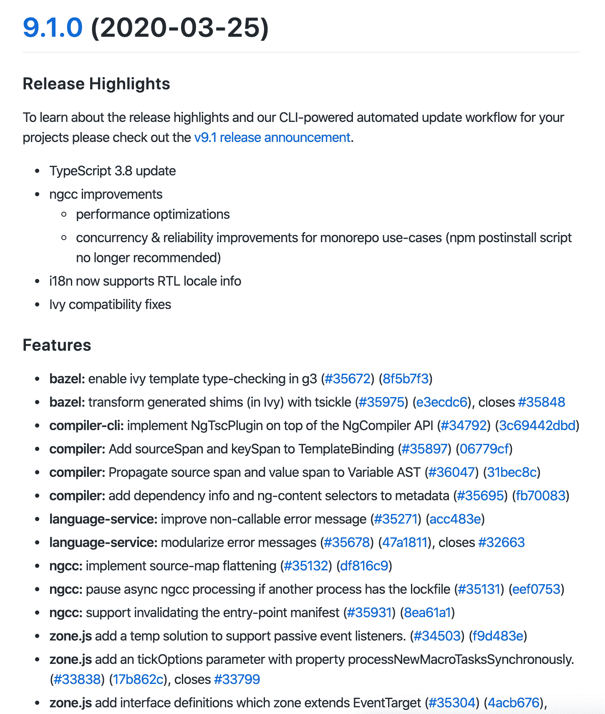
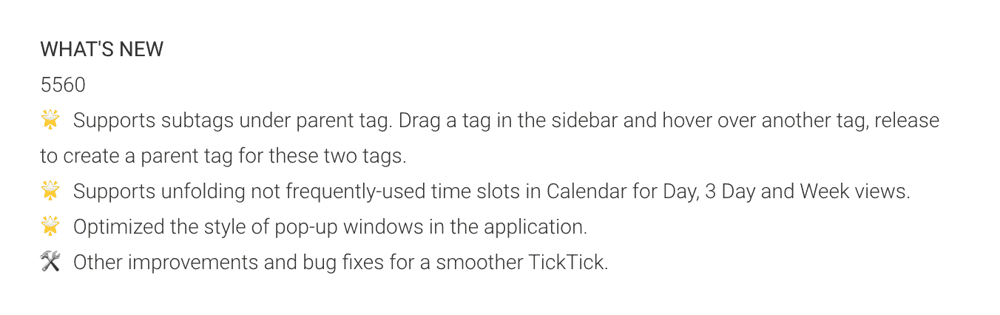
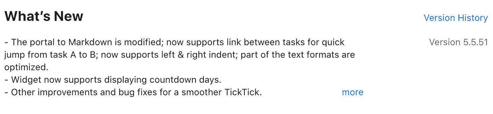
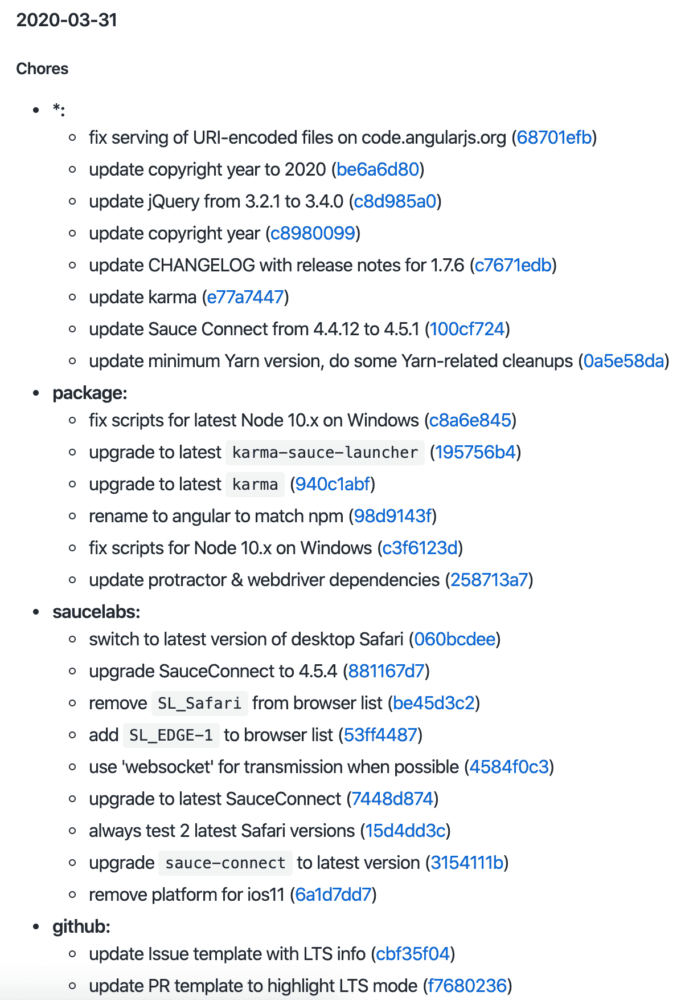

# Git 初学者指南——什么是 Changelog 以及如何生成它

> 原文：<https://www.freecodecamp.org/news/a-beginners-guide-to-git-what-is-a-changelog-and-how-to-generate-it/>

假设你是一名开发人员，你在你的一个项目中使用了 Git。您希望与用户分享您所做的更改，但不知道如何分享。好吧，那么这篇文章是给你的。

在本系列的最后一部分，我与您分享了如何编写一个好的提交消息。

我向您概述了编写一个好的提交的好处，并且我提到了生成一个 changelog 的可能性。

在本文中，您将了解什么是 changelog，以及生成它的两种方法——一种简单的方法和一种复杂的方法。

## 什么是变更日志？

changelog 是一个文件，它按时间顺序列出了您对项目所做的更改。它通常按照版本进行组织，日期后面是添加、改进和删除的特性列表。

总体而言，有两种方法可以编写变更日志:

*   通常的方法是:创建一个文本文件，开始列举你在某个特定日期所做的所有修改
*   开发人员的选择(别名懒惰选项):从提交消息自动生成您的 changelog。我有好消息要告诉你——这是你将在这篇文章中学到的东西！

> “变更日志是对项目进行的所有显著变更的日志或记录。该项目通常是一个网站或软件项目，变更日志通常包括诸如错误修复、新功能等变更的记录。”–[维基百科](https://en.wikipedia.org/wiki/Changelog)

### 为什么是必不可少的？

我想，即使是现在，你也在问自己为什么它是必不可少的，为什么你要花时间去创造它。

变更日志是你所有变更的一种总结。使用你的项目的用户和开发人员都应该很容易理解。

在一个一切都在快速发展的世界里，用户需要知道他们正在使用的网站/软件是否在变化。你可能会感到惊讶，但人们喜欢阅读你网站上的博客帖子或更新页面。

例如，对于开发人员来说，如果项目很大，了解他们正在开发的软件是如何发展的会很有趣。

或者，如果您正在处理一个开源项目，您可以在 GitHub 存储库中找到一个“CHANGELOG.md”文件。此文件旨在通知贡献者关于项目的最新更新。



CHANGELOG.md of the [Angular.js GitHub repository](https://github.com/angular/angular/blob/master/CHANGELOG.md)

### 我们在哪里能找到他们？

变更日志无处不在！好吧，他们通常有不同的风格和位置，但他们几乎出现在每个项目中。

我创建了一个简短的列表，上面有几个你可以找到变更日志的地方。

*   一篇博文。一个 changelog 可以在一篇文章下交付，逐点分享最后的特性。
*   GitHub 存储库中的“CHANGELOG.md”文件。
*   您最喜爱的网站/软件上的变更日志部分。下面是任务管理工具 TickTick 的一个例子。
*   在 Android 和 IOS 商店的“最新动态”中。



TickTick "What's new" section on Android



TickTick "What's new" section on iOS

## 变更日志自动生成

在这一部分，我们将一起生成我们的第一个变更日志。

通过完成这项任务，你将理解为什么遵循一些规则提交是有用的。

一个优秀的显式提交不需要修改，可以直接添加到 changelog 中。

如果你对生成一个没有任何个性化或美化的必要文件感兴趣，我推荐第一种方法；不然第二个更好。

**注意**:有些网站比如[会保留一个变更日志](https://keepachangelog.com/)说明你不应该只通过复制粘贴你的 git 提交来做一个变更日志(参考简单的方法)。事实上，如果你正在开发一个专业的产品，我建议尽量避免这种方式。

但是，现在有一些高级的生成器，可以让你把你的 git 日志改成 changelogs(参考复杂的方式)。

### 如何生成一个变更日志(简单的方法)

通过使用第一种方法，您不需要任何先决条件。您所需要的只是在 Git 存储库中键入几个命令。

作为一个简单的提醒，当您键入“git log”时，会显示您所有提交的列表。

```
$ git log

// Output
commit f6986f8e52c1f889c8649ec75c5abac003102999 (HEAD -> master, origin/master, origin/HEAD)
Author: Sam Katakouzinos <sam.katakouzinos@gmail.com>
Date:   Tue Mar 10 11:41:18 2020 +1100

    docs(developers): commit message format typo

    Any line of the commit message cannot be longer *than* 100 characters!

    Closes #17006

commit ff963de73ab8913bce27a1e75ac01f53e8ece1d9
Author: Chives <chivesrs@gmail.com>
Date:   Thu Feb 6 19:05:57 2020 -0500

    docs($aria): get the docs working for the service

    Closes #16945

commit 2b28c540ad7ebf4a9c3a6f108a9cb5b673d3712d
Author: comet <hjung524@gmail.com>
Date:   Mon Jan 27 19:49:55 2020 -0600

    docs(*): fix spelling errors

    Closes #16942
```

这个命令可以接受几个参数。我们将使用它们来更改输出，并获得一个改进的输出来生成我们的 changelog。

通过键入以下命令，您将得到每行一次提交的输出。

```
$ git log --oneline --decorate

// Output
f6986f8e5 (HEAD -> master, origin/master, origin/HEAD) docs(developers): commit message format typo
ff963de73 docs($aria): get the docs working for the service
2b28c540a docs(*): fix spelling errors
68701efb9 chore(*): fix serving of URI-encoded files on code.angularjs.org
c8a6e8450 chore(package): fix scripts for latest Node 10.x on Windows
0cd592f49 docs(angular.errorHandlingConfig): fix typo (wether --> whether)
a4daf1f76 docs(angular.copy): fix `getter`/`setter` formatting
be6a6d80e chore(*): update copyright year to 2020
36f17c926 docs: add mention to changelog
ff5f782b2 docs: add mention to changelog
27460db1d docs: release notes for 1.7.9
add78e620 fix(angular.merge): do not merge __proto__ property
```

这样更好，但是让我们看看下面这个能做些什么。

```
$ git log --pretty=”%s”

// Output
docs(developers): commit message format typo
docs($aria): get the docs working for the service
docs(*): fix spelling errors
chore(*): fix serving of URI-encoded files on code.angularjs.org
chore(package): fix scripts for latest Node 10.x on Windows
docs(angular.errorHandlingConfig): fix typo (wether --> whether)
docs(angular.copy): fix `getter`/`setter` formatting
chore(*): update copyright year to 2020
docs: add mention to changelog
docs: add mention to changelog
docs: release notes for 1.7.9
fix(angular.merge): do not merge __proto__ property
```

有了这个，您可以用您想要的样式打印提交列表。

“%s”对应于提交标题本身。您可以根据自己的喜好修改字符串来设置提交的样式。

在我们的例子中，我们想要创建一个列表。

```
$ git log --pretty="- %s"

// Output
- docs(developers): commit message format typo
- docs($aria): get the docs working for the service
- docs(*): fix spelling errors
- chore(*): fix serving of URI-encoded files on code.angularjs.org
- chore(package): fix scripts for latest Node 10.x on Windows
- docs(angular.errorHandlingConfig): fix typo (wether --> whether)
- docs(angular.copy): fix `getter`/`setter` formatting
- chore(*): update copyright year to 2020
- docs: add mention to changelog
- docs: add mention to changelog
- docs: release notes for 1.7.9
- fix(angular.merge): do not merge __proto__ property
```

你做到了！您创建了一个简单的变更日志。

**注意**:如果你想更进一步，更快地保存你的 changelog:不要把结果复制粘贴到一个文件中，通过键入“git log-pretty = "-% s ">changelog . MD”把它重定向到你的终端

### 如何生成变更日志(复杂的方法)

**先决条件**

我们现在将探索一种复杂的方法来生成一个变更日志。该过程背后的想法保持不变，但这次我们将使用其他工具来帮助我们。

您还记得在本系列文章的最后一部分中，我写了关于 Git 指南的文章吗？

**注意** : Git 指南是一套更好地编写提交的规则。这些准则帮助您向提交添加一些结构。

当您在项目中使用指南时，您可以使用工具来生成变更日志。大多数时候，这些工具更好，因为它们允许你创建一个 markdown 格式的变更日志。

在这个例子中，我们将使用一个简单的生成器，它符合大多数准则。它的名字是“ [generate-changelog](https://github.com/lob/generate-changelog) ”，可以在 NPM(节点包管理器)上获得。

这个工具将创建一个风格化的变更日志，但它并不是最具特色的。我决定使用它，因为它是初学者的一个极好的例子。如果你想更进一步，请参考下面的 changelog 工具列表:

这里有一些您可以使用的工具:

*   [Github 变更日志生成器](https://github.com/github-changelog-generator/github-changelog-generator)
*   [Git Chglog](https://github.com/git-chglog/git-chglog)
*   [自动变更日志](https://github.com/CookPete/auto-changelog)
*   [传统变更日志](https://github.com/conventional-changelog/conventional-changelog)

> 注意:在安装该工具之前，您需要在您的计算机上安装 NPM。如果你没有，我邀请你[关注官网](https://www.npmjs.com/get-npm)(会帮你安装 Node 和 NPM)。

要在您的计算机上安装该软件包，请在终端中键入以下命令。

```
$ npm install generate-changelog -g 
```

一旦你这样做了，它就安装好了！

**如何使用**

要使这个包工作，您需要遵循使用这个模式的指导原则——“类型(类别):描述[标志]”。在这个例子中，我将使用 Angular.js GitHub 存储库。

现在，您可以在 GitHub 存储库中的终端中键入 generate 命令。

```
$ changelog generate
```

将自动创建一个“CHANGELOG.md”文件，并以减价格式填充您的日志。

您可以在下面找到一个输出示例(使用 GitHub 这样的 markdown 阅读器)。



Auto-generated changelog with the generate-changelog tool

## 结论

我希望你喜欢这个指南，现在明白如何为你的项目创建一个变更日志。我认为这是一个很好的方式来证明为什么你应该写好的提交消息。

请随意尝试其他变更日志生成器，并将结果发送给我！

如果您有任何问题或反馈，请告诉我。

如果你想要更多这样的内容，你可以[在 Twitter](https://twitter.com/gaelgthomas/) 上关注我，在那里我会发关于 web 开发、自我完善和我作为一个全栈开发人员的旅程的推文！