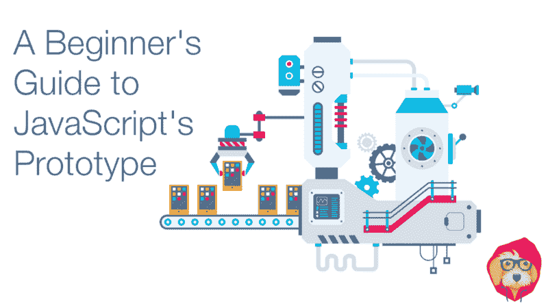

# JavaScript 原型初学者指南

> 原文：<https://www.freecodecamp.org/news/a-beginners-guide-to-javascript-s-prototype-9c049fe7b34/>

泰勒·麦金尼斯

# JavaScript 原型初学者指南



***这是我们[高级 JavaScript](https://tylermcginnis.com/courses/advanced-javascript/) 课程的一部分。如果你喜欢这篇文章，就去看看吧。***

如果不处理对象，你就无法在 JavaScript 中走得很远。它们几乎是 JavaScript 编程语言各个方面的基础。事实上，学习如何创建对象可能是你刚开始学习的第一件事。

也就是说，为了最有效地学习 JavaScript 中的原型，我们将引导我们的 inner Jr. developer 回到基础。

如果你更喜欢看视频而不是阅读这篇文章，你可以在这里做。

对象是键/值对。创建一个对象最常见的方法是用花括号`{}`，你可以用点符号给一个对象添加属性和方法。

```
let animal = {}animal.name = 'Leo'animal.energy = 10
```

```
animal.eat = function (amount) {  console.log(`${this.name} is eating.`)  this.energy += amount}
```

```
animal.sleep = function (length) {  console.log(`${this.name} is sleeping.`)  this.energy += length}
```

```
animal.play = function (length) {  console.log(`${this.name} is playing.`)  this.energy -= length}
```

简单。现在，在我们的应用程序中，我们可能需要创建多个动物。很自然，下一步是将逻辑封装在一个函数中，当我们需要创建一个新的动物时，就可以调用这个函数。我们称这个模式为`Functional Instantiation`，我们称这个函数本身为“构造函数”，因为它负责“构造”一个新对象。

#### 功能实例化

```
function Animal (name, energy) {  let animal = {}  animal.name = name  animal.energy = energy
```

```
 animal.eat = function (amount) {    console.log(`${this.name} is eating.`)    this.energy += amount  }
```

```
 animal.sleep = function (length) {    console.log(`${this.name} is sleeping.`)    this.energy += length  }
```

```
 animal.play = function (length) {    console.log(`${this.name} is playing.`)    this.energy -= length  }
```

```
 return animal}
```

```
const leo = Animal('Leo', 7)const snoop = Animal('Snoop', 10)
```

`"I thought this was an Advanced JavaScript course...?" - Your brain` **正是。我们会到达那里的。**

现在，每当我们想要创建一个新的动物(或者更广义地说，一个新的“实例”)，我们所要做的就是调用我们的`Animal`函数，将动物的`name`和`energy`级别传递给它。

这非常有效，而且非常简单。然而，您能发现这种模式的弱点吗？最大的问题，也是我们试图解决的问题，与三种方法有关:`eat`、`sleep`和`play`。这些方法不仅是动态的，而且是完全通用的。这意味着，我们没有理由像现在一样，每当创造一种新动物时，就重新创造那些方法。我们只是在浪费内存，让每个动物对象比它需要的要大。

你能想到解决办法吗？如果我们不是每次创建一个新动物都重新创建这些方法，而是将它们移动到它们自己的对象中，会怎么样？然后我们可以让每种动物都引用这个对象。我们可以称这种模式为`Functional Instantiation with Shared Methods`，冗长但有描述性。

#### 共享方法的函数实例化

```
const animalMethods = {  eat(amount) {    console.log(`${this.name} is eating.`)    this.energy += amount  },  sleep(length) {    console.log(`${this.name} is sleeping.`)    this.energy += length  },  play(length) {    console.log(`${this.name} is playing.`)    this.energy -= length  }}
```

```
function Animal (name, energy) {  let animal = {}  animal.name = name  animal.energy = energy  animal.eat = animalMethods.eat  animal.sleep = animalMethods.sleep  animal.play = animalMethods.play
```

```
 return animal}
```

```
const leo = Animal('Leo', 7)const snoop = Animal('Snoop', 10)
```

通过将共享方法移动到它们自己的对象中，并在我们的`Animal`函数中引用该对象，我们现在已经解决了内存浪费和过大动物对象的问题。

#### 对象.创建

让我们通过使用`Object.create`再次改进我们的例子。简单地说， **Object.create 允许您创建一个对象，该对象将在查找失败时委托给另一个对象**。

换句话说，Object.create 允许您创建一个对象，每当对该对象的属性查找失败时，它可以查询另一个对象以查看该对象是否具有该属性。说了很多话。让我们看一些代码。

```
const parent = {  name: 'Stacey',  age: 35,  heritage: 'Irish'}
```

```
const child = Object.create(parent)child.name = 'Ryan'child.age = 7
```

```
console.log(child.name) // Ryanconsole.log(child.age) // 7console.log(child.heritage) // Irish
```

所以在上面的例子中，因为`child`是用`Object.create(parent)`创建的，每当在`child`上有一个失败的属性查找时，JavaScript 将把那个查找委托给`parent`对象。这意味着即使`child`没有`heritage`属性，但`parent`有，当你登录`child.heritage`时，你会得到`parent`的遗产，即`Irish`。

现在`Object.create`在我们的工具库中，我们如何使用它来简化我们之前的`Animal`代码呢？我们可以使用 Object.create 来委托给`animalMethods`对象，而不是像现在这样一个一个地给动物添加所有的共享方法。为了听起来很聪明，我们把这个叫做`Functional Instantiation with Shared Methods and Object.create`？

#### 使用共享方法和 Object.create 的函数实例化

```
const animalMethods = {  eat(amount) {    console.log(`${this.name} is eating.`)    this.energy += amount  },  sleep(length) {    console.log(`${this.name} is sleeping.`)    this.energy += length  },  play(length) {    console.log(`${this.name} is playing.`)    this.energy -= length  }}
```

```
function Animal (name, energy) {  let animal = Object.create(animalMethods)  animal.name = name  animal.energy = energy
```

```
 return animal}
```

```
const leo = Animal('Leo', 7)const snoop = Animal('Snoop', 10)
```

```
leo.eat(10)snoop.play(5)
```

所以现在当我们调用`leo.eat`时，JavaScript 会在`leo`对象上寻找`eat`方法。因为 Object.create，这个查找将会失败——它将委托给`animalMethods`对象，在那里它将找到`eat`。

到目前为止，一切顺利。尽管如此，我们仍然可以做一些改进。为了在实例间共享方法，不得不管理一个单独的对象(`animalMethods`)似乎有点“笨拙”。这似乎是一个你希望在语言本身中实现的常见特性。事实证明是的，这就是你在这里的全部原因- `prototype`。

那么 JavaScript 中的`prototype`到底是什么？简单地说，JavaScript 中的每个函数都有一个引用对象的`prototype`属性。虎头蛇尾，对吧？自己测试一下吧。

```
function doThing () {}console.log(doThing.prototype) // {}
```

如果不是创建一个单独的对象来管理我们的方法(就像我们对`animalMethods`所做的那样)，而是将这些方法放在`Animal`函数的原型上，会怎么样？那么我们要做的就是，不用 Object.create 委托给`animalMethods`，我们可以用它委托给`Animal.prototype`。我们称这种模式为`Prototypal Instantiation`。

#### 原型实例化

```
function Animal (name, energy) {  let animal = Object.create(Animal.prototype)  animal.name = name  animal.energy = energy
```

```
 return animal}
```

```
Animal.prototype.eat = function (amount) {  console.log(`${this.name} is eating.`)  this.energy += amount}
```

```
Animal.prototype.sleep = function (length) {  console.log(`${this.name} is sleeping.`)  this.energy += length}
```

```
Animal.prototype.play = function (length) {  console.log(`${this.name} is playing.`)  this.energy -= length}
```

```
const leo = Animal('Leo', 7)const snoop = Animal('Snoop', 10)
```

```
leo.eat(10)snoop.play(5)
```

？？？希望你刚刚经历了一个重大的“啊哈”时刻。同样，pro `totype is`只是 JavaScript 中每个函数都有的属性，正如我们在上面看到的，它允许我们在函数的所有实例中共享方法。我们所有的功能都是一样的，但是现在不用为所有的方法管理一个单独的对象，我们可以使用另一个内置在 Ani `mal fu`函数中的对象，Ani `mal.prototype.`

`At this point we know three things:`

1.  `How to create a constructor function.`
2.  `How to add methods to the constructor function’s prototype.`
3.  `How to use Object.create to delegate failed lookups to the function’s prototype.`

`Those three tasks seem pretty foundational to any programming language. Is JavaScript really that bad that there’s no easier, “built in” way to accomplish the same thing? As you can probably guess at this point there is, and it’s by using the `new`关键词。`

JavaScript 中的关键字是在幕后做的。

构造函数，两个最重要的部分是创建对象和返回它。如果没有用`Object.create`创建对象，我们将无法在查找失败时委托给函数的原型。如果没有`return`语句，我们永远也不会得到创建的对象。

```
function Animal (name, energy) {  let animal = Object.create(Animal.prototype)  animal.name = name  animal.energy = energy
```

```
 return animal}
```

`Here’s the cool thing about `new`:当你使用`new`关键字调用一个函数时，这两行代码已经被隐式地完成了(“在引擎盖下”)，并且被创建的对象被称为`this`。`

`Using comments to show what happens under the hood and assuming the `Animal`构造函数是用`new`关键字调用的，可以改写成这样。`

```
function Animal (name, energy) {  // const this = Object.create(Animal.prototype)
```

```
 this.name = name  this.energy = energy
```

```
 // return this}
```

```
const leo = new Animal('Leo', 7)const snoop = new Animal('Snoop', 10)
```

`and without the “under the hood” comments`

```
function Animal (name, energy) {  this.name = name  this.energy = energy}
```

```
Animal.prototype.eat = function (amount) {  console.log(`${this.name} is eating.`)  this.energy += amount}
```

```
Animal.prototype.sleep = function (length) {  console.log(`${this.name} is sleeping.`)  this.energy += length}
```

```
Animal.prototype.play = function (length) {  console.log(`${this.name} is playing.`)  this.energy -= length}
```

```
const leo = new Animal('Leo', 7)const snoop = new Animal('Snoop', 10)
```

因为我们用关键字`new`调用了构造函数，所以为我们创建了`Again, this works and that the `this`对象。如果在调用函数时省略了`new`，那么这个`this`对象就不会被创建，也不会被隐式返回。我们可以在下面的例子中看到这个问题。`

```
function Animal (name, energy) {  this.name = name  this.energy = energy}
```

```
const leo = Animal('Leo', 7)console.log(leo) // undefined
```

`The name for this pattern is `Pseudoclassical Instantiation`。`

`If JavaScript isn’t your first programming language, you might be getting a little restless.`

> `*“WTH this dude just re-created a crappier version of a Class” — You*`

`For those unfamiliar, a Class allows you to create a blueprint for an object. Then whenever you create an instance of that Class, you get an object with the properties and methods defined in the blueprint.`

`Sound familiar? That’s basically what we did with our `Animal`上面的构造函数。然而，我们没有使用`class`关键字，而是使用一个常规的旧 JavaScript 函数来重新创建相同的功能。当然，这需要做一些额外的工作，也需要了解一些 JavaScript“幕后”发生的事情，但是结果是一样的。`

`Here’s the good news. JavaScript isn’t a dead language. It’s constantly being improved and added to by the [TC-39 committee](https://tylermcginnis.com/videos/ecmascript/). What that means is that even though the initial version of JavaScript didn’t support classes, there’s no reason they can’t be added to the official specification.`

`In fact, that’s exactly what the TC-39 committee did. In 2015, EcmaScript (the official JavaScript specification) 6 was released with support for Classes and the `class`关键词。让我们看看上面的`Animal`构造函数在新的类语法下会是什么样子。`

```
class Animal {  constructor(name, energy) {    this.name = name    this.energy = energy  }  eat(amount) {    console.log(`${this.name} is eating.`)    this.energy += amount  }  sleep(length) {    console.log(`${this.name} is sleeping.`)    this.energy += length  }  play(length) {    console.log(`${this.name} is playing.`)    this.energy -= length  }}
```

```
const leo = new Animal('Leo', 7)const snoop = new Animal('Snoop', 10)
```

`Pretty clean, right?`

`So if this is the new way to create classes, why did we spend so much time going over the old way? The reason for that is because the new way (with the `class` keyword)主要只是“语法上的糖”,超过了我们称之为伪经典模式的现有方式。为了*完全*理解 ES6 类的便利语法，你首先必须理解伪经典模式。`

`At this point we’ve covered the fundamentals of JavaScript’s prototype. The rest of this post will be dedicated to understanding other “good to know” topics related to it. In another post we’ll look at how we can take these fundamentals and use them to understand how inheritance works in JavaScript.`

`***If you’ve enjoyed this post, consider checking out our [Advanced JavaScript](https://tylermcginnis.com/courses/advanced-javascript/) course.***`

### `Array Methods`

`We talked in depth above about how, if you want to share methods across instances of a class, you should stick those methods on the class’ (or function’s) prototype. We can see this same pattern demonstrated if we look at the `Array`阶级。从历史上看，你可能是这样创建你的数组的:`

```
const friends = []
```

`Array`类的实例。

```
const friendsWithSugar = []
```

```
const friendsWithoutSugar = new Array()
```

`One thing you might have never thought about is how does every instance of an array have all of those built-in methods (`splice`、`slice`、`pop`等)？`

`Well as you now know, it’s because those methods live on `Array.prototype`。当您创建一个新的`Array`实例时，您使用了`new`关键字，该关键字在查找失败时设置了对`Array.prototype`的委托。`

`We can see all the array’s methods by simply logging `Array.prototype`。`

```
console.log(Array.prototype)
```

```
/*  concat: ƒn concat()  constructor: ƒn Array()  copyWithin: ƒn copyWithin()  entries: ƒn entries()  every: ƒn every()  fill: ƒn fill()  filter: ƒn filter()  find: ƒn find()  findIndex: ƒn findIndex()  forEach: ƒn forEach()  includes: ƒn includes()  indexOf: ƒn indexOf()  join: ƒn join()  keys: ƒn keys()  lastIndexOf: ƒn lastIndexOf()  length: 0n  map: ƒn map()  pop: ƒn pop()  push: ƒn push()  reduce: ƒn reduce()  reduceRight: ƒn reduceRight()  reverse: ƒn reverse()  shift: ƒn shift()  slice: ƒn slice()  some: ƒn some()  sort: ƒn sort()  splice: ƒn splice()  toLocaleString: ƒn toLocaleString()  toString: ƒn toString()  unshift: ƒn unshift()  values: ƒn values()*/
```

`The exact same logic exists for Objects as well. All objects will delegate to `Object.prototype`失败的查找，这就是为什么所有对象都有像`toString`和`hasOwnProperty`这样的方法。`

### `Static Methods`

并确定下一个需要喂养的是哪一只？我们就叫它`nextToEat`。

```
function nextToEat (animals) {  const sortedByLeastEnergy = animals.sort((a,b) => {    return a.energy - b.energy  })
```

```
 return sortedByLeastEnergy[0].name}
```

`It doesn’t make sense to have `nextToEat`住在`Animal.prototype`上，因为我们不想在所有实例之间共享它。相反，我们可以认为它更像是一个辅助方法。`

`So if `nextToEat`不应该住在`Animal.prototype`上，应该放在哪里？显而易见的答案是，我们可以将`nextToEat`放在与`Animal`类相同的范围内，然后在需要时像平常一样引用它。`

```
class Animal {  constructor(name, energy) {    this.name = name    this.energy = energy  }  eat(amount) {    console.log(`${this.name} is eating.`)    this.energy += amount  }  sleep(length) {    console.log(`${this.name} is sleeping.`)    this.energy += length  }  play(length) {    console.log(`${this.name} is playing.`)    this.energy -= length  }}
```

```
function nextToEat (animals) {  const sortedByLeastEnergy = animals.sort((a,b) => {    return a.energy - b.energy  })
```

```
 return sortedByLeastEnergy[0].name}
```

```
const leo = new Animal('Leo', 7)const snoop = new Animal('Snoop', 10)
```

```
console.log(nextToEat([leo, snoop])) // Leo
```

`Now this works, but there’s a better way.`

> `*Whenever you have a method that is specific to a class itself, but doesn’t need to be shared across instances of that class, you can add it as a `static`类的属性。*`

```
class Animal {  constructor(name, energy) {    this.name = name    this.energy = energy  }  eat(amount) {    console.log(`${this.name} is eating.`)    this.energy += amount  }  sleep(length) {    console.log(`${this.name} is sleeping.`)    this.energy += length  }  play(length) {    console.log(`${this.name} is playing.`)    this.energy -= length  }  static nextToEat(animals) {    const sortedByLeastEnergy = animals.sort((a,b) => {      return a.energy - b.energy    })
```

```
 return sortedByLeastEnergy[0].name  }}
```

`Now, because we added `nextToEat`作为类的`static`属性，它存在于`Animal`类本身(不是它的原型)上，可以使用`Animal.nextToEat`来访问。`

```
const leo = new Animal('Leo', 7)const snoop = new Animal('Snoop', 10)
```

```
console.log(Animal.nextToEat([leo, snoop])) // Leo
```

关键字会把方法直接放到类本身上。对于 ES5，同样的模式非常简单，只需手动将方法添加到函数对象中。

```
function Animal (name, energy) {  this.name = name  this.energy = energy}
```

```
Animal.prototype.eat = function (amount) {  console.log(`${this.name} is eating.`)  this.energy += amount}
```

```
Animal.prototype.sleep = function (length) {  console.log(`${this.name} is sleeping.`)  this.energy += length}
```

```
Animal.prototype.play = function (length) {  console.log(`${this.name} is playing.`)  this.energy -= length}
```

```
Animal.nextToEat = function (nextToEat) {  const sortedByLeastEnergy = animals.sort((a,b) => {    return a.energy - b.energy  })
```

```
 return sortedByLeastEnergy[0].name}
```

```
const leo = new Animal('Leo', 7)const snoop = new Animal('Snoop', 10)
```

```
console.log(Animal.nextToEat([leo, snoop])) // Leo
```

### `Getting the prototype of an object`

`Regardless of whichever pattern you used to create an object, getting that object’s prototype can be accomplished using the `Object.getPrototypeOf`法。`

```
function Animal (name, energy) {  this.name = name  this.energy = energy}
```

```
Animal.prototype.eat = function (amount) {  console.log(`${this.name} is eating.`)  this.energy += amount}
```

```
Animal.prototype.sleep = function (length) {  console.log(`${this.name} is sleeping.`)  this.energy += length}
```

```
Animal.prototype.play = function (length) {  console.log(`${this.name} is playing.`)  this.energy -= length}
```

```
const leo = new Animal('Leo', 7)const prototype = Object.getPrototypeOf(leo)
```

```
console.log(prototype)// {constructor: ƒ, eat: ƒ, sleep: ƒ, play: ƒ}
```

```
prototype === Animal.prototype // true
```

`There are two important takeaways from the code above.`

`First, you’ll notice that `proto`是一个有四种方法的对象:`constructor`、`eat`、`sleep`、`play`。有道理。我们使用`getPrototypeOf`传入实例，`leo`取回实例的原型，这是我们所有方法的所在。`

我们还没有谈到的。默认情况下，`prototype`对象将有一个`constructor`属性，该属性指向创建实例的原始函数或类。这也意味着，因为 JavaScript 默认在原型上放置了一个`constructor`属性，所以任何实例都可以通过`instance.constructor`访问它们的构造函数。

`The second important takeaway from above is that `Object.getPrototypeOf(leo) === Animal.prototype`。这也说得通。`Animal`构造函数有一个原型属性，我们可以在所有实例间共享方法，而`getPrototypeOf`允许我们看到实例本身的原型。`

```
function Animal (name, energy) {  this.name = name  this.energy = energy}
```

```
const leo = new Animal('Leo', 7)console.log(leo.constructor) // Logs the constructor function
```

这是可行的，因为在查找失败时，`Animal`的任何实例都将委托给`Animal.prototype`。因此，当您试图访问`leo.constructor`时，`leo`没有`constructor`属性，所以它会将查询委托给`Animal.prototype`(它确实有一个`constructor`属性)。如果这一段没有意义，回去看看上面的`Object.create`。

> `*You may have seen __proto__ used before to get an instances’ prototype. That’s a relic of the past. Instead, use **Object.getPrototypeOf(instance)** as we saw above.*`

### `Determining if a property lives on the prototype`

我们一直在创建的对象。假设目标是循环遍历`leo`并记录它的所有键和值。使用一个`for in`循环，可能看起来像这样:

```
function Animal (name, energy) {  this.name = name  this.energy = energy}
```

```
Animal.prototype.eat = function (amount) {  console.log(`${this.name} is eating.`)  this.energy += amount}
```

```
Animal.prototype.sleep = function (length) {  console.log(`${this.name} is sleeping.`)  this.energy += length}
```

```
Animal.prototype.play = function (length) {  console.log(`${this.name} is playing.`)  this.energy -= length}
```

```
const leo = new Animal('Leo', 7)
```

```
for(let key in leo) {  console.log(`Key: ${key}. Value: ${leo[key]}`)}
```

`What would you expect to see? Most likely, it was something like this:`

```
Key: name. Value: LeoKey: energy. Value: 7
```

`However, what you saw if you ran the code was this:`

```
Key: name. Value: LeoKey: energy. Value: 7Key: eat. Value: function (amount) {  console.log(`${this.name} is eating.`)  this.energy += amount}Key: sleep. Value: function (length) {  console.log(`${this.name} is sleeping.`)  this.energy += length}Key: play. Value: function (length) {  console.log(`${this.name} is playing.`)  this.energy -= length}
```

`Why is that? Well a `for in` loop 将遍历对象本身及其委托的原型上的所有**可枚举属性**。因为默认情况下，添加到函数原型的任何属性都是可枚举的，所以我们不仅可以看到`name`和`energy`，还可以看到原型上的所有方法——`eat`、`sleep`和`play`。`

`To fix this, we either need to specify that all of the prototype methods are non-enumerable **or** we need a way to only console.log if the property is on the `leo`对象本身，而不是`leo`在查找失败时委托给它的原型。这就是`hasOwnProperty`可以帮助我们的地方。`

``hasOwnProperty`是每个对象上的一个属性，返回一个布尔值，表明该对象是否将指定的属性作为自己的属性，而不是该对象委托给的原型的属性。这正是我们所需要的。现在有了这个新的知识，我们可以修改我们的代码来利用我们的`for in`循环中的`hasOwnProperty`。`

```
...
```

```
const leo = new Animal('Leo', 7)
```

```
for(let key in leo) {  if (leo.hasOwnProperty(key)) {    console.log(`Key: ${key}. Value: ${leo[key]}`)  }}
```

`And now what we see are only the properties that are on the `leo`对象本身而不是原型上的`leo`委托者为好。`

```
Key: name. Value: LeoKey: energy. Value: 7
```

`If you’re still a tad confused about `hasOwnProperty`，这里有一些代码可以清除它:`

```
function Animal (name, energy) {  this.name = name  this.energy = energy}
```

```
Animal.prototype.eat = function (amount) {  console.log(`${this.name} is eating.`)  this.energy += amount}
```

```
Animal.prototype.sleep = function (length) {  console.log(`${this.name} is sleeping.`)  this.energy += length}
```

```
Animal.prototype.play = function (length) {  console.log(`${this.name} is playing.`)  this.energy -= length}
```

```
const leo = new Animal('Leo', 7)
```

```
leo.hasOwnProperty('name') // trueleo.hasOwnProperty('energy') // trueleo.hasOwnProperty('eat') // falseleo.hasOwnProperty('sleep') // falseleo.hasOwnProperty('play') // false
```

### `Check if an object is an instance of a Class`

`Sometimes you want to know whether an object is an instance of a specific class. To do this, you can use the `instanceof`操作员。用例非常简单，但是如果您以前从未见过，实际的语法会有点奇怪。它是这样工作的:`

```
object instanceof Class
```

`The statement above will return true if `object`是`Class`的实例，否则为 false。回到我们的`Animal`例子，我们会有这样的东西:`

```
function Animal (name, energy) {  this.name = name  this.energy = energy}
```

```
function User () {}
```

```
const leo = new Animal('Leo', 7)
```

```
leo instanceof Animal // trueleo instanceof User // false
```

`The way that `instanceof`的作用是检查对象的原型链中是否存在`constructor.prototype`。`

`In the example above, `leo instanceof Animal`是`true`因为`Object.getPrototypeOf(leo) === Animal.prototype`。另外，`leo instanceof User`是`false`因为`Object.getPrototypeOf(leo) !== User.prototype`。`

### `Creating new agnostic constructor functions`

`Can you spot the error in the code below?`

```
function Animal (name, energy) {  this.name = name  this.energy = energy}
```

```
const leo = Animal('Leo', 7)
```

我们之前学过，当调用`Animal`构造函数时，我们需要确保用`new`关键字调用它。如果我们不这样做，那么`this`关键字将不会被创建，也不会被隐式返回。

`As a refresher, the commented out lines are what happens behind the scenes when you use the `new`函数上的关键字。`

```
function Animal (name, energy) {  // const this = Object.create(Animal.prototype)
```

```
 this.name = name  this.energy = energy
```

```
 // return this}
```

`This seems like too important of a detail to leave up to other developers to remember. Assuming we’re working on a team with other developers, is there a way we could ensure that our `Animal`构造函数总是用`new`关键字调用？事实证明是有的，而且是通过使用我们之前学过的`instanceof`操作符。`

`If the constructor was called with the `new`关键字，那么`this`构造函数的体内部将是一个`instanceof`构造函数本身。那是许多大词。下面是一些代码:`

```
function Animal (name, energy) {  if (this instanceof Animal === false) {    console.warn('Forgot to call Animal with the new keyword')  }
```

```
 this.name = name  this.energy = energy}
```

`Now instead of just logging a warning to the consumer of the function, what if we re-invoke the function, but with the `new`关键词这次？`

```
function Animal (name, energy) {  if (this instanceof Animal === false) {    return new Animal(name, energy)  }
```

```
 this.name = name  this.energy = energy}
```

用关键字`new`调用`Now regardless of if `Animal`，它仍然可以正常工作。`

### `Re-creating Object.create`

为了创建委托给构造函数原型的对象。此时，您应该知道如何在代码中使用`Object.create`。但是有一件事你可能没有想到，那就是`Object.create`实际上是如何工作的。

`In order for you to **really** understand how `Object.create`作品，我们要自己重新创作。首先，我们对`Object.create`的工作原理了解多少？`

1.  `It takes in an argument that is an object.`
2.  `It creates an object that delegates to the argument object on failed lookups.`
3.  `It returns the new created object.`

`Let’s start off with #1.`

```
Object.create = function (objToDelegateTo) { }
```

`Simple enough.`

关键字和原型在 JavaScript 中工作。

`First, inside the body of our `Object.create`实现，我们将创建一个空函数。然后，我们将这个空函数的原型设置为参数对象。然后，为了创建一个新对象，我们将使用关键字`new`调用我们的空函数。如果我们返回新创建的对象，这也将完成#3。`

```
Object.create = function (objToDelegateTo) {  function Fn(){}  Fn.prototype = objToDelegateTo  return new Fn()}
```

`Wild. Let’s walk through it.`

在上面的代码中，它带有一个`prototype`属性。当我们用`new`关键字调用它时，我们知道我们将得到的是一个对象，它将在查找失败时委托给函数的原型。如果我们覆盖了函数的原型，那么我们就可以决定在查找失败时委托给哪个对象。

当调用`Object.create`时，`So in our example above, we override `Fn`的原型带有传入的对象，我们称之为`objToDelegateTo`。`

> `*Note that we’re only supporting a single argument to Object.create. The official implementation also supports a second, optional argument which allow you to add more properties to the created object.*`

### `Arrow Functions`

`Arrow functions don’t have their own `this`关键词。因此，箭头函数不能是构造函数。如果你试图用关键字`new`调用一个箭头函数，它会抛出一个错误。`

```
const Animal = () => {}
```

```
const leo = new Animal() // Error: Animal is not a constructor
```

`Also, because we demonstrated above that the pseudoclassical pattern can’t be used with arrow functions, arrow functions also don’t have a `prototype`财产。`

```
const Animal = () => {}console.log(Animal.prototype) // undefined
```

`***This post was originally published at [tylermcginnis.com](https://tylermcginnis.com/beginners-guide-to-javascript-prototype/) and is part of our [Advanced JavaScript](https://tylermcginnis.com/courses/advanced-javascript) course.***`

`***Connect with [Tyler](http://twitter.com/tylermcginnis) on Twitter!***`