# 在 Linux Shell 中生存的初学者指南

> 原文：<https://www.freecodecamp.org/news/a-beginners-guide-to-surviving-in-the-linux-shell-cda0f5a0698c/>

作者:普兰杰·莫汉

在本文中，您将通过学习十个最有用的 Linux 命令来学习如何消除对 Linux shell 的恐惧。

> 生活中所有优秀的人似乎都喜欢 LINUX - 史蒂夫·沃兹尼亚克

### Linux Shell/命令行

黑屏白字无图，没错！乍一看，Linux Shell 确实令人望而生畏，但它比任何图形工具都强大得多。

Linux 驱动着世界上 70%的服务器和 90%的超级计算机。Linux 的学习曲线很陡，要学习它，你需要在里面生活一段时间。一旦你擅长命令行，你就获得了一种让你与众不同的技能。

本文介绍并解释了在 Linux shell 环境中生存所需的 10 个最有用的 Linux 命令。阅读完本文后，您应该能够使用命令行执行所有基本任务，如创建和删除目录、编辑文本文件等。

### 为什么要学习 Linux 命令行？

#### 擅长使用命令行的好处。

*   你对你的操作系统有了更多的了解。
    shell 比图形文件浏览器更直接地向你展示文件系统，它让你了解 OS 的层次和结构。您还可以直接使用配置文件，这使您能够更有效地控制您的操作系统。
*   你可以远程控制电脑和服务器。
    像 **SSH** 和 **Telnet** 这样的网络协议允许你远程连接到网络上的计算机，但是它们只为你提供外壳而不是图形界面。因此，只有在熟悉 shell 的情况下，才能使用这些协议。
*   **不需要任何人的帮助就可以安装 Arch Linux**
    Arch Linux 是一个 Linux 发行版，它的安装方式让很多新手感到害怕。要安装 Arch Linux，您需要使用 shell 手动完成从磁盘分区到用户创建的所有步骤。你需要非常擅长 Linux shell 来安装 Arch Linux。
*   你可以通过配置和管理 Linux 服务器获得报酬。
    大多数公司都有一个职位名称为“Linux 系统管理员”。该职位人员的职责是维护 Linux 计算机，并根据要求对其进行更改和配置。担任这个角色的人必须非常擅长 Linux Shell，并且应该知道配置 Linux 系统所需的所有命令。

### Linux 命令提示符

当您打开 Linux 发行版中的终端应用程序时，您会看到一个黑屏，上面印着您的姓名和其他一些信息。之后，您将看到一个准备接收命令的光标。提示符显示的信息是可配置的，但超出了本教程的范围。

[username@hostname current-directory]$

该提示符提供了有关用户名、主机名(您的计算机在网络上显示的名称)、当前工作目录和一个“$”的信息，这表示您是一个普通用户，而不是根用户(根用户在 Linux 中拥有所有特权和权利)。

### 10 个基本命令

这 10 个命令将使您能够以一种方式体验 shell，在这种方式下，您将能够执行您一直在图形用户界面环境中执行的所有任务，如创建和删除目录、编写、编辑和删除文件等。，在外壳中没有面临任何问题。

### 1.显示当前工作目录

print working directory (pwd)命令打印您正在工作的目录的完整路径。当您打开终端应用程序时，它通常会在您的个人文件夹中启动 shell，因此运行`pwd`命令将会显示“/home/(您的用户名)”。~ '表示提示中的 home。

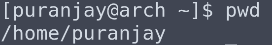

pwd command in the home folder

### 2.激光唱片

更改目录(cd)命令将工作目录更改为 cd 后给出名称的目录。写`cd myfolder`会把工作目录改成‘my folder’并且它的名字会出现在提示中，但是如果‘my folder’在当前目录中不存在就会抛出错误。

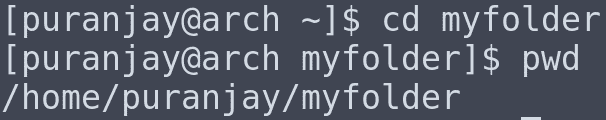

cd to myfolder and then running pwd

在上述步骤后运行“pwd”命令将显示我们切换到的目录的路径。

运行`cd ..`命令会将工作目录更改为层级中的上一个目录。在这种情况下，它将变回主目录。

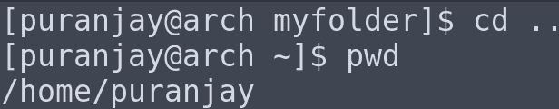

running ‘cd ..’ to change to the previous directory and then running pwd.

您还可以提供您希望切换到的目录的绝对路径。绝对路径是从根目录开始的完整路径。例如，“myfolder”的绝对路径将是“/home/puranjay/myfolder”，这与 pwd 命令显示的路径相同。

### 3.限位开关（Limit Switch）

List (ls)命令打印当前工作目录的内容，它打印当前目录中所有文件和目录的名称。运行“我的文件夹”目录中的`ls`将显示其内容，即文件 1、文件 2 等。

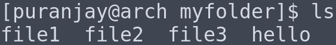

ls command running in the myfolder directory

您还可以提供您希望查看其内容的目录的绝对路径。例如，如果工作目录是 home 并且运行了【the shell 将打印根目录(/)下的“boot”文件夹的内容。工作目录不会改变。此外,“boot”和“/boot”对 shell 来说并不意味着相同的含义。“boot”表示当前工作目录中的目录或文件，而“/boot”表示根(/)目录中的目录或文件。运行`ls boot`会打印一条错误消息，因为当前工作目录(home)中没有名为‘boot’的文件或文件夹。

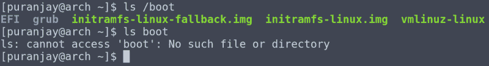

ls /boot shows contents of boot directory in root, but ls boot shows an error

### 4.男人

man(手动)命令将打开 man 之后给出的命令的手册页。手册页包含有关 Linux 中所有可用命令的文档，它们提供了有关正确使用该命令以及该命令可用的不同选项的信息。

要退出手册页，请按“ **q** ”。

例如，运行`man ls`将打开 ls 命令的手册页。

The manual page for ls command

### 5.mkdir

Make-directory (mkdir)命令在当前工作目录中创建一个新目录，其名称与该命令后给出的名称相同。例如，运行`mkdir hello`将在当前目录下创建一个名为‘hello’的文件夹。创建目录后，运行`cd hello`会将当前目录更改为新建的‘hello’目录，‘~’会更改为‘hello’。

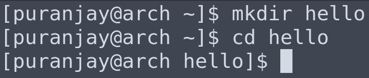

creating a directory named ‘hello’ and then changing into it.

### 6 元

Remove directory (rmdir)移除/删除命令后给定名称的目录。运行`rmdir hello`将删除之前创建的‘hello’目录。无法通过在要删除的同一目录中运行 rmdir 来删除目录。可以使用命令`cd ..`来退出目录，然后可以运行`rmdir hello`来删除它。

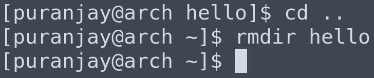

moving out of ‘hello’ directory and then deleting it.

如果一个目录不为空，并且运行`rmdir`删除该目录，那么它将失败，并显示一条错误消息，指出被删除的目录不为空。

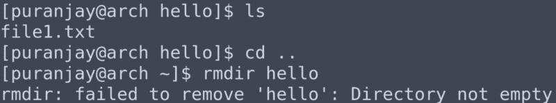

‘hello’ contains a file named ‘file1’, therefore rmdir fails with an error.

为了克服这个错误并删除非空的目录，可以将`-- ignore-fail-on-non-empty`标志传递给 rmdir。

例如，运行 rmdir `--ignore-fail-on-non-empty hello`将删除 hello 目录，尽管它不是空的。

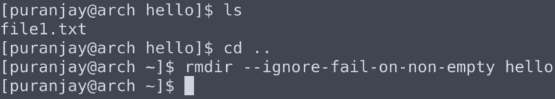

deleting hello folder which is not empty

### 7.清楚的

Clear 命令清除 shell 并删除所有以前的输出。当你想清理终端上的杂物时，它就派上了用场。

### 8.毫微；纤（10 的负九次方）

Nano 是一个基于终端的文本编辑器，可以用来创建和编辑文本文件，也可以编辑配置文件。它类似于记事本等任何其他文本编辑器，唯一的区别是它通过外壳工作，没有 GUI。它预装在大多数 Linux 发行版中。
在 shell 中运行`nano`会打开 nano 文本编辑器，并提供一个可以键入文本的界面。

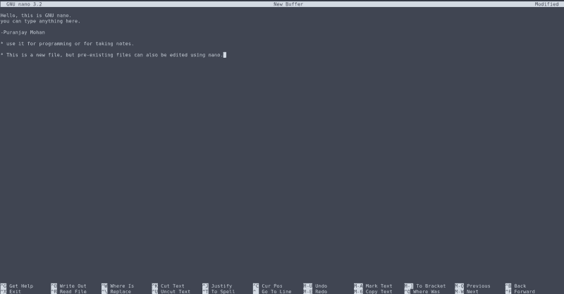

Nano running in the Linux Terminal

要退出 nano，按`CTRL+X`，它会问你是否要保存文件。

Pressing ‘Y’ will save the file.

如果您按“Y”，它将要求您输入文件名，键入文件名后按“enter”将关闭 nano。将在当前目录中创建一个以您给定的名称命名的文件。

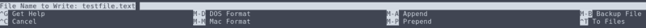

saving the file as testfile.txt

### **9。猫**

Cat 命令用于在 shell 控制台上打印一个文件的内容，它主要用于当您想要查看文件中的内容时。要使用 cat 命令，可以在 shell 中运行`cat filename`，它会在屏幕上输出文件的内容。

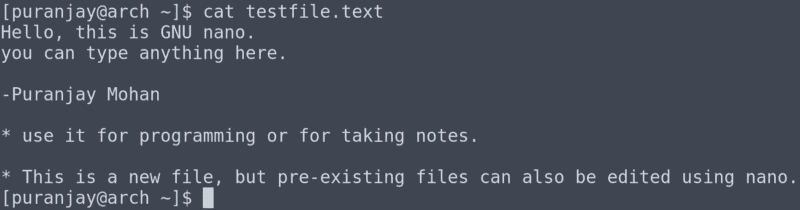

running cat command on the previously created text file.

### 10.空间

移除(rm)命令类似于`rmdir`命令，但它删除文件而不是目录。要使用这个命令，`rm filename`可以在 shell 中运行。如果文件存在于当前目录中，它将删除该文件。

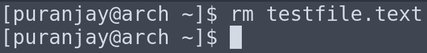

deleting the previously created text file.

### **11。mv(奖金命令)**

mv 命令可用于移动或重命名文件。重命名只是将文件移动到另一个名称。mv 命令的格式为`mv source destination`。如果源和目标在当前工作目录之外，您需要提供完整的路径。

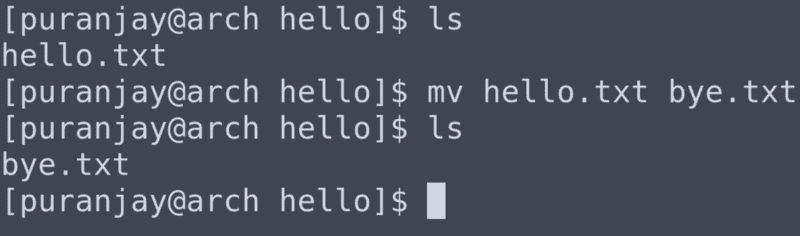

### 需要记住的旁注和要点:

*   Linux shell 区分大小写，因此“桌面”和“桌面”并不意味着相同的意思。
*   在 Linux 中写路径时要小心，因为“boot”和“/boot”是两个不同的文件夹。
*   掌握 Linux shell 的唯一方法是花时间在它上面并每天使用它。如果你的主操作系统是 Linux，这是一个额外的优势。
*   你在 Linux 操作系统中做的任何事情，试着找到一种方法来做同样的事情，但是是在 shell 中。[堆栈溢出](https://stackoverflow.com/)是一个回答 Linux 问题的好地方。
*   如果你真的想磨练你的 Linux 技能，成为一名 Linux 高手，那么你可以读读 [Linux 圣经](https://www.oreilly.com/library/view/linux-bible-9th/9781118999875/)，这是有史以来最深入的 Linux 指南。

### 结论:

我第一次接触 Linux 终端是在 5 年前，我也非常害怕它。这五年来，我每天都在学习一些关于 Linux 的新东西。你在学习 Linux 时所花费的精力和时间是完全值得的，绝不会白费。Linux 是最大也是最古老的开源项目，学习它是为它做贡献的第一步。

随意指出你发现的任何错误，建设性的批评没有坏处。

谢谢你。