# 面向 Alexa 的新 AWS Python SDK 初学者指南

> 原文：<https://www.freecodecamp.org/news/a-beginners-guide-to-the-new-aws-python-sdk-for-alexa-105c0ed45f4e/>

依洛博罗威

# 面向 Alexa 的新 AWS Python SDK 初学者指南


Photo by [Wang Xi](https://unsplash.com/photos/KbiV1er60Wk?utm_source=unsplash&utm_medium=referral&utm_content=creditCopyText) on [Unsplash](https://unsplash.com/?utm_source=unsplash&utm_medium=referral&utm_content=creditCopyText)

亚马逊网络服务公司(AWS)最近在其 Alexa 家族中增加了一个新的 [Python SDK](https://github.com/alexa-labs/alexa-skills-kit-sdk-for-python) 。它目前处于测试阶段，但这不应该阻止我们获得一些曝光。

**我们要做的:**一个非常简单的语音应用程序，可以说出关于猫的 10 个[事实](https://www.factretriever.com/cat-facts)。

**为什么我们要构建它:**这款应用的概念非常简单，我们可以专注于如何使用 SDK，以及如何使用 DynamoDB 为我们的应用保存最重要的数据。

**本教程结束时，你将带着:**

1.  每个主要的 Alexa 请求类型做什么，以及如何建立你自己的请求类型。
2.  了解如何在 DynamoDB 中保存应用程序的数据并避免陷阱。
3.  查看 Alexa 的两种 Python 风格，并选择您喜欢的一种。
4.  Python 技巧。
5.  Alexa 控制台提示。

**先决条件:**

1. [AWS 账户](https://aws.amazon.com/free/)

2. [AWS 开发者账户](https://developer.amazon.com/alexa)(如果你想在你注册的设备上测试，比如 Echo，用你的亚马逊账户注册同一个邮箱)

3.Python 3.6

如果你还和我在一起，我们开始吧！

### **Alexa:幕后发生了什么(大图)**

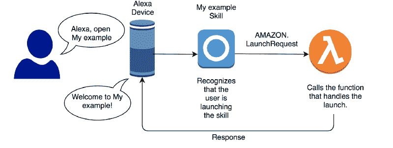

为了说明与 Alexa 交互背后的主要思想，我们来看看一个名为“我的例子”的虚构技能的推出。

当用户说:“打开我的例子”时，“我的例子”位是技能的**调用名**，Alexa 用它来交流。用户的设备将用户所说的传递给“我的例子”技能。

此时，Alexa 使用技能的**交互模型**来理解用户的请求。交互模型是一个 JSON 文件，它将用户所说的内容映射到一个请求类型。在这种情况下，它会将其映射到内置的`AMAZON.LaunchRequest`。

接下来，它调用它的后端，一个 **AWS Lambda 函数**，它接收识别的请求。

Lambda 搜索可以处理 LaunchRequest 的函数并执行它。

这个函数然后返回一个响应，这个响应一直被发送到用户的设备。在这一点上，“我的例子”技能将迎接他们，并将能够接受进一步的用户请求。

**言归正传！**

### **架构概述**

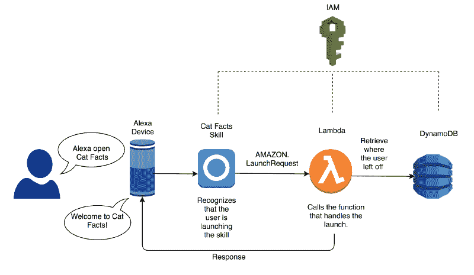

现在我们已经明确了 Alexa 技能调用背后的主要思想，让我们来探索如何创建我们的样本“猫事实”技能。

该架构类似于我们讨论过的:Alexa 技能调用 Lambda 函数来处理识别的请求，并返回响应以反馈给用户。

我们增加了两个功能: **DynamoDB** 和 **IAM。**

#### DynamoDB

我们的技能是跟踪用户从我们的十个卡特彼勒事实列表中听到的最后一个事实的索引。它使用 DynamoDB 来保存索引和用户打开我们技能的次数。

#### **我是**

我们在两个地方需要它:

*   首先，我们的 Lambda 能够与 DynamoDB 交互，以持久化我们的用户数据。我们还需要授予它 CloudWatchLogs 权限，以写入有关我们收到的请求的重要细节。
*   第二，我们需要一个 Lambda 权限来允许我们的 Alexa 技能调用我们的 Lambda 作为它的后端。

### **实施**

#### Alexa 技能

进入你的 Alexa 开发者控制台，点击“创造技能”。将该技能命名为“Cat Facts ”,并选择您喜欢的英语语言环境。

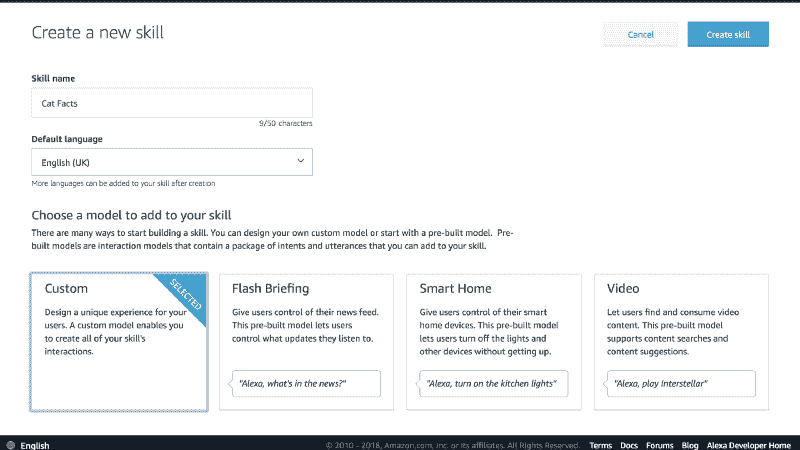

添加调用名称:“cat facts”。

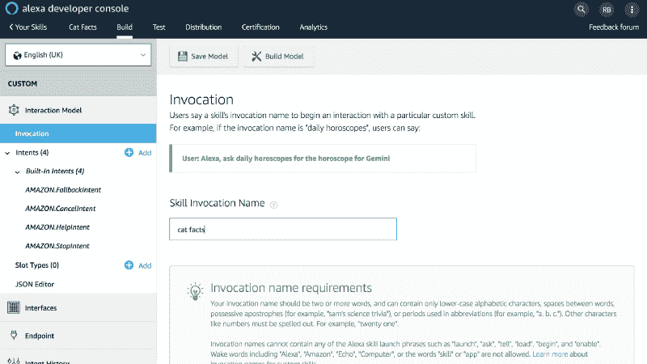

将以下交互模型添加到控制台的 JSON 编辑器中:

```
{    "interactionModel": {        "languageModel": {            "invocationName": "cat facts",            "intents": [                {                    "name": "AMAZON.CancelIntent",                    "samples": []                },                {                    "name": "AMAZON.HelpIntent",                    "samples": []                },                {                    "name": "AMAZON.StopIntent",                    "samples": []                },                {                    "name": "AMAZON.StartOverIntent",                    "samples": [                        "start",                        "start a new game",                        "restart",                        "restart game"                    ]                },                {                    "name": "AMAZON.YesIntent",                    "samples": []                },                {                    "name": "AMAZON.NoIntent",                    "samples": []                },                {                    "name": "AMAZON.FallbackIntent",                    "samples": []                },                {                    "name": "FactNumberIntent",                    "slots": [                        {                            "name": "fact_number",                            "type": "AMAZON.NUMBER"                        }                    ],                    "samples": [                        "{fact_number}",                        "I want {fact_number}",                        "I want fact {fact_number}",                        "I want fact number {fact_number}",                        "Tell me {fact_number}",                        "Tell me fact {fact_number}",                        "Tell me fact number {fact_number}"                    ]                }            ],            "types": []        }    }}
```

单击“保存模型”按钮。

#### **提示:**

对于 AWS 资源，使用一个 [Alexa 支持的区域](https://developer.amazon.com/docs/custom-skills/host-a-custom-skill-as-an-aws-lambda-function.html#about-lambda-functions-and-custom-skills):

*   亚太地区(东京)
*   欧盟(爱尔兰)
*   美国东部(北弗吉尼亚)
*   美国西部(俄勒冈州)

#### DynamoDB 表

在控制台中，转到 DynamoDB 并创建一个名为“cat_facts”的新表。将分区键命名为:“id”。

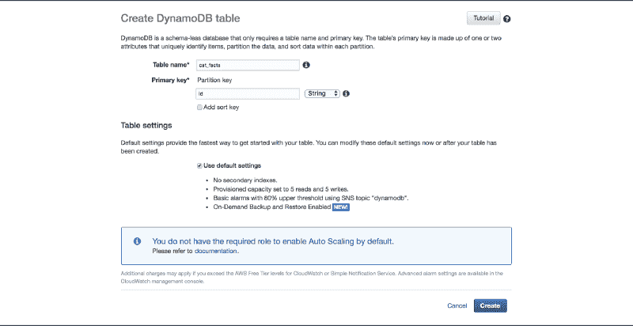

#### InternationalAssociationofMachinists 国际机械师协会

我们现在将创建 IAM 策略，并将其附加到 Lambda 的角色上。

进入“服务”->“IAM”->“策略”，点击“创建策略”。

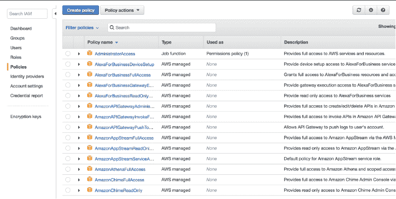

然后在 JSON 编辑器中粘贴下面的策略，并点击“Review policy”。

```
{    "Version": "2012-10-17",    "Statement": [        {            "Sid": "",            "Effect": "Allow",            "Action": [                "dynamodb:BatchGetItem",                "dynamodb:BatchWriteItem",                "dynamodb:PutItem",                "dynamodb:ListTables",                "dynamodb:DeleteItem",                "dynamodb:Scan",                "dynamodb:ListTagsOfResource",                "dynamodb:Query",                "dynamodb:UpdateItem",                "dynamodb:DescribeTimeToLive",                "dynamodb:CreateTable",                "dynamodb:DescribeTable",                "dynamodb:GetItem",                "dynamodb:DescribeLimits",                "dynamodb:UpdateTable",                "logs:CreateLogGroup",                "logs:PutLogEvents",                "logs:CreateLogStream"            ],            "Resource": "*"        }    ]}
```

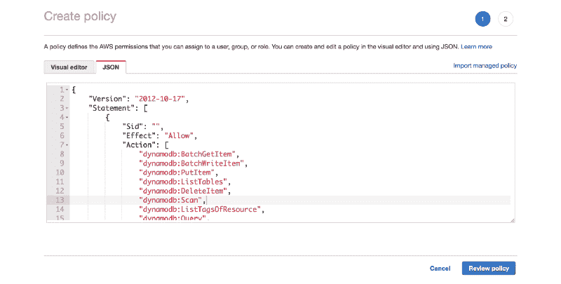

将策略命名为“Cat_Facts_Policy ”,并选择“Create policy”完成。

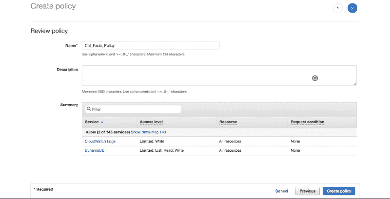

然后，我们希望将这个策略附加到 Lambda 角色。回到“IAM”->“角色”，选择“创建角色”。

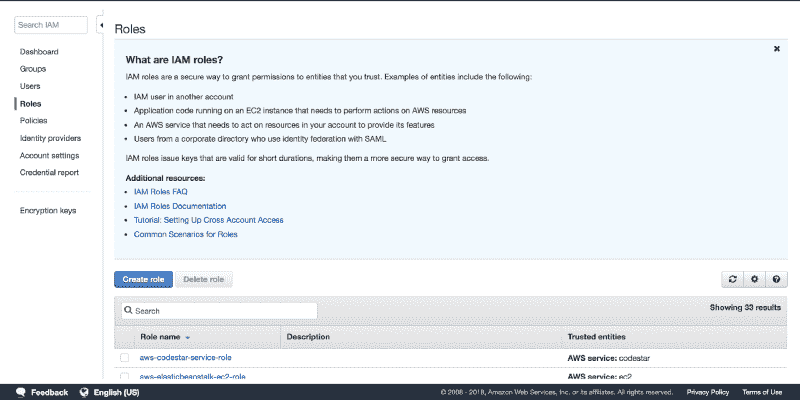

然后我们选择“Lambda”服务，点击“下一步:权限”。

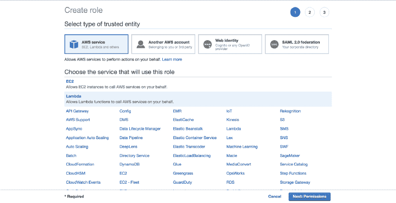

我们附上“Cat_Facts_Policy”并点击“下一步:审查”。

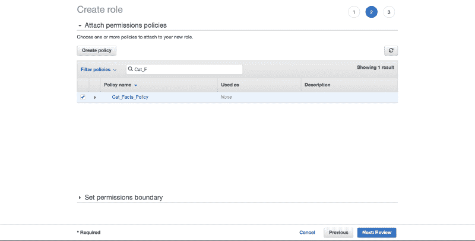

最后，我们将角色命名为“Cat_Facts_Lambda_Role ”,并单击“Create role”。

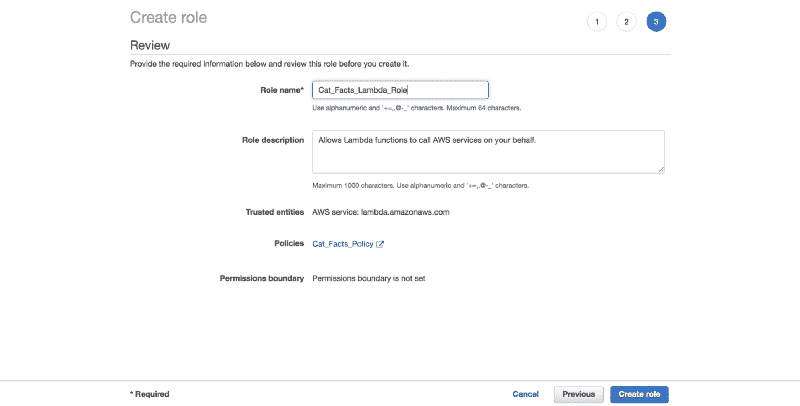

#### λ代码

在您的终端中，创建一个新文件夹:

`mkdir alexa_cat_facts_skill`

在此文件夹中，为 Lambda 创建一个新目录:

```
cd alexa_cat_facts_skill/mkdir lambda
```

在 lambda 文件夹中，创建一个新的虚拟环境。虚拟 env 允许我们将技能库与任何其他 Python 项目中的库分开。

```
cd lambdapython3 -m venv catfactsenvsource catfactsenv/bin/activatepip install ask-sdkdeactivate
```

**Windows 提示**:要激活虚拟环境，运行以下命令:`catfactsenv\Scripts\activate.bat`

### **类和装饰器 Python 样式**

Python SDK 为我们提供了两种编写 Alexa 交互的方法:要么使用类，要么使用 decorators。

现在，我们将对这两种风格进行比较，同时查看我们希望在应用程序中支持的请求。我们将实现完全相同的功能。

创建两个新的 Python 文件，每种样式一个:

```
touch catfacts_classes_lambda.pytouch catfacts_decorators_lambda.py
```

#### **进口**

在这两种情况下，我们都导入“os”模块来检索传递给 Lambda 的任何环境变量——在这种情况下，是 DynamoDB 表的名称来保存我们的用户数据。

SkillBuilders 是一些类，它们使我们可以轻松地附加组件，这些组件可以处理用户的请求并生成适当的响应。

我们导入了“ **StandardSkillBuilder** ”，它提供了开箱即用的 DynamoDB 支持。它还集成了默认的 API 客户端，获取用户设备的基本信息。

我们创建一个新的实例，并将 DynamoDB 表的名称传递给它。我们想使用 Alexa 给我们的用户 id 作为表的分区键。我们通过指定一个名为`user_id_partition_keygen`的内置助手函数来实现这一点，该函数从传入的请求中提取用户的 id。

我们包含了`is_request_type, is_intent_name`函数来帮助我们稍后确定技能已经发送的请求。

我们导入`ask_sdk_dynamodb`来从我们的 Dynamo 数据中提取信息。

#### **类**

在类的例子中，我们引入了四个抽象类，我们将为我们的工作技能实现它们:

*   `AbstractRequestHandler` —这个类能够处理用户的请求并返回适当的响应
*   `AbstractExceptionHandler` —用于处理异常
*   `AbstractRequestInterceptor` —在请求之前执行
*   `AbstractResponseInterceptor` —在请求后执行

#### 装修工

#### 小费

我们可以通过设置`auto_create_table=True`在 Lambda 中创建 DynamoDB 表。问题是这是一个异步函数，所以应用程序的第一个用户在初始化表时会遇到错误。

### **数据**


Photo by [Tucker Good](https://unsplash.com/photos/VvO8e8n0Ffg?utm_source=unsplash&utm_medium=referral&utm_content=creditCopyText) on [Unsplash](https://unsplash.com/?utm_source=unsplash&utm_medium=referral&utm_content=creditCopyText)

对于这两个版本的代码，我们将十个 cat 事实存储在一个列表中。

我们将查看需要实现一次的每个抽象类，然后关注代码，因为语法保持不变。


Photo by [Rahul Chakraborty](https://unsplash.com/photos/E_mHYosg98k?utm_source=unsplash&utm_medium=referral&utm_content=creditCopyText) on [Unsplash](https://unsplash.com/search/photos/alexa?utm_source=unsplash&utm_medium=referral&utm_content=creditCopyText)

### **HandlerInput**

每当我们需要处理一个请求、一个异常，或者在我们处理它之前或之后拦截一个请求时，使这成为可能的是一个 **HandlerInput** (在代码中，`handler_input` **)** 对象。它包含了我们理解技能状态所需的所有内容。

HandlerInput 提供了以下属性供我们使用:

*   `request_envelope` : 整个请求体
*   `atributes_manager:` 访问请求、会话和持久属性的简单方法
*   `service_client_factory` : 构建 API 客户端，可以为我们执行一些功能，比如检索用户的姓名和地址，或者进行购买
*   `response_builder` : 构建我们想要传递给用户的响应的方式
*   `context` : 运行技能代码的服务传递的可选对象。对于 Lambda 后端，这是上下文对象，它为我们提供了 AWS 终止 Lambda 之前的剩余时间等信息。

### **启动请求**


Photo by [SpaceX](https://unsplash.com/photos/OHOU-5UVIYQ?utm_source=unsplash&utm_medium=referral&utm_content=creditCopyText) on [Unsplash](https://unsplash.com/search/photos/launch?utm_source=unsplash&utm_medium=referral&utm_content=creditCopyText)

#### ***类***

对于所有映射到意图的请求类型，我们需要实现`AbstractRequestHandler`类方法`can_handle`和`handle`。

我们首先确定该类是否可以处理传入的请求。为此，我们使用`is_request_type`功能。这将接受一个请求类型—在我们的例子中，**启动请求** — 并返回一个谓词函数。然后我们将`handler_input`传递给这个谓词，它检查传入的请求是否正在启动应用程序。

如果这是一个**发射请求**，我们可以处理它。因为发布是我们应用程序的门户，我们想看看这个用户以前是否使用过我们的应用程序，这样我们就可以定制他们的体验。我们通过使用`handler_input`的`attributes_manager`属性从 DynamoDB cat_facts 表中检索`persistent_attributes` 来实现这一点。

在幕后，它调用我们用来创建`StandardSkillBuilder` 实例**的`partition_keygen`函数。**

在我们的例子中，我们感兴趣的是让**用户的标识符**成为分区键。一旦它使用这个函数从请求的信封中检索到用户 id，它就查询 DynamoDB 表的“Id”列，查看我们的表中是否有这个用户的条目。如果有，它返回一个包含所有属性名和值的字典，否则返回一个空字典。

如果没有匹配，我们记录这个用户以前没有玩过我们的游戏。此外，我们还从 cat_facts 列表中添加了当前事实的索引，该索引为-1，因为用户没有听到任何事实。

我们将`persistent_attributes` 的内容指向`session_attributes`。每当我们修改一个字段时，我们将在整个应用程序中使用会话属性。这不仅可以帮助我们维护应用程序的状态，还可以避免对 DynamoDB 表进行不必要的调用。

为了演示这个功能，我们假设用户可以玩游戏，只要他们没有听完所有的十个事实。

如果他们听完了所有的事实，我们会问他们是否想重新开始。如果他们想重新开始，我们开始从第一个到最后一个按升序播放事实。

然后我们用`response_builder` 来创建我们的响应。我们用它的`speak` 功能让用户的设备说出响应。如果他们在八秒钟内没有回应,“询问”命令会自动重新提示他们回答。

#### 装修工

处理程序代码与类版本的相同。语法的不同之处在于我们使用了`StandardSkillBuilder`对象的`request_handler`函数来修饰我们的函数。我们必须给它传递一个参数`can_handle_func`，它必须映射到一个函数。我们使用同样的`is_request_type` 方法，它返回了这个装饰器工作所必需的函数。

#### **Python 提示:**

我们使用了`attr.set_default(“facts_index”, -1)`，它检查我们的“attr”字典中是否有一个`facts_index`键，如果没有，就将它设置为-1。否则不修改该值。

对于 Python 3.6，我们可以使用“f”字符串或格式化字符串，它们是在运行时计算的表达式。它们比其他格式更快，可读性更强。

### **FactNumberIntent**

这是我们定义的**自定义**请求类型。我们想让我们的用户要求从 1 到 10 的事实编号，除了按顺序通过事实列表。

#### 班级

这里有趣的一点是，这个请求将通过一个插槽传递给我们用户想要的事实的编号。槽是给予意图的参数。

在我们在 Alexa 控制台中定义的**交互模型**中，我们告诉 Alexa，我们可以支持用户说出一个数字，它应该通过内置的`Amazon.NUMBER`映射到一个数字:

```
{                    "name": "FactNumberIntent",                    "slots": [                        {                            "name": "fact_number",                            "type": "AMAZON.NUMBER"                        }                    ],                    "samples": [                        "{fact_number}",                        "I want {fact_number}",                        "I want fact {fact_number}",                        "I want fact number {fact_number}",                        "Tell me {fact_number}",                        "Tell me fact {fact_number}",                        "Tell me fact number {fact_number}"                    ]                }
```

从λ方面来说，我们知道我们会收到一个数。我们从 intent 中获取所有的槽，然后将这个值转换成一个整数。

我们确保数字可以映射到一个索引，并返回事实。否则，我们会要求用户提供我们支持的不同号码。

我们使用`is_intent_name`函数来确定我们正在处理`FactNumberIntent`。

#### ***装修工***

### **StartOverIntent**

这是一个内置的亚马逊意图，用于重新启动游戏、音轨或交易。在我们的例子中，重启意味着重置`facts_index`。

#### ***类***

#### ***装修工***

### 帮助意向:

内置的亚马逊意图来引导用户。

#### ***类***

#### ***装修工***


Photo by [John Matychuk](https://unsplash.com/photos/dJdcb11aboQ?utm_source=unsplash&utm_medium=referral&utm_content=creditCopyText) on [Unsplash](https://unsplash.com/search/photos/stop?utm_source=unsplash&utm_medium=referral&utm_content=creditCopyText)

### 停止或取消

在这里，我们将内置意图`AMAZON.StopIntent`和`AMAZON.CancelIntent`的处理合并到**中，通过在`response_builder`中将`set_should_end_session`设置为“真”来显式结束**用户的会话。

#### ***类***

我们通过调用助手函数`persist_user_attributes`将收集的`session_attributes`保存在 DynamoDB 中。我们还增加了用户与我们的应用程序互动的次数。

`save_persistent_attributes`函数将属性保存到 DynamoDB 中。这使用了 skill builder 实例的`partition_keygen`函数来获取 userId 以用作分区键。这是在幕后完成的。

#### ***装潢师* :**

对于`can_handle_func`，我们正在使用 Python 的 lambda 操作符创建自己的内联函数，在这里我们传入`handler_input`来对照`StopIntent`和`CancelIntent`进行检查。在这种情况下，我们必须用这两个输入显式调用`is_intent_name`函数，它将返回一个布尔值。因为我们使用 lambda，结果将是一个**谓词函数**，这正是`can_handle_func`所需要的。

### **会话趋势查询**

我们使用`is_request_type`函数来确定会话是否已经终止。当用户说“退出”时就会发生这种情况——我们没有收到可以映射到任何意图的响应，或者发生错误。当使用`set_should_end_session`显式结束会话时，这是**而不是**被调用，所以我们必须**确保**在两种情况下都保持属性。

#### ***类***

#### ***装修工***

### 是意向


Photo by [Jon Tyson](https://unsplash.com/photos/qAZO-wu3tik?utm_source=unsplash&utm_medium=referral&utm_content=creditCopyText) on [Unsplash](https://unsplash.com/search/photos/yes?utm_source=unsplash&utm_medium=referral&utm_content=creditCopyText)

这是对是/否问题的肯定回答的固有意图。我们保持最基本的东西。我们检查是否可以检索到新的事实，如果不能，我们要求用户重新开始游戏。否则，我们告诉他们事实，并问他们是否想听另一个。

#### **类**

#### ***装修工***

### ***夜***

这是对是/否问题的否定回答的固有意图。我们选择结束会话，并将会话属性保存在 DynamoDB 中。

#### ***类***

#### ***装修工***

### 备用

另一个内置的 AMAZON 意图是在英语环境中编写时支持的。

当用户说了一些不符合我们技能意图的话时，它提供了一个后备机制。

#### ***类***

#### ***装修工***

### 所有例外


Photo by [FuYong Hua](https://unsplash.com/photos/tEMU4lzAL0w?utm_source=unsplash&utm_medium=referral&utm_content=creditCopyText) on [Unsplash](https://unsplash.com/search/photos/angry-cat?utm_source=unsplash&utm_medium=referral&utm_content=creditCopyText)

为了简单起见，我们希望使用这个处理程序来处理每一个可能的异常。

#### ***类***

我们需要实现`can_handle`方法，并将`handler_input`和`exception`传递给它。我们希望这个函数处理任何异常，但是对于更特殊的情况，我们可以查看异常类，并有特定的方法来处理它们。

在`handle`函数中，我们传递`handler_input`和`exception`，并返回一个简单的消息。

#### ***装潢师***

对于 decorator 版本，我们需要向`can_handle_func`传递一个函数，该函数将`handler_input`和`exception`作为输入，并返回一个布尔值。被修饰的函数接收这两个参数。

### **GlobalRequestInterceptor**

我们使用全局请求拦截器在每个请求的处理程序被调用之前执行代码。在我们的例子中，我们希望记录我们收到的请求。我们还想记录用户的 id 和他们的设备 id。

#### ***类***

#### ***装修工***

对于装饰者，全局请求拦截器作为一个函数被直接调用。它需要技能生成器实例来代表我们注册拦截器。

#### 助手功能

`get_device_id`和`get_user_id`是两个助手函数，展示了如何使用`ask_dynamo_db` 包从请求中提取**设备 Id** 和**用户 Id** 。

我们可以使用`ask_sdk_dynamodb.partition_keygen.device_id_partition_keygen`和`ask_sdk_dynamodb.partition_keygen.user_id_partition_keygen`作为表的分区键 getters。当我们创建技能构建器实例时，我们使用了第二个函数。

### **全球响应 Interceptor**

与全局请求拦截器类似，全局响应拦截器用于在任何请求的处理程序被调用后执行代码。这里我们将只记录我们返回给用户的响应。

#### ***类***

#### ***装修工***

### **注册并调用我们的处理程序:**

请求和响应拦截器按照与注册时相同的顺序执行。

#### ***类***

我们必须显式注册每个请求处理程序、每个异常处理程序以及全局请求和全局响应拦截器。

然后我们创建一个`lambda_handler` ，它可以被我们的 Lambda 用作调用所有支持的处理程序的网关。

#### ***装修工***

我们不需要显式地注册处理程序，因为这是由装饰者直接完成的。但是我们必须注意我们编写处理程序的顺序，因为这是它们执行的顺序。

我们已经正式完成了语法部分，并理解了代码中包含的内容。


Photo by [Nine Köpfer](https://unsplash.com/photos/lpgAlv8I7V8?utm_source=unsplash&utm_medium=referral&utm_content=creditCopyText) on [Unsplash](https://unsplash.com/search/photos/happy-cat?utm_source=unsplash&utm_medium=referral&utm_content=creditCopyText)

### **打包我们的 Python 代码**

因为我们使用非标准的 Python 库，比如 AWS Python SDK，所以我们需要将它们与 Lambda 代码打包在一起。

我们实现这一点的方法是创建一个 bash 脚本来为我们完成这项工作。在“alexa_cat_facts_skill”目录中创建一个新的 bash 文件:“create_lambda_package.sh”

```
cd ..touch create_lambda_package.sh
```

将以下内容添加到新的 bash 文件中。这将把 Python 库以及我们代码的两个版本压缩到一个名为“lambda_package.zip”的包中。

```
#!/bin/bash
```

```
BASEDIR=$(pwd)rm -rf $BASEDIR/lambda_package.zipcd  $BASEDIR/lambda/catfactsenv/lib/python3.6/site-packages/zip -r9 $BASEDIR/lambda_package.zip *cd $BASEDIR/lambda/catfactsenv/lib64/python3.6/site-packages/zip -r9 $BASEDIR/lambda_package.zip *cd $BASEDIR/lambda
```

```
zip -r9 $BASEDIR/lambda_package.zip catfacts_classes_lambda.py catfacts_decorators_lambda.py
```

运行 bash 脚本:`bash -x create_lambda_package.sh`

#### Windows 提示

Python 库将在`catfactsenv\Lib\site-packages`下找到。

### 设置 Lambda

首先进入“AWS 控制台”->“服务”->“Lambda”

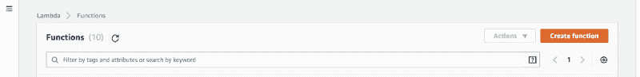

我们将从头开始创作。将 Lambda 命名为:“cat_facts_lambda”。选择运行时为“Python 3.6”，并为角色选择我们在上面创建的“Cat_Facts_Lambda_Role”。点击“创建功能”。

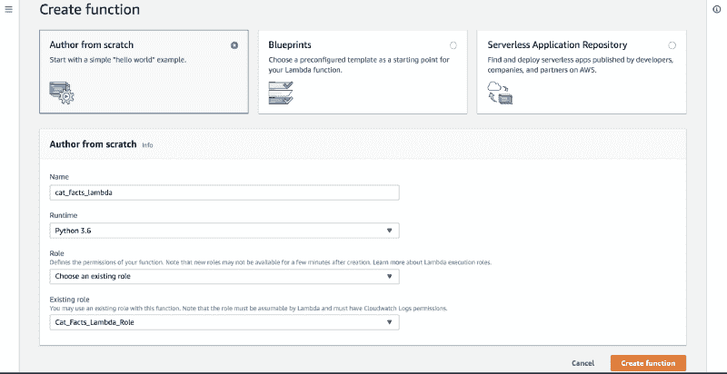

添加值为`cat_facts` **的环境变量**“skill _ persistence _ table”。****

**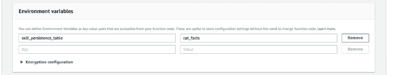**

**增加“超时”。**

**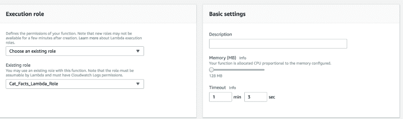**

**通过上传“lambda_package.zip”文件导入代码。将 Lambda 的处理程序添加为:“cat facts _ decorators _ Lambda . handler”。**

**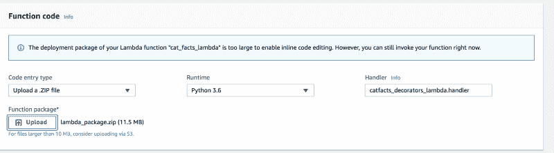**

**保存功能。**

**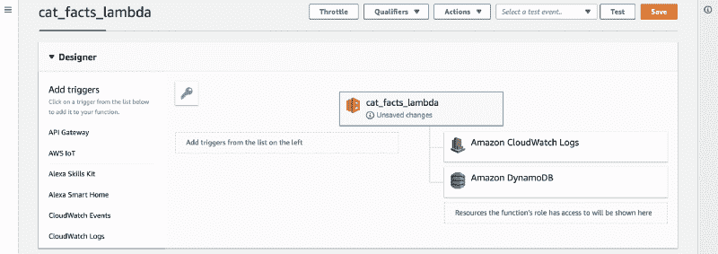**

### **添加 Alexa 触发器**

**从功能的“设计器”菜单中，选择“Alexa 技能套件”。然后单击同名按钮来修复配置。**

**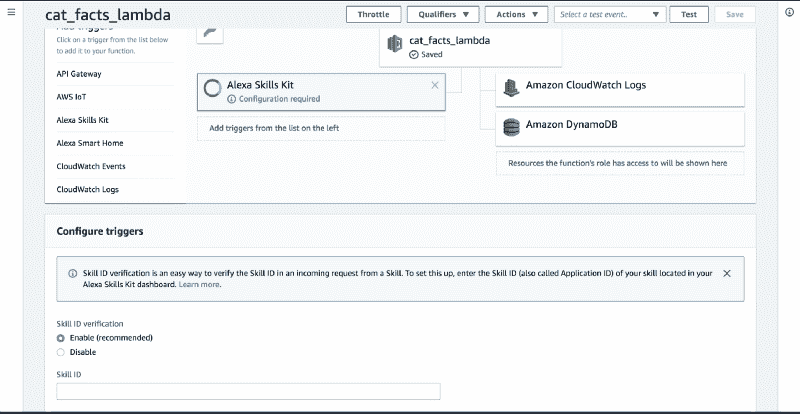**

**到 **Alexa 开发者控制台**，到“端点”你会看到**技能的 id** 。将其复制到您的剪贴板。**

**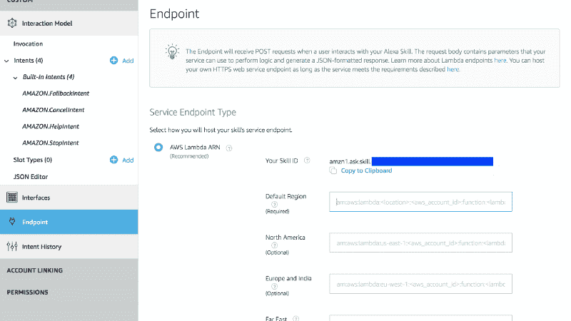**

**将技能 ID 粘贴到 Lambda 控制台，然后单击“添加”。**

****

**保存功能。**

**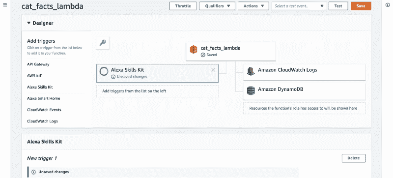**

**然后从页面右上角复制**λ的 ARN** 。**

**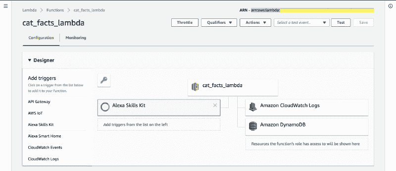**

### **Alexa 控制台安装完成**

**从“端点”中选择“AWS Lambda ARN ”,并将 Lambda 的 ARN 粘贴到“默认区域”字段中。**

**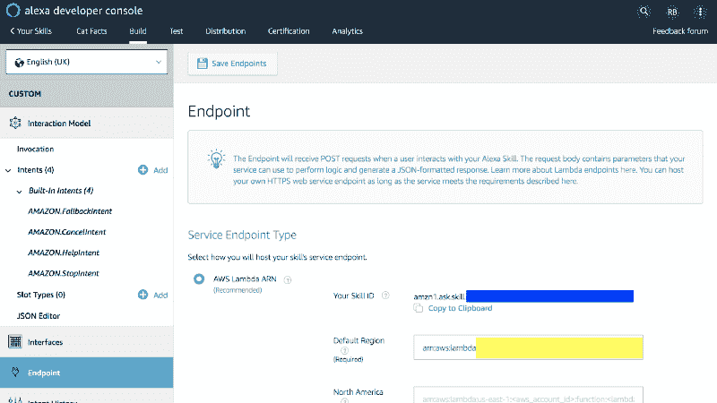**

**然后进入“构建”->“JSON 编辑器”->“保存模型”。保存模型后，单击“Build Model ”,这样我们所有的更改都会生效。**

**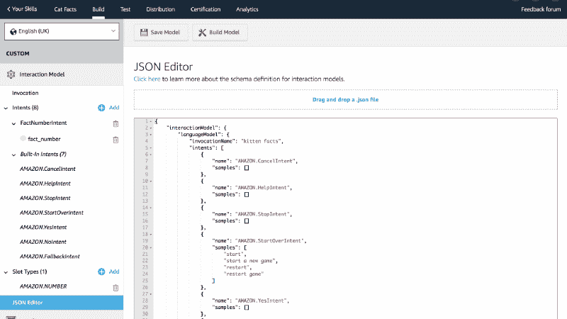**

**我们正式完成了我们的设置！恭喜你走到这一步！**

**

Photo by [rawpixel](https://unsplash.com/photos/mcLpPD36-2k?utm_source=unsplash&utm_medium=referral&utm_content=creditCopyText) on [Unsplash](https://unsplash.com/search/photos/success?utm_source=unsplash&utm_medium=referral&utm_content=creditCopyText)** 

### **测试**

**让我们直接从 Alexa 控制台与我们的技能互动。转到“测试”并启用运行 Alexa 模拟器技能的测试。**

**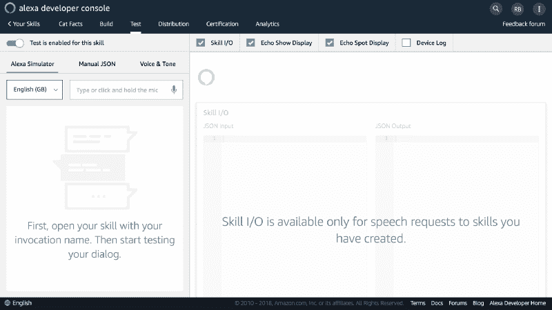**

#### ****Alexa 控制台提示****

**测试 FactNumberIntent 时，将数字写成字符，例如“2”而不是“2”。否则，该意图将被映射到 FallbackIntent。**

#### **让我们测试 Decorators 版本**

**让我们运行一个简单的场景来看看我们的技能表现如何。我们对测试事实数字的意图及其界限特别感兴趣。您可以通过点击并按住麦克风图标来说出命令，也可以通过书写来说出命令。**

**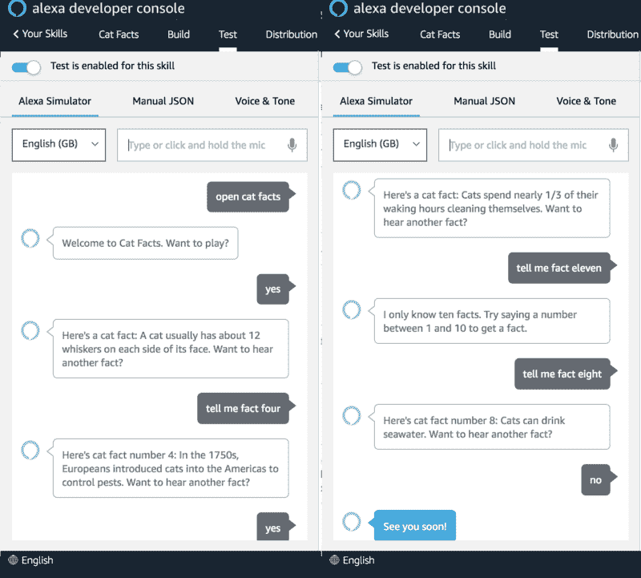**

**进入 AWS 控制台，进入“服务”->“DynamoDB”->“表格”->“cat _ facts”，查看 dynamo db 中的结果。您将看到一个类似的项目，使用您的用户 id 作为分区键。**

**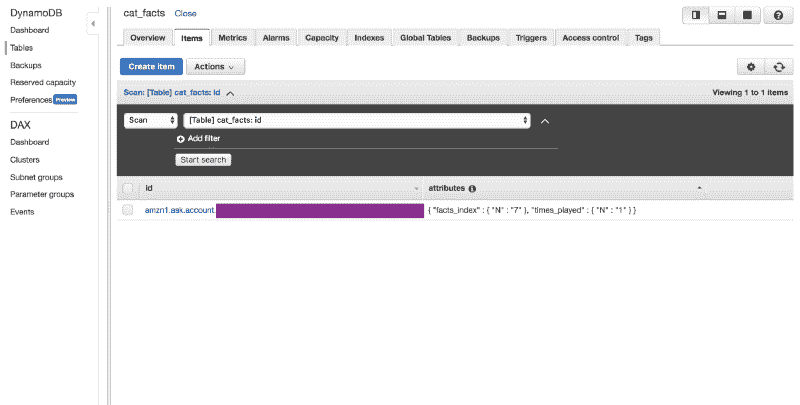**

#### **让我们测试类的版本**

**要切换到我们代码的类版本，请转到“服务”->“Lambda”->“cat _ facts _ Lambda”。简单的改变**就是**将处理程序从“cat**facts _ deco**rators _ lambda . Handler”重命名为“cat**facts _ c**lasses _ lambda . Handler”。“保存”功能，切换会自动发生。**

**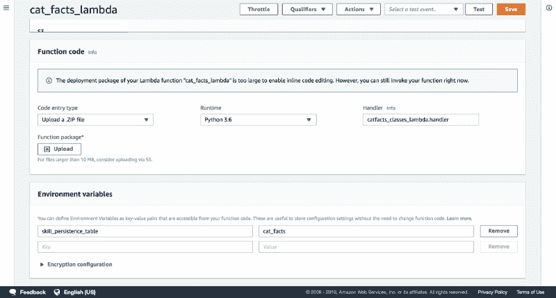**

**让我们用我们的 Alexa 技能再运行一次，在这里我们要测试重新开始的行为。即使我们改变了代码，行为还是一样的。**

**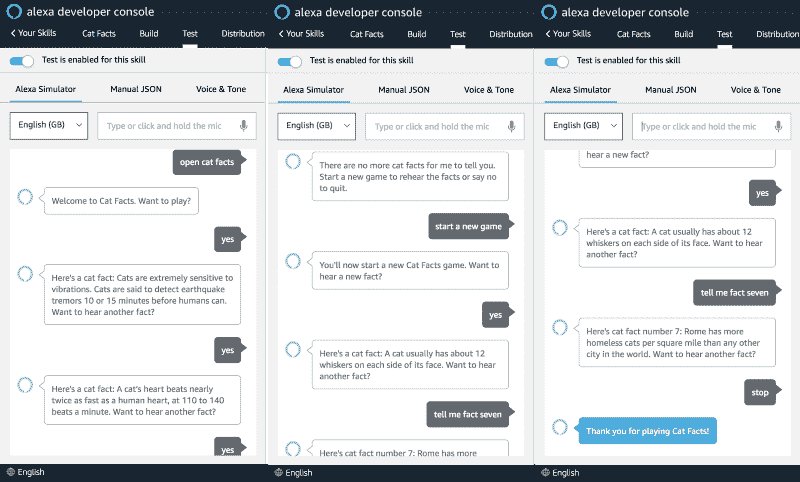**

**让我们回到 DynamoDB 表并刷新页面。我们的 Lambda 已经成功记录了最后听到的事实的索引，并且用户已经与该技能交互了两次。**

**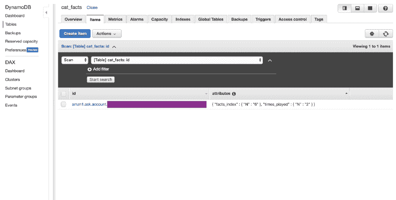**

****恭喜**！你已经使用 Python SDK 成功创建了你的第一个 Alexa 技能。现在你知道了如何在 DynamoDB 中保持相关属性，如何创建你的技能基础设施，主要意图是什么，如何创建你自己的，以及如何让 Lambda 满足任何意图。**

### ****改进空间****

**我们**特别是**没有关注基础设施，如代码、git、多种语言、CI/CD、测试和我们的 cat facts 的 API。这将使教程变得更加复杂，并且偏离了主要的焦点。在现实生活环境中，这些让我们的生活变得轻松许多。**

**即使增加这样的改进会提高我们的生产率，知道如何开始和如何着手也是令人不知所措的。结合像 **AI** 、**无服务器**和 **DevOps** 这样的新技术趋势，需要同时扮演许多角色，这似乎是不可逾越的。**

#### **获得更多帮助**

**但是，如果有一种方法可以克服这个障碍，并且能够使用这些概念构建自己的应用程序，那会怎么样呢？我开设了一门课程来揭开这一过程的神秘面纱。点击 可以找到 [**，点击**](http://pluralsight.pxf.io/c/1289732/424552/7490?u=https%3A%2F%2Fwww.pluralsight.com%2Fcourses%2Faws-polly-voice-enabled-serverless-website) **[**可以免费试用**](http://pluralsight.pxf.io/c/1289732/431405/7490) 。****

**感谢您花时间阅读这篇文章。愿它成为你创造伟大事业的垫脚石！**