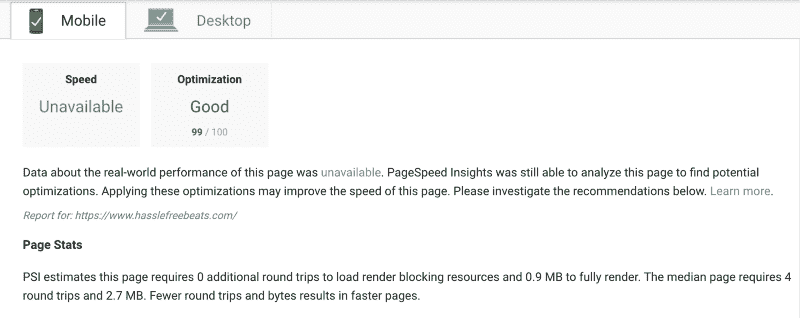

# 网站优化初学者指南

> 原文：<https://www.freecodecamp.org/news/a-beginners-guide-to-website-optimization-2185edca0b72/>

作者马里奥·奥约斯

# 网站优化初学者指南


Image courtesy of Pexels.

我是一个初学者，在 Google 的优化排名中能够做到 99/100。如果我能做到，你也能。

如果你像我一样，你喜欢证据。下面是 [hasslefreebeats](https://www.hasslefreebeats.com) 的[谷歌页面速度洞察](https://developers.google.com/speed/pagespeed/insights/)结果，这个网站是我维护的，最近花了一些时间优化:



A screenshot of my PageSpeed Insights score.

我对这些结果感到非常自豪，但我想强调的是，就在几周前，我还不知道如何优化一个网站。今天我要和你分享的只是大量谷歌搜索和故障排除的结果，我不想让你感到痛苦。

本文针对每一个优化分成几个小节，以防您想跳过。

我绝不是专家，但我有信心，如果你实施下面的技术，你会看到结果！

### 形象


Image courtesy of Pexels (and surely optimized by Medium).

作为一个初学 web 开发的人，我从来没有把图像放在心上。我知道给我的网站添加高质量的图片会让它看起来更专业，但是我从来没有停下来考虑它们对我的页面加载时间的影响。

我优化图片的主要方法是压缩它们。

回想起来，这从一开始就应该是相当直观的，但对我来说不是，所以也许对你也不是。

我用来压缩图片的服务是 [Optimizilla](http://optimizilla.com/) ，这是一个易于使用的网站，你可以上传图片，选择你想要的压缩级别，然后下载压缩后的图片。我看到我的一些资源的大小减少了 70%以上，这大大加快了加载速度。

Optimizilla 很难成为满足图像压缩需求的唯一选择。你可以使用的一些独立的开源软件是 Mac 版的 ImageOptim 或 Windows 版的 T2 file optimizer。如果你喜欢使用构建工具压缩，有 [Gulp](https://www.npmjs.com/package/gulp-imagemin) 和 [WebPack](https://github.com/Klathmon/imagemin-webpack-plugin) 插件应该可以做到这一点。只要你做了，你怎么做并不重要。这种性能上的提升是非常值得的。

根据您的使用情况，查看您的文件格式也是值得的。一般来说，jpg 会比 png 小。我使用一个还是另一个的主要区别是我是否需要图像背后的透明度:如果我需要透明度，我使用 png，否则我使用 jpg。你可以在这里更深入地了解两者的利弊。

此外，Google 已经推出了一个相当不错的 webp 格式，但是由于它还不被所有的浏览器支持，我对使用它有些犹豫。请关注未来的进一步支持！

除了压缩我的图像，我没有做更多的事情来得到我上面给你看的结果，但是如果你想进一步优化的话，这里有一篇很棒的文章。

### 录像


Photo by Terje Sollie from Pexels.

我还没有在我目前的任何项目中使用过视频，所以我只会简单地谈一下，因为我不觉得我是这方面的最佳资源。

在这种情况下，我很可能会让专业人士来承担重任。Vimeo 为托管视频提供了一个优秀的平台，在这里他们会降低视频质量以获得更慢的连接，并压缩你的视频以优化性能。

你也可以把你的视频放在 youtube 上，然后使用这个 [youtube-dl](https://rg3.github.io/youtube-dl/) 工具从 Youtube 上下载它们，同时根据你网站的需要配置视频。

对于其他可能的解决方案，请查看 [Brightcove](https://www.brightcove.com/en/) 、 [Sprout](https://sproutvideo.com/) 或 [Wistia](https://wistia.com/) 。

### Gzip


Get it? Zip? Image courtesy of Pexels.

当我最初部署我的网站时，我不知道 gzipping 是什么。

长话短说，gzip 是一种大多数浏览器都理解的文件压缩格式，它可以在后台运行，甚至不需要用户知道它正在发生。

根据您托管应用程序的位置，gzip 可能简单到只需切换一个配置开关，指定您希望服务器在发送文件时对它们进行 gzip 压缩。在我的情况下，我的网站托管在 Heroku 上，它不提供这个选项。

事实证明，有一些包可以在您的服务器代码中显式地添加压缩，这使得您只需要几行代码就可以获得 gzipping 的好处。使用[这个](https://github.com/expressjs/compression)压缩中间件，[我能够将我的 Javascript 和 CSS 包的大小减少 75%。](https://codeburst.io/how-i-decreased-the-size-of-my-heroku-app-by-75-1a4cf329b0ab)

检查你的主机服务是否提供 gzip 选项是值得的。如果没有，研究如何将 gzipping 添加到您的服务器端代码中。

### 使变小


Minified pineapple courtesy of Pexels.

缩小是从代码中删除不必要的字符而不影响其功能的过程(空白、换行符等)。这允许您减小通过互联网传输的文件的大小。它对于混淆你的代码也很有用，这使得狡猾的黑客更难发现安全弱点。

如今，缩小通常是作为 Webpack 或 Gulp 或其他替代工具的构建过程的一部分来完成的。然而，这些构建工具可能有一点学习曲线，所以如果你正在寻找更简单的替代工具，谷歌建议为 HTML 使用 [HTML-Minifier，为 CSS](https://github.com/kangax/html-minifier) 使用 [CSSNano，为 Javascript](https://github.com/ben-eb/cssnano) 使用 [UglifyJS。](https://github.com/mishoo/UglifyJS2)

### 浏览器缓存


Not quite how the browser stores data, but it’s as close as I could get. Courtesy of Pexels.

将静态文件存储在浏览器的缓存中是提高网站速度的一种非常有效的方式，尤其是在来自同一个客户端的回访中。直到 Google 告诉我，我才意识到我的一些资源没有被适当地缓存，因为我从服务器上发送的 HTTP 响应中丢失了头。

一旦我的主页被加载，就会向我的服务器发出一个请求，请求获取一些歌曲的数据，然后在音乐播放器中播放这些数据。我不经常更新这个网站上的歌曲，所以我不介意如果一个用户来到我的网站，看到他们上次访问的相同的歌曲，如果这将使我的页面加载速度更快一点。

为了获得性能提升，我向我的服务器的响应对象(Express/Node server)添加了以下代码:

```
res.append("Cache-Control", "max-age=604800000");
```

```
res.status(200).json(response);
```

我在这里所做的只是在我的响应后面附加一个 cache-control 头，表示一周(以毫秒计)后，资源应该被重新下载。如果您更频繁地更新这些文件，缩短 max-age 可能是个好主意。

### **内容分发网络**


Real-life image of a CDN, courtesy of Pexels.

内容分发网络(CDN)是一个网络，它允许来自世界各地的用户在地理上更接近您的内容。如果一个用户必须从日本加载一个大的图像，但是你的服务器在美国，这将比你在东京有一个服务器花费更长的时间。

CDN 允许您利用遍布世界各地的代理服务器，无论您的最终用户在哪里，都可以更快地加载您的内容。

我想指出的是，在实施 CDN 之前，我能够实现你在上面**看到的结果——我只是想提到它们，因为没有一篇关于网站优化的文章不提到它们就不完整。如果你打算拥有全世界的观众，在你的网站上放一个这样的坏男孩是必要的。**

一些流行的 cdn 包括 [CloudFront](https://aws.amazon.com/cloudfront/) 和 [CloudFlare](https://www.cloudflare.com/lp/ddos-a/?_bt=157293179478&_bk=cloudflare&_bm=e&_bn=g&gclid=CjwKCAiA_c7UBRAjEiwApCZi8Ri3kAEt3UraYPUFUQOMTG0Xz7WGCNRUri0UNtCOUAdUMJI8osxuDRoCTx8QAvD_BwE) 。

### 多方面的

这里有更多的技巧来榨出更多的果汁:

*   优化您的网站，首先加载“高于折叠”的内容，以提高网站的感知性能。一种常见的方法是通过[延迟加载](https://en.wikipedia.org/wiki/Lazy_loading)没有显示在登录页面上的图片。
*   除非您的应用程序依赖 Javascript 来呈现 HTML，比如用 Angular 或 React 构建的网站，否则在 HTML 文件的 body 部分的底部加载您的脚本标记可能是安全的。然而，这可能会影响你的[互动时间](https://developers.google.com/web/tools/lighthouse/audits/time-to-interactive)，所以我不会在任何情况下都推荐这种技术。

### 最后

这只是优化你的网站的冰山一角。根据您接收的流量和您提供的服务，您可能会在许多不同的领域遇到性能瓶颈。也许你需要更多的服务器，也许你需要一个有更多 RAM 的服务器，也许你的三重嵌套 for 循环需要一些重构——谁知道呢？

当提到加速你的站点的时候，没有一个尺寸适合所有人，你最终将不得不基于测量为你的情况做出最好的决定。不要浪费时间优化不需要优化的东西。分析站点的性能，找出瓶颈，然后有针对性地解决这些问题。

我希望你能在这篇文章中找到有用的东西！正如我提到的，在这个领域我还有很多要学的。如果你有任何额外的提示或建议，请在下面的评论中留下！

如果你喜欢这篇文章，请给它一些掌声，看看:

*   [我希望在开始编码时就知道的工具](https://medium.freecodecamp.org/tools-i-wish-i-had-known-about-when-i-started-coding-57849efd9248)
*   我希望我在开始编码时就知道的工具:重温

另外，在推特上给我一个关注。