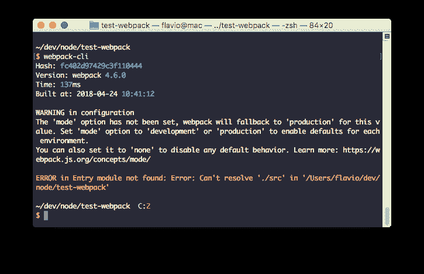
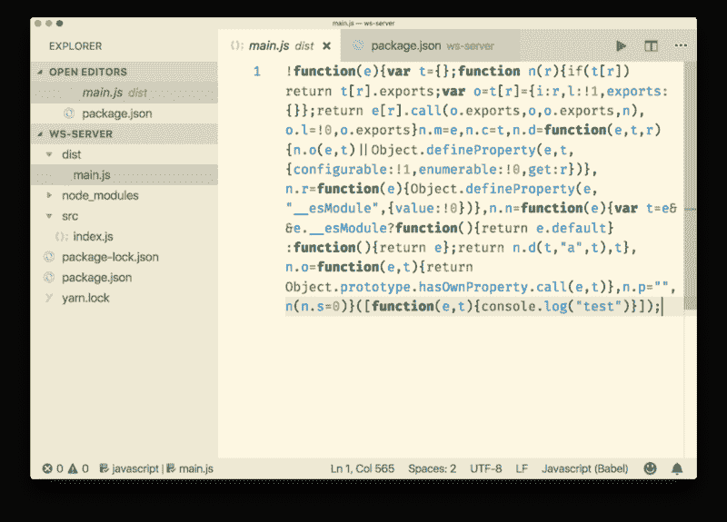

# Webpack 初学者入门

> 原文：<https://www.freecodecamp.org/news/a-beginners-introduction-to-webpack-2620415e46b3/>

Webpack 是一个让你编译 JavaScript 模块的工具。它也被称为**模块捆绑器**。

如果有大量文件，它会生成一个文件(或几个文件)来运行您的应用程序。

它可以执行许多操作:

*   帮助您整合资源。
*   观察变化并重新运行任务。
*   可以运行 Babel transpilation 到 ES5，允许您使用最新的 [JavaScript](https://flaviocopes.com/javascript/) 特性，而不用担心浏览器支持。
*   可以将 CoffeeScript 转换成 JavaScript
*   可以将内嵌图像转换为数据 URIs。
*   允许您对 CSS 文件使用 require()。
*   可以运行开发 web 服务器。
*   可以处理热模块更换。
*   可以将输出文件分成多个文件，以避免在第一次页面点击时加载一个巨大的 JS 文件。
*   可以执行[摇树](https://flaviocopes.com/javascript-glossary/#tree-shaking)。

Webpack 不仅限于在前端使用，在后端 Node.js 开发中也很有用。

Webpack 有很多前辈，这些工具和 Webpack 有很多相似之处。主要区别在于，这些工具被称为**任务运行器**，而 Webpack 是作为模块捆绑器诞生的。

Webpack 是一个更集中的工具。你只需要指定你的应用程序的入口点(它甚至可以是一个带有脚本标签的 HTML 文件), webpack 就会分析这些文件，并将它们打包成一个 JavaScript 输出文件，其中包含了运行应用程序所需的一切。

### 安装 Webpack

Webpack 可以为每个项目进行全局或本地安装。

### 全局安装

下面用[纱](https://flaviocopes.com/yarn/)全球安装:

```
yarn global add webpack webpack-cli
```

带 [npm](https://flaviocopes.com/npm/) :

```
npm i -g webpack webpack-cli
```

一旦这样做了，你就可以跑了

```
webpack-cli
```



### 本地安装

Webpack 也可以安装在本地。这是推荐的设置，因为 Webpack 可以针对每个项目进行更新，并且在为一个小项目使用最新功能时，比更新所有使用 Webpack 的项目阻力更小。

用[纱](https://flaviocopes.com/yarn/):

```
yarn add webpack webpack-cli -D
```

带 [npm](https://flaviocopes.com/npm/) :

```
npm i webpack webpack-cli --save-dev
```

完成后，将其添加到您的`package.json`文件中:

```
{   //...   "scripts": {     "build": "webpack"   } }
```

完成后，您可以通过键入以下命令运行 Webpack

```
yarn build
```

在项目根目录中。

### Webpack 配置

默认情况下，如果您遵守以下约定，Webpack(从版本 4 开始)不需要任何配置:

*   你的 app 的**入口点**是`./src/index.js`
*   输出被放入`./dist/main.js`。
*   Webpack 在生产模式下工作

当然，当你需要的时候，你可以定制 Webpack 的每一个细节。Webpack 配置存储在项目根文件夹中的`webpack.config.js`文件中。

### 入口点

默认情况下，入口点是`./src/index.js`。这个简单的例子使用`./index.js`文件作为起点:

```
module.exports = {  /*...*/  entry: './index.js'  /*...*/}
```

### 输出

默认情况下，输出在`./dist/main.js`中生成。这个例子将输出包放入`app.js`:

```
module.exports = {  /*...*/  output: {    path: path.resolve(__dirname, 'dist'),    filename: 'app.js'  }  /*...*/}
```

使用 Webpack 允许您在 JavaScript 代码中使用`import`或`require`语句，不仅包括其他 JavaScript，还包括任何类型的文件(例如 CSS)。

Webpack 旨在处理我们所有的依赖项，而不仅仅是 JavaScript，加载器是实现这一点的一种方式。

例如，您可以在代码中使用:

```
import 'style.css'
```

通过使用这种加载器配置:

```
module.exports = {  /*...*/  module: {    rules: [      { test: /\.css$/, use: 'css-loader' },    }]  }  /*...*/}
```

[正则表达式](https://flaviocopes.com/javascript-regular-expressions/)以任何 CSS 文件为目标。

加载器可以有选项:

```
module.exports = {  /*...*/  module: {    rules: [      {        test: /\.css$/,        use: [          {            loader: 'css-loader',            options: {              modules: true            }          }        ]      }    ]  }  /*...*/}
```

您可以为每个规则要求多个装入程序:

```
module.exports = {  /*...*/  module: {    rules: [      {        test: /\.css$/,        use:          [            'style-loader',            'css-loader',          ]      }    ]  }  /*...*/}
```

在这个例子中，`css-loader`解释 CSS 中的`import 'style.css'`指令。然后，`style-loader`负责在 DOM 中注入 CSS，使用一个`<sty` le >标签。

顺序很重要，而且是颠倒的(最后一个先执行)。

有哪几种装载机？很多！[你可以在这里找到完整的列表](https://webpack.js.org/loaders/)。

一个常用的加载器是 [Babel](https://flaviocopes.com/babel/) ，用于将现代 JavaScript 转换成 ES5 代码:

```
module.exports = {  /*...*/  module: {    rules: [      {        test: /\.js$/,        exclude: /(node_modules|bower_components)/,        use: {          loader: 'babel-loader',          options: {            presets: ['@babel/preset-env']          }        }      }    ]  }  /*...*/}
```

这个例子让 Babel 预处理我们所有的 React/JSX 文件:

```
module.exports = {  /*...*/  module: {    rules: [      {        test: /\.(js|jsx)$/,        exclude: /node_modules/,        use: 'babel-loader'      }    ]  },  resolve: {    extensions: [      '.js',      '.jsx'    ]  }  /*...*/}
```

见`babel-loader`选项[此处](https://webpack.js.org/loaders/babel-loader/)。

### 插件

插件就像是加载器，但却是兴奋剂。它们可以做加载器做不到的事情，是 Webpack 的主要构建块。

举个例子:

```
module.exports = {  /*...*/  plugins: [    new HTMLWebpackPlugin()  ]  /*...*/}
```

`HTMLWebpackPlugin`插件自动创建一个 HTML 文件并添加输出 JS 包路径，这样 JavaScript 就准备好了。

有[个插件可用](https://webpack.js.org/plugins/)。

一个有用的插件`CleanWebpackPlugin`可以用来在创建任何输出之前清除`dist/`文件夹，这样当您更改输出文件的名称时就不会留下文件:

```
module.exports = {  /*...*/  plugins: [    new CleanWebpackPlugin(['dist']),  ]  /*...*/}
```

### 网络包模式

这种模式(在 Webpack 4 中引入)设置 Webpack 的工作环境。它可以被设置为`development`或`production`(默认为生产，所以您只在转移到开发时设置它)。

```
module.exports = {  entry: './index.js',  mode: 'development',  output: {    path: path.resolve(__dirname, 'dist'),    filename: 'app.js'  }}
```

开发模式:

*   构建速度非常快
*   不如生产优化
*   不删除注释
*   提供了更详细的错误消息和建议
*   提供更好的调试体验

生产模式构建起来比较慢，因为它需要生成一个更加优化的包。生成的 JavaScript 文件更小，因为它删除了许多生产中不需要的东西。

我制作了一个示例应用程序，它只打印一条`console.log`语句。

这是产品包:



这是开发包:


### 运行 Webpack

如果是全局安装，可以从命令行手动运行 Webpack。但是通常你在`package.json`文件中写一个脚本，然后使用`npm`或`yarn`运行。

例如我们之前使用的这个`package.json`脚本定义:

```
"scripts": {  "build": "webpack"}
```

允许我们通过跑步来跑`webpack`

```
npm run build
```

或者

```
yarn run build
```

或者只是

```
yarn build
```

### 观察变化

当应用程序发生变化时，Webpack 可以自动重建包，并一直监听下一次变化。

只需添加以下脚本:

```
"scripts": {  "watch": "webpack --watch"}
```

然后跑

```
npm run watch
```

或者

```
yarn run watch
```

或者只是

```
yarn watch
```

监视模式的一个很好的特性是，只有在构建没有错误的情况下，包才会被更改。如果有错误，`watch`将继续监听变化，并尝试重新构建包，但是当前的工作包不受这些有问题的构建的影响。

### 处理图像

Webpack 允许您以非常方便的方式使用图像，使用`[file-loader](https://webpack.js.org/loaders/file-loader/)`加载器。

这种简单的配置:

```
module.exports = {  /*...*/  module: {    rules: [      {        test: /\.(png|svg|jpg|gif)$/,        use: [          'file-loader'        ]      }    ]  }  /*...*/}
```

允许您在 JavaScript 中导入图像:

```
import Icon from './icon.png'const img = new Image()img.src = Iconelement.appendChild(img)
```

其中`img`是一个 HTMLImageElement。查看[图片文件](https://developer.mozilla.org/en-US/docs/Web/API/HTMLImageElement/Image)。

也可以处理其他资产类型，如字体、CSV 文件、XML 等。

另一个处理图像的好工具是`url-loader`加载器。

这个例子加载任何小于 8KB 的 PNG 文件作为[数据 URL](https://flaviocopes.com/data-urls/) 。

```
module.exports = {  /*...*/  module: {    rules: [      {        test: /\.png$/,        use: [          {            loader: 'url-loader',            options: {              limit: 8192            }          }        ]      }    ]  }  /*...*/}
```

### 处理您的 SASS 代码并将其转换为 CSS

使用`sass-loader`、`css-loader`和`style-loader`:

```
module.exports = {  /*...*/  module: {    rules: [      {        test: /\.scss$/,        use: [          'style-loader',          'css-loader',          'sass-loader'        ]      }    ]  }  /*...*/}
```

### 生成源地图

因为 Webpack 捆绑了代码，所以源代码映射是必需的，以便获得对引发错误的原始文件的引用。例如:

您告诉 Webpack 使用配置的`devtool`属性生成源映射:

```
module.exports = {  /*...*/  devtool: 'inline-source-map',  /*...*/}
```

`devtool`有[多种可能的值](https://webpack.js.org/configuration/devtool/)，使用最多的大概有:

*   `none`:不添加源地图
*   `source-map`:非常适合生产，提供了一个可以最小化的单独的源映射，并在包中添加了一个引用，因此开发工具知道源映射是可用的。当然，您应该配置服务器以避免发布它，而只是将它用于调试目的
*   `inline-source-map`:非常适合开发，将源地图内联为数据 URL

> 我在[flaviocopes.com](https://flaviocopes.com)上每天发布 1 篇免费编程教程，看看吧！

*最初发表于[flaviocopes.com](https://flaviocopes.com/webpack)。*