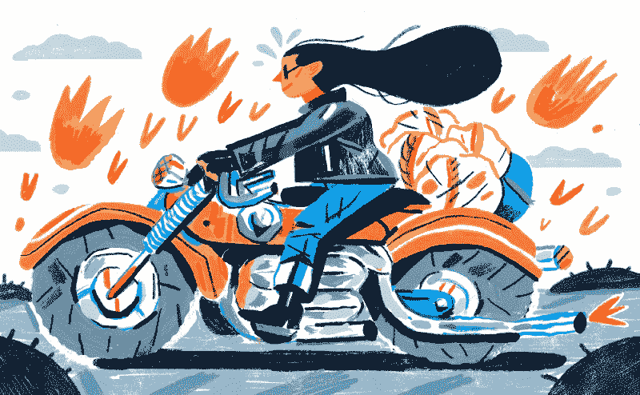
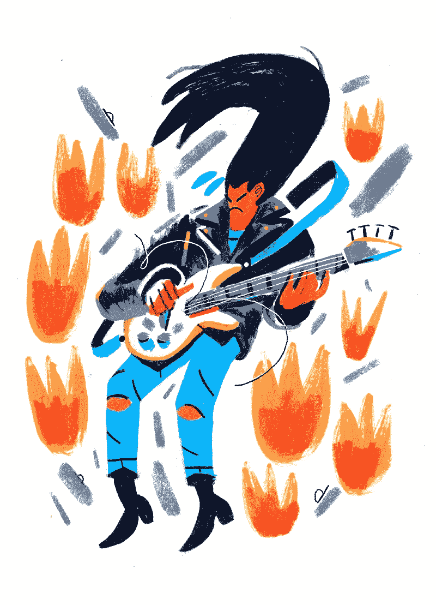

# 比较自己的更好方法

> 原文：<https://www.freecodecamp.org/news/a-better-way-to-compare-yourself-43cf37616570/>

坦纳·克里斯滕森

Illustrations by [Kelsey Wroten](http://www.kelseywroten.com) for this article.

# 比较自己的更好方法

将自己的工作或能力与他人进行比较可能是一种无益且自我毁灭的行为。然而我们一直在比较自己。

以我自己的经验来看，我感觉每天都在拿我的工作和我崇拜的人做比较。即使是现在，在我职业生涯的十年里，我总能发现有人在做我希望自己能做的一半好的事情。

这种类型的比较经常会让你感到没有动力或沮丧，害怕看似黯淡的未来，完全失去前进的方向。当我比较自己时，我最终会觉得我宁愿看电视或玩电子游戏，而不是做其他任何事情，因为为什么要这么做呢？我永远做不到我所钦佩的人所能做到的事。

幸运的是，有一个更好的方法来比较自己和别人。一个更有生产力和更健康的世界。

归结起来有五件事:**事情的表面并不是事情的全部**，**你必须对自己和你的动机诚实**，**前进的道路是对工作保持无止境的好奇**，**永远做你自己的事情**，**成长需要努力**。

### **记住事情的表面永远不是全部**

任何努力中最具挑战性的部分往往发生在幕后，对于没有投入工作的人来说是不可见的。

当你遇到一些你自然想与之比较的东西——一些让你质疑自己的工作或能力的东西——提醒自己很多工作是在幕后进行的是很好的。

关于这个概念有一个非常著名的寓言:

一天晚上，著名的西班牙画家巴勃罗·毕加索正在公园里写生，一个路过的女人一眼就认出了他。她请求毕加索为她画像，他同意了。仅仅过了几分钟，他递给这位女士一张素描，完美地捕捉到了她的形象。这个女人因艺术品而容光焕发。

当被问及这幅画她欠了他多少钱时，毕加索回答说这幅画大约值 5000 美元(上下浮动)。这个女人被激怒了。她生气了。她问毕加索一幅只花了*五* *分钟*创作的画怎么会花这么多钱？

毕加索回答道:

> “我花了一生的时间才能够在五分钟内创作出这样的作品。”

### **诚实面对你的动机**

当你不知道你的动机是什么，或者你在职业生涯中的任何时候都不知道你想要完成什么，你更容易因为比较而气馁或受阻。

另一种思考方式是:如果你没有朝某个特定的方向跑，那就更容易根本不跑，或者跑错方向而筋疲力尽。为了不断前进，你必须给自己明确的动机。要做到这一点，你首先要知道你在哪里，你想去哪里。

当我拿自己和我真正钦佩的人比较时，我用我和他们之间的差距作为指导我下一步行动的方法；不怕我做不了同样的工作。哪些技能可能有助于他们达到我所缺乏的水平？有没有我应该从事的特定类型的工作？工作中有没有我可以专注学习做好自己的细节？

以下是达赖喇嘛关于动机与焦虑的智慧:

> “拥有适当的动机和诚实是克服恐惧或焦虑的关键。无所畏惧、诚实的自我评估可以成为对抗自我怀疑或低自信的有力武器。”

找出差距——在经验、知识或能力方面——是很重要的，但也仅仅是你现在所处的位置和你想要达到的位置之间的差距。其他一切都只是噪音。

如果你不确定你想去哪里，你会更容易被你遇到的任何事情所打击。但是当你的动机明确时，那些让你气馁的事情实际上只是你下一步需要去哪里的路标。

### 对工作充满无限好奇

一旦你确定了你的现状(或你的能力)和你想要达到的目标之间的明显差距，你就必须真正地——无止境地，可笑地——对这个差距里面的东西感到好奇。

当你把自己和别人比较时，你很可能没有看到比你所比较的事物表面更深的东西。但是，你可能记得，事情的表面很少是全部。你必须挖掘差距，真正确定你或你的工作和他们之间的差距。

找出差距是很容易的，只要花一点时间深入观察，提出问题，与他人讨论，然后进行实验和修补。

在《埃隆·马斯克:特斯拉、SpaceX 和对美好未来的追求》一书中，作者阿什莉·万斯(Ashlee Vance)解释了埃隆·马斯克如何利用他压倒一切的好奇心从他几乎没有知识或经验的领域的专家那里吸取知识和见解。

> “‘一开始我以为他是在挑战我，看我是否知道自己的东西，’Space X 的早期工程师之一凯文·布罗根(Kevin Brogan)告诉阿什利。然后我意识到他在努力学东西。他会测验你，直到他学会你所知道的百分之九十。"

通过积极追求自己的愿望，以更好地了解他可能很少或根本没有信息的事情，埃隆已经能够从推出在线支付平台到成为电动汽车、太空探索和火箭科学的领先声音。

你可以利用好奇心和问题的力量来帮助填补空白。积极主动，接触那些你钦佩或受到鼓舞的人，询问他们是如何做到他们所做的事情的，或者他们在这个过程中学到了什么。深入工作，关注细节。真正了解工作，为什么感觉和自己的不一样。但是请记住…

### 永远做自己的事

你的目标永远不应该是成为别人。你的目标应该永远是成为你自己，成为你自己的独特版本，创造出只有你才能创造的作品。在你的工作中总会有反映你的经验、激情和观点的微妙之处；拥抱这些细微差别。

当然，你和你的工作以及那些激励你的人之间的差距是可以填补的，但只有在你可以填补的情况下。在这种差距的尽头，不是你受到启发的人或工作的另一个版本，而是你自己在同一水平上的工作/观点/能力的一个版本。

以下是作家/艺术家奥斯汀·克莱恩关于如何做自己的事情的建议:

> “下一次你遇到某人的工作，但你不确定他们到底是怎么做的……仔细看看。仔细听。然后发挥你的想象力，用你拥有的工具进行实验。你糟糕的近似会导致你自己的东西。”

### **记住成长需要努力**

我觉得作家 Jocelyn K. Glei 把这一点说得很好:“如果一切都很容易，没有什么会有意义。”

没有别的办法:成长和填补空缺的最好方法就是努力工作。每当你发现自己害怕自己不具备做好工作的条件时，记住*所需要的就是*工作。

打击自己或感觉没有动力不会帮助你变得更好。投入工作是变得更好的方法，如果你不做点什么，什么都不会改善。因此，当你发现一个差距并开始挖掘它时，记住接下来发生的是许多人想要想象的不存在的部分:勤奋的练习，探索，修补，汗水(有时还有眼泪)。

正如维珍唱片/航空公司/银河公司创始人理查德·布兰森所说:

> "来之不易的东西比来之不易的东西更有价值."

这些都不容易，但这正是它的价值所在。

当你记住以上任何一条时，把自己和你最崇拜的人进行比较就变成了一种成长和机遇的练习，而不是焦虑或失败。