# 更好的 web 开发工作流:Confluence、Airtable 等等

> 原文：<https://www.freecodecamp.org/news/a-better-web-development-workflow-confluence-airtable-jira-abstract-e626ef4ff5bc/>

作为一名前端开发人员工作了近两年，我从参与设计/数字机构的几个 web 开发项目中获得了有益的经验。

我学到的一个显而易见但很有价值的教训是，在有着一个目标但有着不同责任和目的的每一个团体之间进行合作并不容易。就协作而言，存在不同方面和不同程度的困难，我想在这里说明的具体部分是工作流程。

根据我的经验，在我的设计师和开发者朋友的帮助下，我建立了一个为小团队(5-15 人)设计的网站开发工作流程。该系统由[汇流](https://www.atlassian.com/software/confluence)、[吉拉](https://www.atlassian.com/software/jira)、[气动工作台](https://airtable.com/)和[摘要](https://www.abstract.com/)组成。在这篇文章中，我将分享这个工作流程的原因和方式。

### **建立新工作流程的动机**

为了提供一个定制的网站，而不使用[网站建设者](https://www.wpbeginner.com/beginners-guide/how-to-choose-the-best-website-builder/)提供的模板，最低人才要求包括一名设计师，开发人员和项目经理。在参与了几个案例之后，我有一种感觉，我们的工作流程有问题:重要的信息总是不一致，无论是内部不同的角色之间，还是外部对客户。这种低效的交流明显地减慢了开发周期，伤害了团队。

于是我开始解决这个问题。

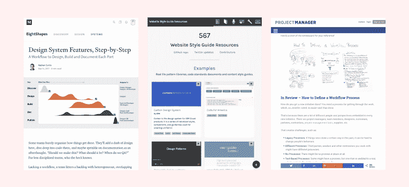

Google search workflow great resources: [Design systems features](https://medium.com/eightshapes-llc/system-features-step-by-step-e69c90982630), [style guide resources](http://styleguides.io/) and [workflow definition](https://www.projectmanager.com/training/define-workflow-process)

我在谷歌上搜索了关于建立和改进工作流程的资源。虽然我从所有的优秀资源中学到了很多，但我发现几乎没有一个是针对设计/数字代理公司的 web 开发项目的。它要么是设计系统，要么是设计或前端角色的编码指南，要么是为拥有自己产品的团队构建的工作流。

因此，我决定挑选出我需要的部分来解决我们的问题，并为网站开发形成一个定制的工作流程。

### **问题和目标**

以下是我从现有工作流程中发现的问题，以及相应的改进目标:

#### **1。瀑布方法**

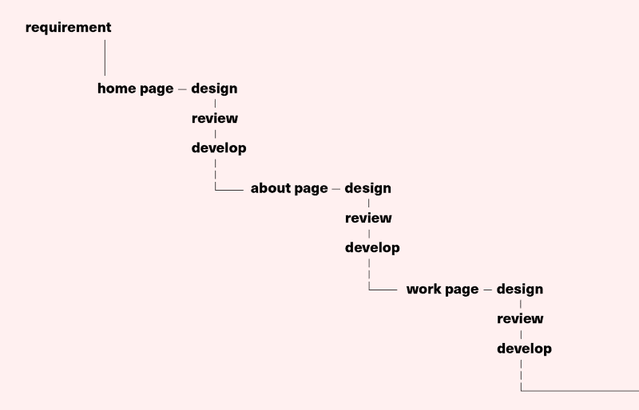

waterfall model abstract demo

问题:根据我的经验，网站项目采用瀑布方法，因为客户没有最小可行产品(MVP)的概念。客户倾向于以传统的逐页方式考虑网站，而不是将功能从视图和模块化中分离出来，这迫使设计人员和开发人员按顺序一页一页地工作。这导致他们失去了对整个项目的全局观点。这种情况会导致页面之间来回的大量冗余修改。

目标:改变客户的心态既傲慢又不现实。目标是尽快找到一种方法将需求从视图中分离出来，并基于逐页模型在内部尽可能模块化地开发。

#### **2。由设计者和开发者共同管理的通用设计令牌和组件**

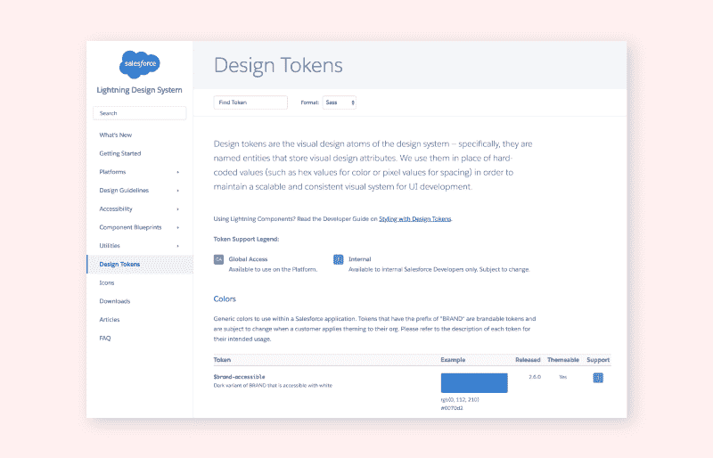

design tokens from [Salesforce](https://www.lightningdesignsystem.com/design-tokens/)

**问题:**这是一个常见的问题，许多文章都分享了很好的解决方案，其中大部分建议构建一个由[风格指南/库生成器](https://github.com/davidhund/styleguide-generators#user-content-nodejs)管理的设计系统。虽然这是一个很好的解决方案，但是在我们的情况下，管理一个几乎不给设计师提供编辑权限的额外网站是不合适的。

**目标:**除了创建设计者、开发者、管理者都能理解的通用设计令牌和语言，建立一个让所有人都能同步管理资产的系统。

#### **3。准确、更新的进度仪表盘**

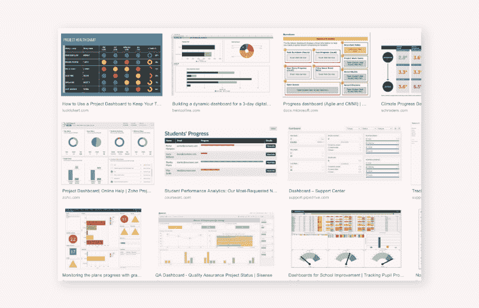

we need an editable and accessible progress dashboard

**问题:**尽管问题跟踪器、看板和更多的项目管理模型是有用和实用的，但它们中的大多数都不能作为一个简单、灵活和友好的进度仪表板。这种仪表板将为团队节省大量时间，因为它将阻止团队成员主动报告或询问特定任务的当前情况。如果经理们不需要太多的努力就能清楚地了解整个项目，这也会让他们的生活更轻松。

目标:构建一个仪表板系统，为负责特定任务的个人提供编辑权限。

### **工作流程图**

在我们深入管理工具堆栈的详细介绍之前，让我们看一下我组织的抽象简化工作流。这很大程度上只是大多数机构拥有的正常工作流程的可视化，但这里有两点需要注意。

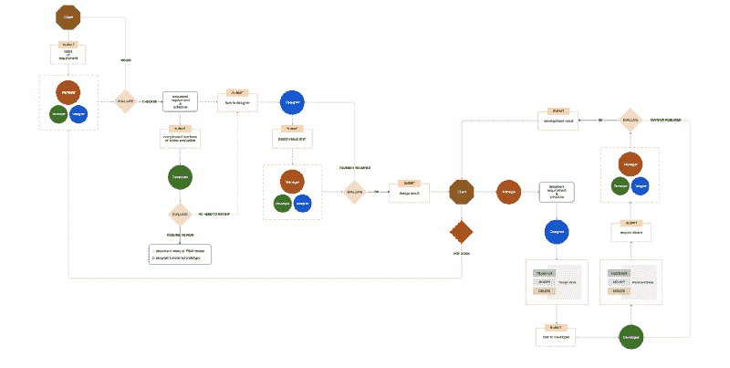

workflow diagram I designed

#### **1。开发者评估**

首先，当来自客户的需求或问题被经理批准并记录时，除了将任务发送给设计者之外，他们还会去找开发人员进行评估。在这个过程中，开发人员审查任务的规范，检查是否包含任何相当复杂的功能或特性。如果它是积极的，开发者可以开始工作，或者提前通知设计者潜在的问题。

#### **2。真相的单一来源**

还要注意的是，在客户批准设计交付物之后，在将任务移交给开发人员之前，它要经过一个由设计师进行的**注册/修改/删除设计库**的过程。这是因为开发人员应该总是接触到一个且只有一个设计存储源，它包含不断维护和更新的准备开发的资产。

现在，我们可以深入我准备的管理工具堆栈，看看这些工具如何帮助我们解决问题。

### **工具堆栈**

在尝试了市面上的各种选项后，我这里提出的栈是由[汇流](https://www.atlassian.com/software/confluence)、[吉拉](https://www.atlassian.com/software/jira)、[气台](https://airtable.com/)和[抽象](https://www.abstract.com/)组成的。除了基本的介绍和几个关键的应用示例，我不会涵盖使用这些工具的所有细节。

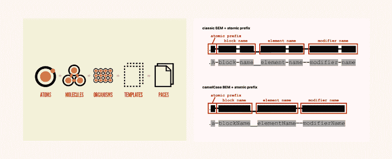

[atomic design](http://atomicdesign.bradfrost.com/) and [ABEM](https://css-tricks.com/abem-useful-adaptation-bem/)

注:系统假设开发团队采用[原子设计方法学](http://atomicdesign.bradfrost.com/)和 [ABEM](https://css-tricks.com/abem-useful-adaptation-bem/) 命名系统。

### **1。汇流**

**角色:**信息与资源中心

虽然一开始令人生畏，但 [Confluence](https://www.atlassian.com/software/confluence) 提供了一个强大的工作空间，易于组织，它有大量的功能，集成了应用程序和定制的模板。它肯定不是解决所有问题的通用解决方案，但是对于规范、需求、会议记录等文档来说，它是完美的。

因此，这个堆栈中的 Confluence 就像一个信息和资源中心，这意味着关于这个项目的每个相关链接和细节都应该在这里进行适当的记录。

我最喜欢的 Confluence 的优点是能够定制文档模板。这个特性使得标准化工作流程变得非常方便。

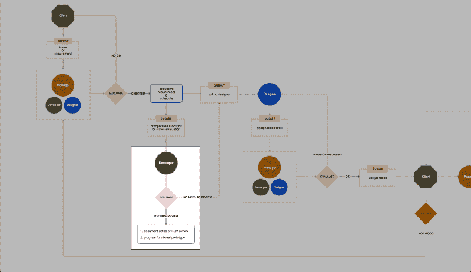

developer evaluation stage

#### **示例:**组件功能评审

上面我提到了**开发者评测流程**，这其实是一项复杂的工作。这是因为这个过程包括组件的基本信息、开发人员的 [FSM 评审](https://www.vinceshao.com/blog/how-to-design-ui-states-and-communicate-with-developers-using-fsm-table)(如果需要)、FAQ 空间等等。但是模板和工具融合所提供的灵活性使这变得非常容易。只要在配置设置中建立一个模板，你就可以开始了。

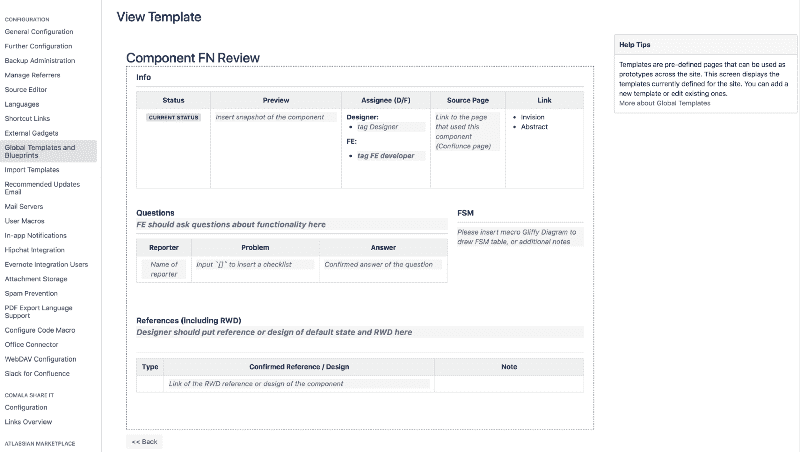

custom template for component review in Confluence

### **2。吉拉**

**角色:**问题跟踪和行动类型管理

也是 Atlassian 家族的成员，[吉拉](https://www.atlassian.com/software/jira)是一个超级强大的问题跟踪和项目规划软件。我最喜欢的部分是定制问题工作流程。因为有很多关于如何利用吉拉的教程，我想在这里指出的唯一一件事就是使用下面提到的问题类型。

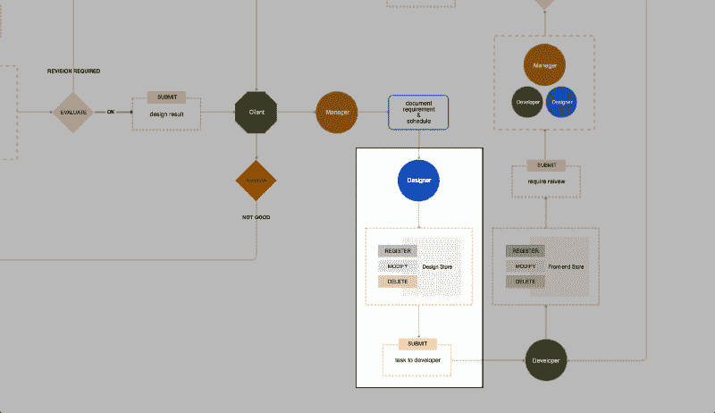

designer update design store

#### **示例:**通过[发布类型](https://confluence.atlassian.com/jiraportfolioserver024/configuring-initiatives-and-other-hierarchy-levels-934716034.html)向开发人员更新设计商店的变更

为了确保开发人员基于正确的设计视图构建组件，他们需要在设计存储中的内容更新时得到通知，这包括像**注册、修改和删除**这样的操作。因此，当组件被更新时，设计者应该与指定的负责开发人员一起打开问题，并选择正确的问题/操作类型。

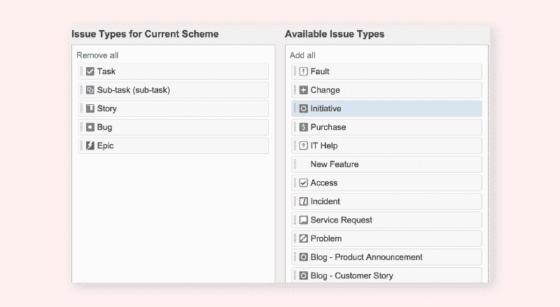

[Jira issue types function](https://confluence.atlassian.com/jiraportfolioserver024/configuring-initiatives-and-other-hierarchy-levels-934716034.html)

### **3。充气台**

**角色:**组件管理和进度仪表板

Airtable 是电子表格和数据库的混合体，是让这个堆栈工作的东西。有两个惊人的特性支持我的工作流:单个表格中的四种视图转换和相关内容链接。我将在这里展示两个使用这两个特性的例子。

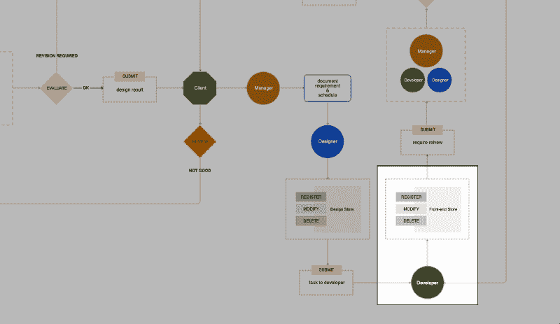

developer starts working on the task

#### **例 1:** 组件管理

你如何管理你的组件库？我们选择不使用样式指南生成器，因为设计者无法对其进行编辑。使用草图组件库也不合适，因为如果我们试图在软件本身的范围之外使用它，它会有太多的限制。

我不会说 Airtable 是一个完美的解决方案，但它是我能想到的最简单、最灵活的选择。请在此处查看组件管理表的演示模板:

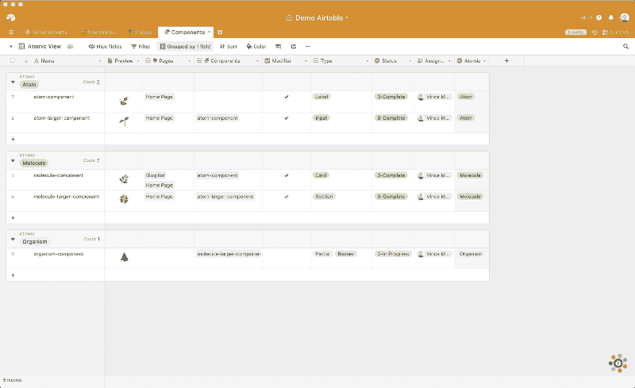

component table

一旦一个新注册的准备好可以编程开发的设计视图被提交给开发人员，他们将基于 ABEM 系统评估该视图，并将其注册到表中。表中有 9 列，包括:

**1。名称:**ABEM 原理中组件的命名

**2。预览:**组件的截图或导出图像

**3。链接页面:**链接到包含该组件的页面

**4。子组件:**到子组件的链接包含这个

**5。修饰符:**检查是否有样式变化(例如:—活动，—红色)

**6。组件类别:**一个通用的类别分类(例如:文本、英雄、侧边栏)

**7。开发状态:**开发进度的状态(待定、已分配、进行中、完成、修订中)

**8。受托人:**负责该组件的开发人员

**9。原子级:**该成分的原子类别(原子、分子、有机体)

这里最好的一点是，您可以引用同一个表和其他表中的数据。这种点的连接防止事情随着规模的增长而变得更加混乱。另请注意，您可以轻松地过滤、排序和更改视图。

#### **例 2:** 页面开发状态

因为这里的假设是我们将不可避免地逐页评估开发进度，所以为此目的设计的表格模板是必要的。该表可以是两个内部团队的进度仪表板，同时与客户共享。

page list table

关于页面的任何信息，包括截止日期、Vision 原型链接、受让人和子组件，都可以在这里进行组织。注意，同时记录和更新设计、前端和后端开发状态非常方便。

### **4。摘要**

**角色:**单一来源的事实和设计资产版本控制

[摘要](https://www.abstract.com/)是 [GitHub](https://github.com/) 的[草图](https://www.sketchapp.com/)资产，将设计师从复制粘贴文件的地狱中解救出来。演示管理版本控制流的细节超出了本文的范围。这里的关键要点是，抽象是设计商店，它充当真理的单一来源。设计师应该不断更新 master branch 到确认设计的最新版本，然后通知开发者。另一方面，开发者应该只以主分支中的设计资产作为参考。

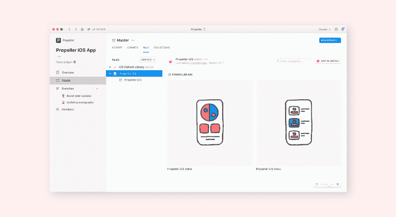

[Abstract branch template](https://www.abstract.com/how-it-works/)

### 还有更多的工作要做

从我自己的经验来看，采用这种新的工作流程后，整个项目的开发至少比以前快了两倍。这不是一个完美的解决方案，因为它仍然需要大量的手工劳动来更新和维护。

但我认为它可以成为网站开发团队寻找更好的工作流程的有益参考，并希望将来有更多的人可以分享他们的工作流程！

* * *

*？[中文](https://medium.com/as-a-product-designer/a-better-web-development-workflow-confluence-airtable-jira-abstract-zh-24fc8d5b8329)T3[版連結(中文版)](https://medium.com/as-a-product-designer/a-better-web-development-workflow-confluence-airtable-jira-abstract-zh-24fc8d5b8329)* */原帖*[*【vinceshao.com】*](https://www.vinceshao.com/blog/a-better-web-development-workflow-confluence-airtable-jira-and-abstract)