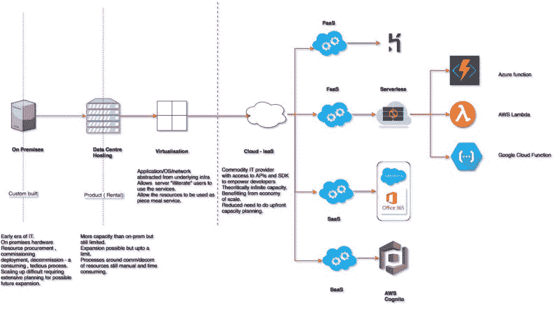
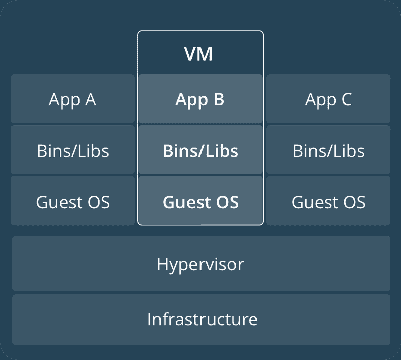
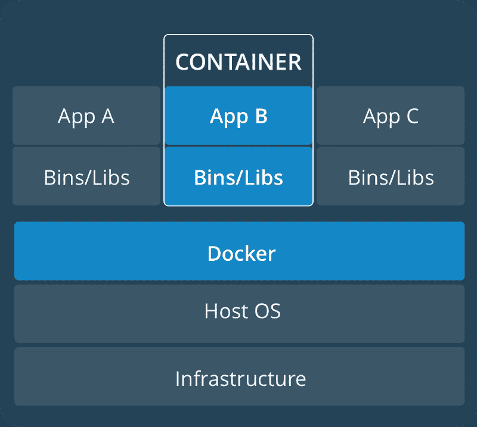

# 无服务器的简史(或者说，我是如何学会不再担心并开始热爱云的)

> 原文：<https://www.freecodecamp.org/news/a-brief-history-of-serverless-or-how-i-learned-to-stop-worrying-and-start-loving-the-cloud-7e2fc633310d/>

作者:Himanshu Pant

# 无服务器的简史(或者说，我是如何学会不再担心并开始热爱云的)

Gee, I wish we had one of them doomsday machines.

### **从前……**

#### **开头**

在 20 世纪 50 年代的美好时光里，当猫王凭借《监狱摇滚》等热门歌曲统治排行榜时，一种被称为大型机的计算范式出现了(与阿诺德·施瓦辛格无关)。

IBM 是这一领域的主要推动者和动摇者，其他一些小供应商有时会给蓝色巨人带来竞争。

这些早期的野兽完全是面向批处理的 John Appleseed 先生可以在穿孔卡上输入他的指令(阅读程序)(见下文),把它传给操作团队，然后出去喝杯咖啡，甚至离开一天。

By Arnold Reinhold — I took this picture of an artifact in my possession. The card was created in the late 1960s or early 1970s and has no copyright notice., CC BY-SA 2.5, [https://commons.wikimedia.org/w/index.php?curid=775153](https://commons.wikimedia.org/w/index.php?curid=775153)

操作员将安排和执行先前提交的穿孔卡。

© MITRE Corporation

有趣的事实:上图是 62，500 张穿孔卡片上的 5Mb 数据。所以只要想象一下，如果我们还在使用这种技术，要捕获 Win 10 或 MacOS 的代码库需要多少张卡！

一旦输出被生成/打印出来，操作员会亲自收集它，并把它存入 Appleseed 先生的隔间或物理邮箱。在线访问主要保留给需要它的资源，比如航空公司订票柜台的工作人员。

因此，对于那些尽管有基于 GUI 的 ide 来进行软件开发却仍在哭泣的人，如果你认为你的工作很难——想想这些先驱吧。

不用说，上述过程不仅缓慢，而且极其昂贵。以至于系统的使用在几秒钟内就被计量并计入客户的账户。

代码重写极其麻烦和耗时。事实上，仔细想想，这可能是那个时代的开发人员拥有出色编码技能的原因，因为正如一位 Real slim shady 先生所说:

#### **PC 时代**

接下来是个人电脑时代，这是个人电脑形式的技术民主化。

处理模型开始从基于大型机的集中式系统转向基于客户机-服务器的模型。随着业务的步伐开始呈指数增长，基础设施规划、采购和维护成为软件开发的一个重要部分。

因此，在基于客户机-服务器的系统上部署软件并伴随着对未来容量增长的预测是很常见的。必须为此做好准备。事实上，典型的工程师的工作是艰难的——但这也要求他是一个预言家。

所以现在，我们可怜的苹果籽先生有很多事情要解决。他不仅必须弄清楚业务团队以需求的形式在说什么，而且他还必须学习所有的编码工具、标准、最佳实践和要遵循的创新。

他还必须考虑一些参数，如软件的使用模式可能是什么，未来的增长速度可能是快还是慢，以及最佳的硬件可能是什么，以便在性能和成本效率之间取得正确的平衡。

任何特定组织中的官僚障碍都确保了倒霉的工程师总是被卡在魔鬼和深海之间。

除了因为不断变化的需求和不断变化的截止日期而失眠之外，他还不得不应对基础设施采购的变化无常。在大型机领域，情况稍好一些，因为硬件采购并不常见。但是资源分配仍然是一个苦差事，这导致了很多心痛。

#### **云时代**

2000 年代中期，一种新的计算模式出现了:“云”它改变了计算的本质，因为它是众所周知的。

在我们更深入地研究它之前，让我们花点时间来更新一下美国国家标准与技术研究院(NIST)给出的“云”的定义:

> *云计算是一种模式，支持对可配置计算资源(例如网络、服务器、存储、应用程序和服务)的共享池进行便捷的按需网络访问，只需最少的管理工作或服务提供商干预，即可快速供应和释放这些资源。五大属性定义了基于云的系统，即*

> *a)按需自助服务*

> *b)广泛的网络接入*

> *c)资源池*

> *d)快速弹性*

> *e)服务测量*

> *这种模式的关键促成因素是:-*

> *a)快速广域网*

> *b)强大的商用服务器*

> *c)商用硬件的高性能可视化*

我们敬爱的 Appleseed 先生现在很开心——毕竟，他不再受基础设施工程师的支配，无法获得服务器或存储设备。只需按下按钮，他就可以获得计算能力、存储、队列和任何其他类似的服务。

计算机世界一切都很好。但是苹果籽先生忠于他的人性，是一个有进取心的物种，他开始思考如何让他的生活更轻松。

此外，世界正以前所未有的企业规模快速数字化。这使得预先分配硬件的做法成为一种弄巧成拙的做法。所有与数字世界的互动都变得主要由事件驱动。

#### **进入无服务器架构**

2015 年(或者有人说 2012 年)是这种计算范式产生的时候。对于这个术语(无服务器)及其含义有许多解释。

一种观点将其归因于后端即服务(BaaS)。例如，由谷歌或脸书等第三方提供商提供的认证服务。

另一个学派将其与一个概念联系起来，在这个概念中，具有业务(即服务器端)逻辑的应用程序运行在无状态容器上，完全由第三方提供商管理，这被称为功能即服务(Faas)。

本文主要关注这个概念的第二个定义，因为它对 web 应用程序的构建方式有着有趣的影响。

#### **云计算模式的简要演变**

FaaS 的核心是一个简单的概念，这意味着:

*   开发团队不应该担心后端服务器、其维护、采购或扩展(嗯，在某种程度上)。团队所要担心的只是应用程序逻辑。
*   在无状态的计算容器上执行处理。换句话说，在一个逻辑处理单元之后，系统不再存储处理属性
*   与具有长时间运行进程的服务器(比如 cron)不同，这里的处理仅在合格的“**事件”**发生时启动，并在处理完成或经过设定的时间(以较早发生的为准)时终止。

这并不意味着在整个计划中没有服务器。这意味着服务器和它们的维护对开发者来说是隐藏的。

此外，由于计算的物理单元现在是一个容器，所以不需要长时间运行的服务器，在其上运行事件侦听器来执行任何处理。合格的事件源可以插入系统，服务将接管。

#### **什么无服务器不是**

> *“名字里有什么？我们称玫瑰为别的名字，它闻起来还是一样的香”。—朱丽叶，罗密欧与朱丽叶*

就像任何新的创新一样，更多的时候，供应商使用炫目的名字将旧酒重新包装在新的瓶子里，可以说，以获得更多的眼球。

在无服务器的情况下，这种混乱更加普遍。这是因为这一概念是在很短的时间内发展起来的，与其他容易混淆的概念非常接近。

所以在这里，我试着澄清一下无服务器通常(或可能)与什么相混淆。我也分享一下我的两分钱。

#### **它不是一个容器**

> 容器映像是一个轻量级的、独立的、可执行的软件包，它包含了运行它所需的一切:代码、运行时、系统工具、系统库、设置。基于 Linux 和 Windows 的应用程序都可以使用容器化软件，无论环境如何，容器化软件都可以运行。容器将软件从其周围环境中隔离出来，例如开发和登台环境之间的差异，并有助于减少在同一基础设施上运行不同软件的团队之间的冲突。”——【Docker.com 

容器是计算领域最近的一项创新。谷歌通过在它上面运行 Gmail 来推广它。容器对于维护跨各种计算环境运行的软件的可靠性和同质性是有用的。

例如，代码可能是在 Java 8 中开发的，但是产品可能是在 Java 9 中——所以在 dev 中运行良好的代码可能会在产品中抛出奇怪的错误。

粗略地说，容器是服用类固醇的昔日 VM(虚拟机)。它没有个别操作系统版本的多余赘肉。与虚拟机不同，在虚拟机中，曾经有一个单独的客户操作系统副本(从而使虚拟机资源繁重)，容器共享底层操作系统内核。与虚拟机相比，这允许在特定的机器上运行多个容器。

#### **虚拟机对容器**

VM vs Container

容器解决了这个问题的一部分:它们提供了一个同质的运行时生产环境，尽管代价是增加了维护工作量。

然而，公平地说，容器通常更适合不同类型的工作负载(比如那些本来就更复杂的负载)。因此，它们在企业 IT 环境中受到青睐，在这种环境中，已经有一个整体开始运行，组织可能希望将其快速移植到云中。

水平扩展是一个向量，在这个向量中，serverless 抢了容器的风头。现代云供应商**【理论上】**为他们的无服务器产品提供无限的扩展能力。最棒的是，这种扩展对用户完全透明。

无服务器计算更适合事件驱动的异步操作，而容器似乎更适合同步请求/RESP 工作负载。

但是考虑到事情变化的速度，这种差异会在很短的时间内变得很小。

#### **不是 PaaS**

> “平台即服务”(PaaS)是一种云计算模式，其中第三方提供商通过互联网向用户提供硬件和软件工具，通常是应用程序开发所需的工具。PaaS 提供商在其自己的基础设施上托管硬件和软件。因此，PaaS 使用户不必安装内部硬件和软件来开发或运行新的应用程序。" — Techtarget

就像容器一样，PaaS 的不同之处主要在于扩展的向量。无论 PaaS 供应商如何宣称他们的产品，它仍然需要一些管理维护工作，不像无服务器。

有了 PaaS，系统中总会有一个最小的运行空间，这将会增加成本。然而，无服务器，它可以降低到绝对零度。

鉴于其更先进的生态系统、工具和语言支持，PaaS 可能仍然是一个不错的选择。然而，鉴于无服务器领域的高速发展，这不应该成为一个阻碍。