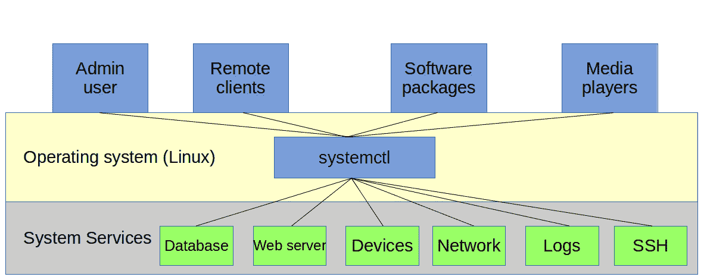
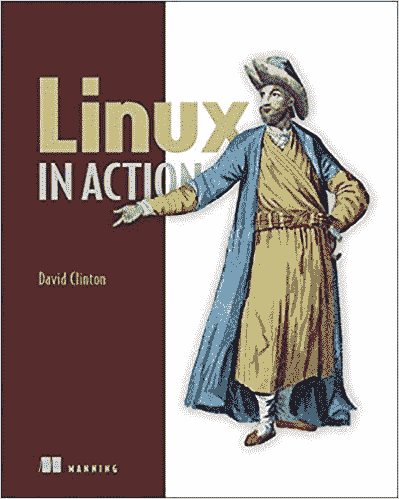

# systemd——Linux 进程管理器的简要概述和历史

> 原文：<https://www.freecodecamp.org/news/a-brief-overview-and-history-of-systemd-the-linux-process-manager/>

智能地运行 Linux 服务包括知道如何测试它们的状态，这反过来要求理解现代 Linux 发行版如何管理进程。本文将简要探讨 systemd 的功能和历史——这个过程管理器似乎让人又爱又怕又恨。

你的 Linux 机器上的某些东西没有运行？故障排除是你的朋友。但是，在到达目的地之前，难道不应该确保底层服务正在运行吗？有时配置文件默认设置为非活动状态。

您可以使用 *systemctl status* 来查明您的机器上是否正在运行一个服务——本例中是 OpenSSH:

$ systemctl 状态 ssh
● ssh.service - OpenBSD 安全 Shell 服务器
Loaded:Loaded(/lib/systemd/system/ssh . service；已启用；厂商预置:已启用)
活跃:活跃(正在运行)自周一 2017-05-15 12:37:18 UTC；4h 47 分钟前
主 PID: 280 (sshd) < 2 >
任务:8
内存:10.1m
CPU:1.322s
c group:/system . slice/ssh . service
├─280/usr/sbin/sshd-d
├─894 sshd:Ubuntu【priv】
├─903 sshd:Ubuntu @ pts/4
├─...]

在这种情况下，正如您从输出的活动行中看到的，一切都很好。如果你不得不自己启动它，你可以再次使用 systemctl，但是这次用 *start* 代替 *status* 。厌倦了你的新玩具？会替你收好的。

`# systemctl stop ssh`

那个系统公司的家伙看起来不错，但我们几乎没有机会见到他。让我们深入挖掘一下。

## Linux 进程管理

首先，什么是 systemctl，它实际上在做什么？为了正确回答这个问题，您必须考虑一下 Linux 一般是如何管理系统进程的。由于认识新朋友总是令人愉快的，您还将了解一些过程跟踪工具，以便更容易理解事情的工作方式。

我相信你已经知道，软件是包含指令的程序代码，代表人类用户控制计算机硬件。操作系统是一种工具，用于组织和管理软件包，以便它们可以有效地利用计算机的硬件资源。为复杂的多流程和多用户操作环境组织和管理流程不是一件简单的任务。为了让它工作，你需要某种交通警察来严密控制许多移动的部分。我给你介绍一下 systemctl，Linux 警察局交通科的一个勤快的警官。

The availability and responsiveness of many system services are managed by systemd’s systemctl process manager

## 使用 ps 命令查看进程

让我们拿出一个电子显微镜，看看我们能否在它的自然栖息地发现一个真实的过程。当一台 Linux 计算机启动时，第一个被唤醒并使其他一切正常运行的进程叫做 init(尽管我们很快就会发现，这个名字可能会引起误解)。您可以自己看到，init 首先是按照这里打印的方式运行下面的 ps 命令——我马上会解释细节。

$ ps -ef | grep init
root         1     0  0 12:36 ?        00:00:00 /sbin/init
ubuntu    1406   904  0 16:26 pts/4    00:00:00 grep --color=auto init

输出最右边的一列(第一行的/sbin/init)表示进程本身后面的文件的位置和名称。在本例中，它是一个名为“init”的文件，位于/sbin 目录中。第一行最左边的一列包含单词 *root* ，告诉我们这个流程的所有者是 root 用户。我们现在唯一感兴趣的另一条信息是数字 1，它是 init 进程的进程 ID (PID)。获得 PID 1 的唯一方法是比任何人都先到。

顺便说一下，ps 命令显示的第二行是分配给 grep 命令本身的进程。注意它的主人是 ubuntu(我的用户名)，它的 PID 远远高于 1。

在继续之前，花点时间和 ps 在一起是值得的。正如您所看到的，ps 显示关于活动进程的信息。访问与流程相关的信息通常很重要，这样我们就可以正确规划系统行为并对其进行故障排除。你可以期待早日和经常使用 ps。

如果您只键入 ps 并运行它，您可能只会得到两个结果:第一个是一个名为 bash 的进程，它表示当前 shell 会话正在使用的 Bash 命令解释器，另一个是最近的命令(当然是 ps)。但是通过查看分配给 Bash 的 PID(在本例中为 7447)，您就会知道在您的系统中还有很多其他进程正在努力工作。这些将由父 shells 产生，一直追溯到 init 进程本身。

$ ps
PID TTY 时间 CMD
7447 pts/3 00:00:00 bash
8041 pts/3 00:00:00 PS

如上所述，向 ps 添加-e 参数不仅会返回当前子 shell 中运行的进程，还会将所有父 shell 中的所有进程返回到 init。

父外壳是一个外壳环境，新的(子)外壳随后可以从其中启动，程序也可以通过它运行。你可以把你的 GUI 桌面会话想象成一个 shell，而你打开来获取命令行的终端就是它的孩子。顶层外壳(祖父母？)是 Linux 启动时首先运行的。

如果您想要可视化父和子 shells 进程，您可以使用`pstree`命令(添加-p 参数来显示每个进程的 PID 号)。请注意第一个进程(被赋予 PID 1)是如何被 *systemd* 的。在旧版本的 Linux 上，这应该被称为 *init* 。

$ pstree-p
)
)

)

继续在您自己的机器上尝试所有这些命令。即使在安静的系统上，您也可能会看到几十个进程；一台繁忙的台式 PC 或服务器可以轻松拥有数千台。

## 使用系统

我们刚刚看到的/sbin/init 文件有些有趣的地方。“文件”是一个古老的 Unix 程序，它给你一个文件的内部信息。如果您使用/sbin/init 作为参数运行*文件*,您将会看到 init 文件实际上并不是一个程序，而只是一个名为 systemd 的程序的符号链接。

$ file /sbin/init
/sbin/init:指向/lib/systemd/systemd 的符号链接

经过多年的分裂和激烈的政治斗争，现在几乎所有的 Linux 发行版都使用同一个进程管理器:systemd。systemd 是 init 进程的替代产品。我所说的“替代”是指，即使它完成事情的方式可能非常不同，对于不经意的观察者来说，systemd 的功能就像 init 一直做的那样。这就是为什么/sbin/init 文件现在实际上只不过是 systemd 程序的一个链接。

这都有点理论性，因为您可能永远不会真正通过名称调用 systemd 程序本身——无论是直接调用还是通过它的/sbin/init 前端调用。正如您已经看到的，这是因为关键的管理任务是由 systemctl 代表 systemd 处理的。

从技术上讲，systemd 的主要工作是控制单个进程的诞生、生存和死亡方式。我们上面使用的 systemctl 命令是这些任务的首选工具。但是——有些争议 systemd 开发人员扩展了功能，使其远远超出了传统的进程管理角色，可以控制各种系统服务。在新的 systemd 保护伞下包括了像日志管理器(journald)、网络管理器(networkd)和设备管理器(你猜对了:udevd)这样的工具。好奇？“d”代表守护进程；一个后台系统进程。

*本文改编自我的* [*曼宁《Linux in Action》一书*](https://www.manning.com/books/linux-in-action?a_aid=bootstrap-it&a_bid=4ca15fc9) *的第三章(远程连接:安全访问联网机器)。这还有更多的乐趣——包括 Pluralsight* *上的* [*Linux 和 Docker 管理课程，以及一个名为*](http://pluralsight.pxf.io/c/1191769/424552/7490?subId1=solving&u=https%3A%2F%2Fapp.pluralsight.com%2Fprofile%2Fauthor%2Fdavid-clinton)[*Linux in Motion*](https://www.manning.com/livevideo/linux-in-motion?a_aid=bootstrap-it&a_bid=0c56986f&chan=motion1)*的混合课程，该课程由两个多小时的视频和大约 40%的 Linux 操作文本组成。谁知道呢……你可能也会喜欢我的其他书籍和课程。*