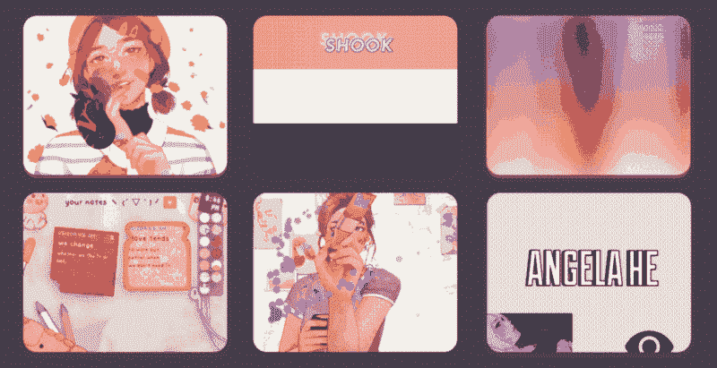
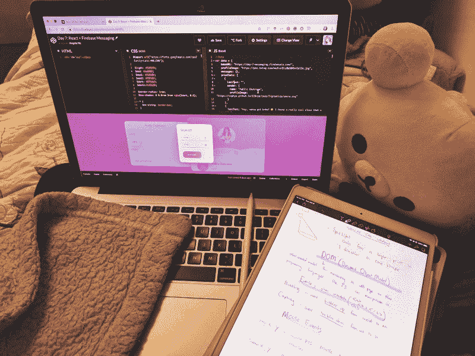
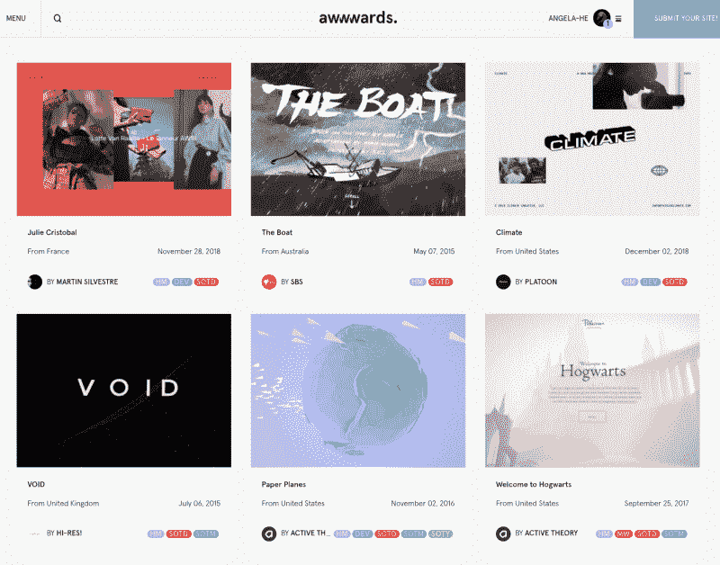
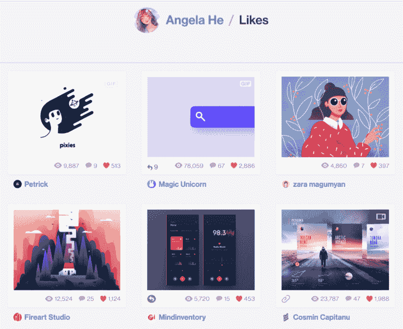
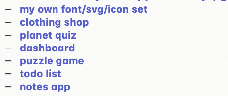

# 一个编码项目一天 20 天

> 原文：<https://www.freecodecamp.org/news/a-coding-project-a-day-for-20-days-5cd4c9383f84/>

作者:何

# 一个编码项目一天 20 天

#### 我如何在 20 天内自学网络开发

这是斯坦福大学学生寒假的第一天。回到家里，我打开了十几个编码灵感标签，进入代码编辑器，创建了我的第一个编码项目。20 天后，我完成了最后一个项目，然后收拾行李，飞去回到大学校园。

我挑战自己每天编写一个项目，这样我就可以获得技能，让一个网站像激励我的网站一样令人惊叹。让我的众多想法变成现实，并能够与世界分享，一直是我的动力，先是艺术，现在是代码。

在那 20 天里，我自学了多种 web 开发语言，并创建了许多项目，包括一个消息应用程序、一个 notes 应用程序和一个聊天机器人。

你可以在 [CodePen](https://codepen.io/collection/DrwVaz/) 上找到我的 20 天项目。

以下是我的工具，创作过程，以及结尾的一些反思。

### **工具**

我使用了以下所有工具，但是除了 HTML、CSS、Javascript 和代码编辑器之外的所有工具都是可选的。

*   [CodePen。](https://codepen.io)一个 HTML、CSS 和 Javascript 的在线代码编辑器，用户可以在这里展示他们的工作——非常适合让你的 web 开发代码被看到。
*   [Photoshop。](https://www.adobe.com/products/photoshop.html)世界级的图形编辑器，用于创建光栅图形。我用这个和一个 Huion 平板电脑为某些项目制作了图形。
*   HTML。超文本标记语言；创建网页的内容。
*   [帕格。](https://github.com/pugjs/pug)一个模板引擎，为 HTML 提供了一个更加干净的、对空白敏感的语法——非常有利于加速开发。
*   [自举。](https://getbootstrap.com/)一个用于快速启动响应组件的组件库。伟大的速度；对于独特的设计来说就不那么好了，因为每个组件都有预定的外观。
*   CSS。级联样式表；决定了网页的设计。
*   [萨斯。](https://sass-lang.com/)样式表语言，提供变量、函数、混合等来简化 CSS 的创建。
*   Javascript。用于定义网页的不可预测或用户控制的事件。
*   [做出反应。](https://reactjs.org/)一个 Javascript 库，通过将每个部分分成可重用的组件来帮助维护状态和创建网页内容。
*   [jQuery。](https://jquery.com/)一个帮助简化 HTML DOM 操作和遍历的 Javascript 库——然而，请注意，它的易用性是以其相对较大的大小为代价的——大约 30 KB。
*   [three.js.](https://threejs.org/) 用于创建和显示 3D 模型的 Javascript 库。
*   [火基。](http://firebase.com/)一个移动和网络平台，提供对数据库、消息传递、认证和其他服务的便捷访问。

Collecting inspiration from Awwwards, CodePen, and Dribbble

### **创作过程**

为了成功地创建一个项目，我必须做两件事:

1.  有想法，
2.  我知道这是可行的。

因此，我的创作过程分三步进行—

#### **1。获得一个想法(30 分钟)**

我每个项目的目标是在学习新东西的同时做一些酷的东西。带着这个想法，我浏览了我最喜欢的设计和网络开发网站来寻找灵感—

我最喜欢的设计网站:

*   [Dribbble](https://dribbble.com) .
*   行为。
*   [日常 UI](http://dailyui.co) 。

我最喜欢的网站:

*   [CodePen](https://codepen.io) 。
*   [前进](https://awwwards.com)。
*   [Codrops](https://tympanus.net/codrops/category/tutorials/) 。
*   [CodyHouse](https://codyhouse.co/library) 。)

头脑风暴出了一系列想法，如下所示—

A brainstorm

…然后从列表中选出我最喜欢的作为当天的官方创意**。**

#### **2.寻找例子(30 分钟)**

**对于我的每一个想法，我知道其中的一部分必须在网络上实现。我在互联网上搜寻优雅的实现。一些通常导致公共解决方案的网站包括—**

*   **[GitHub](https://github.com)**
*   **[密码笔](https://codepen.io)**
*   **[小提琴](http://jsfiddle.net)**
*   **[堆栈溢出](http://stackoverflow.com)**
*   **[普通的老谷歌](http://google.com)**
*   **..在任何网站上进入 Chrome 开发者工具，这似乎与我试图完成的事情相似。**

**我研究了已经做了什么，是如何做的，然后结合我所学到的，尽可能做出最干净的解决方案。**

**当你能改进过去时，没有必要重新发明轮子。**

#### **3.创造！(当天剩余时间)**

**有了想法和例子，我把我的想法变成了现实。每天都会有障碍，进展看起来慢得令人麻木。但是有了网上的研究，我从错误中学习，每天都变得更有见识，更快。**

****

### ****第 1–9 天:重新创建示例****

**在第 1 天到第 9 天，我选择了一个我特别喜欢的设计或网站，并试图重新创建它。**

### ****第 10-20 天:开发创意****

**一旦我对 web 开发更加熟悉，我就将我的编码项目建立在我一直想做的原创想法上，比如互动艺术、原创字体和可爱的 notes 应用程序。**

****

### ****倒影****

#### **1.学到了终身知识。**

**回顾过去，我从以前的地方走了很长一段路。在过去的 20 天里，我学习了 Bootstrap、jQuery、React、Pug、Sass 和其他工具，以及大量简洁的 HTML/CSS/Javascript 概念，如混合模式、遮罩和剪辑、动画、伪元素、媒体查询、闭包和上下文、承诺等等。这些将帮助我处理未来的项目，尤其是当 web 开发和渐进式 web 应用程序变得更加流行的时候。**

#### **2.时间永远不够。**

**虽然我学到了很多，但我没有学到我想要的那么多。我很难过我没有时间去学习我一直关注的其他工具，比如 [Vue.js](https://vuejs.org/) 、 [Redux](https://redux.js.org/) 、 [GreenSock](https://greensock.com/) 等等。尽管如此，这些都是我将来可以回去继续努力的事情。**

**最好花时间去理解我的工具，而不是在不理解的情况下从一个工具跳到另一个工具。**

#### **3.对自己越来越有信心。**

**最重要的是，我开始相信自己的编码和创造能力。**

**我不会(再次)开始一个大项目，也不会(再次)完成它，而是每一两天从头到尾完成一个项目，被迫在时间限制下缩小范围。**

> **随着每个项目的完成，我对自己实现目标的技能、雄心和能力越来越有信心。**

**不像去年寒假，我开始了一个(仍未完成的)项目，然后被它所需要的不可估量的工作所挫败，我被这次假期所鼓舞。今天，我对回到斯坦福感到满意，对我所学到的东西心存感激，更加自信，并渴望创造更多。**

****

**非常感谢[徐甜甜](https://uxdesign.cc/@tiantianxu)用她的 [100 天运动设计](https://uxdesign.cc/100-days-of-motion-design-463526af852f)启发了我！**

**如果你喜欢读这篇文章，一定要给一个。(或者几个！)这对我意义重大。？**

**你也可以在 [Twitter](https://twitter.com/zephybite) 、 [Tumblr](http://zephyo.tumblr.com) 、 [Instagram](https://instagram.com/zephybite) 和 [GitHub](https://github.com/zephyo) 上关注我，了解更多酷炫项目:)**