# 算法时间复杂性的咖啡时间介绍

> 原文：<https://www.freecodecamp.org/news/a-coffee-break-introduction-to-time-complexity-of-algorithms-64df7dd8338e/>

就像编写第一个`for`循环一样，理解时间复杂性是学习如何编写高效复杂程序的重要里程碑。你可以把它想象成一种超能力，让你甚至在运行一行代码之前，就能准确地知道在特定情况下什么类型的程序可能是最有效的。

复杂性分析的基本概念非常值得研究。您将能够更好地理解您正在编写的代码将如何与程序的输入交互，结果，您将花费更少的时间来编写缓慢且有问题的代码。

为了开始编写更高效的程序，复习你需要知道的所有知识不会花很长时间——事实上，我们可以在大约 15 分钟内完成。你现在可以去喝杯咖啡(或者茶，如果你喜欢的话)，我会在你的咖啡休息时间结束前带你去喝一杯。去吧，我等着。

都准备好了吗？我们开始吧！

### “时间复杂性”到底是什么？

算法的时间复杂度是该算法处理一些输入所需时间的近似值。它通过运算量来描述算法的效率。这不同于操作重复的次数。稍后我会详细说明这一点。一般来说，算法的运算次数越少，速度就越快。

我们使用[大 O 符号](https://en.wikipedia.org/wiki/Big_O_notation)来描述时间复杂度，它看起来有点像 *O* ( *n* )。在它的正式定义中涉及了相当多的数学，但是非正式地，我们可以说大 O 符号给了我们算法在最坏情况下的近似运行时间，或者换句话说，它的上限。它本质上是相对的和比较的。

我们描述的是算法相对于其输入数据大小增加的效率。如果输入是一个字符串，那么 *n* 就是该字符串的长度。如果是一个整数列表， *n* 是列表的长度。

用图表描绘大 O 符号代表什么是最容易的:

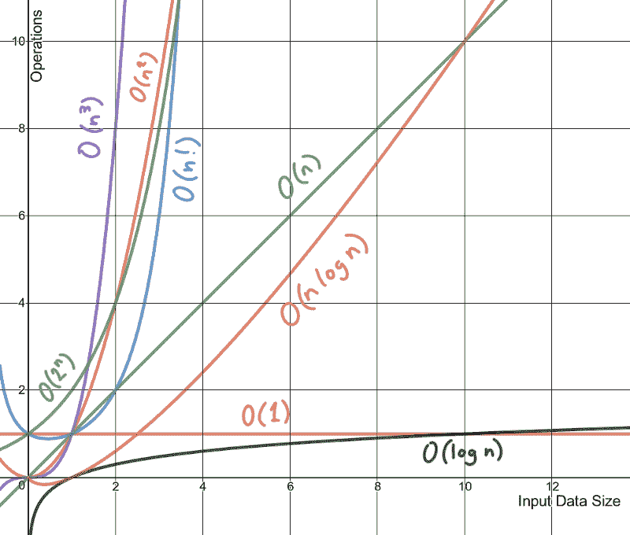

Lines made with the very excellent Desmos graph calculator. You can [play with this graph here](https://www.desmos.com/calculator/xpfyjl1lbn).

在阅读本文的其余部分时，请记住以下要点:

*   时间复杂度是一个近似值
*   一个算法的时间复杂度接近其最坏情况下的运行时间

### 确定时间复杂度

我们可以用不同种类的复杂度来快速理解一个算法。我将使用嵌套循环和其他例子来说明其中的一些类。

### 多项式时间复杂度

一个**多项式**，来自希腊语 *poly* ，意为“许多”，拉丁语 *nomen* 意为“名字”，描述了一个由常量变量、加法、乘法和非负整数幂的幂运算组成的表达式。这是一个超级数学化的说法，它包含了通常用字母表示的变量，和像这样的符号:


下面的类描述了多项式算法。有些有食物的例子。

#### 常数

**常数时间**算法不会根据输入数据改变其运行时间。无论接收的数据大小如何，算法运行的时间都是一样的。我们将此表示为时间复杂度为 *O* (1)。

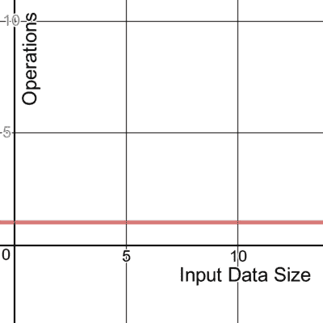

这里有一个常量算法的例子，它取切片中的第一项。

```
func takeCupcake(cupcakes []int) int {
	return cupcakes[0]
}
```


Choice of flavours are: vanilla cupcake, strawberry cupcake, mint chocolate cupcake, lemon cupcake, and “wibbly wobbly, timey wimey” cupcake.

有了这个常数时间算法，不管有多少纸杯蛋糕供应，你只能得到第一个。哦好吧。反正味道被高估了。

#### 线性的

**线性**算法的运行持续时间是恒定的。它将以 *n* 次运算处理输入。对于时间复杂性来说，这通常是最好的(最有效的)情况，其中必须检查所有数据。

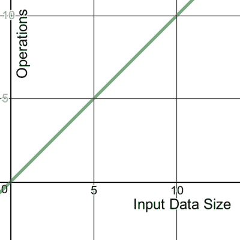

下面是一个时间复杂度为 *O* ( *n* )的代码示例:

```
func eatChips(bowlOfChips int) {
	for chip := 0; chip <= bowlOfChips; chip++ {
		// dip chip
	}
}
```

下面是另一个代码的例子，时间复杂度为 *O* ( *n* ):

```
func eatChips(bowlOfChips int) {
	for chip := 0; chip <= bowlOfChips; chip++ {
		// double dip chip
	}
}
```

循环中的代码执行一次、两次还是任意次都没有关系。这两个环路都以常数因子 *n* 处理输入，因此可以描述为线性的。


Don’t double dip in a shared bowl.

#### 二次的

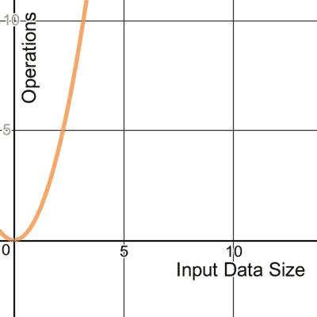

现在这里有一个代码的例子，时间复杂度为 *O* ( *n* 2):

```
func pizzaDelivery(pizzas int) {
	for pizza := 0; pizza <= pizzas; pizza++ {
		// slice pizza
		for slice := 0; slice <= pizza; slice++ {
			// eat slice of pizza
		}
	}
}
```

因为有两个嵌套循环或嵌套线性运算，所以该算法处理输入*n*2 次。

#### 立方体的

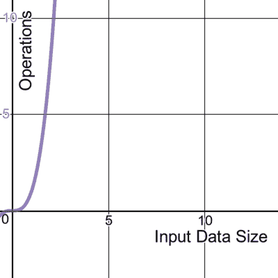

在前面例子的基础上扩展，这段有三个嵌套循环的代码的时间复杂度为 *O* ( *n* 3):

```
func pizzaDelivery(boxesDelivered int) {
	for pizzaBox := 0; pizzaBox <= boxesDelivered; pizzaBox++ {
		// open box
		for pizza := 0; pizza <= pizzaBox; pizza++ {
			// slice pizza
			for slice := 0; slice <= pizza; slice++ {
				// eat slice of pizza
			}
		}
	}
}
```


Seriously though, who delivers unsliced pizza??

#### 对数的

**对数**算法是一种在每一步减少输入大小的算法。我们将这个时间复杂度表示为 *O* (log *n* )，其中 **log** ，对数函数，是这样的形状:

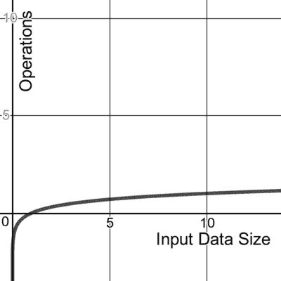

一个这样的例子是[二分搜索法算法](https://en.wikipedia.org/wiki/Binary_search_algorithm),它在一个排序的数组中找到一个元素的位置。假设我们试图找到元素 *x* ，它是如何工作的:

1.  如果 *x* 匹配数组的中间元素 *m* ，返回*m*的位置
2.  如果 *x* 与 *m* 不匹配，查看 *m* 是否大于或小于 *x.* 如果大于，丢弃所有大于 *m 的数组项*如果小于，丢弃所有小于 *m 的数组项*
3.  在剩余的阵列上重复步骤 1 和 2，直到找到 *x* 为止。

我发现理解二分搜索法最清晰的类比就是想象在书店的过道里找到一本书的过程。如果这些书是按照作者的姓氏组织的，你想找到“特里·普拉切特”，你知道你需要寻找“P”部分。

你可以在过道的任何一点靠近书架，在那里看作者的姓。如果你正在看一本尼尔·盖曼的书，你知道你可以忽略你左边的所有其他书，因为字母表中“G”之前的字母没有一个是“p”。然后你将沿着过道向右移动任何数量，并重复这个过程，直到你找到特里·普拉切特部分，如果你在任何一家像样的书店，这应该是相当大的，因为哇，他写了很多书。

#### `Quasilinear`

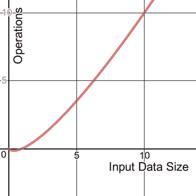

常见于排序算法，时间复杂度 *O* ( *n* log *n* )可以描述一个数据结构，其中每个操作花费 *O* (log *n* )时间。这方面的一个例子是[快速排序](https://en.wikipedia.org/wiki/Quicksort)，一种分治算法。

快速排序的工作原理是将一个未排序的数组分成更小的更容易处理的块。它对子数组进行排序，从而对整个数组进行排序。把它想象成试图把一副牌按顺序排列。如果你把牌分了，找五个朋友来帮你会更快。

### 非多项式时间复杂度

以下几类算法是非多项式的。

#### 阶乘

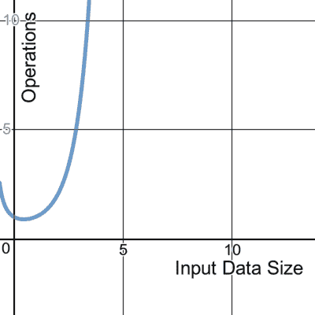

一个时间复杂度为 *O* ( *n* 的算法！)经常遍历输入元素的所有排列。一个常见的例子是一个[蛮力搜索](https://en.wikipedia.org/wiki/Brute-force_search)，见于[旅行推销员问题](https://en.wikipedia.org/wiki/Travelling_salesman_problem#Computing_a_solution)。它试图通过枚举所有可能的排列并找到成本最低的排列来找到多个点之间成本最低的路径。

#### 指数的

一个**指数**算法通常也会遍历输入元素的所有子集。它被表示为 *O* (2 *n* )，经常出现在强力算法中。它类似于阶乘时间，除了它的增长率，正如你听到的那样，它是指数级的。数据集越大，曲线变得越陡。

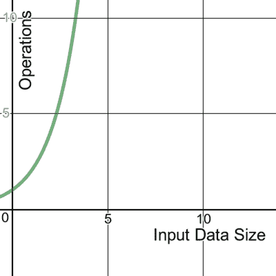

在密码学中，强力攻击可以通过迭代子集来系统地检查密码的所有可能元素。使用指数算法来做到这一点，暴力破解长密码和短密码会变得非常耗费资源。这就是长密码被认为比短密码更安全的原因之一。

还有一些不太常见的时间复杂度类，我不会在这里介绍，但是你可以阅读这些，并在[这个方便的表格](https://en.wikipedia.org/wiki/Time_complexity#Table_of_common_time_complexities)中找到例子。

### 递归时间复杂度

正如我在我的文章[使用苹果派](https://vickylai.com/verbose/reduce-recursion-with-pie)解释递归中所描述的，递归函数在特定的条件下调用自己。它的时间复杂度取决于函数被调用的次数和单次函数调用的时间复杂度。换句话说，它是函数运行的次数和单次执行的时间复杂度的乘积。

下面是一个递归函数，它吃馅饼直到没有馅饼剩下:

```
func eatPies(pies int) int {
	if pies == 0 {
		return pies
	}
	return eatPies(pies - 1)
}
```

单次执行的时间复杂度是恒定的。无论输入多少个馅饼，程序都会做同样的事情:检查输入是否为 0。如果是，则返回，如果不是，则少一个馅饼来调用自己。

pie 的初始数量可以是任意数量，我们需要处理所有的 pie，所以我们可以将输入描述为 *n* 。这样，这个递归函数的时间复杂度就是乘积 *O* ( *n* )。

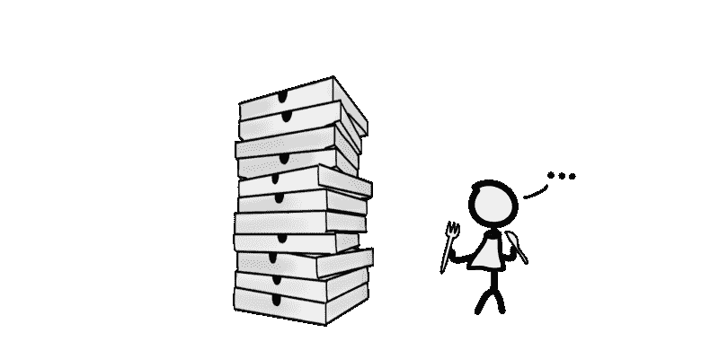

This function’s return value is zero, plus some indigestion.

### 最坏情况时间复杂度

到目前为止，我们已经讨论了一些嵌套循环和一些代码示例的时间复杂性。然而，大多数算法都是由这些算法的许多组合构建而成的。我们如何确定包含许多这些元素的算法的时间复杂度？

简单。我们可以通过找出算法所有部分中的最大复杂度来描述算法的总时间复杂度。这是因为代码中最慢的部分是瓶颈，而时间复杂度是指描述算法运行时的最坏情况。

假设我们有一个办公室聚会的计划。如果我们的程序看起来像这样:

```
package main

import "fmt"

func takeCupcake(cupcakes []int) int {
	fmt.Println("Have cupcake number",cupcakes[0])
	return cupcakes[0]
}

func eatChips(bowlOfChips int) {
	fmt.Println("Have some chips!")
	for chip := 0; chip <= bowlOfChips; chip++ {
		// dip chip
	}
	fmt.Println("No more chips.")
}

func pizzaDelivery(boxesDelivered int) {
	fmt.Println("Pizza is here!")
	for pizzaBox := 0; pizzaBox <= boxesDelivered; pizzaBox++ {
		// open box
		for pizza := 0; pizza <= pizzaBox; pizza++ {
			// slice pizza
			for slice := 0; slice <= pizza; slice++ {
				// eat slice of pizza
			}
		}
	}
	fmt.Println("Pizza is gone.")
}

func eatPies(pies int) int {
	if pies == 0 {
		fmt.Println("Someone ate all the pies!")
		return pies
	}
	fmt.Println("Eating pie...")
	return eatPies(pies - 1)
}

func main() {
	takeCupcake([]int{1, 2, 3})
	eatChips(23)
	pizzaDelivery(3)
	eatPies(3)
	fmt.Println("Food gone. Back to work!")
}
```

我们可以用最复杂部分的复杂度来描述所有代码的时间复杂度。这个程序由我们已经看到的函数组成，具有以下时间复杂度类:

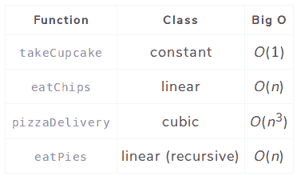

为了描述整个办公室聚会程序的时间复杂性，我们选择最坏的情况。这个程序的时间复杂度为 *O* ( *n* 3)。

这是办公室派对的配乐，只是为了好玩。

```
Have cupcake number 1
Have some chips!
No more chips.
Pizza is here!
Pizza is gone.
Eating pie...
Eating pie...
Eating pie...
Someone ate all the pies!
Food gone. Back to work!
```

### p 对 NP，NP 完全，NP 难

在探索时间复杂性的过程中，你可能会遇到这些术语。非正式地说， **P** (表示多项式时间)，是一类快速解决的问题。 **NP** ，对于非确定性多项式时间，是一类可以在多项式时间内快速验证答案的问题。NP 包含 P，但也包含另一类被称为 **NP-complete** 的问题，目前还没有快速的解决方案。在 NP 之外，但仍然包括 NP-complete 的是另一个称为 **NP-hard** 的类，它包括没有人能够用多项式算法可验证地解决的问题。

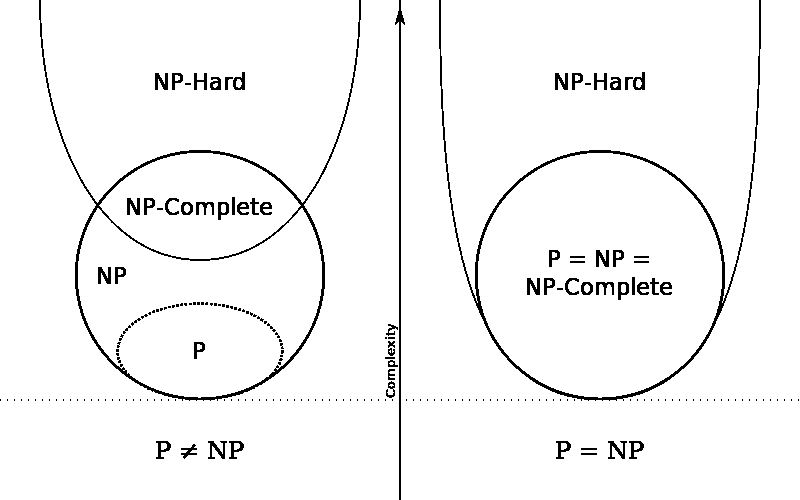

P vs NP Euler diagram, [by Behnam Esfahbod, CC BY-SA 3.0](https://commons.wikimedia.org/w/index.php?curid=3532181)

P 对 NP 是计算机科学中一个未解决的公开问题。

无论如何，你通常不需要知道 NP 和 NP 难问题来开始利用理解时间复杂性的优势。他们完全是另一个潘多拉魔盒。

### 在你写代码之前，估算一个算法的效率

到目前为止，我们已经确定了一些不同的时间复杂度类别，以及如何确定算法属于哪一类。那么在我们写任何代码来评估之前，这对我们有什么帮助呢？

通过结合对时间复杂性的一点了解和对输入数据大小的认识，我们可以推测出在给定的时间约束内处理数据的有效算法。我们可以把我们的估计建立在这样一个事实上，即现代计算机一秒钟可以完成几亿次运算。《竞争程序员手册》中的下表提供了在一秒钟的时限内处理相应输入大小所需时间复杂度的一些估计。

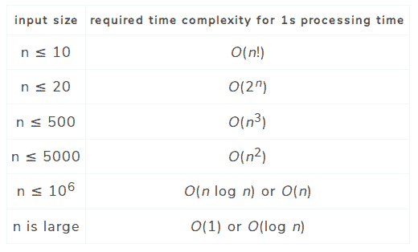

请记住，时间复杂性是一个近似值，而不是一个保证。我们可以通过立即排除不太可能适合我们的约束的算法设计来节省大量时间和精力，但我们也必须考虑到大 O 符号没有考虑到**常数因子**。这里有一些代码来说明。

以下两种算法都有 *O* ( *n* )的时间复杂度。

```
func makeCoffee(scoops int) {
	for scoop := 0; scoop <= scoops; scoop++ {
		// add instant coffee
	}
}
func makeStrongCoffee(scoops int) {
	for scoop := 0; scoop <= 3*scoops; scoop++ {
		// add instant coffee
	}
}
```

第一个函数按照我们要求的勺数制作一杯咖啡。第二个函数也可以冲一杯咖啡，但是它把我们要的勺数增加了两倍。为了看一个说明性的例子，让我们为一杯有一百万勺的咖啡询问这两个函数。

下面是 Go 测试的输出:

```
Benchmark_makeCoffee-4          1000000000             0.29 ns/op
Benchmark_makeStrongCoffee-4    1000000000             0.86 ns/op
```

我们的第一个函数`makeCoffee`，平均 0.29 纳秒完成。我们的第二个函数，`makeStrongCoffee`，平均 0.86 纳秒完成。虽然这两个数字看起来都很小，但考虑到浓咖啡的制作时间几乎是普通咖啡的三倍。这在直觉上应该是有意义的，因为我们要求它将勺数增加三倍。大 O 符号本身不会告诉你这一点，因为三勺常数因子没有考虑在内。

### 提高现有代码的时间复杂度

熟悉时间复杂性让我们有机会更高效地编写代码，或者重构代码。为了说明这一点，我将给出一个具体的例子，说明我们可以重构一点代码来改善它的时间复杂度。

假设办公室里有一群人想要一些馅饼。有些人比其他人更想吃馅饼。每个人想要一些馅饼的数量用一个`int` > 0 表示:

```
diners := []int{2, 88, 87, 16, 42, 10, 34, 1, 43, 56}
```

不幸的是，我们是引导型的，只有三条岔路可以走。因为我们是一群合作的人，三个最想吃派的人会收到叉子来吃。尽管他们都同意这一点，但似乎没有人愿意整理好自己，有条不紊地排队，所以我们只好将就一下，每个人都乱糟糟的。

不对用餐者列表进行排序，返回切片中最大的三个整数。

这里有一个函数解决了这个问题，时间复杂度为 *O* ( *n* 2):

```
func giveForks(diners []int) []int {
	// make a slice to store diners who will receive forks
	var withForks []int
	// loop over three forks
	for i := 1; i <= 3; i++ {
		// variables to keep track of the highest integer and where it is
		var max, maxIndex int
		// loop over the diners slice
		for n := range diners {
			// if this integer is higher than max, update max and maxIndex
			if diners[n] > max {
				max = diners[n]
				maxIndex = n
			}
		}
		// remove the highest integer from the diners slice for the next loop
		diners = append(diners[:maxIndex], diners[maxIndex+1:]...)
		// keep track of who gets a fork
		withForks = append(withForks, max)
	}
	return withForks
}
```

这个程序工作，最终返回 diners `[88 87 56]`。虽然在运行时，每个人都有点不耐烦，因为光是分发三把叉子就要花相当长的时间(大约 120 纳秒)，而且馅饼都凉了。我们如何改进它？

通过以稍微不同的方式思考我们的方法，我们可以重构这个程序，使其具有 *O* ( *n* )的时间复杂度:

```
func giveForks(diners []int) []int {
	// make a slice to store diners who will receive forks
	var withForks []int
	// create variables for each fork
	var first, second, third int
	// loop over the diners
	for i := range diners {
		// assign the forks
		if diners[i] > first {
			third = second
			second = first
			first = diners[i]
		} else if diners[i] > second {
			third = second
			second = diners[i]
		} else if diners[i] > third {
			third = diners[i]
		}
	}
	// list the final result of who gets a fork
	withForks = append(withForks, first, second, third)
	return withForks
}
```

下面是新程序的工作原理:

最初，用餐者`2`(列表中的第一个)被分配到`first`餐叉。其他分支仍未分配。

然后，就餐者`88`被分配第一个叉子。就餐者`2`得到了`second`的那一份。

就餐者`87`并不比现在的`88`的`first`大，但比拿着`second`叉子的`2`大。于是，`second`叉到`87`。就餐者`2`得到`third`叉子。

继续这种激烈而迅速的叉子交换，用餐者`16`被分配了`third`叉子而不是`2`，以此类推。

我们可以在循环中添加一个 print 语句，看看 fork 赋值是如何进行的:

```
0 0 0
2 0 0
88 2 0
88 87 2
88 87 16
88 87 42
88 87 42
88 87 42
88 87 42
88 87 43
[88 87 56]
```

这个程序快得多，整个争夺叉子统治地位的史诗般的斗争在 47 纳秒内就结束了。

正如你所看到的，通过一点点角度上的改变和一些重构，我们已经让这段简单的代码变得更快更高效了。

嗯，看起来我们十五分钟的咖啡休息时间到了！我希望我已经对计算时间复杂度做了全面的介绍。是时候回去工作了，希望应用你的新知识来编写更有效的代码！或者在你下一次的办公室聚会上听起来很聪明。:)

### 来源

> "如果说我看得更远，那是因为我站在巨人的肩膀上."艾萨克·牛顿，1675 年

1.  安提·拉克索宁。 [*《竞技程序员手册》(pdf)*](https://cses.fi/book.pdf) *，* 2017
2.  维基百科:[大 O 批注](https://en.wikipedia.org/wiki/Big_O_notation)
3.  StackOverflow: [“大 O”记数法的通俗英语解释是什么？](https://stackoverflow.com/a/487278)
4.  维基百科:[多项式](https://en.wikipedia.org/wiki/Polynomial)
5.  维基百科:[NP-完全性](https://en.wikipedia.org/wiki/NP-completeness)
6.  维基百科:[NP-硬度](https://en.wikipedia.org/wiki/NP-hardness)
7.  [德斯莫斯图形计算器](https://www.desmos.com/)

*感谢阅读！如果你觉得这篇文章有用，请与其他人分享，他们也可能从中受益！*