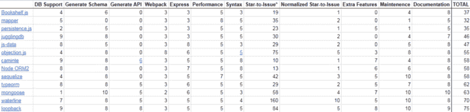

# 2018 年你应该用哪个 JavaScript ORM？

> 原文：<https://www.freecodecamp.org/news/a-comparison-of-the-top-orms-for-2018-19c4feeaa5f/>

作者约翰·万迪维尔

# 2018 年你应该用哪个 JavaScript ORM？

**注:2018 年 5 月:阅读 [*从类型化到回环:回顾*](https://hackernoon.com/from-typeorm-to-loopback-a-retrospective-188ea18527a2) 获取更新视角！**

— — — — — — — — — — — — — — — — — — — — — — — — — — — — — — —

本文回顾了 JavaScript 生态系统中的[对象关系映射](https://en.wikipedia.org/wiki/Object-relational_mapping) (ORM)解决方案，并根据特定需求确定了一个理想的解决方案。

### 什么是 ORM，为什么它如此重要？

ORM 解决方案有助于数据驱动的 API 开发。用户有驱动应用程序数据模型的具体需求。在遗留开发中，这种数据架构通常使用数据库脚本(如 SQL 脚本)来实现和版本控制。然后，服务器应用程序使用一个单独的库在数据库上执行 CRUD 操作。

ORM 作为执行 CRUD 的高级 API 工作，现在高质量的 ORM 也允许我们通过代码初始化数据。复杂的数据操作、清理等等，在代码中往往更容易。虽然存在专用的提取、转换和加载( [ETL](https://en.wikipedia.org/wiki/Extract,_transform,_load) )工具，但同样的 ETL 任务可以在 orm 中轻松实现。

用代码实现提取、转换和加载允许系统更容易地集成来自不同来源的数据。多种风格的 SQL 数据库、NoSQL 数据、文件系统数据和第三方数据都可以通过 JavaScript ORM 集成到一种语言中。

最后，面向代码的数据控制还允许系统在运行时或构建过程中实现数据使用，并根据需要在开发过程中灵活地调整使用。

换句话说，ORM 通过用一种语言提供一个高级 API 来提高开发人员的生产力，这种 API 具有传统上需要几种不同工具和技能的功能。更少的技能需求、工具需求和所需时间促进了项目利润。通过灵活的构建和运行时数据配置，可以更好地准备未预见的需求和项目时间表。

### **首选 ORM 功能**

导致这次 ORM 审查的特定项目环境要求实现一个尖端的、类似 CMS 的、[通用 JavaScript](https://medium.com/@mjackson/universal-javascript-4761051b7ae9) 应用程序。

前沿的通用 JavaScript 框架基本上有三种风格:Angular、React 和 Vue。也就是说[角万向](https://universal.angular.io/)、[下一个](https://github.com/zeit/next.js/)、 [Nuxt](https://nuxtjs.org/) 。

Node 本身支持文件系统操作，因此内容管理系统数据需求相当于对大范围数据库支持的偏好。总体而言，考虑了以下要求:

1.  支持 Mongo 和 MySQL，优先支持其他选项
2.  与 Webpack 集成
3.  与 Express 集成
4.  运行时对性能的最小[影响](https://medium.com/@ameykpatil/why-orm-shouldnt-be-your-best-bet-fffb66314b1b)
5.  直观语法
6.  额外功能
7.  高 Github 启动与发行比率
8.  积极维护，没有构建失败或不推荐的依赖项

### **考生及成绩**

每个候选人的每项首选能力都得到了 0 到 10 分。5 分表示可以接受。一列的平均值可能大于或小于 5。例如，支持多个 NoSQL 数据库而不支持任何 SQL 数据库的 ORM 将得到 2 到 4 之间的分数。0 表示完全没有某个功能。

View [this post](http://www.afterecon.com/other/node-orm-comparison-table/) or [this Google Sheet](https://docs.google.com/spreadsheets/d/1sSbY8SLWA9lvvnTHX41t0TVPXwZ4A4ddO_KJMa20fA4/edit#gid=0) to click the hyperlinks or copy data as a table.

对 [joi](https://github.com/hapijs/joi) 、 [pg](https://github.com/go-pg/pg) 和 [knex](http://knexjs.org/) 的特别呼喊。这些库不是完整的 ORM，但是它们在它们所做的事情上是伟大的。如果你不需要一个完整的 ORM，看看他们是否能满足你的需求。

### **结论**

总数反映了每个解决方案的总体有用性。前 5 名结果是:

1.  回路
2.  吃水线
3.  猫鼬
4.  字体
5.  序列

项目特定的需求、忽略的因素和个人偏好的组合导致了前 3 个选择。

Waterline 被大量集成到 Sails 框架中，Mongoose 只支持 MongoDB。

Sequelize 和 NodeORM2 仅限于 SQL，它们缺乏 API 生成。

由于 TypeScript 语法的原因，TypeORM 可以很好地与 Angular 项目集成。

作为一名开发人员，我建议制作不止一个顶级解决方案的原型，以确定真正的赢家。前 3 个解决方案都是原型候选方案，包括:

1.  回路
2.  字体
3.  卡明特

我将这些信息提交给了该项目的其他开发人员，作为一个团队，我们决定首先试用 TypeORM。回头再来看回顾展！

如何看待这个结果？请对[这一倾斜比较](https://www.slant.co/improve/topics/11235/~javascript-orms)发表评论或贡献您的想法。