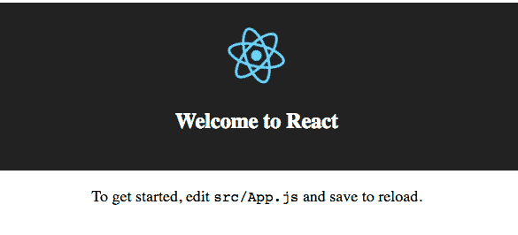
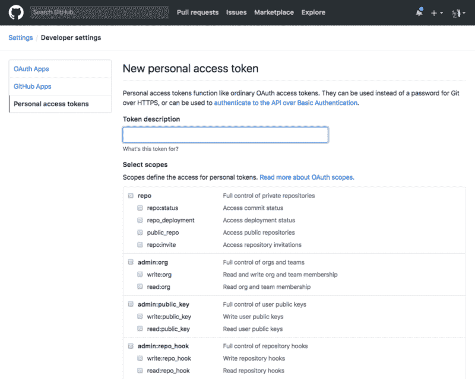
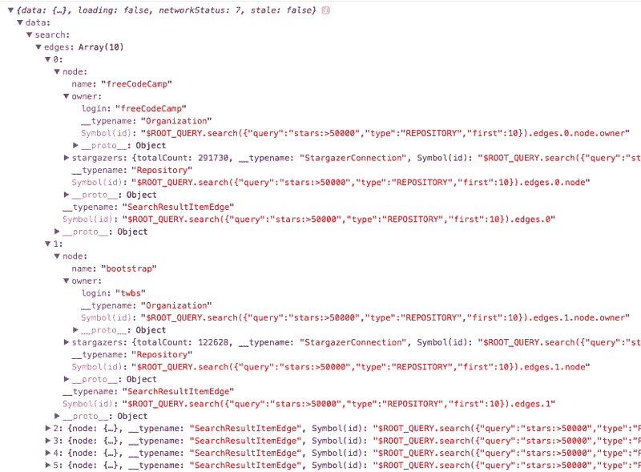
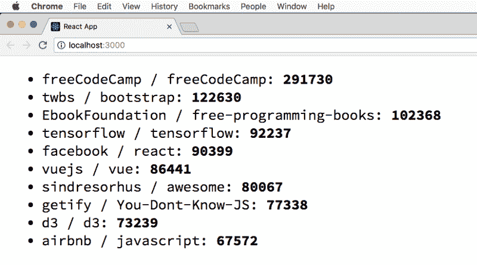
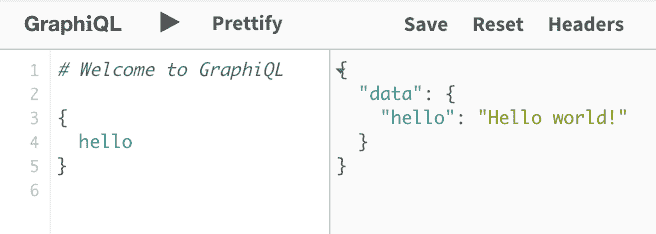

# Apollo 的完整介绍，GraphQL 工具包

> 原文：<https://www.freecodecamp.org/news/a-complete-introduction-to-apollo-the-graphql-toolkit-83acab4b8143/>

> 对学习 JavaScript 感兴趣？在 jshandbook.com 获得我的电子书

### 阿波罗简介

在过去的几年里， [GraphQL](https://flaviocopes.com/graphql/) 作为一种在 REST 之上构建 API 的替代方法变得非常流行。

GraphQL 是一种很好的方式，让客户端决定他们希望通过网络传输哪些数据，而不是让服务器发送一组固定的数据。

此外，它允许您指定嵌套资源，减少了处理 REST APIs 时有时需要的来回切换。

Apollo 是一个构建在 GraphQL 之上的团队和社区，它提供了不同的工具来帮助您构建项目。


Apollo Logo courtesy of apollographql.com

Apollo 提供的工具主要有三个:**客户端**、**服务器**、**引擎**。

**Apollo Client** 帮助您使用 GraphQL API，支持最流行的前端 web 技术，如 React、Vue、Angular、Ember 和 Meteor。还支持 iOS 和 Android 上的原生开发。

**Apollo Server** 是 GraphQL 的服务器部分，它与您的后端接口，并将响应发送回客户端请求。

**Apollo Engine** 是一个托管基础设施(SaaS ),充当客户端和服务器之间的中间人，提供缓存、性能报告、负载测量、错误跟踪、模式字段使用统计、历史统计和许多其他功能。它目前每月免费提供多达 100 万个请求，并且是 Apollo 中唯一一个非开源和免费的部分。它为项目的开源部分提供资金。

值得注意的是，这三个工具并没有以任何方式链接在一起，例如，您可以只使用 Apollo Client 与第三方 API 进行交互，或者在根本没有客户端的情况下使用 Apollo Server 提供 API。

#### 使用 Apollo 的一些好处

它完全与 GraphQL 标准规范兼容，所以在 Apollo 中没有专有或不兼容的技术。

但是将所有这些工具放在一个屋檐下作为一个完整的套件来满足所有与 GraphQL 相关的需求是非常方便的。

Apollo 努力做到易于使用和易于贡献。

Apollo 客户端和 Apollo 服务器都是社区项目，由社区搭建，为社区服务。Apollo 得到了流星开发小组的支持，这是一个非常流行的 JavaScript 框架。

阿波罗专注于让事情变得简单。这是一项想要普及的技术成功的关键。对于 99%的中小型公司来说，现有的许多技术、框架或库可能是多余的，而真正适合需求非常复杂的大公司。

### 阿波罗客户端

[Apollo 客户端](https://www.apollographql.com/client)是 GraphQL 的领先 JavaScript 客户端。因为它是社区驱动的，所以它被设计成让您构建与 GraphQL 数据交互的 UI 组件——要么显示该数据，要么在发生某些动作时执行变化。

您不需要更改应用程序中的所有内容来使用 Apollo 客户端。您可以从一个微小的层和一个请求开始，然后从那里扩展。

最重要的是，Apollo 客户机从一开始就是简单、小巧和灵活的。

在这篇文章中，我将详细介绍在 React 应用程序中使用 Apollo 客户端的过程。

我将使用 GitHub GraphQL API 作为服务器。

### 启动 React 应用程序

我使用`[create-react-app](https://github.com/facebook/create-react-app)`来设置 React 应用程序，这非常方便，只是添加了我们需要的基本内容:

```
npx create-react-app myapp
```

> `*npx*` *是最新 npm 版本中可用的命令。如果没有此命令，请更新 npm。*

使用以下命令启动应用程序本地服务器

```
yarn start
```

打开`src/index.js`:

```
import React from 'react'import ReactDOM from 'react-dom'import './index.css'import App from './App'import registerServiceWorker from './registerServiceWorker'ReactDOM.render(<App />, document.getElementById('root'))registerServiceWorker()
```

并删除所有这些内容。

### 开始使用 Apollo Boost

Apollo Boost 是在新项目中开始使用 Apollo 客户端的最简单的方法。除了`react-apollo`和`graphql`之外，我们还将安装它。

在控制台中，运行

```
yarn add apollo-boost react-apollo graphql
```

或使用 npm:

```
npm install apollo-boost react-apollo graphql --save
```

### 创建 ApolloClient 对象

首先从`index.js`中的`apollo-client`导入一个 ApolloClient:

```
import { ApolloClient } from 'apollo-client'const client = new ApolloClient()
```

默认情况下，Apollo 客户端使用当前主机上的`/graphql`端点，所以让我们使用一个 **Apollo 链接**通过设置 GraphQL 端点 URI 来指定连接到 GraphQL 服务器的细节。

### 阿波罗链接

Apollo 链接由一个从`apollo-link-http`导入的`HttpLink`对象表示。

Apollo Link 为我们提供了一种方式来描述我们希望如何获得 GraphQL 操作的结果，以及我们希望如何处理响应。

简而言之，您创建了多个 Apollo Link 实例，它们一个接一个地作用于 GraphQL 请求，提供您想要的最终结果。一些链接可以给你一个选项，如果不成功就重试请求，批处理等等。

我们将添加一个 Apollo 链接到我们的 Apollo 客户端实例，以使用 GitHub GraphQL 端点 URI `[https://api.github.com/graphql](https://api.github.com/graphql)`

```
import { ApolloClient } from 'apollo-client'import { HttpLink } from 'apollo-link-http'const client = new ApolloClient({  link: new HttpLink({ uri: 'https://api.github.com/graphql' })})
```

### 贮藏

我们还没完呢。在有一个工作示例之前，我们还必须告诉`ApolloClient`使用哪个[缓存策略](https://www.apollographql.com/docs/react/basics/caching.html):`InMemoryCache`是默认的，并且是一个好的开始。

```
import { ApolloClient } from 'apollo-client'import { HttpLink } from 'apollo-link-http'import { InMemoryCache } from 'apollo-cache-inmemory'const client = new ApolloClient({  link: new HttpLink({ uri: 'https://api.github.com/graphql' }),  cache: new InMemoryCache()})
```

### 使用`ApolloProvider`

现在我们需要将 Apollo 客户机连接到我们的组件树。我们使用`ApolloProvider`将应用程序组件包装在主 React 文件中:

```
import React from 'react'import ReactDOM from 'react-dom'import { ApolloClient } from 'apollo-client'import { HttpLink } from 'apollo-link-http'import { InMemoryCache } from 'apollo-cache-inmemory'import { ApolloProvider } from 'react-apollo'import App from './App'const client = new ApolloClient({  link: new HttpLink({ uri: 'https://api.github.com/graphql' }),  cache: new InMemoryCache()})ReactDOM.render(  <ApolloProvider client={client}>    <App />  </ApolloProvider>,  document.getElementById('root'))
```

这足以呈现默认的`create-react-app`屏幕，并初始化 Apollo 客户端:



### `gql`模板标签

我们现在准备用 Apollo Client 做一些事情，我们将从 GitHub API 获取一些数据并呈现出来。

为此，我们需要导入`gql`模板标签:

```
import gql from 'graphql-tag'
```

任何 GraphQL 查询都将使用这个模板标记来构建，如下所示:

```
const query = gql`  query {    ...  }`
```

### 执行 GraphQL 请求

是我们工具集里需要的最后一件东西。

我们现在准备用 Apollo Client 做一些事情，我们将从 GitHub API 获取一些数据并呈现出来。

#### 获取 API 的访问令牌

首先要做的是[从 GitHub 获得一个个人访问令牌](https://help.github.com/articles/creating-a-personal-access-token-for-the-command-line/)。

GitHub 提供了一个界面，您可以从中选择您可能需要的任何权限，从而使这变得简单:



对于本示例教程，您不需要任何权限。它们是用来访问私有用户数据的，但是我们将只查询公共存储库数据。

您得到的令牌是一个 **OAuth 2.0 无记名令牌**。

您可以通过从命令行运行来轻松测试它:

```
$ curl -H "Authorization: bearer ***_YOUR_TOKEN_HERE_***" -X POST -d " \ { \   \"query\": \"query { viewer { login }}\" \ } \" https://api.github.com/graphql
```

这应该会给你结果

```
{"data":{"viewer":{"login":"***_YOUR_LOGIN_NAME_***"}}}
```

或者

```
{  "message": "Bad credentials",  "documentation_url": "https://developer.github.com/v4"}
```

如果出了问题。

#### 使用阿波罗链接进行身份验证

因此，我们需要将**授权**头和 GraphQL 请求一起发送，就像我们在上面的`curl`请求中所做的那样。

我们可以通过创建一个 Apollo 链接中间件来实现这一点。从安装`[apollo-link-context](https://www.npmjs.com/package/apollo-link-context)`开始:

```
npm install apollo-link-context
```

这个包允许我们通过设置请求的上下文来添加身份验证机制。

我们可以通过引用`setContext`函数在代码中使用它，如下所示:

```
const authLink = setContext((_, { headers }) => {  const token = '***YOUR_TOKEN**'  return {    headers: {      ...headers,      authorization: `Bearer ${token}`    }  }})
```

一旦我们有了这个新的 Apollo 链接，我们就可以通过在链接上使用`concat()`方法，用我们已经有的`HttpLink`来[组合](https://www.apollographql.com/docs/link/composition.html):

```
const link = authLink.concat(httpLink)
```

下面是我们现在拥有的`src/index.js`文件的完整代码:

```
import React from 'react'import ReactDOM from 'react-dom'import { ApolloClient } from 'apollo-client'import { HttpLink } from 'apollo-link-http'import { InMemoryCache } from 'apollo-cache-inmemory'import { ApolloProvider } from 'react-apollo'import { setContext } from 'apollo-link-context'import gql from 'graphql-tag'import App from './App'const httpLink = new HttpLink({ uri: 'https://api.github.com/graphql' })const authLink = setContext((_, { headers }) => {  const token = '***YOUR_TOKEN**'  return {    headers: {      ...headers,      authorization: `Bearer ${token}`    }  }})const link = authLink.concat(httpLink)const client = new ApolloClient({  link: link,  cache: new InMemoryCache()})ReactDOM.render(  <ApolloProvider client={client}>    <App />  </ApolloProvider>,  document.getElementById('root'))
```

> *警告⚠️？请记住，此代码是出于教育目的的 e **示例**。它公开了 GitHub GraphQL API，让全世界都能在面向前端的代码中看到。生产代码需要保持这个令牌的私有性。*

现在，我们可以在这个文件的底部发出第一个 GraphQL 请求，这个示例查询要求获得 10 个拥有超过 50k 颗星的最受欢迎的存储库的名称和所有者:

```
const POPULAR_REPOSITORIES_LIST = gql`{  search(query: "stars:>50000", type: REPOSITORY, first: 10) {    repositoryCount    edges {      node {        ... on Repository {          name          owner {            login          }          stargazers {            totalCount          }        }      }    }  }}`client.query({ query: POPULAR_REPOSITORIES_LIST }).then(console.log)
```

成功运行此代码将在浏览器控制台中返回我们的查询结果:



### 在组件中呈现 GraphQL 查询结果集

到目前为止我们看到的已经很酷了。更酷的是使用 GraphQL 结果集来呈现组件。

我们让 Apollo 客户机承担获取数据和处理所有底层事务的负担(或快乐)。这让我们通过使用由`react-apollo`提供的`graphql`组件增强器来专注于显示数据:

```
import React from 'react'import { graphql } from 'react-apollo'import { gql } from 'apollo-boost'const POPULAR_REPOSITORIES_LIST = gql`{  search(query: "stars:>50000", type: REPOSITORY, first: 10) {    repositoryCount    edges {      node {        ... on Repository {          name          owner {            login          }          stargazers {            totalCount          }        }      }    }  }}`const App = graphql(POPULAR_REPOSITORIES_LIST)(props =>  <ul>    {props.data.loading ? '' : props.data.search.edges.map((row, i) =>      <li key={row.node.owner.login + '-' + row.node.name}>        {row.node.owner.login} / {row.node.name}: {' '}        <strong>          {row.node.stargazers.totalCount}        </strong>      </li&gt;    )}  </ul>)export default App
```

这是组件中呈现的查询结果。



### 阿波罗服务器

GraphQL 服务器的工作是接受端点上的传入请求，解释请求并查找满足客户端需求所需的任何数据。

每种可能的语言都有大量不同的 GraphQL 服务器实现。

**Apollo Server 是针对 JavaScript 的 GraphQL 服务器实现，特别是针对 Node.js 平台**。

它支持许多流行的 Node.js 框架，包括:

*   [快递](https://expressjs.com/)
*   [哈皮](https://hapijs.com/)
*   [Koa](http://koajs.com/)
*   [重新定义](http://restify.com/)

阿波罗服务器基本上给了我们三样东西:

*   一种用**模式**描述我们的数据的方法。
*   **解析器**的框架，这些是我们编写的函数，用来获取完成请求所需的数据。
*   它为我们的 API 处理**认证**提供了便利。

为了学习 Apollo Server 的基础知识，我们不打算使用任何受支持的 Node.js 框架。取而代之的是，我们将使用阿波罗团队建造的东西，一个真正伟大的东西，它将成为我们学习的基础:Launchpad。

### 发射台

Launchpad 是 Apollo 产品伞的一部分，它是一个非常神奇的工具，允许我们在云上编写代码并在线创建一个 Apollo 服务器，就像我们在 Codepen、JSFiddle 或 JSBin 上运行一段代码一样。

不同的是，我们没有构建一个孤立的可视化工具，只是作为一个展示或学习工具，而是使用 Launchpad 创建了一个 GraphQL API。它将对公众开放。

Launchpad 上的每个项目都被称为 **pad** ，并且有其 GraphQL 端点 URL，比如:

```
https://1jzxrj129.lp.gql.zone/graphql
```

一旦你构建了一个 pad，Launchpad 会让你选择下载运行它的 Node.js 应用程序的完整代码，你只需要运行`npm install`和`npm start`就可以拥有你的 Apollo GraphQL 服务器的本地副本。

总而言之，这是一个**学习、分享和原型制作**的好工具。

### 阿波罗服务器 Hello World

每次你创建一个新的 Launchpad *pad* ，你都会看到 Hello，World！阿波罗服务器。让我们深入研究一下。

首先从`graphql-tools`导入`makeExecutableSchema`函数。

```
import { makeExecutableSchema } from 'graphql-tools'
```

该函数用于创建一个`GraphQLSchema`对象，为其提供一个模式定义(用 [GraphQL 模式语言](http://graphql.org/learn/schema/)编写)和一组**解析器**。

模式定义是一个模板文字字符串，包含我们的查询描述以及与每个字段相关联的类型:

```
const typeDefs = `  type Query {    hello: String  }`
```

**解析器**是将模式中的字段映射到解析器函数的对象。它能够查找数据来响应查询。

下面是一个简单的解析器，它包含了用于`hello`字段的解析器函数，该函数只返回`Hello world!`字符串:

```
const resolvers = {  Query: {    hello: (root, args, context) => {      return 'Hello world!'    }  }}
```

给定这两个元素，模式定义和解析器，我们使用之前导入的`makeExecutableSchema`函数来获得一个`GraphQLSchema`对象，并将其分配给`schema`常量。

```
export const schema = makeExecutableSchema({ typeDefs, resolvers })
```

这是**所有**你需要服务一个简单的只读 API。Launchpad 负责处理微小的细节。

下面是简单的 Hello World 示例的完整代码:

```
import { makeExecutableSchema } from 'graphql-tools'const typeDefs = `  type Query {    hello: String  }`const resolvers = {  Query: {    hello: (root, args, context) => {      return 'Hello world!'    }  }}export const schema = makeExecutableSchema({  typeDefs,  resolvers})
```

Launchpad 提供了一个很好的内置工具来使用 API:



正如我之前所说，API 是公开的，所以你只需要登录并保存你的 pad。

我制作了一个 pad，它在`https://kqwwkp0pr7.lp.gql.zone/graphql`处公开了它的端点，所以让我们从命令行使用`curl`来尝试一下:

```
$ curl \  -X POST \  -H "Content-Type: application/json" \  --data '{ "query": "{ hello }" }' \  https://kqwwkp0pr7.lp.gql.zone/graphql
```

这成功地给了我们预期的结果:

```
{  "data": {    "hello": "Hello world!"  }}
```

### 在本地运行 GraphQL 服务器

我们提到过你在 Launchpad 上创建的任何东西都是可以下载的，所以让我们继续。

这个包由两个文件组成。第一个，`schema.js`就是上面所说的。

第二个是`server.js`，在 Launchpad 中是不可见的，它提供了底层的 Apollo 服务器功能，由流行的 Node.js 框架 [Express](https://expressjs.com/) 提供支持。

这不是一个最简单的 Apollo 服务器设置示例，所以为了便于解释，我将用一个更简单的示例来代替它(但是在理解了基础知识之后，可以随意学习)。

### 你的第一个阿波罗服务器代码

首先，在你下载的 Launchpad 代码上运行`npm install`和`npm start`。

我们之前初始化的节点服务器使用 [nodemon](https://nodemon.io/) 在文件改变时重启服务器，所以当你改变代码时，服务器会重启并应用你的改变。

在`server.js`中添加此代码:

```
const express = require('express')const bodyParser = require('body-parser')const { graphqlExpress } = require('apollo-server-express')const { schema } = require('./schema')const server = express()server.use('/graphql', bodyParser.json(), graphqlExpress({ schema }))server.listen(3000, () => {  console.log('GraphQL listening at http://localhost:3000/graphql')})
```

只有 11 行代码，这比 Launchpad 设置的服务器要简单得多，因为我们删除了所有使代码更加灵活以满足他们需求的东西。

编码迫使你做出艰难的决定:你现在需要多大的灵活性？拥有干净、可理解的代码有多重要，你可以在六个月内学会并轻松调整，或者传递给其他开发人员和团队成员，以便他们在需要的最短时间内高效工作？

下面是代码的作用:

我们首先导入一些我们将要使用的库。

*   `**express**`这将为底层网络功能提供动力以暴露端点
*   `**bodyParser**`是节点体解析中间件
*   `**graphqlExpress**`Apollo 服务器是 Express 的对象吗

```
const express = require('express')const bodyParser = require('body-parser')const { graphqlExpress } = require('apollo-server-express')
```

接下来，我们将在上面的 schema.js 文件中创建的`GraphQLSchema`对象导入为`Schema`:

```
const { schema } = require('./schema')
```

这是一些标准的 Express set，我们只是在端口`3000`上初始化一个服务器

```
const server = express()
```

现在我们准备初始化 Apollo 服务器:

```
graphqlExpress({ schema })
```

我们将它作为回调传递给 HTTP JSON 请求的端点:

```
server.use('/graphql', bodyParser.json(), graphqlExpress({ schema }))
```

我们现在需要做的就是启动 Express:

```
server.listen(3000, () => {  console.log('GraphQL listening at http://localhost:3000/graphql')})
```

### 添加一个 GraphiQL 端点

如果你使用 GraphiQL，你可以很容易地添加一个`/graphiql`端点，使用 [GraphiQL 交互式浏览器内 IDE](https://github.com/graphql/graphiql) :

```
server.use('/graphiql', graphiqlExpress({  endpointURL: '/graphql',  query: ``}))
```

我们现在只需要启动 Express 服务器:

```
server.listen(PORT, () => {  console.log('GraphQL listening at http://localhost:3000/graphql')  console.log('GraphiQL listening at http://localhost:3000/graphiql')})
```

您可以再次使用`curl`进行测试:

```
$ curl \  -X POST \  -H "Content-Type: application/json" \  --data '{ "query": "{ hello }" }' \  http://localhost:3000/graphql
```

这将得到与上面相同的结果，其中您调用了 Launchpad 服务器:

```
{  "data": {    "hello": "Hello world!"  }}
```

> 对学习 JavaScript 感兴趣？在 jshandbook.com 获得我的电子书