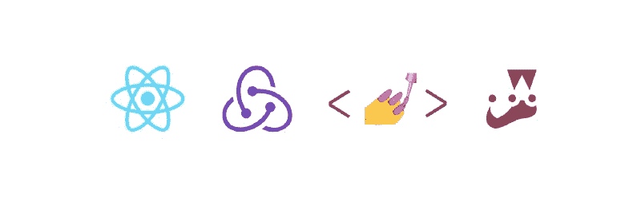

# 完整的 React 样板教程——从零到英雄

> 原文：<https://www.freecodecamp.org/news/a-complete-react-boilerplate-tutorial-from-zero-to-hero-20023e086c4a/>

作者莱昂纳多·马尔多纳多

# 完整的 React 样板教程——从零到英雄



当我们开始学习 React 时，为了制作我们的项目，我们需要从头开始制作样板文件，或者使用社区提供的一些样板文件。几乎所有时候，我们都是用 *create-react-app* 来创建一个没有构建配置的应用。或者我们只是从头开始制作我们自己的简单样板文件。

由此，我想到:为什么不制作一个包含我经常使用的所有依赖项的样板文件，并把它准备好呢？社区也是这样想的，所以现在我们有了几个社区创建的样板文件。有些比其他的更复杂，但是他们总是有相同的目标，即最大限度地节省时间。

本文将教您如何使用 React 社区中目前使用的主要依赖项从头开始构建自己的样板文件。我们将使用一些现代的最常见的功能，从那里你可以定制你想要的任何方式。

[**本文创建的样板文件将在此处可用！**](https://github.com/leonardomso/react-bolt)

### 入门指南

首先，我们将创建一个文件夹来启动我们的样板文件。你想怎么命名都行，我就给我的取名***react——bolt***。

打开您的终端，像这样创建它:

```
mkdir react-bolt
```

现在，转到您创建的文件夹，键入以下命令:

```
npm init -y
```

*NPM* 会为你创建一个`package.json`文件，你安装的所有依赖项和你的命令都会在那里。

现在，我们将为样板文件创建基本的文件夹结构。现在是这样的:

```
react-bolt    |--config    |--src    |--tests
```

### 网络包

Webpack 是当今最著名的 JavaScript 应用程序模块捆绑器。基本上，它捆绑了你所有的代码，并生成一个或多个包。你可以在这里了解更多信息。

在这个样板文件中，我们将使用它，所以安装所有这些依赖项:

```
npm install --save-dev webpack webpack-cli webpack-dev-server webpack-merge html-webpack-plugin clean-webpack-plugin img-loader url-loader file-loader 
```

现在在我们的`config`文件夹中，我们将创建另一个名为`webpack`的文件夹，然后在这个`webpack`文件夹中创建 5 个文件。

创建一个名为`paths.js`的文件。在这个文件中，将是所有输出文件的目标目录。

在里面，放上所有这些代码:

现在，创建另一个名为`rules.js`的文件，并将以下代码放在那里:

之后，我们将再创建 3 个文件:

`webpack.common.babel.js`

`webpack.dev.babel.js`

`webpack.prod.babel.js`

基本上，在我们的`webpack.common.babel.js`文件中，我们已经设置了我们的入口和输出配置，并且包括了任何需要的插件。在`webpack.dev.babel.js`文件中，我们已经将模式设置为开发。在我们的`webpack.prod.babel.js`文件中，我们已经将模式设置为生产。

之后，在我们的根文件夹中，我们将创建最后一个名为`webpack.config.js`的 webpack 文件，并放入以下代码:

我们的 webpack 配置已经准备好了，所以现在我们要用 Babel、ESLint、Prettier 等处理样板文件的其他部分。

### 巴比伦式的城市

我想几乎每个使用 React 的人都可能听说过 Babel 以及这个简单的 transpiler 如何帮助我们的生活。如果你不知道它是什么，Babel 它基本上是一个 transpiler，将你的 JavaScript 代码转换成普通的旧 ES5 JavaScript，可以在任何浏览器中运行。

我们将使用一堆 Babel 插件，所以在我们的根文件夹中，安装:

```
npm install --save-dev @babel/core @babe/cli @babel/node @babel/plugin-proposal-class-properties @babel/plugin-proposal-object-rest-spread @babel/plugin-syntax-dynamic-import @babel/plugin-syntax-import-meta @babel/plugin-transform-async-to-generator @babel/plugin-transform-runtime @babel/preset-env @babel/preset-react @babel/register @babel/runtime babel-eslint babel-jest babel-loader babel-core@7.0.0-bridge.0
```

之后，我们将在根文件夹中创建一个名为`.babelrc`的文件，在该文件中，我们将放入以下代码:

现在我们的项目是用 Babel 编译的，可以使用下一代 JavaScript 语法，没有任何问题。

### 埃斯林特

如今林挺项目最常用的工具是 ESLint。发现某些类型的错误真的很有帮助，比如那些与变量作用域、未声明变量的赋值等相关的错误。

首先，安装以下依赖项:

```
npm install --save-dev eslint eslint-config-airbnb eslint-config-prettier eslint-loader eslint-plugin-babel eslint-plugin-import eslint-plugin-jsx-a11y eslint-plugin-prettier eslint-plugin-react 
```

然后，在我们的根文件夹中，创建一个名为`.eslintrc` 的文件，并将以下代码放在那里:

### 较美丽

漂亮基本上是一个代码格式化程序。它分析您的代码，并根据自己的规则重新打印，这些规则考虑了最大行长度，并在必要时换行。

你只需要安装它:

```
npm install --save-dev prettier
```

在我们的根文件夹中，创建一个名为`.prettierrc` 的文件，并将以下代码放在那里:

### 反应

React 是一个用于构建用户界面的开源 JavaScript 应用程序库。它是由脸书开发的，背后有一个庞大的社区。如果你正在阅读这篇文章，我假设你已经了解了 React，但是如果你想了解更多，你可以在这里阅读。

我们将安装以下依赖项:

```
npm install --save react react-dom cross-env
```

在我们的`src`文件夹中，我们将创建一个简单的 HTML 文件`index.html`，并放入以下代码:

之后，我们将创建一个简单的 React 项目。在我们的`src`文件夹中，创建一个`index.js`文件，如下所示:

在我们的`src`文件夹中，我们将有如下结构:

```
src    |--actions    |--components    |--reducers    |--reducers    |--store
```

在`components`文件夹中创建一个名为`App.js`的文件，并放入以下代码:

### Redux

Redux 使管理应用程序的状态变得容易。从另一个角度来看，它可以帮助您管理显示的数据以及如何响应用户的操作。如今，很多人更喜欢其他选项，比如 MobX 或 T2 setState 本身，但我将坚持使用 Redux 作为样板。

首先，我们将安装一些依赖项:

```
npm install --save redux react-redux redux-thunk
```

然后，我们将创建 Redux 存储，并在其中放置一些状态。在我们`store`文件夹中，创建一个`index.js`文件，并将以下代码放在那里:

现在，在我们的`reducers`文件夹中创建一个`index.js`并放入以下代码:

最后，我们将把我们的`index.js`放在我们的`src`文件夹中，并用`<Provider` / >和 pas `s our`商店包装代码作为道具，使其可用于我们的应用程序。

事情会是这样的:

完成了。我们的 Redux 商店已经配置完毕，随时可以使用。

### 反应路由器

React 路由器是 React 的标准路由库。基本上，它让你的 UI 和 URL 保持同步。我们将在样板文件中使用它，所以安装它:

```
npm install --save react-router-dom
```

之后，转到我们的`src`文件夹中的`index.js`，用`<BrowserRoute` r >包装那里的所有代码。

我们的`src`文件夹中的`index.js`将会这样结束:

### 样式组件

Styled Components 使 CSS 对每个人来说都很容易，因为它可以帮助您组织 React 项目。它的目标是编写更多小的和可重用的组件。我们将使用它，如果你想了解更多，请阅读这里的。

首先，安装它:

```
npm install --save styled-components
```

然后，在我们的`components`文件夹中的`App.js`文件中，我们将使用样式化的组件创建一个简单的标题。我们的标题是这样的:

在我们的文件中，我们需要导入样式化的组件，所以我们的文件将会像这样结束:

### Jest & React 测试库

Jest 是一个来自脸书的开源 JavaScript 测试库。它使测试您的应用程序变得容易，并为我们提供了许多关于什么给出了正确的输出，什么没有的信息。React 测试库是一个非常轻量级的 React 组件测试解决方案。基本上，这个文库是酶的替代品。

每个应用程序都需要某种测试。我不会在本文中编写测试，但是我会向您展示如何配置这些工具来开始测试您的应用程序。

首先，我们要安装这两个:

```
npm install --save-dev jest jest-dom react-testing-library
```

之后再去我们的 package.json，把下面的终究放进去:

然后，转到我们的`config`文件夹，并在其中创建了另一个名为`tests`的文件夹，并在该文件夹中创建 2 个文件。

首先，创建一个名为`jest.config.js`的文件，并放入以下代码:

然后，创建一个名为`rtl.setup.js`的文件，并放入以下代码:

完成了。我们的样板文件已经准备好了，你现在可以使用它了。

现在转到我们的文件`package.json`并放入以下代码:

现在，如果您运行命令`npm start`并转到`localhost:8080`，我们应该看到我们的应用程序工作正常！

[**如果想看我的最终代码，这里有这篇文章创建的样板文件！**](https://github.com/leonardomso/react-bolt)

我对一些特性有一些想法，我很想包含在样板文件中，所以请随意贡献！

？在推特上关注我！
**⭐** F [**在 GitHub 上关注我！**](https://github.com/leonardomso)

我正在寻找一个遥远的机会，所以如果有我想听的，请联系我！