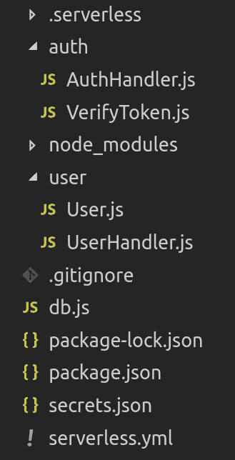
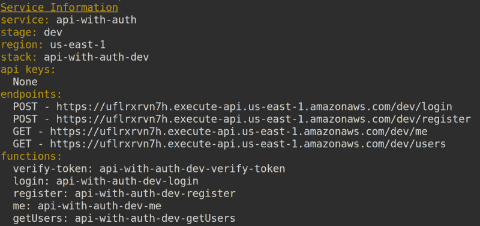
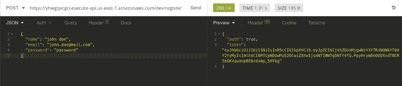
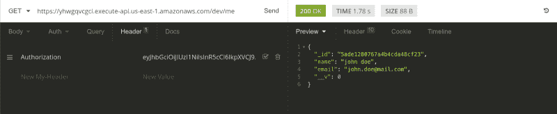
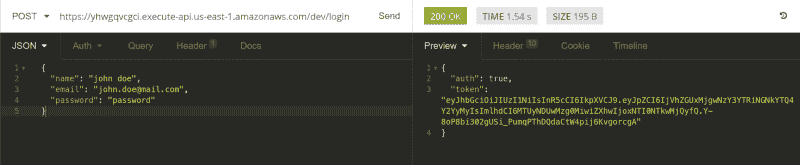
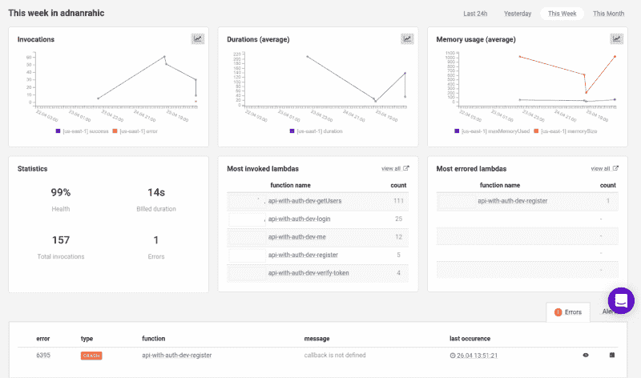
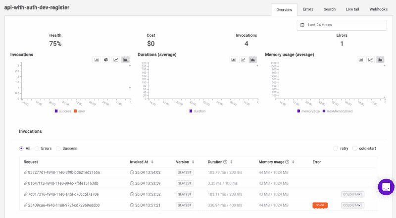
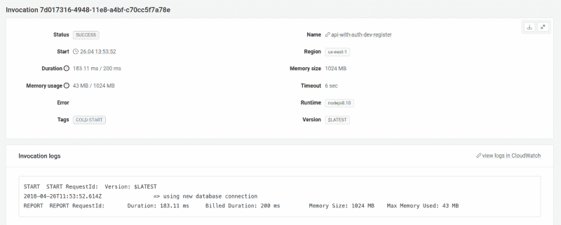
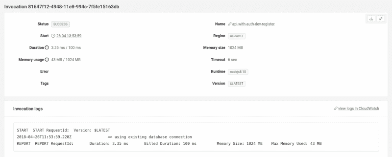

# 关于使用 JSON web 令牌保护无服务器 API 的速成班

> 原文：<https://www.freecodecamp.org/news/a-crash-course-on-securing-serverless-apis-with-json-web-tokens-ff657ab2f5a5/>

多么拗口的标题。你同意吗？在本演练中，您将了解如何使用 JSON web 令牌保护您的无服务器端点。

这将包括一个带有几个端点的无服务器 REST API 的基本设置，当然还有一个**授权器**功能。这个**授权器**将作为授权访问您的资源的中间件。

在创建过程中，我们将使用[无服务器框架](https://serverless.com/)来模拟开发环境，就像您习惯的那样。在本指南的最后，我们还将设置一个名为 [Dashbird](https://dashbird.io/) 的监控工具。它将允许我们以一种自然且易于理解的方式模拟常规 Node.js 应用程序的调试功能和概述。它还有一个[免费层](https://dashbird.io/pricing/)，并且不需要信用卡来设置。

如果我上面提到的任何东西对你来说是新的，不要担心。下面我会一一解释。否则，您可以通过查看这些教程来更新您的知识:

*   [使用 JWT 保护 Node.js RESTful APIs 认证和授权说明。](https://medium.freecodecamp.org/securing-node-js-restful-apis-with-json-web-tokens-9f811a92bb52)
*   [node . js 无服务器速成班](https://hackernoon.com/a-crash-course-on-serverless-with-node-js-632b37d58b44) —无服务器基础讲解。
*   [用 Node.js 和 MongoDB 构建无服务器 REST API](https://hackernoon.com/building-a-serverless-rest-api-with-node-js-and-mongodb-2e0ed0638f47)—无服务器 REST API 讲解。

### TL；速度三角形定位法(dead reckoning)

在 head first 跳入之前，你可以严重伤害我的感情，只看这个 TL；Or 博士，继续看整篇文章。❤

*   [**创建 API**](https://medium.com/p/ff657ab2f5a5#2aa5)
    - [添加数据库](https://medium.com/p/ff657ab2f5a5#8132)
    - [添加功能](https://medium.com/p/ff657ab2f5a5#e344)
    - [为用户添加业务逻辑](https://medium.com/p/ff657ab2f5a5#5845)-
    -[添加认证](https://medium.com/p/ff657ab2f5a5#5663)
    - [添加授权](https://medium.com/p/ff657ab2f5a5#40d6)
*   [**部署**](https://medium.com/p/ff657ab2f5a5#52e1)
*   [**检测**](https://medium.com/p/ff657ab2f5a5#2e10)
*   [**监控**](https://medium.com/p/ff657ab2f5a5#6e91)

准备好了吗？让我们跳进来吧！

### 创建 API

首先，我们需要为本地开发环境建立无服务器框架。这个框架是所有与无服务器架构相关的事情的事实上的框架。跳转到[他们的网站](https://serverless.com/)，按照指示进行设置，或者参考我在上面链接的文章返回[。](https://hackernoon.com/a-crash-course-on-serverless-with-node-js-632b37d58b44)

安装过程非常简单。您在 AWS 帐户中设置了一个 AWS 管理角色，并将其链接到无服务器框架的安装。实际的安装过程只是运行一个简单的命令。

打开终端窗口，运行下面的命令。

```
$ npm install -g serverless
```

继续，一旦安装了它，只需在终端中运行一个命令，就可以在本地开发机器上获得样板无服务器服务。

```
$ sls create -t aws-nodejs -p api-with-auth
```

上面的命令将生成您需要的样板代码。

切换到新创建的名为`api-with-auth`的目录，用您选择的代码编辑器打开它。

```
$ cd api-with-auth
```

一旦打开，你会看到两个主要文件。一个`handler.js`和一个`serverless.yml`文件。`handler.js`包含我们的应用程序逻辑，而`serverless.yml`定义我们的资源。

现在是时候安装一些依赖项了，以便为数据库交互设置我们需要的认证/授权方法、密码加密和 ORM。

```
$ npm init -y$ npm install --save bcryptjs bcryptjs-then jsonwebtoken mongoose
```

这是我们生产所需要的，但对于开发，我们将抓住无服务器离线插件。

```
$ npm install --save-dev serverless-offline
```

可爱！

#### 添加数据库

对于持久性数据存储，我们将在 [MongoDB Atlas](https://www.mongodb.com/cloud/atlas) 上获取一个托管的 MongoDB 实例。[这里有一篇我详细解释过的文章的参考。](https://hackernoon.com/building-a-serverless-rest-api-with-node-js-and-mongodb-2e0ed0638f47)

在服务文件夹的根目录下，让我们创建一个`db.js`文件来保存数据库连接的逻辑。继续粘贴这段代码。

如果不存在连接，这是建立数据库连接的一个相当简单的实现。但是，如果它存在，我将使用已经建立的连接。你看到`process.env.DB`了吗？我们将使用一个定制的`secrets.json`文件，通过将它添加到`.gitignore`中来防止我们的私钥进入 GitHub。该文件将被加载到`serverless.yml`中。实际上，我们现在就开始吧。

将您的 MongoDB 连接字符串添加到`db`字段。

创建好这个文件后，让我们继续看`serverless.yml`。打开它，删除所有的样板代码，这样我们就可以重新开始。然后，继续粘贴这个。

如您所见，这只是一个简单的设置配置。`custom`部分告诉主配置从`secrets.json`文件中获取值。我们会将该文件添加到`.gitignore`中，因为将私钥推给 GitHub 是一项可处以死刑的大罪！不完全是，但是仍然，不要把钥匙推给 GitHub。说真的，请不要。

#### 添加功能

在进入业务逻辑之前，只剩下一点点配置工作要做！我们需要在上面添加的 providers 部分下面的`serverless.yml`中添加函数定义。

总共有五个功能。

*   `VerifyToken.js`将包含一个`.auth`方法，用于检查随请求一起传递给服务器的 JWT 的有效性。这将是我们的**授权人**的功能。授权器如何工作的概念很像普通的 basic Express.js 中的中间件如何工作。只是服务器接收请求和处理发送回客户机的数据之间的一个步骤。
*   `login`和`register`函数将进行基本的用户认证。我们将为`AuthHandler.js`文件中的内容添加业务逻辑。
*   然而，`me`函数将根据提供的 JWT 令牌用当前通过身份验证的用户进行响应。这里我们将使用**授权者**功能。
*   `getUsers`函数只是一个通用的公共 API，用于从数据库中获取注册用户。



从上面的`serverless.yml`文件中，你可以看出一个粗略的项目结构。为了让它更清楚，看看上面的图片。

现在更有意义了吧。继续，让我们添加获取用户的逻辑。

#### 为用户添加业务逻辑

回到代码编辑器，删除`handler.js`文件并创建一个新文件夹，命名为`user`。这里您将为模型添加一个`User.js`文件，并为实际逻辑添加一个`UserHandler.js`。

如果你以前编写过 Node 应用程序，这非常简单。我们需要 mongose，创建模式，将它作为模型添加到 mongose，最后导出它用于应用程序的其余部分。

模型做好了，就该添加基本逻辑了。

当你第一次看到它的时候，这是一个有点棘手的问题。但是让我们从头开始。

通过请求`db.js`，我们可以访问 MongoDB Atlas 上的数据库连接。使用我们检查连接的自定义逻辑，我们已经确保一旦建立了连接，就不会再创建新的连接。

`getUsers`助手函数将只获取所有用户，而`module.exports.getUsers` Lambda 函数将连接到数据库，运行助手函数，并将响应返回给客户端。这对`UserHandler.js`来说绰绰有余。真正的乐趣始于`AuthProvider.js`。

#### 添加身份验证

在服务的根目录下，创建一个名为`auth`的新文件夹。添加一个名为`AuthHandler.js`的新文件。这个处理程序将包含我们的 API 的核心认证逻辑。不要再浪费时间了，继续将这段代码粘贴到文件中。这个逻辑将启用用户注册，将用户保存到数据库中，并向客户端返回一个 JWT 令牌，以便在将来的请求中存储。

首先我们需要依赖项，并添加了`module.exports.register`函数。这很简单。我们再次连接到数据库，注册用户并发回一个包含 JWT 令牌的会话对象。仔细看看本地`register()`函数，因为我们还没有声明它。再等我几秒钟，我们马上就开始。

正确设置了核心结构后，让我们开始添加助手。在同一个`AuthHandler.js`文件中，继续粘贴。

我们已经创建了三个助手函数，用于签署 JWT 令牌、验证用户输入，以及创建一个用户(如果数据库中不存在的话)。可爱！

完成了`register()`函数后，我们还需要添加`login()`。在函数注释下面添加`module.exports.login`。

我们又一次有了一个本地函数，这次命名为`login()`。让我们把它也添加到助手的注释下。

厉害！我们也添加了助手。这样，我们已经将**认证**添加到我们的 API 中。就这么简单。现在，我们有了一个基于令牌的身份验证模型，可以添加授权。这将是我们的下一步。坚持住！

#### 添加授权

通过添加一个`VerifyToken.js`文件，我们可以将所有授权逻辑作为一个单独的中间件。如果我们想保持关注点的分离，这非常方便。继续在`auth`文件夹中创建一个名为`VerifyToken.js`的新文件。

我们有一个从文件中导出的函数，名为`module.exporst.auth`，带有通常的三个参数。这个功能将作为一个中间件**。如果你熟悉 Node.js，你就会知道什么是中间件，否则，查看[这个](https://medium.freecodecamp.org/securing-node-js-restful-apis-with-json-web-tokens-9f811a92bb52)获得更详细的解释。**

这个`authorizationToken`，我们的 JWT，将通过事件传递给中间件。我们只是把它赋给一个局部常量，以便于访问。

这里的所有逻辑只是检查令牌是否有效，并通过调用`generatePolicy`函数发回一个生成的策略。这个功能是 AWS 需要的，你可以从 AWS 上的各种文档和无服务器框架 [examples GitHub page](https://github.com/serverless/examples/blob/master/aws-node-auth0-custom-authorizers-api/handler.js) 中抓取。

这很重要，因为我们在`callback`中传递`decoded.id`。这意味着，位于我们的`VerifyToken.auth` **授权器**函数之后的下一个 Lambda 函数将可以访问其`event`参数中的`decoded.id`。厉害吧！？

一旦我们完成了令牌验证，剩下的就是添加一个位于**授权者**功能后面的路由。为了简单起见，让我们添加一个`/me`路由，根据沿着`GET`请求传递的 JWT 来获取当前登录的用户。

跳回`AuthHandler.js`文件并粘贴。

厉害！我们将在本教程中添加的最后一个 Lambda 函数是`module.exports.me`。它将获取从**授权器**传递的`userId`，并在传递`userId`的同时调用`me`助手函数。`me`函数将从数据库中抓取用户并返回。Lambda 所做的只是检索当前已认证的用户。但是，端点是受保护的，这意味着只有有效的令牌才能访问它。

到目前为止做得很好，让我们部署它，这样我们就可以做一些测试。

### 部署

希望您已经配置了 AWS 帐户来使用无服务器框架。如果有，只需运行一个命令，就万事俱备了。

```
$ sls deploy
```

瞧啊。等待它部署，并开始享受您的无服务器 API 与 JWT 认证和授权。

一旦部署了函数，您将在终端中获得一组发送给您的端点。我们将在下一部分需要这些。



### 测试

任何开发过程的最后一步都应该是确保一切正常运行。这也不例外。我用来测试终点的两个工具之一是[失眠](https://insomnia.rest/)。所以，我要打开它。但是，你可以使用[邮差](https://www.getpostman.com/)，或者其他任何你喜欢的工具。

***注*** *:如果你想从本地测试一切开始，请便。你可以一直使用[无服务器-离线](https://www.freecodecamp.org/news/a-crash-course-on-securing-serverless-apis-with-json-web-tokens-ff657ab2f5a5/%20add%20link)。*

在您的终端中，运行一个简单的命令:

```
$ sls offline start --skipCacheInvalidation
```

但是我喜欢硬核！让我们直接在部署的端点上测试。

缓慢启动，首先用一个`POST`请求到达`/register`端点。确保将有效负载作为 JSON 发送。点击**发送**，你会得到一个令牌回来！很好，正是我们想要的。



复制令牌，现在用一个`GET`请求点击`/me`端点。不要忘记用`Authorization`键在头中添加令牌。



您将得到当前用户发送给您。这就是了。很可爱。

为了确保其他端点也能正常工作，使用与您最近点击的`/register`端点相同的凭证点击`/login`端点。



有用吗？当然了。现在我们有了它，一个在无服务器环境中实现的全功能认证和授权系统，有 **JWT** 和**授权者**。剩下的就是添加一个监控一切的方法。

### 监视

我通常用仪表板上的来监控我的小羊羔。到目前为止对我来说效果很好。我向您展示这一点也是为了让您看到 Lambda 函数调用的控制台日志。它们会告诉你 Lambda 何时使用新的或现有的数据库连接。这是主仪表板的样子，在这里我可以看到我所有的 Lambdas 和它们的统计数据。



按下其中一个 Lambda 函数，比如说**寄存器**，你会看到这个特定函数的日志。底部将显示该函数的调用列表。你甚至可以看到哪些是崩溃和冷启动。



按下冷启动调用将把你带到调用页面，你会看到一个漂亮的日志，上面写着`=> using new database connect` ion。



现在往回走一点，选择一个不是冷启动的调用。检查这个调用的日志将会显示。



不错！你对你的系统有正确的洞察力！

### 包扎

使用一些好的工具，你能做的事情令人惊奇。使用[无服务器](# runtime: nodejs6.10)、JWT、MongoDB 和 [Dashbird](https://dashbird.io) ，创建带有认证和授权的 REST API 变得很简单。本教程的大部分方法都受到了我以前的一些教程的启发。请随意查看下面的内容。

[**【Adnan Rahi】介质**](https://medium.com/@adnanrahic)
[*从介质上读取 Adnan rahi 的文字。联合创始人@bookvar_co .老师@ACADEMY387。作者@PacktPub。营地负责人…*medium.com](https://medium.com/@adnanrahic)

使用**授权者**来模拟中间件功能的方法对于保护您的无服务器 API 是非常强大的。这是我每天都会用到的技巧。希望你也会发现它对你未来的努力有用！

如果你想看看我们上面写的所有代码，[这里是库](https://github.com/adnanrahic/a-crash-course-on-serverless-auth)。或者，如果你想更深入地了解可爱的无服务器世界，看看我上面提到的所有工具，或者看看我编写的课程[。](https://www.packtpub.com/web-development/serverless-javascript-example-video)

希望你们喜欢读这篇文章，就像我喜欢写这篇文章一样。 *你觉得这个教程会对某个人有帮助吗？不要犹豫分享。如果你喜欢，击碎下面的* **拍手** *，这样其他人会在媒体上看到这个。*