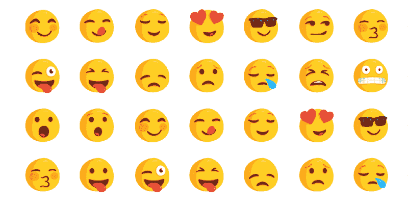
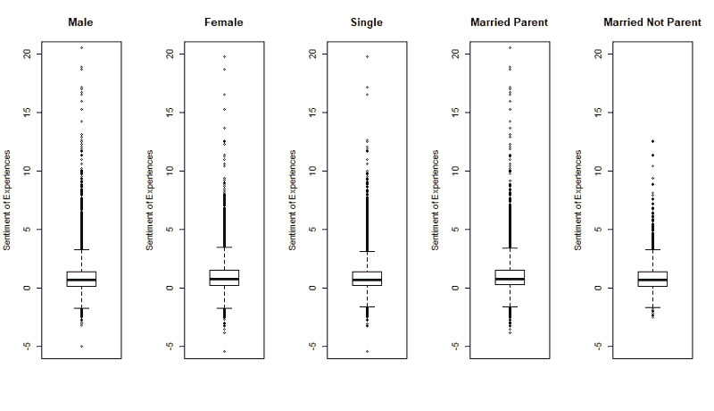
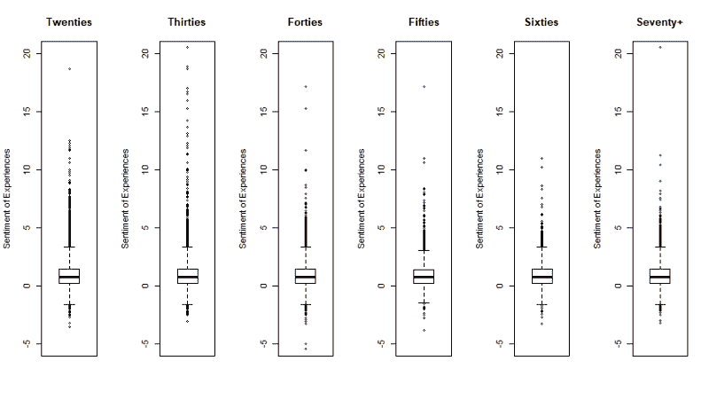
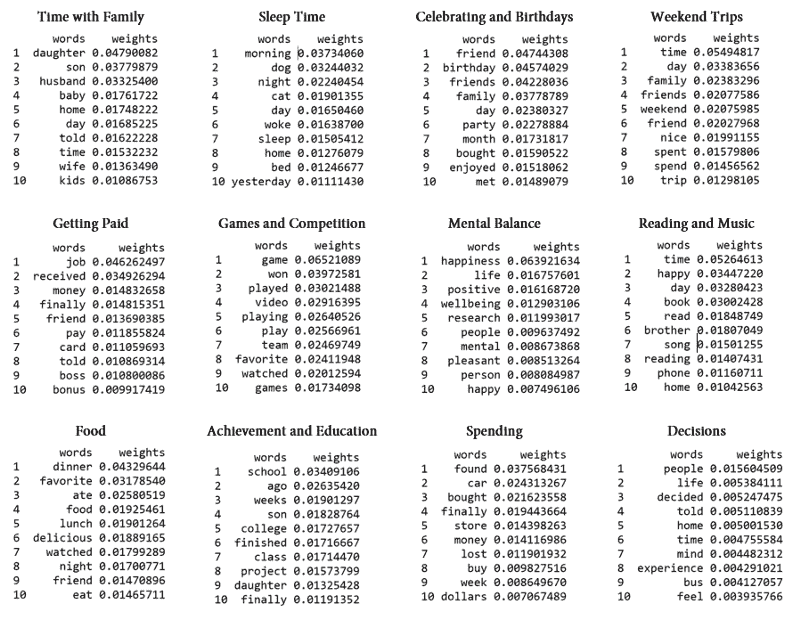

# 数据科学家的快乐指南:来自 10，000 多人快乐经历的发现

> 原文：<https://www.freecodecamp.org/news/a-data-scientists-guide-to-happiness-findings-from-the-happy-experiences-of-10-000-humans-fc02b5c8cbc1/>

乔丹·罗利希

# 数据科学家的快乐指南:来自 10，000 多人快乐经历的发现

现代生活给我们带来了很多。我们经常发现自己在努力控制焦虑、推卸责任、适应新环境以及保持快乐心态。

但如今幸福是一个嘈杂的空间。自助书籍、文章、博客和冥想应用程序并不能帮助所有人，往往会增加保持满足所需的精神负担。这是一个严重的问题。因此，随着心理健康变得越来越脆弱，解决方案变得越来越复杂，重要的是要坚持自己的基本原则。也就是说，我们需要把我们的日常生活重新聚焦在让人们快乐的日常事物上。

### 数据

这项研究深入到一个方便的数据集，可以帮助揭示幸福的基本原理。 [HappyDB](https://github.com/rit-public/HappyDB) 是 2017 年 3 月至 6 月通过亚马逊机械土耳其人收集的一组 10 万+的快乐体验。它包含了来自世界各地成千上万贡献者的经验和统计数据。有趣的是，一些基本的文本分析方法可以帮助我们从这些数据中学到很多东西。

通过理解从这些快乐经历中得出的情感强度和关键词模式，HappyDB 教给我们两个有价值的教训。

你可以在 [GitHub](https://github.com/jrohrlich/DSGuideToHappy) 上自己查看代码。

### 1.幸福不以人口统计为条件。

这个是违反直觉的。

关于幸福，我们大多数人都经历过“草总是更绿”的效应。年轻人期望在以后的生活中有幸福的事业和家庭。年长的人回忆起他们年轻时喜欢冒险的时光。单身汉渴望友谊。夫妻都希望有孩子。

尽管知道这一点，我们都认为别人更快乐，或者我们生活的其他阶段会给我们带来更多的快乐。我们来看看数据。

[情感分析](https://web.stanford.edu/class/cs124/lec/sentiment.pdf)衡量文本的情感强度。我使用一个名为“Syuzhet”的 R 包来测量这些快乐经历的情绪，以确定它们的强度如何变化。这创造了一系列快乐的经历，这些经历可以被特定的人群分解:

Sentiment of Happy Experiences (by gender, family status)

Sentiment of Happy Experiences (by age group)

有点令人惊讶的是，快乐体验在这些性别、家庭和年龄人群中的传播几乎没有变化。以下是亮点:

*   总的来说，这些经历肯定是积极的。但是底层的四分之一确实有负面情绪(一些快乐的事情诗意地产生于不适和悲剧)
*   这些分布有高端的尾部和相当有限的下限——一些体验是非常正面的，很少是非常负面的
*   在大多数经历中，自我认同的女性比男性的情绪得分略高(0.05-0.1 分的差异)
*   在大多数经历中，已婚父母的情感得分略高于单身汉和无子女夫妇(0.05-0.1 分的差异)
*   不同年龄组的快乐经历的四分位数(第 25、50 和 75 个百分点)实际上是相同的

总而言之， **不同人口统计报告的快乐体验范围没有显著差异。**尽管女性和父母倾向于记录更多的快乐经历，但情绪量表上的差异不能被认真对待——它们对应于每次记录的一个快乐单词的一小部分。这是一个微小的差异。

然而，该数据集不包括任何可能对日常体验产生重大影响的种族、社会经济地位或其他身份位置的数据字段。未来的幸福研究应该密切关注这些关系。

### 2.幸福是由特定类型的经历决定的。

我们很容易认为幸福是一种神秘的、飘渺的物质，它以无法解释的方式渗透到我们的经历中。这种观点支持对幸福的形而上学理解，认为幸福是人类无法理解的。

但这并不是很有帮助，尤其是对那些依赖快乐和有意义的经历作为心理健康生命线的人来说。

进入主题建模。这种文本分析的方法(这里解释；我使用 R 的“Mallet”包)提供了一种建设性的方法来解释 HappyDB 的 10，000+参与者发现什么是快乐的体验。

通过将数据集分割成每个受访者经历的文档，然后运行 LDA 主题模型来识别常见关键词组，我们可以开始分离出给我们带来幸福的不同类型的经历。主题和相关关键词如下，排名不分先后:

Topic Model Output from 100,922 Happy Experiences

#### **与家人在一起的时间**

看起来很容易。像“女儿”、“儿子”、“丈夫”、“孩子”、“妻子”和“时间”这样的词似乎表明，许多人对涉及他们所爱的人的经历反应非常积极。这些经历通常涉及最普通的环境，仅仅从陪伴和爱中获得快乐。

试着花更多的时间和你爱的人在一起:给你妈妈打电话，去看你孩子的足球比赛。回报可能比你想象的要多。

#### **获得报酬**

尽管人们不喜欢认为金钱与幸福有关，但他们的经历却恰恰相反。拿到一份薪水，结清信用卡余额，或者给朋友一笔钱都能让人真正快乐起来。随之而来的成就感和经济安全感肯定能解释为什么。

#### **食物**

人们喜欢吃东西。做一顿最喜欢的饭，和朋友出去吃饭，或者在电视机前狼吞虎咽地吃一品脱冰奶油，这些都能让人开心。和朋友一起享用美食绝对是快乐生活方式的一部分。

#### **睡眠时间**

令人惊讶的是，人们记录了许多关于睡眠的快乐经历:在床上依偎着，和一个毛茸茸的朋友一起睡觉，醒来迎接充满希望的新的一天，等等。如果一个人在富有成效的一天之后的晚上，或者在兴奋的早晨，在一些令人兴奋的事情发生之前，花一点时间反思，那么有很多值得高兴的事情。

#### **游戏和比赛**

人类是好胜的。他们喜欢玩电子游戏，看体育比赛，以及做其他激发他们支配欲的生物本能的事情。和一些朋友一起玩棋盘游戏，或者为你的家庭运动队感到兴奋。很有可能你会很高兴你这么做了。

#### **成就和教育**

经过几周的工作，完成大企业的感觉棒极了。上完一节课，从学校毕业，或者启动一个项目，都可以严重提升一个人的情绪。但是完成大事业需要一些开始，所以走出去，开始一些新的东西！学有所成，回报丰厚。

#### **庆祝和生日**

显然，庆祝活动让人快乐(想想生日、周年纪念日和朋友聚会)。人们喜欢找一个理由——不管多么重要或者多么愚蠢——去见所爱的人，为某个时刻感到高兴，做一些事情来打破枯燥的每周例行公事。

#### **心理平衡和自省**

调整到一个人的精神状态的行为本身似乎提供了很多快乐。内省地思考一个人的幸福、个人空间和快乐似乎对这些事情有积极的影响！试着冥想，反思快乐的经历，或者只是意识到你的精神状态——这可能正是帮助提升它的事情。

#### **支出**

当然，满足我们的物质欲望会给很多人带来幸福。找到划算的交易，最终买下那辆车或房子，为自己或爱人买些好东西，这些都会创造某种快乐。负责任地享受。

#### **周末旅行**

人们喜欢不工作，但如果在好的公司享受，同时做一些不同的事情，他们会更加享受。去某个地方旅行，在附近郊游，或者再找一个新奇的借口，在新的风景里和别人共度时光。数据说你肯定不会后悔。

#### **阅读和音乐**

无论是在家里看一本新书，还是在回家的公交车上发现一首歌，许多人都通过阅读或聆听这一简单的行为获得快乐。睡前花一个小时读点新东西或者浏览一下《发现周刊》,可能是值得花时间投资的。

#### **决定**

决策也是一项产生快乐的活动。花时间思考一个大的改变，决定做一些新的事情，并告诉人们，这是令人兴奋的。这也给许多人留下了挥之不去的情绪提升。所以，做一个你已经想了很久的改变吧；并致力于此！

### 包扎

这十二种体验代表了成千上万人日常幸福的基础。鉴于人类比我们通常认为的更相似，同样的情况也可能发生在你身上。

这种方法和其他方法一样，并不完美。一些人口统计数据比其他人口统计数据贡献更大，这可能会在一些主题中引入奇怪的词，或者可能会对模型中表示的主题产生偏见。文本数据是杂乱的，人们也不会在清晰定义的经验类别中思考幸福。

但是，利用这两个教训作为理解我们日常生活中积极因素的基本结构，我认为它可以帮助提醒我们，幸福从来没有我们想象的那么遥远。

我们已经知道这些快乐的话题在某种程度上是真实的。但是我们很少意识到它们对我们情绪的影响，所以没有像我们应该做的那样将它们融入我们的日常生活。

这些类别是经验证明的情绪助推器。它们是快乐扣篮。

所以我们应该取之不尽。扔掉自助手册，专注于真正快乐的经历。你可能会喜欢你找到的东西。

如果你觉得这篇文章很有帮助，可以和朋友分享或者鼓掌？。

自己在 [GitHub](https://github.com/jrohrlich/DSGuideToHappy) 上看看代码吧！