# 移动开发架构的详细但不权威的指南

> 原文：<https://www.freecodecamp.org/news/a-deeply-detailed-but-never-definitive-guide-to-mobile-development-architecture-6b01ce3b1528/>

何塞·韦拉尔多·库尼亚

# 移动开发架构的详细但不权威的指南


原生、Web、PWA、混合、交叉编译……对于 Android 和 iOS 平台，什么是“最好”的开发方式？什么看起来合理？你应该如何在选项中选择？在这篇文章中，我会把它全部列出来，这样你就可以做出明智的决定。

首先，让我给你提供一点背景。我是一名 IT 高级顾问，编写这份指南的想法来自于与我们的一位客户讨论什么是最适合他们的方法。是的，只是为了他们。我们意识到，我们没有一个明确的战略，一个坚实可靠的基础，来帮助我们找到正确的答案。

你知道吗？我在互联网上也找不到这样的指南。虽然有几篇关于这个主题的文章，但我遇到的没有一篇是相当完整的。不幸的是，大多数人忽略了许多概念，甚至更糟的是，这些概念在本质上是错误的。

现在，我想看得更广一些。当我潜在地帮助一些人做出他们自己的决定时，我也在社区中询问更多关于这个主题的想法。

本指南分为两部分:

1.  移动开发架构层(this)
2.  如何做出你的决定

它也可以在 YouTube 上以 10 个视频的系列和 Udemy 上的[免费课程的形式获得。在那里，你会找到和这里一样的书面材料，来自 YouTube 系列的相同视频，以及解决所有主题的测验和最终认证。](https://www.udemy.com/mobile-development-architecture)

所以让我们开始吧。

### 介绍

说到移动平台，[有争议的是只有两个大玩家](http://gs.statcounter.com/os-market-share/mobile/worldwide) : Android 和 iOS。其他技术，如 Tizen、黑莓或 Windows Phone，要么已经死亡，要么已经存在了一段时间，并且没有达到任何有意义的市场份额的前景。

快速浏览一下这个巨大的双头垄断市场，你可能会认为开发者在创建移动应用时没有太多选择。然而，这种想法与事实相去甚远。你可以很快发现大量正在使用的编程语言:C/C++、Java、Kotlin、Objective-C、Swift、JavaScript、TypeScript、C#、Dart、Ruby，我很确定我还错过了一些。

移动开发框架也是如此。除非你不是开发人员，或者在过去 10 年里不知道新技术，否则你可能听说过 Cordova/PhoneGap、React Native、Xamarin、Ionic、Nativescript 或 Flutter，这只是几个移动应用的跨平台解决方案。

因此，让我们来看看架构的所有这些部分，并对其进行一些细分。

#### TL；速度三角形定位法(dead reckoning)

没有明显的赢家。所有的方法都有优点和缺点，对你的下一个项目来说，可能是最好的，也可能是最差的。在本指南中，我将许多不同的解决方案按照其架构与本机平台的距离分为不同的层。

### 原生应用

首先，让我们直奔主题。我们的第一个架构层是本地应用。

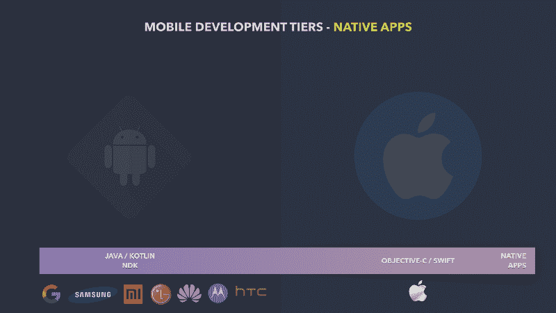

Native Apps Tier — Where you develop for each specific platform (it might be even more specific when considering NDK)

在这一层，您必须了解每个平台的特性。我并不想深究它们，我只是想在一点上下文中提几件事。

#### ios

从 iOS 端开始，只是因为更简单，所以只有苹果统治世界。最初，开发人员需要学习 Objective-C，这是一种专有的面向对象的 C 语言变体，其灵感来自 SmallTalk ( [和一个长得吓人的 API](https://mackuba.eu/2010/10/31/the-longest-names-in-cocoa/) )。

2014 年，苹果公布了多范式语言 Swift，比它的前身简单了很多。仍然有可能处理 Objective-C 遗留代码，但是 Swift 已经达到了很高的成熟度。因此，如果你打算学习如何为 iOS 进行原生开发，Swift 绝对是你应该开始的地方。

#### 机器人

在 Android 方面，有许多不同的制造商。其中绝大多数依靠 ARM 处理器。但一般来说，Android 应用程序基于虚拟机实例([艺术实例](https://developer.android.com/guide/platform/index.html#art))来帮助处理潜在的潜在特性([并非没有许多惊人的技巧](https://source.android.com/devices/tech/dalvik/#features))。

这就是为什么最初选择的语言是 Java。近二十年来，它不仅是世界上最受欢迎的语言([与 C](https://www.tiobe.com/tiobe-index/) 交换了一些位置)，而且它还因其 Java 虚拟机(JVM)而闻名。这使得开发人员能够将他们的代码编译成可以被 JVM 读取和运行的中间字节码。

使用 Android 原生开发套件(NDK)，也可以直接用 C/C++编写的原生代码开发应用程序的关键部分。在这种情况下，您必须意识到潜在的平台问题。

Kotlin 是 JetBrains 在 2011 年推出的一种语言。当它第一次出现时，尽管它很灵活和简洁，但它只不过是另一种 JVM 语言，有更成功的竞争对手，如 Scala、Clojure 或 Groovy。然而，在 2016 年首次重大发布后，它迅速开始脱颖而出，特别是在谷歌宣布将在 [Google I/O 2017](https://www.youtube.com/watch?v=EtQ8Le8-zyo) 上正式支持 Android 平台之后。

Kotlin 正在成为谷歌的第一类语言(目前 Kotlin 和 Java——按此顺序——在整个 Android 的官方文档中使用)。随着美国联邦上诉法院对甲骨文指控谷歌侵犯 Java 版权的无休无止的诉讼做出裁决，Java 的全面替代更是众望所归。

### 本地组件

在这一层进行开发，您还可以利用所有本机 API，尤其是本机组件。这可以让你的应用免于重新发明轮子。

我发布了一个视频演示如何在 Xcode (iOS)和 Android Studio 上创建一个简单的项目。如果你想去看看:

#### 原生应用优势

*   最佳性能和最高用户参与度
*   前沿本机功能
*   尤其是好的 ide Android Studio/Xcode
*   现代高级语言 Kotlin / Swift
*   与 NDK 进行非常低级的接触

#### 原生应用的缺点

*   要维护两个代码库
*   需要安装(安卓即时应用除外)
*   很难分析 SEO
*   让用户下载应用程序非常昂贵

### webapps

另一方面，我们有网络应用。网络应用本质上是由浏览器运行的应用。你不需要编写针对平台的代码，而是针对运行在平台之上的任何浏览器。

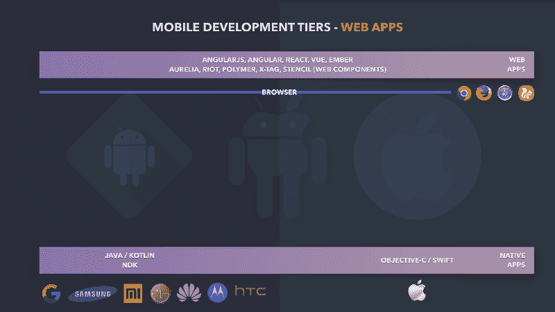

Web Apps Tier — clearly on top of a browser bar targeting a beast sitting in between Android and iOS.

在这一层，你会发现数量惊人的竞争者在你争我夺。但是它们都使用相同的武器:HTML、CSS 和 Javascript。

Web 框架和库，即使利用 CSS 预编译器，如 [LESS](http://lesscss.org/) 或 [SASS](https://sass-lang.com/) ，甚至 Javascript 预编译语言，如 [TypeScript](http://www.typescriptlang.org/) 、 [CoffeeScript](https://coffeescript.org/) 或 [Flow](https://flow.org/en/) ，甚至共生，如 [JSX](https://reactjs.org/docs/introducing-jsx.html) 或 [Elm](http://elm-lang.org/) ，更不用说像 [Babel](https://babeljs.io/) 这样的工具了，这些工具用于将所有内容转换为 Javascript，并符合 ecmass 的不同可配置级别

最终，它们都是由浏览器呈现和运行的 HTML、CSS 和 JavaScript。无法直接访问本机 API，如摄像头、振动、电池状态或文件系统，但其中一些可以通过 Web API 实现:

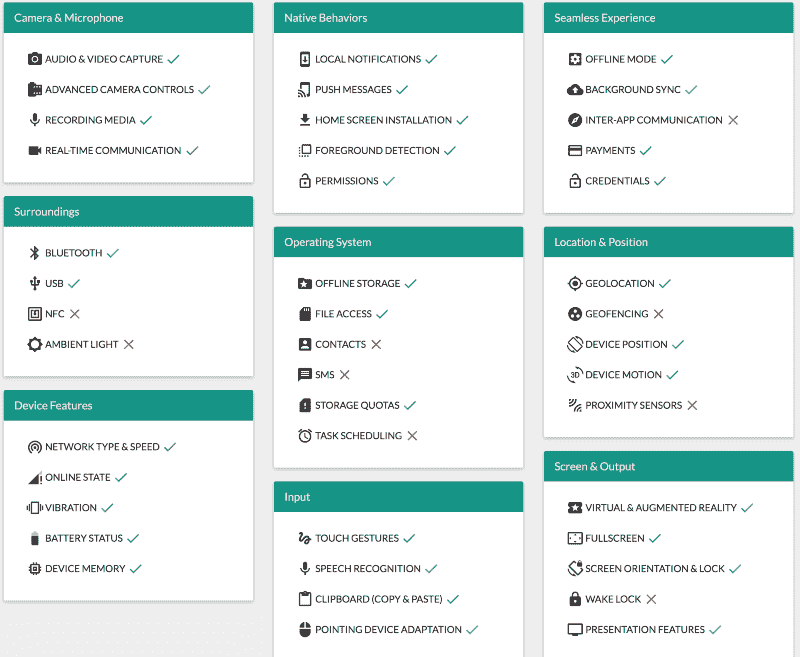

[Can I rely on the Web Platform features to build my app?](https://whatwebcando.today)

Web APIs 的最大问题是它们的成熟度。有些浏览器不支持其中的许多功能。实现是有差异的，尤其是在不同的移动浏览器之间。

#### Web 应用程序优势

*   平台和桌面浏览器之间的共享代码
*   不需要以前的安装，只需导航和使用
*   大量的框架和库来支持它们
*   最适合搜索引擎优化

#### Web 应用程序的缺点

*   性能下降
*   很难获得原生用户体验
*   需要互联网连接
*   官方应用商店不提供
*   API 不如原生 API 成熟可靠

### 框架和 Web 组件

[Angular](https://angular.io/) 、 [React](https://reactjs.org/) 和 [Vue](https://vuejs.org/) 可能是截至 2018 年最受欢迎的 web 框架。然而，准确地说，React 被认为只是一个库，因为它灵活且不那么固执己见。另一方面，Angular 是一个非常固执己见的框架。Vue 生活在它们之间的某个点上。

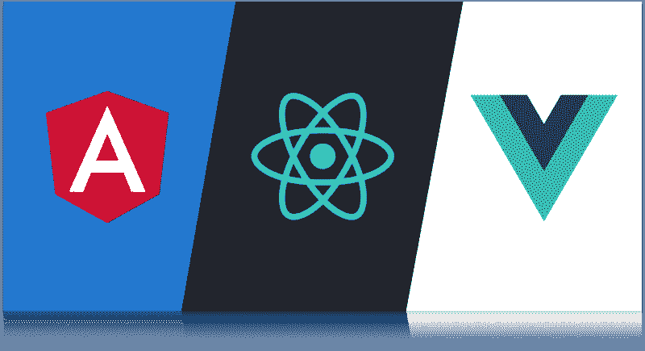

Angular vs React vs Vue

Angular，原名 [AngularJS](https://angularjs.org/) ，于 2010 年由谷歌呈现在世人面前。它很快开始发光，因为与那个时代的其他库相比，它颠倒了范式(像当时最流行的 [jQuery](https://jquery.com/) )。有了 AngularJS，每当 JavaScript 模型更新时，模板就会神奇地更新，而不是直接与 HTML 元素对话来操纵 UI 状态。

随着 AngularJS 越来越受欢迎，它的用途也越来越广。它变成了一个完整的、自以为是的框架，是最早认真对待 SPAs(单页应用)的框架之一。这种增长(在两个方面)导致了一些 API 膨胀和性能问题。

React 是由脸书创建的，用于解决他们自己在表示层的需求。它引入了许多突然变得非常受欢迎的方面，如虚拟 DOM、单向数据流(最初名为 [Flux](https://facebook.github.io/flux/docs/in-depth-overview.html#content) ，通过一个名为 [Redux](https://redux.js.org/) 的实现库特别受欢迎)，以及名为 [JSX](https://reactjs.org/docs/introducing-jsx.html) 的 HTML 和 JavaScript 混合。

只是在 2016 年，经过长时间的辩论和意想不到的大变化，谷歌推出了其流行的网络框架的第二版。他们称之为棱角，而不是 AngularJS。但是，由于许多人已经将第一个版本称为“Angular”(没有“JS”后缀)，人们开始将新版本称为 Angular 2。这变成了一个命名问题，因为谷歌还宣布，它将每 6 个月发布新的主要版本。

在我看来，这是一个巨大的错误。我以前见过这种情况(例如，Struts vs Struts 2/WebWork)。他们有一个非常受欢迎的产品，似乎已经达到了它的平台期，它已经开始受到更多的批评而不是赞扬。如果谷歌决定从头开始重建它，无论如何，他们都不应该仅仅改变它的主要版本。人们如何相信他们不会在每个新的主要版本发布时重复它？第二版应该呈现突破性的变化，但这并不意味着它可以完全修改。

Angular 是一个壮观的 web 框架，我真的对它充满热情。然而，这是一个完全新的野兽。跟 AngularJS 没多大关系。即使是另一个令人惊叹的框架 Vue(顺便说一句，可能是最令人愉快的工作之一)从鸟瞰图看起来也更类似于 AngularJS。我相信这引起了远离 Angular 的重大运动，并对 React 的受欢迎程度做出了实质性贡献。

Vue 是三个最流行的网络框架中唯一一个没有大公司支持的。它实际上是由一位前谷歌开发人员发起的。由于其令人生畏的简单性和微小的占用空间，它得到了大量热心社区的关注。

尽管有更完整的解决方案，但它们都基于 [web 组件](https://www.webcomponents.org/)的概念。W3C 目前正在开发关于它们的开放规范，以及一些有趣的实现，如[聚合物](https://www.polymer-project.org/)、[模板](https://stenciljs.com/)和 [X-Tag](https://x-tag.github.io/) 。

在本系列的第三个视频中，我不会花太多时间讨论框架，而是讨论 web 组件库:

### 移动应用与网络应用

我不知道你是否注意到了，但是我在这里给出的层次顺序遵循了我认为学习所有方法最简单的途径。我从本地层开始，这是最真正的移动开发。然后我决定直接飞向另一个极端来呈现 Web 层，这是从第一批智能手机开始就可用的层。

直到现在，在阐述了我的图的两个边之间的比较之后，我才开始谈论构建移动应用程序的许多跨平台方法。

移动应用和网络应用之间的争论由来已久。我所说的关于移动应用的一切并不仅限于本地层。它也适用于我稍后介绍的所有跨平台层。

#### 用户行为困境

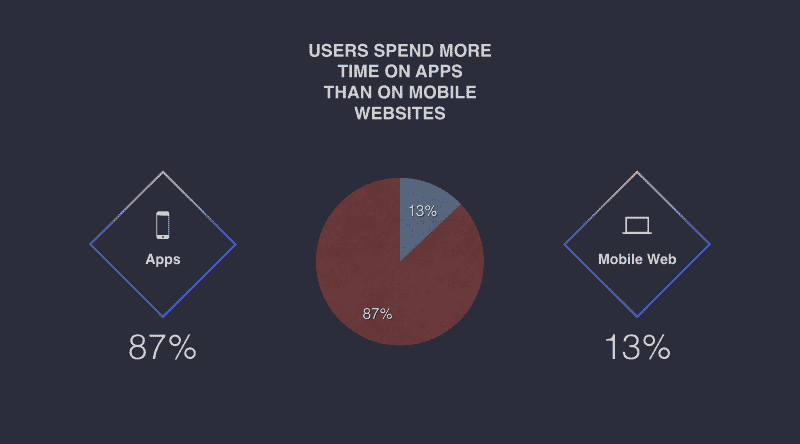

Users spend more time on Mobile Apps (87%) than on Mobile Websites (13%)

根据 2017 年的[康姆斯克调查，用户对移动应用的忠诚度远比其对移动网站的忠诚度更相关。根据福布斯](https://www.comscore.com/layout/set/popup/Request/Presentations/2017/The-2017-US-Mobile-App-Report?logo=0&c=12)上的一篇[对齐的文章，这通常是因为便利性(例如，主屏幕按钮、小工具、顶部通知)、速度(例如，更流畅的界面、几乎即时的启动)和存储的设置(例如，离线内容)。](https://www.forbes.com/sites/quora/2017/12/19/why-many-online-shopping-sites-are-becoming-mobile-shopping-apps/#1e86018f62c2)

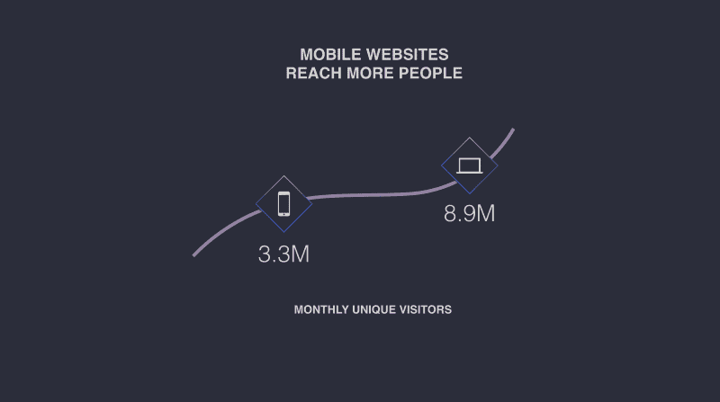

Mobile Websites reach more people (8.9M monthly unique visitors against 3.3M of Mobile Apps)

另一方面，在相同的康姆斯克数据中，我们了解到，通过移动网站可以更容易地联系到客户，因为他们不太依赖于他们喜欢的几个应用程序。如果你比较最受欢迎的网站和下载最多的应用程序，估计平均每月有 890 万独立网络访问者访问排名前 1000 的网站。这几乎是下载量最高的 1000 款应用的平均独立用户数的三倍。

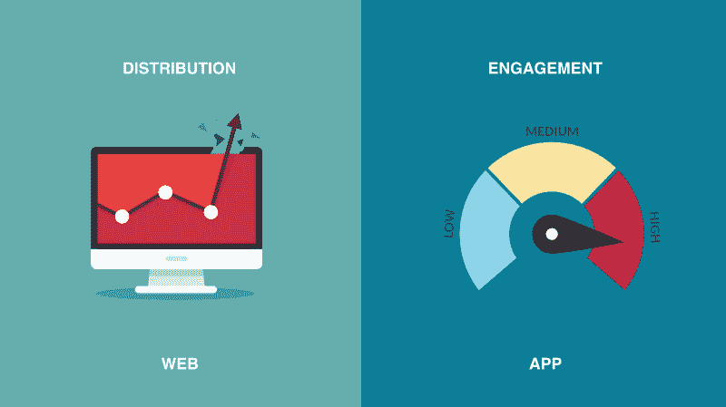

Distribution (Web App) x Engagement (Mobile App)

这就是分销与参与的关系。你的网络应用被访问的几率更高，因为用户在移动浏览器中导航时更有可能尝试新事物。但事实证明，移动应用程序更有吸引力，能长时间吸引用户的注意力。

既然你理解了这个困境，让我们来看看渐进式网络应用。这种方法与 Web 应用程序层联系如此紧密，以至于我将其归类为 Web 应用程序的附录。但它是一个巨大的颠覆者，也是网络和移动开发中最突出的新的和最酷的东西的重要候选人。

### 渐进式网络应用

渐进式 Web 应用程序(PWAs)是一套工具，用于为 Web 应用程序用户提供他们在运行移动应用程序时所习惯的相同体验。这意味着 Web 应用程序可以利用潜在的更高的分发级别和更体面的参与级别。

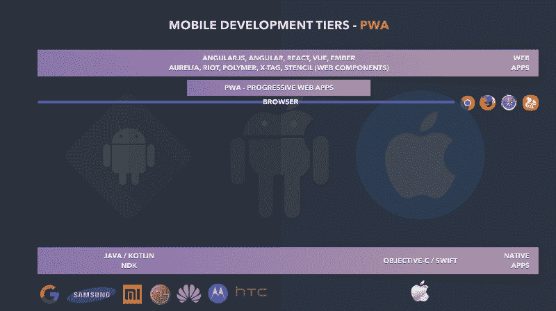

Progressive Web Apps addendum to Web Apps tier

谷歌定义了 PWAs 的三个主要资格:它们必须[可靠、快速、有吸引力](https://developers.google.com/web/progressive-web-apps/#reliable)。

被称为[服务工作者](https://developers.google.com/web/ilt/pwa/introduction-to-service-worker)和[应用外壳](https://developers.google.com/web/fundamentals/architecture/app-shell)的特性是渐进式网络应用的基础。它们是为了提高应用程序的可靠性而创建的，因为它们现在被设计成无论设备的连接状态如何都可以工作。这包括离线模式，以及连接不良。它们还提供了显著的感知性能提升，因为应用程序使用本地缓存数据启动，这消除了同步内容下载的延迟。

你可以认为可靠性是参与的间接载体。例如，用户在乘火车上下班时不会受到影响。他们可以保持接触。

这同样适用于速度。根据谷歌的说法:

> 53%的用户会放弃一个加载时间超过 3 秒的网站！

然而，完全可靠和快速加载并不一定保证高参与度。pwa 利用了移动应用程序独有的移动相关功能，如“添加到主屏幕”选项和推送通知。

说到“添加到主屏幕”功能，你可能会注意到，苹果从第一代 iPhone 开始就有类似的功能。有些人甚至认为渐进式网络应用是谷歌为苹果原创创意取的新名字。

而且你真的不能完全不同意。有些想法其实是循环往复的。他们来了，走了，然后带着一个新名字和一些增强功能(例如，服务人员)回来，所以他们最终可以留下来。

另一方面，很难完全同意。史蒂夫·乔布斯关于 Web 2.0 + AJAX 的演讲和 2007 年在 WWDC 发布 iPhone 的令人难忘的公告都不足以让人信服地称他为 PWAs 之父，甚至是先知。

公平地说，iPhone 上的添加到主屏幕功能只不过是一个微妙的，几乎隐藏的功能，可以生成桌面图标，以全屏模式启动网络应用程序。它承担了 HTTP 请求-响应周期的所有负担，并且没有绕过缓存的清晰路径。

我们从正确的点开始。他们探索了在不丢失移动应用的客户端引导的情况下，先前安装的 Web 应用是不必要的。这意味着用户在启动后的第一次交互所需的一切都可能被本地缓存(读作:App Shell)，并在他们点击“添加到主屏幕”时保持可用

转到 PWAs 的另一个众所周知的特性，让我们来谈谈移动应用世界的超级吸引人(或重新吸引人)的特性:推送通知。它们是出现在顶部通知栏/区域以及锁定屏幕上的提醒样式的消息。一旦他们收到通知，他们就有能力把用户拉回到你的应用。

为了加强 PWA 的吸引力，谷歌已经将所有现代网络应用编程接口纳入 PWA 的保护伞之下。因此，在渐进式 Web 应用程序的背景下，有望看到诸如支付请求、凭证管理、WebVR、传感器、WebAssembly 和 WebRTC 之类的东西。但是这些特征并不一定与 PWA 联系在一起，有些甚至在 PWA 这个术语被创造出来之前就已经存在了。

#### PWA 和苹果

另一方面，苹果直到 2018 年 3 月才宣布了他们在 PWAs 方面的第一个坚实的里程碑。虽然仍有一些限制，但进步是可观的。一些限制可能与 Safari 落后于竞争对手的事实有关。其他原因可能归因于苹果的严格控制哲学。

尽管如此，苹果的应用商店比谷歌更赚钱。苹果断言，应用程序发布的更多标准带来了更高的整体可靠性，而 PWAs 注定会损害应用程序商店的收入。这表明，一些似乎是有意强加的限制(如 50Mb 的 PWA 最大缓存大小)将需要更多的成本来撤销。

#### 不幸的是，pwa 并不完美

Web 解决方案以及不同层面上的所有跨平台解决方案都在努力实现本地应用的卓越性和全面性。随着你的应用远离原生层，Android 或 iOS 的每一个新功能和每一个细节都会让你觉得越来越难接触到原生层。

总的来说，PWAs 修复了 Web 应用程序层的一些问题。但是还有其他一些问题无法通过基于浏览器的解决方案来解决。

#### 修理什么

*   更多“本土”体验
*   更快的加载时间
*   不需要互联网连接
*   迫使 web 开发人员意识到没有连接以及连接不良的情况
*   整合移动应用的功能，如推送通知、地理定位或语音识别

#### 他们没有的是

*   固有的缓慢
*   尚未在应用商店中提供(目前还没有)
*   仍未被所有浏览器完全支持
*   仍然缺乏移动功能，如 NFC、环境光、地理围栏
*   也缺乏对 Android 或 iOS 特性的支持，如 PiP、智能应用横幅、启动屏幕小部件和 3D 触摸

在下面的视频中，我简要介绍了 PWAs。

### 混合应用

在这个层面上，我们开始深入移动应用程序世界。我们将从最远的一层开始:混合应用程序。

术语“混合”通常也适用于所有跨平台解决方案。然而，在这里，我把它限制在移动组件内部工作的应用程序，称为 WebViews。

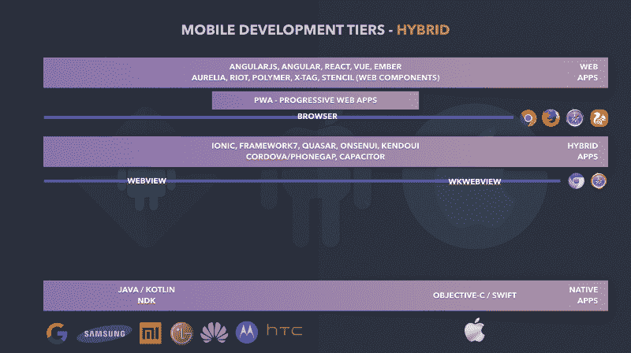

The Hybrid Apps tier. Below the browser's line but on top of WebViews

在第二个视频的演示中，我添加 WebView 作为 Hello World 示例的目的是为了说明每个平台都有一个本机组件，能够像实际的浏览器一样运行。

#### 科多瓦/PhoneGap

像 [Cordova](https://cordova.apache.org/) / [PhoneGap](https://phonegap.com/) 这样的解决方案缩小了网络和移动应用之间的差距(抱歉，这个双关语没有创意)。它们提供工具来打包开发人员的 HTML、JavaScript 和 CSS 代码(以及任何额外的资产，如图像或视频)，并将它们转换为移动应用程序(是的，真正的 Android 或 iOS 应用程序)。这些应用程序有专门的 WebView 来解释和运行原始的 web 代码，从应用程序主文件夹(通常称为“www”)中的“index.html”文件开始。他们还通过插件将 JavaScript 代码与本地 API 连接起来，这些插件部分用 JavaScript 实现，部分用本地语言实现。

所以，让我们把事情说清楚。混合应用程序能够访问本机 API(而不是 Web APIs)，但它们被 WebView 包围。带有 Cordova 的按钮必须是由 WebView 呈现的 HTML 按钮，而不是移动本机按钮。

这是一个神奇的层，允许公司将其网络应用程序移植到移动应用程序，由应用程序商店提供。所以这里允许任何 web 框架。

#### 离子的

像 [Ionic](https://www.ionicframework.com/) 这样的框架将 Cordova 包装成自己的解决方案。使用 Ionic，您不需要使用 Cordova 的命令行界面(CLI)，因为它的所有命令都由 Ionic CLI 包装。

最近，Ionic 团队决定接管整个混合应用堆栈。因此，他们推出了一款替代科尔多瓦的产品，名为[电容器](https://capacitor.ionicframework.com/)。电容器支持科尔多瓦插件，也可以用于非离子项目。

在该系列的第五个视频中，您可以看到我正在浏览 Cordova Hello World 示例:

#### 混合应用优势

*   它们本质上是可以发布到官方应用商店的网络应用
*   可以与任何 JavaScript 框架/库一起使用
*   代码仍然可以跨平台高度共享
*   访问本机功能(例如，摄像头、加速度计、联系人列表)

#### 混合应用的缺点

*   努力解决性能问题和内存消耗，因为 web 视图负责在屏幕上呈现所有内容
*   必须在单个 web 视图上模仿所有本机 UI 组件
*   更难被应用商店接受和发布
*   通常需要更长时间才能获得适用于这些环境的本机功能

### Web 本地

Web Native 是一个相对较新且经常被误解的层。这就是 Web 应用程序遇到本地组件的地方。虽然 Appcelerator (Axway) Titanium 已经存在了很长时间，但一些相对较新的竞争对手证明了将它作为一个完全独立的移动应用类别的合理性。

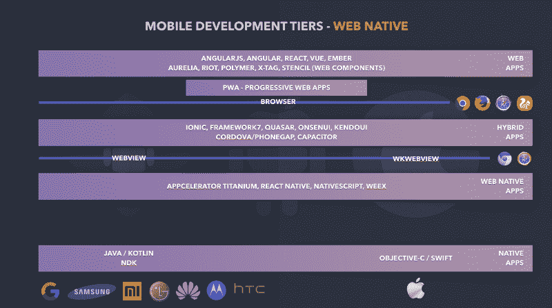

Web Native Apps don't need WebView as they talk directly to other native components

正如您在上面看到的，没有 web 视图来呈现和运行您的应用程序。那么，您的 JavaScript 是如何执行的呢？是编制的吗？好吧，如果你把编译(从一种语言编译成另一种语言——例如从 TypeScript 编译成 JavaScript)、捆绑、缩小、篡改和混淆都看作一种编译，是的，JavaScript 是编译的。

但问题是，这并不能让你的 JavaScript 成为 Android 或 iOS 操作系统直接理解的东西。而且，从理论上讲，如果没有 HTML 布局引擎的膨胀，就没有只充当 JavaScript 引擎的本地组件。

策略是将 JavaScript 引擎(通常是 Android 的 [V8](https://developers.google.com/v8/) 和 iOS 的 [JavaScriptCore](https://developer.apple.com/documentation/javascriptcore) )与代码一起发布。虽然它们占用空间小，速度也很快，但它们是外部的东西，必须由你的应用程序提供。

另一方面，这种方法往往具有更好的 UI 性能，因为所有组件都与本机应用程序使用的组件相同(例如，React Native 基于相同的东西)。

#### Web 原生应用优势

*   用一个代码库实现两个平台
*   与原生应用大致相同的性能，因为它们也处理原生 UI 组件
*   调整是必要的，但是代码仍然可以与 web 开发共享

#### Web 本地应用程序的缺点

*   即使只有一个代码库，开发人员也必须了解本地组件
*   对于 Web 开发人员来说，学习曲线比混合/ Web 应用程序更陡峭，尤其是在布局方面

#### 反应自然

在本系列的第 6 部分中，我在 React Native 中做了一个快速的 Hello World。这在 Android Studio 的布局检查器上显示了模拟器中呈现的组件。我与前面的例子进行了比较，确保没有任何 WebView。

#### 原生脚本

另一个令人惊叹的框架是 [Nativescript](https://www.nativescript.org/) ，在过去的两年里，我对它特别感兴趣([我有一门关于 Udemy 的课程](https://www.udemy.com/angular-native)——用葡萄牙语)。它类似于 React Native，但不与 React world 绑定([有一个非官方的集成，Nativescript-Preact，尽管](https://github.com/staydecent/nativescript-preact))。

有了 Nativescript，你可以使用普通的 JavaScript、TypeScript、Angular 和最近的 Vue 进行开发。当然，你也可以使用其他框架，但是这些都是官方支持的。顺便说一下，这也有很好的记录。

Nativescript 有类似于 [Nativescript Sidekick](https://www.nativescript.org/nativescript-sidekick) 和 [Nativescript Playground](https://play.nativescript.org/) 的工具，以及基于社区可以提供的[模板](https://market.nativescript.org/?tab=templates)的项目结构。这应该有助于您创建项目，让您能够在云和 iPhone 设备上的模拟器上启动、部署、测试和运行，即使您没有使用 Mac 进行开发。

在本系列的第七部分中，我使用 Sidekick 和另一个从 CLI 启动的项目以及我出于学习目的创建的一个 [WhatsApp 克隆模板](https://github.com/Especializa/nativescript-whatsapp-template)创建了一个 Hello World。

当你的应用在 Android 模拟器上运行时，看一下布局检查器是很重要的。使用 Nativescript，它显示了原生组件(同样，没有 WebView)，以及常见 Android 类的直接实例，如 TextView。这与 React Native 不同，React Native 有自己的类来包装本机组件。

这可能就是为什么 Nativescript 声称，当一个新功能在 iOS 和 Android 上可用时，你可以在 Nativescript 项目中使用它，这两者之间没有延迟。例如，[他们在博客](https://www.nativescript.org/blog/preview-of-augmented-reality-in-nativescript)上发布了一个 AR 项目，就在 iOS 11 正式发布新 ARKit API 的同一天。

#### 腊肠！腊肠

另一个值得一提的框架是 [Weex](https://weex.apache.org/) 。这是阿里巴巴开发的一个项目，目前正在阿帕奇软件基金会(ASF)孵化。它使用常见的 HTML 标签，如`<d` iv >和 CSS 命令 I`nside &`lt；style >标签来调用本地组件。根据他们的文件:

> 尽管 Weex 中的组件看起来像 HTML 标签，但是您不能使用所有的组件。相反，您只能使用内置组件和自定义组件。

### 交叉编译

在这个层面上，是时候跳出网络潮流了。这是最接近原生开发的层，但是具有使用单一代码库来针对 Android 和 iOS 的优势。

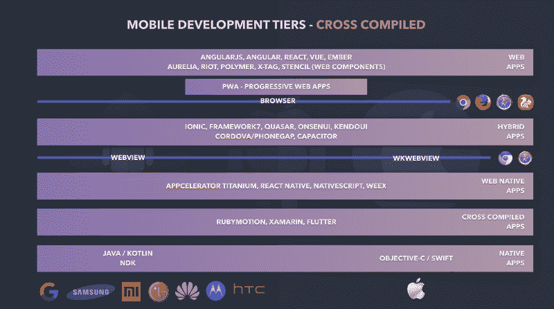

Development tiers now complete with Cross Compiled Apps

#### RubyMotion 和 Xamarin

还有类似 [RubyMotion](http://www.rubymotion.com/) 的解决方案。这是一种使用 Ruby 编写移动应用程序并直接编译到目标平台的方法(因为它是使用任何“本地”语言创建的)。

另一个选择是 [Xamarin](https://www.xamarin.com/) ，在这里你用 C#编写，编译成中间字节码，然后部署你的应用程序以及 [Mono](https://www.mono-project.com/) 公共语言运行时的一个实例。这种方法与 Web Native(V8 和 JavaScriptCore 由您的应用程序提供)有相同的缺点，但也可以依靠 JIT 编译在运行时优化应用程序。

#### 摆动

最后但同样重要的是，我想提出 [Flutter](https://flutter.io/) 。这是谷歌针对移动开发的最新酷举措。它适合交叉编译层，因为您使用 [Dart 语言](https://www.dartlang.org/)编写应用程序，并将其编译到本机平台。

Flutter 在某些方面有所创新。可能最突出的一点是它提供了自己的组件集。

**什么？自己的一套组件？**

是的，Flutter 提供了许多不同的组件，因此您可以完全跳过平台中的组件。它有通用组件，也有 Android 的[材料设计](https://flutter.io/widgets/material/)组件，iOS 的[库比蒂诺](https://flutter.io/widgets/cupertino/)组件。

而不是。Net 虚拟机(如 Xamarin)或 JavaScript 引擎(如 Web 原生框架)，使用 Flutter，您的应用程序将交付您决定使用的组件。

它们是本地组件吗？

是的，他们是。你的应用也是本地的。一切都编译到原生架构。但是，请记住，它们不是预先存在的本地组件。

那有什么意义？

在我看来，这个解决方案既聪明又大胆。我一直在等着谈论优点和缺点，但因为它只是一种特定的技术，所以现在让我来解决它们。

Web 原生和交叉编译解决方案的最大挑战之一(记住，在我们的层中，在原生之上，但在 WebView 之下)是如何处理原生组件。例如，一个重要的问题是如何布局它们。这是因为它们不是为那些外部资源所使用的。此外，它们在创建时并没有考虑到另一个平台中的对应部分。例如，Android NavBar 不像 iOS UINavBar 那样工作。

使用 Flutter，创建组件时总是考虑到跨平台。让我们来看看交叉编译应用程序层的优缺点:

#### 交叉编译应用的优势

*   用一种语言接触两个平台
*   与原生应用大致相同的性能，因为它们也处理原生 UI 组件

#### 交叉编译应用程序的缺点

*   对最新平台更新的支持略有延迟
*   无法与 web 开发共享的代码
*   即使只有一个代码库，开发人员也必须了解本地组件

PS:有了 Flutter，你可以在应用程序代码的同时提供自己的小部件

### 移动应用运行时架构

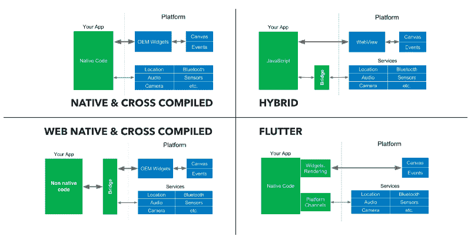

Four different Mobile Apps runtime architectures.

如您所见，交叉编译的解决方案可以分布在四个不同象限中的三个。在左上角，你可以看到本机和交叉编译(例如 RubyMotion)，你的应用程序(绿色的)被编译成本机二进制文件。它直接与 OEM 部件(原始设备制造商部件——我们称之为本地组件)以及本地 API 对话。

右上象限专属于混合应用。您的应用程序必须是由本地 WebView 执行的 HTML/CSS/JavaScript(正如我们在本系列的第五个视频中所做的)。Cordova/PhoneGap 或 Capacitor 可以提供一个桥梁，让您的 JavaScript 代码与本地 API 对话。

左下象限是所有 Web 原生解决方案以及 Xamarin 的位置。你的应用不是编译成本地代码(而是 Xamarin 中的二进制流)，它包装了一个解释器，作为平台中所有东西的桥梁。

最后，在右下角，我可以说交叉编译，但它似乎非常特殊的颤振。它不同于其他看起来更传统的交叉编译策略。在这种情况下，没有桥梁，但是也没有与 OEM 部件的联系(至少不需要这样)。

请注意，Web 应用程序(甚至包括 PWAs)不在图中，因为它们根本不涉及本机环境。

在本系列的第 8 部分中，我将讨论交叉编译的应用程序，并通过 Hello World 项目重点讨论 Flutter。

### 包扎

综上所述，我希望你清楚，这里没有大赢家。要找出一般分类的特质和共同点并不容易。我的意图不是展示每种策略的市场份额，也不是试图找到构建移动应用程序的最高效、最愉快或最可靠的方式。

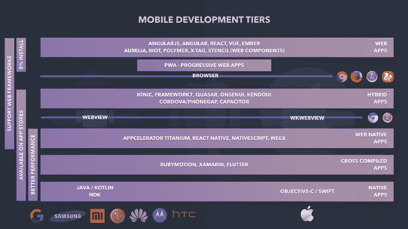

All Mobile Development Tiers with their main characteristics.

我的意图是展示玩家的概况，以及他们所采用的方法，这样你就可以选择最适合你的需求。

#### 一些帮助你找到路的提示

请允许我在这一点上更加固执己见，并提出一些问题和答案，希望能为你铺平道路。

在我们继续之前，你猜怎么着？没错。我整理了另一段视频，涵盖了我要说的内容:

#### **1。我的应用程序需要密集的 CPU 进程吗？**

如果答案是**是**:原生应用。
记住:你得到的越低，你的应用程序就越有性能。

需要密集计算能力的应用程序，例如机器学习(即使只是运行预训练的模型)，是原生层(或者至少是交叉编译的)的良好候选。

如果你正在考虑游戏，你可能听说过虚幻和统一游戏引擎。它们是许多游戏公司的必经之路，我觉得它们有点适合交叉编译层。我决定不把他们列在这个列表中，因为我开始担心这篇文章的长度。:)

#### **2。我的团队足够大来维护两个代码库吗？**

如果答案是**否**:除了原生应用之外的一切。
记住:你的级别越高，你就越抽象，越独立于平台。

当考虑原生应用时，这是将人们拉回的最大因素。一般来说，两个代码库使得事情变得昂贵和难以发展。理论上，你不希望 Android 上的应用比 iOS 上的功能多得多，反之亦然。

如果第 1 项和第 2 项都与您的应用程序相关，您必须指定哪一项至关重要。或者，再次考虑交叉编译方法的折中方案。

#### **3。我的团队最擅长什么？**

如果答案是 **C#** : Xamarin。
如果答案是 **Java** : Native(安卓)。
如果答案是 **Web/Javascript** :从 Web 到 Web Native。

这似乎是显而易见的，但是，相信我，我见过人们认为这是理所当然的情况。除了苹果推出 Objective-C，从而抛弃了史蒂夫·乔布斯(Steve Job)对 iPhone 应用程序类似 PWA 方法的押注之外，所有解决方案都是在考虑开发人员先前能力的基础上构建的。

#### **4。我的用户来自哪里？**

如果答案是**未知**(或者除了应用商店以外的任何东西):渐进式网络应用。
记住:不得不从应用商店安装应用会导致额外的摩擦。

我们讨论了移动应用的网络分发能力(浏览器下面的每一层)。

#### 混合方法

Web 技术允许你拥有一个混合的代码库，不仅针对移动平台，也针对桌面平台。我知道像 [Electron](https://electronjs.org/) 这样的解决方案可以很容易地将你的应用程序部署到 Windows、Mac 或 Linux 电脑上。但是我说的是让一个 Web 应用程序(或者更好的是 PWA)与一个移动应用程序共享代码。

好吧，你可能认为科尔多瓦做得很体面。嗯，我同意。混合应用是由 WebView 运行的网络应用，但我仍然试图说服你跳出框框思考。如果您想要一个带有 HTML 模板的 Web 应用程序，并与 Web 原生应用程序共享代码，该怎么办？

根据您用来构建应用程序的架构模式，通过重用业务逻辑和大量样板代码(如路由和状态管理)可以使事情变得更容易。你只需要定义两套模板，一套用于网页，另一套用于手机。

有一些项目种子可以帮助你开始。例如，有了 [Angular-Native-Seed](https://github.com/TeamMaestro/angular-native-seed) ，你就可以开始一个 Angular 项目，准备在移动设备上部署。它可以像创建具有不同扩展名的模板文件一样简单:

```
Extension                      | Platform------------------------------ | --------------------------.{html/scss}                   | Recommended for Web.tns.{html/scss}               | Only for mobile.tns.ios.{html/scss}           | Only for iOS.tns.android.{html/scss}       | Only for Android.tns.ios.phone.{html/scss}     | Only for iOS Phone .tns.android.phone.{html/scss} | Only for Android Phone
```

只需用一个`templateUrl`修饰你的 Angular 组件，就会根据运行的平台选择合适的模板文件。

在上面的代码片段中，`my-component.android.html`在 Android 上运行时会被自动选中。

有时候事情并不简单。有可能你有一个完全独立的组件，只用于一个特定的平台。但是让你的应用程序在一个单一的代码库中管理它应该没什么大不了的。

看看[这里](http://jkaufman.io/react-web-native-codesharing/)，看看如何用 React (Web)和 React Native 实现类似的东西。

这又引出了另一个问题。什么时候你应该去混合，什么时候你应该去网络本地？

我的 10 美分是:如果性能和原生用户体验是你的目标，简单地去网络原生。另一方面，如果保持所有目标的布局一致是一件大事，并且管理两套或更多套模板和样式表听起来让人不知所措，那么就混合使用吧。

正如您所看到的，当涉及到移动开发时，这些方法中的任何一种都可能适合您。只要供应商或维护者支持他们的产品，就有充分的理由去尝试本研究中提到的每一种方法。

我希望这对您有所帮助，并且您已经通过许多不同的移动开发解决方案和策略享受了这段旅程。

### 下一步是什么？

你可能已经注意到我没有添加系列的最后一个视频。好了，我们开始吧:

这一条旨在帮助你决定 2018 年最值得学习的移动技术是什么。如果你问你的下一个项目需要什么样的最佳技术，我会说**视情况而定。**我不只是想说**“随便吧。随便挑挑。祝你一切顺利"**。我想为你提供一个更有效的学习过程，这样你就可以快速掌握多种技术。看看最后一段视频。

移动平台之间正在发生融合，语言变得越来越相似。看这最后一个视频，就算不编码。我展示了 Kotlin、Swift 和 TypeScript 的许多特性。最后，我只是想让你意识到他们并没有那么不同。相信我。看看视频，在评论区告诉我。我真的很期待听到你对此的想法。

感谢您的阅读！