# JavaScript 条件逻辑权威指南

> 原文：<https://www.freecodecamp.org/news/a-definitive-guide-to-conditional-logic-in-javascript-23fa234d2ca3/>

尼克·加德

我是前端工程师，数学家。在编写代码时，我每天都依靠我的数学训练。我用的不是统计学或微积分，而是我对布尔逻辑的透彻理解。我经常把一个由&符号、竖线、感叹号和等号组成的复杂组合变成更简单、可读性更强的东西。我想分享这些知识，所以我写了这篇文章。它很长，但我希望它对你和对我一样有益。尽情享受吧！

### JavaScript 中的真值和假值

在学习逻辑表达式之前，让我们先了解一下 JavaScript 中什么是“真”。由于 JavaScript 是松散类型的，它在逻辑表达式中将值强制转换为布尔值。`if`语句、`&&`、`||`和三元条件都将值强制转换为布尔值。**注意**这并不意味着他们总是从操作中返回一个布尔值。

JavaScript 中只有六个 **falsy** 值— `false`、`null`、`undefined`、`NaN`、`""`—**其他都是真的**。这意味着`[]`和`{}`都是真理，容易让人犯错。

### 逻辑运算符

在形式逻辑中，只有少数运算符存在:否定、合取、析取、蕴涵和双条件。每一个都有对应的 JavaScript 代码:分别是`!`、`&&`、`||`、`if (/* condition */) { /* then consequence */}`和`===`。这些运算符创建所有其他逻辑语句。

#### 真值表

首先，让我们看看每个基本操作符的**真值表**。真值表告诉我们一个**表达式**的真值是基于它的**部分**的真值。真值表很重要。**如果两个表达式生成同一个真值表，那么这些表达式是等价的，可以互相替换**。

**否定**表很直白。否定是唯一的一元逻辑运算符，只作用于单个输入。这意味着`!A || B`和`!(A || B)`不一样。括号的作用类似于数学中的分组符号。

例如，否定真值表的第一行应该这样读:“如果陈述 A 为真，那么表达式！a 是假的。”

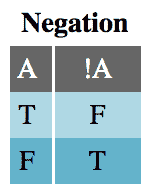

否定一个简单的说法并不难。“下雨了”的否定是“是**不是**下雨了”，JavaScript 的原语`true`的否定当然是`false`。然而，否定复杂的语句或表达式并不那么简单。“天**一直**下雨”或者`isFoo && isBar`的否定是什么？

**合取**表显示，只有当**两个** A 和 B 都为真时，表达式`A && B`才为真。这应该是写 JavaScript 很熟悉的。

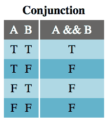

**析取**表应该也很熟悉。如果 A 和 B 的**或***都为真，则析取(逻辑 OR 语句)为真。*****

*****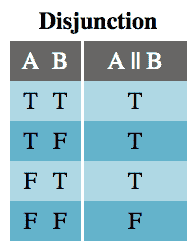*****

*******寓意**表没那么熟悉。因为 A **暗示着** B，所以 A 为真意味着 B 为真。然而，B 可以因为 A 以外的原因而为真，这就是为什么表格的最后两行为真。唯一的时间蕴涵为假，是当 A 为真，B 为假时，因为这时 A 不隐含 B。*****

*****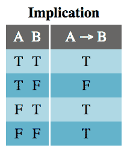*****

*****虽然在 JavaScript 中使用了`if`语句的含义，但并不是所有的`if`语句都是这样工作的。通常，我们使用`if`作为流程控制，而不是真实性检查，因为结果在检查中也很重要。下面是典型的**寓意** `if`语句:*****

```
***`function implication(A, B) {  if (A) {    return B;  } else {    /* if A is false, the implication is true */    return true;  }}`***
```

*****不要担心这有些尴尬。有更简单的方法来编码含义。尽管如此，由于这种尴尬，我将在本文中继续使用`→`作为含义的符号。*****

*******双条件**运算符，有时称为 if-and-only-if (IFF)，仅当两个操作数 A 和 B 共享相同的真值时，才计算为真。由于 JavaScript 处理比较的方式，出于逻辑目的使用`===`应该只用于转换为布尔值的操作数。也就是说，我们应该用`!!A === !!B`来代替`A === B`。*****

*****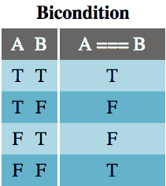**********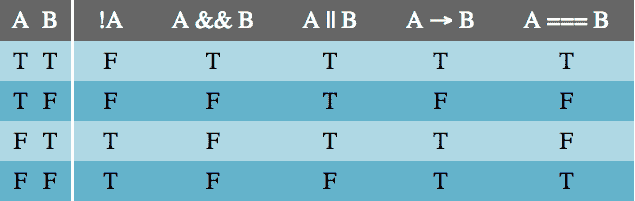

The Complete Truth Table***** 

#### *****警告*****

*****像对待命题逻辑一样对待 JavaScript 代码有两大注意事项:**短路**和**操作顺序**。*****

*****短路是 JavaScript 引擎为了节省时间而做的事情。不会改变整个表达式输出的东西不求值。以下示例中的函数`doSomething()`从未被调用，因为无论它返回什么，逻辑表达式的结果都不会改变:*****

```
***`// doSomething() is never calledfalse && doSomething();true || doSomething();`***
```

*****回想一下，合取(`&&`)为真**仅当** **两个语句都为真**，析取(`||`)为假**仅当两个语句都为假。**在每种情况下，在读取第一个值后，不需要进行更多的计算来评估表达式的逻辑结果。*****

*****由于这个特性，JavaScript 有时会破坏逻辑交换性。逻辑上`A && B`等同于`B && A`，但是如果你把`window && window.mightNotExist`换成`window.mightNotExist && window`，你会破坏你的程序。这并不是说被转换的表达式的**真实性**有什么不同，只是 JavaScript **可能**在试图解析它时抛出一个错误。*****

*****JavaScript 中的[操作顺序让我大吃一惊，因为没有人教我形式逻辑**有**操作顺序，除了分组和从左到右。原来很多编程语言都认为`&&`比`||`优先级高。这意味着`&&`首先从左到右分组(不求值)，然后`||`从左到右分组。这意味着`A || B && C`是**而不是**以与`(A || B) && C`相同的方式被评估，而是作为`A || (B && C)`。](https://developer.mozilla.org/en-US/docs/Web/JavaScript/Reference/Operators/Operator_Precedence#Table)*****

```
***`true || false && false; // evaluates to true(true || false) && false; // evaluates to false`***
```

*****幸运的是，**分组**，`()`在 JavaScript 中拥有最高优先级。我们可以通过手动将需要计算的语句关联成离散的表达式来避免意外和歧义。这就是为什么许多代码棉条禁止在同一个组中同时有`&&`和`||`。*****

#### *****计算复合真值表*****

*****既然简单语句的真值是已知的，就可以计算更复杂表达式的真值。*****

*****首先，计算表达式中变量的数量，并编写一个包含 2ⁿ行的真值表。*****

*****接下来，为每个变量创建一列，并用每种可能的真/假值组合填充它们。我建议用`T`填充第一列的前半部分，用`F`填充后半部分，然后四等分下一列，依此类推，直到它看起来像这样:*****

**********

*****然后写下表达式并分层求解，从最里面的组向外求解每个真值组合:*****

*****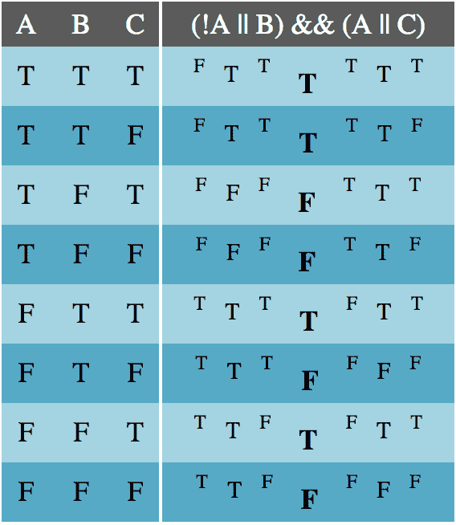*****

*****如上所述，产生相同真值表的表达式可以相互替换。*****

### *****替换规则*****

*****现在我将介绍几个我经常使用的替换规则的例子。下面没有真值表，但是你可以自己构建它们来证明这些规则是正确的。*****

#### *****双重否定*****

*****逻辑上，`A`和`!!A`是等价的。你总是可以删除一个双重否定或者给一个表达式添加一个双重否定而不改变它的真实性。当你想否定一个复杂表达式的一部分时，添加一个双重否定会很方便。这里需要注意的是，在 JavaScript 中,`!!`还会将一个值强制转换为布尔值，这可能是一个不希望的副作用。*****

> *****`A === !!A`*****

#### *****交换*****

*****任何析取(`||`)、连词(`&&`)或双条件(`===`)都可以交换其各部分的顺序。下面的几对*在逻辑上与*等价，但是可能会因为短路而改变程序的计算。*****

> *****`(A || B) === (B || A)`
> `(A && B) === (B && A)`
> *****

#### *****联合*****

*****析取和合取是二元运算，这意味着它们只对两个输入进行运算。虽然它们可以被编码成更长的链— `A || B || C || D` —但是它们从左到右是隐式关联的— `((A || B) || C) || D`。关联规则表明，这些分组发生的顺序对逻辑结果没有影响*。******

> *****`((A || B) || C) === (A || (B || C))`
> *****

#### *****分配*****

*****关联不适用于合取和析取。也就是`(A && (B || C)) !== ((A && B) || C)`。为了分离前面例子中的`B`和`C`，您必须*分配*连接词— `(A && B) || (A && C)`。这个过程也可以反过来进行。如果您发现一个复合表达式有重复的析取或合取，您可以取消分配它，类似于在一个代数表达式中分解出一个公因数。*****

> *****`(A && (B || C)) === ((A && B) || (A && C))`
> *****

*****分布的另一种常见情况是双重分布(类似于代数中的 FOIL):
1。`((A || B) && (C || D)) === ((A || B) && C) || ((A || B) && D)`
2。`((A || B) && C) || ((A || B) && D) ===`
`((A && C) || B && C)) || ((A && D) || (B && D))`*****

> *****`(A || B) && (C || D) === (A && C) || (B && C) || (A && D) || (B && D)`
> *****

#### *****实质蕴涵*****

*****隐含表达式(`A → B`)通常被翻译成代码`if (A) { B }`，但是如果一个复合表达式中有几个隐含，那就没什么用了。你最终会得到嵌套的`if`语句——一种代码味道。相反，我经常使用替换的实质性含义规则，它说`A → B`意味着要么`A`为假，要么`B`为真。*****

> *****`(A → B) === (!A || B)`*****

#### *****同义反复与矛盾*****

*****有时，在操作复合逻辑表达式的过程中，您将最终得到一个简单的合取或析取，它只涉及一个变量及其否定或一个布尔文字。在这些情况下，表达式要么总是真(同义反复)，要么总是假(矛盾)，可以用代码中的布尔文字替换。*****

> *****`*(A || !A) === true*`
> `*(A || true) === true*`
> `*(A && !A) === false*`*****

*****与这些等价关系相关的是与另一个布尔文字的析取和连接。这些可以简化为变量的真值。*****

> *****`*(A || false) === A*`
> *****

#### *****调换*****

*****当操作一个蕴涵(`A → B`)时，人们犯的一个常见错误是假设否定第一部分，`A`，隐含第二部分，`B`，也被否定——`!A → !B`。这被称为蕴涵的*逆*，它**不一定为真**。也就是说，具有原始含义并不能告诉我们相反的情况是否成立，因为`A`不是`B`的*必要条件*。(如果反过来也成立——出于独立的原因——那么`A`和`B`是双条件的。)*****

*****然而，从最初的暗示中我们可以知道,*逆命题*是真的。既然`B` *是`A`的一个必要条件*(从真值表中回想一下，如果`B`为真，`A`也一定为真)，我们就可以宣称`!B → !A`。*****

> *****`*(A → B) === (!B → !A)*`*****

#### *****材料等效性*****

******双条件*这个名字来源于它代表两个条件(蕴涵)语句:`A === B`表示`A → B` **和** `B → A`。`A`和`B`的真值相互锁定。这给了我们第一个材料等效规则:*****

> *****`*(A === B) === ((A → B) && (B → A))*`*****

*****使用实质性的暗示、双重分布、矛盾和交换，我们可以把这个新的表达式处理成更容易编码的东西:
1。`((A → B) && (B → A)) === ((!A || B) && (!B || A))`
2。`((!A || B) && (!B || A)) ===`
`((!A && !B) || (B && !B)) || ((!A && A) || (B && A))`
3。`((!A && !B) || (B && !B)) || ((!A && A) || (B && A)) ===`
`((!A && !B) || (B && A))`
4。`((!A && !B) || (B && A)) === ((A && B) || (!A && !B))`*****

> *****`*(A === B) === ((A && B) || (!A && !B))*`*****

#### *****出口*****

*****嵌套的`if`语句，尤其是如果没有`else`部分，是一种代码味道。一个简单的嵌套`if`语句可以简化为一个单独的语句，其中条件是前面两个条件的合取:*****

```
***`if (A) {  if (B) {    C  }}// is equivalent toif (A && B) {  C}`***
```

> *****`*(A → (B → C)) === ((A && B) → C)*`*****

#### *****德摩根定律*****

*****德摩根定律对于处理逻辑语句至关重要。它们告诉我们如何在合取或析取中分配否定。考虑一下表达式`!(A || B)`。德摩根定律说，当否定析取或合取时，否定每个陈述，并将`&&`改为`||`，反之亦然。因此`!(A || B)`与`!A && !B`相同。同理，`!(A && B)`相当于`!A || !B`。*****

> *****`*!(A || B) === !A && !B*`
> *****

#### *****三元(If-Then-Else)*****

*****三元语句(`A ? B : C`)在编程中经常出现，但它们并不完全是隐含的。从三元到形式逻辑的翻译，实际上是两个蕴涵的合取，`A → B`和`!A → C`，用实质蕴涵我们可以写成:`(!A || B) && (A || C)`。*****

> *****`*(A ? B : C) === (!A || B) && (A || C)*`*****

#### *****异或(异或)*****

*****异或，通常缩写为**异或**，意思是“一个或另一个，但不是两个”这与普通的*或*操作符的区别仅在于这两个值不能都为真。这就是我们在简单英语中使用“或”的意思。JavaScript 没有本地的 xor 操作符，那么我们该如何表示呢？
1。
2“A 或 B，但不能同时是 A 和 B”。`(A || B) && !(A && B)` *直接翻译*
3。`(A || B) && (!A || !B)` *德摩根定律*
4。`(!A || !B) && (A || B)` *交换性*
5。`A ? !B : B` *if-then-else 定义******

> *****`*A ? !B : B*`在 JavaScript 中是异或(xor)*****

*****或者，
1。
A 或 B，但不是 A 和 B 都是。`(A || B) && !(A && B)` *直接翻译*
3。`(A || B) && (!A || !B)` *德摩根定律*
4。`(A && !A) || (A && !B) || (B && !A) || (B && !B)` *双重分配*
5。`(A && !B) || (B && !A)` *矛盾置换*
6。`A === !B`或`A !== B` *材料等效******

> *****`*A === !B*` *或`A !== B`* 在 JavaScript 中是异或*****

### *****设置逻辑*****

*****到目前为止，我们一直在看关于包含两个(或几个)值的表达式的语句，但现在我们将把注意力转向值集。就像复合表达式中的逻辑运算符如何以可预测的方式保持真值一样，集合上的*谓词函数*以可预测的方式保持真值。*****

*****一个**谓词函数**是一个函数，它的输入是一个集合中的值，它的输出是一个布尔值。对于下面的代码示例，我将对一个集合和两个谓词函数使用一个数字数组:`isOdd = n => n % 2 !==`0；a`nd isEven = n => n % 2` = = = 0；。*****

#### *****通用语句*****

*******通用**语句适用于集合中的所有元素，这意味着它的谓词函数为每个元素返回 true。如果谓词为任何一个(或多个)元素返回 false，则通用语句为 false。`Array.prototype.every`接受一个谓词函数，仅当数组的每个元素都为谓词返回 true 时，才返回`true`。如果谓词返回 false，它也会提前终止(用`false`)，不再对数组的任何元素运行谓词，所以实际上*避免了谓词*中的副作用。*****

*****作为一个例子，考虑数组`[2, 4, 6, 8]`，以及通用语句“数组的每个元素都是偶数。”利用`isEven`和 JavaScript 内置的通用函数，我们可以运行`[2, 4, 6, 8].every(isEven)`，发现这是`true`。*****

> *****`*Array.prototype.every*`是 JavaScript 的通用语句*****

#### *****存在陈述*****

*****一个**存在性**语句对一个集合做出一个特定的声明:集合中至少有一个元素为谓词函数返回 true。如果谓词为集合中的每个元素返回 false，则存在语句为 false。*****

*****JavaScript 还提供了一个内置的存在语句:`Array.prototype.some`。与`every`类似，如果一个元素满足其谓词，`some`将提前返回(true)。例如，`[1, 3, 5].some(isOdd)`将只运行谓词`isOdd`(消费`1`并返回`true`)和返回`true`的一次迭代。`[1, 3, 5].some(isEven)`将返回`false`。*****

> *****`*Array.prototype.some*`是 JavaScript 的存在主义语句*****

#### *****普遍蕴涵*****

*****一旦你对一个集合检查了一个通用语句，比如说`nums.every(isOdd)`，很容易想到你可以从集合中抓取一个满足谓词的元素。然而，有一个问题:在布尔逻辑中，一个真正的通用语句**并不意味着**集合是非空的。关于空集的普遍陈述*总是正确的*，所以如果你想从满足某些条件的集合中抓取一个元素，使用存在检查来代替。为了证明这一点，运行`[].every(() => fal` se)。这将是真的。*****

> *****关于空集的普遍陈述是**永远正确** *。******

#### *****否定普遍性和存在性陈述*****

*****否认这些说法可能会令人惊讶。对一个普遍陈述的否定，比如说`nums.every(isOdd)`，不是`nums.every(isEven)`，而是`nums.some(isEven)`。这是一个否定了谓语的存在句。类似地，存在陈述的否定是谓词被否定的普遍陈述。*****

> *****`*!arr.every(el => fn(el)) === arr.some(el => !fn(el))*`
> `*!arr.some(el => fn(el)) === arr.every(el =&*`gt；！fn(el))*****

#### *****设置交叉点*****

*****就元素而言，两个集合只能以几种方式相互关联。这些关系很容易用文氏图来表示，并且可以(大部分)用代码结合普遍性和存在性陈述来确定。*****

*****两个集合可以共享一些但不是全部的元素，就像一个典型的*连体*维恩图:*****

*****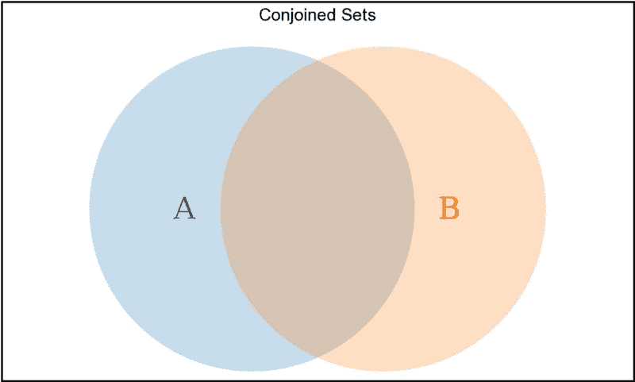*****

> *****udes(el))描述一对相连的集合*****

*****一个集合可以包含另一个集合的所有元素，但是有一些元素不能被第二个集合共享。这是**子集**关系，表示为`Subset ⊆ Superset`。*****

*****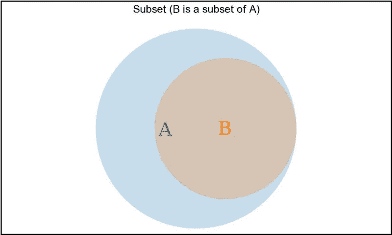*****

> *****`*B.every(el => A.includes(e*` l))描述了子集关系 B ⊆ A*****

*****这两个集合可以共享 **no** 元素。这些是*不相交的*集合。*****

*****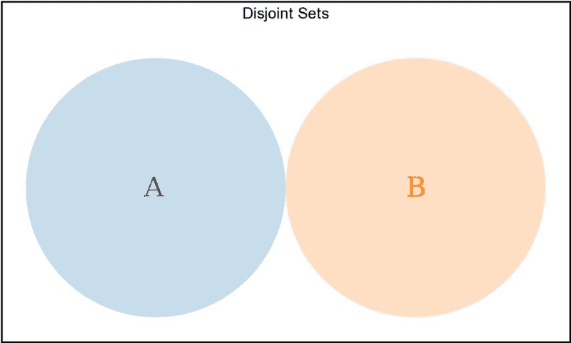*****

> *****描述一对不相交的集合*****

*****最后，这两个集合可以共享每个元素。也就是说，它们是彼此的子集。这些集合*等于*。在形式逻辑中，我们会写`A ⊆ B && B ⊆ A ⟷ A === B`，但是在 JavaScript 中，这就有些复杂了。在 JavaScript 中，一个`Array`是一个*有序的*集合，可能包含重复值，所以我们**不能**假设双向子集代码`B.every(el => A.includes(el)) && A.every(el => B.include` s(el))暗示 a `r`射线`A`和 B 是等式`l`。如果`A`和 B 是集合(意味着它们是由 `with new` Set()创建的)，那么它们的值是唯一的，我们可以对 s `ee if A` === B 进行双向子集检查。*****

*****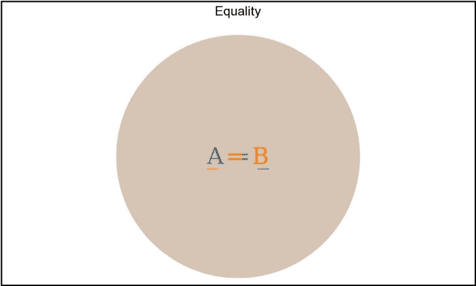*****

> *****`*(A === B) === (Array.from(A).every(el => Array.from(B).includes(el)) && Array.from(B).every(el => Array.from(A).include*` s(el))，给定即`*A*`和光秃秃构造的`*using new*`集合()*****

### *****将逻辑翻译成英语*****

*****这一节可能是文章中最有用的部分。在这里，现在你已经知道了逻辑运算符、它们的真值表和替换规则，你可以学习如何将一个英语短语翻译成代码并*简化*它。在学习这种翻译技巧的过程中，你也将能够更好地阅读代码，将复杂的逻辑储存在你头脑中的简单短语中。*****

*****下面是一个逻辑代码表(左)和它们的英文对等词(右)，大量借用了优秀的书籍，[](https://www.amazon.com/Essentials-Logic-Irving-Copi/dp/013238034X/ref=sr_1_1?ie=UTF8&qid=1531944915&sr=8-1&keywords=essentials+of+logic&selectObb=rent)**【逻辑精要】。*******

******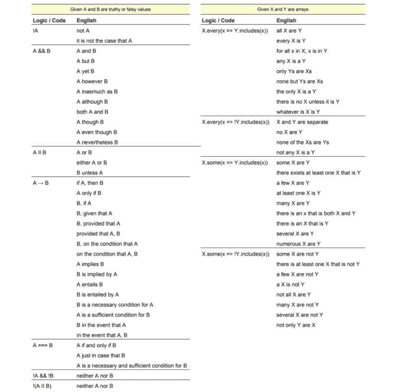

View a screen-readable version of this code-to-English translation chart [here](https://docs.google.com/spreadsheets/d/e/2PACX-1vTei2ttk-psZ1ynH74emvJVIoFu7qPpY6c1LdZHrv5qnTBqQorR-tOXrmRggcn8DvYAbv-Z0z0cNCSc/pubhtml?gid=0&single=true).****** 

******下面，我将介绍一些我自己工作中的真实例子，在这些例子中，我将英语翻译成代码，反之亦然，并使用替换规则简化代码。******

#### ******示例 1******

******最近，为了满足欧盟的 GDPR 要求，我必须创建一个模型来显示我公司的 cookie 策略，并允许用户设置他们的偏好。为了尽可能不引人注目，我们有以下要求(按优先顺序):******

1.  ******如果用户不在欧盟，**从不**显示 GDPR 偏好模式。******
2.  ******2.如果程序需要显示模式(如果用户操作需要比当前允许的更多的权限)，显示模式。******
3.  ******如果允许用户使用不太显眼的 GDPR *横幅*，则不要显示模态。******
4.  ******如果用户已经**而不是**设置了他们的偏好(讽刺的是保存在 cookie 中)，显示模态。******

******我从一系列直接模仿这些需求的`if`语句开始:******

```
****`const isGdprPreferencesModalOpen = ({  shouldModalBeOpen,  hasCookie,  hasGdprBanner,  needsPermissions}) => {  if (!needsPermissions) {    return false;  }  if (shouldModalBeOpen) {    return true;  }  if (hasGdprBanner) {    return false;  }  if (!hasCookie) {    return true;  }  return false;}`****
```

******明确地说，上面的代码是可行的，但是[返回布尔文字是一种代码味道](https://medium.com/@ntgard/returning-boolean-literals-is-a-code-smell-7a39531d6b60)。所以我经历了以下步骤:******

```
****`/* change to a single return, if-else-if structure */let result;if (!needsPermissions) {  result = false;} else if (shouldBeOpen) {  result = true;} else if (hasBanner) {  result = false;} else if (!hasCookie) {  result = true} else {  result = false;}return result;`****
```

```
****`/* use the definition of ternary to convert to a single return */return !needsPermissions ? false : (shouldBeOpen ? true : (hasBanner ? false : (!hasCookie ? true : false)))`****
```

```
****`/* convert from ternaries to conjunctions of disjunctions */return (!!needsPermissions || false) && (!needsPermissions || ((!shouldBeOpen || true) && (shouldBeOpen || ((!hasBanner || false) && (hasBanner || !hasCookie))))`****
```

```
****`/* simplify double-negations and conjunctions/disjunctions with boolean literals */return needsPermissions && (!needsPermissions || ((!shouldBeOpen || true) && (shouldBeOpen || (!hasBanner && (hasBanner || !hasCookie))))`****
```

```
****`/* DeMorgan's Laws */return needsPermissions && (!needsPermissions || ((!shouldBeOpen || true) && (shouldBeOpen || ((!hasBanner && hasBanner) || (hasBanner && !hasCookie))))`****
```

```
****`/* eliminate tautologies and contradictions, simplify */return needsPermissions && (!needsPermissions || (shouldBeOpen || (hasBanner && !hasCookie)))`****
```

```
****`/* DeMorgan's Laws */return (needsPermissions && !needsPermissions) || (needsPermissions && (shouldBeOpen || (hasBanner && !hasCookie)))`****
```

```
****`/* eliminate contradiction, simplify */return needsPermissions && (shouldBeOpen || (hasBanner && !hasCookie))`****
```

******我最终得到了一些我认为更优雅且可读性更好的东西:******

```
****`const isGdprPreferencesModalOpen = ({  needsPermissions,  shouldBeOpen,  hasBanner,  hasCookie,}) => (  needsPermissions && (shouldBeOpen || (!hasBanner && !hasCookie)));`****
```

#### ******示例 2******

******在更新一个组件时，我发现了以下代码(由同事编写)。我再次感到消除布尔文字返回的冲动，所以我重构了它。******

```
****`const isButtonDisabled = (isRequestInFlight, state) => {  if (isRequestInFlight) {    return true;  }  if (enabledStates.includes(state)) {    return false;  }  return true;};`****
```

******有时，我会在脑海中或草稿纸上完成以下步骤，但大多数情况下，我会在代码中编写下一步，然后删除上一步。******

```
****`// convert to if-else-if structurelet result;if (isRequestInFlight) {  result = true;} else if (enabledStates.includes(state)) {  result = false;} else {  result = true;}return result;`****
```

```
****`// convert to ternaryreturn isRequestInFlight  ? true  : enabledStates.includes(state)    ? false    : true;`****
```

```
****`/* convert from ternary to conjunction of disjunctions */return (!isRequestInFlight || true) && (isRequestInFlight || ((!enabledStates.includes(state) || false) && (enabledStates.includes(state) || true))`****
```

```
****`/* remove tautologies and contradictions, simplify */return isRequestInFlight || !enabledStates.includes(state)`****
```

******然后我以这样的话结束:******

```
****`const isButtonDisabled = (isRequestInFlight, state) => (  isRequestInFlight || !enabledStates.includes(state));`****
```

******在这个例子中，我没有从英语短语开始，也没有在进行操作时费心将代码翻译成英语，但是现在，在最后，我可以很容易地翻译成这样:“如果请求正在进行或者状态不在启用状态集内，则按钮被禁用。”有道理。如果你曾经把你的工作翻译回英文，而它*不*有意义，重新检查你的工作。这经常发生在我身上。******

#### ******示例 3******

******在为我的公司编写 A/B 测试框架时，我们有两个启用和禁用实验的主列表，我们想检查每个实验的*(每个实验都是文件夹中的一个单独文件)是否记录在一个或另一个列表**中，而不是两个列表**。这意味着启用和禁用的集合是*分离的*，并且所有实验的集合是两个实验集合的合集的子集。所有实验的集合必须是两个列表组合的子集的原因是不应该有一个实验存在于两个列表之外。*******

```
***`const isDisjoint = !enabled.some(el => disabled.includes(el)) &&   !disabled.some(el => enabled.includes(el));const isSubset = allExperiments.every(  el => enabled.concat(disabled).includes(el));assert(isDisjoint && isSubset);`***
```

### *****结论*****

*****希望这些对你有所帮助。不仅英语和代码之间的翻译技巧很有用，而且讨论不同关系的术语(如连接词和含义)和评估它们的工具(真值表)也很方便。*****