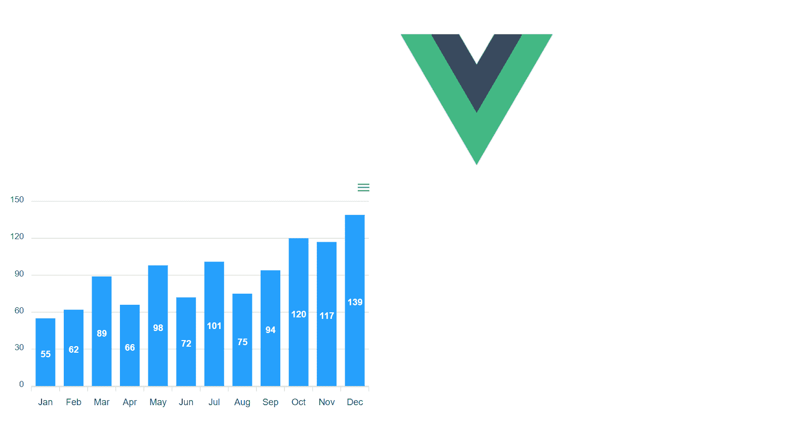
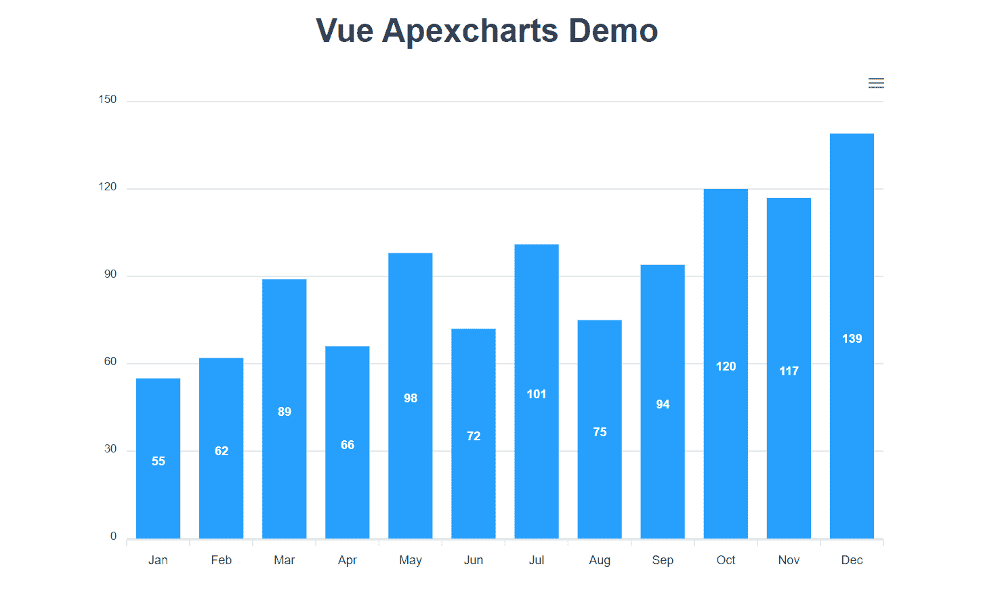
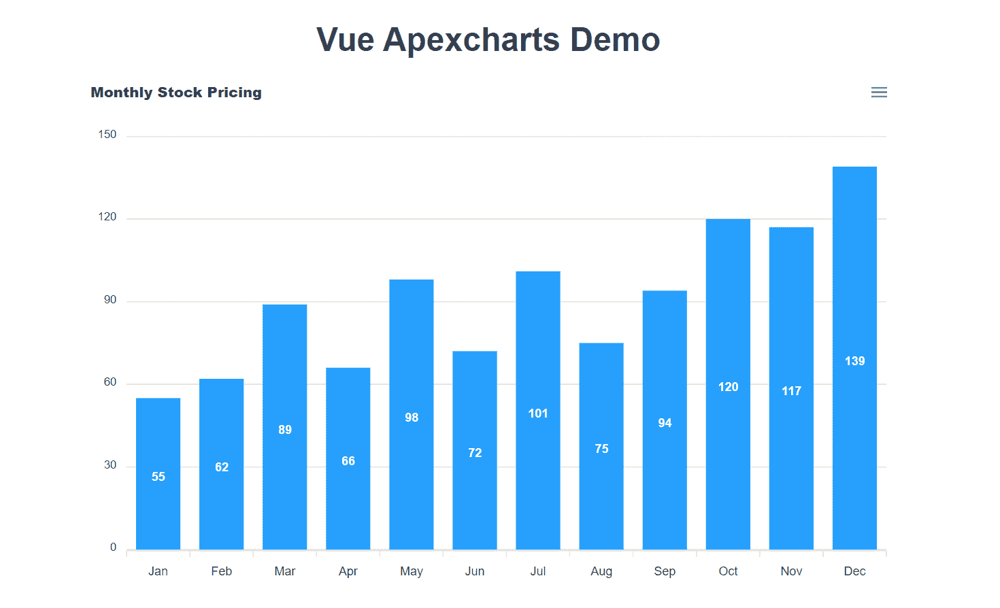
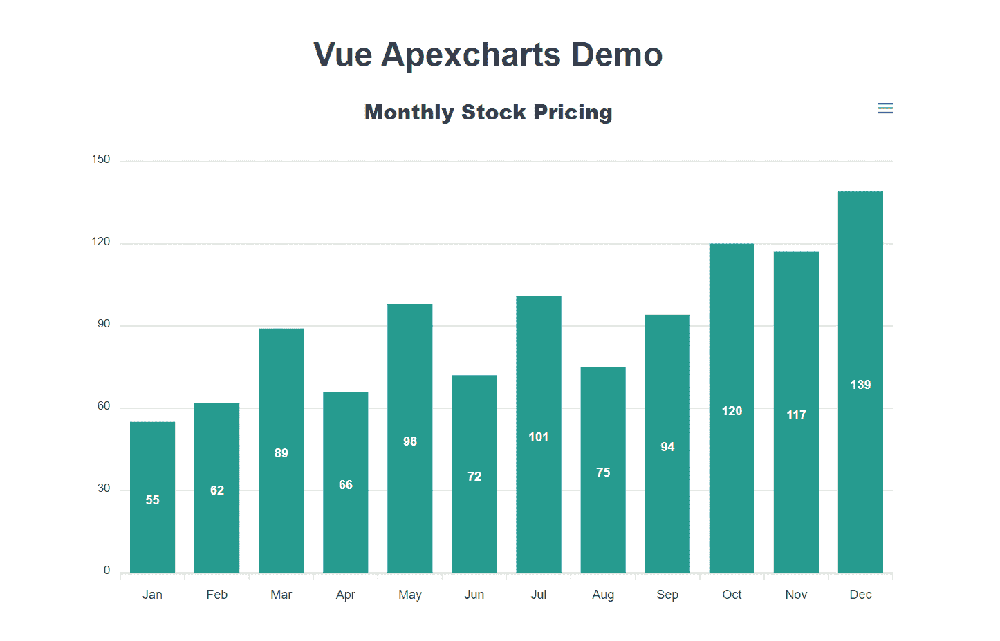
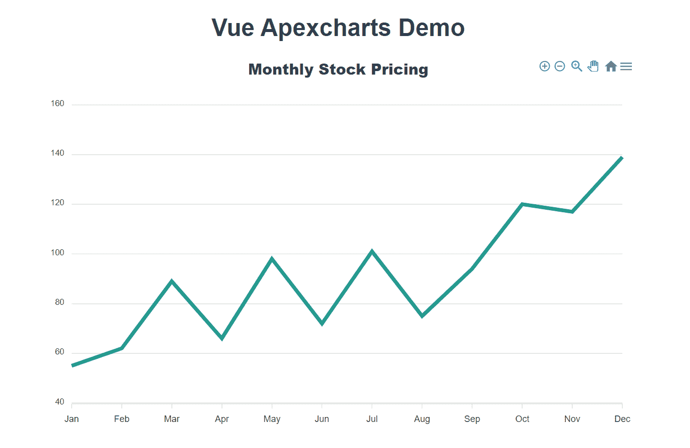

# 如何将 ApexCharts 与 Vue.js 集成–详细指南

> 原文：<https://www.freecodecamp.org/news/a-detailed-guide-to-integrating-apexcharts-with-vuejs/>

图表和图形是向应用程序用户显示信息/数据的绝佳方式。在本文中，我将向您展示如何使用 vue-apexcharts 实现这一点。

## 入门指南

使用 Vue CLI，我们可以轻松创建一个启动应用程序。首先，我们需要用下面的命令安装 Vue CLI。如果您已经安装了它，您可以跳过它。

注意:为了使用 CLI，您需要安装版本 8 或更高版本的 [Node.js](https://nodejs.org/) (推荐 8.10.0+)。

要安装 CLI，请在终端中运行以下命令:

```
npm install @vue/cli
```

现在我们可以用它来创建我们的项目。我们将使用以下命令创建项目:

```
vue create vue-apexcharts-demo
```

然后，系统会提示我们选择默认预设或手动选择功能。选择`**default**`。

将创建一个新的项目目录，您可以使用以下命令导航到该目录:

```
cd vue-apexcharts-demo
```

## 安装 Apexcharts

在我们继续之前，您可能想知道…

**什么是 apexcharts？！**

ApexCharts 是一个现代图表库，帮助开发人员为网页创建漂亮的交互式可视化效果。你可以在这里观看他们的演示。

我们可以通过集成 Vue 的包装组件 **vue-apexcharts** ，轻松地将 ApexCharts 用于我们的 Vue 应用程序。

要在我们的应用程序中安装 vue-apexcharts 组件，请使用以下命令:

```
npm install --save apexcharts 
npm install --save vue-apexcharts
```

## 配置 vue-apexcharts

现在我们已经安装了 vue-apexcharts，我们需要在我们的应用程序中安装它。打开`src`目录并创建一个名为`plugins`的新目录。在新插件目录中创建一个名为`apexcharts.js`的文件。

接下来，我们将在`apexcharts.js`中为 apexcharts 创建一个 Vue 组件。这将使组件在我们的应用程序中全局可用。

为此，我们将同时导入 Vue 和 vue-apexcharts。接下来，我们将创建一个名为`apexchart`的全局组件。您的`apexcharts.js`文件应该是这样的:

```
import Vue from 'vue'
import VueApexCharts from 'vue-apexcharts'

Vue.component('apexchart', VueApexCharts)
```

## 导入我们的插件文件

我们必须让 Vue 知道我们刚刚创建的文件。为此，我们将其导入到`main.js`文件中。打开 main.js 文件，在最后一条 import 语句后添加以下行:

```
import '@/plugins/apexcharts'
```

现在我们准备创建我们的第一个图表。

## 创建我们的第一个图表

我们将在 HelloWorld 组件中创建图表。这个组件是在我们使用 Vue CLI 创建应用程序时自动创建的。

打开文件`HelloWorld.vue`并删除那里的所有演示代码。

您的文件应该如下所示:

```
<template>
</template>
<script>  
export default {
 name: 'HelloWorld'
}
</script>
<style scoped>
</style>
```

还记得在我们的插件中，我们称我们的组件为`apexchart`。

Vue-Apexcharts 通过使用 props 传递给它的数据来构建图表，如下面的代码所示。我们将使用它为我们的第一个图表创建 HTML。在第一个例子中，我们将从一个非常基本的条形图开始。

```
<template>
  <div>
   <apexchart 
     width="500" type="bar" 
     :options="options" :series="series">
   </apexchart>  
  </div>
</template>
```

正如你在上面的模板中看到的,`apexchart`组件拥有 4 个道具。现在，让我们跳到剧本部分。

```
<script>
export default {
  name: 'HelloWorld',
  data: () => ({
    options: {
      chart: {
        id: 'vuechart-example'
      },
      xaxis: {
        categories: [
         "Jan",
         "Feb",
         "Mar",
         "Apr",
         "May",
         "Jun",
         "Jul",
         "Aug",
         "Sep",
         "Oct",
         "Nov",
         "Dec"
        ]
      }
    },
    series: [{
      name: 'series-1',
      data: [55, 62, 89, 66, 98, 72, 101, 75, 94, 120, 117, 139]
    }]
  })
}
</script>
```

## 解释图表数据

我们的条形图包含一个虚构组织的月度股票价格。我们的条形图中有 12 个数据点。每个月将显示在图表的 x 轴上。他们的定价显示在图表的 y 轴上。

为了提供将在条形图中显示的数据，我们将添加一个系列数组。系列是对象的数组。每个对象都定义了要创建的图表的类型，并将有一个值的数据数组绘制在图表上。

您可以使用以下命令启动服务器:

```
npm run serve
```

现在，打开浏览器到 localhost:8080，您应该会看到您的图表:



### 设计我们的图表

我们可以把图表放在这一页的中间。为此，我将在我们的 div 中添加一个类`chart-wrapper`。我还想将图表的宽度增加到 800 像素。我的模板现在看起来像这样:

```
<template>
  <div class="chart-wrapper">
    <apexchart 
      width="800" type="bar" 
      :options="options" :series="series">
    </apexchart>
</div>
</template>
```

接下来，让我们给新的`chart-wrapper`类添加一些样式，将我们的图表放在页面的中央。以下是我添加的样式:

```
<style scoped>
div.chart-wrapper {
  display: flex;
  align-items: center;
  justify-content: center
}
</style>
```

当我们添加样式时，我想用标题替换 Vue 徽标。打开 App.vue 文件。删除标签，替换为:

```
<h1>Vue Apexcharts Demo</h1>
```

我们的图表现在看起来像这样:



### 添加标题和更改图表颜色

我们可以在条形图上添加一个标题，以增加更多的上下文和对图表内容的解释。

要向我们的条形图添加标题，请返回到 HelloWorld.vue 组件并向`options`对象添加标题。

```
options: {
      chart: {
        id: 'vuechart-example'
      },
      xaxis: {
        categories: [
         "Jan",
         "Feb",
         "Mar",
         "Apr",
         "May",
         "Jun",
         "Jul",
         "Aug",
         "Sep",
         "Oct",
         "Nov",
         "Dec"
        ]
      },
      title: {
        text: 'Monthly Stock Pricing'
      }
 },
 series: [{
   name: 'series-1',
   data: [55, 62, 89, 66, 98, 72, 101, 75, 94, 120, 117, 139]
 }]
```

默认情况下，标题位于条形图的左侧。这是我们的图表现在的样子:



让我们通过添加自定义样式来改变默认行为。我希望标题有一个更大的字体大小，并居中。标题对象有一个名为`align`的属性，它代表水平面。我希望标题以此为中心。为了让标题有更大的字体，我们需要添加一个`style`选项。

此外，我们可以将条形图设置为不同的颜色。下面是`options`现在的样子:

```
options: {
      chart: {
        id: 'vuechart-example'
      },
      xaxis: {
        categories: [
         "Jan",
         "Feb",
         "Mar",
         "Apr",
         "May",
         "Jun",
         "Jul",
         "Aug",
         "Sep",
         "Oct",
         "Nov",
         "Dec"
        ]
      },
      title: {
        text: 'Monthly Stock Pricing',
        align: 'center',
        style: {
          fontSize:  '20px',
        },
      },
      colors: ['#00897b']
 },
 series: [{
   name: 'series-1',
   data: [55, 62, 89, 66, 98, 72, 101, 75, 94, 120, 117, 139]
 }]
```

这是条形图现在的样子:



Final version of our bar chart

### 创建折线图

首先，我们需要创建一个新的图表包装器 div 和一个新的 apexchart 元素。新的 apexchart 元素将像前面的示例一样保存道具。但是这里有趣的事情是你需要做的就是将模板中的道具`type`改为`line`。

下面是我的 HTML 代码现在的样子:

```
<template>
  <div>  
    <div class="chart-wrapper">
      <apexchart 
        width="800" type="bar" 
        :options="options" :series="series">
      </apexchart>
    </div>
    <hr>
    <div class="chart-wrapper">
      <apexchart 
        width="800" type="line" 
        :options="options" :series="series">
      </apexchart>
    </div>
  </div>
</template>
```

我们现在有了这个线图:



Line chart

## Apexcharts 文档

除了条形图和折线图，Apexcharts 有不同的图表类型可供选择。它们还有各种选项，您可以将它们添加到图表中。例如，您可以添加图例或标记以及工具提示。

如果你想了解其他可用的图表类型和选项，你可以阅读它们的文档[这里](https://apexcharts.com/docs/installation/)

### 被卖方收回的汽车

你可以在[我的 github 账户](https://github.com/Seybel/vue-apexcharts-demo)中找到这篇文章的代码。

## 结论

图表帮助我们可视化数据，并帮助用户查看数据并与之交互。将 ApexCharts 集成到您的 Vue 应用程序中就像您在上面看到的一样简单。

欢迎反馈！如果你觉得这篇文章有帮助，请分享。

感谢阅读！