# 面向非设计人员的网站设计开发指南

> 原文：<https://www.freecodecamp.org/news/a-developers-guide-to-web-design-for-non-designers-1f64ce28c38d/>

我 14 岁时创建了我的第一个网站，作为学校的一个项目。任务很简单:创建一个非常基本的网站，包括一些文本、图像和表格。我通常对学校项目的态度是完全忘记它们，然后在最后一刻想出一些解决方案。但是，这一次，我疯了。

自从我的第一个网站，我总是优先考虑让东西看起来不错。不管承认与否，人们根据外表来判断事物。如果你做的东西看起来不错，就像你知道自己在做什么，人们会更信任它。事情就是这样。

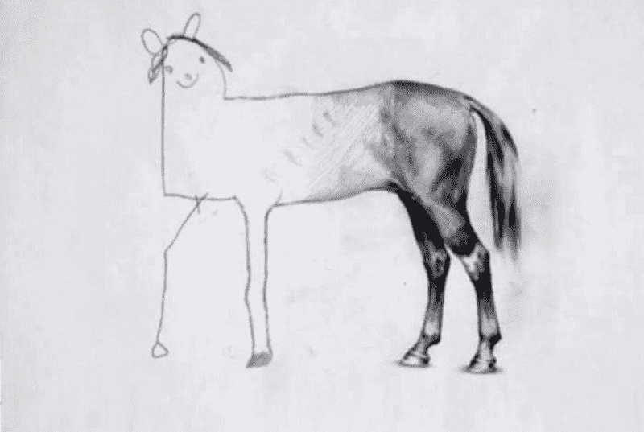

在做兼职项目的这些年里，我越来越多地将注意力转移到发展我的设计技能上，而不仅仅是完善我的编程。你看，作为一个写算法的怪物，你只能做到这一步。在追求启动一个有利可图的副业的梦想时，你将不得不做许多不同的工作。做设计师就是其中之一。就像交叉健身运动员一样，单飞创始人必须全面发展才能表现出色。

一个优秀的设计不一定是票数最多的设计。它是你首先不会注意到的。这是“你奶奶能做到”和“哇，真他妈好”之间的完美平衡。设计可以是你的竞争优势，也可以是棺材上的钉子。

### 这不是天赋的问题

我年轻的时候，经常演奏《我的世界》的作品。我看到了人们建造的这些令人敬畏的建筑。但是当我做东西的时候，它看起来像一个盒子。又丑又没格调。你怎么能在《我的世界》做出好东西呢，对吧？

所以，我在 YouTube 上找到一个人，做了一个和他一模一样的复制品。几个星期后，我形成了自己的风格，可以自己动手了。突然间，我的作品看起来不像垃圾了。见鬼，我甚至赢了建筑比赛。

设计是一种技能，和其他技能一样，它是可以学习的。

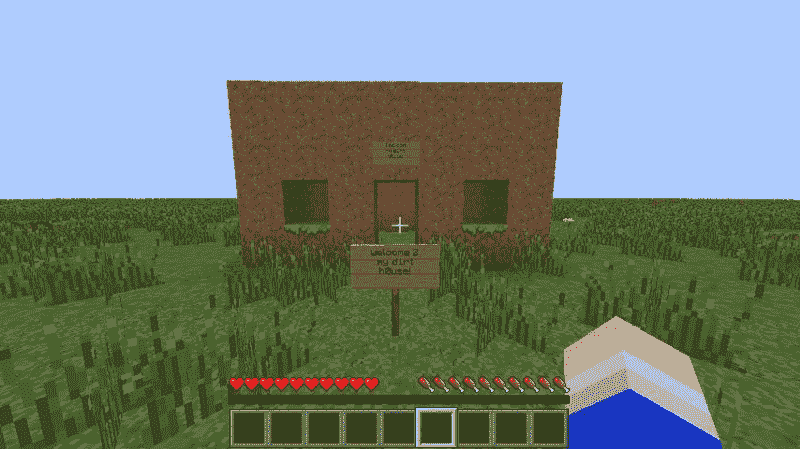

#### 为工作选择合适的工具

在编程中，你可以使用记事本，编写一个如同在成熟的 IDE 中编写的应用程序一样好的应用程序…尽管这样做你的生活可能会很悲惨，并且可能会花费明显更长的时间。在网页设计的世界里，MS Paint 将扮演记事本的角色，就像记事本一样，很少有人选择用它来设计……我希望如此。

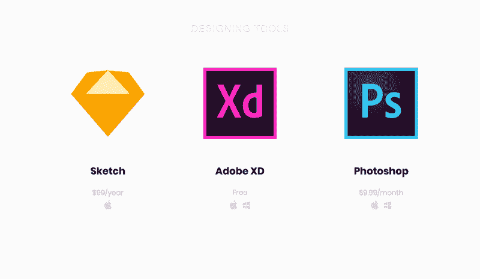

#### **最流行的网页设计工具是:**

*   [Sketch](https://www.sketchapp.com/) ，一个 MacOS 专用工具，类似 React，似乎硬编码在每个工作列表中。99 美元/年。
*   Adobe XD 是一款免费使用的跨平台工具，扮演了 Vue 的角色。它的社区较小，但很容易上手。
*   [Adobe Photoshop](https://www.adobe.com/products/photoshop.html) ，人人皆知的任何设计任务的瑞士刀。它取代了…你猜对了，jQuery。9.99 美元/月。

用 Sublime 还是 VS 代码写 app 几乎没有区别。或者是用 React 还是 Vue 做前端。只是喜好问题。设计工具也是如此，因为每种工具都有其优点和缺点。

我用的是 Adobe XD。对我来说最主要的原因是它是跨平台的，所以我不会被苹果生态系统挟持。它也是由 Adobe 支持的，所以它会在这里呆一段时间。对新手来说最好的事情是，自 2018 年 5 月起，Adobe XD 可以免费使用，只有一些限制(反正你不太可能偶然发现)。

### 调整你的心态

对我来说，进入网页设计世界最大的挑战是调整我的心态。我习惯于在编写网站代码时提出设计方案。一切都有秩序。流向是从左到右，从上到下。事实是，这种方法让你成为一个糟糕的设计师。

设计工具是混乱的，因为它们迫使你像每个元素都绝对定位一样进行设计。拥抱这种改变。它会给你快速改变事物的自由，让实验变得容易。这很重要，因为设计是一个持续的过程。在你得到一个好的结果之前，预计你将会改变很多事情。

### 学习工具

编码时，使用 HTML 元素，如 div、spans 和 inputs，并让浏览器将它们呈现为可视化的东西。有了设计工具，你可以跳过中间人，直接使用图形和文本等视觉元素。

我挑选了 4 个最常用的设计工具，这样你可以花更少的时间学习，花更多的时间设计。这样你就可以尽快开始练习了。下面，我将向您展示它们的工作原理和使用方法。

#### 矩形工具

矩形是最普遍的形状。你会发现自己一直在使用它们。把它想象成一个 div。它对各种东西都有用，从创建文本输入到容器。

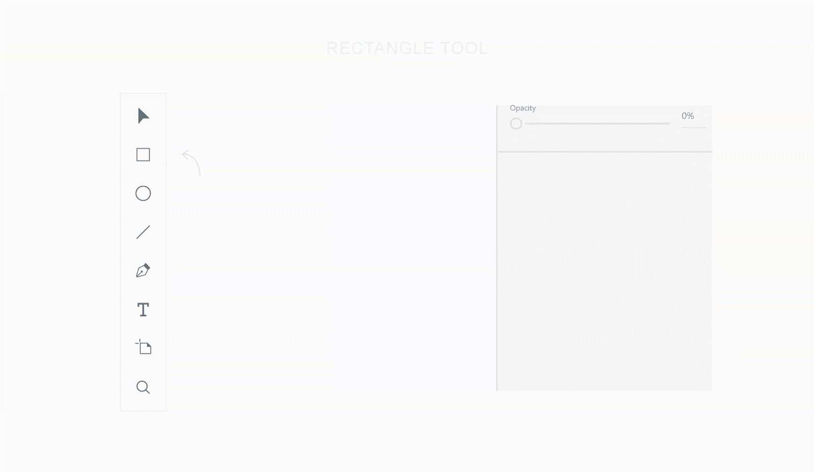

#### 文本工具(标签)

文本工具，顾名思义，允许你创建文本。但这并不简单，因为文本工具有两种状态:一种用于单行文本，另一种用于多段文本。幸运的是，它们非常容易学会正确使用。

第一种状态是单行文本容器，根据文本大小调整其大小。它类似于,除了它不会换行，除非你换行。这种状态的好处是它会根据行高和字体大小自动调整文本框的大小。

要创建它，你只需点击文本工具选择和写作。根据经验，对于不需要特定宽度并且是单行的任何内容，请使用此状态。例如，单行标题和标签。

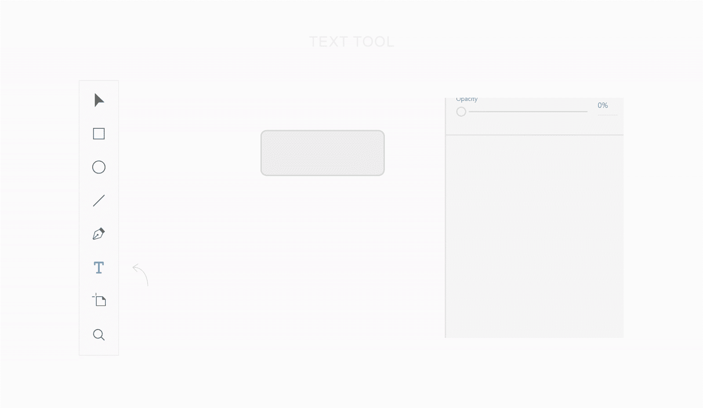

#### 文本工具(段落)

第二种状态是具有特定大小的文本容器，其行为类似于具有特定宽度的

或网格列中的

。这种状态的好处是您可以控制文本框的大小。要创建段落，请在选中文本工具的情况下单击并按住以创建选区。根据经验，对于多行的段落和标题使用这种状态。

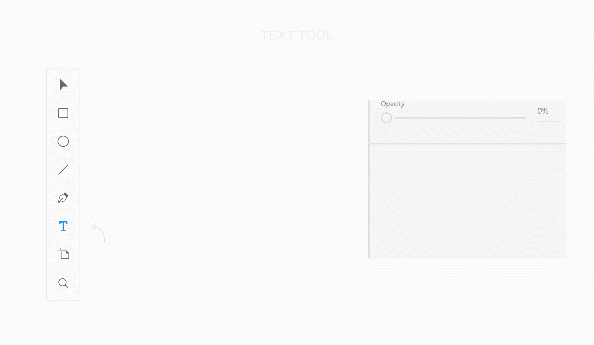

#### 选择工具

移动，调整大小，复制。这是实现这一目标的工具。那些粉红色的线显示了与周围元素的距离。蓝线帮助您将元素正确对齐。

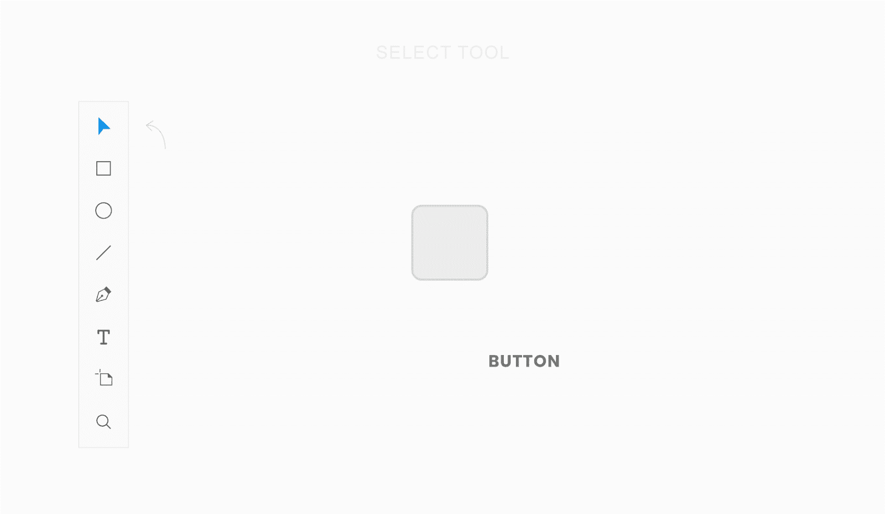

#### 线条工具

有时候，线条可以很方便地将设计的各个部分分开。这就是线条工具在这里的原因。从技术上讲，您可以使用矩形工具来代替，但是，嘿，所以 div 可以用于任何东西。

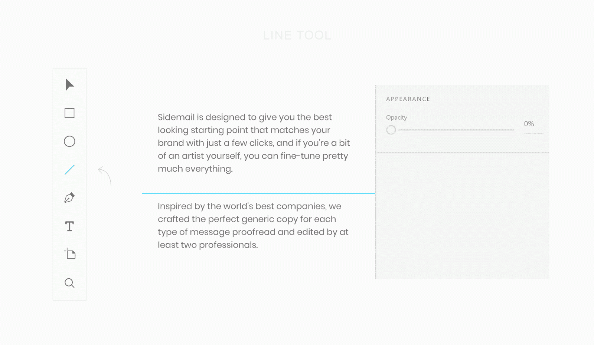

### 设计技巧和技术

#### 布局

在 web 开发中，布局通常被描述为页眉、菜单、内容和页脚。这是一部分，但布局不仅仅是一部分。这就是所有元素的布局方式。

例如，当我为 [Sidemail](https://sidemail.io/) 设计项目信息时，我将元素均匀地分布在卡片内部，这使它感觉更完整，看起来更整洁。

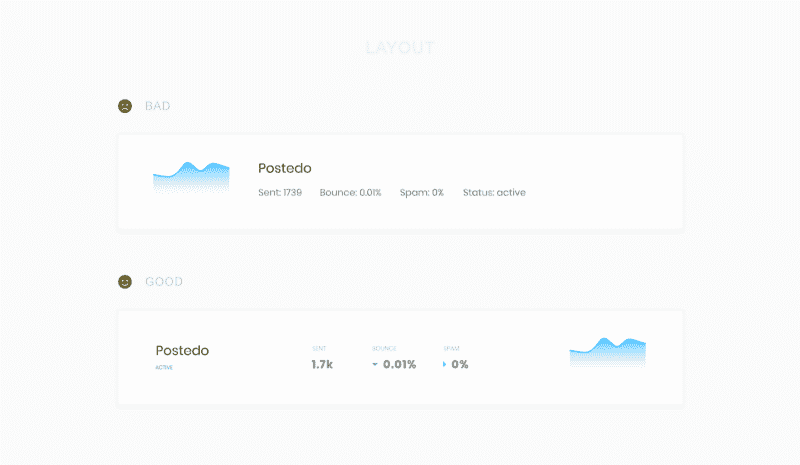

#### 颜色；色彩；色调

为了帮助你为下一个项目找到最完美的颜色，请考虑牢记色彩心理学([colorpsychology.org](https://www.colorpsychology.org/))。根据你的原色找到完美颜色组合的一个有用工具是[调色板按钮](http://paletton.com)。

使用原色和文本颜色的阴影来创建视觉层次。使用彩色背景时，尝试使用较深或较浅的颜色。

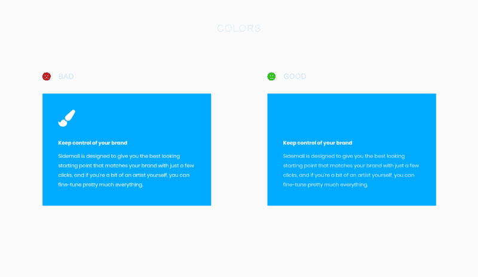

#### 排印

字体在很大程度上影响你的项目的品牌，所以要明智地选择。高级字体往往比谷歌字体好看，但当你刚开始时，不要买。即使在谷歌字体上，也有一些隐藏的宝石。

我经常使用的一个技巧是用更大的字母间距使标签大写。大写文本是对称的，从视觉角度看很好，但不要过度使用，因为它很难阅读。

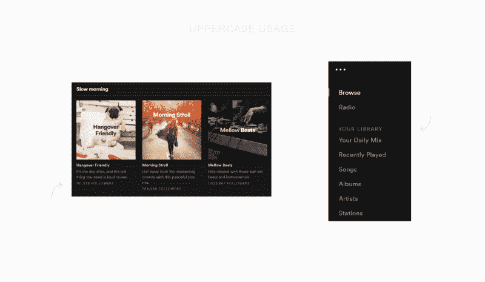

### 设计主页(或登录页面)

我总是试图避免设计时尚元素的诱惑，然后将我的信息塞进去。相反，我想出好处(而不是特性)，把它们放入一个故事中，并通过一个视觉上吸引人的页面来讲述这个故事。

在我确立了我想说的话之后，我通常会寻找一些灵感。一个很好的资源是 land-book.com，这是一个巨大的目录，里面有很多好看的登陆页面，人们可以在上面投票。另一个很棒的设计灵感页面是 [interfaces.pro](https://interfaces.pro/) ，在这里你可以按类别过滤，比如定价、404 或关于我们。我只是浏览，直到我找到足够多的网站，我喜欢和匹配我想要的风格。

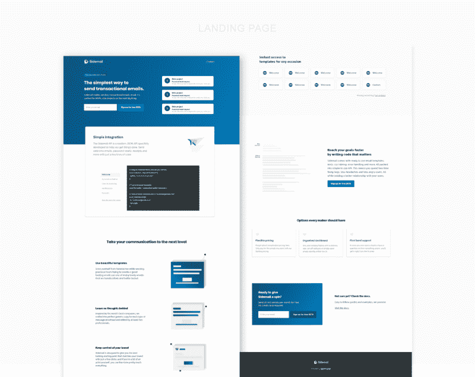

困难的部分是把所有的放在一起。不幸的是，没有捷径。你只需要重复很多次，直到得到你满意的结果。

你可能会发现自己在想，一周前你完全满意的设计今天突然感觉不够好，甚至很丑，这正常吗？答案是，这完全正常，实际上是一件好事。本质上是因为你成长了，学习了，变得更好了。昨天的挑战今天没有那么有挑战性了。记住这一点，这样你就不会陷入激烈的竞争中。

#### takealways:

*   独特的字体产生巨大的差异
*   图形是非常重要的，尽量使用至少一些插图或图像
*   通过使用多种色调获得视觉上的重要性。文字和原色是不够的。
*   不要使用太宽的容器——大约 1100 像素就足够宽了
*   拥抱负面空间
*   谈论好处，而不是功能
*   如果你陷入困境，四处寻找灵感

### 设计 web 应用程序(或仪表板)

就像设计登陆页面一样，不要直接投入设计。这一次，你不是想讲故事。相反，目标是易用性。拿起纸和笔，计划你的应用程序应该如何工作，什么应该依赖于什么，以及如何轻松导航。

如有必要，画一些草图或线框。做一个适当的竞争对手设计检查，看看自己有什么不足，可以做得更好，甚至可能变成一个竞争优势。有时候，在纸上做计划、做设计之前，最好先休息一下。

我能给出的最好的建议是选择一个合适的页面布局，而不是特定的用例。一般来说，所有的 web 应用程序都根据应用程序的用途使用两种不同的页面布局:固定宽度容器或充满整个屏幕的流体容器。

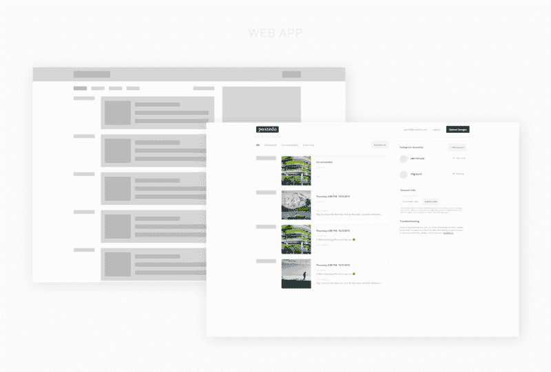

#### 固定集装箱

我更喜欢固定的容器，因为它更容易聚焦在一个狭窄的区域，因为它可以防止不必要的眼球运动。固定容器应用程序看起来也更整洁，对新用户来说也不那么令人难以招架。然而，由于宽度较小，固定容器应用程序更难设计。

例子: [Twitter](https://twitter.com/) ， [Buffer](https://buffer.com) ， [DigitalOcean](https://www.digitalocean.com/) ， [Netlify](https://www.netlify.com/) ， [GitHub](https://github.com/)

#### 液体容器

Fluid container 应用程序非常适合聊天应用程序、电子表格应用程序和其他需要在屏幕上显示更多内容的应用程序。但是请注意，屏幕上的大量数据可能会让人不知所措。

例子: [Slack](https://slack.com/) ，[对讲机](https://www.intercom.com/)， [Hotjar](https://www.hotjar.com/) ， [Google Sheets](https://docs.google.com/spreadsheets) ， [Trello](https://trello.com) ， [Spotify](https://open.spotify.com/)

选择正确的容器很重要，因为您的整个页面布局将依赖于它，并且以后更改它需要大量的工作。每个项目都是独特的，需要独特的解决方案，所以不要害怕尝试！

#### **外卖:**

*   保持简单
*   使用易读的字体
*   显示大量数据时使用可视化层次结构
*   利用竞争对手糟糕的设计选择

### 包扎

记住，设计可以成为你的竞争优势——所以利用它，做出令人敬畏的东西。

通过[获取我为最新项目的登陆页面制作的 Adobe XD 模板](https://hosted.sidemail.io/5d03f67a4e7f1600fda5ae11)开始你的设计之旅。只需[订阅我全新的电子邮件列表](https://hosted.sidemail.io/5d03f67a4e7f1600fda5ae11)，它就会进入你的邮箱。

此外，你会是第一个得到我下一篇文章通知的人，在那里我将分享我在 [Sidemail](https://sidemail.io/) 上 69 天的进展，这是我参与的一个 SaaS 项目。它将包括像订户数量，网站访问，支出和设计草案。不言而喻，但我保证绝对没有垃圾邮件。我没时间听这些废话。

*我的 Twitter DMs 是开放的，所以如果你在制作你的设计时遇到困难或者有其他问题，[请随时联系我](https://twitter.com/pkrupar)。*