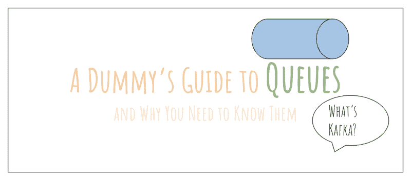
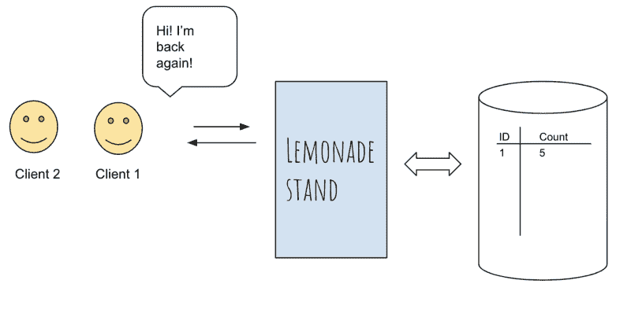
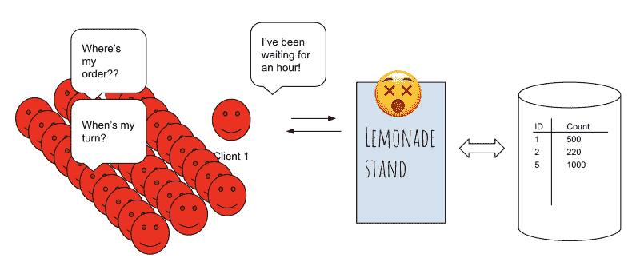
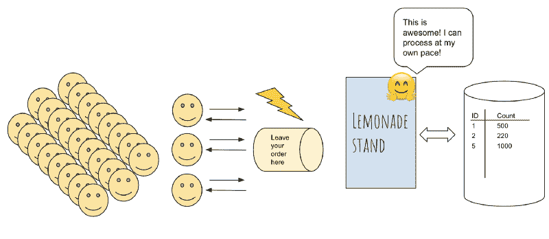
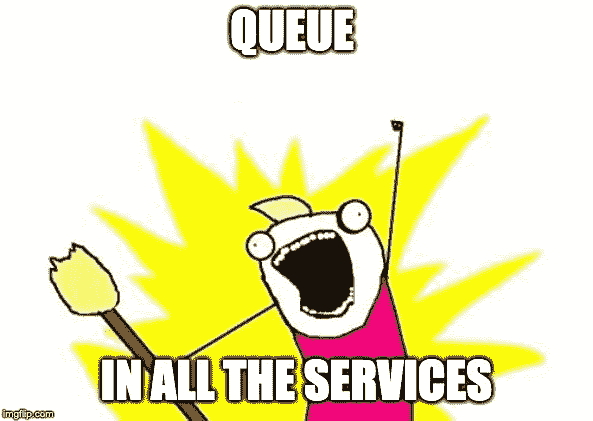

# 分布式队列的虚拟指南

> 原文：<https://www.freecodecamp.org/news/a-dummys-guide-to-distributed-queues-2cd358d83780/>

作者:阿智·华创

# 分布式队列的虚拟指南

如果你想知道卡夫卡、苍鹭、实时流媒体、SQS 或 RabbitMQ 是什么，那么这篇文章就是为你准备的。我将详细讨论为什么我们今天的现代软件架构需要一个队列，使用的一些常用技术是什么，以及队列在行业中是如何常用的。如果你喜欢这篇文章，我在[有一个关于扩展分布式系统的课程](https://docs.google.com/document/d/1PeK69h4H82rwKjhactiE_sAIorCcZgXgXTY7k-nXpnE/edit#heading=h.hs0b333nsxch)，在那里我会更详细地讨论这些话题。

好了，我们开始吧！

A Dummy’s Guide to Queues

### 首先，为什么需要队列/消息代理？

#### 排队拯救柠檬水摊的故事

想象你正在经营一家柠檬水店。站，你就开发了一个漂亮的小网络应用程序，它可以跟踪你的客户多久回到你的柠檬水站一次。

你的网络应用有一个端点，比如说*yourlemonade.com/traffic,*，每当你点击一个按钮，流量就会增加 1。太美了。

随着你柠檬水摊的流量增加，你越来越多地点击这个按钮。因为你住在一个相对较小的社区，每天只有 10-20 人。你的销售照常进行，网络应用处理流量很好，一切都很好。完美。

Your lemonade stand web-app

#### 生意兴隆的噩梦

现在你的柠檬水摊已经出了名，整个城市的人都蜂拥而来品尝你著名的柠檬水。而在一个美好的周日早晨，当地新闻决定推广你的站，流量 ***爆*** *。*

你可以想象，你的柠檬水摊位的客流量从每天 10-20 人增加到每天 10，000 人。你猛按流量按钮，这又触发了对*yourlemonade.com/traffic,*的呼叫，你的网络应用程序不断增加流量。

Lemonade stand business runs into bottleneck

不幸的是，你的网络应用程序被托管在你家车库里的 8 位 128 兆内存服务器上。随着业务的蓬勃发展和流量的增加，您的 web 应用程序无法再处理如此大规模的流量。

最终，你的服务器会死掉。☠️

这样一来，您的整个 web 应用程序就被关闭了。你不能再跟踪交通了。人们蜂拥而至，订单堆积如山，然而你的网络应用程序却瘫痪了，在你重新开始记录流量之前，你无法处理任何交易。

Traffic brought down your web-app, and business too.

你是做什么的？

#### 排队救援

灵光一现，*如果我在柜台前放一个盒子，每个顾客都可以在里面留言说他们来过，会怎么样？*

每次顾客走进门来下订单，你都礼貌地请他们把订单放在付款柜台前的一个小盒子里。杰出！您实际上引入了一种跟踪到达的机制，同时仍然允许您的业务照常运行。

这就是我们所说的 [*异步处理*](https://stackoverflow.com/questions/748175/asynchronous-vs-synchronous-execution-what-does-it-really-mean) ，*欢迎来到队列的世界*。？

Hero to the rescue!

当您开始构建软件时，就像我上面提到的柠檬水摊一样，任务通常

1.  那就叫服务吧
2.  等待服务结束，然后
3.  继续下一个任务。

这就是所谓的*同步处理。另一方面，异步处理*允许一个任务调用一个服务，并且*移动到下一个任务*，同时服务以自己的速度处理请求。这就是为什么队列是解除系统阻塞的一种漂亮、优雅的方式，因为它在服务前面加了一层，允许它们按照自己的速度处理任务。

#### 如果一个队列如此强大，为什么我们不把它放在所有东西的前面呢？

Image courtesy of [imgflip.com](https://imgflip.com/i/2xylc5)

任何涉足分布式系统的人都可以证明，扩展分布式系统是非常棘手和复杂的。有一些关于队列的事情需要了解，这些事情可能会使队列成为您的系统中一个没有吸引力的提议。

在决定排队是否适合您之前，我想问一些问题:

*   您的服务是否因高流量而出现问题？如果不是，也许你应该在插队之前先看看瓶颈是什么。正如 Donald Knuth 的名言所说，[过早优化是万恶之源。](https://en.wikiquote.org/wiki/Donald_Knuth)
*   您有管理队列的内部专业知识吗？或者你需要潜在地雇佣一个团队来为你做这件事吗？如果你不小心的话，维护成本，就像扩大队列一样，会飙升。像亚马逊 SQS 这样的服务提供了一个由 T2 管理的解决方案(即你不需要自己维护任何东西)。
*   队列中可能有重复的条目吗？如果是这样，可以接受吗？
*   您是否需要保留所有交易的记录，以防队列中断？
*   在队列关闭的情况下，队列需要能够重放所有条目吗？你的备份选项是什么？

对于您的用例，可能有更多的关注点，但是希望我已经阐明了我的观点，添加队列不像打响指那么简单。

### 队列在现代建筑中的应用

在当今的现代分布式系统架构中，队列无处不在——在不同的行业中被不同的用例所采用，并且每天都有更多的新用例出现。

以下是队列的一些真实使用案例:

#### 实时流

当 MapReduce 出现时，它是行业中的一个巨大现象，因为它允许普通人在合理的时间内处理数 Pb 的数据，从几天到几小时不等。这在今天可能看起来很荒谬，因为数据可以在几秒钟内获得，但在 MapReduce 之前，从极其庞大的数据集中提取有用的数据并不容易。

对数据分析的需求越来越大，我们现在希望在几个小时内处理数据，有时是*毫秒*。

为了以持续的方式实现低延迟分析和性能，人们提出了实时流的概念。

一个有用的例子是广告:例如，Twitter 上的广告每天显示给数百万人。然而，为了确保用户不会在一段时间内多次看到相同的广告，Twitter 需要知道用户最后一次看到某个广告的时间。

如果我们依靠 MapReduce 来执行这个操作，它甚至不会被认为是一个解决方案，因为它将花费几个小时来处理所有的数据。相反，实时流媒体让我们能够在广告到达时对其进行处理。这一切之所以成为可能，是因为队列**允许数据持续流动并实时处理。**

你经常在实时流用例中听到的一些技术是 Kafka、Kafka streams、Redis、Spark Streaming(与 Spark 不同)等等。

#### 事件驱动架构

队列被用作[事件驱动架构](https://en.wikipedia.org/wiki/Event-driven_architecture)的关键组件，或者俗称为**发布**(发布者)——**订阅**(记录者)。根据维基百科，事件驱动架构是:

> 事件驱动架构(EDA)是一种软件架构模式，促进事件的产生、检测、消费和反应。

我认为这是订阅时事通讯:作为时事通讯的制作人，你知道谁订阅了你的时事通讯，谁没有订阅。你写内容，然后发给你的订户。

另一方面，作为订阅者，你可能订阅了多个简讯，但你不知道其他订阅者是谁。但你并不在乎这些。这是一个非常好的特性，因为你现在可以编写软件来监听一系列事件，并且只对你感兴趣的事件做出响应。

RabbitMQ 和亚马逊 SQS(简单排队服务)是经常用于这类用例的一些技术。

#### 分布式、容错、可扩展的基础设施

分布式系统容易出错，队列是增加体系结构弹性的几种方法之一。在一个微服务架构(或[面向服务的架构](https://en.wikipedia.org/wiki/Service-oriented_architecture))中，多个微服务通过队列作为共享接口相互通信。

当微服务意外失败时，队列仍然能够接受消息。这基本上为我们的微服务恢复提供了一个缓冲区。一旦微服务重新联机，它就可以从队列中拾取消息并再次处理它们。

把它当成你的邮箱。当你在夏威夷度假时，邮递员仍然会把你的邮件送到邮箱里。一旦你度假归来，你可以在闲暇时去取邮件并处理它们。

感谢您的阅读！我希望您已经从我的文章中学到了一些关于分布式队列的知识。如果你喜欢读这篇文章，请留下你的掌声，并随时加入我的时事通讯[这里](http://eepurl.com/dnt9Sf)我写关于软件和技术采访！

#### 我推荐的资源

为了加深您对队列和上面提到的各种主题的理解，我强烈推荐下面的这些资源。或者 [**参加我的关于扩展分布式系统的课程**](https://docs.google.com/document/d/1PeK69h4H82rwKjhactiE_sAIorCcZgXgXTY7k-nXpnE/edit#heading=h.hs0b333nsxch) ，了解更多关于队列的知识:)

*   设计数据密集型应用程序:学习扩展分布式系统的好书！强烈推荐。
*   [卡夫卡指南](https://amzn.to/2D8FUxS):我把这本书作为参考指南，对于高层次的描述很欣赏。
*   [Kafka Streams](https://www.confluent.io/blog/introducing-kafka-streams-stream-processing-made-simple/) :这是一篇来自 Confluent 的内容丰富的文章，从较高的层面详细介绍了 Kafka 对流处理的实现。
*   [编程面试要素](http://amzn.to/2Dcs6Qd):非常适合解决编码问题。
*   [破解编码面试](http://amzn.to/2Hj91OH):非常适合覆盖基础 CS 编码问题。
*   每日编码 Problem.com:这是一个免费试用的网站，提供免费的每日编码问题。你可以报名参加有趣的日常编码挑战，如果你愿意，你也可以付费购买解决方案。如果你使用我的推荐链接(【dailycodingproblem.com/zhiachong】T2)，你可以得到 10 美元的折扣！

(仅供参考，我在我的网站上分享了更多的资源:[zhiachong.com](http://www.zhiachong.com/resources)，我在那里亲自尝试和测试，并推荐给所有级别的软件工程师。)

干杯！