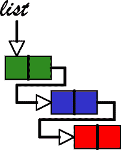

# 我刚在 Snapchat 找到一份开发人员的工作。

> 原文：<https://www.freecodecamp.org/news/a-dynamic-framework-for-finding-your-first-programming-job-b4eb0605b4f3/>

乔恩·邓

# 我刚在 Snapchat 找到一份开发人员的工作。以下是我学到的，以及它如何能帮助你找工作。


Photo courtesy of Lee Campbell on Unsplash

大约一年前，当我作为一名军官被派往伊拉克时，我开始为了乐趣而编程。(你可以在这里阅读整个故事[。)嗯，经过大量的学习，我在威尼斯海滩的 Snapchat (](https://medium.com/operation-code/fueling-the-how-i-learned-to-code-while-deployed-to-iraq-ef71d597fcaf#.olpp0lvoy) [Snap](https://www.snapchat.com/) )找到了第一份软件工程师的工作。

找工作不容易。我面临了许多拒绝、错误的引导和怀疑的时刻。但这段经历帮助我建立了一个心理框架，来处理那些长期来看成功概率很高，但在任何一天成功概率都很小的活动——比如寻找软件工程师的第一份工作。

因为找到我的*特定工作*主要是因为运气好(好时机，偶然的联系，洛杉矶创业资金充足的一年)，概述我采取的具体步骤对你来说不会超级有用。那是因为我做了所有人告诉你要做的事情:

*   构建辅助项目
*   解决实践问题
*   建立你的关系网
*   申请一大堆工作

你采取的*行动，以及你*对每一项行动的重视程度*，会因*你的*个性和具体情况而有很大不同。也就是说，不管你的情况如何，我在求职过程中形成的思维框架都可以帮助你。*

所以我将分享最终形成我的思维框架的思维过程，同时给你一个关于动态编程的快速介绍。希望你觉得这有用？！

### 典型的开发人员求职是如何进行的

在寻找我的第一份编程工作时，我读了不少关于其他自学成才的程序员和训练营毕业生如何找到第一份工作的个人经历。从他们的故事来看，求职似乎是一个非常有序的模式:

1.  学习编码
2.  磨砺你的技能
3.  做一些网络
4.  解决实践问题
5.  申请工作
6.  采访
7.  获得工作机会

在数据结构方面，我把它描绘成遍历一个链表的节点。



On to the next one! Image courtesy of [crunchify](http://crunchify.com/how-to-iterate-through-linkedlist-instance-in-java/)

我认为，当人们回忆他们的记忆时(特别是当他们已经作为工程师工作了一段时间的时候)，一个常见的缺陷是他们过于强调他们采取的具体行动和发生的结果之间的因果关系:

> 我做了 A，然后 B 发生了。因此，A 引起了 B.

因为他们有后知之明，他们的结果看起来是确定的。**如果你只是遵循同样的步骤，你会找到一份好工作。**

是的。第从我的经验来看，从*长期来看*，如果你真的致力于编程并不断推动自己变得更好，你最终会找到一份与你的技能相称的工作(不管你是否拥有帕洛阿尔托某所学校的计算机科学学位)。对软件工程师的需求是真实的，而且还在增长。但是在*的短期*，这个过程是超级随机的，并且基于许多你看不到或控制不了的变量:公司招聘需求、市场趋势、公司目前招聘什么样的高科技人才。

当我开始在洛杉机找工作时，我发出了大量的申请，试图找到一些东西——***任何东西。如果有人给我机会，我会用编码来换取免费的食物和 t 恤衫。以下是我得到的一些早期回复:***

> **你写了漂亮干净的 Javascript 代码。你非常友好，我们喜欢和你聊天。然而，我们没有看到你像我们需要的那样高效地编码。**为了与初级候选人一起前进，我们需要看到一个特殊的优势，而我们在这一点上没有看到你**的这种优势。这意味着我们不能与你合作。**

> **我们都对你评价很高，每个人都喜欢面试你，坚信你的干劲、职业道德和天生的好奇心正是我们在候选人身上寻找的。不幸的是，鉴于我们在物流方面的时间表，**我们正在寻找在前端开发方面有更多经验的人。****

> **很抱歉耽搁了这么久。这个过程比我预想的要复杂。**随着我们接近做出决定，我将在下周的某个时候向你更新**。**

**然后**【沉默】**多周。**

**好吧，那是香蕉。我做了一个编码挑战，花了我 6 个小时，公司甚至不能给我发一封回复邮件？**

**对我来说，收到每一封这样的邮件(以及大量没有回复的邮件)都是一次非常痛苦的经历。但是千万不要浪费从苦难中学到有用的东西的机会。通过向你展示我的求职启发的思维过程，希望这篇文章能给你一个工具来优化你在求职过程中做出的选择，并给你灵感来继续朝着你的目标前进。**

> **“痛苦是不可避免的，苦难是可选的”——村上春树**

### **背包问题**

**让我用一个常见的计算机科学面试问题的变体来说明我进入思维框架的步骤:[背包问题](https://www.wikiwand.com/en/Knapsack_problem)。**

*** *更新:我将我的代码放在一个带有小型测试套件的 [GitHub repo](https://github.com/dengjonathan/jobSearch) 中，让您可以摆弄代码并自行开发解决方案。****

**问题是这样的:**

**你有一系列的活动可以选择来增加你找到工作的机会。每项活动都需要一定的时间，但是提供了一定的经验。我们只有有限的时间来准备找工作，所以我们不能什么都做。我们的目标是通过选择最佳活动集来最大化经验点数。**

**如何编写一个函数，在有限的时间内从可用活动列表中选择最优的活动集？**

### **解决方案 1:暴力**

**重申一下这个问题，您希望选择一组活动:**

1.  **完成任务所需的时间少于或等于您可用的总时间**
2.  **最大化返还的经验值(XP)**

**最直观的方法是使用我们在日常生活中使用的相同算法。我们会尝试各种活动的组合，检查它是否满足我们在有限时间内适应的约束。我们将继续搜索所有可能的组合，并选择最大化 XP 的一个。**

**以下是该算法的代码:**

**问题是，这种方法在时间上确实很复杂，也就是说，随着输入量(我们可能选择的活动数量)的增加，计算一个解决方案所需的时间也会以更快的速度增加。**

**如果我们有 6 个可能的活动，我们首先用一个活动创建每个可能的组合，给我们 6 个包含一个活动的组合。**

**然后，我们必须用 2 个活动创建所有可能的组合。对于最初的 6 个组合中的每一个，我们必须用剩余的 5 个活动中的每一个创建一个组合(每个活动只能做一次)。**

**然后，要用 3 个活动创建所有可能的组合，我们必须将包含 2 个活动的每个组合与其余 4 个活动的每个活动创建一个组合。**

**最终我们会得到类似于(6 * 5 * 4 *3 * 2 * 1)的东西，也就是 *O(n！)*。还有，因为我们每次对每个组合中的所有项求和来计算总时间和 XP，所以我们的结束时间复杂度是 *O(n！* n)* 。**

**想象一下，不是在一台每秒可以执行数万亿次运算的计算机上运行这个算法，而是必须在你有限的大脑上运行它，这实际上需要 10 个小时(在一个非常*乐观的世界里)来做一个学习新的 JavaScript MV*框架的附带项目。***

**此外，你可以做成千上万的事情来为找工作做准备，而不是选择 6 种活动。(在谷歌上查“如何编码”就行了)。**

**尝试各种可能的活动组合来为自己找工作做准备是完全不切实际的。这个例子告诉我们，你可以做几乎无限多的事情来增加你找到工作的机会，但是你不能尝试所有的事情。你需要一个更好的方法来确定你的最佳活动。**

### ****回溯****

**显然，作为程序员(还有黑客？)，我们将希望以某种方式优化我们当前的解决方案。**

**让我们试试来自[的 **BUD** 方法，破解 Gayle McDowell](https://www.amazon.com/Cracking-Coding-Interview-Programming-Questions/dp/098478280X) 的编码面试(一个很棒的准备资源，即使你的工作面试官从来不问算法问题)。**

1.  **我们的暴力解决方案有哪些瓶颈？**

**当寻找瓶颈时，我们通常试图识别流程中最复杂的部分，即 *n！*我们的一部分 *O(n！* n)* 算法。**

**瓶颈，或者说是我们求职问题中最复杂的部分，是我们必须动态地创造许多不同的组合并尝试它们。每增加一个选项，我们就有更多可能的组合可以尝试。**

**现在我不得不承认我带你走上了一条错误的道路。我的求职问题，作为背包问题的一个变种，是一组叫做 [NP-Hard](https://www.wikiwand.com/en/NP-hardness) 问题的一部分。简而言之，当没有已知的有效方法来解决问题或验证问题的解决方案是否正确时，问题就是 NP 难的。所以，除非你是一个改变世界的计算机科学家，否则你很可能找不出一种客观的*高效的*方式来组合所有的活动。**

**不过没关系！！！有时候，在面试和求职中，我们会跟随错误的线索。只要从过程中学到东西，就没有真正浪费时间。即使我们找不到一个整体有效的方法来解决这个问题，我们仍然可以找到一个*更*有效的方法，我们目前正在使用。**

**所以我们继续吧。**

**2.我的算法是在做**不必要的工作**还是**重复的工作**？**

**这是我们可以从解决方案中获得重大收益的地方。**

**我们应该改变的一件事是，对于每一个可能的组合，我们必须遍历集合中的所有活动，从活动集合中计算总的 *XP* 和总的*时间*。这是**重复的工作**，因为我们一遍又一遍地累加相同的值。**

**如果我们只是将组合的总 *XP* 和*时间*保存在一个变量中，我们就可以将我们添加到总数中的每个新活动的 *XP* 和*时间*相加。这将把我们的解决方案从 *O(n！* n)* 到 *O(n！).***

**这是有帮助的，但不会从根本上使我们的问题运行得太快。**

**我们还能做什么优化？**

**我们也在计算很多不可能产生有效解的组合。这是**不必要的工作**。**

**以下是可供参考的活动列表:**

```
`const ACTIVITIES = [  {name: 'side-project', time: 10, xp: 12},  {name: 'algorithms', time: 3, xp: 7},  {name: 'networking', time: 1, xp: 0.5},  {name: 'exercise', time: 2, xp: 1.5},  {name: 'systems design', time: 4, xp: 4},  {name: 'making CSS codepens', time: 3, xp: 4}];`
```

**假设我们总共有 8 个小时来准备找工作。我们的强力算法如何检查组合？**

**基于*活动*数组的顺序，我们将首先考虑一个仅包括*副项目*对象的集合。没有包含*附带项目*活动的有效解决方案，因为它需要 10 个小时来完成，而我们总共只有 8 个小时。**

**但是我们的蛮力算法(就是蛮力)不知道这一点，然后会检查我们可以用 *side-project* 创建的每一个可能的组合。**

**因此，它将检查*【侧投影，算法】*是否是有效的解决方案。它不是。**

**它将检查*【侧项目，算法，网络】*是否有效。它不是。**

**并且它会检查*【副项目，算法，联网，练习】*是否有效。它不是。**

**看到我们做了多少不必要的工作了吗？**

**如果我们能给我们的算法一点智能，让它能检查我们当前的状态(我们当前选择的活动)是否能导致一个有效的解决方案，会怎么样？如果我们当前选择的活动可以导致有效的解决方案(特别是，如果我们选择的活动集花费的时间少于或等于我们作为函数参数的总时间)，那么我们继续选择新的活动并检查它们是否有效。**

**如果没有，我们停止并取消选择我们选择的最后一个活动。**

**例如，如果我们总共有 8 个小时，我们将首先检查仅包含*副项目*的组合是否可能产生有效的解决方案。正如我们之前所确定的，它不能，因为它占用了我们更多的时间。**

**因此，我们取消选择*副项目、*并从*算法开始尝试不同的组合。*通过检查我们当前选择的活动是否能产生有效的解决方案，我们避免了检查任何包含*附带项目*的组合，因为它们不可能产生有效的解决方案。**

**这种方法叫做**回溯。**我们查看我们的现状是否能带来有效的解决方案，如果不能，我们后退一步，尝试做出不同的选择。**

**代码如下:**

**这个解决方案实现了我们前面讨论的两个优化:**

1.  **跟踪总的 XP 和时间，这样我们可以在 O(1)中计算它，而不是在 O(n)中每次对整个集合求和**
2.  **在我们递归地添加一个新项目之前，检查我们当前的集合是否会导致一个有效的解决方案**

**虽然回溯节省了大量工作，但它并没有真正降低我们算法的整体运行时复杂性。还是 O(n！)，因为我们仍然在递归地检查大多数可能的组合。**

**但是实现回溯算法可能已经给了你如何继续解决这个问题的线索。在暴力解决方案中，我们必须为每个可能的组合组装并检查整个组合。通过回溯，我们可以在组装整个组合之前，检查我们所走的路径是否会导致有效的解决方案。**

**嗯嗯……..**

**有没有一种方法可以只考虑我们是否应该向集合中添加另一个活动？与试图一次创建整个组合相比，这将是一个容易得多的问题。它将允许我们把困难的问题(找到最佳组合)分解成一系列更小的问题(决定是否添加一个活动)。**

### **动态规划**

**动态编程是一种方法，我们可以将我们的大**优化**问题(我应该选择什么活动组合？)转化为一系列可管理的**决策**问题(我是否应该将这个活动包含在我的最优解中？).我们分而治之。**

**动态规划是解决 NP 难问题(如背包问题)的常用方法，同时也是考虑求职的好方法。很难确定什么样的活动组合会让你为找工作做好准备。没有有效的方法来找到最佳组合或检查您当前的选择是否是最佳的。**

**但是，将你的时间分解成几天和几周，并尝试找出在每一小段时间里你应该做什么活动，要容易得多。**

**为了使用动态规划解决我们的求职问题，我们将问题分解成一系列更小的问题(如何优化更小的时间段？)然后从每个较小的问题中提取解决方案，并将它们组合成一个较大的解决方案。**

**听起来很困惑？让我们走一遍:**

```
`const ACTIVITIES = [  {name: 'side-project', time: 10, xp: 12},  {name: 'algorithms', time: 3, xp: 7},  {name: 'networking', time: 1, xp: 0.5},  {name: 'exercise', time: 2, xp: 1.5},  {name: 'systems design', time: 4, xp: 4},  {name: 'making CSS codepens', time: 3, xp: 4}];`
```

**如果我们有 t=0(零)的总准备时间，最优解是什么？**

**如果我们有零时间，我们不能做任何活动，所以返回一个空集， *[]* 。**

**好，现在我们的总时间是 t=1，最优解是什么？**

**首先，我们来看看有哪些活动是可以做的:我们不能做副业(时间 t=10)或学习算法(时间 t=3)。我们唯一能做的就是联网(时间 t=1)。**

**因此，我们需要**决定**在时间 t=0 时将网络添加到最优解是否会导致最优解。**

**如果加上联网，我们得出的总 XP 是 0.5，还不错。**

**如果我们不添加网络，我们真的不能做其他任何事情，所以我们得出的总 XP 为 0。**

**0.5 还是比 0 好，所以如果我们只有 t=1 的总时间，就要做联网。时间 t=1 的最优解是*【联网】***

**时间 t=2 的最优解是什么？**

**在时间 t=2 时，有哪些我们还没有考虑到的活动是可能的？只是*运动。***

**如果我们选择增加锻炼，这需要时间 t=2，我们不再有任何时间做其他事情，所以我们的解决方案是*【锻炼】，*导致 1.5 XP。**

**我们比较了包含锻炼的最优解(导致 1.5XP)和不包含锻炼的最优解(导致 0.5XP)。既然含运动的方案更好，我们就选那个(现实生活中，我也觉得在时间非常有限的情况下，一些自我保健总是比更多的 prep 有用？).**

**这就是真正有趣的地方:****时间 t=3 的最优解是什么？******

****同样，对于时间 t=3，什么活动是可能的？****

****我们可以选择*【算法、练习、网络】。*****

****如果我们选择需要时间 t=3 的*算法*，我们就没有时间做别的事情了，所以一个可能的解决方案是*【算法】*。****

****如果我们选择花费时间 t=2 的*练习*，我们还有 t=1 的时间去做别的事情？我们怎么知道剩下的时间选择什么？****

****我们知道时间 t=1 的最优解是*【联网】、* **，所以我们不必再计算一次。我们知道我们不可能比时间 t=1** 的最优解做得更好。****

****所以一个可能的解决办法就是*【锻炼，人脉】。*****

****我们再次比较了所有可能的解决方案，发现我们能做的最好的是*【算法】。*****

****这是动态编程解决方案的基本结构:在每个时间段，我们测试是否添加特定活动的**决策**。我们比较所有可能的解决方案，找出最佳方案。****

****更多时间的解决方案建立在用更少时间解决相同问题的最佳解决方案之上。这允许我们递归地调用动态编程函数。****

****在我的例子中，我选择按照完成活动所需的时间对活动进行排序(从少到多)。这使我们能够快速确定哪些项目在给定时间内是可能的，因为它们是按时间排序的。****

****下面是代码:****

****哇哦！如果你第一次就通过了那个例子，那么你比我学得快多了。我希望这是一个有趣的寻找替代方法来解决困难的算法问题！****

****最后，你可能会问，这一系列三个例子的目的是什么？****

****我不仅悄悄地给了你一些练习，让你练习一个与你在技术面试中可能会被问到的问题非常相似的问题，我还向你展示了我构建自己的思维框架的步骤。****

****你可以做的活动几乎有无限多种组合，而且没有有效的方法来确定你应该做的最佳活动。很多路径不会导致有效的解决方案，就像很多工作申请和面试不会导致一份工作。****

****你可以尝试求职活动的每一种可能的组合(蛮力)，但是因为我们是时间有限的人类，所以这不是达到我们目标的有效方法。****

****我们可以通过在每一步评估我们的方法是否会导致我们的目标来优化我们的方法(回溯)。例如，如果我们经常联系第三方招聘人员来帮助我们寻找工作机会，而招聘人员在进行面试时并没有很大的帮助，也许我们应该回溯并考虑不同的活动。****

****最后，由于找工作不是一天的事情，我们可以尝试优化每一天，并将几天结合在一起(动态规划)。这样我们就有了一个可以处理的问题(我今天应该学习算法吗？)相对于一个真的很难的(接下来的一个月我该做些什么来为自己找工作做准备？).****

****最后，我想指出的是，通过这三种方法，尽管它们在客观上并不高效，我们最终还是达成了解决方案。在找工作的过程中，重要的是要记住，从长远来看，你*会*实现你的目标，每天都要继续努力。****

### ****我对处理开发人员求职的建议****

****我将屈服于我的诱惑，根据我的经验给你两条建议。****

1.  ****在面试和编码挑战中，很难判断自己的表现，所以只需关注过程。你不会在面试中或紧接着的面试中知道你做得好还是差。****
2.  ****成功或失败转瞬即逝，不应该决定你的幸福。****

****如果你正在寻找你的第一份编程工作，我希望这本书对你有用，或者至少对你有启发——看，像我这样一个没有天赋的笨蛋找到了一份好工作！祝你好运，最后我想分享一下我在求职过程中得到的最好的建议:****

> ****“不要担心自己是否足够优秀，担心自己是否喜欢编程，是否愿意足够努力。如果你做到了这两点，你就会成功。”——转述自埃德加·帕邦关于[闯入创业播客](http://breakingintostartups.com/edgar-pabon/)的话****

****感谢你的阅读，祝你求职顺利！****