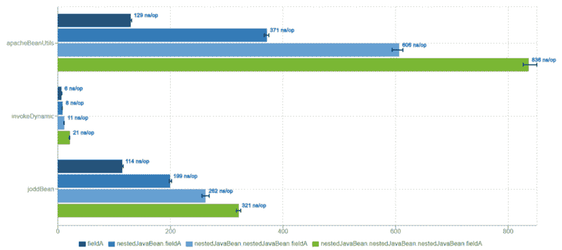
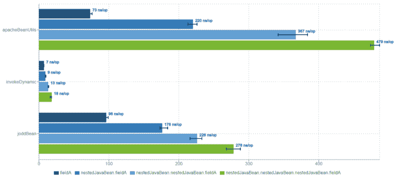

# Java 反射的更快替代方案

> 原文：<https://www.freecodecamp.org/news/a-faster-alternative-to-java-reflection-db6b1e48c33e/>

作者卡洛斯·拉斐尔

# Java 反射的更快替代方案

在文章[规范模式](https://medium.com/@carlosraphael/specification-design-pattern-in-java-8-bac6f5f943bc)中，为了清楚起见，我没有提到一个底层组件来很好地实现这一点。现在，我将围绕 [JavaBeanUtil](https://github.com/carlosraphael/specification-pattern/blob/master/src/main/java/com/github/carlosraphael/specificationpattern/util/JavaBeanUtil.java) 类详细说明一下，我将它放在适当的位置，以便从特定的`javaBeanObject` *、*中读取给定`fieldName`的值，在那种情况下，该值变成了 [FxTransaction](https://github.com/carlosraphael/specification-pattern/blob/master/src/main/java/com/github/carlosraphael/specificationpattern/FxTransaction.java) 。

你可以很容易地争辩说，我基本上可以使用 [Apache Commons BeanUtils](http://commons.apache.org/proper/commons-beanutils/) 或它的一个替代品来达到同样的结果。但是我有兴趣亲自尝试一些不同的东西，我知道这些东西会比基于广为人知的 [Java 反射](https://www.oracle.com/technetwork/articles/java/javareflection-1536171.html)构建的任何库都要快。

用于避免非常慢的反射的技术的使能器是字节码指令`invokedynamic` 。简言之，`invokedynamic`(或“indy”)是 Java 7 中引入的最伟大的东西，它为通过动态方法调用在 JVM 上实现动态语言铺平了道路。它后来还允许 Java 8 中的 [lambda 表达式](https://docs.oracle.com/javase/tutorial/java/javaOO/lambdaexpressions.html)和[方法引用](https://docs.oracle.com/javase/tutorial/java/javaOO/methodreferences.html)以及 Java 9 中的字符串连接从中受益。

简而言之，我将在下面更好地描述的技术利用了[λmetafactory](https://docs.oracle.com/javase/8/docs/api/java/lang/invoke/LambdaMetafactory.html)和 [MethodHandle](https://docs.oracle.com/javase/8/docs/api/index.html?java/lang/invoke/MethodHandles.html) 来动态创建[函数](https://docs.oracle.com/javase/8/docs/api/java/util/function/Function.html)的实现。它的[单一方法](https://docs.oracle.com/javase/8/docs/api/java/util/function/Function.html#apply-T-)用 lambda 主体内部定义的代码委托对实际目标方法的调用。

这里讨论的目标方法是实际的 getter 方法，它可以直接访问我们想要读取的字段。另外，我应该说，如果你非常熟悉 Java 8 中出现的好东西，你会发现下面的代码片段相当容易理解。不然一看就可能有猫腻。

### 瞥一眼自制的 JavaBeanUtil

下面的方法是用于从 JavaBean 字段读取值的实用程序。它接受 JavaBean 对象和一个单独的`fieldA`或者甚至是由句点分隔的嵌套字段，例如`nestedJavaBean.nestedJavaBean.fieldA`

为了获得最佳性能，我缓存了动态创建的函数，这是读取给定`fieldName`内容的实际方式。所以在`getCachedFunction`方法中，正如你在上面看到的，有一个快速路径利用 [ClassValue](https://docs.oracle.com/javase/8/docs/api/java/lang/ClassValue.html) 进行缓存，还有一个慢速的`createAndCacheFunction`路径，只有到目前为止没有缓存任何东西时才执行。

慢速路径将基本上委托给`createFunctions`方法，该方法通过使用`Function::andThen`将它们链接起来，返回要缩减的函数列表。当函数被链接时，你可以想象某种类似于`getNestedJavaBean().getNestedJavaBean().getFieldA()`的嵌套调用。最后，在链接之后，我们简单地将简化的函数放入缓存中，调用`cacheAndGetFunction`方法。

更深入地研究函数创建的缓慢过程，我们需要通过按如下方式分割字段`path`变量来单独导航:

上面的`createFunctions`方法将个体`fieldName`及其类容器类型委托给`createFunction`方法，后者将基于`javaBeanClass.getDeclaredMethods()`定位所需的 getter。一旦它被定位，它就映射到一个元组对象(来自 [Vavr](http://www.vavr.io/) 库的工具)，该对象包含 getter 方法的返回类型和动态创建的函数，在该函数中，它的行为就好像它是实际的 getter 方法一样。

该元组映射由`createTupleWithReturnTypeAndGetter`结合`createCallSite`方法完成，如下所示:

在上面的两个方法中，我使用了一个名为`LOOKUP`的常量，它只是对[方法句柄的引用。查找](https://docs.oracle.com/javase/8/docs/api/java/lang/invoke/MethodHandles.Lookup.html)。这样，我可以基于之前找到的 getter 方法创建一个[直接方法句柄](https://docs.oracle.com/javase/8/docs/api/java/lang/invoke/MethodHandleInfo.html#directmh)。最后，创建的 [MethodHandle](https://docs.oracle.com/javase/8/docs/api/java/lang/invoke/MethodHandle.html) 被传递给`createCallSite`方法，从而使用 [LambdaMetafactory](https://docs.oracle.com/javase/8/docs/api/java/lang/invoke/LambdaMetafactory.html) 生成函数的 lambda 主体。从那里，最终，我们可以获得 [CallSite](https://docs.oracle.com/javase/8/docs/api/java/lang/invoke/CallSite.html) 实例，它是函数的持有者。

注意，如果我想处理 setters，我可以使用类似的方法，利用[双函数](https://docs.oracle.com/javase/8/docs/api/java/util/function/BiFunction.html)而不是[函数](https://docs.oracle.com/javase/8/docs/api/java/util/function/Function.html)。

### 基准

为了衡量性能的提升，我使用了一直令人敬畏的 JMH ( [Java 微基准测试工具](https://openjdk.java.net/projects/code-tools/jmh/)，它很可能是 [JDK 12](https://openjdk.java.net/jeps/230) 的一部分。如你所知，结果是与平台绑定的，所以作为参考，我将使用单个`1x6 i5-8600K 3.6GHz`*`Linux x86_64`*以及`Oracle JDK 8u191`和`GraalVM EE 1.0.0-rc9`。**

**为了进行比较，我使用了 Apache Commons bean utils T1，这是一个为大多数 Java 开发人员所熟知的库，它的一个替代品叫做 T2 Jodd bean util T3，据称比 T4 快 20%。**

**基准场景设置如下:**

**基准测试是由我们根据上面指定的四个不同级别检索某个值的深度决定的。对于每个 `fieldName`，JMH 将执行 5 次每次 3 秒的迭代来预热，然后执行 5 次每次 1 秒的迭代来实际测量。然后，每个场景将重复 3 次，以合理地收集指标。**

### **结果**

**让我们从`JDK 8u191`运行中收集的结果开始:**

**

Oracle JDK 8u191** 

**使用`invokedynamic`方法的最坏情况比其他两个库的最快情况要快得多。这是一个巨大的差异，如果你怀疑结果，你可以随时下载[源代码](https://github.com/carlosraphael/javabeanutil-benchmark)，随心所欲地玩。**

**现在，让我们来看看相同的基准测试在`GraalVM EE 1.0.0-rc9`上的表现**

**

GraalVM EE 1.0.0-rc9** 

**完整的结果可以在[这里](https://jmh.morethan.io/?gist=https://gist.githubusercontent.com/carlosraphael/27723493d2161ea078e29a1f7fc15dd2/raw/5975d3b609e1c0cb14c47f7ab76e38c053be64b3/JavaBeanUtilBenchmark_result.json)用尼斯 JMH 可视化工具查看。**

### **观察**

**巨大的差异是因为 JIT 编译器非常了解`CallSite`和`MethodHandle`，并且知道如何很好地内联它们，而不是反射方法。同样，你可以看到 [GraalVM](https://www.graalvm.org/) 是多么有前途。它的编译器做了一件非常棒的工作，能够极大地增强反射方法的性能。**

**如果你很好奇，想玩得更深入，我鼓励你从我的 [Github](https://github.com/carlosraphael/javabeanutil-benchmark) 中获取源代码。请记住，我不是鼓励你自己做自制的`JavaBeanUtil`并用于生产。相反，我在这里的目的是简单地展示我的实验和我们可以从`invokedynamic`中获得的可能性。**