# 首先看一下 firstBorn，React Native 的新组件库

> 原文：<https://www.freecodecamp.org/news/a-first-look-at-firstborn-react-natives-new-component-library-51403077a632/>

`[first-born](https://github.com/99xt/first-born)`是一个 React 原生 UI 组件框架，它遵循了 Brad Frost 的设计方法论[原子设计。](http://atomicdesign.bradfrost.com/chapter-2/)

1.0.0 版本最近于 4 月 1 日作为 [npm 模块](https://www.npmjs.com/package/@99xt/first-born)发布(不过这可不是开玩笑的……)。

在本文中，我们将看到由`first-born`提供的现有组件的演示。

### 设计方法

原子设计方法遵循用户界面可以分解成 5 个不同阶段的原则。

根据这种设计方法，各阶段描述如下:

*   原子:基本的、独立的元素，如文本、图标、按钮或文本输入框。
*   分子:不同原子的组合，它们一起具有更好的操作价值。例如，带有文本标签的 TextInput 解释内容或显示输入数据中的错误。
*   有机体:不同分子共同作用形成复杂结构的组合。例如，许多 TextInput 分子的形式。
*   模板:构成页面基础的不同有机体的组合。这包括这些有机体的布局和背景。
*   页面:所有上述内容在一个真实的实例中一起工作，产生了一个页面。它也是模板的实际实现。

### 入门指南

让我们首先使用 CLI 创建一个新的 React 本机应用程序:

```
react-native init firstBornExample
```

创建后，移动到应用程序文件夹:

```
cd firstBornExample
```

要将`first-born`添加到应用程序中，安装如下:

```
npm i --save @99xt/first-born
```

我们需要自己安装另外两个依赖项。

```
npm i --save create-react-class react-native-vector-icons
```

然后，我们需要按照[这个指南](https://github.com/oblador/react-native-vector-icons#installation)来设置应用程序的`react-native-vector-icons`。

create-react-class 没有附加的设置步骤。

我们准备好了！

### 使用

要导入组件，该语句将如下所示:

```
import { <name of component> } from '@99xt/first-born'
```

该模块带有以下内置组件:

#### 原子

[**正文**](https://github.com/99xt/first-born#text)

原子有一组固定的大小。这些大小因底层应用平台而异。我们还可以给这个`Text`原子传递一种颜色。

```
<Text size="h4">first-born example</Text>
```

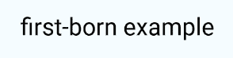

Text (Android)

[**图标**](https://github.com/99xt/first-born#icon)

`Icon`原子构建在`react-native-vector-icons` Ionicons 类之上。Ionicons 为 Android 和 iOS 提供了一个图标的两种不同版本。这个类将根据底层平台呈现图标。

```
<Icon name="heart" color="red"/>
```


Icon (Android)

[**按钮**](https://github.com/99xt/first-born#button)

原子可以用多种方式呈现。它只接受`Texts`、`Icons`和`Images`作为子项目显示。它有 3 种不同的大小，以及 4 种不同的标签，可以以多种组合呈现按钮。

```
render() {
    return (
      <View style={styles.container}>
        <Button size="small">
          <Text>Small</Text>
        </Button>
        <Button >
          <Text>Default</Text>
        </Button>
        <Button size="large">
          <Text>Large</Text>
        </Button>
        <Button >
          <Icon name="heart" />
          <Text>Default</Text>
        </Button>
        <Button rounded>
          <Icon name="heart" />
          <Text>Rounded</Text>
        </Button>
        <Button block>
          <Icon name="heart" />
          <Text>Block</Text>
        </Button>
        <Button rounded block>
          <Icon name="heart" />
          <Text>{"Rounded & Block"}</Text>
        </Button>
        <Button outline>
          <Icon name="heart" />
          <Text>Outline</Text>
        </Button>
        <Button outline transparent>
          <Icon name="heart" />
          <Text>{"Outline & Transparent"}</Text>
        </Button>
      </View>
    );
}
```


Buttons (Android)

[**输入**](https://github.com/99xt/first-born#input)

原子是一个样式化的原子。如果 TextInput 处于焦点上，它会向用户显示一个彩色边框。`onChangeText`方法是强制性的。

```
<Input placeholder="Name" onChangeText={this.handleTextChange} />
...
handleTextChange = (text) => {
  this.setState({ text: text })
}
```

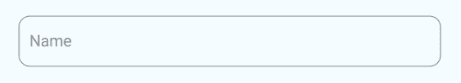

Input (Android)

这也支持向用户指示错误。为了使用这个特性，我们需要创建一个验证方法。这个方法应该根据输入文本的有效性返回一个布尔值。一个这样的场景是检查电子邮件地址是否遵循传统格式。这个方法是在`isValid`属性中传递的。

```
checkInputValidity = (text) => {
  const regex = /^\w+([\.-]?\w+)*@\w+([\.-]?\w+)*(\.\w{2,3})+$/;
  return regex.test(text);
}
...
<Input placeholder="Email" isValid={this.checkInputValidity} />
```

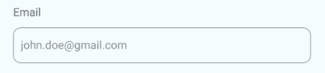

Input Validation (Android)

[**TextArea**](https://github.com/99xt/first-born#textarea)

原子是一个样式化的原子。如果 TextInput 处于焦点上，它会向用户显示一个彩色边框。随着输入更多数据，它的高度也会增加。

```
<TextArea placeholder="Description"/>
```

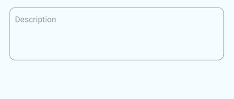

TextArea (Android)

[**采摘者**](https://github.com/99xt/first-born#picker)

原子是一个样式化的组件。在 Android 上，选择器是一个下拉菜单，从最初的`Picker`组件扩展而来。在 iOS 上，单击`first-born Picker`将打开一个模式，供用户选择值。

```
<Picker>
	<Picker.Item value="1" label="1" />
	<Picker.Item value="2" label="2" />
	<Picker.Item value="3" label="3" />
</Picker>
```

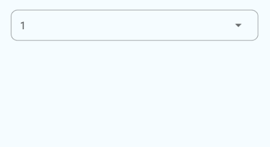

Picker (Android)

[**日期选择器**](https://github.com/99xt/first-born#datepicker)

原子是一个样式化的组件，看起来像一个 T2。在 Android 上，当点击`View`时，它运行`[DatePickerAndroid](https://facebook.github.io/react-native/docs/datepickerandroid)` [API](https://facebook.github.io/react-native/docs/datepickerandroid) 。在 iOS 上，单击`View`将打开一个模态，让用户从`[DatePickerIOS](https://facebook.github.io/react-native/docs/datepickerios)`组件中选择日期。

```
<DatePicker />
```

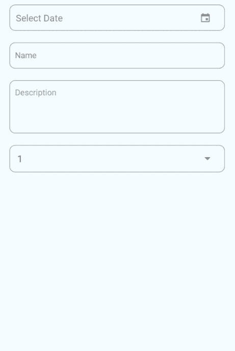

DatePicker (Android)

#### 分子

[**FormDatePicker**](https://github.com/99xt/first-born#formdatepicker)

这种分子使用`DatePicker`原子，并包含`Text`原子作为标签。此元素的 label 属性是必需的。

```
<FormDatePicker label="Date" />
```

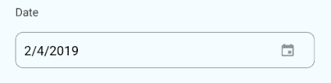

FormDatePicker (Android)

[**表单选取器**](https://github.com/99xt/first-born#formpicker)

这种分子使用`Picker`原子，并包含`Text`原子作为标签。此元素的 label 属性是必需的。

```
<FormPicker label="Number">
	<Picker.Item value="1" label="1" />
	<Picker.Item value="2" label="2" />
	<Picker.Item value="3" label="3" />
</FormPicker>
```

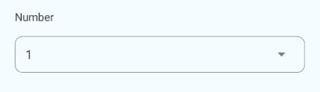

FormPicker (Android)

我们还可以将数据作为一个对象数组来传递，这些对象有键'`value`和`label`。两个键中的数据都必须是字符串类型。

```
pickerData = [
	{
		value: "1",
		label: "1"
	},
	{
		value: "2",
		label: "2"
	},
	{
		value: "3",
		label: "3"
	}
];
...
<FormPicker label="Number" pickerData={this.pickerData} />
```

[**FormInput**](https://github.com/99xt/first-born#forminput)

这种分子使用`Input`原子，并包含`Text`原子作为标签。此元素的 label 属性是必需的。

```
<FormInput label="Name" />
```

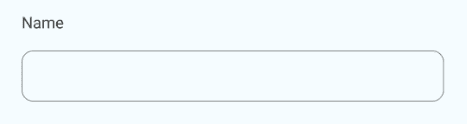

FormInput (Android)

[**【成型区】**](https://github.com/99xt/first-born#formtextarea)

这种分子使用`TextArea`原子，并包含`Text`原子作为标签。此元素的 label 属性是必需的。

```
<FormTextArea label="Description" />
```

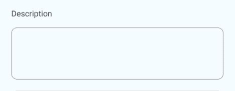

FormTextArea (Android)

[**卡**](https://github.com/99xt/first-born#card)

`Card`分子显示一个带有图像、标题和描述的`View`。其中，标题是必选的。这种分子的风格根据底层平台的不同而不同。

```
<Card title="Heading Only" />
<Card title="Heading" description="And Description" />
<Card title="Heading" description="Description" image={require("./path/to/an/image.png")} />
```

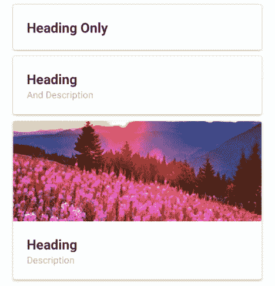

Card (Android)

[**我列出了**](https://github.com/99xt/first-born#list-item)

`ListItem`分子显示一个带有图像、标题和描述的`View`。其中，标题是必选的。这种分子的风格根据底层平台的不同而不同。

```
<ListItem title="Heading Only" />
<ListItem title="Heading" description="And Description" />
<ListItem title="Heading" description="Description" image={require("./path/to/an/image.png")} />
```

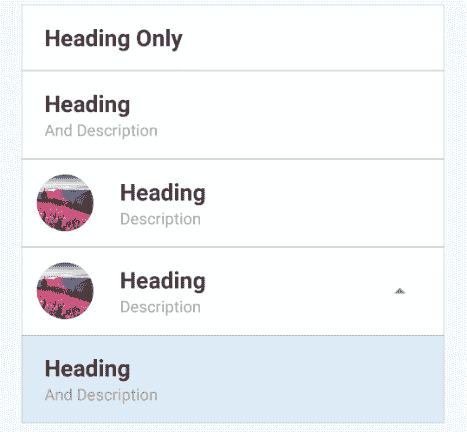

ListItems (Android)

[**通知**](https://github.com/99xt/first-born#notifications)

`Notification`分子在页面顶部显示一个横幅。对组件的引用被传递给`NotificationManager`。调用这个管理器的`showAlert`方法，我们可以发送消息显示给用户。

添加`Notification`作为父`View`的最后一个柠檬。

```
<Notification ref={"alert"} />
```

当页面挂载时，我们需要注册这个`Notification`分子。这是为了将`Notification`的引用传递给管理器。

```
componentDidMount() {
	NotificationBarManager.registerMessageBar(this.refs.alert);
}
```

为了清理，我们还需要取消注册这个分子，因为页面已经卸载了。

```
componentWillUnmount() {  
	NotificationBarManager.unregisterMessageBar();
}
```

要显示`Notification`栏，运行下面的方法，传递要显示的消息。

```
NotificationBarManager.showAlert({  
	message: 'Your alert message goes here'
});
```

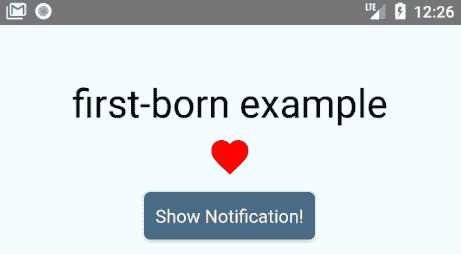

Notification (Android)

[**浮动按钮**](https://github.com/99xt/first-born#floating-action-button)

这个分子相当于 Android 悬浮动作按钮(FAB)。它可以是单个动作，也可以扩展显示多个动作。

如果 FAB 包含一个单独的动作，我们使用`onPress`属性来传递单击按钮时要运行的方法。

```
<FloatingButton onPress={this.handleShowNotification} />
```

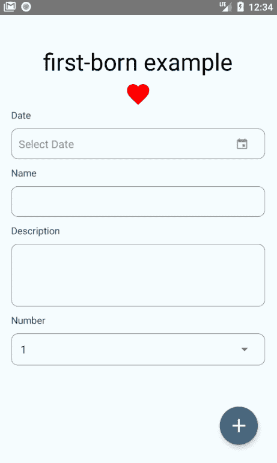

FAB with singular action

如果 FAB 需要扩展以显示许多动作，并且需要创建动作数组。数组中的每个操作对象至少需要包含:

1.  独特的`name`
2.  `icon`或`image`
3.  `position`当晶圆厂扩展时，从顶部开始(从 1 开始)
4.  运行方法`onPress`

```
const actions = [
	{
		icon: 'help',
		name: 'bt_accessibility',
		position: 2,
		onPress: () => Alert.alert('Hello', 'Accessibility')
	},
	{
		icon: 'pin',
		name: 'bt_room',
		position: 1,
		onPress: () => Alert.alert('Hello', 'Location')
	},
	{
		icon: 'videocam',
		name: 'bt_videocam',
		position: 3,
		onPress: () => Alert.alert('Hello', 'Video')
	}
];
```

然后，我们将数组传递给属性`actions`中的`FloatingButton`:

```
<FloatingButton actions={this.actions} />
```


FAB with multiple actions

#### 有机体

**表格**

`Form`生物体是由`FormInput`、`FormPicker`、`FormDatePicker`、`FormTextArea`等形态分子构成的。

为了呈现这个有机体，需要传递一个包含每个字段细节的数组。子组件根据每个对象中指定的`type`进行渲染。

映射如下所示:

1.  '文字'— `FormInput`
2.  '文本区'— `FormTextArea`
3.  日期'— `FormDatePicker`
4.  ‘提货人’— `FormPicker`

每个字段的对象只能包含指定给映射字段类型的属性。简单来说，`type`‘文本’的对象必须只包含`FormInput`分子接受的属性。

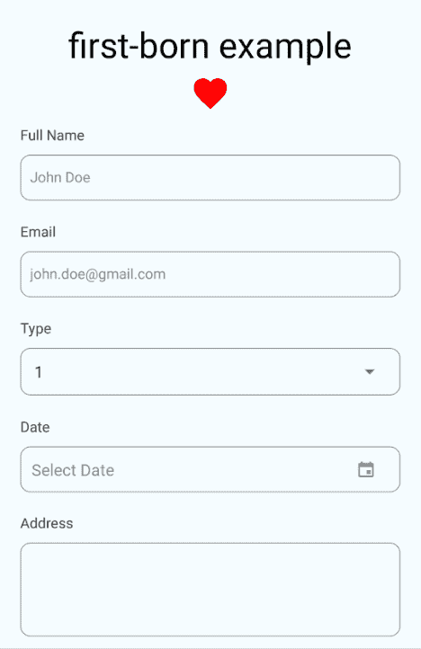

Form (Android)

这个有机体当前以水平或垂直方式呈现了一个只读列表`Cards`。它需要一系列与一个`Card`分子具有相同属性的物体。

```
const listData = [
	{
		title: "Heading 1",
		description: "Description 1",
		image: require("./path/to/an/image.png")
	},
    {
		title: "Heading 2",
		description: "Description 2",
		image: require("./path/to/an/image.png")
	},
    {
		title: "Heading 3",
		description: "Description 3",
		image: require("./path/to/an/image.png")
	}
];
```

若要呈现列表，请将上面的数组传递给 data 属性。如果我们想要一个水平滚动的列表，添加布尔属性`horizontal`。

```
<CardList data={this.listData} />
<CardList data={this.listData} horizontal />
```

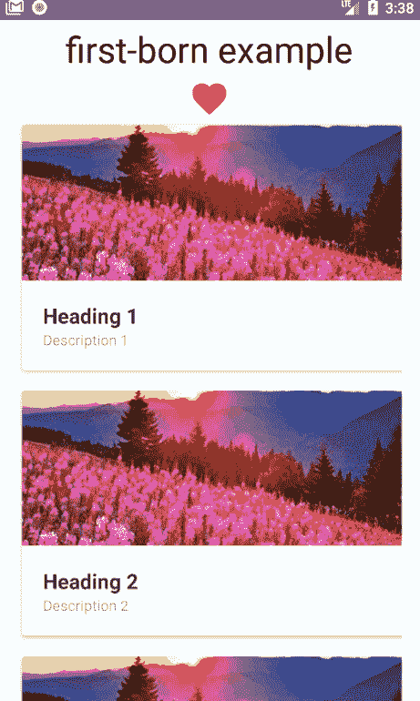

CardList (Android)

[**ListView**](https://github.com/99xt/first-born#listview)

这个有机体目前垂直呈现一个只读列表`ListItem’s`。它需要一系列与一个`ListItem`分子具有相同属性的物体。用于`CardList`的相同列表也可以用在这里。

```
<ListView data={this.listData} />
```

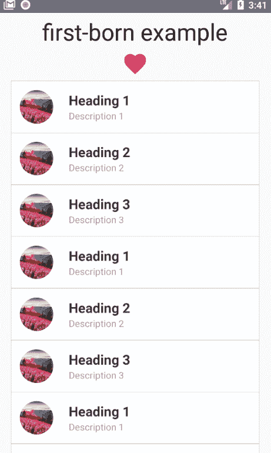

ListView (Android)

[**【导航栏】**](https://github.com/99xt/first-born#navbar)

`NavBar`有机体是根据底层平台呈现的页面标题。它呈现在页面的顶部，就在页面的主`View`组件的内部。

要形成`NavBar`，需要包含所有三个子元素(`NavBarRight`、`NavBarLeft`和`NavBarBody`，以正确对齐元素。

```
<NavBar>  
	<NavBarLeft />
		<NavBarBody>
			<Text>Title</Text>
		</NavBarBody>
	<NavBarRight/>
</NavBar>
```


NavBar with title only (Android)

我们还可以在带有`NavBarButton`组件的标题中包含按钮。这个按钮可以作为孩子添加到`NavBarRight`和`NavBarLeft`组件中。

`NavBarButton`有两种用法:

1.  它有一个属性`type`，接受值“back”、“drawer”和“search”。默认情况下，这将为每种类型呈现相应的图标。
2.  我们可以通过在`NavBarButton`组件中包含`Texts`、`Icons`或`Images`作为子组件来创建一个自定义按钮。

```
<NavBar>
	<NavBarLeft >
		<NavBarButton type="drawer" />
	</NavBarLeft>
	<NavBarBody>
		<Text>Title</Text>
	</NavBarBody>
	<NavBarRight>
		<NavBarButton>
			<Icon name="heart" />
		</NavBarButton>
	</NavBarRight>
</NavBar>
```

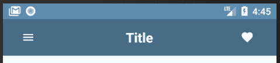

NavBar with buttons (Android)

[**【页脚导航(TabBar)**](https://github.com/99xt/first-born#tabbar)

`TabBar`有机体是根据底层平台呈现的页脚。它呈现在页面的最底部，就在页面主`View`组件的结束标记之前。

根据选项卡导航中的页数，TabBar 包含多个选项卡。TabItem 接受`Texts`、`Icons`或`Images`作为孩子。

```
<TabBar>
	<TabItem active>
		<Icon name="heart" />
		<Text>Favorites</Text>
	</TabItem>
	<TabItem>
		<Icon name="add" />
		<Text>Add New</Text>
	</TabItem>
	<TabItem>
		<Icon name="camera" />
		<Text>Camera</Text>
	</TabItem>
	<TabItem>
		<Icon name="settings" />
		<Text>Settings</Text>
	</TabItem>
</TabBar>
```

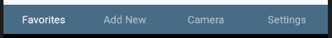

TabBar with text only (Android)


TabBar with icons only (Android)

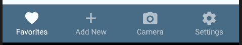

TabBar with icons and text (Android)

[**【药丸导航(PillView)**](https://github.com/99xt/first-born#pillbar)

`PillView`导航用于显示页面上的不同部分。在 Android 上，它呈现为一个标题标签栏。在 iOS 上，它呈现为药丸。

它需要传递两个数组给它，以成功地渲染有机体。一个是它将显示的场景列表。第二个是要在标题中显示的组件(`PillBar`)。

药丸场景只需要对象中的一个关键点。用于表示点击相应的`PillItem`时，视图上显示的场景。

药丸标题将要求在`PillItem`上呈现文本、图标或图像中的至少一个。

```
const pillScenes = [
	{ scene: <CardList data={this.listData} /> },
	{ scene: <ListView data={this.listData} /> },
	{ scene: 
		<View style={styles.innerContainer}>
			<Form formElements={this.formElements} />
		</View> 
	}
];
```

```
const pillHeaders = [
	{
		title: 'Card List',
		icon: "card"
	},
	{
		title: 'List View',
		icon: "list"
	},
	{
		title: 'Form',
		icon: "help"
	}
];
```

然后我们将这两个数组传递给`PillView`项，如下所示:

```
<PillView pillHeaders={this.pillHeaders} pillScenes={this.pillScenes} />
```

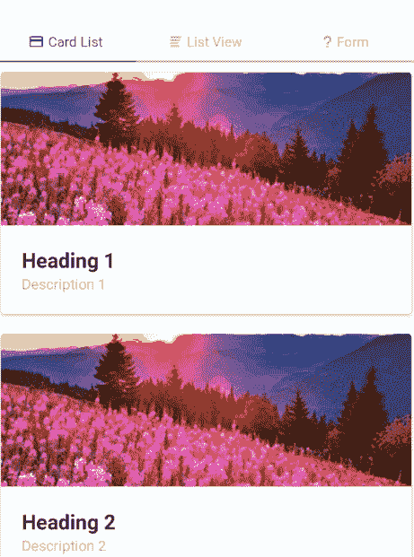

PillView (Android)

这就是`first-born`所能提供的全部组件(到目前为止……)。

一旦代码被更好地组装，我们将得到一个类似于下面的应用程序:

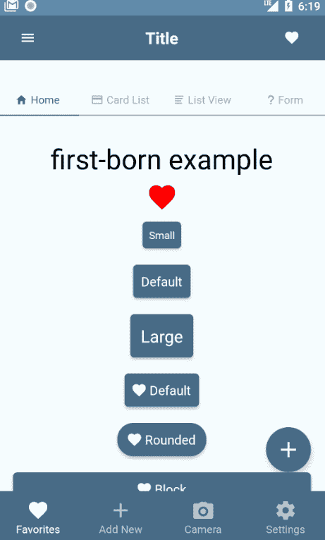

Final implementation of all features

试一试，请务必让我知道你的情况。

在此找到演示报告[。](https://github.com/samsam-026/firstBornExample)

如果您希望了解第一个导航元素如何与外部导航模块一起工作，请查看以下回复；

反应导航:[第一出生-反应导航-示例](https://github.com/samsam-026/first-born-react-navigation-example)

react Native Router Flux:[first-born-rnrf-示例](https://github.com/samsam-026/first-born-rnrf-example)