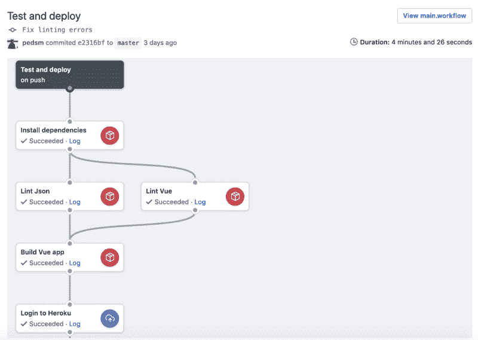
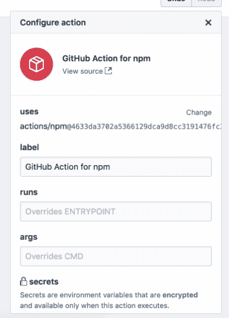
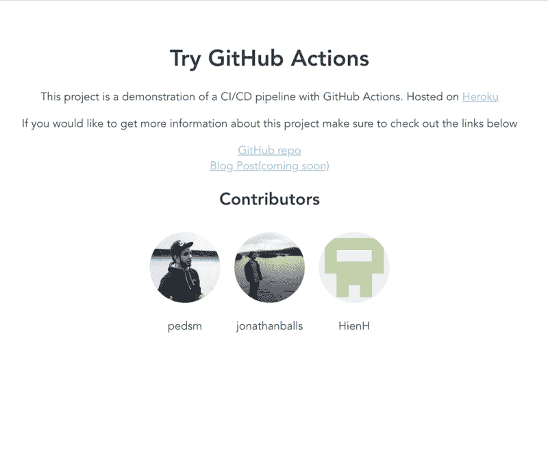

# Heroku 的 GitHub 行动初探

> 原文：<https://www.freecodecamp.org/news/a-first-look-at-github-actions-with-heroku-a6b4239d556/>

佩德罗·门多萨

# Heroku 的 GitHub 行动初探

10 月，GitHub 宣布他们最新的重要功能——GitHub Actions——将进入公测。当时我不太确定这是什么，但看了他们的博客后，我觉得这很简单。GitHub Actions 是对其主要竞争对手的关键功能之一的回应:GitLab 的 [Auto DevOps](https://docs.gitlab.com/ee/topics/autodevops/) 功能。

Photo by [Saad Salim](https://unsplash.com/photos/PqRvLsjD_TU?utm_source=unsplash&utm_medium=referral&utm_content=creditCopyText) on [Unsplash](https://unsplash.com/search/photos/pipeline?utm_source=unsplash&utm_medium=referral&utm_content=creditCopyText)

最近，我创建了自己的个人 GitLab 帐户，因为 GitLab 为我提供了一种简单的方法，可以使用单个`.gitlab-ci.yml`文件自动构建和部署 React 单页面应用程序。

然而，当我获得 GitHub Actions 的测试版时，我不得不尝试一下。所以我决定做一个类似的东西。

#### 给我看看代码！

如果你对什么是动作有一个很好的概念，并且你只是想看看它的代码，那么请随意阅读本文的知识库:[https://github.com/pedsm/tryGithubActions](https://github.com/pedsm/tryGithubActions)

#### 快速免责声明

到目前为止，我对 GitHub 动作的所有体验都是基于它们的测试版，所以要考虑到这一点。我在这里谈论的许多东西可能不会进入它们的最终版本，我将忽略我发现的任何 bug 或*【古怪】*行为。

### 这是什么？

GitHub actions 允许你在你的一个仓库中发生事情时自动完成任务(比如推送、发布、发布等等)。这意味着您可以将您的存储库设置为在每次推送新的提交时自动测试和部署，这正是我所做的。

正如我之前提到的，我决定创建一个 GitLab 帐户的唯一原因是要有一个工作流，任何对 master 的推送都将直接部署到一个实时网站，所以我决定完全重建这个工作流。

### 设置

一旦您可以访问 GitHub actions，您将在所有的存储库中看到一个名为`Actions`的新标签。在那里，您将能够创建您的第一个工作流。工作流是一个保存在`.github`文件夹中的`.workflow`文件，它已经被用于 PR 模板和其他特定于资源库的 GitHub 配置。

The new ‘Actions’ tab

GitHub Actions 为您的工作流程提供了功能全面的图形编辑器。如果您认为您需要学习一种新的 YAML 模式或者一种特定于技术的语言，比如一种`Jenkinsfile`，那么这是一股新鲜空气。但是，如果您不想使用任何闪亮的图形工具，欢迎您编辑您的。工作流文件如你所愿。

The .workflow graphical visualizer.

工作流文件使用 HashiCorp 配置语言(也称为 HCL)。如果你熟悉地形，这应该看起来很熟悉。

### 差异

如果您已经实现了任何类型的自动化测试，这可能看起来与您非常相似。也许除了你可以使用图形编辑器。然而，随着我们继续前进，相似之处越来越少。

顾名思义，GitHub Actions 是一系列执行单个命令的`actions`——这很不寻常。如果您关注了*工作流*文件，您可能已经注意到动作定义有一个`uses`参数。如果你使用一个`npm`动作，那么你可以执行一个 NPM 任务，比如`npm install`，然后使用另一个动作做`npm test`。这并不常见，因为一些逻辑任务，如“安装依赖项”可能需要不止一个命令，并且在其他持续集成解决方案中通常被组合在*的*阶段中。

当使用图形编辑器并添加一个新动作时，首先会提示您一个可用动作的列表([，如果您对](https://github.com/actions)感兴趣，可以在这里找到它)。然后会出现一个简单的表单，你只需要填写标签，一个*‘args’*字段，和一个*‘runs’*字段。

如你所料，这个标签只是你的动作所做的事情的一个友好的名字，比如*‘测试’。*该动作然后在终端中执行*【运行参数】*，运行通常不值得覆盖。这意味着要在 npm 操作中运行一个`npm install`，您应该将 runs 作为缺省值，将 args 作为`install`。

The configure action window for the GUI editor.

目前，这让我感到非常失望，因为 GitHub 似乎锁定了这个特性的功能，只做它想做的事情。Npm 目前是可用的，但是如果你为你的 python 项目使用 pip，那么你将不得不实现你自己的动作或者找到一个开源的替代方案。创建你自己的[自定义动作](https://developer.github.com/actions/creating-github-actions/creating-a-new-action/)已经是可能的了，但是因为这还在测试阶段，所以你不太可能在那里找到太多。往好的方面想，他们确实有我需要的两样东西，NPM 和赫罗库。

### 该项目

该项目的想法非常简单:我想建立一个 Vue 应用程序(因为这是我目前正在学习的),并让它自动部署到托管服务。

然后我想让网站的内容反映一个包含一系列 GitHub 用户名的`json`文件。这样，任何人都可以用他们的 GitHub 句柄创建一个 PR，这样我就可以点击一个按钮，然后神奇地部署它。

You can check it out here [https://try-github-action.herokuapp.com/](https://try-github-action.herokuapp.com/)

我将跳过所有的 Vue.js 内容，直接进入行动。构建了简单的应用程序后，我只需执行以下操作:

1.  安装依赖项
2.  运行 linters(确保 JSON 输入不被破坏是很重要的)
3.  构建生产就绪代码
4.  部署在某个地方(我决定用 Heroku，因为它看起来最简单，不用考虑服务器，动作也是可用的)

前三步是我自动化过程中最直观的体验。它几乎给了我 IFTTT 感应。你只需点击 NPM 行动，然后选择你希望 NPM 做什么。我知道我说过只有一系列的操作有点限制，但事实是我从来不需要担心我使用的是什么 Linux 发行版，NPM 是否与 Node.js 安装捆绑在一起，最重要的是 HCL 语法是否正确。在 UI 上点击几下就搞定了。整个过程用了 4 个动作，所以不到 5 分钟。

然后我去了部署位。我知道这会更难，因为尽管我知道 Heroku 是如何工作的，但我以前从未用过它。然而, [actions/heroku](https://github.com/actions/heroku#github-deployer-for-heroku) repo 明确指示我做我想做的事情。最后，这只是一件简单的事情，只需点击几次就可以完成了。

### 秘密

我想这是谈论 GitHub Actions 中我最喜欢的功能的最佳时机，也就是*秘密。*如你所料，Heroku 需要一个 api 密匙来允许某人部署应用程序。否则，任何阅读这篇文章的人都可以用他们想要的替换我的应用程序。通常，对于开源项目来说，这是一件痛苦的事情，因为您无法真正将它保存在存储库中。 [AWS 甚至有一整套服务致力于这类事情](https://aws.amazon.com/secrets-manager/)。然而，GitHub 已经实现了一个优雅的解决方案来解决这个问题。

机密是您可以存储在存储库级别的值，这些值会自动加密，然后作为环境变量传递给您定义应该有权访问的操作。

如果你看过 Heroku 的行动报告，你会发现他们把`HEROKU_API_KEY`列为必需的秘密。在编辑器中设置它的过程很简单，只需点击**新秘密*、*和，给它一个名字和一个值。从那时起，您只需勾选复选框，查看您想要访问此信息的任何操作。

因为这些是环境变量，所以它们不需要被锁定在动作上。例如，您的测试框架可以接收一个实时数据库的凭证，以保存测试结果的记录，因此您可以将这个秘密传递给`npm test`动作。

#### 包封/包围（动词 envelop 的简写）

Env 是图形编辑器上的另一个选项，它基本上与 Secrets 做相同的事情，但是在加密数据时跳过了所有的限制。这没什么大不了的，因为非敏感信息可以简单地存储在存储库本身的一个`.env`文件中。

### 我对行动的思考

GitHub Actions 没有做任何新的事情。有几十个甚至几百个商业上可用的免费定制解决方案来做 Actions 所做的事情。GitHub 甚至有一个完整的 [marketplace 类别](https://github.com/marketplace/category/continuous-integration),用于自动化你的存储库中的任务。

但是我个人在设置 CI/CD 管道的时候从来没有过这么好的用户体验。GitHub Actions 不是重新发明轮子，只是让它更便宜。

作为开发人员，我们经常不得不在易用性和我们想塞进多少功能之间找到一个平衡点。永恒的*‘git CLI vs . git GUI 问题’*。然而，GitHub 很清楚市场上有什么，他们并没有试图去对抗那些大牌。不，你不会摆脱詹金斯，圈或无论它是你的公司目前使用的。但是如果你有一个小宠物项目，这个绝对值得一看。

**投稿**

这篇文章的所有代码都是开源的，可以在[https://github.com/pedsm/tryGithubActions](https://github.com/pedsm/tryGithubActions)获得。如果你想提出一个问题并把你的 GitHub 句柄添加到项目中，请随意提出一个 PR。