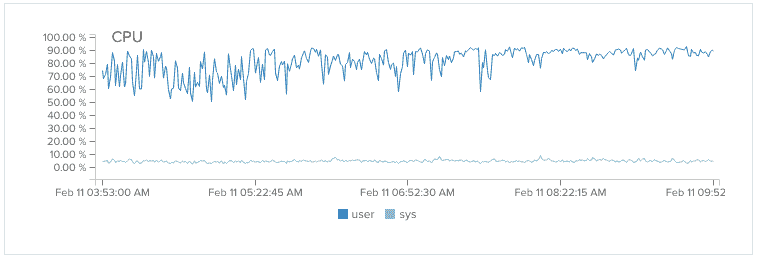
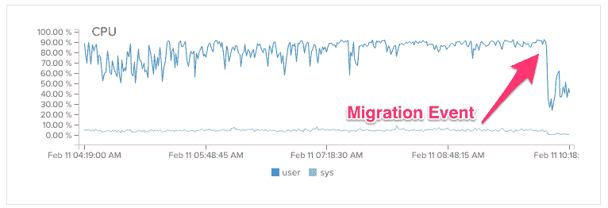

# 大量的数据

> 原文：<https://www.freecodecamp.org/news/a-flood-of-data-714f287d75a0/>

作者:伯克利·特鲁

# 大量的数据

由于大量高度活跃的露营者，自由代码营的数据每个月都在翻倍。这种数据的上升趋势暴露了我们代码库中的几个弱点。

15 个月前开始时只是一个小小的努力，现在已经成长为一个充满活力的开源社区。近 300 名贡献者已经介入，帮助我们快速构建功能。

和往常一样，保持这种惊人的发展速度是要付出代价的。我们已经欠了很多技术债。

承担技术债务就像玩 Jenga——你可以把塔建得越来越高，但要以稳定性为代价。迟早，你必须偿还你的技术债务，否则你的塔会倒塌。

上周，我们的技术债务回来咬我们的后端——无论是字面上还是象征性的。

在高峰时期，我们的 MongoDB 服务器达到了最大容量，它们向我们的节点服务器来回发送数据的速度慢得像爬行一样。我们需要尽快解决这个问题。但是首先，我们必须找出是什么导致了这个问题。

Our MongoDB Pegging the CPU

我们最初是在睡眼惺忪的状态下编写大部分后端的。我们没有花时间优化我们的查询。相反，我们选择关注那些我们认为会更直接影响我们用户体验的功能。

我们审计了我们的代码库，发现了大量频繁、低效的数据库写入。例如，每次露营者完成一个挑战，我们会对他们的用户实例进行适当的修改，然后调用“保存”动作。这导致整个用户对象从我们的节点服务器发送到我们的 MongoDB 服务器，然后 MongoDB 服务器必须协调所有数据。

最初这不是问题，因为我们的大多数用户对象都很小。但是当我们添加功能时，用户对象的大小急剧膨胀，导致更多的数据来回流动。

我们还保存了营员提交的每个解决方案。这导致了更大的 completedChallenge 阵列，从而进一步加剧了来回切换。

最重要的是，这意味着一些露营者不得不在同一个挑战的多个解决方案中寻找他们想要参考的解决方案。虽然这对于某些人来说可能是有趣的练习，但是它分散了实际编码和构建项目的注意力。

我们的解决方案包括两个步骤:

1.  找到导致数据库写入的高流量 API 端点，并将它们从“保存”操作更改为“更新”操作(这样可以最小化通过网络发送的数据量)。
2.  将我们存储已完成挑战的方式从巨型阵列转变为键值映射。

这样，一个露营者对每个挑战只能有一个解决方案。这极大地减小了 completedChallenges 对象的大小。

我们在一个周四的下午进行了修复，尽管当时我们有大约 400 个并发的露营者。这是一场赌博，但它得到了回报。我们立即看到了 CPU 使用率的提高。

The immediate result

重要的一点是:如果您的应用程序似乎越来越慢，这很可能是由低效的数据库查询引起的。

如果您能够找到并解决这些问题，您就能够推迟昂贵的基础设施扩展，同时保持用户期望的速度。