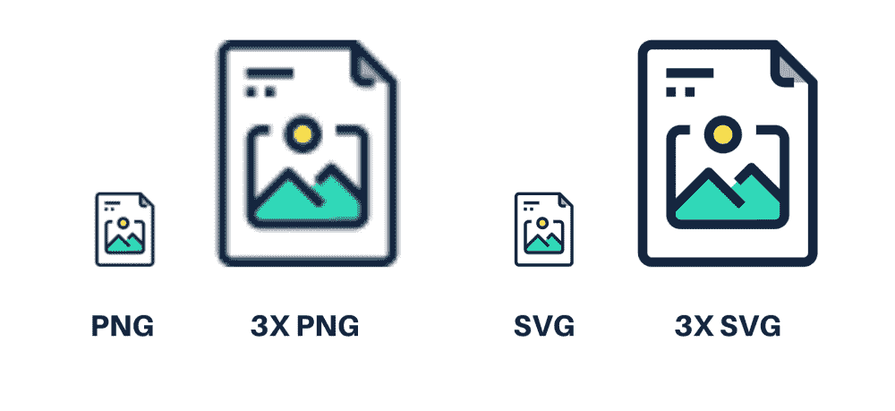
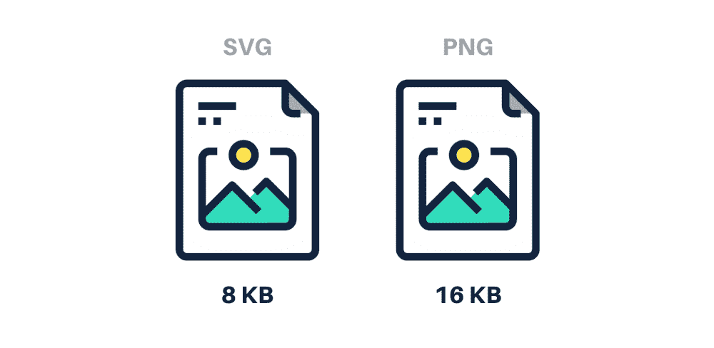
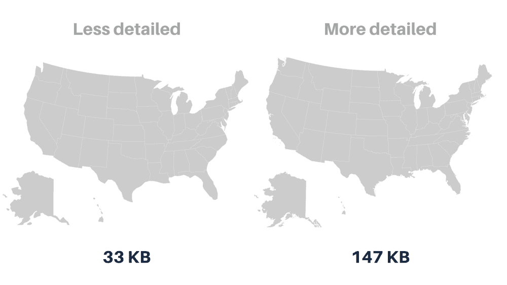
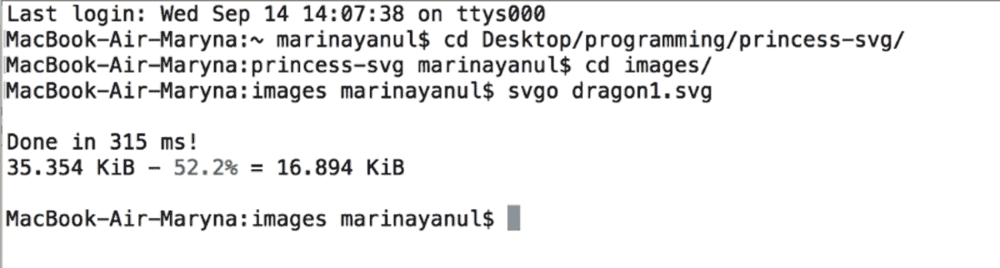
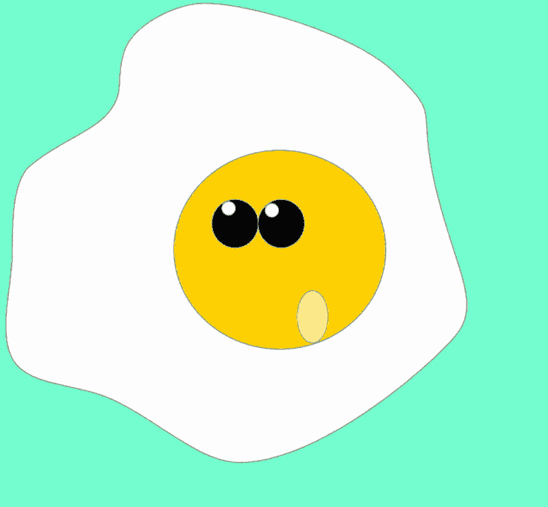

# 为什么你应该使用 SVG 图像:如何动画你的 SVG，使他们快如闪电

> 原文：<https://www.freecodecamp.org/news/a-fresh-perspective-at-why-when-and-how-to-use-svg/>

## **我们为什么要使用 SVG？**

web 开发部门正在快速发展，SVG(可缩放矢量图形)图像变得越来越流行。作为矢量图像，SVG 由定义直线和曲线的位置和颜色的数学公式组成，这些直线和曲线构成了 XML 格式的图形形状和文本。SVG 用于图标、徽标、图形设计和字体。

一旦考虑到 SVG 提供的优势，使用 SVG 是一个简单的选择。对于客户来说，您可以在任何设备上获得卓越的质量。对于作为开发人员的我们来说，使用 SVG 的理由甚至更多。

现在让我们讨论一下 SVG 的一些好处。

### **1。基于文本的格式**

SVG 元素包含文本，这大大提高了网站的可访问性。但是主要的优点是这些文本被搜索引擎索引。用户可以通过谷歌找到一个 SVG 文件。

### **2。可扩展性**

SVG 图像的质量不依赖于分辨率。与其他格式或图标字体的图像不同，SVG 在任何屏幕尺寸的任何设备上看起来都非常清晰。可伸缩性还意味着，如果在整个网站中使用相同的图像，但大小不同，则使用单个 SVG。您不必像 PNG 那样创建它的多个副本。相反，您可以嵌入相同的图像，并直接在 SVG 代码中定义它的大小。

### **3。高性能**

如果您优先考虑性能，您应该使用 SVG。使用 SVG，不需要 HTTP 请求来加载图像文件。页面加载速度更快，因为它没有要下载的文件。更快的加载时间意味着更好的网页性能和更高的搜索引擎排名。反过来，它改善了用户体验。

### **4。小文件大小**

简单 SVG 文件的大小由其包含的颜色、图层、渐变、效果和遮罩来定义。PNG 或任何其他光栅图形文件的大小由它所包含的像素数来定义。PNG 图像越大，尺寸就越大。但是 SVG 图标却不是这样。此外，SVG 也可以优化，我将在本文后面讲述如何优化。

### **5。众多编辑和动画机会**

与光栅图像不同，矢量图像可以在特殊的矢量绘图程序中编辑，也可以直接在文本编辑器中编辑。你也可以直接通过 CSS 编辑 SVG 图标的颜色和大小。至于制作 SVG 动画，可以借助 SMIL、Web Animations API、WebGL 或者 CSS 动画来完成。向下滚动以了解更多关于 SVG 图像的 CSS 动画。

### **6。与 HTML、XHTML 和 CSS 的集成**

根据 [W3C](https://dev.w3.org/SVG/proposals/svg-html/svg-html-proposal.html) 的说法，SVG 被设计成“集成和扩展其他著名的开放网络平台技术，如 X/HTML、CSS 和 Javascript”。因此，与不同的图像格式不同，这种格式可以很容易地与其他文档和技术集成。

### **7。W3C 文档对象模型支持**

SVG 得到了越来越多的社区支持。 [万维网联盟](https://www.w3.org/) (W3C)一直宣称互联网离不开矢量图像。这个组织基本上是 [创建了 SVG 格式](https://www.w3.org/2002/04/svg11-pressrelease) ，他们现在也积极支持它。

## **SVG 有哪些不便之处？**

大量的小部件使得 SVG 格式的使用变得不合理。图像包含的部分越多，它的大小就越大。

比如这里的就是美国的两张 SVG 地图。第二个比第一个稍微详细一点。但是，更高层次的细节使文件大小几乎增加了五倍，从 147 KB 增加到 33 KB。如果这张地图不是单色的，增幅会大得多。

如果图片是线性的并且包含一些颜色，SVG 是一个解决方案。但是，如果细节很重要，并且有很多，PNG 或 JPEG 可能更合适。

还要注意，SVG 不能用于照片。如果你在网站上使用照片，SVG 不是最好的选择。你肯定应该选择光栅图像格式。

## **如何优化 SVG 图像**

当渲染矢量格式时，我们必须编写一些额外的 SVG 代码。最终结果应该使用不同的服务进行优化。大多数时候，为了优化 SVG，我使用一个 [Node.js](https://keenethics.com/services-web-development-node) 工具 [SVGO](https://github.com/svg/svgo) 。它非常容易使用，而且不需要把图片上传到其他网站。

Example of SVG optimization using SVGO 

## **如何制作 SVG 动画**

web 上的 SVG 图形可以通过多种方式制作动画:

1.  SMIL，这是本地 SVG 动画规范
2.  Web Animations API，这是一个本地 JavaScript API，允许您创建更复杂的连续动画，而无需加载任何外部脚本
3.  WebGL
4.  CSS 动画

让我们考虑最后一个。

使用 CSS 动画是为了避免让你的服务因制作图标和加载器动画的大型库而过载。

要查看 SVG 的示例，请查看动画蛋黄 ，其图形设计最初是用草图绘制的。

正如你在这里看到的，我使用关键帧动画语法来制作动画。它是通过按 id (0%)、过渡(50%)和最终位置(100%)设置元素的初始位置来实现的。为了实现平滑的动画，初始值和最终值是相等的。

以下是使用 CSS 方法制作 SVG 动画的一些好处:

1.  您不需要外部库。
2.  预处理器(比如 Sass 或更少)允许你创建变量。
3.  您可以将 onAnimationEnd 和其他一些动画挂钩与原生 JavaScript 一起使用。
4.  这种方法很容易用于响应式 web 设计开发，因为您可以通过媒体查询来修改动画。

使用 CSS 动画的缺点如下:

1.  你不能产生一些复杂的物理效果，这将使动画更加真实。
2.  如果调整时间，需要进行大量的重新计算。
3.  手机上的 CSS 和 SVG 图形有时需要奇怪的技巧。

## **例如**

尽管如此，我们可以借助简单琐碎的 CSS 动画制作一些有趣的项目。例如，我用 HTML、CSS 和一点 JavaScript 制作了一个简单的游戏视频。所有的 SVG 都是草图。这个游戏的目标是拯救公主。在任何情况下，只需点击。你可以在我的 [GitHub](https://github.com/maryna-yanul/duck-the-princess/) 找到项目。

## **总结**

SVG 是一种很好的图像格式。它们是可伸缩的、轻量级的、基于文本的、高效的。它们易于编辑、制作动画和集成。重要的是，除了 Internet Explorer 8 和 Android 2.3 之外，几乎任何浏览器都支持它们。

虽然学习使用可伸缩的矢量图形图像可能需要一些时间，但是考虑到 SVG 的好处，这是一项值得的投资。

## 你对软件项目有想法吗？

我的公司 KeenEthics 是一个由经验丰富的 web 应用程序开发人员组成的团队。如果您需要类似项目的免费评估，请随时与**联系。**

你可以在我的博客上读到更多类似的文章。请允许我建议您阅读[用户测试的价值](https://keenethics.com/blog/the-value-of-user-testing)或 [7 种情况下不应该使用 Docker](https://www.freecodecamp.org/news/7-cases-when-not-to-use-docker/) 。

## 附言

此外，我想对与我合著这篇文章的 [Maryna Yanul](https://www.linkedin.com/in/yanul/) 以及坚持到最后的读者们说声“谢谢”!

在 KeenEthics 博客上发布的原始文章可以在这里找到:[关于为什么、何时以及如何使用 SVG 的全新视角](https://keenethics.com/blog/1478674800000-svg-animation-scalable-vector-graphics)。