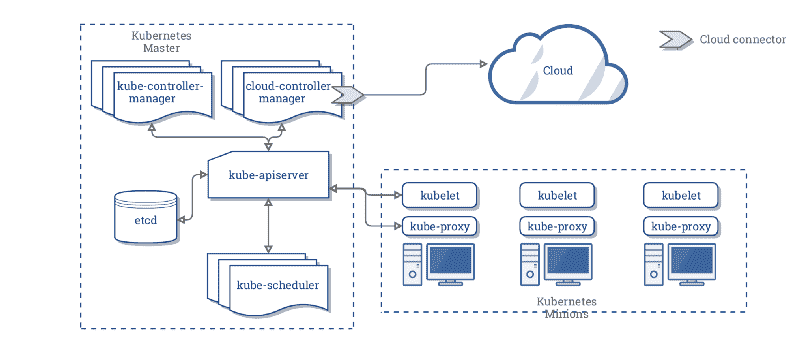
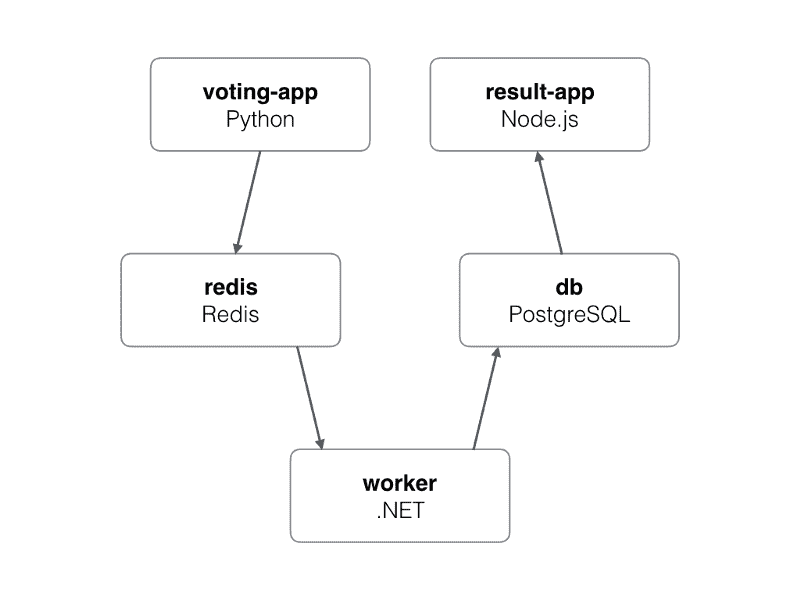
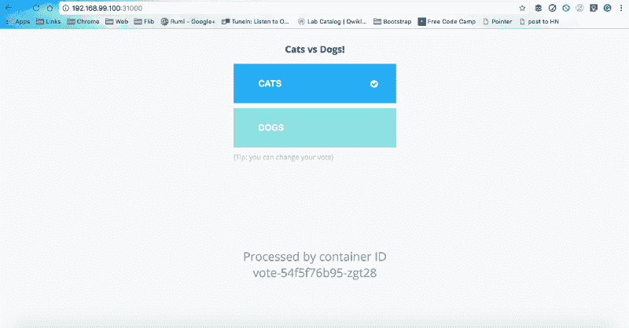
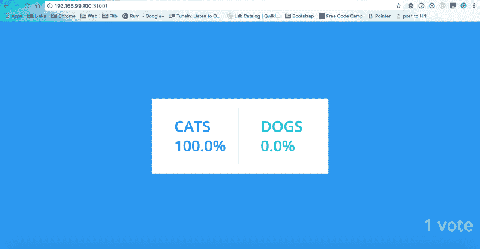

# 对 Kubernetes 的友好介绍

> 原文：<https://www.freecodecamp.org/news/a-friendly-introduction-to-kubernetes-670c50ce4542/>

Kubernetes 是目前 DevOps 世界中最令人兴奋的技术之一。在过去的几年里，它吸引了很多关注。它一夜成名的原因是强大的集装箱。

Docker Inc .以其完美的惊人产品营销将容器带到了聚光灯下。Docker 为容器的广泛使用奠定了基础，尽管容器技术已经超越了它。然而，由于 Docker，Linux 容器的使用变得更加普遍，为容器编排引擎奠定了基础。

进入 Kubernetes——由谷歌开发，利用多年来在数十亿个容器上运行世界级基础设施的经验。Kubernetes 一炮而红，从今年开始，Docker Inc .将 Kubernetes 打包成 Docker Swarm 之外的一个额外的编排引擎。

从现在开始，Kubernetes 将成为 Docker 社区和 Docker 企业版的一部分。听起来很酷，是吧？将两个世界的精华打包成一个二进制文件。

### 鸟瞰概述

Kubernetes，k8s，或 kube，是一个自动化容器操作的开源平台。它消除了大多数现有的手动流程，包括部署、扩展和管理容器化的应用程序。唷！那工作量很大。

使用 Kubernetes，您可以将运行容器的主机集群在一起。Kubernetes 帮助您管理这些集群。这些集群可以跨越公共云、私有云和混合云——谁知道有一天会跨越星球大战宇宙。

Kubernetes 是由谷歌的工程团队开发设计的。谷歌长期以来一直是容器技术的贡献者。除了对容器技术的使用直言不讳，Kubernetes 还是谷歌云服务产品背后的技术。

谷歌每周部署超过 20 亿个容器。所有这些都由一个名为[博格](http://blog.kubernetes.io/2015/04/borg-predecessor-to-kubernetes.html)的内部平台驱动(听起来更像是来自魔多的兽人军阀，但不是)。博格是库伯内特的前身。谷歌多年来与博格合作的经验教训成为了 Kubernetes 背后的指导力量。

Kubernetes 让与部署和管理容器化应用程序相关的一切都变得很有趣。Kubernetes 自动执行部署、回滚，并监控已部署服务的健康状况。这可以在事情变糟之前防止糟糕的推广。

此外，Kubernetes 可以根据利用率增加或减少服务，确保您只在需要的时候、需要的地方运行您需要的服务。像容器一样，Kubernetes 允许我们管理集群，使设置能够被版本控制和复制。

这是一个鸟瞰图，但不要就此打住。Kubernetes 有比看起来更多的东西(这也是我写这篇文章的原因)。

### Kubernetes 是如何工作的？



Reference: [https://kubernetes.io/docs/concepts/architecture/cloud-controller/](https://kubernetes.io/docs/concepts/architecture/cloud-controller/)

与 Docker 的编排解决方案 Docker Swarm 相比，Kubernetes 是一个非常复杂的系统。为了理解 Kubernetes 是如何工作的，我们需要理解它的基本概念和原理。

### 理想的状态

理想状态是 Kubernetes 的核心概念之一。您可以自由定义容器在 pod 中的执行状态。如果由于某种原因，容器停止运行，Kubernetes 会根据所需状态的行重新创建 Pod。

Kubernetes 严格确保所有在集群中运行的容器总是处于期望的状态。这是由 Kubernetes Master 执行的，它是 Kubernetes 控制平面的一部分。您可以使用直接与集群交互的`**kubectl**`来通过 Kubernetes API 设置或修改期望的状态。

### Kubernetes 对象

如 [Kubernetes 文档](https://kubernetes.io/docs/concepts/overview/working-with-objects/kubernetes-objects/)中所定义:

> Kubernetes 对象是一个“意图记录”——一旦你创建了对象，Kubernetes 系统将不断地工作以确保对象存在。通过创建一个对象，您可以有效地告诉 Kubernetes 系统您希望集群的工作负载是什么样子；这是您的集群所需的状态。

系统中实体在任何给定时间点的状态都由 Kubernetes 对象表示。Kubernetes 对象还充当容器接口上的附加抽象层。您现在可以直接与 Kubernetes 对象的实例进行交互，而不是与容器进行交互。基本的 Kubernetes 对象如下:

*   [**吊舱**](https://kubernetes.io/docs/concepts/workloads/pods/pod-overview/) 是节点**上最小的可展开单元。**这是一组必须一起运行的容器。通常，但不一定，一个 Pod 通常包含一个容器。
*   [**服务**](https://kubernetes.io/docs/concepts/services-networking/service/) 用于定义一组逻辑 pod**以及用于访问它们的相关策略。**
*   **[**卷**](https://kubernetes.io/docs/concepts/storage/volumes/) 本质上是一个目录，所有在 Pod 中运行的容器都可以访问它。**
*   **[**命名空间**](https://kubernetes.io/docs/concepts/overview/working-with-objects/namespaces/) 是由物理集群支持的虚拟集群。**

**Kubernetes 提供了许多控制器。这些控制器建立在基本的 Kubernetes 对象之上，并提供额外的特性。Kubernetes 控制器包括:**

*   **[**ReplicaSet**](https://kubernetes.io/docs/concepts/workloads/controllers/replicaset/)*确保指定数量的 Pod 副本在任何给定时间运行。***
*   ***[**部署**](https://kubernetes.io/docs/concepts/workloads/controllers/deployment/) 用于将当前状态改变到所需状态。***
*   ***[**statefullset**](https://kubernetes.io/docs/concepts/workloads/controllers/statefulset/)*用于确保对部署排序和卷访问等的控制。****
*   ****[**DaemonSet**](https://kubernetes.io/docs/concepts/workloads/controllers/daemonset/)*用于在集群的所有节点或指定节点上运行 Pod 的副本。*****
*   *****[**Job**](https://kubernetes.io/docs/concepts/workloads/controllers/jobs-run-to-completion/)*用于执行一些任务，并在成功完成自己的工作或经过一段时间后退出。******

### *****Kubernetes 控制平面*****

*******Kubernetes 控制平面**工作以使集群的当前状态与您想要的状态相匹配。为此，Kubernetes 自动执行各种任务——例如，启动或重新启动容器，扩展给定应用程序的副本数量，等等。*****

*****如 [Kubernetes 文档](https://kubernetes.io/docs/concepts/#kubernetes-control-plane)中所定义:*****

> *****Kubernetes 控制平面的各个部分，如 Kubernetes 主进程和 *kubelet* 进程，控制着 Kubernetes 如何与集群通信。控制平面维护系统中所有 Kubernetes 对象的记录，并运行连续的控制循环来管理对象的状态。在任何给定时间，控制平面的控制循环将响应集群中的变化，并努力使系统中所有对象的实际状态与您定义的所需状态相匹配。*****

****Kubernetes 控制平面执行跨集群维护所需状态的任务。它记录对象状态，并连续运行控制循环来检查对象的当前状态是否与所需状态匹配。你可以把它想象成政府管理国家。****

### ****库伯内特大师****

****作为 Kubernetes 控制平面的一部分，Kubernetes 主服务器致力于在整个集群中持续保持所需的状态。`**kubectl**`命令是一个通过 Kubernetes API 与集群的 Kubernetes 主服务器通信的接口。就当是负责维护治安的警察部队吧。****

****如 [Kubernetes 文档](https://kubernetes.io/docs/concepts/#kubernetes-master)中所定义:****

> *****“主”是指管理集群状态的进程的集合。通常，这些进程都在集群中的单个节点上运行，该节点也称为主节点。为了可用性和冗余性，还可以复制主服务器。*****

****Kubernetes 主节点在集群中一个或多个主节点上运行的三个进程的帮助下控制和协调集群中的所有节点。集群中的每个 Kubernetes 主服务器都运行这三个进程:****

1.  ****[**kube-API server**](https://kubernetes.io/docs/admin/kube-apiserver/)**:**整个集群的单点管理。API 服务器实现了与工具和库通信的 RESTful 接口。`**kubectl**`命令直接与 API 服务器交互。****
2.  ****[**kube-controller-manager**](https://kubernetes.io/docs/admin/kube-controller-manager/)**:**通过管理不同种类的控制器来调节集群的状态。****
3.  ****[**kube-scheduler**](https://kubernetes.io/docs/admin/kube-scheduler/)**:**跨集群中的可用节点调度工作负载。****

### ****Kubernetes Nodes****

****Kubernetes 节点基本上是运行您的工作负载的集群中的工作机(虚拟机、物理机、裸机服务器等)。这些节点由 Kubernetes master 控制，并被持续监控以保持应用程序的期望状态。以前，他们被称为**爪牙**(而不是 Gru 的搞笑黄色忠诚军)。与主节点类似，集群中的每个 Kubernetes 节点运行两个进程:****

1.  ****[**kubelet**](https://kubernetes.io/docs/admin/kubelet/) 是节点和 Kubernetes 主节点之间的通信接口。****
2.  ****[**kube-proxy**](https://kubernetes.io/docs/admin/kube-proxy/) 是一个网络代理，它在每个节点上反映 Kubernetes API 中定义的服务。它还可以执行简单的 TCP 和 UDP 流转发。****

### ****投票应用程序****

****让我们通过在 Kubernetes 上实际运行一个应用程序来加快速度。但是，在您能够在 Kubernetes 的奇妙世界中更进一步之前，首先您需要在本地安装并运行 Kubernetes。所以，让我们从这个开始。如果您安装了 Kubernetes 和 MiniKube，请跳过此步骤。****

#### ****正在安装 kubernetes****

****Kubernetes 现已推出 17.12 版本的 Docker 社区版。+.如果你没有安装社区版，你可以在这里下载[。](https://www.docker.com/community-edition)****

#### ****安装 MiniKube****

****要在本地运行 Kubernetes，您需要安装 [MiniKube](https://github.com/kubernetes/minikube) 。它创建本地虚拟机并运行单节点集群。不要想在上面运行您的生产集群。它最好仅用于开发和测试目的。****

#### ****单节点集群****

****要运行单节点集群，我们只需要运行`**minikube start**`命令。瞧，一个虚拟机、一个集群和 Kubernetes 正在运行。****

```
**`$ minikube start
Starting local Kubernetes v1.10.0 cluster...
Starting VM...
Getting VM IP address...
Moving files into cluster...
Setting up certs...
Connecting to cluster...
Setting up kubeconfig...
Starting cluster components...
Kubectl is now configured to use the cluster.
Loading cached images from config file.`**
```

****要验证您的设置是否成功，运行`kubectl version`来检查您机器上运行的 Kubernetes 版本。****

```
**`$ kubectl version
Client Version: version.Info{Major:"1", Minor:"9", GitVersion:"v1.9.1", GitCommit:"3a1c9449a956b6026f075fa3134ff92f7d55f812", GitTreeState:"clean", BuildDate:"2018-01-04T20:00:41Z", GoVersion:"go1.9.2", Compiler:"gc", Platform:"darwin/amd64"}
Server Version: version.Info{Major:"1", Minor:"10", GitVersion:"v1.10.0", GitCommit:"fc32d2f3698e36b93322a3465f63a14e9f0eaead", GitTreeState:"clean", BuildDate:"2018-03-26T16:44:10Z", GoVersion:"go1.9.3", Compiler:"gc", Platform:"linux/amd64"}`**
```

#### ****投票应用程序最终****

****快进到投票应用程序，现在您已经在本地机器上安装了 Kubernetes。这是一个基于微服务架构的简单应用程序，由 5 个简单的服务组成。****

****

Voting app architecture [[https://github.com/docker/example-voting-app](https://github.com/docker/example-voting-app)]**** 

1.  ******Voting-App** :用 Python 编写的应用程序前端，供用户投票使用。****
2.  ******Redis** :内存数据库，用作中间存储。****
3.  ******工人**:。Net 服务，用于从 Redis 获取选票并存储在 Postgres 数据库中。****
4.  ******DB** : PostgreSQL 数据库，用作数据库。****
5.  ******Result-App**:node . js 编写的应用程序前端，显示投票结果。****

****Git `clone`和`cd`进入投票 app repo。****

****[**Docker samples/Example-voting-app**](https://github.com/dockersamples/example-voting-app)
[*Example-voting-app—Example Docker Compose app*github.com](https://github.com/dockersamples/example-voting-app)****

****文件夹“k8s-specifications”包含投票应用程序服务的 Kubernetes yaml 规范。对于每个服务，它有两个 yaml 文件:一个服务文件和一个部署文件。服务文件定义了一组逻辑单元和围绕它们的策略。下面是投票应用程序生成的服务文件。****

```
**`apiVersion: v1
kind: Service
metadata:
  name: result
spec:
  type: NodePort
  ports:
  - name: "result-service"
    port: 5001
    targetPort: 80
    nodePort: 31001
  selector:
    app: result`**
```

****部署文件用于定义应用程序的期望状态，例如在任何给定时间点应该运行的副本数量。下面是投票应用程序生成的部署文件。****

```
**`apiVersion: extensions/v1beta1
kind: Deployment
metadata:
  name: result
spec:
  replicas: 1
  template:
    metadata:
      labels:
        app: result
    spec:
      containers:
      - image: dockersamples/examplevotingapp_result:before
        name: result`**
```

****是时候创建服务和部署对象了——小菜一碟。****

```
**`$ kubectl create -f k8s-specifications/
deployment "db" created
service "db" created
deployment "redis" created
service "redis" created
deployment "result" created
service "result" created
deployment "vote" created
service "vote" created
deployment "worker" created`**
```

****这就对了。您的应用已成功部署到单节点集群，您可以列出正在运行的 pod 和服务。****

```
**`$ kubectl get pods
NAME                      READY     STATUS    RESTARTS   AGE
db-86b99d968f-s5pv7       1/1       Running   0          1m
redis-659469b86b-hrxqs    1/1       Running   0          1m
result-59f4f867b8-cthvc   1/1       Running   0          1m
vote-54f5f76b95-zgwrm     1/1       Running   0          1m
worker-56578c48f8-h7zvs   1/1       Running   0          1m
$ kubectl get svc
NAME         TYPE        CLUSTER-IP       EXTERNAL-IP   PORT(S)          AGE
db           ClusterIP   10.109.241.59    <none>        5432/TCP         2m
kubernetes   ClusterIP   10.96.0.1        <none>        443/TCP          23m
redis        ClusterIP   10.102.242.148   <none>        6379/TCP         2m
result       NodePort    10.106.7.255     <none>        5001:31001/TCP   2m
vote         NodePort    10.103.28.96     <none>        5000:31000/TCP   2m`**
```

****看看猫和狗的战争，猫总是赢。猫的设计很可爱，他们的 IDC 态度是一大胜利。但这是另一个时间的讨论。****

****回到此刻，你的投票应用暴露在端口**30001**上，结果应用暴露在端口 **31001** 上。您可以使用 localhost:port 来访问它，或者使用 minikube 正在运行的 IP，您可以使用`**minikube ip**`命令来获得它。****

****************

### ******库柏叶******

****既然你们在阅读这些文本块时表现出了极大的耐心，现在让我向你们展示 Kubernetes 备忘单(它本身可能是一篇全新的文章，但无论如何！):****

****Minikube 命令:****

```
**`# Start Minikube server
$ minikube start
# Get the Minikube IP
$ minikube ip`**
```

****版本信息:****

```
**`$ kubectl version             #Get kubectl version
$ kubectl cluster-info        #Get cluster info`**
```

****创建对象:****

```
**`$ kubectl create -f ./file.yml
$ kubectl create -f ./file1.yml -f ./file2.yaml
$ kubectl create -f ./dir
$ kubectl create -f http://www.fpaste.org/279276/48569091/raw/`**
```

****查看和查找资源:****

```
**`# List all services in the namespace
$ kubectl get services
# List all pods in all namespaces
$ kubectl get pods --all-namespaces
# List all pods in the namespace, with more details   
$ kubectl get pods -o wide
# List a particular replication controller
$ kubectl get rc <rc-name>
# List all pods with a label env=production
$ kubectl get pods -l env=production`**
```

****列出按名称排序的服务:****

```
**`$ kubectl get services --sort-by=.metadata.name`**
```

****修改和删除资源:****

```
**`$ kubectl label pods <pod-name> new-label=awesome
$ kubectl annotate pods <pod-name> icon-url=http://goo.gl/XXBTWq
$ kubectl delete pod pingredis-XXXXX`**
```

****放大和缩小:****

```
**`$ kubectl scale --replicas=3 deployment nginx`**
```

****与跑步 pod 互动:****

```
**`$ kubectl logs <pod-name>
# Runs a tailf log output
$ kubectl logs -f <pod-name>
# Run pod as interactive shell
$ kubectl run -i --tty busybox --image=busybox -- sh
# Attach to Running Container
$ kubectl attach <podname> -i
# Forward port of Pod to your local machine
$ kubectl port-forward <podname> <local-and-remote-port>
# Forward port to service
$ kubectl port-forward <servicename> <port>               
# Run command in existing pod (1 container case)
$ kubectl exec <pod-name> -- ls /
# Run command in existing pod (multi-container case)
$ kubectl exec <pod-name> -c <container-name> -- ls /`**
```

****DNS 查找:****

```
**`$ kubectl exec busybox -- nslookup kubernetes
$ kubectl exec busybox -- nslookup kubernetes.default
$ kubectl exec busybox -- nslookup kubernetes.default.svc.cluster.local`**
```

****创建和公开部署:****

```
**`$ kubectl run nginx --image=nginx:1.9.12
$ kubectl expose deployment nginx --port=80 --type=LoadBalancer`**
```

### ****摘要****

****Kubernetes 非常令人兴奋，非常酷，很可能是容器编排的未来。这项技术很棒，如果你对容器感兴趣，或者只是像我一样的爱好者，它值得你投入时间。Kubernetes 是一个非常强大的容器编排引擎，它可以用来增强云容器化策略，因为它旨在自动部署、扩展和操作容器。****

****好的一面是，Kubernetes 可以轻松地与任何云产品组合集成，无论是公共云、私有云、混合云还是多云。像 AWS 和 Google 这样的云供应商提供托管的 Kubernetes 服务，如 Kubernetes (EKS)的[弹性容器服务](https://aws.amazon.com/eks/)和 [Google Kubernetes 引擎(GKE)](https://cloud.google.com/kubernetes-engine/) 。另一方面，Kubernetes 比 Docker 自己的容器编排引擎 Docker Swarm 要复杂得多。****

****这里所有的信息都只是为了让你湿湿脚。如果你想在令人敬畏的库伯内特海洋中潜水，那就来吧。****

****[**【ramitsurana/awesome-kublantes】**](https://github.com/ramitsurana/awesome-kubernetes)
*【awesome-kublantes-a 固化清单，适用于 awesome kublantes:ship::tada:*github . com****

****当你从深海潜水中出来后，你可能还想去体验一下 Kubernetes。在与 Kubernetes labs 的游戏中，带 Kubernetes 兜风或让它带你兜风。****

****[**与 Kubernetes 一起玩**](http://labs.play-with-k8s.com/)
[*与 Kubernetes 一起玩是一个由 Docker 提供、Tutorius 创建的实验室网站。和 Kubernetes 一起玩是一个游乐场……*labs.play-with-k8s.com](http://labs.play-with-k8s.com/)****

****我希望这篇文章有助于理解 Kubernetes。我很想听听你们是如何在项目中使用 Kubernetes 的。如果它增加了你的知识，并帮助它达到更多的人鼓掌。****