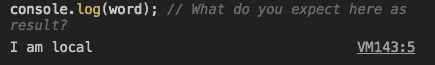
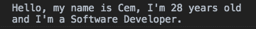
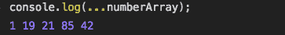
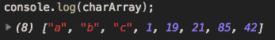
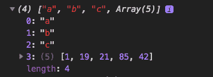

# ECMAScript 2015 (ES6)概述

> 原文：<https://www.freecodecamp.org/news/a-general-review-of-ecmascript-2015-es6-f524d5f8c095/>

ES6 是 **Javascript** 的**更新的标准化/版本，于 2015 年发布。学习 ES6 很重要，因为它有许多新特性，可以帮助开发人员更容易地编写和理解 JavaScript。像 Angular 和 React 这样的现代框架是用 ES6 开发的。它的语法也不同于传统的 JavaScript。**

那么 ES6 有什么新功能呢？让我们看一看。

### 1.让关键字保持不变

ES6 为变量声明带来了两个新的关键字:`let`和`const`。

我们过去在 JavaScript 中只有`var`关键字来声明变量:

```
var name = 'Cem';
```

在 ES6 中，我们使用`let`关键字。

#### 为什么用 let 代替 var？

因为`var` 的用法导致**范围**出现问题。例如，让我们用`var`全局和局部地定义一个字符串:

```
var word = 'I am global';

if(true) {  
  var word = 'I am local'; 
}

console.log(word); // What do you expect here as result?
```

*console.log* 应该打印出**全局**字符串:`'I am global'`。因为第二个声明`var word = 'I am local'`是一个**本地**字符串并且 *console.log* 在 *if 块*之外:



**Surprisingly, the local variable has printed.**

出乎意料的是，我们用`var`定义的局部变量忽略了 *if 块*，并打印到控制台。为了防止这个问题，ES6 给我们带来了一个新的关键词: **let。**

让我们用`let`再试一次:

```
let word = 'I am global';

if(true) {
  let word = 'I am local'; 
}

console.log(word); // This time what do you expect?
```


**The result of using ‘let’**

这次**全局**字符串已经如我们所料打印出来，`let`解决了范围问题。

#### 另一期的“var”报表

我们都可以用`var`和`let`重新赋值变量。但是，`let`不允许我们**重新声明**同样的变量:

```
var number = 1;
var number = 2;

console.log(number); // No errors here, 2 gets printed
```

让我们用**让**再试一次:

```
let number = 1;
let number = 2;

console.log(number); // let doesn't allow redeclaration
```


**Re-declaration of let throws an error:**

在 ES6 中仍然可以使用 **var** ，但不建议使用。

#### const 关键字

让我们继续使用`const`关键字。`const`表示*常数*。

> "不变的东西:不变的东西."

当我们声明一个常量变量时，我们不能在以后改变它。例如，**出生日期**是一个常数。

```
const birthYear = 1990;

birthYear = 2000; // You cannot re-assign a constant variable
```

如果您试图更改或重新声明一个 *const* 变量，它会给出一个错误:


**Re-assignment of a const variable throws an error**

使用`const`可以提高你的代码质量。只有当你确定你的变量以后不会改变的时候才使用它。

### 2.模板文字

模板文字是 ES6 的新**语法之一，**用于创建字符串和打印动态变量。

*   要创建字符串，请使用反引号**(`)**而不是单引号或双引号:

```
let oldWay = 'A word';  // JS Way

let newWay = `A word`;  // ES6 Way
```

*   使用插值语法: **${ expression }** 简化字符串连接并创建动态变量

让我们定义一些变量，并使用新旧方法来打印它们:

```
let name = 'Cem';
let age = 28;
let profession = 'Software Developer';
```

前面的 JavaScript 道:

```
console.log("Hello, my name is " + name + ", I'm " + age + " years old and I'm a " + profession);
```



**Output with + signs**

ES6 道:

```
console.log(`Hello, my name is ${name}, I'm ${age} years old and I'm a ${profession}.`);
```


**Output with template literals**

我们可以用模板文字做更多的事情，你可以查看[这里的](https://css-tricks.com/template-literals/)了解更多细节。

### 3.箭头功能

定义函数时，箭头函数使用粗箭头`=>`而不是关键字`function`:

JavaScript 函数:

```
var sum = function addition (firstNum, secondNum) {
    return firstNum + secondNum;
}
```

ES6 功能:

```
let sum = (firstNum, secondNum) => { return firstNum + secondNum };
```

我们也可以省略`return`关键字，除非我们的函数返回一个**代码块。**

因为这篇文章是关于 ES6 的概述，所以我不会深入研究箭头函数。你可以在这里获得更多关于箭头功能[的信息。](https://developer.mozilla.org/en-US/docs/Web/JavaScript/Reference/Functions/Arrow_functions)

### 4.Spread 和 Rest 运算符

你见过编程中的三个点`...`吗？这被称为**扩展语法**。

#### 扩展运算符—数组的用法

我们有一组数字:`let numberArray = [1, 19, 21, 85, 42]`

我们可以使用扩展运算符:

*   要从数组中获取值(数字):

```
console.log(...numberArray);
```



**Numbers are now out of the array**

使用 spread 运算符不会影响数组本身。

*   要将一个数组与另一个数组连接起来:

```
let charArray = ['a','b','c'];

charArray.push(...numberArray);

console.log(charArray);
```



**values in numberArray added to charArray**

否则， **numberArray** 将作为第四个元素直接添加到 **charArray** 中:



**Array in an array, without the spread operator**

#### Rest 运算符—函数的用法

三个点`...`的其他用法是表示功能参数。

在三个点之后给出的一个**参数**变成一个**数组**，它将包含其余的参数，称为 **rest 操作符。**

```
function count (...counter) { // parameter becomes an array
  console.log(counter.length);
}

count(); // 0
count(10); // 1
count(1, 10, 24, 99, 3); // 5
```

由于`...counter`现在是一个数组，我们可以得到它的长度。给予`count()`函数的所有参数现在都是**计数器**数组的值:


**Number of Parameters = Length of Array**

### 5.进口和出口

ES6 的另一个新特性是它允许我们**导入&导出**我们的类、函数，甚至变量到代码的其他部分(文件)。当我们想把代码分成更小的片段时，这种方法对我们程序员来说帮助很大。它增加了项目代码的可读性和可维护性。

让我们看看它是如何工作的:

首先，我们创建一个 ES6 函数，并用关键字`export`导出。

```
export let myFunction = () => { console.log('I am exported!'); }
```

之后，要将`myFunction`导入到另一个文件，我们需要定义它的**文件夹路径、文件名**和关键字`import`。

```
import { myFunction } from './yourFolderPath/fileName';
```

最后，调用导入文件中的函数并使用它。

```
myFunction();
```

这就是我们如何在导出和导入的帮助下将代码分解成更小的片段。我们也可以导入其他模块和服务，如 **HttpService、Router、Axios、**和 **Bootstrap** ，在安装到我们的 **node_modules** 中之后，在我们的代码中使用它们。

我在这篇文章中解释了 ES6 的一些新特性。还有许多其他功能和更多的细节，你应该看看。如果你觉得这篇文章有帮助，请分享它，这样更多的人可以阅读它。

感谢您的阅读和支持！:)