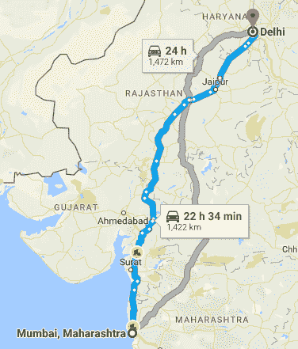

# 数据结构简介:图是如何工作的

> 原文：<https://www.freecodecamp.org/news/a-gentle-introduction-to-data-structures-how-graphs-work-a223d9ef8837/>

迈克尔·奥洛伦尼索拉

# 数据结构简介:图是如何工作的


Source: [TheNextWeb](http://thenextweb.com/facebook/2013/01/15/facebook-introduces-graph-search/)

那么，谁想在谷歌、脸书或者 LinkedIn 工作呢？除了紧张的面试过程，所有这些公司的一个共同点是他们非常依赖图形数据结构。

学了一点图表之后，你就会明白为什么了。在这篇文章结束时，你会更舒服地进入[破解编码面试](http://amzn.to/2gZdc67)——或类似的面试准备书——并解决一些网络遍历算法实践问题。

### 图表如何工作

图形是一种强大而通用的数据结构，可以轻松地表示不同类型的数据(节点)之间的真实关系。图表有两个主要部分:


*   存储数据的顶点(节点)*，即左边图像中的数字*
*   连接节点*的边(连接)，即图像*中数字之间的线

图可以是**无向**或**有向**。以上图为例，将边缘视为日常关系，区别如下:

无向图:如果 6 是 4 的朋友，那么 4 也是 6 的朋友。这种关系是双向的。

**有向图:**如果 6 暗恋 4，那不一定意味着 4 也要暗恋 6。爱情很艰难？。这些关系基于边的方向。它可以是单向的关系，也可以是双向的关系，但必须明确说明。

以下是您可以对图形执行的一些常见操作:

**新增内容**

*   `addNode` **:** 给你的图形添加顶点
*   `addEdge` **:** 在你的图形中创建两个给定顶点之间的边

**移除**

*   `removeNode` **:** 从你的图形中删除顶点
*   `removeEdge` **:** 删除图形中两个给定顶点之间的边

**搜索**

*   `contains` **:** 检查你的图形是否包含给定值
*   `hasEdge` **:** 检查图中两个给定节点之间是否存在连接

除此之外，图可以*加权*或*不加权。*所有这一切意味着顶点之间的边有一些价值或成本。最好的例子就是谷歌地图。



如你所见，孟买和德里之间有两条建议路线。但是 Google graph 算法怎么知道蓝色的是最好的选择呢？简单。为不同的路径(边)赋予与其距离相等的权重。知道了这一点，算法可以推断出一条路径比另一条路径短 50 公里，而且可能更快。

当然，也有其他因素给予权重，如延误和速度限制。但是概念是一样的。加权图允许你选择最快的路径，或阻力最小的路径(见 [Dijkstra 算法](https://en.wikipedia.org/wiki/Dijkstra%27s_algorithm))。

从这些例子中可以看出，图表可以显示几乎任何类型的关系，只要有数据和边。这就是为什么 LinkedIn、谷歌和脸书等公司如此广泛地使用图表。刚刚阅读了由[脸书](https://www.facebook.com/notes/facebook-engineering/tao-the-power-of-the-graph/10151525983993920/)写的这篇关于他们为什么在 2007 年从关系数据库过渡到图形数据库的文章。

现在你对什么是图有了基本的了解，让我们来探究一些例子。

**示例用例:**

*   代表一个社交网络
*   代表地图
*   扼杀面试问题

最后一个取决于你。如果你正准备参加编码面试，我在这篇文章的末尾提供了一些有用的资源。

同时，让我们尝试一下社交网络。

### 使用图表建立社交网络

既然脸书在某种程度上垄断了整个社交网络，我们为开发者创建一个私人社交网络怎么样？DevBook！当然，我们可以保持事情的简单，只创建一个脸书小组来代替…但是作为一个热爱好的挑战的 A 级开发人员，让我们用一个骄傲的时刻把“吻”扔出窗外。


首先，为您的图形创建存储。您意识到可能有多种方法可以表示图形数据结构，但是现在您决定使用一个列表，该列表将每个唯一的开发者存储为一个键，并将他们的所有连接存储为他们的关联值。在运行快速谷歌搜索时，你意识到你正在创建一个邻接表。

您更喜欢遵循功能模式，所以您决定走下面这条路:

```
let MakeGraph = () => {   // Function that will create our graphs  let graph = {};  return graph;}
```

```
let devBook = MakeGraph();  // Our graph representing our site
```

现在您已经有了图形表示，您需要创建一种方法，在开发人员注册时将他们添加到图形中，并存储他们将来可能拥有的任何连接。

您决定在对象上设置用户键，并使用一个具有 edges 属性的对象来保存他们的连接列表。

```
let MakeGraph = () => {     let graph = {};
```

```
 graph.addVertex = (node) => {       // add members as vertices here     //  store their connections as properties on an edges object        graph[node] = {edges:{}};  }
```

```
 return graph;}
```

```
let devBook = MakeGraph(); 
```

```
devBook.addVertex('James Gosling');devBook.addVertex('Guido Rossum');devBook.addVertex('Linus Torvalds');devBook.addVertex('Michael Olorunnisola');
```

```
// Your graph will now look like this:
```

```
{ addVertex: [Function],  'James Gosling': { edges: {} },  'Guido Rossum': { edges: {} },  'Linus Torvalds': { edges: {} },  'Michael Olorunnisola': { edges: {} } }
```

请注意，在实践中，您可能希望存储具有唯一用户 id 的记录，而不是不能被同名的其他用户覆盖的名称，但是我使用了著名程序员(加上我自己)的名字来增加趣味。

现在，您可以构建一个`contains`方法来检查用户是否已经存储在您的图形中，并防止覆盖任何随着站点增长而创建的关系。

```
let MakeGraph = () => {   let graph = {};
```

```
 graph.contains = (node)=> { // you can check whether a user exists    return !!graph[node];  }
```

```
 graph.addVertex = (node) => {     if(!graph.contains(node)){ // call contains to prevent overwrite      graph[node] = {edges:{}};    }  }
```

```
return graph;}
```

太好了！现在你有了一组很好的独特用户，你想让他们通过彼此建立友谊(边)来互相联系。这些边缘不会被引导，因为你意识到友谊不会真的那样运作。

```
let MakeGraph = () => {   let graph = {};
```

```
 graph.contains = (node)=> {    return !!graph[node];  }
```

```
 graph.addVertex = (node) => {      if(!graph.contains(node)){      graph[node] = {edges:{}};    }  }
```

```
 graph.addEdge = (startNode, endNode) => {    // Only if both nodes exist    // Add each node to the others edge list
```

```
 if(graph.contains(startNode) && graph.contains(endNode)){      graph[startNode].edges[endNode] = true;      graph[endNode].edges[startNode] = true;    }  } 
```

```
 return graph;}
```

```
let devBook = MakeGraph();  // Our graph representing our site
```

```
devBook.addVertex('James Gosling');devBook.addVertex('Guido Rossum');devBook.addVertex('Linus Torvalds');devBook.addVertex('Michael Olorunnisola');
```

```
// We'll add the edges here!
```

```
devBook.addEdge('James Gosling', 'Guido Rossum');devBook.addEdge('Linus Torvalds', 'Michael Olorunnisola');
```

```
// Now our devBook will look like this:
```

```
{ contains: [Function],  addVertex: [Function],  addEdge: [Function],  'James Gosling': { edges: { 'Guido Rossum': true } },  'Guido Rossum': { edges: { 'James Gosling': true } },  'Linus Torvalds': { edges: { 'Michael Olorunnisola': true } },  'Michael Olorunnisola': { edges: { 'Linus Torvalds': true } } }
```

这真是太棒了，但是在某个时候，Linus 找到你说，“我不知道那个叫 Michael 的家伙是谁。我以为他是迈克尔·蒂尔曼，但我最终还是试着念出了他的姓。”

现在，您没有办法删除关系，所以您直接跳到代码中，快速创建一个`removeEdge`方法，允许 Linus 保持他的朋友列表准确。

```
let MakeGraph = () => {   let graph = {};
```

```
 graph.contains = (node)=> {    return !!graph[node];  }
```

```
 graph.addVertex = (node) => {      if(!graph.contains(node)){      graph[node] = {edges:{}};    }  }
```

```
 graph.addEdge = (startNode, endNode) => {    if(graph.contains(startNode) && graph.contains(endNode)){      graph[startNode].edges[endNode] = true;      graph[endNode].edges[startNode] = true;    }  }    graph.removeEdge = (startNode, endNode) => {    if(graph.contains(startNode) && graph.contains(endNode)){      delete graph[startNode].edges[endNode]      delete graph[endNode].edges[startNode]    }  }
```

```
 return graph;}
```

```
devBook.removeEdge('Linus Torvalds', 'Michael Olorunnisola');
```

```
// Relationship removed!
```

```
{ contains: [Function],  addVertex: [Function],  addEdge: [Function],  removeEdge: [Function],  'James Gosling': { edges: { 'Guido Rossum': true } },  'Guido Rossum': { edges: { 'James Gosling': true } },  'Linus Torvalds': { edges: {} },  'Michael Olorunnisola': { edges: {} } }
```

太好了！不幸的是，Linus 说他只是想试一试这个网站，但是他对这样一个网站已经习以为常了。他真的想删除他的帐户，但目前无法删除，因为您还没有添加节点删除方法。

```
let MakeGraph = () => {   let graph = {};
```

```
 graph.contains = (node)=> {    return !!graph[node];  }
```

```
 graph.addVertex = (node) => {      if(!graph.contains(node)){      graph[node] = {edges:{}};    }  }
```

```
 graph.removeVertex = (node) => {    if(graph.contains(node)) {    // We need to remove any existing edges the node has      for(let connectedNode in graph[node].edges) {        graph.removeEdge(node, connectedNode);      }      delete graph[node];    }
```

```
 }
```

```
 graph.addEdge = (startNode, endNode) => {    if(graph.contains(startNode) && graph.contains(endNode)){      graph[startNode].edges[endNode] = true;      graph[endNode].edges[startNode] = true;    }  }    graph.removeEdge = (startNode, endNode) => {    if(graph.contains(startNode) && graph.contains(endNode)){      delete graph[startNode].edges[endNode]      delete graph[endNode].edges[startNode]    }  }
```

```
return graph;}
```

```
// Now we can remove users!
```

```
devBook.removeVertex('Linus Torvalds');
```

干得好！虽然您失去了一个潜在的有价值的用户，但是您已经能够实现一个基本的图形系统来跟踪您的所有用户和他们的友谊。

如果您注意到了，我们没有实现`hasEdge`方法，但是我认为您有足够的信息来尝试一下！欢迎在下面的评论中加入你的实现。。

### 作为邻接表的图方法的时间复杂度分析

这是我们的代码:

```
let MakeGraph = () => {   let graph = {};
```

```
 graph.contains = (node)=> {    return !!graph[node];  }
```

```
 graph.addVertex = (node) => {      if(!graph.contains(node)){      graph[node] = {edges:{}};    }  }
```

```
 graph.removeVertex = (node) => {    if(graph.contains(node)) {      for(let connectedNode in graph[node].edges) {        graph.removeEdge(node, connectedNode);      }      delete graph[node];    }  }
```

```
 graph.addEdge = (startNode, endNode) => {    if(graph.contains(startNode) && graph.contains(endNode)){      graph[startNode].edges[endNode] = true;      graph[endNode].edges[startNode] = true;    }  }    graph.removeEdge = (startNode, endNode) => {    if(graph.contains(startNode) && graph.contains(endNode)){      delete graph[startNode].edges[endNode]      delete graph[endNode].edges[startNode]    }  }
```

```
 return graph;}
```

`addNode` 是 **O(1):** 你只是在一个对象上创建一个属性，所以它是常数时间

`addEdge` 是 **O(1):** 因为你用一个对象来表示你的图形，这是一个常数时间操作，因为你的节点和边被表示为属性。

`removeNode` 是 **O(n):** 如果一个节点有边，你将不得不迭代它的所有现有边，以消除它作为连接节点上的边的存在。

`removeEdge` 是 **O(1):** 由于你的节点是你图上的属性，你可以在常数时间内访问它们，只需删除也是常数时间可访问的边。

`contains` 是 **O(1):** 作为你图上的一个属性，是对一个节点的常数时间查找。

`hasEdge` 是 **O(1):** 两个节点都是图中的属性，所以这将是一个常数时间查找。

### 是时候快速回顾一下了

图表:

1.  只是代表数据和关系的顶点和边的组合
2.  有`addNode`、`addEdge`、`removeNode`和`removeEdge`方法来管理它们的内容
3.  有一个`contains`和一个`hasEdge`方法来帮助你跟踪它们的状态

### 进一步阅读

如果说图形数据结构有更多的东西，那是一种保守的说法。

您可以将边表示为一个数组而不是对象，或者将整个图形表示为一个二维数组([邻接矩阵](https://en.wikipedia.org/wiki/Adjacency_matrix))。你甚至可以用数组中的边来表示这个图([边列表](https://www.khanacademy.org/computing/computer-science/algorithms/graph-representation/a/representing-graphs))。

与编程中的任何事情一样，每种表示都有相关的取舍，了解它们是什么肯定是值得的。

到目前为止，图是我最喜欢的数据结构，也是最通用的数据结构之一，但这只是我的拙见。([你们这些爱树的人真的只是伪装的图形爱好者](http://freefeast.info/difference-between/difference-between-trees-and-graphs-trees-vs-graphs/)？).

也许我可以说服你像我一样爱他们，所以这里有一些额外的资源供你阅读:

*   这篇[维基百科文章](https://en.wikibooks.org/wiki/Data_Structures/Graphs)做了大量工作，不仅涵盖了图形的不同表示，还向您介绍了一些经常与图形相关的算法。
*   对于那些使用 Python 的人来说，这里有一个来自 Python 团队的[图形实现](https://www.python.org/doc/essays/graphs/)！
*   [TutorialsPoint](https://www.tutorialspoint.com/data_structures_algorithms/graph_data_structure.htm) 在深入研究如何实现两种算法方面做得非常好:[深度优先搜索](https://www.youtube.com/watch?v=fI6X6IBkzcw)和[广度优先搜索](https://www.youtube.com/watch?v=pyNl0ESkH24)。你可能会在面试中遇到这些图形算法。
*   Keith Woods 很好地介绍了如何使用图形数据结构[实现推荐引擎。绝对值得一读，因为它实现了很多我们在这里没有得到的概念。](https://medium.com/@keithwhor/using-graph-theory-to-build-a-simple-recommendation-engine-in-javascript-ec43394b35a3#.8qp8ly4tv)
*   对于那些熟悉 MySQL 等关系数据库的人来说，有一个图形数据库 [Neo4j](https://neo4j.com/) ，我绝对喜欢它，它不仅使用类似 SQL 的语法，而且有一个令人敬畏的[图形用户界面](https://youtu.be/Go3P73-KV30?t=2253)。