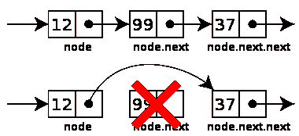

# 数据结构简介:链表是如何工作的

> 原文：<https://www.freecodecamp.org/news/a-gentle-introduction-to-data-structures-how-linked-lists-work-5adc793897dd/>

迈克尔·奥洛伦尼索拉

# 数据结构简介:链表是如何工作的


[Pinterest](https://www.pinterest.com/annschool/steam-rube-goldberg-machines/)

你造过 Rube Goldberg 机器吗？如果没有，也许你已经建立了一个精心制作的多米诺骨牌系列？

好吧，也许你不像我一样是个书呆子。就这样吧。对于那些有幸做过以上任何一项工作的人来说，你已经掌握了当今数据结构的精髓:链表！


### **链表如何工作**

链表最简单的形式是一个*单链表——*是一系列的节点，其中每个单独的节点都包含一个值和一个指向列表中下一个节点的指针。

Additions ( **Add** )通过在列表末尾添加项目来增加列表。

移除( **Remove)** 将总是从列表中的给定位置移除。

Search ( **包含**)将在列表中搜索值。

**示例用例:**

*   将值存储在哈希表中以防止冲突(在以后的几篇文章中会详细介绍)
*   重塑惊人的比赛！


让我们通过开发一个工具来保持这篇文章的简洁，CBS 网络可以用这个工具来计划他们下一个精彩的种族电视节目。

当你读到这里的时候，我希望你不断地问自己:“链表和数组有什么不同？他们怎么相似？”

让我们开始吧。

首先，您需要创建我们的链表的表示:

```
class LinkedList{  constructor(){    this._head = null;    this._tail = null;    this._length = 0;  }
```

```
 size(){    return this._length;  }}
```

要跟踪比赛的起点和终点，需要创建 head 和 tail 属性。

然后，为了确保比赛不会太长或太短，您创建了一个长度属性和大小方法。通过这种方式，您可以随时准确记录比赛时间。

既然您已经有了存储比赛列表的方法，那么您应该创建一个方法来添加到这个列表中。问题是，你具体在加什么？

记住，链表是一系列的节点，其中每个节点都有一个值和一个指向列表中下一个节点的指针。了解了这一点，您就会意识到节点只是一个具有值和下一个属性的对象。

因为每次向列表中添加内容时都要创建一个新节点，所以您决定创建一个构造函数，使得为添加到列表中的每个值创建一个新节点变得更加容易。

```
class Node{  constructor(value){    this.value = value;    this.next = null;  }}
```

有了这个构造函数，您就可以创建自己的 add 方法。

```
class Node {  constructor(value) {    this.value = value;    this.next = null;  }}
```

```
class LinkedList {   constructor() {    this._head = null;    this._tail = null;    this._length = 0;  }    add(value) {    let node = new Node(value);         //we create our node    if(!this._head && !this._tail){     //If it's the first node      this._head = node;                //1st node is head & tail      this._tail = node;    }else{    this._tail.next = node;             //add node to the back    this._tail = this._tail.next;       //reset tail to last node    }    this._length++;  }    size() {    return this._length;  }}
```

```
const AmazingRace = new LinkedList();AmazingRace.add("Colombo, Sri Lanka");AmazingRace.add("Lagos, Nigeria");AmazingRace.add("Surat, India");AmazingRace.add("Suzhou, China");
```

现在您已经添加了这个方法，您将能够向您的惊人比赛列表添加一堆位置。这就是它看起来的样子。请注意，我添加了一些额外的空白，以便于理解。

```
{ _head:    { value: 'Colombo, Sri Lanka',     next: { value: 'Lagos, Nigeria',              next: { value: 'Surat, India',                     next: { value: 'Suzhou, China',                             next: null                            }                   }           }    },  _tail: { value: 'Suzhou, China', next: null },  _length: 4 }
```

好了，现在你已经创建了这个列表和一种添加方式，你意识到你需要一些帮助来将地点添加到这个列表中，因为你有决策恐惧症(是的，这是一件[事情](https://en.wikipedia.org/wiki/Decidophobia))。

你决定与你的同事 Kent 分享，请他再增加几个位置。唯一的问题是，当你给他的时候，你没有告诉他你已经添加了哪些地方。不幸的是，你也已经忘记了，因为患了决策焦虑引起的健忘症。

当然，他可以只运行 *console.log(AmazingRace)* 并通读控制台输出的内容。但是 Kent 是一个懒惰的程序员，他需要一种方法来检查某些东西是否存在，这样他就可以防止重复。记住这一点，您构建一个**包含**方法来检查现有值。

```
class Node {  constructor(value) {    this.value = value;    this.next = null;  }}class LinkedList {   constructor() {    this._head = null;    this._tail = null;    this._length = 0;  }    add(value) {    let node = new Node(value);             if(!this._head && !this._tail){           this._head = node;                      this._tail = this._head;    }else{    this._tail.next = node;                 this._tail = this._tail.next;           }    this._length++;  }    contains(value){    let node = this._head;    while(node){      if(node.value === value){        return true;      }      node = node.next;    }    return false;  }    size() {    return this._length;  }  }
```

```
const AmazingRace = new LinkedList();AmazingRace.add("Colombo, Sri Lanka");AmazingRace.add("Lagos, Nigeria");AmazingRace.add("Surat, India");AmazingRace.add("Suzhou, China");
```

```
//Kent's check
```

```
AmazingRace.contains('Suzhou, China'); //trueAmazingRace.contains('Hanoi, Vietnam'); //falseAmazingRace.add('Hanoi, Vietnam');AmazingRace.contains('Seattle, Washington'); //falseAmazingRace.add('Seattle, Washington');AmazingRace.contains('North Pole'); // falseAmazingRace.add('North Pole');
```

太棒了，现在 Kent 有办法在添加值之前检查它们，以避免重复。

作为题外话，您可能想知道为什么不在 add 方法中使用 contains 方法来防止重复添加？当你实现一个链表或者任何数据结构时，理论上你可以添加任何你想要的额外功能。

您甚至可以在现有的结构上改变本地方法。穿上 REPL 试试下面的:

```
Array.prototype.push = () => { return 'cat';}
```

```
let arr = [];arr.push('eggs'); // returns 'cat';
```

我们不做这些事情的原因是因为[商定的标准](http://www.ecma-international.org/ecma-262/7.0/index.html#sec-array.prototype.push)。本质上，开发人员对某些方法应该如何工作有一个预期。


因为我们的链表类不是 JavaScript 的原生类，所以我们在实现它时有更多的自由，但是对于这样的数据结构应该如何工作仍然有一些基本的期望。链表本身并不存储唯一值。但是它们确实有像 **contains** 这样的方法，允许我们预先检查并维护列表中的唯一性。

肯特给你回复了他的目的地列表，但其中一些是有问题的。例如，北极可能不是最好的比赛目的地。

所以您决定构建一个能够移除节点的方法。重要的是要记住，一旦你删除了节点，你就取消了列表的链接，并且必须重新链接被删除节点前后的内容。

```
class Node {  constructor(value) {    this.value = value;    this.next = null;  }}class LinkedList {   constructor() {    this._head = null;    this._tail = null;    this._length = 0;  }    add(value) {    let node = new Node(value);             if(!this._head && !this._tail){           this._head = node;                      this._tail = this._head;    }else{    this._tail.next = node;                 this._tail = this._tail.next;           }    this._length++;  }    remove(value) {    if(this.contains(value)){          // see if our value exists      let current = this._head;           // begin at start of list      let previous = this._head;        while(current){                   // check each node          if(current.value === value){            if(this._head === current){   // if it's the head              this._head = this._head.next;  // reset the head              this._length--;              // update the length              return;                      // break out of the loop            }            if(this._tail === current){   // if it's the tail node              this._tail = previous;       // make sure to reset it            }            previous.next = current.next;  // unlink (see img below)            this._length--;            // update the length            return;                    // break out of           }          previous = current;          // look at the next node          current = current.next;      // ^^        }     }    }      contains(value){    let node = this._head;    while(node){      if(node.value === value){        return true;      }      node = node.next;    }    return false;  }    size() {    return this._length;  }  }
```

```
const AmazingRace = new LinkedList();AmazingRace.add("Colombo, Sri Lanka");AmazingRace.add("Lagos, Nigeria");AmazingRace.add("Surat, India");AmazingRace.add("Suzhou, China");AmazingRace.add('Hanoi, Vietnam');AmazingRace.add('Seattle, Washington');AmazingRace.add('North Pole');
```

```
//Kent's check
```

```
AmazingRace.remove('North Pole');
```

上面的 **remove** 函数中有很多代码。本质上可以归结为以下几点:

1.  如果列表中存在该值…
2.  遍历链表，跟踪上一个和当前节点
3.  然后，如果有匹配的→

4A。如果是头的话

*   将标题重置为列表中的下一个节点
*   更新长度
*   打破循环

4B。如果是尾巴的话

*   将尾部重置到列表中的前一个节点
*   通过重置指针取消节点链接，如下所示



[Wikipedia](https://www.google.com/url?sa=i&rct=j&q=&esrc=s&source=images&cd=&cad=rja&uact=8&ved=0ahUKEwjauKOv46rQAhULfiYKHdgFDWYQjhwIBQ&url=https%3A%2F%2Fen.wikipedia.org%2Fwiki%2FLinked_list&psig=AFQjCNHXY1FhqqxQeG8hKywNnnpfCnVNpw&ust=1479299805807482)

4C。如果不匹配→ *继续迭代*

*   将下一个节点设为当前节点
*   将当前节点设为上一个

最后需要注意的一点是:您可能已经意识到您实际上并没有删除节点。你只是删除了对它的引用。这没关系，因为一旦一个对象的所有引用都被移除，垃圾收集器就会帮助我们将它从内存中移除。你可以在这里阅读垃圾收集[。](http://docstore.mik.ua/orelly/webprog/jscript/ch11_03.htm)

现在实现了 remove 方法，您可以运行下面的这段代码来确保参赛者不会冻死，或者在圣诞老人为今年的庆祝活动做准备时意外打扰他。

```
AmazingRace.remove('North Pole');
```

你做到了！您已经创建了一个简单的链表实现。您可以通过添加项目来扩大列表，通过删除项目来缩小列表，这一切都基于项目的价值。

看看你能不能添加你可以扩展链表，允许你在开始，结束，或者两者之间的任何一点插入值。

您拥有实现这些方法所需的一切。这些方法的名称和参数应该如下所示:

```
addHead(value) {
```

```
}
```

```
insertAfter(target, value){
```

```
}
```

欢迎在下面的评论中分享你的实现。

### **排队方法的时间复杂度分析**


下面是代码:

```
class LinkedList {   constructor() {    this._head = null;    this._tail = null;    this._length = 0;  }    add(value) {    let node = new Node(value);             if(!this._head && !this._tail){           this._head = node;                      this._tail = this._head;    }else{    this._tail.next = node;                 this._tail = this._tail.next;           }    this._length++;  }    remove(value) {    if(this.contains(value)){                let current = this._head;              let previous = this._head;        while(current){                   if(current.value === value){            if(this._head === current){               this._head = this._head.next;              this._length--;                            return;                                  }            if(this._tail === current){               this._tail = previous;                }            previous.next = current.next;            this._length--;                        return;                              }          previous = current;                    current = current.next;              }     }    }     contains(value){    let node = this._head;    while(node){      if(node.value === value){        return true;      }      node = node.next;    }    return false;  }    size() {    return this._length;  }
```

```
// To Be Implemented
```

```
addHead(value) {
```

```
}
```

```
insertAfter(target, value){
```

```
}
```

**Add** is **O(1):** 由于 tail 属性，你总是知道列表中的最后一项，所以你不必迭代列表。

**Remove** is **O(n):** 在最坏的情况下，你必须遍历整个列表来找到要删除的值。不过最重要的是，节点的实际移除是 O(1 ),因为你只是在重置指针。

**Contains** is **O(n):** 你必须遍历整个列表来检查这个值是否存在于你的列表中。

**addHead** 是 **O(1):** 类似于我们上面的 add 方法，我们总是知道头部的位置，所以不需要迭代。

**insert after**is**O(n)**:类似于上面的 Remove 方法，您必须遍历整个列表，找到您的值应该插入的目标节点。同样，实际的插入是 O(1 ),因为你只是重置指针。

### 链表 vs 数组？

为什么要用链表而不是数组？从技术上讲，数组允许你做链表做的所有事情，比如添加、插入和删除。此外，所有这些方法在 JavaScript 中都已经很容易使用了。

嗯，最大的区别在于插入和移除。由于数组是有索引的，所以当您在数组中间执行插入或移除操作时，您必须将后面所有值的位置重置为它们的新索引。

想象一下，在一个数组的开头或中间插入 100，000 个值！像这样的插入和移除是非常昂贵的。正因为如此，对于经常移动的大型数据集，链表是首选。

另一方面，数组在查找项目(随机访问)时非常有用，因为它们是有索引的。如果知道一个物品的位置，可以通过*数组【位置】*在 O(1)时间内访问。

链表总是要求你按顺序遍历链表。有鉴于此，对于较小的数据集或不经常移动的数据集，数组通常是首选。

### 是时候快速回顾一下了

链接列表:

1.  有一个跟踪列表末尾的 tail 和 head 属性
2.  使用 add、addHead、insertAfter 和 remove 方法来管理列表的内容
3.  有一个长度属性来跟踪你的链表有多长

### 进一步阅读

还有双向链表和循环链表数据结构。你可以在维基百科上读到关于他们的[。](https://en.wikipedia.org/wiki/Linked_list#Linked_lists_vs._dynamic_arrays)

此外，这里有一个由 Vivek Kumar 撰写的可靠、快速的概述。

最后，Ian Elliot 写了一个[演练](http://www.i-programmer.info/programming/javascript/5328-javascript-data-structures-the-linked-list.html?start=1)，帮助你实现所有的方法。但是在偷看这个之前，看看你是否能为你的链表实现 **addHead()** 和 **insertAfter()** ？