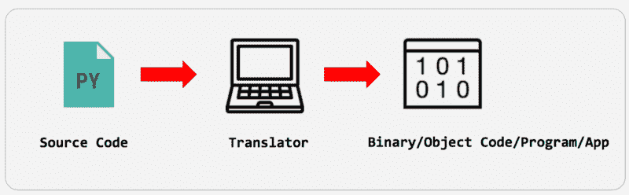
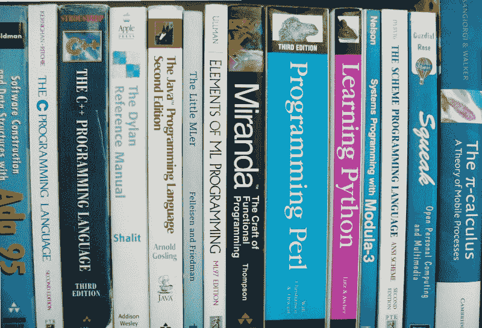
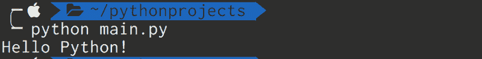
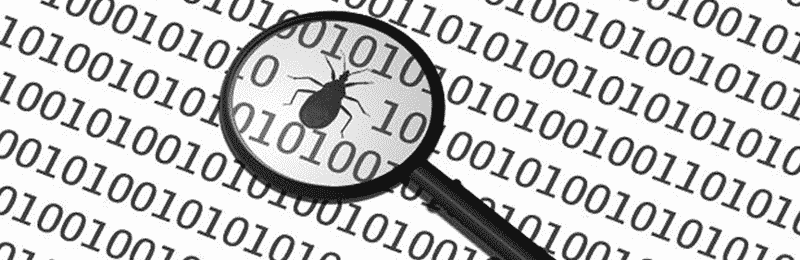

# 更温和的编程入门

> 原文：<https://www.freecodecamp.org/news/a-gentler-introduction-to-programming-1f57383a1b2c/>

马特·阿德桑尼亚

# 更温和的编程入门


Illustration by [John Adesanya](https://www.facebook.com/adesanya.john.52)

当我收到教练请求时，这篇文章记录了我教的内容。我不会跳进代码或任何类型的设置。我会教概念。

如果你在一家软件开发公司工作，作为一个非程序员，你可能想知道程序员是做什么的。你每天都会听到新的流行语。这篇文章是为你而写的。无论你是销售人员、医生、律师、商业领袖还是会计，如果你曾经想过学习如何编码，这是一个很好的起点。

### 这篇文章是如何组织的

这篇文章分为四个部分。通读每一部分后，你会发现一个测验部分来帮助你更好地回忆你所读过的内容。然后你会找到“前进”部分和测验的答案。

注意，本系列介绍的每个流行语都是用**粗体**表示的，比如**算法**。


*Illustration by [John Adesanya](https://www.facebook.com/adesanya.john.52)*

### 第 1 部分—什么是编程？

一个简单的答案是，“编程是指导计算机执行任务的行为。”通常被称为**编码**。

那么，什么是计算机程序？计算机程序是计算机执行的一系列指令。

在上面的定义中，计算机是能够处理代码的任何设备。这可能是智能手机、自动取款机、树莓派、服务器等等。

#### 一个很好的编程类比

首先，我们每天的生活都有模式。宇宙以某种可预测的方式运行；例如——白天和黑夜、季节、日出和日落。人们会经历一些例行公事，比如早上起床、上学或上班。我们从其他人那里得到指示，比如工作中的上级。我们如何烹饪某些食谱可以用有限的步骤来解释。

第二，每次我们使用智能设备，都有一些代码在后台运行。将鼠标指针从计算机屏幕的一部分移动到另一部分看起来似乎是一项简单的任务，但实际上，运行了这么多行代码。像在谷歌文档中输入字母这样简单的行为会导致代码行在后台执行。到处都是代码。

> 计算机程序也被称为**代码**。**不要用“代码”这个词**(代码应该用作不可数名词)。好了，这不是英语课，言归正传。

#### 计算机的自然语言

机器像人类一样有它们的自然语言。计算机不理解人类语言。计算机的自然语言是二进制代码——1 和 0。这些代表两种状态:**开(1)** 和**关(0)** 。

那是电子设备的自然语言。对于我们人类来说，用二进制与计算机交流将会是一件令人兴奋的事情。

#### 输入编程语言

为了与说二进制语言的机器交流，我们用一种更接近我们自己自然语言的语言。例如英语、法语、斯瓦希里语或阿拉伯语。编程语言接近我们的自然语言。但它们更有结构性，必须彻底学习。

它们可能是高级语言，也可能是低级语言。高级编程语言比低级语言离机器语言更远。这种“更远的距离”通常被称为**抽象**，但是我们不会在本系列中深入探讨。大家不要分心:)

计算机需要一种理解人类语言的方式。为此，我们需要一名翻译。

#### 什么是翻译者

源代码是指用特定编程语言编写的代码。在第 2 部分中会有更多的内容。

翻译人员有责任将你的源代码转换成机器语言。这也被称为**二进制**。记住 1 和 0。我们可以把二进制代码称为**目标代码**，程序或者今天的一个常用词: **App** 。



翻译可以是以下任何一种:

*   解释程序
*   编译程序
*   解释器和编译器的混合体
*   装配工

#### 解释程序

有些语言是解释的。翻译器逐行处理源代码，并运行最终程序或应用程序中的每一行。这意味着解释的源代码开始运行，直到遇到错误。然后解释器停止报告这样的错误。第 3 部分将详细介绍这一点。

Python 是解释型编程语言的一个很好的例子。

#### 编译程序

编译器的功能不同。他们通过编译过程将完整的源代码转换成二进制代码。然后执行二进制文件。如果源代码中有错误，它们会在编译时被检测出来并被标记出来。这会中断编译过程，并且不会生成二进制文件。

解释器逐行翻译，在进入下一行之前执行这一行。编译器将程序的所有行翻译成一个文件(二进制)并执行整个文件。

还记得计算机程序的定义吗？它是由计算机执行的一系列指令。

正在执行的程序通常被称为进程。此类程序使用计算机系统或智能手机上的某些资源，如内存、磁盘空间和文件系统。一个正在执行的程序也可以说是**在运行**。

当我们执行计算机程序时，我们用“运行”这个词。运行这些程序所花费的时间被称为程序的运行时间。

经常可以看到被称为应用程序的程序。我们还将程序与运行它们的平台或环境相关联，或者为它们而设计。有运行在网络浏览器上的网络应用程序，比如谷歌电子表格。还有手机应用，可以在智能手机上运行，比如 CandyCrush。还有桌面应用，比如 Evernote 桌面应用。

同样，解释的源代码直接从源文件执行。编译后的源代码被转换成二进制文件。然后执行二进制文件。即使编译成功，编译后的源代码也可能在运行时失败。参见第 3 部分。

#### 混合翻译器

混合翻译器是解释器和编译器的组合。一种流行的混合编程语言是 **Java** 。Java 首先将你的源代码编译成一种被称为**字节码**的中间格式。

然后，字节码由运行时引擎(也称为虚拟机)解释和执行。这使得混合翻译器能够在各种操作系统上运行字节码。

#### 装配工

还有将低级汇编语言翻译成二进制的汇编程序。

对于本系列，我们将只关注高级语言。

看待译者的一个好方法是将他们视为一个程序本身。你需要下载或获得它们，安装在你的电脑系统上，并了解它们的基本工作原理。

#### 一个经常被问到的问题

这里有一个初学者通常会问的问题。

> 我先学什么语言？

有数百种编程语言。它们按照受欢迎程度、社区、长期支持、教学、商业用途进行排名。它们也可以通过技术来排序，比如它们是功能性的、命令性的、静态的、强的还是松散类型的。

有些语言比其他语言更有教育意义。有些语言是用于教育目的，而不是商业用途。例如，有些语言是为孩子们学习如何编码而写的。

有一些非常强大的语言很容易设置和学习。Python 就是这样一种编程语言。我一般推荐给初学者。


如果你对探索更多关于“第一语言”的选择感兴趣，[这里有菲利普·郭的一些很好的研究。](https://cacm.acm.org/blogs/blog-cacm/176450-python-is-now-the-most-popular-introductory-teaching-language-at-top-u-s-universities/fulltext)

当你想学习一门新的语言时，你现在知道你需要那种语言翻译器。这是一个在计算机系统上安装和设置的程序。

我建议你开始学习如何使用一个 **CLI** (命令行界面)。CLI 是终端或外壳。把终端想象成 GUI(图形用户界面)的替代品。

在图形用户界面中，你通过鼠标指针与计算机进行交互。您还依赖于目录的可视化呈现，以及您所做的一切。

但是，当使用命令行界面时，你可以通过在提示符下键入命令或闪烁的光标与计算机进行交互

```
$_
```

在 Windows 中，附带的终端是命令提示符。对于 Mac 和 Linux 用户，您已经有了一个默认的 Bash 终端。要在 Windows 上获得同样的体验，安装 [Git Bash](https://git-scm.com/) 或 [PowerShell](https://docs.microsoft.com/en-us/powershell/scripting/powershell-scripting?view=powershell-5.1) 。

#### 前进

现在您已经温和地了解了什么是编程。你需要为你的第一行代码做好准备:)

要开始，您需要以下内容:

*   计算机系统在这一点上，你不需要一个复杂的或非常昂贵的系统，你只需要一台运行良好的计算机。
*   安装命令行界面
    我推荐[这个速成班](https://learnpythonthehardway.org/book/appendixa.html)来帮助你开始使用命令行界面。
*   安装一个文本编辑器
    我们将在第 2 部分回到这个问题
*   学习一门编程语言
    在这个系列中，你将学到构成大多数编程语言基础知识的基本要素。

#### 恶作剧

*   开始编程需要哪些基本工具？
*   在 bash (CLI)中，您会使用什么命令来执行以下操作？
*   检查您当前的目录
*   切换到名为“bin”的目录(bin 在您的当前目录中)
*   创建一个名为“lib”的新目录
*   创建名为“book.py”的新文件
*   列出当前目录的所有内容

#### 摘要

我们已经学习了编程的基础知识，并介绍了翻译器。“源代码”这个词你已经不陌生了。我们将在下一部分详细研究什么是源代码。

#### 测验的答案

开始编程需要哪些基本工具？一台计算机、一个文本编辑器、外壳(终端)和一个编译器/解释器

在 bash(CLI)中，您会使用什么命令来执行以下操作？

*   检查您当前的目录:`pwd`
*   切换到名为“bin”的目录:`cd bin`
*   创建一个名为“lib”的新目录:`mkdir lib`
*   创建一个名为“book.py”的新文件:`touch book.py`
*   列出当前目录的所有内容:`ls`



*From Wikimedia Commons, the free media repository*

### 第 2 部分—源代码

现在您已经理解了编程的概念，我们将研究源代码。

源代码基本上是一个文件，就像一个微软(。doc)文件，但略有不同。它是一个原始的文本文件，用非常简单的编辑器编写，比如 Windows 记事本。您将回忆起上一节，您需要解释器或编译器来将源代码转换成二进制代码。源代码必须保存在一个文件中，该文件作为输入传递给翻译器。

根据您编写的语言，有指定的扩展名用于保存您的源代码文件。Python 的扩展是’。py。Java 是。java。Php 是。php '而 PERL 是'。仅举几个例子。

当你写完源代码后，你必须通过翻译器运行它。例如，下面是如何使用`python`命令运行 Python 源代码。

#### 开始:你的第一个程序

*   按照这里的说明[在你的计算机系统上设置 Python。](https://realpython.com/learn/python-first-steps/)
*   安装一个简单的编辑器来输入你的源代码。首先，您可以使用 [sublime](https://www.sublimetext.com/3) 文本编辑器。
*   在编辑器上打开一个新文件，并键入以下内容:

```
print ‘Hello Python!’
```

*   记得将文件保存为 main.py
*   在您的 CLI 上找到该文件的路径，并键入以下命令:

```
$ python main.py
```

结果应该是这样的:



#### 典型源代码的剖析

我们现在将检查一个典型的源代码文件的内容。以下是常规组件:

#### 关键词

简短的、人类可读的单词，通常称为**关键词**。它们是你正在学习的语言所特有的，它们是特殊的。我们马上会回到这个话题。你需要记住一些关键词。下面是 Python 中识别和使用的一组[关键字](https://www.programiz.com/python-programming/keyword-list)。


[*https://www.programiz.com/python-programming/keyword-list*](https://www.programiz.com/python-programming/keyword-list)

#### *标识符*

*你发明的词汇——是的，你，程序员。这些字通常被称为**标识符**。它们可以由你或其他程序员创建。它们以插件的形式打包，更广为人知的名字是**库**。*

*数学图书馆就是图书馆的一个例子。它允许您访问 Javascript 中使用的平方根(Math.sqrt)之类的函数。*

*许多编程语言都附带了大量的库。这些通常被称为他们的 **SDK** s(软件开发工具包)。您将下载它们和编译器，开始构建技术、应用和项目。除此之外，还有**框架**，旨在帮助构建特定的平台，如网络或移动平台。*

*有些标识符与您正在使用的语言捆绑在一起，不能用作用户命名的标识符。java 中的单词**字符串**就是一个例子。这些标识符和关键字一起被称为**保留字**。它们不是关键词，但和关键词一样，它们也是特殊的。*

*所有关键词都是保留字，反过来不成立。*

*你选择的词应该对第一眼看到它的人有意义。*

*标识符的一个常见用途是命名**变量**，我们稍后将对此进行研究。*

#### *基本数据类型*

*你还会在一个源代码中发现不同类型的数据，**数字** (3，5.7，-100，3.142)和**字符** (M，A)。在一些编程语言中，数字被进一步分解成它们自己的类型，比如**整数**。*

*整数可以是**有符号**或**无符号**、**大**整数、**小**整数。大或小实际上取决于为这些数字保留的内存空间的大小。有带小数部分的数字，通常叫做**双**和**浮点**，这取决于你正在学习的语言。*

*我们也有评估为真或假的布尔数据类型。*

#### *复杂数据类型*

*上面解释的数据类型被称为基本数据类型。我们可以从这些基本数据类型构建更复杂的数据类型。*

*一个**数组**是复杂数据类型的最简单形式。一个**字符串**是一个**字符**的数组。我们离不开这些复杂的数据类型，在编写源代码时经常会用到它们。*

*字符的组合就是一个字符串。打个比方，字符串对于计算机就像单词对于人类一样。单词“温度计”由 11 个字符组成，我们简单地称之为字符串。字符串处理本身是一个广泛的学习主题，每个有抱负的程序员都必须学习。*

*您使用的大多数编程语言都附带了复杂的数据类型。还有一些是我们作为程序员自己构建的，比如类系统。这些也被称为( **OOP** )面向对象编程。*

#### *变量*

*变量只是被命名为内存位置。我们有时希望将源代码中的数据保存在一个我们可以调用数据的地方，以便再次使用。这通常是我们的编译器/解释器为我们保留的一个内存位置。我们需要命名这些内存位置，以便以后调用它们。考虑下面的 Python 代码片段:*

```
*`pet_name = 'Hippo'print pet_name`*
```

*`pet_name`是一个变量的例子。因为`pet_name`中存储的数据类型是字符串。它被称为字符串变量。也有数字变量。变量按其数据类型分类。*

#### *常数*

*常量是在程序的整个生命周期中不变的值。我们用大写字母来强调一些值是常量。有些语言提供了创建常量值的方法，而有些则没有。*

*一些语言提供了声明变量类型的奢侈。我们通常称这些**为强类型**语言。Java 就是一个很好的例子。*

*其他的不提供这些功能。它们是**松散类型的**或**动态编程语言**。Python 就是一个很好的例子。*

*以下是如何在 JavaScript 中声明常量值。*

```
*`const petName = 'Hippo'`*
```

#### *文字*

*在每一个源代码中，都有你在代码中到处使用的数据类型，这些数据类型只有在你自己编辑时才会改变。我们称之为文字，不要与变量或常量混淆。一旦浏览源代码，就可以看到文字。它们可以是字符串、数字、小数或其他数据类型。*

*在上面的源代码片段中，单词“Hippo”是一个文字，一个字符串文字。它将永远是'河马'，直到你编辑源代码。当您学习编码时，您将学习如何以一种易于维护的方式管理源代码中的文字，而无需对源代码做太多更改。*

#### *标点符号/符号*

*在大多数源代码中，根据编程语言的不同，您通常会发现不同的标点符号。例如，Java 比 Python 有更多的标点符号。*

*常见的标点符号有逗号(`,`)、分号(`;`)、冒号(`:`)、大括号(`{}`)、中括号(`[]`)、方括号(`“ ”`)、引号(`|`)、斜线(`\`)、句号(`.`)、问号(`?`)、脱字符号(`^`)和百分号(`%`)。*

*欢迎来到编码的世界，在这里标点符号是你最好的朋友。你会发现自己打了很多次。*

#### *经营者*

*您编写代码来执行操作的可能性非常高。无论如何，您将在源代码中执行赋值操作。我们使用的编程语言为我们提供了大量的运算符。例子包括加法(`+`)、除法(`/`)、乘法(`*`)、减法(`-`)和大于(`&`gt；).*

*运营商通常可分为以下几类:*

*   *赋值运算符
    这有时会被误解为等于。等于用于比较两个值。赋值运算符将一个值放入变量中，如`pet_name = 'Hippo'`*
*   *算术运算器
    包括用于执行诸如加法和减法的算术任务的运算器。有些语言提供了其他语言可能没有的算术运算符。例如，模数运算符(`%`)返回除法运算中的余数。*
*   *关系运算符
    用于比较值。它们包括大于、小于、等于、不等于。它们的表现形式也因你正在学习的编程语言而异。`&l`t；>在某些语言中不等于——而在另一些语言中， `i` t 的`!= o` r！==.*
*   *逻辑运算符
    用于计算逻辑运算。常用的逻辑运算符有 and、or、not。一些语言用符号来表示这些操作符，比如用`&&`表示 and，`||`表示 or，`!`表示 not。逻辑运算值通常评估为布尔值`true`或`false`。*

#### *评论*

*文档将是您编码活动的一个重要方面。这是你如何向其他程序员解释你的代码。这是通过偶尔添加到部分代码中的注释来实现的。通过注释，您可以指导其他程序员了解您的代码处理哪种数据以及它生成哪种输出。*

*通常，编译器会忽略注释代码行。*

*评论因语言而异。`#`用于在 Python 中引入注释。*

*这里有一个 Python 中注释的例子。*

```
*`# program snippet to compute fibonacci of N numbers`*
```

*在 Java、C 和 C++中，一行有注释，就像 Python 中的`#`一样，但是使用了`//`符号。也有多行评论`/*`……`*/`。你可以阅读更多关于你选择学习的语言的评论。*

#### *空白和制表符*

*这些是在你写的代码之间创建的空间。这是在你按下键盘上的空格键或 tab 键时完成的。*

#### *前进*

*确保在您的计算机系统上正确设置 Python，并运行您的第一个程序。*

#### *恶作剧*

*这里有一个简单的测验。
在下面的 Java 源代码片段中找出我们迄今为止已经研究过的不同元素:*

```
*`// a recursive implementation of Factorialimport java.util.Scanner;class RecursiveFactorial {  public static void main(String[] args) {    Scanner input=new Scanner(System.in);    System.out.print("Find the Factorial of: ");    int num=input.nextInt();    System.out.println("Factorial of "+num+" = "+fact(num));  }`*
```

```
 *`static long fact(int n) {  if(n<2) return 1;  return n*fact(n-1); }}`*
```

#### *摘要*

*已经向您介绍了什么是源代码，并且检查了典型源代码的内容。*

*编译或翻译后，您的代码可能会由于多种原因而无法运行。这些原因通常与源代码中的错误有关。这些错误被称为 bug。*

*找到并消除这些错误的行为被称为调试，是作为程序员必须学习的技能。我们将在下一部分研究什么是 bug。*

#### *测验的答案*

*在下面的 Java 源代码片段中找出我们到目前为止已经研究过的不同元素:*

*关键词:
导入，类，公共，静态，void，new，int，long，if，return*

*标识符:
java，util，Scanner，RecursiveFactorial，main，String，args，input，System，in，out，print，println，num，nextInt，fact，n*

*文字:
字符串文字—"的阶乘" = "求:"
整数文字的阶乘— 2，1*

*运算符:
赋值运算符`=`
连接符`+`(用于将字符串连接在一起)
小于`&`lt；
多组`l` y *
亚组`c` t -*

*标点符号
`{ } [] ( ) ; .`*

*注释
`//`阶乘的递归实现*

**

### *第 3 部分—调试*

*一旦你开始尝试代码片段或者试图用代码解决实际问题，你很快就会意识到你的程序会有崩溃、中断和停止运行的时候。*

*这通常是由错误引起的，在运行时被称为**bug**或**异常**。从我们的代码中发现并移除错误的行为是**调试**。当你试着做得越多，你就越擅长调试代码。我们不仅调试自己的代码，还可以调试其他程序员写的代码。*

*首先，我们需要识别源代码中可能出现的常见错误。*

#### *句法错误*

*这些错误将不允许您的源代码在编译的编程语言中编译。它们是在编译时或解释源代码时被检测到的。它们也很容易被棉绒检测到。稍后我们会学到更多关于棉绒的知识。*

*它们大多是在您破坏了您正在编码的语言的预期形式或结构时引起的。一个例子是在一个等式中缺少一个右括号。*

#### *语义错误*

*语义错误也称为逻辑错误，是所有错误中最麻烦的。它们不容易被发现。出现语义错误的一个迹象是程序成功运行，但没有产生预期的输出。*

*考虑这个例子:*

```
*`3 + 5 * 6`*
```

*按照[的优先顺序](https://en.wikipedia.org/wiki/Order_of_operations)，在数学中通常被称为 BODMAS，我们期望乘法部分首先被求值，然后最终结果将是 33。如果程序员想让加法运算先求值，这将产生与期望输出不同的输出。诸如此类的错误是语义错误，更多的是与意义有关，而不是结构(语法)。*

*`3 + 5`两边的括号将给出期望的输出 48。*

```
*`(3 + 5) * 6`*
```

#### *运行时错误*

*像语义错误一样，运行时错误在编译时永远不会被检测到。与语义错误不同，运行时错误会中断程序并阻止它进一步执行。它们通常是由源代码中某些计算的意外结果引起的。*

*这里有一个很好的例子:*

```
*`input = 25x = 0.8/(Math.sqrt(input) - 5)`*
```

*上面的代码片段将成功编译，但是输入`25`将导致`ZeroDivisionError.`这是一个运行时错误。另一个流行的例子是`StackOverflowError`或`IndexOutofBoundError` *。真正重要的是你发现这些错误并学会如何处理它们。**

*有些错误是由源代码如何利用运行它的平台或环境上的内存和空间引起的。它们也是运行时错误。像`OutOfMemoryError`和`HeapError`这样的错误通常是由你的源代码消耗了多少资源引起的。对**算法**的深入了解将有助于你编写更好地利用资源的代码。*

*为了更好的性能而重写代码的过程被称为**优化**，一个不太相关的词是**重构**。当你花更多的时间编码时，你也应该记住这些。*

#### *排除故障*

*以下是一些关于如何调试代码的提示:*

*   ***使用 Linters**
    Linters 是帮助**通读你的源代码**的工具，以检查它们是否符合你正在编码的语言的预期标准。许多编程语言都有 linters。一定要为你正在学习的语言准备一个。*
*   *比起简单的编辑器
    IDE，你可以选择为你正在学习的语言设计的 **IDE** 。IDE 代表集成开发环境。它们是为编写、调试、编译和运行代码而构建的软件。它们通常带有强大的调试工具包，用于观察或单步调试您的代码。Jetbrains 创造了 Webstorm 和 IntelliJ 等伟大的 IDEs。还有 NetBeans、Komodo、Qt editor、Android Studio、XCode(Mac 自带)等等。*
*   *大声朗读你的代码
    这通常在你寻找语义错误时很有用。在大声朗读代码时，很有可能你也会读出错误。可能会让你觉得可能是错的。*
*   ***读取错误日志**
    当编译器标记出一个错误时，一定要查看行号或代码中被标记的部分。*

#### *前进*

*作为初学者，你将从书籍、在线教程或视频中学习编码。当你看到代码时，你会经常把它们敲下来。*

*这里有一些你应该做的事情，当你写完或运行完这样的代码后，**学会破解它们**。你是怎么做到的？*

*更改一些内容以查看代码的行为。这样做，你就不会对任何事情做任何假设，而且你非常确定你了解正在发生的事情。*

#### *恶作剧*

*1 .下面的 Python 代码片段中可能有什么错误:*

```
*`items = [0,1,2,3,4,5]print items[8]`*
```

```
*`//hint: items here is an Array, with 6 items. To retrieve the 4th item for example, you will use items[3]. We start counting from 0.`*
```

*2.下面的 Python 代码片段中可能有什么错误:*

```
*`input = Hippo'if input == 'Hippo':  print 'Hello, Hippo'`*
```

#### *章节摘要*

*恭喜你！bug 这个词对你来说已经不再陌生，现在挑选 bug 也不应该。接下来，我们将研究我们每天编写的代码的一般流程。*

#### *测验的答案*

*下面的 Python 代码片段中可能有什么错误:
(1)运行时错误:索引超出范围错误
(2)语法错误:第 1 行缺少起始引号*

*

[*http://www.publicdomainpictures.net/*](http://www.publicdomainpictures.net/)* 

### *第 4 部分—基本编码流程*

#### *代码行、表达式和语句*

*任何源代码的单位都是 **LOC(代码行)**。最简单的程序是一行代码。LOC 可以是关键字、符号或语句。它是一行代码，只要它在自己单独的一行上。*

*让我们考虑一行简单的代码:*

*`area = 0.5 * base * height`*

*`0.5 * base * height`是一个表达式。**表达式**是运算符和操作数的组合。在这里给出的例子中，操作数是`0.5`、`base`、`height`。您会记得，`0.5`是浮点文字，`base`和`height`是变量。运算符是`*`(乘法)。*

*表达式本身作为一个 LOC 可能没有意义。当我们把一个表达式的值赋给另一个变量时，在`area`上面的情况下，我们得到的就叫做语句。当我们将表达式附加到关键字上时，它仍然是一个语句，例如:`return 0.5 * base * height`*

*在本节的其余部分，我们将用符号 **S** 来表示一个语句。在一系列(或一组)语句中，第 n 条语句将是 **Sn***

*要快速掌握编程，一个好的起点是理解基本的编码流程。基本流程也被称为**控制流程**。一旦你理解了这些流程，你会在你学习的许多编程语言中发现它们。*

*请注意，本文中给出的示例都是非常基础的。你需要参考你正在学习的语言来深入了解它所提供的关键词。*

*这里介绍的基本流程也不同于编程中的**设计模式**。先了解这些基本流程。随着您了解的越来越多，您会在以后的编程中赶上常见的设计模式。*

*以下是基本的编程流程:*

*   *连续的*
*   *条件/分支*
*   *迭代/重复/循环*

#### *连续的*

*这是最基本的流程，一条语句接一条语句执行。实际上，每隔一个流就分解成一个顺序流(后面会详细介绍)。*

```
*`S1S2S3...Sn`*
```

*在像 JavaScript 这样的编程语言中，S3 有可能在 S1 之前执行。如果 S1 被一些可能需要更多时间的任务(如数据库或文件操作，称为**异步任务**)阻塞，就会发生这种情况。有很多方法可以解决这种情况。不要担心，当你拿起编程语言来学习时，它将是一件轻而易举的事情。*

#### *条件/分支*

*执行的语句由条件决定。这里的关键关键字是`if`关键字。这是最常用的编码流程之一。*

*下面是最简单的条件模式:*

```
*`if (condition) then:   S1`*
```

*在上面的例子中，要么`S1`执行，要么什么都不做。`S1`仅在给定条件为真时执行。*

*这是另一个条件模式:*

```
*`if (condition) then:  S1  S2else:  S3  S4`*
```

*根据给定的条件，可以理解为运行`S1` - `S2`或`S3` - `S4`。如果条件为真，`S1`和`S2`将被处理。否则将处理语句`S3`和`S4`。这实际上是一个连续的流程:*

```
*`S1S2`*
```

*我们还有多条件风格:*

```
*`if (condition1) then:  S1else if (condition2) then:   S2else:  S3`*
```

*这里如果`condition1`为真，则`S1`被处理。否则测试`condition2`，如果为真，则处理`S2`。这可以一直持续下去。*

*对于多条件风格，许多编程语言都提供了`switch`语句。下面是 switch 语句的模式:*

```
*`switch value:  case condition1:    S1    break    case condition2:    S2    break`*
```

```
*`default:    S3`*
```

*将`condition1`和`condition2`与 switch 语句中的值进行比较。如果其中任何一个值为真，则执行 case 块中的语句。*

*条件流还有其他选择。有些特定于你决定学习的语言，比如条件运算符(`: ?`)，以及其他便于分支的关键字，比如`cycle`和`break`。确保花一些时间理解条件/分支流程。*

#### *迭代/重复/循环*

*只要满足某些条件，迭代/重复流就保持语句运行，一旦条件不再为真，就停止执行语句。*

*模式是这样的:*

```
*`while (condition):  S1  S2`*
```

*在上面的例子中，语句`S1`和`S2`可以执行一次、多次，或者根本不执行。如果在第一次遇到`while`语句时给定的条件为真，那么`S1`和`S2`将被处理。再次检查`while`条件，只要条件为真，就会执行`S1`和`S2`。*

*当条件变为**假**时，`S1`和`S2`的执行停止。*

*如果条件三次为真，上述语句的结果将是:*

```
*`S1S2S1S2S1S2`*
```

*那是什么编码流程？如果你的答案是连续的，你就非常正确。正如我们所看到的，其他流解析为顺序流。*

*这是另一种迭代模式:*

```
*`do:  S1  S2while (condition)`*
```

*在本例中，`S1`和`S2`将至少执行一次或多次。这是因为它们将在条件测试之前执行。*

*在许多编程语言中，提供了像`do`和`while`这样的关键字来实现重复流。另一个常见的关键字是`for`关键字。下面是`for`语句的常见模式。*

```
*`for (initialvalue; condition; decrement/increment initialvalue):  S1  S2`*
```

*许多语言都使用`foreach`来处理复杂对象中的每一项，比如数组或结构。*

#### *恶作剧*

*确定以下 Python 代码片段中的编码流:*

```
*`numlist=[]cnt=0while cnt >= 0:  m=int(raw_input())  if m < 0:    break  numlist.append(m)  cnt=cnt+1`*
```

#### *摘要*

*这里涵盖的流程是基本流程。有一种方法可以将一组代码组合在一起并给它们命名。通过这种方式，您可以在需要时立即调用这些代码。这被称为程序。在一堆代码执行一些操作并返回一个值的情况下，你有一个函数。*

*过程和函数的实现方式因语言的不同而不同。你不能跳过这些来获得任何语言的基础知识。它们对于组织代码非常重要。事实上，这就是你的代码的构建块开始的地方，也被称为**模块化编程。***

*当你理解函数的时候，你会学到其他的流程，其中一个想到的是**递归**。*

*然而，你会发现在过程和函数中仍然是我们在这里讨论过的令人敬畏的编码流程——顺序的、条件的和循环/迭代的流程。*

### *前进*

*现在你已经学会了计算机编程的最基本的概念。如果你渴望学习更多，或者想以软件开发为职业，那么你需要做的就是潜入更深的水域。有很多资源可以帮助你学习。根据你的经验水平知道选择哪一个非常重要。*

*尽量不要被你从朋友圈里更有经验的程序员那里听到的新词淹没。你可以保留一个便笺簿来记下这些术语，但是不要有压力去找出它们的意思。随着你的学习和练习，你会赶上的。*

*这里有一些资源可以帮助您快速开始您的编码生涯，并帮助您建立从这里获得的基础:*

*   *[https://www.codecademy.com/](https://www.codecademy.com/)
    摘蟒蛇课程*
*   *[https://app . plural sight . com/library/courses/what-is-programming/table-of-contents](https://app.pluralsight.com/library/courses/what-is-programming/table-of-contents)
    plural sight 上的免费课程*

*注意:不建议同题过度阅读。我相信把学到的一点点付诸行动，也就是实践。这就是为什么我没有在这里放太多链接给你学习的原因。如果你不是第一次尝试，你可以根据你已经知道的去谷歌或者找到其他人。*

#### *最终挑战*

*我在此挑战你:
接受这些挑战:*

*   *在网上找一个简单的应用程序，用你学过的编程语言复制它*

*运筹学*

*   *想出任何想法，即使只是简单的遗愿清单应用
    围绕这个想法开发一个应用。*

*我将推荐来自[共同导师](http://codementor.io/)的这篇[文章](https://www.codementor.io/codementorteam/how-to-build-app-from-scratch-beginner-programmer-7z0atq56w)，让你开始学习。*

#### *测验的答案*

*确定以下 Python 代码片段中的编码流。*

*   *顺序流程*
*   *迭代
    到`while`语句*
*   *条件
    的`if`语句*

*特别感谢[玛雅·奈瑞亚](https://www.linkedin.com/in/maya-neria-5bb18763/?ppe=1)、[约书亚·乌巴](https://www.linkedin.com/in/joshua-ugba-o-0a193936/)和[莫希尼·乌菲利](http://medium.com/@mohiniufeli)审阅这篇文章、[苏拉朱丁·阿坎德](https://www.linkedin.com/in/sirolad/)敦促我发表这篇文章、安德拉的编辑团队进行评论、[约翰·阿德桑尼亚](https://www.facebook.com/adesanya.john.52)提供插图以及“昆米”——这些课程从她渴望学习如何编码开始。*

*如果你喜欢这个，点击拍手图标，这样其他人会在媒体上看到这个。此外，如果您有任何问题或意见，请在评论区分享您的想法。*