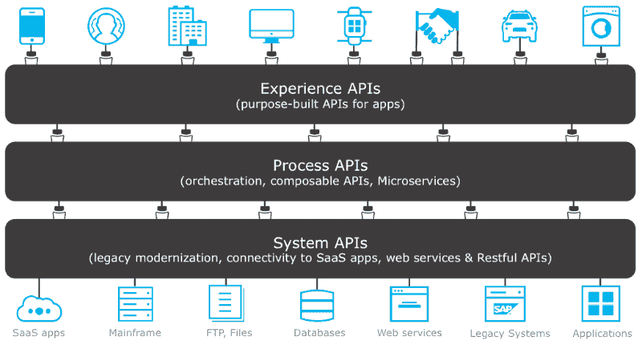
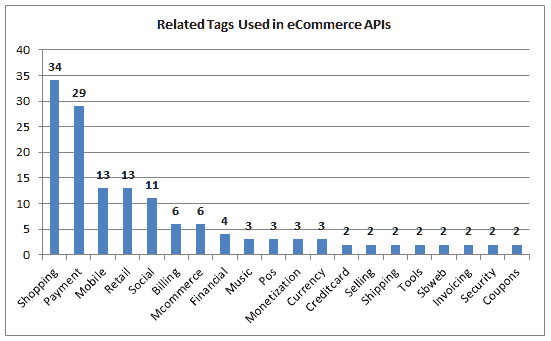
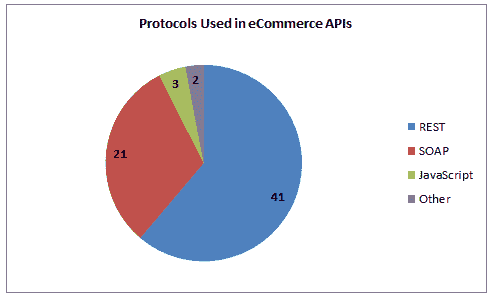

# 电子商务 API 解释 API 集成及其优势概述

> 原文：<https://www.freecodecamp.org/news/a-guide-to-ecommerce-apis/>

技术是快节奏的，并不断塑造和影响着电子商务行业。

随着物联网(IoT)、人工智能(AI)、增强现实/虚拟现实(AR/VR)和区块链等技术的兴起，电子商务世界取得了许多进步。

但是在几十种与电子商务相关的技术中，有一种技术将它们联系在一起。API 通过将电子商务应用程序和网站相互连接，逐渐改进它们。

电子商务 API 帮助开发人员将信息从一个软件转移到另一个软件，然后在单个用户界面中使用这些数据。

API 是一个可扩展的平台，可以集成各种解决方案，因此公司可以利用现有的功能，而无需从头开始构建功能。

## API 集成对电子商务平台的好处

API 有助于将多个平台相互集成。例如，您可以将您的电子商务网站与运输提供商的帐户集成，并导入您的订单和运输数据。这样，您可以在一个平台上简化您的运输操作。

电子商务履行 API 可以通过订单履行、快递管理、标签、发票、打印运输信息、跟踪和确认通知等功能，帮助企业自动化、协调、管理和简化运营。

因此，如果你想为你的电子商务业务建立一个坚实的平台，你需要在你的运输和物流软件解决方案中集成一个 API。

### 它是可扩展的

API 连接不同的软件组件，并使它们能够通过接收请求和发送响应来相互交互。

它扩展了应用程序或网站的功能，帮助您更快地完成工作。它还简化了信息共享。

### 增强安全性

API 通过让用户从您的系统请求数据来增强软件系统的安全性。API 通过加密等安全措施保护您的电子商务数据。

### 复用性

API 可以跨平台和应用程序重用，因为它们是使用面向服务的方法构建的。

可重用程序减少了开发人员必须花费在项目上的时间和精力，这反过来提高了他们的生产力。

### 可量测性

API 使您能够连接到任何新系统，而无需对原始系统、程序或硬件进行任何更改。

它只需要几行代码就可以连接任何新系统，并提供可伸缩性来处理更复杂的事务。

### 同步

由于 API 集成，您可以从其他应用程序和程序中挑选您的在线商店元素，根据您的特定业务需求创建一个平台。通过这种方式，您可以以逻辑方式同步您的操作工作流。

通过集成系统，一家公司可以连接到其他公司的软件和应用程序，以管理他们的数据、运输渠道、产品和服务，最大限度地满足他们的需求。

如你所见，API 革命涉及到我们所有人。

现在让我们了解三种常见类型的 API 模型，它们从系统中获取数据，将数据转化为流程，或者创建一种体验。

## 3 种常见的 API 模型

Image Source: [MuleSoft](https://blogs.mulesoft.com/dev/anypoint-platform-dev/api-templates-reusable-system-process-apis/)

当您使用 API 主导的集成时，您可以改进用户与新设备和技术转变的交互方式。

您可以通过多渠道销售、库存管理、运输或创建跨不同渠道的个性化体验来改进电子商务履行流程。有三种类型的模型可以用来构建这些 API。

### 体验 API

这些 API 用于数据重新配置，以便相同的数据可以根据用户的需求以多种格式呈现。

体验 API 为每个渠道创建一个公共数据源，而不是为每个渠道设置单独的集成。

### 流程 API

这些 API 是在集成 IT 生态系统的不同系统时实现的。它们有助于创建独立的数据源点，以避免单个系统内或跨系统的数据孤岛。

他们不依赖其他系统来传递数据。这意味着流程 API 可以帮助企业扩展他们当前的 IT 基础设施。

### 系统 API

系统 API 隐藏了核心系统的复杂性，如 FTP 服务器、ERP、CRM 或遗留系统。这些类型的 API 通常提供了一种访问系统的方法，用于业务中的数据和记录集成。

现在我将讨论一些电子商务 API，它们可以增强您网站的功能并改善您客户的体验。

## **不同类型的电子商务应用编程接口**

Image Source: [ProgrammableWeb](https://www.programmableweb.com/news/71-ecommerce-apis-seatwave-playme-and-ebay/2012/06/06)

API 集成允许开发人员将他们系统的各种功能直接集成到在线商店中。这有助于简化订单履行、运输和交付流程。

有数百个电子商务 API 供开发人员浏览。其中一些可用于添加订单、运输、跟踪、获取产品、查看、购买和销售，甚至创建市场细分，以及许多其他任务。

这里我将重点介绍一些最受欢迎和最有用的。

### 产品信息 API

产品信息 API 允许您从产品数据库中提取产品详细信息，包括产品描述、产品 ID、产品标题、产品规格、产品图片、价格、产品数量等信息。

### 订单 API

订单 API 包括从您的渠道创建的订单的详细信息。该 API 同步订单导入和导出状态，并显示您帐户中所有已创建和可用订单的列表。

用户可以根据包装和运输日期对订单数据进行排序和过滤。

您还可以取消订单、退回订单、创建批量导入订单，以及为订购的产品添加库存。可以根据需要添加更多的参数。

### 库存 API

您可以使用该 API 对库存数据进行排序和过滤，并检查产品 SKU 的库存详细信息。使用此 API，您还可以更新特定产品的产品库存详细信息。

### 装运 API

这个 API 让您可以自动化运输过程。它允许您与物流提供商联系，并且您可以跟踪从产品销售到包裹交付给客户的所有细节。它还可以自动化创建包装发票和标签的过程。

Shipping API 允许您根据送货时间、费率和地点从多家承运商中进行选择。使用这种类型的 API 也可以跟踪货物。它使您能够将订单跟踪信息整合到移动应用程序或网站中，或者通过电子邮件或短信进行整合。

### courier api

使用此 API 检查特定地区的快递选项和服务能力，并创建订单提货请求。

您还可以使用此 API 为您的货件分配一个唯一的跟踪编号，这有助于您跟踪货件并获得有关它的详细信息。

### 包装 API

您可以在一个 API 中使用这一切来创建订单、发送订单，并为同一个订单生成标签和发票。有了这个 API，你可以一次完成多项任务。

### 渠道 API

channel API 为您提供帐户中所有整合渠道的详细信息(例如 Shopify、Magento、Opencart、WooCommerce 或 Amazon marketplace)。

API 会在创建订单时分配一个唯一的渠道 id，用于为您的帐户选择或指定自定义渠道。该 API 还显示了已经整合到您的商店账户中的所有渠道的列表。

### 目录 API

使用这个 API，您可以在几分钟内创建、编辑和管理您的产品目录。它还支持与您业务的其他关键系统集成，如订单履行、库存管理以及报告和分析。

### 认证/登录 API

身份验证或登录 API 是访问运输提供商站点资源所需的访问授权。这个登录 API 帮助渠道所有者验证您是一个有效的用户。

### 支付 API

使用支付 API，您可以为结账流程创建一个应用程序，该应用程序接受通过信用卡或借记卡进行的支付。支付 API 可以根据您现有的支付网关进行编程。

### 验证 API

验证 API 有助于验证他们在网站上输入的地址和其他客户详细信息。

API 验证地址，识别新客户或现有客户，并决定可能的可送达性问题。这个 API 自动化了地址问题的验证和更正，还消除了验证文档的麻烦。

### 营销 API

一个有用的 API，根据客户的购买行为、购买历史、位置和其他标准，自动执行电子邮件营销功能和细分。

## 电子商务 API 是如何工作的？

Image Source: [ProgrammableWeb](https://www.programmableweb.com/news/71-ecommerce-apis-seatwave-playme-and-ebay/2012/06/06)

如上所述，API 允许您与您的站点和其他系统进行交互，并向客户显示这些信息。

这些 API 对于电子商务网站非常有用，因为您需要同时处理大量的请求、响应和逻辑。

> 这些 API 通常基于 REST 架构，并使用 HTTP 请求方法向服务器请求信息。

REST APIs 使用一个简单的 URL，并且是轻量级的，几乎可以用任何工具实现。开发人员通过 REST API 获得一套搜索和查询工具，帮助他们更深入地访问网站数据。

出于安全目的，REST APIs 还支持 OAuth 2.0 认证(这也用于流行的应用程序，如脸书和谷歌)。此外，REST API 支持跨平台开发和更广泛的编程语言。

开发人员可以使用以下信息将电子商务 API 集成到网站中。

*   资源是指确定与其他资源和对其进行操作的方法的关系的对象。
*   端点是 API 与另一个系统交互的接触点。
*   HTTP 方法是允许的交互，包括用于检索资源的 GET、用于创建资源的 POST 以及用于更改或替换资源的 PUT。
*   参数是具有名称、值类型和说明的条件，用于确定要对资源采取的操作类型。
*   示例请求和响应对象标识资源的输入和输出。

## 尾注

如果使用 API 集成和正确的技术，电子商务运输和订单执行会容易得多。

在一天结束的时候，你对你的电子商务业务所做的每一个决定都应该帮助你实现你的目标。就运输和订单履行而言，使用电子商务 API 可以实现这两个目标。

你还在等什么？立即开始使用电子商务 API！

需要帮忙吗？你可以与 Shiprocket 团队取得联系，了解更多可能的解决方案。

*感谢您的阅读！*