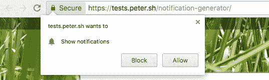

# 充分利用推送 API 的指南

> 原文：<https://www.freecodecamp.org/news/a-guide-to-getting-the-most-out-of-the-push-api-72a139bfeb44/>

> 对学习 JavaScript 感兴趣？在 jshandbook.com 获得我的电子书

推送 API 允许 web 应用接收服务器推送的消息，即使 web 应用当前未在浏览器中打开或未在设备上运行。

Push API 是浏览器 API 的新成员，自 2016 年以来，它目前受到 Chrome(桌面和移动)、Firefox 和 Opera 的支持。

IE 和 Edge 还不支持它，Safari [有它自己的实现](https://developer.apple.com/notifications/safari-push-notifications/)。由于 Chrome 和 Firefox 支持它，大约 60%在桌面上浏览的用户可以访问它，所以使用起来非常安全。

### 你能用它做什么

您可以向用户发送消息，将消息从服务器推送到客户端，即使用户没有浏览站点。

这使您能够发送通知和内容更新，让您能够与受众进行更多互动。

这是巨大的，因为与本地应用相比，移动网络缺少的支柱之一是接收通知的能力，以及离线支持。

### 它是如何工作的

当用户访问您的 web 应用程序时，您可以触发一个面板请求发送更新的权限。安装了一个[服务工人](https://flaviocopes.com/service-workers)，并在后台监听一个[推送事件](https://flaviocopes.com/service-workers#push-events)。

> 推送和通知是两个独立的概念和 API。由于 iOS 中使用的**推送通知**术语，它们有时会被混淆。基本上，当使用推送 API 接收到推送事件时，就会调用通知 API。

您的**服务器**将通知发送给客户机，如果得到许可，服务人员将接收到一个**推送事件**。服务人员通过**触发通知**对此事件做出反应。

### 获得用户的许可

使用 Push API 的第一步是获得用户从您那里接收数据的许可。

> 许多网站没有很好地实现这个面板，在第一次页面加载时就显示出来。用户还不相信你的内容是好的，他们会拒绝许可。所以要明智地去做。

获得用户许可有六个步骤:

1.  检查是否支持服务人员
2.  检查是否支持推送 API
3.  注册服务人员
4.  向用户请求权限
5.  订阅用户并获取 PushSubscription 对象
6.  将 PushSubscription 对象发送到服务器

让我们一个一个地看。

### 检查是否支持服务人员

```
if (!('serviceWorker' in navigator)) {  // Service Workers are not supported. Return  return}
```

### 检查是否支持推送 API

```
if (!('PushManager' in window)) {  // The Push API is not supported. Return  return}
```

### 注册服务人员

该代码注册位于域根中的`worker.js`文件中的服务工作者:

```
window.addEventListener('load', () => {  navigator.serviceWorker.register('/worker.js')  .then((registration) => {    console.log('Service Worker registration completed with scope: ',      registration.scope)  }, (err) => {    console.log('Service Worker registration failed', err)  })})
```

要详细了解服务人员如何工作，请查看[服务人员指南](https://flaviocopes.com/service-workers)。

### 向用户请求权限

既然服务人员已经注册，您就可以请求许可了。

做这件事的 API 已经随着时间的推移而改变，它从接受回调函数作为参数到返回一个[承诺](https://flaviocopes.com/javascript-promises/)，打破了向后和向前的兼容性。请注意，我们需要两者都做**，**，因为我们不知道用户的浏览器实现了哪种方法。

代码如下，调用`Notification.requestPermission()`。

```
const askPermission = () => {  return new Promise((resolve, reject) => {    const permissionResult = Notification.requestPermission(      (result) => {        resolve(result)      }    )    if (permissionResult) {      permissionResult.then(resolve, reject)    }  })  .then((permissionResult) => {    if (permissionResult !== 'granted') {      throw new Error('Permission denied')    }  })}
```

`permissionResult`值是一个字符串，其值可以是:- `granted` - `default` - `denied`

这段代码使浏览器显示权限对话框:



**如果用户点击阻止，你将无法再请求用户的许可**，除非他们在浏览器的高级设置面板中手动取消阻止该网站(这不太可能发生)。

如果用户给了我们权限，我们可以通过调用`registration.pushManager.subscribe()`来订阅它们。

```
const APP_SERVER_KEY = 'XXX'window.addEventListener('load', () => {  navigator.serviceWorker.register('/worker.js')  .then((registration) => {    askPermission().then(() => {      const options = {        userVisibleOnly: true,        applicationServerKey: urlBase64ToUint8Array(APP_SERVER_KEY)      }      return registration.pushManager.subscribe(options)    }).then((pushSubscription) => {      // we got the pushSubscription object    }  }, (err) => {    console.log('Service Worker registration failed', err)  })})
```

`APP_SERVER_KEY`是一个字符串，称为*应用服务器密钥*或 *VAPID 密钥* — ，它标识应用的公钥，是公钥/私钥对的一部分。

出于安全原因，它将被用作验证的一部分，以确保您(只有您，而不是其他人)可以向用户发送回推送消息。

### 将 PushSubscription 对象发送到服务器

在前面的代码片段中，我们得到了`pushSubscription`对象，它包含了向用户发送推送消息所需的所有内容。我们需要将这些信息发送到我们的服务器，以便稍后能够发送通知。

我们首先创建对象的 JSON 表示

```
const subscription = JSON.stringify(pushSubscription)
```

我们可以使用 [Fetch API](https://flaviocopes.com/fetch-api) 将它发布到我们的服务器:

```
const sendToServer = (subscription) => {  return fetch('/api/subscription', {    method: 'POST',    headers: {      'Content-Type': 'application/json'    },    body: JSON.stringify(subscription)  })  .then((res) => {    if (!res.ok) {      throw new Error('An error occurred')    }    return res.json()  })  .then((resData) => {    if (!(resData.data && resData.data.success)) {      throw new Error('An error occurred')    }  })}sendToServer(subscription)
```

在服务器端，`/api/subscription`端点接收 POST 请求，并可以将订阅信息存储到它的存储器中。

### 服务器端如何工作

到目前为止，我们只讨论了客户端部分:获得用户的许可以便在将来得到通知。

服务器呢？它应该做什么，它应该如何与客户端交互？

> *这些服务器端的例子使用 [Express.js](http://expressjs.com/) 作为基本的 HTTP 框架，但是你可以用任何语言或框架编写一个服务器端的推送 API 处理程序*

### 注册新的客户端订阅

当客户端发送新的订阅时，请记住我们使用了`/api/subscription` HTTP POST 端点，在主体中以 JSON 格式发送 PushSubscription 对象细节。

我们初始化 Express.js:

```
const express = require('express')const app = express()
```

此实用程序函数确保请求有效，并具有主体和端点属性，否则它会向客户端返回一个错误:

```
const isValidSaveRequest = (req, res) => {  if (!req.body || !req.body.endpoint) {    res.status(400)    res.setHeader('Content-Type', 'application/json')    res.send(JSON.stringify({      error: {        id: 'no-endpoint',        message: 'Subscription must have an endpoint'      }    }))    return false  }  return true}
```

下一个实用函数将订阅保存到数据库，并在插入完成(或失败)时返回一个已解决的承诺。`insertToDatabase`函数是一个占位符——我们在这里不讨论这些细节:

```
const saveSubscriptionToDatabase = (subscription) => {  return new Promise((resolve, reject) => {    insertToDatabase(subscription, (err, id) => {      if (err) {        reject(err)        return      }      resolve(id)    })  })}
```

我们在下面的 POST 请求处理程序中使用这些函数。我们检查请求是否有效，然后保存请求并向客户端返回一个`data.success: true`响应，或者一个错误:

```
app.post('/api/subscription', (req, res) => {  if (!isValidSaveRequest(req, res)) {    return  }  saveSubscriptionToDatabase(req, res.body)  .then((subscriptionId) => {    res.setHeader('Content-Type', 'application/json')    res.send(JSON.stringify({ data: { success: true } }))  })  .catch((err) => {    res.status(500)    res.setHeader('Content-Type', 'application/json')    res.send(JSON.stringify({      error: {        id: 'unable-to-save-subscription',        message: 'Subscription received but failed to save it'      }    }))  })})app.listen(3000, () => {  console.log('App listening on port 3000')})
```

### 发送推送消息

既然服务器已经在其列表中注册了客户端，我们就可以向它发送推送消息了。让我们通过创建一个获取所有订阅并同时向所有订阅发送推送消息的示例代码片段来看看它是如何工作的。

我们使用一个库，因为 [**网络推送协议**](https://developers.google.com/web/fundamentals/push-notifications/web-push-protocol) 很复杂，而一个库允许我们抽象出大量低级代码，确保我们可以安全地工作，并且可以正确地处理任何边缘情况。

> *这个例子使用`web-push` [Node.js](https://flaviocopes.com/nodejs/) [库](https://github.com/web-push-libs/web-push)来处理发送推送消息。*

我们首先初始化`web-push` lib，生成一组私有和公共密钥，并将它们设置为 VAPID 细节:

```
const webpush = require('web-push')const vapidKeys = webpush.generateVAPIDKeys()const PUBLIC_KEY = 'XXX'const PRIVATE_KEY = 'YYY'const vapidKeys = {  publicKey: PUBLIC_KEY,  privateKey: PRIVATE_KEY}webpush.setVapidDetails(  'mailto:my@email.com',  vapidKeys.publicKey,  vapidKeys.privateKey)
```

然后我们设置了一个`triggerPush()`方法，负责向客户端发送推送事件。它只是调用`webpush.sendNotification()`并捕捉任何错误。如果返回的错误 HTTP 状态代码是 [410](https://developer.mozilla.org/docs/Web/HTTP/Status/410) ，这意味着**消失了**，我们从数据库中删除该订户。

```
const triggerPush = (subscription, dataToSend) => {  return webpush.sendNotification(subscription, dataToSend)  .catch((err) => {    if (err.statusCode === 410) {      return deleteSubscriptionFromDatabase(subscription._id)    } else {      console.log('Subscription is no longer valid: ', err)    }  })}
```

我们没有实现从数据库获取订阅，但是我们把它作为一个存根:

```
const getSubscriptionsFromDatabase = () => {  //stub}
```

代码的核心是对`/api/push`端点的 POST 请求的回调:

```
app.post('/api/push', (req, res) => {  return getSubscriptionsFromDatabase()  .then((subscriptions) => {    let promiseChain = Promise.resolve()    for (let i = 0; i < subscriptions.length; i++) {      const subscription = subscriptions[i]      promiseChain = promiseChain.then(() => {        return triggerPush(subscription, dataToSend)      })    }    return promiseChain  })  .then(() => {    res.setHeader('Content-Type', 'application/json')    res.send(JSON.stringify({ data: { success: true } }))  })  .catch((err) => {    res.status(500)    res.setHeader('Content-Type', 'application/json')    res.send(JSON.stringify({      error: {        id: 'unable-to-send-messages',        message: `Failed to send the push ${err.message}`      }    }))  })})
```

上面的代码从数据库中获取所有订阅，然后对它们进行迭代，并调用我们之前解释过的`triggerPush()`函数。

一旦订阅完成，我们返回一个成功的 JSON 响应。除非发生错误，然后我们返回 500 错误。

### 在现实世界中…

除非你有一个非常特殊的用例，或者你只是想学习技术或者你喜欢 DIY，否则你不太可能建立自己的推送服务器。

相反，你通常会希望使用像 [OneSignal](https://onesignal.com) 这样的平台，它们可以透明地处理各种平台的推送事件，包括 Safari 和 iOS，而且是免费的。

### 接收推送事件

当一个推送事件从服务器端发出时，客户端是如何得到它的？

它是一个普通的 JavaScript 事件监听器，在`push`事件上，运行在一个服务工作者内部:

```
self.addEventListener('push', (event) => {  // data is available in event.data})
```

`event.data`包含`[PushMessageData](https://developer.mozilla.org/docs/Web/API/PushMessageData)`对象，该对象以您想要的格式公开了检索服务器发送的推送数据的方法:

*   **arrayBuffer()** :作为 arrayBuffer 对象
*   **blob()** :作为一个 blob 对象
*   **json()** :解析为 json
*   **text()** :纯文本

你通常会使用`event.data.json()`。

### 显示通知

这里我们与[通知 API](https://flaviocopes.com/notifications-api) 有一点交集，但是有一个很好的理由，因为推送 API 的主要用例之一是显示通知。

在服务工作器的`push`事件监听器中，我们需要向用户显示通知。我们还需要告诉事件等待，直到浏览器显示它，然后函数才能终止。我们会延长事件生存期，直到浏览器完成显示通知(直到承诺得到解决)，否则服务工作人员可能会在处理过程中被停止:

```
self.addEventListener('push', (event) => {  const promiseChain = self.registration.showNotification('Hey!')  event.waitUntil(promiseChain)})
```

> 对学习 JavaScript 感兴趣？在 jshandbook.com 获得我的电子书