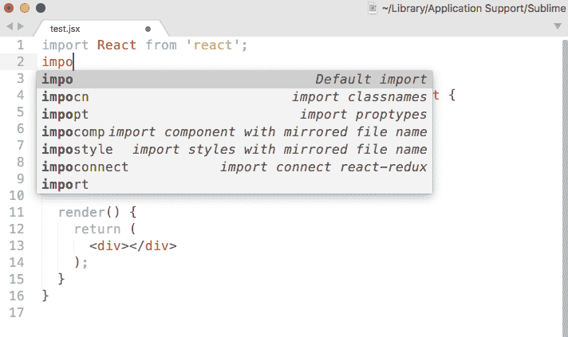
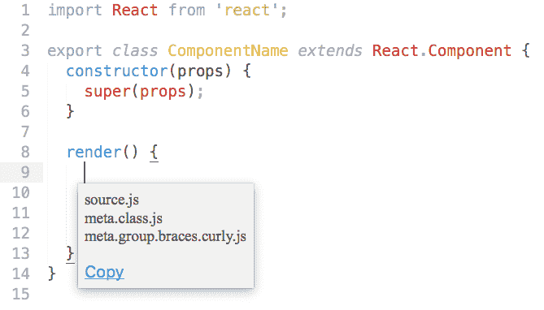

# 崇高文本片段指南

> 原文：<https://www.freecodecamp.org/news/a-guide-to-preserving-your-wrists-with-sublime-text-snippets-7541662a53f2/>

作者吉米·张

# 崇高文本片段指南


Photo by Chris Peeters from Pexels [https://www.pexels.com/photo/speed-racing-speedway-racing-car-12801/](https://www.pexels.com/photo/speed-racing-speedway-racing-car-12801/)

我最近换了工作，这需要适应很多环境:结交新同事，学习新术语，融入新的发展环境。但最重要的是，这种转变伴随着编程语言的变化，远离了 Python 整洁的美学，直接进入了 JavaScript 曲折多变的世界。

当我继续放错括号和省略圆括号时，我在寻找能帮助我在这个陌生的领域导航的东西。幸运的是，我找到了精彩的文本片段。

我喜欢崇高的文本片段，因为它们将繁琐的定义简化为几个按键，就像这样:

### 概观

Sublime 文本片段提供了一种快速插入在项目中重复出现的文本块的方法，从而加快了编写代码的速度。它们既易于理解又易于编写，这使它们成为在开发过程中节省时间和消除错误的好工具。

代码片段将触发词映射到预定义的文本块，这两者都是您定义的。要调用代码片段，请键入触发词并按下`tab`。这个简单的操作将触发词扩展到映射的文本块中——根据需要填充尽可能多的括号、圆括号和分号，始终匹配并且顺序正确。

**注意:**下面给出的例子主要适用于 JavaScript 和 React，但是关于片段的信息可以应用于任何编程语言或框架。

### 创建片段

要在 Sublime Text 3 中创建新片段，请访问:

```
Tools -> Developer -> New Snippet...
```

这将打开一个包含新代码片段模板的新窗口，如下所示:

一个代码片段有四个部分。虽然只需要一个部分，但建议定义所有四个部分。

#### **1)内容(第 3 行):必填**

```
<content><![CDATA[  Hello, ${1:this} is a ${2:snippet}.]]></content>
```

通过编辑`<![CDA` TA[ a `nd` ]] >标签之间的行，定义要由代码片段扩展的文本块。(从现在开始，调用代码片段后展开的文本块将被称为帐篷上的 snip **宠物的 c** *)。*

您会注意到出现了由美元符号、大括号、数字包围并以数字为前缀的单词。这个可选标记指定了一个**字段标记** *，*，它控制代码片段被调用后的光标位置。

内容展开后，光标自动移动到第一个字段标记(如上`${1:this}`)。再次按 tab 将光标移动到下一个编号的字段标记，或者如果没有剩余的字段，则移动到片段内容的结尾(参见下面的**专业提示**)。

字段标记中冒号后的文本是可选的。如果指定，它将作为光标移动的一部分被自动选择，这意味着它可以在一个快速的笔划中被删除。这使得冒号后的文本对于“占位符”值或可选默认值(如下面示例中的`isRequired`字段)非常有用，占位符值提供了应填写内容的指导。

**专业提示**
使用`$0`字段标记(退出标记)明确定义所有字段标记循环后光标将退出的位置。如果您想在代码片段被调用后将`tab`键重新绑定到自动完成，这是很有用的。为此，将退出标记放在第一个字段标记之后，就像这样:`${1:example}$0`

#### **2:触发字(第 6 行):可选**

```
<tabTrigger>hello</tabTrigger>
```

简短和助记触发词效果最好。比如[巴别反应片段](https://github.com/babel/babel-sublime-snippets)包映射`cwm`到`componentWillMount`、`cwr`到`componentWillReceiveProps`。

触发词是可选的，因为有另一种调用代码片段的方法，我们将在高级用法一节中介绍。

#### **3: A 范围(第 8 行):可选**

```
<scope> source: python </scope>
```

范围限制了可以调用代码片段的位置，从而提高了精确度并防止了冲突。例如，对于作用域，同一个触发字对于不同的编程语言可以有不同的含义。

这个[要点](https://gist.github.com/J2TeaM/a54bafb082f90c0f20c9)列出了如何为一长串编程语言定义作用域，但是作用域可以做得更多。我们将在高级用法一节中更详细地介绍作用域。

#### **4:描述(第 10 行):可选**

```
<description> demo description </description>
```

出于某种原因，description 标签没有出现在 create snippet 模板中。然而，提供一个将会派上用场。

片段显示在 Sublime Text 的自动完成菜单中，还有一个描述性短语。如果没有描述，这个短语默认为片段的文件名，当多个片段共享相同的前缀时，不能保证有足够的上下文。



Descriptions help me untangle my import snippets

**专业提示**
创建一个键盘快捷键来快速创建一个新的代码片段。转到`Preferences -> Keybindi` ngs，将下面一行添加到“用户”配置文件中(当然，用最适合您的组合替换`ce cmd+al` t+n):

```
{ "keys": ["cmd+alt+n"], "command": "new_snippet" }
```

### 保存片段

创建代码片段后，确保将其保存在以`sublime-snippet`结尾的文件中。在 Mac 上，用户创建的片段保存在:

```
~/Library/Application Support/Sublime Text 3/Packages/User
```

通过菜单项或键盘快捷键创建新的代码片段时，会在保存时自动提示此位置。

### 高级用法

#### 环境变量

我们已经讨论了创建静态代码片段的四个方面。但是，可以通过使用环境变量来创建动态代码片段，这些变量包含对调用代码片段的上下文的引用。

上下文是一个模糊的术语，所以参见 [Sublime 文本片段文档](http://docs.sublimetext.info/en/latest/extensibility/snippets.html#environment-variables)以获得环境变量及其确切含义的表格。

作为如何使用环境变量的一个例子，我的团队遵循一个惯例，即组件的样式表保存在与组件相同的文件名下，并给出一个`.scss`扩展名。

然后，组件文件可以利用这个约定和一个使用`$TM_FILENAME`环境变量的代码片段。

```
<content><![CDATA[  import styles from './$TM_FILENAME${1:}scss']]></content>
```

`$TM_SELECTED_TEXT`或`$SELECTION`环境变量服务于更一般的目的。还记得我说过有一种调用代码片段的替代方法吗？您也可以通过命令面板调用代码片段，而不是键入触发词并点击`tab`。

在 Mac 上，点击`cmd+shift+p`调出调色板，键入“Snippet”并从下拉列表中选择所需的代码片段。这种迂回的方法有一个主要的好处——可以调用一个带有选中文本块的代码片段，并且该文本可以作为代码片段内容的一部分。这允许您创建“换行”代码段，例如，用 if 子句将选定的文本换行。

**专业提示**
[扩展选择快捷方式](http://docs.sublimetext.info/en/latest/editing/editing.html?highlight=selection#other-ways-of-selecting-text)非常适合快速选择要用上面的代码片段换行的文本。

#### 高级范围

我们已经讨论过将代码片段限制在某些源代码文件中，但是代码片段通常有更细粒度的上下文，在这些上下文中它们是有效的。例如，像`componentWillUpdate`这样的方法通常只在组件(类)定义中有意义，下面的代码片段定义对此进行了明确说明:

第 8 行中包含的`meta.class.js`意味着该代码片段仅在被编辑的源代码文件是 JavaScript 文件、*和*光标位于类定义内的情况下有效。如果您试图调用一个空白 JavaScript 文件中的代码片段，什么也不会发生。

为了充分利用作用域的力量，您需要对语法、作用域和作用域选择器有一点了解。这些都是值得在自己的帖子中讨论的微妙主题，所以我将在很高的层次上解释它们，并提供文档链接来填补空白:

*   一种语言[语法](http://docs.sublimetext.info/en/latest/extensibility/syntaxdefs.html)定义了源代码如何被划分成作用域。
*   [作用域](http://docs.sublimetext.info/en/latest/extensibility/syntaxdefs.html#scopes)是对应于编程语言“单元”的标记文本区域，例如类或函数定义。源代码文件中的每个位置都有一个关联的范围。 [Meta](https://www.sublimetext.com/docs/3/scope_naming.html#meta) 作用域与片段最相关。
*   [范围选择器](https://manual.macromates.com/en/scope_selectors)“查询”范围。范围选择器被绑定到动作(例如代码片段或键盘快捷键)，用于确定动作在给定的当前范围内是否合适。

**专业提示**
了解望远镜的最好方法就是摆弄它们。将光标移动到文件中的不同位置，并使用`cmd+shift+p`键盘快捷键调出显示相关范围的弹出菜单:



创建片段只需几秒钟。然而，它们节省了更多的精力，不仅仅是节省了你打字的时间。通过提供快速、可重复的方法来扩展内容，片段减少了错误。它们还抽象出难以记忆的细节，比如方法名和它们的签名。所有这些都解放了你的手指和大脑，让他们专注于他们最想做的事情:编写伟大的代码。