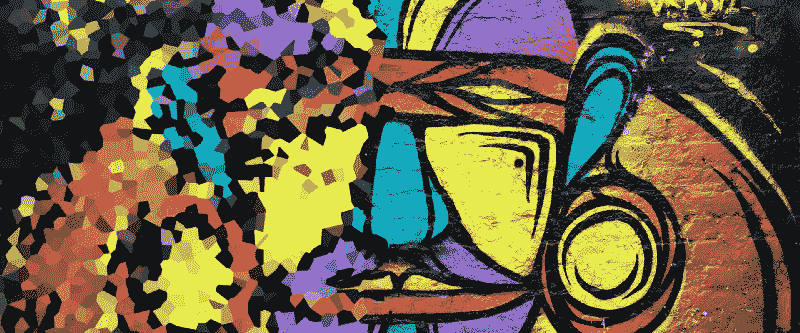
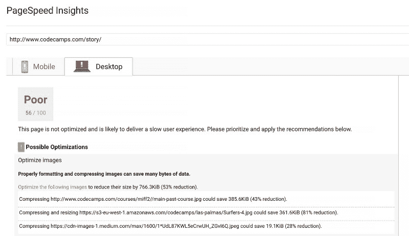
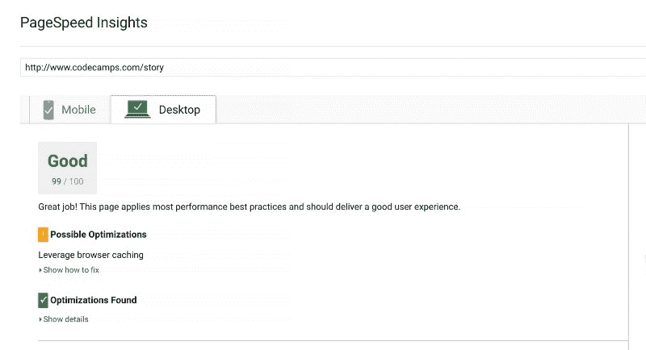

# 带有现成模板的响应图像指南

> 原文：<https://www.freecodecamp.org/news/a-guide-to-responsive-images-with-ready-to-use-templates-c400bd65c433/>

去纽约

# 带有现成模板的响应图像指南



当仅仅 2 个媒体查询就能完成工作时，为什么要生成同一图像的 12 个版本呢？用户不会注意到。

但是谷歌会。

格式错误的图片，压缩不当的图片，过大的图片都会降低页面速度，影响搜索引擎优化。

根据谷歌的说法，任何超过 2 秒的下载时间都会吓跑你的用户，并阻止爬虫索引你的网站。

当我重建我的网站时，我学到了这一点。我的目标是创建一个简单的网站，眨眼之间就可以下载。为此，我选择了[Gatsby . js](https://www.gatsbyjs.org/)——它很快，我知道。

经过几天的编码，网站已经建立并运行了。但是，令我失望的是，它在移动设备上的得分是 78/100，在桌面设备上的得分是灾难性的 57/100。一点都不好。



PageSpeed Insights 提出了解决这个问题的简单方法。只需下载该工具创建的压缩图像，就可以了。

这激起了我的好奇心。我越是考虑大小、格式和压缩级别，就越是对丰富的选择感到不知所措。png、jpg、SVG、内联 base64 编码字符串……或者 WebPs？

为了解决这个问题，我一头扎进了像素的世界，趟过了关于这个主题的随机提示的浑水，想出了一个系统的方法。

一旦我应用了我所学到的，我在移动设备上的页面速度评分从 78 增加到 91，在桌面设备上从 57 增加到 99！



在这篇文章中，我将向你展示如何快速生成可在所有浏览器中工作的响应图像，并大幅降低你的下载速度。

### 开始之前

如果您想要优化图像，您必须从具有正确格式和正确大小的高质量图像开始:

*   将 jpg 用于照片，将 png 用于需要透明度的图形或其他图像
*   对于颜色数量有限的图形，请使用较小的 PNG-8，而不是 PNG-24。为了进一步减小尺寸，您还可以减少颜色的数量，从 256 种减少到 16 种
*   将 SVG(矢量图形图像)用于图标和徽标。它们可以很好地扩展，而不会增加文件的大小
*   使用 10KB 以下的内嵌图像作为 64base 编码的字符串(节省)
*   图像的实际宽度不应该超过它将在其中显示的最大容器的宽度乘以 2(对于 retina 显示屏)

### 硬件和软件像素

占据 15 英寸 Macbook Pro 屏幕全宽的图像为 1440 像素宽，但 retina 显示屏的[实际分辨率](http://pixensity.com/)是它的两倍，为 2880x1800。为什么？因为它的像素密度因子为 2。

旧显示器的像素密度为 1。但由于近年来屏幕分辨率有所提高，硬件像素不再等同于软件或 CSS 像素。

硬件和 CSS 像素之间的关系由以下公式描述:

**CSS 像素=硬件像素/像素密度**

因此，2880 像素的硬件分辨率在 retina 显示屏上转换为 1440 CSS 像素。这也解释了为什么当您在开发工具中检查全幅图像时，您会看到它只有 1440 像素宽，而不是原来的 2880 像素。

视网膜显示器是几年前的一项重大突破。如今，移动设备甚至拥有三星 Galaxy S8+的 3 甚至 4 的“更密集”显示屏！

出于我的实验目的，我决定为了清晰起见，全幅图像的最大宽度应为 2880 像素。

当图像高度设置为 600 像素，质量设置为 75%时，Photoshop 生成了一个 939KB 的大文件。这很难接受。

在对压缩级别进行了一些实验后，很明显，将 jpg 压缩到 60%以下会导致明显的质量损失。我将质量设置为 60%作为起点，图像大小下降到 681KB。尽管如此，离体面还很远。

### WebP 格式

“WebP 是一种现代图像格式，它为网络上的图像提供了卓越的无损和有损压缩，”根据谷歌的说法。

转换成 WebP 格式后，我的图像不仅更小，而且
更清晰！WebP 又削减了 34%的 JPEG 压缩尺寸。“我在正确的道路上”，我想！

不幸的是，WebP 格式被 Chrome 和 Opera 支持，只是所有浏览器的 60%左右，根据[我能用](https://caniuse.com/#search=webp)。所以我知道我必须考虑退路。

最后，限制被设定:

*   60%的压缩级别
*   尽可能采用 WebP 格式

我还选择支持三个断点:600px 和 900px
( [这里是为什么](https://medium.freecodecamp.org/the-100-correct-way-to-do-css-breakpoints-88d6a5ba1862))和 2 像素密度——视网膜显示器的 1x 和 2x。这意味着 6 个不同的图像，而不是只有两个。支持 WebP 格式使这个数字翻了一番。

在网站上放置图片有两种主要方式，要么使用 HTML 的`img`元素，要么使用 CSS 中的`background-image`。

### HTML 中的响应图像

基本的 HTML `img`元素具有指向图像 URL 的`src`属性:

```

```

但是您可以更进一步，使用`srcset`属性根据屏幕的像素密度来决定提供哪个图像:

```

```

在这里，我使用了两种不同的屏幕密度:`1x`和`2x`。根据实际的显示密度，浏览器会选择合适的。`src` 属性指向回退选项。

目前，除了 IE、Edge 和 Opera Mini 之外，大多数浏览器都实现了`srcset`属性。

这个解决方案似乎是朝着正确方向迈出的一步。不幸的是，你的浏览器总是选择相同的图像，具有相同的像素密度，而不管显示尺寸。同样的图像会出现在桌面和移动设备上。

我们需要更多的控制。我们可以拥有它。除了像素密度，`scrset`属性接受宽度单位`w`，相当于 CSS 像素。

宽度单元使浏览器能够为给定的显示能力选择正确的图像尺寸。

有了两个断点(600 像素和 900 像素)，我们可以使用三种不同的图像尺寸:

```
 
```

这里有一个警告。当浏览器决定获取哪个图像时，它对我们的 CSS 一无所知！此时还没有获取 CSS 文件。并且它假设图像将在窗口的整个宽度上显示。

如果全幅图像是你想要的，那么很好。但是如果你想把一个图像放在一个只有`50vw`宽的容器里呢？这里开始使用`sizes` 属性。让我们来看看:

```
 
```

通过添加`sizes="50vw"`属性，您告诉浏览器图像将在`50vw`显示，并且基于该信息，浏览器将决定显示哪个图像。

但是，如果你想在大屏幕上以`50vw`的宽度显示你的图像，在移动设备上以`100vw`的宽度显示你的图像，该怎么办呢？`sizes`属性也接受媒体查询！

您可以指定在移动断点`600px`下方，您希望浏览器以全屏宽度显示您的图像。对于比移动断点更高的宽度，您希望浏览器在`50vw`显示您的图像。

您可以通过添加媒体查询来实现这一点:

```
 
```

请记住，在上面的代码行中，您是在指示浏览器选择哪个图像，因为浏览器不知道相应的 CSS。您仍然需要在 CSS 中显式添加断点。

这个解决方案真的很好，但我们在这里丢失了像素密度！如果我们停在这里，我们将把相同的图像发送到像素密度为`1x`的显示器和视网膜屏幕上。幸运的是，有一个简单的解决方法。

### 象素

认识一下 HTML5 `picture`元素。它接受`source`和`img`元素作为其子元素。我们可以使用`source`元素来列出我们希望提供给浏览器的其他图像格式。

但是在我们修正像素密度之前，让我们先介绍 WebP 格式的更小更清晰的图像。

让我们将`source`元素作为第一个选项添加到`picture`元素中，您的图像为 WebP 格式，后跟指向常规 JPG 图像的`img`。现在，当浏览器不支持 WebP 时，它会优雅地退回到`img`元素(例如 Safari)。

```
<picture>
  <source
    srcset="image.webp"
    type="image/webp"
  />
  
</picture> 
```

元素开启了一个全新的可能性世界。它接受媒体的询问！

首先，在`media`属性中，我们使用媒体查询，然后在`srcset`属性中，我们放置适当的图像。我们可以随心所欲地使用任意多的`source`元素:

```
<picture>
  <source
    media="(min-width: 900px)"
    srcset="image-lg.webp"
    type="image/webp"
  />
  <source
    media="(min-width: 600px)"
    srcset="image-md.webp"
    type="image/webp"
  />
  <source
    srcset="image-sm.webp"
    type="image/webp"
  />
  
</picture> 
```

上面，我们准备了三张 WebP 格式的图片，这取决于显示器的大小，还有一张 JPG 图片作为后备选项。

属性的最后一个秘密是它也接受像素密度。我们可以决定在哪个屏幕上以哪个像素密度显示哪个图像。诀窍是在`scrset`中列出图像文件，后跟一个空格和像素密度因子，例如:`1x`、`2x`、`3x`，甚至`4x`。

```
<picture>
  <source
    media="(min-width: 900px)"
    srcset="image-lg_1x.webp 1x, image-lg_2x.webp 2x"
    type="image/webp" />
  <source
    media="(min-width: 601px)"
    srcset="image-md_1x.webp 1x, image-md_2x.webp 2x"
    type="image/webp" />
  <source srcset="image-sm_1x.webp 1x, image-sm_2x.webp 2x" type="image/webp" />
  
</picture>
...
```

既然我们已经解决了 WebP 格式的屏幕尺寸和像素密度问题，那么让我们更仔细地看看后备选项。最后，有些浏览器不支持 WebP 格式。

在这里，我们必须决定是否要使用 1 或 2 像素密度的图像。下面，我选择了第一个选项:

```
<picture>
  <source
    media="(min-width: 900px)"
    srcset="image-lg_1x.webp 1x, image-lg_2x.webp 2x"
    type="image/webp"
  />
  <source
    media="(min-width: 601px)"
    srcset="image-md_1x.webp 1x, image-md_2x.webp 2x"
    type="image/webp"
  />
  <source srcset="image-sm_1x.webp 1x, image-sm_2x.webp 2x" type="image/webp" />
  
</picture> 
```

我们已经用`picture`元素替换了`img`元素。在可能的情况下，我们希望以三种不同的尺寸(取决于显示器尺寸)和两种不同的像素密度交付 WebP 格式的图像。如果浏览器不支持`picture`元素或 WebP 格式，它将回退到具有三种不同大小 jpg 的标准`img`元素。

**重要:**注意在`img`元素中，`srcset`属性应该放在`src`属性之前。否则，浏览器将首先下载`src`图像，然后，如果它在`srcset`中找到更好的图像，它也将下载这个图像。这样我们最终会得到两幅图像。

我们可以更进一步，为不支持 WebP 格式的浏览器创建另外 3 个`source`元素，转而提供 JPG 文件。

虽然它在 Firefox 上运行得很好，但我注意到 Safari 会下载这两个文件:`source` **中列出的 JPG 和**来自`img`元素的 JPG。同样，我们会得到两个图像，而不是一个。

### CSS 中的响应图像

如果我们不知道想要用图像覆盖的容器的确切高度和宽度，我们可以使用类似于`div`的通用元素，其中`background-image`属性指向图像 URL:

```
background-image: url("/images/image.jpg");
```

与 HTML 类似，CSS 支持图像大小优化。

CSS 中的`image-set`相当于 HTML 中的`srcset`。目前，它在 Chrome、Chrome for Android、Safari、iOS Safari 和少数其他浏览器中实现。你可以添加 [polyfills](https://github.com/wtfil/image-set-polyfill) 来让`image-set`在其他浏览器上工作，但是考虑到 Chrome 和 Safari 加起来是当今 70%用户的浏览器选择，在不久的将来大多数浏览器很有可能会实现这个属性。

但是不要担心，常规的`background-image`作为一个后备选项会起作用。

该结构与我们刚刚在一个`srcset`属性中使用的非常相似。

要创建一个高度为 500 像素的全幅图像元素，我们必须从回退选项开始——下面代码示例中的第一个`background-image`。然后，使用`-webkit-image-set`，我们需要列出不同像素密度的 WebP 图像。我们必须使用媒体查询对不同的断点重复这个过程。

需要记住的重要一点是，Chrome 和 Safari 都使用 WebKit 布局引擎，但 Safari 不支持 WebP 格式。这就是为什么我们必须用 JPG 图片添加最后一组`image-set`属性(即使它不是以`-webkit`开头，Safari 也会使用它)。

```
.bg-image {
  width: 100vw;
  height: 500px;

  background-size: cover;
  background-position: center;

  background-image: url(/images/image-lg_1x.jpg);
  background-image: -webkit-image-set(
    url(/images/image-lg_1x.webp) 1x,
    url(/images/image-lg_2x.webp) 2x
  );
  background-image: image-set(
    url(/images/image-lg_1x.jpg) 1x,
    url(/images/image-lg_2x.jpg) 2x
  );

  @media (max-width: 900px) {
    background-image: url(/images/image-md_2x.jpg);
    background-image: -webkit-image-set(
      url(/images/image-md_1x.webp) 1x,
      url(/images/image-md_2x.webp) 2x
    );
    background-image: image-set(
      url(/images/image-md_1x.jpg) 1x,
      url(/images/image-md_2x.jpg) 2x
    );
  }

  @media (max-width: 600px) {
    background-image: url(/images/image-sm_2x.jpg);
    background-image: -webkit-image-set(
      url(/images/image-sm_1x.webp) 1x,
      url(/images/image-sm_2x.webp) 2x
    );
    background-image: image-set(
      url(/images/image-sm_1x.jpg) 1x,
      url(/images/image-sm_2x.jpg) 2x
    );
  }
} 
```

这里，背景图像位于`div`元素的中心，并覆盖其整个区域。使用`image-set`属性，我们将两个不同的图像分配给两个不同的像素密度。

带有标准`url`的回退选项负责不支持`image-set`属性的浏览器。

将回退选项**放在具有`image-set`属性的**和`background-images`之前非常重要。例如，如果您将它放在`image-set`属性之后，Safari 将下载两者，来自`image-set`的图像和来自回退选项的图像(如果它发现一个具有不同文件名的图像)。

代码的其余部分遵循相同的模式。上面，我已经添加了 600px 和 900px 断点的媒体查询和一组较小尺寸的对应图像。

回退选项总是必须使用 JPG 格式，以避免图像根本无法显示的情况，即当浏览器不支持`image-set`属性或 WebP 格式时。

### 如何内联小图像

为了改善用户体验，我们不仅应该压缩和提供尽可能小的图像，还应该减少发送给服务器的请求数量。

浏览器必须为每一张图片发送单独的请求。当发送到服务器时，请求必须首先在队列中等待，这需要时间。浏览器调用的次数越多，用户等待的时间就越长。

当你必须下载许多小图片时，尤其如此。如果可能，徽标和图标应该保存为矢量图形(SVG)。小图像可以作为 base64 编码的字符串直接嵌入 HTML 或 CSS 中。

我们可以将图像作为字符串传递，而不是将常规 URL 传递给`img`元素中的`src`属性:

```

```

在 CSS 中:

```
.small-image {
  background-image: url(data:image/png;base64,encoded string);
} 
```

在大多数情况下，生成的字符串将比原始图像大 30%左右，但是您将节省另一次往返服务器的时间。

反对在 CSS 文件中使用 base64 编码图像的最常见的理由是，图像是非阻塞资源，而 CSS 文件是。这意味着如果你在你的 CSS 中嵌入太多的小图片，将会增加 CSS 文件的大小，延长网站第一次绘制的时间。这反过来会让用户在看到任何内容之前等待更长时间。

[这里](https://csswizardry.com/2017/02/base64-encoding-and-performance/)是一篇很棒的文章，讲述了为什么你可能会考虑完全放弃对图像使用编码字符串的想法。

事实可能介于两者之间，将一两个小文件作为 base64 字符串注入 CSS 或 HTML 不会造成任何伤害。

在本文的最后，您将了解如何生成它们。一开始可能会觉得奇怪，因为这些字符串有数千个字符长。你的类可能看起来像这样，但是更长:

```
.logo {
  background-image: url(data:image/png;base64,iVBORw0KGgoAAAA NSUhEUgAABqIAAAFvCAMAAAAWmCq0AAAAGXRFWHRTb2Z0d2FyZQBBZG9iZS BJbWFnZVJlYWR5ccllPAAAA3hpVFh0WE1MOmNvbS5hZG9iZS54bXAAAAAAA Dw/eHBhY2tldCBiZWdpbj0i77u/IiBpZD0iVzVNME1wQ2VoaUh6cmVTek5U Y3prYzlkIj8+IDx4OnhtcG1ldGEgeG1sbnM6eD0iYWRvYmU6bnM6bWV0…);
} 
```

### 如何生成响应图像

让我们假设你刚刚保存了一个完美的图像，你想创建所有的变化，这样你就可以在你的网站上使用它。

有许多工具可以提供帮助。简易工具有[compressjpeg.com](http://compressjpeg.com/)、[compresspng.com](http://compresspng.com/)、[tinyjpg.com](https://tinyjpg.com/)。更高级的工具包括用于 JPEG、png 和 gif 的 [ImageOptim](https://imageoptim.com) 和用于 png 的 [ImageAlpha](https://pngmini.com/) 。

在我寻求完全控制压缩级别、格式和缩放的过程中，我需要一个工具来帮助我自动化整个过程。我不喜欢拖放几十张图片。

ImageMagic 和 T2 graphics magick 都是免费且功能强大的软件，可以与 JavaScript 任务运行器 T4 Grunt 配合使用。

更好的是，有一些简单的插件可以进一步简化任务。几个快速测试表明，在相同的压缩级别下，GraphicsMagick 生成的 JPG 图像比 ImageMagic 小 20%。所以选择是明确的。

在我们开始在像素的丛林中开辟道路之前，我们必须准备好工具，磨好斧子。从[这里](http://www.graphicsmagick.org/download.html)下载 GraphicsMagick 或者使用[自制软件](http://www.graphicsmagick.org/download.html)安装。

```
brew install graphicsmagick
```

接下来，全局安装 Grunt 的 CLI:

```
npm install -g grunt-cli
```

创建一个单独的文件夹`responsive-images`并初始化项目:

```
mkdir responsive-images
cd responsive-images
npm init
```

最后，安装 Grunt 的本地版本:

```
npm install grunt --save-dev
```

创建两个文件夹:`src/`用于原始图像，而`dest/`用于 Grunt 和 GraphicsMagick 将生成的响应图像:

```
mkdir srcmk
dir dest
```

原始图像应以等于或大于您想要在`src/`文件夹中生成的最大图像的分辨率保存。我把我的保存为 100%质量和 2880 像素宽的 JPG。大约是 2.5 兆字节。

首先，让我们使用[咕噜声响应图像](http://www.andismith.com/grunt-responsive-images/)插件生成响应图像。安装它:

```
npm install grunt-responsive-images --save-dev
```

现在，在项目的根目录下，创建一个额外的文件`Gruntfile.js`:

```
touch Gruntfile.js
```

这是我们必须配置插件的地方。

将代码复制并粘贴到`Gruntfile.js`中，让我带您看一下代码:

```
module.exports = function (grunt) {
  grunt.initConfig({
    responsive_images: {
      dev: {
        options: {
          engine: "gm",
          sizes: [
            { name: "sm", suffix: "_1x", quality: 60, width: 600 },
            { name: "sm", suffix: "_2x", quality: 60, width: 1200 },
            { name: "md", suffix: "_1x", quality: 60, width: 900 },
            { name: "md", suffix: "_2x", quality: 60, width: 1800 },
            { name: "lg", suffix: "_1x", quality: 60, width: 1440 },
            { name: "lg", suffix: "_2x", quality: 60, width: 2880 },
          ],
        },
        files: [
          {
            expand: true,
            src: ["**/*.{jpg,png}"],
            cwd: "src/",
            dest: "dest/",
          },
        ],
      },
    },
  });
  grunt.loadNpmTasks("grunt-responsive-images");
  grunt.registerTask("default", ["responsive_images"]);
}; 
```

在`options`中，我们将 GraphicsMagick 设置为我们选择的引擎:`engine: "gm"`。您也可以通过将 ImageMagick 更改为`engine: "im"`来测试它。

接下来，在`sizes`数组中，我们必须指定我们想要生成的图像的参数，比如一个将被附加到原始名称的`name`，一个将被添加到名称中的`suffix`，一个`quality`和一个`width`。

生成的图像将具有以下命名结构:

```
original-[name]_[suffix}.jpg
```

例如，使用第一个`sizes`对象，Grunt 将从原始的`my-image.jpg`生成 60%压缩级别和 600 像素宽的`my-image-sm_1x.jpg`图像。

在选项下面，我们需要列出源和目标文件夹，以及我们想要处理的文件名模式。

要启用文件对象的动态构建，让我们将`expand`属性设置为`true`并定义:

*   `cwd` —源文件夹
*   `src` —要匹配的模式数组。在我们的例子中，我们希望匹配源文件夹中的任何文件夹(`**`)以及扩展名为`jpg`或`png`的所有文件
*   `dest` —目标文件夹

上述任务将生成一组 JPG 和/或 PNG 文件，具体取决于源图像文件扩展名。

我们还想生成一组相应的 WebP 图像。

我们需要另一个插件来完成这项工作:`grunt-cwebp`。让我们安装它:

```
npm install grunt-cwebp --save-dev
```

使用以下配置附加 Gruntfile.js:

```
module.exports = function (grunt) {
  grunt.initConfig({
    responsive_images: {
      ...
    },
    cwebp: {
      dynamic: {
        options: {
          q: 60,
        },
        files: [
          {
            expand: true,
            cwd: "dest/",
            src: ["**/*.{jpg,png}"],
            dest: "dest/",
          },
        ],
      },
    },
  });
  grunt.loadNpmTasks("grunt-responsive-images");
  grunt.loadNpmTasks("grunt-cwebp");
  grunt.registerTask("default", ["responsive_images", "cwebp"]);
}; 
```

`grunt-cwebp`插件使用`dest/`文件夹作为图像源。我们希望所有新生成的 jpg 都有它们的 WebP 兄弟，我们应该把它们放在同一个文件夹中。

现在，我们可以处理图像:

```
grunt
```

对于`src/`文件夹中的每一张图片，Grunt 将会生成 12 张图片，它们具有所有必要的尺寸、像素密度以及 JPG 和 WebP 格式。

### 如何生成 base64 字符串

如果您想生成 base64 字符串来内联您的图像，下面是如何做。

这一次，我们使用 Grunt 插件:`grunt-base64`。

在单独的文件夹`base64-images`中创建新项目。用`npm`初始化它，并安装 Grunt 的本地版本:

```
mkdir base64-images
cd base64-images
npm init
npm install grunt --save-dev
```

安装`grunt-base64`插件:

```
npm install grunt-base64 --save-dev
```

在根目录下，创建一个新的`images/`文件夹和`Gruntfile.js`:

```
mkdir images
touch Gruntfile.js
```

并将代码复制粘贴到`Gruntfile.js`:

```
module.exports = function (grunt) {
  grunt.initConfig({
    base64: {
      dev: {
        files: {
          "images/output.b64": ["images/*.{jpg,png}"],
        },
      },
    },
  });
  grunt.loadNpmTasks("grunt-base64");
  grunt.registerTask("default", ["base64"]);
}; 
```

将小的原始图像放在`images/`文件夹中，然后运行 Grunt:

```
grunt
```

任务完成后，从`output.b64`文件中复制全部内容——这是 base64 字符串，可以粘贴到`background-image`的`url`或`img`元素的`src`属性中。

还有一种更简单的方法(在 Mac OS X 或 Linux 上):

```
uuencode -m image-file-name remotename
```

不使用`remotename`,甚至可以放置`xyz`,将 base64 字符串打印到标准输出中——在大多数情况下，打印到终端窗口中。
你必须使用`-m`选项来获得 base64 编码。

### 结论

响应迅速的图像起初可能会让人感到力不从心，但是有了 Grunt 和图像处理引擎，您就可以创建一个流畅的过程，并自动完成大多数重复的任务。我保证这是值得的。你不仅会在 PageSpeed Insights 上大放异彩，而且你还会大幅减少网站第一次刷漆的时间。

在我的例子中，原始的 939KB 图像缩小了 60%到 380KB (JPG ),在 WebP 格式下缩小了 77%到 218KB。

最终，我的像素改革得到了回报——我的网站的 PageSpeed Insight 评级变成了绿色。

如果你喜欢这篇文章，👏即使是 5 次 **0 次**——我真的会很感激，这对我有很大的不同。


我最近为初学者发布了一个免费的 React 教程。如果您想学习如何从头开始构建 web 应用程序，这是一个很好的起点。您将学习如何构建一个应用程序来帮助您找到最适合观看的电影👉南瓜