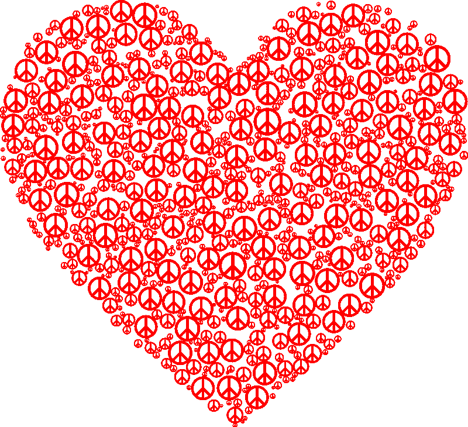
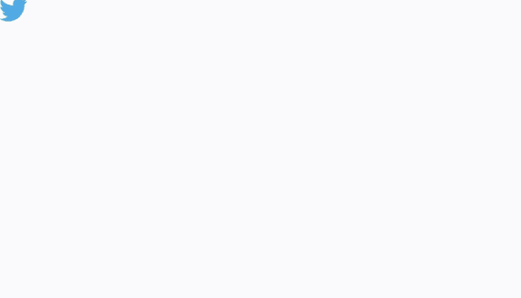
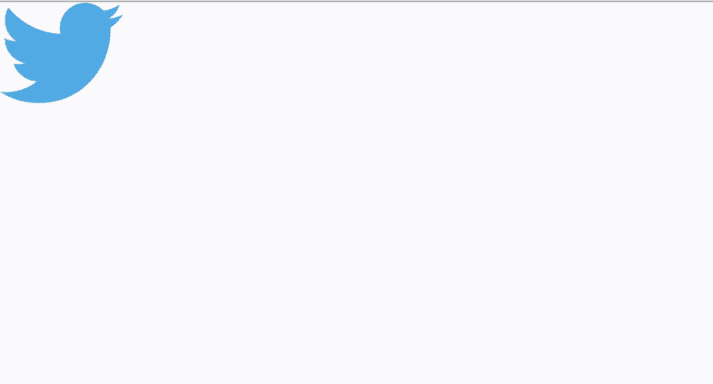
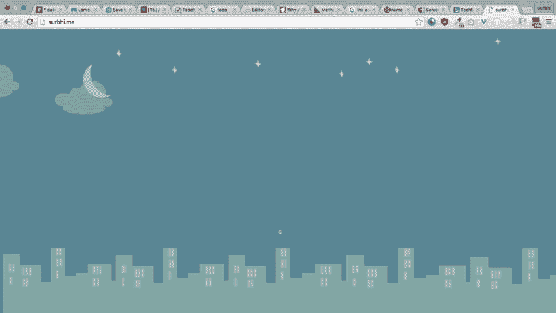

# 如何设计、编码和制作 SVG 动画

> 原文：<https://www.freecodecamp.org/news/a-guide-to-svg-on-web-c5932dadca03/>

作者:苏尔比·奥贝罗伊



# 如何设计、编码和制作 SVG 动画

您可以将可缩放矢量图形(SVG)视为响应图形。SVG 是一种基于 XML 的格式，允许您使用定义的标签和属性创建图像。您的代码将呈现一个您可以在代码编辑器中编辑的图像。

下面是一个 SVG 示例。如果您查看它的代码，您会注意到它是由标记和属性组成的，就像 HTML 文档一样。整个事情都包含在<svg>标签里面。首先，有一个黑色线条和白色填充的<rect>标签。在那里面，有一个椭圆(几乎是一个圆，但是注意 ry 和 rx 属性),用红色填充。</rect></svg>

我们可以通过两种方式在 web 上使用 SVG。我们可以使用 SVG 文件作为标签的 src 属性。因此，您可以像处理 png 和 JPEGs 一样处理。

但是，更有趣的情况是(如果你已经注意到标签像 HTML 一样有一个 id 属性),我们可以直接将 SVG 的源代码粘贴到 HTML 中的一个

中。然后，我们可以按照我们想要的方式，将这些 div 设计成单个构建块，甚至是构建块组。我们可以应用 CSS、动画，甚至使用 JavaScript 添加交互性。这使得 SVGs 成为 HTML 中最通用、最热门的元素之一。

SVG 具有无限的可伸缩性，响应速度快，文件大小更小，面向下一代百万像素密集屏幕，可以使用已知的 web 技术(即 CSS 和 JavaScript)进行样式化、动画化和交互。

请注意，所有这些事情以前都只能通过 flash 嵌入来实现，这需要 Flash 播放器和大量的专业工作。而且现在对 Flash 也没什么好感了。

#### 矢量与光栅图像

光栅图像由像素组成，以形成完整的图像。JPEGs、gif 和 png 是常见的光栅图像类型。几乎所有在网上找到的照片都是光栅图像。

光栅图像由固定数量的像素组成，因此不可能在不影响分辨率的情况下调整其大小。您可能已经注意到，调整大多数图像的大小会使它们看起来模糊不清。这是因为它们的像素数量是固定的。

以下是放大光栅图像时发生的情况:



另一方面，矢量图像是灵活的，并且与分辨率无关。它们是使用几何形状——直线、矩形、曲线——或一系列命令构建的。您可以编辑它们的属性，如颜色、填充和轮廓。

矢量图像的一个常见用途是图标和小图标动画。即使在最高密度的显示器上，如即将推出的 4k 智能手机上，这些也会显得清晰。

放大矢量图像时会发生以下情况:



#### SVG 标签

**< s** vg >

标签在当前文档中嵌入一个 SVG 文档，例如 HTML。标签有自己的 x 和 y 坐标、高度和宽度，以及自己唯一的 id。

下面是一个<svg>标签可能的样子:</svg>

```
<svg width="580" height="400" >
```

**<**；g >

标签将元素组合在一起，充当相关图形元素的容器。一个<g>元素甚至可以包含嵌套在其中的其他<g>元素。</g></g>

下面是一个<g>标签的例子:</g>

```
<g> <title>background</title> <rect fill="#fff" id="canvas_background" height="402" width="582" y="-1" x="-1"/> <g display="none" overflow="visible" y="0" x="0" height="100%" width="100%" id="canvasGrid"> <rect fill="url(#gridpattern)" stroke-width="0" y="0" x="0" height="100%" width="100%"/> </g> </g>
```

**< re** ct >

<rect>元素是一个表示矩形的 SVG 基本形状。元素可以有各种属性，如坐标、高度、宽度、填充颜色、笔画颜色以及尖角或圆角。</rect>

下面是一个<rect>标签的例子:</rect>

```
<rect id="svg_1" height="253" width="373" y="59" x="107.5" stroke-width="1.5" stroke="#000" fill="#fff"/>
```

**< u** se >

<use>元素允许您克隆和重用图形 SVG 元素，包括其他元素，如 <g><rect>以及其他<use>元素。</use></rect></g></use>

下面是一个<use>标签的例子:</use>

```
<text y="15">black</text> <use x="50" y="10" xlink:href="#Port" /> <text y="35">red</text> <use x="50" y="30" xlink:href="#Port"/> <text y="55">blue</text> <use x="50" y="50" xlink:href="#Port" style="fill:blue"/
```

**< pa** th >

元素定义了一个形状的坐标路径。path 标记的代码可能看起来很神秘，但是不要害怕。下面的示例代码可以这样读:
1。“M150 o”-移动到(150，0)

2.“L75 200”—从最后一个位置(为(150，0))画一条线到(75，200)

3.“L255 200”—从最后一个位置(是(75，200)画一条线到(225，200)

4.“Z”-闭合回路(绘制到起点)

您可能不需要学习这个，因为 path 的代码可以在任何 SVG 编辑器中生成，但是知道这个很酷。

下面是一个<path>标签的例子:</path>

```
<svg height="210" width="400"> <path d="M150 0 L75 200 L225 200 Z" /> </svg>
```

**<符号** ol >

最后，<symbol>元素定义了可重用的符号。这些符号只能在被<use>元素调用时呈现。</use></symbol>

下面是一个<symbol>标签的例子:</symbol>

```
<svg> <symbol id="sym01" viewBox="0 0 150 110"> <circle cx="50" cy="50" r="40" stroke-width="8" stroke="red" fill="red"/> <circle cx="90" cy="60" r="40" stroke-width="8" stroke="green" fill="white"/> </symbol> <use xlink:href="#sym01" x="0" y="0" width="100" height="50"/> <use xlink:href="#sym01" x="0" y="50" width="75" height="38"/> <use xlink:href="#sym01" x="0" y="100" width="50" height="25"/> </svg>
```

#### 创建 SVG

有很多 SVG 编辑器可用，如 Adobe Illustrator 和 Inkscape，后者是免费的开源软件。因为 SVG 文件是纯文本 XML，所以必要时也可以手工编码。

对于这个例子，我将使用一个简单的在线[编辑器](http://editor.method.ac/)，在这里你可以设计 SVG 而不需要安装任何东西。

1.  首先创建一个圆

2.接下来添加更多的圆并保存源代码

**CSS3 动画**

SVG 可以通过在代码中向 SVG 路径添加一个 id 或一个类来制作动画，然后像处理任何其他文档一样在 CSS3 中对其进行样式化。下面是一个如何制作 SVG 动画的例子。

CSS3 动画提供了多种动画类型供您选择。线条动画是 SVG 的另一个很酷的属性。

对于下一个例子，我在编辑器中使用 pen 编写了文本“嗨，我是 Surbhi”。然后我再次使用 CSS3 关键帧来制作笔画动画。

请注意，每个路径都有一个唯一的 id。这是因为当动画中的一个笔画有多个单词时，动画中的延迟很重要。

#### <animate>标签动画</animate>

<animate>是一个内置于 SVG 元素本身的动画标签。它定义了元素的属性如何在指定的动画持续时间内从初始值变为最终值。这是用来动画的属性不能单独由 CSS 动画。</animate>

动画标签的常见元素是颜色、运动和变换。

animate 标签嵌套在必须制作动画的对象的 shape 标签内。它不适用于路径坐标，而只适用于对象标签内部。请注意加法属性。它表示动画不会覆盖另一个，而是同时一起工作。

下面是一个使用 HTML5 animate 标签制作 SVG 动画的例子:

#### 基于 JavaScript 的动画和交互性

因为 SVG 只是一个带有标签的文档，所以我们也可以使用 JavaScript 通过获取它们的选择器(id 或类)来与 SVG 的单个元素进行交互。

除了 vanilla JS，还有各种 JavaScript 库可用于制作 svg 动画并与之交互，如 Vivus.js、Snap.svg、RaphaelJS 和 Velocity.js。

在下面的例子中，我使用了 Vivus.js 库和 jQuery 来实现线条动画。

#### 为什么不对所有图像使用 SVGs？

SVG 最适合于可以用很少的几何形状和公式构建的图像。虽然原则上，您可以将任何像照片这样的东西转换成 SVG，但是图像的大小将会是几兆字节，这就违背了使用 SVG 节省空间的目的。对于图标、标志和小动画，你最好使用 SVG。

这是我在学习 SVG 时创建的东西，使用 CSS 和 SVG，没有任何库。(不要评判！)[https://github.com/surbhioberoi/surbhi.me](https://github.com/surbhioberoi/surbhi.me)



*最初发布于[surbhioberoi.com](http://surbhioberoi.com/a-complete-guide-to-svg/)2016 年 7 月 12 日。*