# JavaScript 中的指南

> 原文：<https://www.freecodecamp.org/news/a-guide-to-this-in-javascript-e3b9daef4df1/>

作者阿莎·曼德瓦娅？️?？

# JavaScript 中的指南

*

Photo by [sydney Rae](https://unsplash.com/@srz?utm_source=medium&utm_medium=referral) on [Unsplash](https://unsplash.com?utm_source=medium&utm_medium=referral)* 

*关键字`this`无疑是 JavaScript 中使用最广泛但也最容易被误解的一个。我今天会努力改变这种情况。*

*让我们回到过去美好的学生时代，那时我们学习代词。*

> *菲尔普斯游得很快，因为他想赢得比赛。*

*注意代词“他”的用法。这里我们不直接称呼菲尔普斯，而是用代词“他”来指代“T2”菲尔普斯“T3”。类似地，JavaScript 使用`this`关键字作为指称对象来指代上下文*中的对象，即主题*。*

*示例:*

*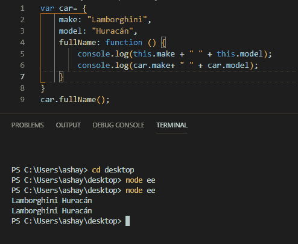*

```
*`var car= {make: "Lamborghini",model: "Huracán",fullName: function () {console.log(this.make+" " +this.model);console.log(car.make+ " " +car.model);}}car.fullName();`*
```

*在上面的代码中，我们有一个对象`car`，它有属性`make`、`model` 和`fullName`。`fullName`的值是一个使用两种不同语法打印汽车全名的函数。*

*   *用`this` = & g `t; this.make+” “ +this.mod` el `the t` his 指`is c` ar `so this.ma` ke 有效`ly car.m` ake 和 so `is this.mo` del 的上下文中的对象。*
*   *利用点符号，我们可以访问物体的属性，`car.make` & `car.model`。*

### *`this` 是吗！*

*既然我们已经了解了什么是`this` 及其最基本的用法，让我们制定一些经验法则，这样我们就能永远记住。*

#### *JS `this`关键字指的是它所属的对象。*

```
*`var car={make:'....'func:()=>{console.log(this.make)}}`*
```

*上面代码片段中的`this` 属于对象汽车。*

#### *它根据不同的用途取不同的值*

1.  *在方法内部。*
2.  *在函数内部。*
3.  *一个人。*
4.  *在一次事件中。*
5.  *`call()`和`apply().`*

***在方法内部***

*当`this`在方法内部使用时，它指的是所有者对象。*

*在对象内部定义的函数称为方法。让我们再次以汽车为例。*

```
*`var car= {make: "Lamborghini",model: "Huracán",fullName: function () {console.log(this.make+" " +this.model);console.log(car.make+ " " +car.model);}}car.fullName();`*
```

*`fullName()`这里有一个方法。这个方法里面的`this`属于`car`。*

***在函数内部***

*`this` 函数内部有点复杂。首先要理解的是，像所有的对象都有属性一样，函数也有属性。每当该函数被执行时，它就获得`this`属性，这是一个变量，包含调用它的对象的值。*

> **这个*实际上只是对“先行对象”——调用对象——的快捷方式引用。—javascriptissexy.com*

*如果函数不是由一个对象调用的，那么函数中的`this` 属于全局对象，这个对象叫做窗口。在这种情况下，这将引用全局范围中定义的值。为了更好地理解，让我们看一个例子:*

```
*`var make= "Mclaren";var model= "720s"function fullName(){ console.log(this.make+ " " + this.model);}`*
```

```
*`var car = {    make:"Lamborghini",    model:"Huracán",    fullName:function () {    console.log (this.make + " " + this.model);    }}    car.fullName(); // Lmborghini Huracán    window.fullName(); // Mclaren 720S    fullName(); // Mclaren 720S`*
```

*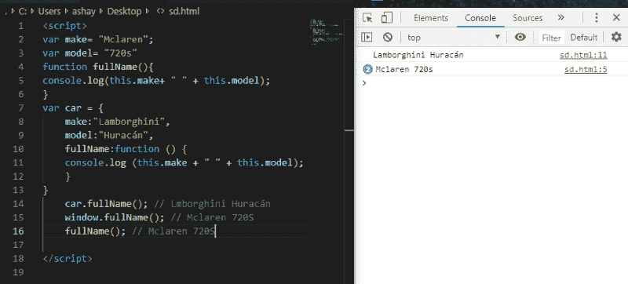*

*这里`make, model`和`fullName` 是全局定义的，而`car` 对象也有一个`fullName` 的实现。当被`car`对象调用时，它引用对象内部定义的属性。另一方面，其他两个函数调用是相同的，都返回全局定义的属性。*

***独自一人***

*当不在任何函数或对象内部单独使用时，`this` 指全局对象。*

*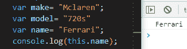*

*这里的`this` 是指全局名称属性。*

***在一个事件中***

*事件可以是任何类型，但是为了简单明了，让我们来看一个点击事件。*

**

*每当单击一个按钮并引发一个事件时，它可以调用另一个函数来完成基于单击的特定任务。如果在该函数中使用了`this` ，它将引用引发事件的元素。在 DOM 中，所有的元素都存储为对象。这就是为什么当一个事件被引发时，它引用那个元素，因为那个*网页元素实际上是 DOM* 中的一个对象。*

*示例:*

```
*`<button onclick="this.style.display='none'">  Remove Me!</button>`*
```

***调用()，应用()&绑定()***

*   *bind:允许我们在方法上设置`this`值。*
*   *调用和应用:允许我们借用函数，并在函数调用时设置`this` 值。*

*调用、绑定和应用本身是另一篇文章的主题。它们非常重要，在这里解释它们是不可能的，因为我们应该了解所有关于`this` 的知识，才能知道这些函数的用法。*

### *最棘手的部分*

*如果理解得好，在某种程度上使我们的工作更容易。但也有一些被误解的情况。*

#### *例 1。*

*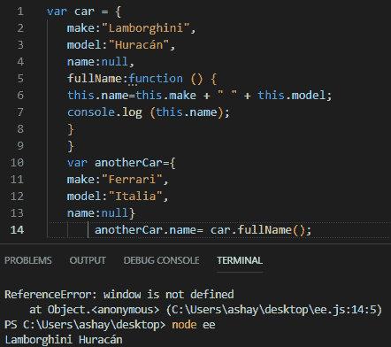*

```
*`var car = {make:"Lamborghini",model:"Huracán",name:null,fullName:function () {this.name=this.make + " " + this.model;console.log (this.name);}}`*
```

```
*`var anotherCar={make:"Ferrari",model:"Italia",name:null}`*
```

```
 *`anotherCar.name= car.fullName();`*
```

*我们得到了一个意想不到的结果。我们从另一个对象借用了一个使用`this` 的方法，但这里的问题是，该方法只分配给了`anotherCar` 函数，但实际上是在`car` 对象上调用的。这就是为什么我们得到的结果是兰博基尼而不是法拉利。*

*为了解决这个问题，我们使用了`call()` 方法。*

*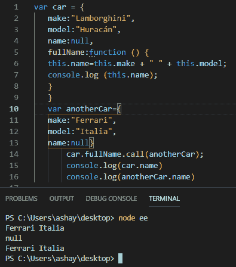*

*这里的`call()`方法调用了原本没有`fullName()`功能的`anotherCar` 对象上的`fullName()`。*

*我们还可以看到，当我们记录`car.name` 和`anotherCar.name` 时，我们得到的是后者的结果，而不是前者，这意味着函数确实是在`anotherCar` 上调用的，而不是在`car`上。*

#### *例 2。*

*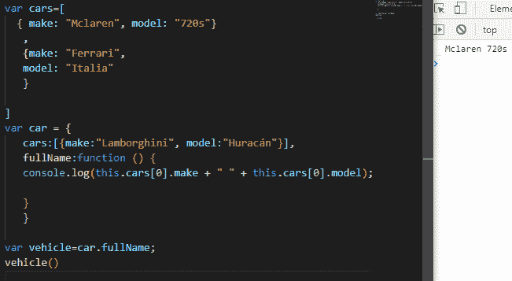*

```
*`var cars=[{ make: "Mclaren", model: "720s"},{make: "Ferrari",model: "Italia"}]`*
```

```
*`var car = {cars:[{make:"Lamborghini", model:"Huracán"}],fullName:function () {console.log(this.cars[0].make + " " + this.cars[0].model);}}var vehicle=car.fullName;vehicle()`*
```

*在上面的代码片段中，我们有一个名为 cars 的全局对象，在 car 对象中有一个同名的对象。然后将`fullName()`方法分配给随后被调用的车辆变量。该变量属于全局对象，因此由于上下文关系，`this` 调用全局`cars` 对象，而不是`cars`对象。*

*为了解决这个问题，我们使用`.bind()`函数来解决这个问题。*

*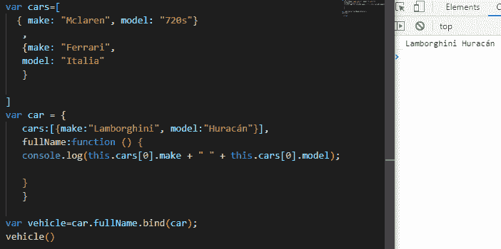*

*绑定帮助我们特别设置`this` 值，因此 vehicle 变量显式地指向 car 对象，而不是全局对象，所以这位于`car`对象的上下文中。*

#### *例 3。*

*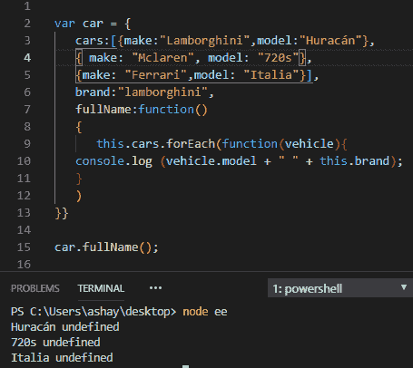*

```
*`var car = {cars:[{make:"Lamborghini",model:"Huracán"},{ make: "Mclaren", model: "720s"},{make: "Ferrari",model: "Italia"}],fullName:function(){this.cars.forEach(()=>{console.log (this.make + " " + this.model);})}}car.fullName();`*
```

*在上面的代码片段中，`fullName()`调用一个函数，该函数使用`forEach`遍历 cars 数组。在`forEach` 中有一个匿名函数，它丢失了上下文。JavaScript 中函数内部的函数称为`closure`。`Closures` 在 JavaScript 中非常重要并被广泛使用。*

*这里起作用的另一个重要概念是`scope`。函数内部的变量不能访问其`scope`外部的变量和属性。anon 函数内部的`this`无法访问其外部的`this`。所以`this`无处可去，只能指向全球目标。但是这里没有为`this`定义要访问的属性，所以`undefined` 被打印。*

*解决上述问题的一个方法是，我们可以在匿名函数外部给一个变量赋值`this`，然后在匿名函数内部使用它。*

*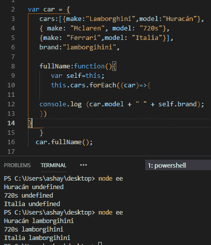*

*这里，self 变量包含与内部函数一起使用的`this` 的值，从而给出输出。*

#### *例 4。*

*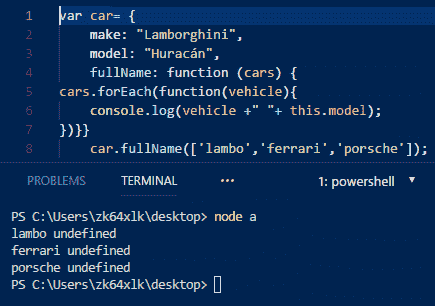*

```
*`var car= {make: "Lamborghini",model: "Huracán",fullName: function (cars) {cars.forEach(function(vehicle){console.log(vehicle +" "+ this.model);})}}car.fullName(['lambo','ferrari','porsche']);`*
```

*这是一个重新讨论过的例子，其中`this`是不可访问的，所以我们通过使用一个名为 self 的变量来保存它的值。让我们用箭头函数来解决同样的问题:*

*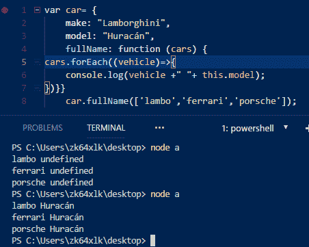*

*正如你所看到的，在`forEach()` 中使用一个箭头函数自动解决了这个问题，我们不必进行绑定，或者将`this`的值赋给其他变量。这是因为箭头函数绑定了它们的上下文，所以`this`实际上指的是原始上下文，或者原始对象。*

#### *例 5。*

*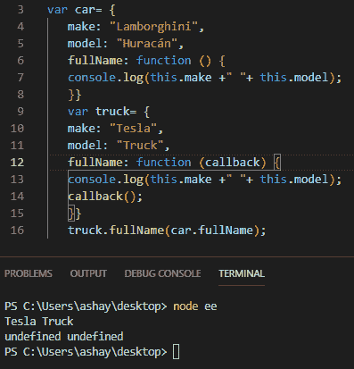*

```
*`var car= {make: "Lamborghini",model: "Huracán",fullName: function () {console.log(this.make +" "+ this.model);}}var truck= {make: "Tesla",model: "Truck",fullName: function (callback) {console.log(this.make +" "+ this.model);callback();}}truck.fullName(car.fullName);`*
```

*上面的代码由两个相同的对象组成，其中一个包含一个**回调**函数。一个**回调**函数是一个作为参数传递给另一个函数的函数，然后在外部函数中被调用以完成某种例程。*

*这里，卡车对象的`fullName` 方法由一个**回调**组成，该回调也在它的**内部被调用。**我们的用车对象还是和以前一样。当我们用回调(参数)作为汽车对象的`fullName`方法调用卡车的`fullName`方法时，我们得到的输出是`Tesla Truck`和`undefined undefined.`*

*在阅读了 `this` 之后，你们中的一些人可能已经预感到`car.fullName` 会打印卡车物体的模型和构造，但是让你们失望的是，`this` 又一次捉弄了我们。在这里，`car.fullName` 作为一个参数被传递，实际上并没有被 truck 对象调用。回调调用 car 对象方法，但是请注意，该函数的实际调用位置是回调，回调将它绑定到全局对象。有点混乱，再读一遍！*

*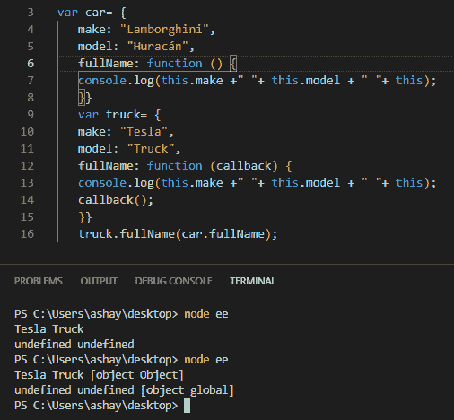*

*为了清楚起见，我们打印了`this`本身。我们可以看到回调的`this`被赋予了全局作用域。所以为了得到一个结果，我们创建了全局的`make` 和`model` 属性。*

*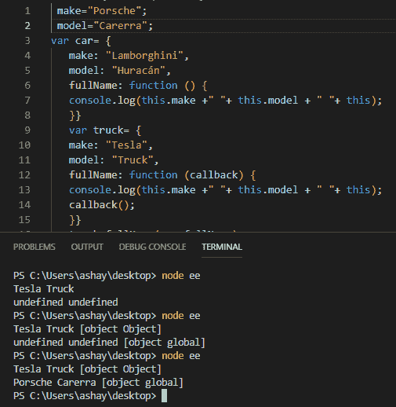*

*同样，使用全局`make`和`model`属性运行相同的代码，我们最终得到全局`this`的答案。这证明了`this`引用了全局对象。*

*为了得到我们想要的结果，`car.fullName` 结果我们将再次使用`bind()`将 car 对象硬绑定到回调，这将使一切再次正确。*

*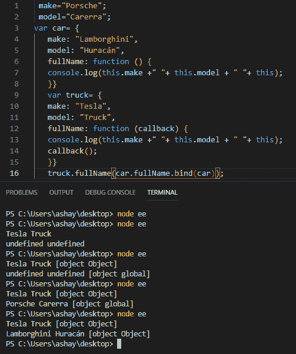*

### *解决了！*

*毫无疑问,`this` 非常有用，但也有其自身的缺陷。希望我让你很容易理解。如果你想要更多像这样简化的内容，请关注我的 Medium。如果你喜欢，请留下你的回答并分享。*

*

Google*