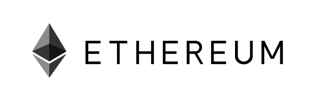
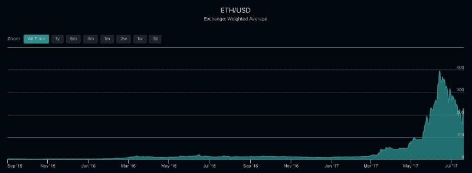

# 一名黑客窃取了价值 3100 万美元的以太——这是如何发生的，以及这对以太坊意味着什么

> 原文：<https://www.freecodecamp.org/news/a-hacker-stole-31m-of-ether-how-it-happened-and-what-it-means-for-ethereum-9e5dc29e33ce/>

作者 Haseeb Qureshi

# 一名黑客窃取了价值 3100 万美元的以太——这是如何发生的，以及这对以太坊意味着什么


昨天，一名黑客完成了数字货币史上第二大盗窃案。

太平洋时间 12:00 左右，一名未知攻击者利用以太坊网络上的奇偶多重签名钱包中的一个关键缺陷，在几分钟内耗尽了三个价值超过 31，000，000 美元的以太钱包。再过几个小时，黑客就可以从易受攻击的钱包里偷走超过 1.8 亿美元。

但是有人阻止了他们。

敲响警钟后，一群来自以太坊社区的仁慈的白帽黑客迅速组织起来。他们分析了攻击，并意识到没有办法逆转盗窃，但更多的钱包是脆弱的。时间是至关重要的，所以他们只有一个选择:在攻击者之前黑掉剩下的钱包。

通过利用相同的漏洞，白帽子[攻击了所有剩余的有风险钱包](https://etherscan.io/address/0x1dba1131000664b884a1ba238464159892252d3a)并清空了他们的账户，有效地阻止了攻击者获得剩余的 150，000，000 美元。

是的，你没看错。

为了防止黑客抢劫更多的银行，白帽子们编写了软件来抢劫世界上剩下的所有银行。一旦钱被安全盗走，他们就开始将资金返还给各自的账户持有人。因这一英雄壮举而存了钱的人们现在正在取回他们的资金。

这是一个非同寻常的故事，它对加密货币的世界有着重要的意义。

重要的是要明白这个漏洞不是以太坊或奇偶校验本身的漏洞。确切地说，这是奇偶校验客户端提供给用户的默认智能合约代码中的一个漏洞，用于部署多签名钱包。

这一切都很复杂，所以为了让每个人都清楚这个细节，这篇文章分为三个部分:

1.  到底发生了什么？以太坊、智能合约和多签名钱包的解释。
2.  他们是怎么做到的？对攻击的技术解释(专门针对程序员)。
3.  现在怎么办？此次攻击对智能合约的未来和安全性的影响。

如果你熟悉以太坊和密码世界，你可以跳到第二部分。

### 1.到底发生了什么？

这个故事有三个组成部分:**以太坊**、**智能合约**和**数字钱包**。



[以太坊](https://www.ethereum.org/)是 2013 年发明的数字货币——在比特币发布整整 4 年后。从那以后，它已经成为世界上市值第二大的数字货币——200 亿美元，而比特币的市值为 400 亿美元。

像所有加密货币一样，以太坊是比特币协议的后代，并对比特币的设计进行了改进。但不要被骗了:虽然它是一种像比特币一样的数字货币，但以太坊要强大得多。

比特币使用其区块链来实现货币交易的分类账，以太坊使用其区块链来记录巨型分布式计算机中的状态转换。以太坊对应的数字货币以太，本质上是给这台海量计算机供电的副作用。

换句话说，*以太坊实际上是一台跨越整个世界的计算机*。任何在他们的电脑上运行以太坊软件的人都参与了这个世界的运作——电脑，以太坊虚拟机(EVM)。因为 EVM 被设计成[图灵完全](https://en.wikipedia.org/wiki/Turing_completeness)(忽略气体限制)，它可以做几乎任何可以用计算机程序表达的事情。

让我强调一下:*这是疯狂的事情*。加密世界对以太坊的潜力充满热情，在过去的 6 个月里，以太坊的价值飞速增长。



开发人员社区已经团结起来支持它，人们对可以在 EVM 上构建什么感到非常兴奋——这将我们带到了智能合同。

智能合约是运行在 EVM 上的简单的计算机程序。在许多方面，它们就像正常的合同，只不过它们不需要律师或法官来解释。相反，它们被编译成字节码，并由 EVM 明确解释。有了这些程序，你可以(除了别的以外)只根据合同代码的规则以编程方式转移数字货币。

当然，有些事情是普通合约做不到的，智能合约无法轻易与不在区块链上的东西进行交互。但是智能合约也可以做普通合约做不到的事情，比如完全通过牢不可破的密码术强制执行一套规则。

这让我们想到了钱包的概念。在数字货币的世界里，钱包是你储存资产的方式。你基本上使用一个秘密密码，也就是你的私人密钥([简化了一点](http://searchsecurity.techtarget.com/definition/asymmetric-cryptography))来访问你的钱包。

有许多不同类型的钱包赋予不同的安全属性，如取款限额。最受欢迎的类型之一是多签名钱包。

在多签名钱包中，有几把私人钥匙可以打开钱包，但只有一把钥匙不足以打开钱包。例如，如果您的多签名钱包有 3 把钥匙，您可以指定至少要提供 3 把钥匙中的 2 把才能成功解锁。

这意味着，如果你、你的父亲和你的母亲都是这个钱包的签字人，即使犯罪分子黑了你的母亲并偷走了她的私钥，他们仍然无法访问你的资金。这导致了更强的安全保证，因此多 SIG 是钱包安全的标准。

这就是黑客攻击的钱包类型。

那么是哪里出了问题呢？他们破解了私人钥匙吗？他们用的是量子计算机，还是某种尖端的因子分解算法？

不，所有的密码都是可靠的。这个漏洞非常简单:他们在代码中发现了一个程序员引入的错误，让他们重新初始化钱包，就像恢复到出厂设置一样。一旦他们这样做了，他们就可以自由地将自己设定为新的所有者，然后带着一切离开。

### 2.这是怎么发生的？

以下是对所发生事情的技术解释。如果您不是开发人员，请随意跳到下一节，因为这将是大量的编程工作。

以太坊有一个相当独特的编程模型。在以太坊上，你通过发布契约(你可以把它想象成对象)来编写代码，通过调用这些对象上的方法来变异它们的状态来执行事务。

为了在以太坊上运行代码，你需要首先部署契约(部署本身就是一个事务)，这需要花费少量的以太。然后，您需要调用契约上的方法来与之交互，这需要更多的时间。可以想象，这激励程序员优化他们的代码，既减少事务又减少计算成本。

降低成本的一个方法是使用图书馆。通过让您的契约调用先前部署的共享库，您不必重新部署任何共享代码。在以太坊，让你的代码保持干爽会直接帮你省钱。

奇偶校验中的默认多签名钱包正是这样做的。它引用了一个包含钱包初始化逻辑的共享外部库。该共享库由库协定的公钥引用。

```
// FIELDSaddress constant _walletLibrary = 0xa657491c1e7f16adb39b9b60e87bbb8d93988bc3;
```

这个库在几个地方被调用，通过一个叫做`DELEGATECALL`的 EVM 指令，它做以下事情:对于调用`DELEGATECALL`的任何方法，它将调用你委托的契约上的相同方法，但是使用当前契约的上下文。它本质上类似于一个`super`调用，除了没有继承部分。(在 JavaScript 中对应的是`OtherClass.functionName.apply(this, args)`。)

在他们的多签名钱包中有一个这样的例子:`isOwner`方法只是委托给共享钱包库的`isOwner`方法，使用当前契约的状态:

```
function isOwner(address _addr) constant returns (bool) {    return _walletLibrary.delegatecall(msg.data);}
```

这一切都是无辜的。multi-sig 钱包本身包含了所有正确的权限检查，它们肯定会对所有与钱包状态相关的敏感操作严格执行授权。

但是他们犯了一个严重的错误。

可靠性允许你定义一个“回退方法”当没有匹配给定方法名的方法时，就会调用这个方法。您通过不给它命名来定义它:

```
function() {    // do stuff here for all unknown methods}
```

奇偶校验小组决定让任何向契约发送以太的未知方法默认存放发送的以太。

```
function() payable {    // payable is just a keyword that means this method can receive/pay Ether
```

```
if (msg.value > 0) {    // just being sent some cash?    Deposit(msg.sender, msg.value);    } else {    throw;  }}
```

但他们更进了一步，这是他们的关键错误。下面是被攻击的的*实际代码。*

```
function() payable {    // just being sent some cash?  if (msg.value > 0)    Deposit(msg.sender, msg.value);  else if (msg.data.length > 0)    _walletLibrary.delegatecall(msg.data);}
```

基本上:

*   如果此合同中未定义方法名称…
*   并且在事务中没有发送以太网…
*   并且在消息有效负载中有一些数据…

然后它将调用完全相同的方法，如果它是在`_walletLibrary`中定义的，但是是在这个契约的上下文中。

利用这一点，攻击者调用了一个名为`initWallet()`的方法，这个方法没有在 multisig 契约*中定义，但是在共享钱包库中定义了*:

```
function initWallet(address[] _owners, uint _required, uint _daylimit) {    initDaylimit(_daylimit);  initMultiowned(_owners, _required);}
```

其中调用了`initMultiowned`方法...

```
function initMultiowned(address[] _owners, uint _required) {    m_numOwners = _owners.length + 1;  m_owners[1] = uint(msg.sender);  m_ownerIndex[uint(msg.sender)] = 1;  for (uint i = 0; i < _owners.length; ++i)  {    m_owners[2 + i] = uint(_owners[i]);    m_ownerIndex[uint(_owners[i])] = 2 + i;  }  m_required = _required;}
```

你看到刚才发生了什么吗？攻击者本质上是通过库方法委托来重新初始化契约，覆盖了原始契约的所有者。它们以及它们作为参数提供的任何一组所有者都将成为新的所有者。

鉴于他们现在控制了整个钱包，他们可以轻松地提取余额的剩余部分。这正是他们所做的。

init wallet:[https://ethers can . io/tx/0x 707 aabc 2 f 24d 756480330 b 75 FB 4890 ef 6b 8 a 26 ce 0554 EC 80 e 3d 8 ab 105 e 63 db 07](https://etherscan.io/tx/0x707aabc2f24d756480330b75fb4890ef6b8a26ce0554ec80e3d8ab105e63db07)

转账:
[https://ethers can . io/tx/0x 9654 a 93939 e 98 ce 84 f 09038 b 9855 b 099 da 38863 B3 C2 e 04 FD 59 a 540 de 1 CB 1 e 5](https://etherscan.io/tx/0x9654a93939e98ce84f09038b9855b099da38863b3c2e0e04fd59a540de1cb1e5)

那么，最终的漏洞是什么？你可以说有两个。首先，钱包库中的`initWallet`和`initMultiowned`没有被标记为`internal`(这就像一个`private`方法，它会阻止这个委托调用)，并且这些方法没有检查钱包是否已经初始化。任何一张支票都不可能破解。

第二个漏洞是原始的`delegateCall`。您可以将这视为相当于一个原始的`eval`语句，在用户提供的字符串上运行。为了简洁起见，该契约使用元编程来代理对底层库的潜在方法调用。这里更安全的方法是将允许用户调用的特定方法列入白名单。

当然，问题是这在汽油成本上更贵(因为它必须评估更多的条件)。但是当涉及到安全性时，我们可能必须在编写移动大量资金的智能合同时克服这种担心。

这就是那次袭击。

这是一个聪明的捕捉，但一旦你指出来，它似乎几乎是初级的。然后，攻击者利用这一漏洞攻击他们能找到的三个最大的钱包——但从交易时间来看，他们完全是手动进行的。

白帽组织正在使用脚本大规模地做这件事，这就是为什么他们能够抢先攻击者一步。考虑到这一点，攻击者不太可能非常老练地策划了他们的攻击。

你可能会问这样一个问题——为什么他们不像对 [DAO hack](https://www.cryptocompare.com/coins/guides/the-dao-the-hack-the-soft-fork-and-the-hard-fork/) 那样回滚这个 hack？

不幸的是，这是不可能的。DAO hack 的独特之处在于，当攻击者将 DAO 抽取为子 DAO 时，资金在智能合约中被冻结了许多天，然后才能释放给攻击者。

这阻止了任何被盗资金进入流通领域，因此被盗的乙醚被有效地封存起来。这给了以太坊社区足够的时间就如何应对攻击进行公开讨论。

在这次攻击中，攻击者立即窃取了资金，并可以开始花费它们。硬分叉是不切实际的——你如何处理下游发生的所有事务？那些无辜地与攻击者进行资产交易的人呢？一旦他们偷的乙醚被清洗并进入普遍流通，这就像经济中流通的假钞——当它们都在一个公文包中时，很容易停止，但一旦每个人都可能持有假钞，你就再也无法让时光倒流了。

所以交易不会被撤销。3100 万美元的损失依然存在。这是一个代价高昂但又必要的教训。

那么我们应该从中吸取什么呢？

### 3.这次攻击对以太坊意味着什么？

这里有几个重要的要点。

首先，请记住，这不是以太坊或一般智能合约的缺陷。更确切地说，这是开发商在特定合同中的错误。

那么谁是写这篇文章的疯狂开发者呢？他们应该更清楚，对吧？

[这里的开发者](https://blog.parity.io/the-multi-sig-hack-a-postmortem/)是以太坊基金会(字面意思是以太坊的创造者)、奇偶校验核心团队和开源社区成员之间的交叉合作。它经过了广泛的同行审查。这基本上是以太坊生态系统中存在的编程的最高标准。

这些开发者是人。他们犯了个错误。审核这段代码的评审人员也是如此。

我在 Reddit 和 HackerNews 上看到一些评论，大意是:“多么明显的错误！他们怎么可能漏掉这个？”(忽略这个“显而易见”的漏洞是在 1 月份引入的，现在才被发现。)

当我看到这样的回复时，我知道评论的人不是专业开发人员。对于一个认真的开发者来说，反应是:*该死，这是一个愚蠢的错误。我很高兴我不是那个成功的人。*

这种错误在编程中是常见的。所有程序都有开发人员出错的风险。我们必须抛弃“如果他们更小心一点，这就不会发生了”的思维模式。到了一定的规模，细心是不够的。

当程序扩展到非同寻常的复杂程度时，你必须开始把它当作一个*假设*程序可能是不正确的。再多的人工努力或测试也不足以防止所有可能的错误。即使像 Google 或 NASA 这样的组织也会犯编程错误，尽管他们对最关键的代码非常严格。

我们最好借鉴一下谷歌和 Airbnb 等公司的网站可靠性实践。每当出现生产缺陷或停机时，他们都会进行事后分析，并在公司内部分发。在这些事后分析中，总有一个原则*绝不责怪个人*。

将错误归咎于个人是没有意义的，因为所有的程序员，不管多么有经验，都有犯错误的非零可能性。相反，事后分析的目的是确定流程中是什么导致了错误的发生。

问题不在于开发人员忘记将`internal`添加到 wallet 库中，也不在于他们没有检查调用的是什么方法就做了一个原始的`delegateCall`。

问题是他们的编程工具链允许他们犯这些错误。

随着智能合约生态系统的发展，它必须朝着更难犯这些错误的方向发展，这意味着默认情况下让合约变得安全。

这引出了我的下一点。

对于编程语言来说，优势是弱点。编程语言越强大，表达能力越强，它的代码就变得越复杂。Solidity 是一种非常复杂的语言，模仿 Java。

*复杂性是安全的敌人*。复杂的程序更难推理，也更难识别边缘情况。我认为像 [Viper](https://github.com/ethereum/viper) (由 Vitalik Buterin 维护)这样的语言是朝着这个方向迈出的有希望的一步。默认情况下，Viper 包括基本的安全机制，比如有界循环结构、无整数溢出，并防止开发人员不必考虑的其他基本错误。

语言让你做的越少，分析和证明契约的属性就越容易。安全性是很难的，因为证明像“这个契约是安全的”这样的肯定陈述的唯一方法是反驳每一个可能的攻击媒介:“这个契约不能被重新初始化”、“它的资金不能被除了所有者之外的人访问”等等。您必须考虑的可能的攻击媒介越少，开发一个安全的契约就越容易。

一个更简单的编程模型也允许像[形式验证](https://en.wikipedia.org/wiki/Formal_verification)和自动测试生成这样的事情。这些都是正在积极研究的领域，但正如智能合约已经纳入了尖端的加密技术，它们也应该开始纳入编程语言设计的前沿。

这里还有一个更大的教训。

大多数进入这个领域的程序员，包括我自己，都有 web 开发背景，区块链工具链是为 web 开发人员设计的。由于 Solidity 熟悉其他形式的编程，它在开发人员社区中获得了广泛的采用。在某种程度上，这可能会导致它的垮台。

问题是，**区块链编程从根本上不同于 web 开发**。

让我解释一下。

在客户机-服务器 web 模型出现之前，大多数编程都是针对打包的消费者软件或在嵌入式系统上完成的。这是在软件自动更新之前。在这些程序中，一个发布的产品是最终的——你每 6 个月发布一个软件版本，如果有一个 bug，这个 bug 将会一直存在到下一个版本。由于开发周期较长，所有软件版本都在所有可能的情况下经过严格测试。

Web 开发要宽容得多。当您将糟糕的代码推送到 web 服务器时，如果有一个严重的错误，这不是什么大不了的事情——您可以回滚代码，或者通过修复向前滚动，一切都很好，因为您控制着服务器。或者，如果最坏的情况发生了，有一个活跃的缺口或数据泄漏，你可以随时通过关闭服务器和断开网络连接来止血。

这两种发展模式根本不同。只有从 web 开发这样的事情中，你才能得到“快速行动，打破常规”的座右铭

如今，大多数程序员都接受过 web 开发模型的培训。不幸的是，区块链的安全模式更类似于旧的模式。

在区块链，代码本质上是不可逆的。一旦你部署了一个糟糕的智能合约，任何人都可以自由地攻击它，只要他们能够，并且没有办法收回它，如果他们先得到它。除非你在合同中建立智能安全机制，否则如果出现漏洞或成功攻击，就没有办法关闭服务器并修复错误。根据定义，在以太坊意味着每个人都拥有你的服务器。

网络安全的一句俗语是“攻击永远比防御容易。”区块链急剧放大了这种不平衡。攻击要容易得多，因为你可以访问每份合同的代码，知道里面有多少钱，你想攻击它就攻击它。一旦你的攻击成功，你就有可能窃取合同中所有的钱。

假设您正在为自动售货机部署软件。但是这个 bug 不允许你简单地从一台机器上偷糖果，而是允许你同时从世界上每台使用这个软件的机器上偷糖果。是的，这就是区块链的工作方式。

在进攻成功的情况下，防守极其困难。奇偶校验黑客中的白帽子展示了他们的防御选择是多么有限——没有办法保护或解除合同，甚至无法黑回被盗的钱；他们所能做的就是在攻击者之前黑掉剩下的易受攻击的合同。

这似乎意味着一个黑暗的未来。

但是我不认为这是区块链编程的丧钟。更确切地说，它证实了所有人都已经知道的事情:这个生态系统是年轻和不成熟的。要像银行对待自动取款机软件那样对待智能合约，需要做大量的工作来发展培训和纪律。但是从长远来看，为了区块链的成功，我们必须达到这个目标。

这意味着不仅仅是程序员变得成熟并接受更多的培训。这也意味着开发工具和语言，使所有这些变得更容易，并为我们的代码提供严格的保证。

现在还早。以太坊是一项正在进行的工作，它正在迅速变化。你不应该把以太坊当成一个银行或者是金融基础设施的替代品。当然，你也不应该在一个你不愿意失去的钱包里存任何钱。

尽管如此，我仍然认为以太坊最终会赢。原因如下:**以太坊的开发者社区让它变得如此强大**。

以太坊不会因为里面的钱而生或死。它的生死取决于为之奋斗的开发者。

团结起来捍卫脆弱钱包的白帽子联盟不是为了钱。他们这样做是因为他们相信这个生态系统。他们希望以太坊繁荣发展。他们希望看到他们对未来的憧憬成为现实。在所有的投机和暴利之后，最终是这些人将带领社区走向未来。它们是以太坊长期获胜的根本原因——或者说，如果他们放弃以太坊，他们的放弃将是它失败的原因。

这次袭击很重要。它会震撼人们。这将迫使社区对安全最佳实践进行长期、深入的研究。这将迫使开发人员以比现在更严格的方式对待智能合约编程。

但是这次袭击并没有动摇从事这项工作的建设者们的力量。所以从这个意义上说，这是一个暂时的挫折。

最后，像这样的攻击有利于社区的成长。他们让你清醒，让你睁大眼睛。这很伤人，媒体可能会把事情搞得一团糟。但是每一次创伤都让这个社区变得更加强大，让我们更加深入地了解区块链的科技——它的危险和它惊人的潜力。

另外，如果你是一名开发人员，并且想了解更多关于智能合约安全性的信息，这是一个非常好的资源。

*勘误表:这篇文章最初说加文·伍德是合同的开发者，这是不正确的。加文是奇偶校验的创始人，并推动了合同的修正，但不是最初的开发者。它最初还声称有 7700 万美元的额外资金易受攻击，但这并不包括所有易受攻击的 ERC20 (ICO)令牌。[如果算上所有的 ERC20 代币，总金额实际上是 150，000，000+美元。](https://etherscan.io/address/0x1dba1131000664b884a1ba238464159892252d3a)截至本文撰写之时(美国东部时间 7 月 21 日下午 4 点)，白帽子拯救的资产总价值为 179，704，659 美元。*