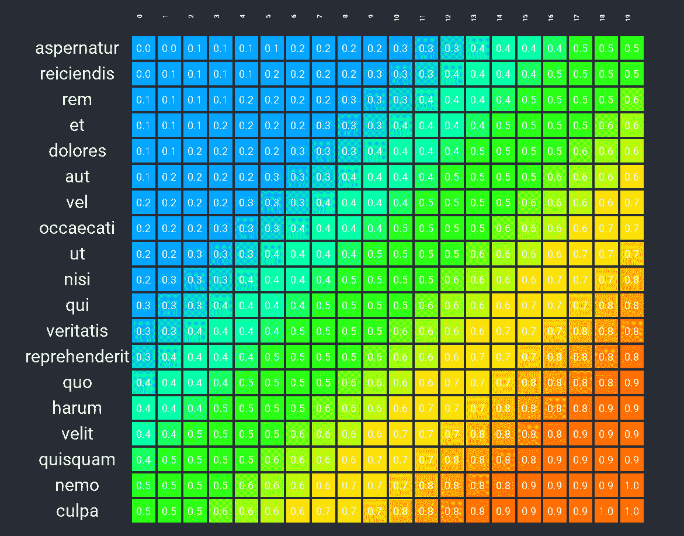

# 如何在 React 中构建热图

> 原文：<https://www.freecodecamp.org/news/a-heat-map-implementation-in-typescript/>

热图是可视化两个数据集之间相关性的一种很好的方式。通过颜色和渐变，几乎可以立即看到数据中的模式。

我去寻找 npm 中的热图实现，但是找不到我喜欢的，所以[我写了自己的](https://github.com/JeffML/jsheatmap)。它仍在开发中，但确实提供了基本的功能。

这个实现实际上有两个部分: [jsheatmap](https://github.com/JeffML/jsheatmap) 获取标题和行数据来产生一个 JSON 对象，其中原始输入从 0.0 缩放到 1.0，然后 RGB 颜色被映射到这些缩放值。我承认这大部分已经被 Andrew Noske 解决了，他在他的博客中提供了一个[部分 C++实现](http://www.andrewnoske.com/wiki/Code_-_heatmaps_and_color_gradients)。将 C++翻译成 TypeScript 相对容易。

第二部分是 jsheatmap 返回的 JSON 数据的 HTML 表示。这通常是 jsheatmap 模块用户的责任，但我确实构建了一个通用的 React 应用程序,演示了如何将 HTML 表格单元格用作热图表示。

## 基础知识

首先，安装 jsheatmap:

`npm i -S jsheatmap`

如前所述，jsheatmap 是用 TypeScript 编写的，但是 npm 将安装 TypeScript 程序的生成的 JavaScript 版本，这是您的应用程序将使用的。

接下来，导入 jsheatmap 组件。

`import HeatMap, { Style } from "jsheatmap"`

不严格要求`Style`组件。截止到本文写作，只有两种风格:简约和花哨。默认设置为“花哨”,它对热图 RGB 数据使用 5 色渐变。简单使用三色渐变，对于较小的数据集，您可能更喜欢这种渐变。样式被传递给`getData()`方法，稍后将会展示。

用标题(列名)和行数据实例化热图:
`const heatMap = new HeatMap(headings, rows)`

其中 headings 是字符串(列标题)的数组，rows 是标签和单元格数据的数组。例如:

```
// Days of rain in summer summer months, by year
const headings = ["June", "July", "August", "September"]  // the months
const rows = [["2015", [9, 5, 6, 8]],   // the years and rainy days by month
   ["2016", [7, 5, 10, 7]],
   ["2017", [7, 4, 3, 9]],
   ["2018", [10, 5, 6, 8]],
   ["2019", [8, 9, 3, 1]],]
```

## 转换为 RGB

现在是获取热图数据的时候了:

```
// const data = heatMap.getData({ style: Style.SIMPLE });
const data = heatMap.getData();
```

默认样式是花式(五色渐变)，而简单将使用三色渐变进行 RGB 映射。

然后，像元值相对于彼此进行缩放，缩放值由输入的高值和低值确定。一旦所有输入都从 0.0 缩放到 1.0，它们就可以映射到 RGB 颜色值。所有这些数据都由 getData()返回:

```
{
  "headings": [
    "Jun",
    "Jul",
    "Aug",
    "Sep"
  ],
  "high": 9,
  "low": 4,
  "rows": [
    {
      "label": "2015",
      "cells": {
        "values": [
          7,
          5,
          6,
          8
        ],
        "colors": [
          {
            "red": 0.6249999999999998,
            "green": 1,
            "blue": 0
          },
          {
            "red": 0,
            "green": 0.588235294117647,
            "blue": 1
          },
          {
            "red": 0,
            "green": 1,
            "blue": 0.625
          },
          {
            "red": 1,
            "green": 0.588235294117647,
            "blue": 0
          }
        ],
        "scales": [
          0.6,
          0.2,
          0.4,
          0.8
        ]
      }
    },
    {
      "label": "2016",
      "cells": {
        "values": [
          7,
          5,
          5,
          7
        ],
        "colors": [
          {
            "red": 0.6249999999999998,
            "green": 1,
            "blue": 0
          },
          {
            "red": 0,
            "green": 0.588235294117647,
            "blue": 1
          },
          {
            "red": 0,
            "green": 0.588235294117647,
            "blue": 1
          },
          {
            "red": 0.6249999999999998,
            "green": 1,
            "blue": 0
          }
        ],
        "scales": [
          0.6,
          0.2,
          0.2,
          0.6
        ]
      }
    },
    {
      "label": "2017",
      "cells": {
        "values": [
          7,
          4,
          5,
          9
        ],
        "colors": [
          {
            "red": 0.6249999999999998,
            "green": 1,
            "blue": 0
          },
          {
            "red": 0,
            "green": 0,
            "blue": 1
          },
          {
            "red": 0,
            "green": 0.588235294117647,
            "blue": 1
          },
          {
            "red": 1,
            "green": 0,
            "blue": 0
          }
        ],
        "scales": [
          0.6,
          0,
          0.2,
          1
        ]
      }
    },
    {
      "label": "2018",
      "cells": {
        "values": [
          6,
          5,
          7,
          8
        ],
        "colors": [
          {
            "red": 0,
            "green": 1,
            "blue": 0.625
          },
          {
            "red": 0,
            "green": 0.588235294117647,
            "blue": 1
          },
          {
            "red": 0.6249999999999998,
            "green": 1,
            "blue": 0
          },
          {
            "red": 1,
            "green": 0.588235294117647,
            "blue": 0
          }
        ],
        "scales": [
          0.4,
          0.2,
          0.6,
          0.8
        ]
      }
    },
    {
      "label": "2019",
      "cells": {
        "values": [
          8,
          6,
          6,
          8
        ],
        "colors": [
          {
            "red": 1,
            "green": 0.588235294117647,
            "blue": 0
          },
          {
            "red": 0,
            "green": 1,
            "blue": 0.625
          },
          {
            "red": 0,
            "green": 1,
            "blue": 0.625
          },
          {
            "red": 1,
            "green": 0.588235294117647,
            "blue": 0
          }
        ],
        "scales": [
          0.8,
          0.4,
          0.4,
          0.8
        ]
      }
    }
  ]
}
```

对于演示应用程序，我使用 React 生成一个表格，每个< td >元素的背景样式如下:

```
const background = (rgb) => {	
    return `rgb(${rgb.red * 100}%, ${rgb.green * 100}%, ${rgb.blue * 100}%)`;
}
```

其中`rgb()`是内置的 RGB 颜色的 CSS 函数，传入的`rgb`参数来自`getData()`生成的行的单元格颜色。要运行实施，首先克隆存储库:

`git clone [https://github.com/JeffML/sternomap.git](https://github.com/JeffML/sternomap.git)`

然后转到 sternomap 文件夹并运行:

`npm install`

最后:

`npm run start`

顺便说一下:该应用程序最初是使用 [Create React App](https://create-react-app.dev/docs/getting-started) 生成的，并且 [README.md](https://github.com/JeffML/sternomap) 文件详细解释了所有这些。

## 输出

一旦脚本完成，它将在你的浏览器中加载一个页面(我使用 Chrome)。这里有一个快照:


这显示了每年每个单元格中每月的下雨天数。由此你可以看出，最干燥的月份是七月和八月，最潮湿的月份是九月。每个单元格内的数字是原始输入(雨天)的缩放值，因此 2017 年 7 月的雨天最少，当年 9 月的雨天最多。

### 五颜六色

我可以生成一个数据集，其中每个单元格的值是它的 x + y 坐标之和。对于行标签，我使用 npm 模块 [casual](https://www.npmjs.com/package/casual) 来创建它们。



## 总结

我有一些在其他项目中使用这个热图实现的计划，我确信这将需要改变 API，但是基本的应该保持不变。如果你决定尝试一下，并发现它有用，请告诉我。