# 从冷战到深度学习的机器翻译史

> 原文：<https://www.freecodecamp.org/news/a-history-of-machine-translation-from-the-cold-war-to-deep-learning-f1d335ce8b5/>

伊利亚·佩斯托夫

# 从冷战到深度学习的机器翻译史

Photo by [Ant Rozetsky](https://unsplash.com/photos/H9m6mfeeakU?utm_source=unsplash&utm_medium=referral&utm_content=creditCopyText) on [Unsplash](https://unsplash.com/search/photos/russia?utm_source=unsplash&utm_medium=referral&utm_content=creditCopyText)

我打开谷歌翻译的频率是脸书的两倍，价格标签的即时翻译对我来说不再是一个赛博朋克。这就是我们所说的现实。很难想象这是为建立机器翻译算法而进行的一百年斗争的结果，而且在这期间的一半时间里没有取得明显的成功。

我将在本文中讨论的精确发展奠定了所有现代语言处理系统的基础——从搜索引擎到声控微波。我今天讲的是在线翻译的演变和结构。

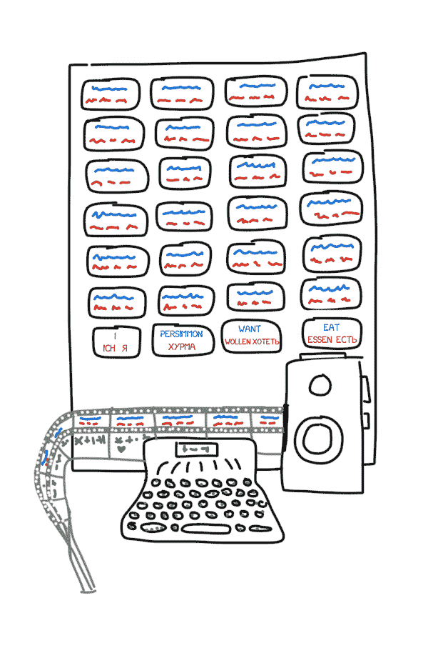

The translating machine of P. P. Troyanskii (Illustration made from descriptions. No photos left, unfortunately.)

### 起初

故事开始于 1933 年。苏联科学家彼得·特罗扬斯基向苏联科学院展示了“从一种语言翻译到另一种语言时选择和打印单词的机器”。这项发明非常简单——它有四种不同语言的卡片、一台打字机和一台老式电影摄影机。

操作员从文本中取出第一个单词，找到相应的卡片，拍下照片，在打字机上打出它的形态特征(名词、复数、所有格)。打字机的按键编码了其中一个特征。磁带和相机的胶片同时使用，制作了一组带有文字及其形态的画面。

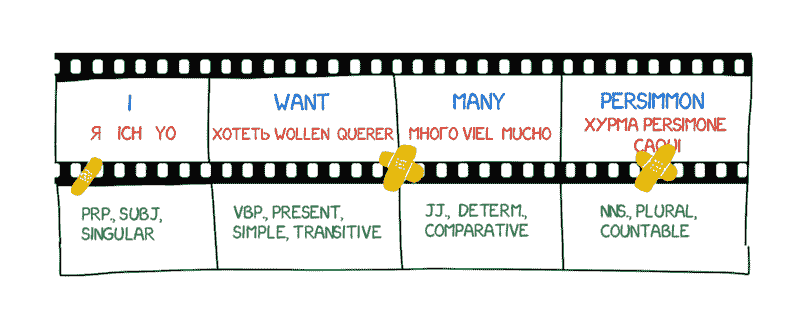

尽管如此，正如在苏联经常发生的那样，这项发明被认为是“无用的”。Troyanskii 在试图完成他的发明 20 年后死于心绞痛。直到 1956 年两位苏联科学家发现了他的专利，世界上才有人知道这台机器。

那是在冷战开始的时候。1954 年 1 月 7 日，在纽约的 IBM 总部，[乔治敦-IBM 实验](https://en.wikipedia.org/wiki/Georgetown%E2%80%93IBM_experiment)开始了。IBM 701 计算机有史以来第一次将 60 个俄语句子自动翻译成英语。

> 一个听不懂苏联语言的女孩打出了 IBM 卡片上的俄文信息。“大脑”在自动打印机上以每秒两行半的惊人速度快速完成了英文翻译。

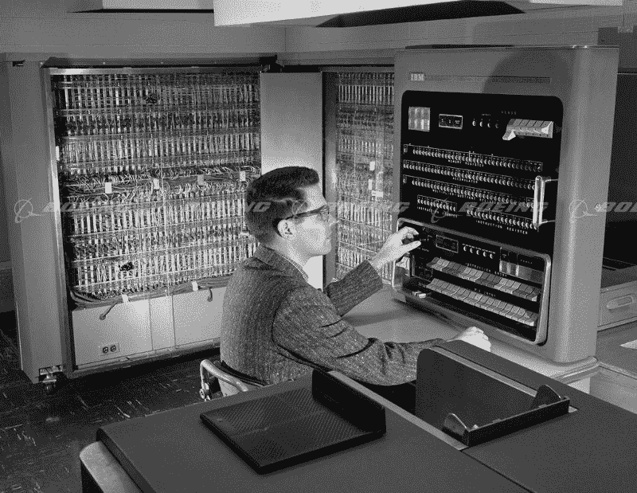

IBM 701

然而，胜利的标题掩盖了一个小细节。没有人提到翻译的例子是精心挑选和测试的，以排除任何歧义。对于日常使用来说，这个系统比一本袖珍常用语手册好不了多少。然而，这种军备竞赛开始了:加拿大、德国、法国，尤其是日本，都加入了机器翻译的竞赛。

### 机器翻译的竞赛

改善机器翻译的徒劳努力持续了 40 年。1966 年，美国 ALPAC 委员会在其著名的报告中称机器翻译昂贵、不准确、没有前途。相反，他们建议把重点放在词典开发上，这让美国研究人员在近十年的竞争中出局。

即便如此，现代自然语言处理的基础仅仅是由科学家和他们的尝试、研究和发展建立起来的。今天所有的搜索引擎、垃圾邮件过滤器和个人助理的出现都要感谢一群国家之间的相互监视。

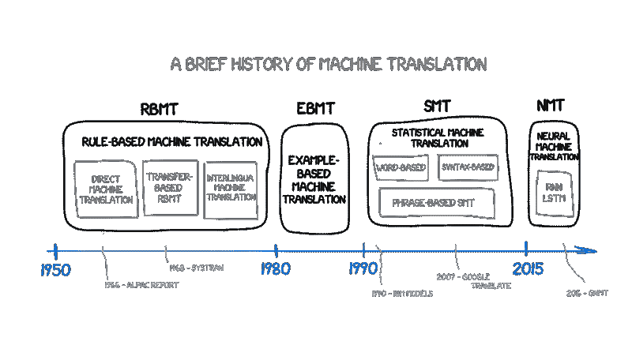

### 基于规则的机器翻译(RBMT)

围绕基于规则的机器翻译的第一个想法出现在 70 年代。科学家们仔细检查了口译员的工作，试图迫使极其迟钝的计算机重复这些动作。这些系统包括:

*   双语词典(俄语->英语)
*   每种语言的一套语言规则(例如，以某些后缀如-heit，-keit，-ung 结尾的名词是阴性的)

就是这样。如果需要的话，系统可以用黑客来补充，比如姓名列表、拼写纠正器和音译。

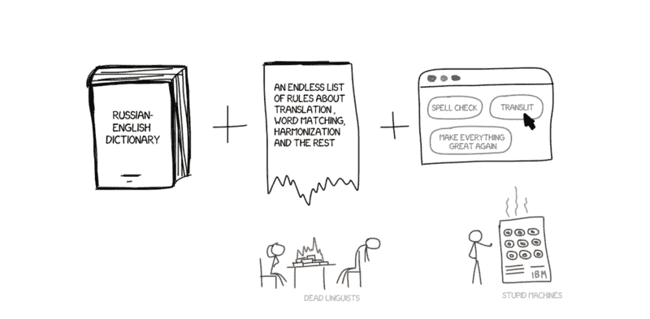

PROMPT 和 Systran 是 RBMT 系统最著名的例子。只要看一眼速卖通就能感受到这个黄金时代的柔和气息。

但即使是它们也有一些细微差别和亚种。

#### 直接机器翻译

这是最简单的机器翻译。它将文本分成单词，翻译它们，稍微纠正词法，并协调语法，使整个事情听起来正确，或多或少。当太阳落山时，训练有素的语言学家为每个单词写下规则。

输出返回某种翻译。通常情况下，它是相当蹩脚的。语言学家似乎白白浪费了时间。

现代系统根本不使用这种方法，现代语言学家对此心存感激。

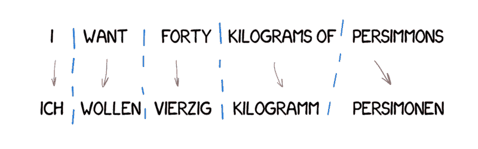

#### 基于迁移的机器翻译

与直接翻译相反，我们首先通过确定句子的语法结构来做准备，就像我们在学校被教导的那样。然后我们处理整个结构，而不是单词。这有助于在翻译中获得相当不错的词序转换。理论上。

在实践中，它仍然导致逐字翻译和疲惫的语言学家。一方面，它带来了简化的通用语法规则。但另一方面，与单个单词相比，由于单词结构数量的增加，它变得更加复杂。

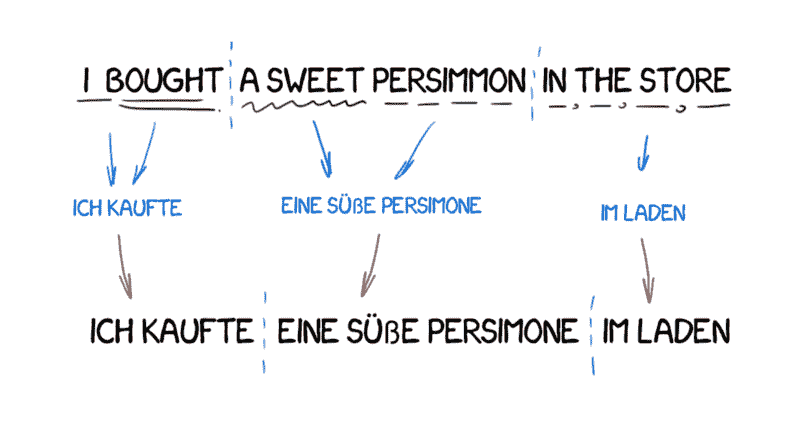

#### 语际机器翻译

在这种方法中，源文本被转换成中间表示，并且对于世界上所有的语言都是统一的(国际语)。这与笛卡尔梦想的 interlingua 是一样的:一种元语言，它遵循普遍规则，将翻译转化为简单的“来回”任务。接下来，国际语言将转换成任何目标语言，这就是奇点！

由于这种转换，国际语经常与基于转换的系统相混淆。区别在于每一种语言和语际语的语言规则，而不是语言对。这意味着，我们可以在国际语系统中添加第三种语言，并在这三种语言之间进行翻译。我们不能在基于传输的系统中这样做。

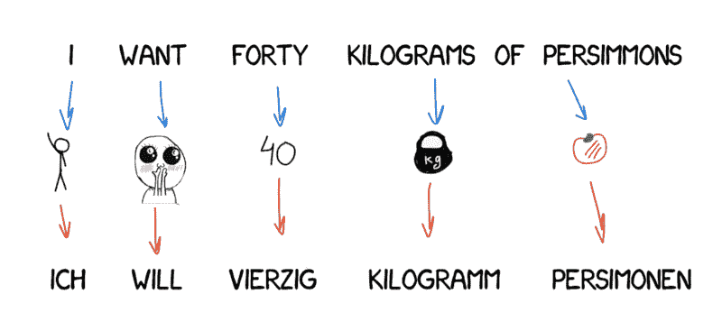

它看起来很完美，但在现实生活中却并非如此。创造这样一种通用的国际语言是极其困难的——许多科学家已经为此奋斗了一生。他们没有成功，但多亏了他们，我们现在有了词法、句法甚至语义层面的表达。但是唯一的[意义——文本理论](https://en.wikipedia.org/wiki/Meaning-text_theory)要花一大笔钱！

中间语言的概念将会回来。让我们等一会儿。

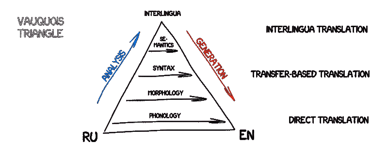

正如你所看到的，所有的 RBMT 都是愚蠢和可怕的，这就是为什么它们很少被使用，除非在特殊情况下(像天气预报翻译，等等)。在 RBMT 的优点中，经常提到的是它的形态准确性(它不会混淆单词)、结果的可再现性(所有译者都得到相同的结果)，以及根据主题领域调整它的能力(例如，教授经济学家或程序员专用的术语)。

即使有人成功创造了一个理想的 RBMT，语言学家用所有的拼写规则强化了它，也总会有一些例外:英语中的所有不规则动词，德语中的可分离前缀，俄语中的后缀，以及人们只是说不同的情况。任何考虑所有细微差别的尝试都会浪费数百万工时。

别忘了同音词。同一个词在不同的语境中可以有不同的含义，这就导致了多种翻译。你能在这里捕捉到多少层含义:*我看见一个人在山上拿着望远镜*？

语言不是基于一套固定的规则发展的——这是语言学家喜欢的事实。他们受过去三百年的侵略历史影响更大。你怎么向机器解释呢？

四十年的冷战无助于找到任何独特的解决方案。RBMT 已经死了。

### 基于实例的机器翻译(EBMT)

日本对争取机器翻译特别感兴趣。没有冷战，但有原因:这个国家很少有人懂英语。在即将到来的全球化派对上，这肯定会成为一个大问题。所以日本人非常积极地寻找机器翻译的工作方法。

基于规则的英日翻译极其复杂。语言结构完全不同，几乎所有的单词都要重新排列，增加新词。1984 年，京都大学的高娜提出了用现成的短语代替重复翻译的想法。

让我们想象一下，我们要翻译一个简单的句子——“我要去电影院。”而且假设我们已经翻译了另一个类似的句子——“我要去剧院”——我们可以在字典里找到“cinema”这个词。

我们所需要的就是搞清楚这两个句子的区别，翻译掉的单词，然后不要搞砸了。我们的例子越多，翻译就越好。

我用完全相同的方式在不熟悉的语言中构建短语！

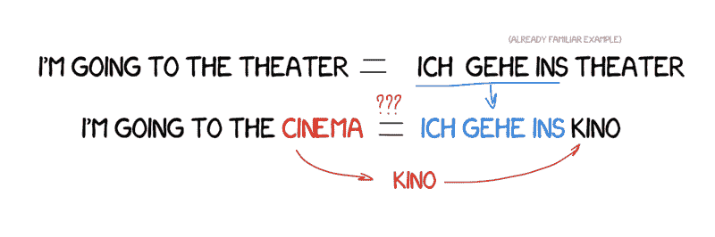

EBMT 向来自世界各地的科学家展示了曙光:事实证明，你可以只给机器输入现有的翻译，而不用花费数年时间来制定规则和例外。这还不是一场革命，但显然是迈向革命的第一步。统计翻译的革命性发明将在短短五年内发生。

### 统计机器翻译

1990 年初，在 IBM 研究中心，首次展示了一个机器翻译系统，它对规则和语言学一无所知。它分析了两种语言的相似文本，并试图理解其中的模式。

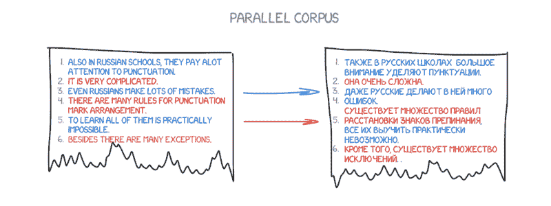

这个想法简单而美丽。两种语言中相同的句子被拆分成单词，然后进行匹配。这个操作重复了大约 5 亿次来统计，比如“Das Haus”这个词翻译成“房子”vs“建筑”vs“施工”的次数，等等。

如果大多数时候源词被翻译成“房子”，机器就用这个。请注意，我们没有制定任何规则，也没有使用任何字典——所有的结论都是由机器完成的，由统计数据和“如果人们这样翻译，我也会这样翻译”的逻辑指导。因此，统计翻译诞生了。

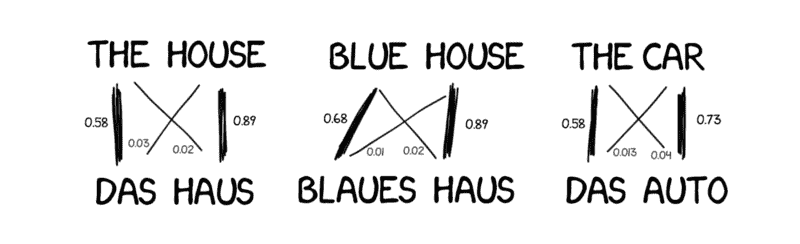

这种方法比以前的方法更有效、更准确。也不需要语言学家。我们使用的文本越多，我们得到的翻译就越好。

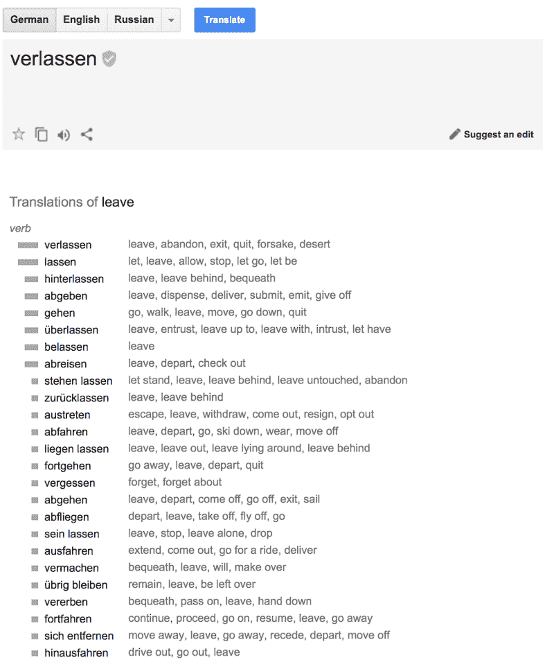

Google’s statistical translation from the inside. It shows not only the probabilities but also counts the reverse statistics.

还有一个问题:机器如何将单词“Das Haus”和单词“building”联系起来——我们如何知道这些是正确的翻译？

答案是我们不知道。开始时，机器假设单词“Das Haus”与翻译句子中的任何单词同等相关。接下来，当“Das Haus”出现在其他句子中时，与“房子”的关联数量会增加。这就是“单词对齐算法”，这是大学级别机器学习的典型任务。

这台机器需要两种语言的数百万个句子来收集每个单词的相关统计数据。我们是怎么得到它们的？嗯，我们决定采用欧洲议会和联合国安理会会议的摘要——它们有所有成员国的语言版本，现在可以在[联合国语料库](https://catalog.ldc.upenn.edu/LDC2013T06)和[欧洲议会语料库](http://www.statmt.org/europarl/)下载。

#### 基于单词的 SMT

最初，第一个统计翻译系统通过将句子拆分成单词来工作，因为这种方法简单明了且符合逻辑。IBM 的第一个统计翻译模型被称为模型一。挺优雅的吧？猜猜他们把第二部叫做什么？

***模式一:《话袋》***

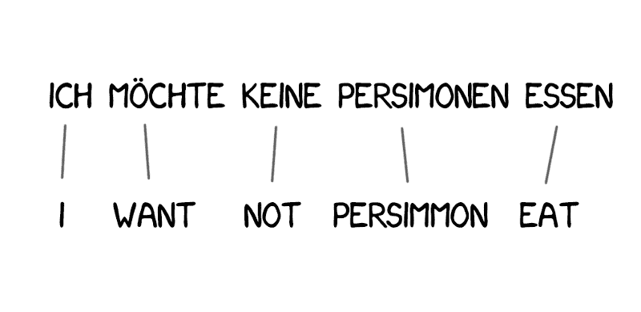

模型一使用了一种经典的方法——拆分成单词并统计数据。词序没有考虑在内。唯一的技巧是将一个单词翻译成多个单词。例如，“Der Staubsauger”可以变成“真空吸尘器”，但这并不意味着反之亦然。

下面是 Python 中的一些简单实现: [shawa/IBM-Model-1](https://github.com/shawa/IBM-Model-1) 。

***模式二:考虑句子中的语序***

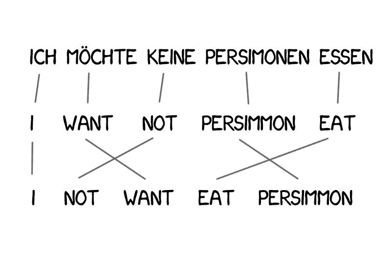

缺乏关于语言词序的知识成为模型 1 的一个问题，这在某些情况下非常重要。

模型 2 解决了这个问题:它记住了单词在输出句子中的通常位置，并在中间步骤将单词打乱以获得更自然的声音。情况有所好转，但还是有点糟糕。

***模式三:超生***

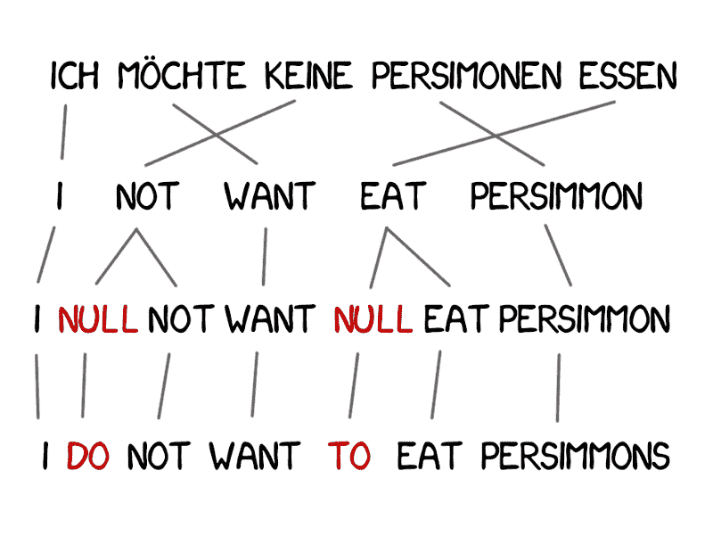

新词在翻译中经常出现，如德语中的冠词或用英语否定时使用“do”。“我不想吃柿子”→“我不想吃柿子。”为了解决这个问题，在模型 3 中增加了两个步骤。

*   如果机器考虑新单词的必要性，则插入零标记
*   为每个单词对齐选择正确的语法助词或单词

***模式四:字对齐***

模型 2 考虑了单词对齐，但是对重新排序一无所知。例如，形容词经常与名词互换位置，无论顺序记忆得多好，也不会使输出更好。因此，模型 4 考虑了所谓的“相对顺序”——如果两个单词总是交换位置，模型就会学习。

***模式 5:修正了*** 的错误

这里没什么新鲜的。模型 5 获得了更多的学习参数，并解决了单词位置冲突的问题。

尽管具有革命性，基于单词的系统仍然无法处理大小写、性别和同音异义。根据这台机器，每个单词都以唯一正确的方式翻译。这种系统已经不再使用了，因为它们已经被更先进的基于短语的方法所取代。

#### 基于短语的 SMT

这种方法基于所有基于单词的翻译原则:统计、重新排序和词法分析。虽然，为了学习，它不仅把文本分成单词，还分成短语。准确地说，这些是 n-gram，是一行 n 个单词的连续序列。

因此，机器学会了翻译稳定的单词组合，这显著提高了准确性。

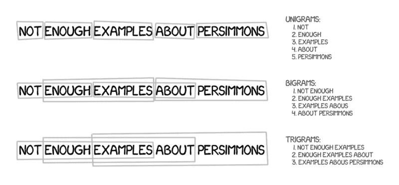

诀窍在于，短语并不总是简单的句法结构，如果任何了解语言学和句子结构的人干预，翻译质量就会显著下降。计算机语言学的先驱弗雷德里克·耶利内克曾开玩笑说:“每当我解雇一名语言学家，语音识别器的性能就会提高。”

除了提高准确性，基于短语的翻译在选择双语文本进行学习时提供了更多的选择。对于基于单词的翻译，源的精确匹配是至关重要的，这排除了任何文学或意译。基于短语的翻译从他们那里学习没有问题。为了改进翻译，研究人员甚至开始解析不同语言的新闻网站。

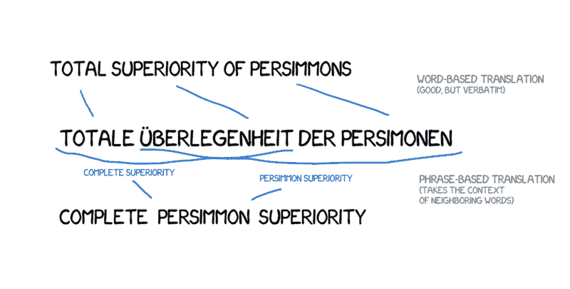

从 2006 年开始，大家开始用这种方式。直到 2016 年，谷歌翻译、Yandex、必应和其他备受瞩目的在线翻译都是基于短语的。你们中的每一个人都可以回忆起谷歌把句子翻译得天衣无缝或者完全没有意义的时刻，对吗？这些废话来自基于短语的特征。

良好的基于规则的旧方法始终提供了一个可预测但可怕的结果。统计方法令人惊讶和困惑。谷歌翻译毫不犹豫地把“三百”变成“三百”。这被称为统计异常。

基于短语的翻译已经变得如此受欢迎，以至于当你听到“统计机器翻译”时，那才是真正的意思。直到 2016 年，所有研究[都称赞](http://www.aclweb.org/anthology/D16-1161)基于短语的翻译是最先进的。当时，甚至没有人认为谷歌已经在煽风点火，准备改变我们对机器翻译的整体印象。

### 基于语法的 SMT

这个方法也要简单提一下。在神经网络出现的许多年前，基于句法的翻译被认为是“翻译的未来”，但这一想法并没有起飞。

基于句法的翻译的支持者认为有可能将其与基于规则的方法合并。有必要对句子进行相当精确的语法分析——确定主语、谓语和句子的其他部分，然后建立句子树。使用它，机器学习在语言之间转换句法单元，并通过单词或短语翻译其余部分。这将一劳永逸地解决单词对齐问题。

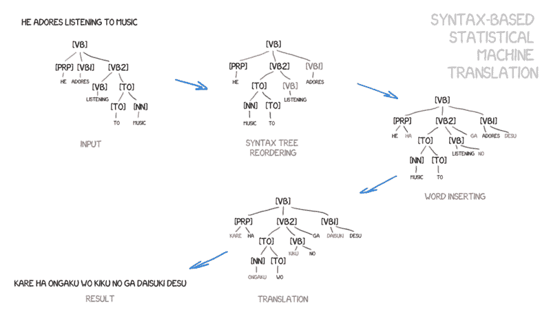

Example taken from the [Yamada and Knight [2001]](http://www.aclweb.org/anthology/P01-1067) and this [great slide show](http://homepages.inf.ed.ac.uk/pkoehn/publications/esslli-slides-day5.pdf).

问题是，语法解析工作得很糟糕，尽管我们认为它已经解决了一段时间(因为我们有许多语言的现成库)。我尝试使用句法树来完成比分析主语和谓语更复杂的任务。每次我都放弃并使用另一种方法。

如果你至少成功使用了一次，请在评论中告诉我。

### 神经机器翻译(NMT)

一篇关于在机器翻译中使用神经网络的非常有趣的论文于 2014 年发表。互联网根本没注意到，除了谷歌——他们拿出铲子开始挖。两年后，2016 年 11 月，谷歌做出了改变游戏规则的[公告](https://research.googleblog.com/2016/09/a-neural-network-for-machine.html)。

这个想法接近于在照片之间转换风格。还记得像 [Prisma](https://prisma-ai.com/) 这样的应用程序吗，它们以一些著名艺术家的风格增强了图片？没有魔法。神经网络[被教会](https://harishnarayanan.org/writing/artistic-style-transfer/)识别艺术家的画作。接下来，包含网络决策的最后几层被移除。由此产生的风格化图片只是网络得到的中间图像。这是网络的幻想，我们认为它很美。

如果我们可以将风格转移到照片上，那么如果我们试图将另一种语言强加到源文本上呢？文本将是精确的“艺术家的风格”，我们将试图在保持图像的本质(换句话说，文本的本质)的同时传递它。

想象一下，我正试图描述我的狗——中等大小，尖鼻子，短尾巴，总是叫。如果我给你这一组狗的特征，如果描述准确，你可以画出来，即使你从未见过它。

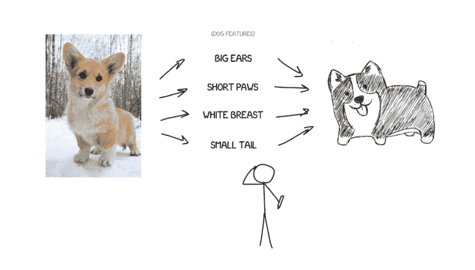

现在，假设源文本是一组特定的特征。基本上，这意味着你把它编码，让另一个神经网络把它解码回文本，但是，用另一种语言。解码器只知道它的语言。它不知道这些特征的来源，但是它可以用西班牙语来表达。继续这个类比，你如何画这只狗并不重要——用蜡笔、水彩还是你的手指。你尽你所能画出来。

同样，一个神经网络只能将句子编码为特定的特征集，另一个只能将它们解码回文本。双方都不了解对方，而且他们都只知道自己的语言。想起什么了吗？国际语又回来了。哒哒。

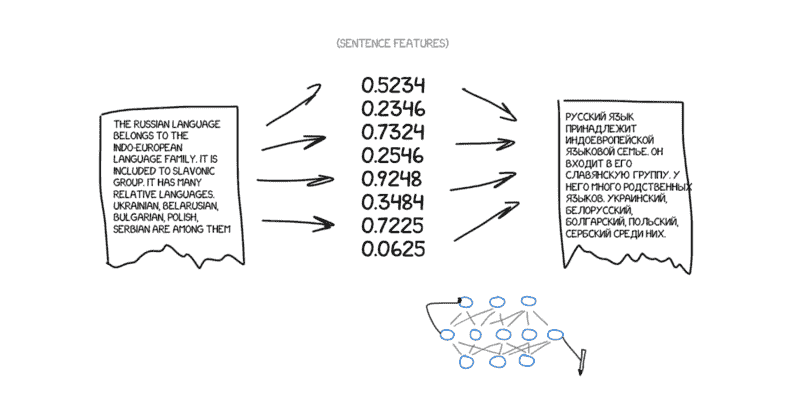

问题是，我们如何找到这些特征？当我们谈论狗时，这是显而易见的，但如何处理文本呢？三十年前，科学家们已经试图创造通用语言代码，但以彻底失败告终。

尽管如此，我们现在有深度学习。这就是它的基本任务！深度学习和经典神经网络之间的主要区别恰恰在于搜索这些特定特征的能力，而无需了解它们的本质。如果神经网络足够大，并且手头有几千张视频卡，也有可能在文本中找到这些特征。

理论上，我们可以将从神经网络中获得的特征传递给语言学家，这样他们就可以为自己打开勇敢的新视野。

问题是，编码和解码应该用什么类型的神经网络？卷积神经网络(CNN)非常适合图片，因为它们使用独立的像素块进行操作。

但是文本中没有独立的块——每个单词都依赖于它的周围环境。文字、语音、音乐始终保持一致。因此，递归神经网络(RNN)将是处理它们的最佳选择，因为它们记得以前的结果——在我们的情况下，是以前的单词。

现在，rnn 被广泛应用于各个领域——Siri 的语音识别(它正在解析声音的序列，其中下一个依赖于上一个)、键盘提示(记住前一个，猜测下一个)、音乐生成，甚至聊天机器人。

> **对于我这样的书呆子:**其实神经翻译器的架构千差万别。开始时使用常规的 RNN，后来升级为双向的，译者不仅要考虑源单词之前的单词，还要考虑下一个单词。那要有效得多。接下来是带有 LSTM 单元的硬核多层 RNN，用于长期存储翻译上下文。

两年内，神经网络超越了过去 20 年翻译中出现的一切。神经翻译包含的词序错误少 50%，词汇错误少 17%，语法错误少 19%。神经网络甚至学会了协调不同语言中的性别和大小写。也没有人教他们这样做。

最显著的改进发生在从未使用过直接翻译的领域。统计机器翻译方法总是使用英语作为主要来源。因此，如果你从俄语翻译成德语，机器首先将文本翻译成英语，然后再从英语翻译成德语，这导致了双重损失。

神经翻译不需要这个——只需要一个解码器就可以工作。这是第一次不用字典就能在不同语言间直接翻译。

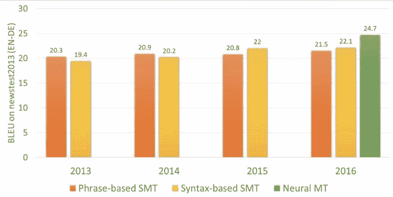

#### 谷歌翻译(自 2016 年起)

2016 年，谷歌开启了[九种语言](https://en.wikipedia.org/wiki/Google_Neural_Machine_Translation)的神经翻译。他们开发了名为谷歌神经机器翻译(GNMT)的系统。它包括 RNNs 的 8 个编码器和 8 个解码器层，以及来自解码器网络的注意连接。

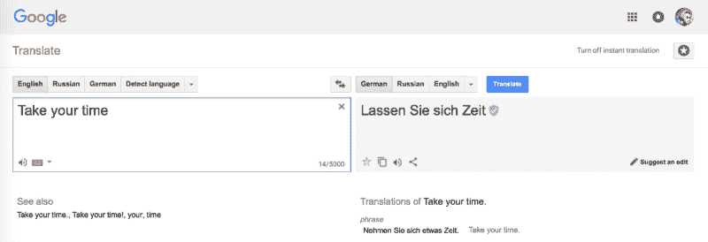

他们不仅分句子，还分单词。这就是他们如何处理一个主要的 NMT 问题——罕见的话。当这个词不在他们的词典中时，NMT 是无能为力的。就说“Vas3k”吧。我怀疑是否有人教神经网络翻译我的昵称。在这种情况下，GMNT 试图将单词分解成单词片段，并恢复它们的翻译。聪明。

> 提示:在浏览器中用于网站翻译的 Google Translate 仍然使用旧的基于短语的算法。不知何故，谷歌没有升级它，与在线版本相比，差异相当明显。

谷歌在网络版中使用了众包机制。人们可以选择他们认为最正确的版本，如果很多用户喜欢它，谷歌将总是这样翻译这个短语，并用一个特殊的徽章标记它。这对于简短的日常用语非常有效，比如“我们去看电影吧”或者“我在等你”谷歌比我更懂英语会话:(

微软的必应和谷歌翻译功能完全一样。但是 Yandex 不一样。

#### Yandex 翻译(自 2017 年起)

Yandex 于 2017 年推出了神经翻译系统。正如所宣称的，它的主要特征是杂合性。Yandex 结合了神经和统计方法来翻译句子，然后用它最喜欢的 CatBoost 算法选择最佳的方法。

问题是，神经翻译在翻译短语时经常失败，因为它使用上下文来选择正确的单词。如果这个词在训练数据中出现的次数很少，那就很难了。在这种情况下，简单的统计翻译可以快速简单地找到正确的单词。

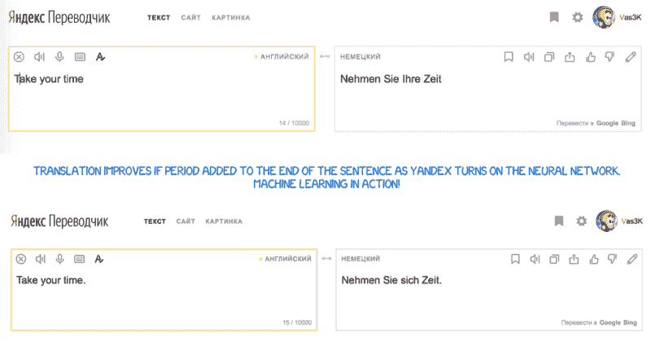

Yandex 不分享细节。它用市场营销[新闻稿](https://yandex.com/company/blog/one-model-is-better-than-two-yu-yandex-translate-launches-a-hybrid-machine-translation-system/)来抵挡我们。好吧。

> 看起来谷歌使用 SMT 来翻译单词和短语。他们没有在任何文章中提到这一点，但是如果你看看长短表达的翻译之间的差异，这是很明显的。此外，SMT 用于显示世界的统计数据。

### 结论和未来

每个人仍然对“巴别鱼”的想法感到兴奋——即时语音翻译。谷歌已经通过 Pixel Buds 向它迈出了一步，但事实上，它仍然不是我们所梦想的。即时语音翻译不同于通常的翻译。你需要知道什么时候开始翻译，什么时候闭嘴听。我还没有看到合适的方法来解决这个问题。除非，也许，Skype…

这里还有一个空白区域:所有的学习都局限于平行文本块的集合。最深层次的神经网络仍然学习平行文本。如果不给神经网络提供源，我们就无法教会它。相反，人们可以通过阅读书籍或文章来补充他们的词汇，即使没有翻译成他们的母语。

如果人能做到，理论上神经网络也能做到。我发现[只有一个](https://arxiv.org/abs/1710.04087)原型试图煽动懂一种语言的网络阅读另一种语言的文本，以获得经验。我想自己试试，但我太傻了。好了，就这样。

> 这个故事最初是用俄语写的，然后由瓦西里·祖巴列夫在 Vas3k.com 的**翻译成了英语。他是我的笔友，我很确定他的博客应该被传播。**

### **有用的链接**

*   **菲利普·科恩:统计机器翻译。我发现的最完整的方法集合。**
*   **[Moses](http://www.statmt.org/moses/) —创建自己的统计翻译的流行库**
*   **OpenNMT —多了一个库，但用于神经翻译器**
*   **我最喜欢的博客作者之一的文章[解释了 RNN 和 LSTM](http://colah.github.io/posts/2015-08-Understanding-LSTMs/)**
*   **一个视频[“如何做一个语言翻译器”](https://www.youtube.com/watch?v=nRBnh4qbPHI)，搞笑的家伙，利落的解说。还是不够。**
*   **来自 TensorFlow 的关于[创建你自己的神经翻译器](https://www.tensorflow.org/tutorials/seq2seq)的文本指南，给那些想要更多例子和尝试代码的人。**

#### **其他文章来自 Vas3k.com**

**[**以太坊和智能合约是如何工作的**](http://vas3k.com/blog/ethereum/)
[*分布式图灵机带区块链保护*vas3k.com](http://vas3k.com/blog/ethereum/)[**区块链里里外外:比特币是如何工作的**](http://vas3k.com/blog/blockchain/)
[*简单来说就是一劳永逸*vas3k.com](http://vas3k.com/blog/blockchain/)**

#### **最后一件事…**

***如果你喜欢这篇文章，点击*？*下面，并与他人分享，这样他们也可以享受它。***