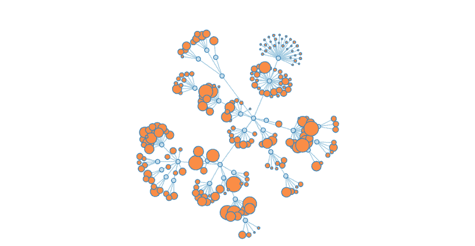

# d3.js 的语言学介绍

> 原文：<https://www.freecodecamp.org/news/a-linguistic-introduction-to-d3-js-7a40a980bf97/>

马特·奥克斯利

# d3.js 的语言学介绍

#### 如何从试探性用户变成自信用户

d3.js 是一个非常棒的库——但是我可以诚实地告诉你，很长一段时间我在没有完全理解它的情况下使用了它。由于对我所从事的工作缺乏任何坚实的心智模型，我不得不承认，我倾向于从 bl.ocks.org 的各个片段中复制/粘贴代码，祈祷一切顺利。