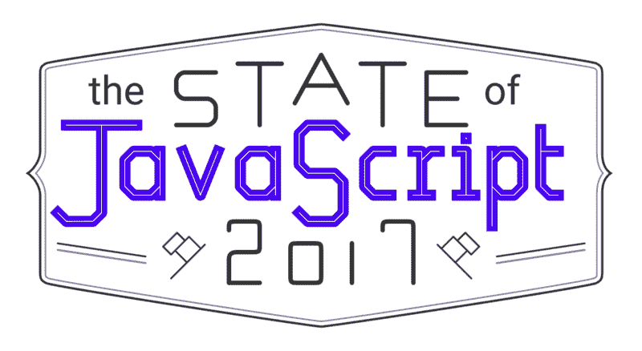
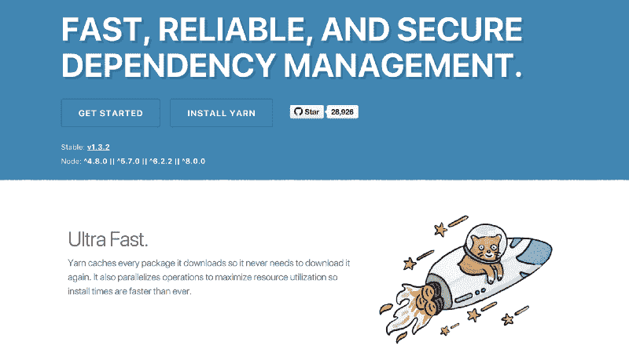
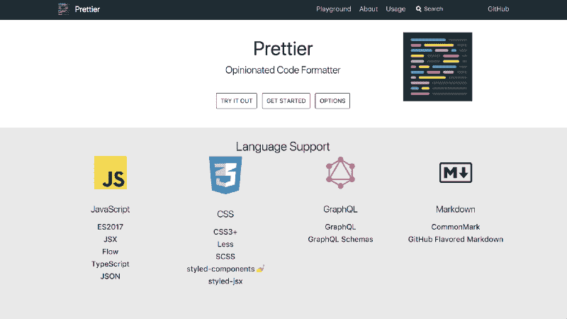
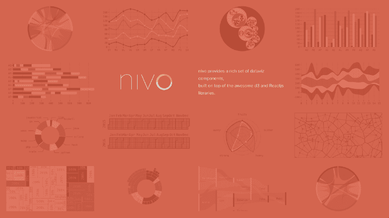
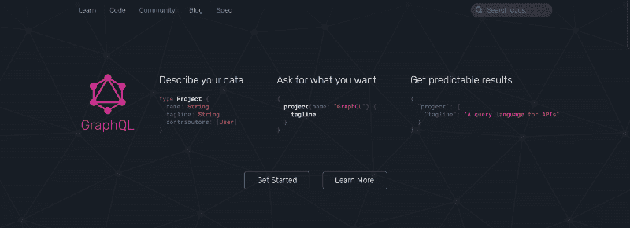

# 2017 年 JavaScript 状态回顾

> 原文：<https://www.freecodecamp.org/news/a-look-back-at-the-state-of-javascript-in-2017-a5b7f562e977/>

萨沙·格里菲

# 2017 年 JavaScript 状态回顾

#### 在 2017 年 JS 调查结果公布之前，我们的专家小组回顾了过去的一年

去年 JavaScript 调查结果的一个亮点是我们召集了一个伟大的专家小组来分析结果。

今年，我们采取了一种略有不同的方法，决定让数据自己说话。

但我仍然想知道我们之前的小组成员(以及两位新的特邀嘉宾)在过去的 12 个月里都在做些什么，所以我联系了他们，问了他们几个关于他们在 JavaScript 领域这一年的问题。

### 会见小组成员

*   [迈克尔·希尔曼](https://medium.com/@shilman) : [测试](http://2016.stateofjs.com/2016/testing/)
*   [黄英华](http://mochimachine.org) : [构建工具](http://2016.stateofjs.com/2016/buildtools/)
*   [汤姆·科尔曼](https://twitter.com/tmeasday) : [国家管理](http://2016.stateofjs.com/2016/statemanagement/)
*   [迈克尔·兰博](https://michaelrambeau.com/) : [全栈框架](http://2016.stateofjs.com/2016/fullstack/)
*   额外特邀嘉宾小组成员#1: [韦斯·博斯](http://wesbos.com/)
*   额外特邀嘉宾小组成员#2: [拉斐尔·本尼特](https://twitter.com/benitteraphael)([Nivo](http://nivo.rocks/#/)的创作者)

### 回顾一下你去年写的东西，你对那个特定领域的发展有什么想法？

#### 迈克尔·希尔曼

在去年的调查选择中，Jest 已经爆发，在 [NPM 下载量](https://npm-stat.com/charts.html?package=jest&package=jasmine&package=mocha&from=2016-11-10&to=2017-11-10)上超过了 Jasmine。

Jest 支持快照测试，我已经看到很多人使用快照作为基本输入/输出行为的单元测试的更便宜的替代方法。这在 UI 领域尤其受欢迎，有[故事镜头](https://github.com/storybooks/storybook/tree/master/addons/storyshots)，以及一整套相关工具的生态系统，如[洛基](https://loki.js.org/)、[珀西](https://percy.io/)、[筛选](https://screener.io/)和[彩色](https://blog.hichroma.com/introducing-chromatic-ui-testing-for-react-c5cc01a79aaa)。

#### 詹妮弗·黄

去年的调查已经明确预测了 2017 年的一些趋势。随着所有闪亮的新东西持续受欢迎，难怪 Webpack 仍然很强大。Yarn 甚至不是去年调查的一部分，但自 9 月份首次全面发布以来，它的势头越来越猛。我很好奇 Yarn 和 npm 之间会发生什么。

Yarn

#### 汤姆·科尔曼

我不确定是否出现了 Redux 的真正竞争对手，但也许在社区中已经出现了一场运动，正如创始人丹·阿布拉莫夫一直所说的那样:“不是每个应用程序都需要 Redux，在许多情况下，它带来的复杂性超过了它解决的问题”。

随着服务器数据管理工具的使用越来越多，特别是对于 GraphQL 数据(参见 Apollo 和 Relay Modern)，对复杂的客户端数据工具的需求可能已经有所减少。看看这些工具如何支持本地数据将会很有趣。

### 什么样的新 JavaScript 工具/库/框架/等等。2017 年你用过吗？

#### 迈克尔·希尔曼

我 2017 年最大的测试发现是 [Cypress](https://www.cypress.io/) 作为端到端测试的一个非常方便的 OSS/商业选项，尽管我发现它仍然很粗糙。

此外，我还在维护 [Storybook](https://storybook.js.org/) ，这是 React、React Native 和 Vue 最流行的 UI 开发工具。

#### 詹妮弗·黄

我们正在将大部分前端代码转换为 React、Redux、Webpack 和 Yarn。这是一个有趣而复杂的转变，但许多人已经做了更轻松的工作。这部分是由于共享设计系统和组件库的创建。

#### 汤姆·科尔曼

[更漂亮](https://github.com/prettier/prettier)！我不能再写代码了，我太依赖这个工具了。我使用 [Jest](https://facebook.github.io/jest/) 的次数更多了，而且真的很开心。我真的迷上了[故事书](https://storybook.js.org/)，并且越来越多地使用它(并开始帮助维护它！)

Prettier

除此之外，我一直在埋头开发 [Chromatic](https://blog.hichroma.com/introducing-chromatic-ui-testing-for-react-c5cc01a79aaa) 一个用于故事书的可视化回归测试工具。看到一些公司终于开始对他们的前端进行适当的测试，真的很令人兴奋(包括我们自己！)

#### 迈克尔·拉姆博

2017 年我发现最喜欢的工具是[更漂亮的](https://github.com/prettier/prettier)。这让我在编写代码时节省了很多时间，因为我再也不用担心“设计”我的代码了。

我不再关心制表符或半列了…只需在 IDE 中按 Ctrl 键，一切都被很好地格式化了！此外，当处理相同的代码库时，它减少了与其他团队成员的摩擦。

#### Wes Bos

各种各样的东西！ [date-fns](https://date-fns.org/) 已经取代了我的 [moment.js](https://momentjs.com/) 用法。 [Next.js](https://github.com/zeit/next.js/) 对我来说，构建服务器渲染的 React 应用很重要。我还学习了 Apollo 与 GraphQL 的合作。

#### 拉斐尔·贝尼特

无论是在几个开源项目上还是在工作中，能够改进自动化都是非常重要的。使用 Prettier、ESLint、Jest、 [Validate-commit-msg](https://github.com/willsoto/validate-commit) 和 [Lint-staged](https://github.com/okonet/lint-staged) 确实有所帮助。

我还为 React 构建了一个数据可视化库 [Nivo](http://nivo.rocks/#/) 。

最后，随着 Async/Await 的兴起及其在 Node.js 中的原生支持，我也尝试了 [Koa](http://koajs.com/) 。虽然它的生态系统比 Express 窄，但我发现它很容易上手，如果你熟悉 Express，你就不会迷路。

### 如果今天有人想从头开始学习 JavaScript，你会推荐他们专注于哪 3 项技术？

#### 迈克尔·希尔曼

*   为 UI 反应。
*   用于构建的 Webpack。
*   阿波罗网络。

#### 詹妮弗·黄

任何框架、任何构建工具和节点。许多概念在框架和构建工具之间转换，所以希望学好一个可以帮助映射到其他工具。如果我必须选择其中一个，可能是 React 和 Webpack，因为它们是趋势——趋势技术对业内人士来说很好。

#### 汤姆·科尔曼

当然 React，虽然其他前端很有趣，但 React 的份额最近变得相当大。a 必须有。

GraphQL，我认为大多数有经验的前端开发人员都认识到它所解决的问题是相当普遍的，并且与它一起工作很愉快。

GraphQL

Storybook，我认为从组件状态开始构建是应用程序开发的未来，Storybook 是实现这一点的主要工具。

#### 迈克尔·拉姆博

*   反应，作为前端层
*   Express，作为后端服务器
*   Jest，作为前端和后端代码的测试解决方案。

#### Wes Bos

如果你刚刚开始学习，你需要一些小的成功来让你对这门语言保持兴奋。所以，除了基础知识，我还要学习 DOM API，学习 Async + Await，学习像 web 动画这样的新的可视化 API。

#### 拉斐尔·贝尼特

*   如果你真的不熟悉 JavaScript，从基础开始——还有 ES6，它现在是基础的一部分。
*   显然，React 是为了构建 ui
*   GraphQL ，它正变得越来越成熟，现在被脸书、GitHub、Twitter 和[等大公司使用](http://graphql.org/users/) …

### 你今天最大的 JavaScript 痛点是什么？

#### 迈克尔·希尔曼

希望 CSS-in-JS 的最佳实践和选择库出现。虽然有很多好的选择，但感觉仍然是支离破碎的，世界上很多人仍然在做 CSS-in-CSS，所以有很多困惑，除非这是你的重点。

#### 詹妮弗·黄

不断的变化。当我学会一项新技术的时候，我们已经进入了下一个阶段。还有，别再偷我的 CSS，JavaScript！

#### 汤姆·科尔曼

网络包。非常强大的工具，远远超出了“配置超越常规”的范围。

使用 JS 应用程序很难避免学习它的复杂性，但是很多时候它们是你不需要关心的细节。我仍然希望 Meteor 能够重新成为构建现代 JS 应用程序的最佳方式。

#### 迈克尔·拉姆博

缺乏标准，在开始一个新项目之前，当你选择你的堆栈时，你有许多事情要考虑。但是事情正在改善！

#### Wes Bos

`checking && checking.for && checking.for.nested && checking.for.nested.properties`。我知道有实用函数可以做到这一点，但看起来我们可能很快就会在语言中实现这一点。

#### 拉斐尔·贝尼特

有太多的工具…很难选择一个正确的，我们必须非常小心趋势，因为它们在 JS 生态系统中可以移动得非常快。

### JavaScript 生态圈 2018 年你最期待什么？

#### 迈克尔·希尔曼

愿望清单(不知道这些是否会在 2018 年发生):

*   GraphQL 在数据同步方面达到了 Meteor 的便利程度。
*   通用(网络/移动)稳定，React Native 开始起步。
*   Cypress 或竞争对手出现进行端到端测试。

#### 詹妮弗·黄

稳定。我祈祷 JavaScript“堆栈”和社区将开始稳定下来，我们将进入一个导致更少变动的凹槽。

#### 汤姆·科尔曼

巴别塔的末日！我喜欢巴别塔，但随着节点 8，我几乎不再需要巴别塔了。再次和翻译这么近的距离工作真是太棒了。

显然，ES 标准将继续向前发展，但是随着模块和 async/await 的出现，JS 的许多令人沮丧的地方已经被解决了，许多项目可能很快就会对 node 和所有现代浏览器的 JS 版本感到满意！

#### 迈克尔·拉姆博

我很好奇 GraphQL 会如何成长。当发布一个 API 时，它会成为新的标准吗？

#### Wes Bos

现在 Node 稳定了，所有的浏览器都有了 Async+Await，我期待着 native promises 在框架、实用程序库和您每天编写的代码中成为常见的地方。

#### 拉斐尔·贝尼特

大多数语言都有专用的/首选的构建工具(例如 Java 的 Maven)。尽管在 JavaScript 方面我们有很多选择，但是这些解决方案通常都是针对前端的。我希望看到 npm(或 Yarn)增加对文档、自动完成、脚本依赖等基本特性的支持。否则我可能会继续使用 GNU Make。

这一点颇有争议，但我们已经看到人们对类似[打字稿](https://www.typescriptlang.org/)(或[流](https://flow.org/))的解决方案非常感兴趣。Node.js 和浏览器已经做出了明显的努力来提高速度，但是如果你想要静态类型，你仍然需要为它增加一个 transpilation 阶段。那么原生静态类型 Javascript 怎么样呢？你可以在这里找到关于主题[的讨论。](https://esdiscuss.org/topic/es8-proposal-optional-static-typing)

### 结论

看起来我们的小组至少在一些事情上达成了一致:React 是一个安全的赌注，Prettier 是一个伟大的工具，是的，JavaScript 生态系统仍然太复杂了…

这正是我们在做调查时首先试图解决的问题！

我们将很快推出我们的结果网站。一周后，实际上是 12 月 12 日。

我们将举行一场直播+ Q & A 发布会，这样你就可以问我们所有你想问的问题——或者就呆在这里！谁知道呢，我们甚至可能会有特殊的客人来访……)

如果你想知道什么时候结果是实时的，并得到一个通知，你可以[给我们留下你的电子邮件](http://stateofjs.com/)，我们会让你知道。