# 来自世界各地的大量免费在线大学课程提供商

> 原文：<https://www.freecodecamp.org/news/a-massive-list-of-free-online-course-providers-from-around-the-world-925766226f46/>

自 2011 年 10 月斯坦福大学教授讲授的三门免费在线课程推出以来，在线教育已经有五年多的时间了。每门课程都有超过 100，000 名学生。

教授们推出了三个在线课程网站:Coursera、edX 和 Udacity。而媒体开始将这些网站提供的课程称为“mooc”:**海量开放在线课程**。

自那以后，全球超过 700 所大学推出了免费在线课程。

截至 2016 年底，约有 5800 万学生注册了至少一门 MOOC 课程。

世界上许多国家——如印度、墨西哥、泰国和意大利——都推出了本国的 MOOC 平台。

在[课堂中心](https://www.class-central.com/)，我们试图将尽可能多的 MOOCs 编入目录。到目前为止，我们已经对其中的 7000 多种进行了编目。但是由于资源有限(有时还有语言障碍)，我们无法一一索引。

我列出了全世界 33 家 MOOC 提供商的名单。这份清单是在 2017 年 4 月 Tarcher-Perigee 的 Barbara Oakley 的 [Mindshift:突破学习障碍，发现你隐藏的潜力](https://www.amazon.com/Mindshift-Obstacles-Learning-Discover-Potential/dp/1101982853/)的许可下改编的。我还扩展了列表，增加了一些额外的地区性 MOOC 提供商。

我们的重点主要是与大学合作并提供免费在线课程的课程提供商。因此，如果你知道任何我们错过的 MOOC 提供商，请在下面的评论中告诉我。

### 1.Coursera(美国)

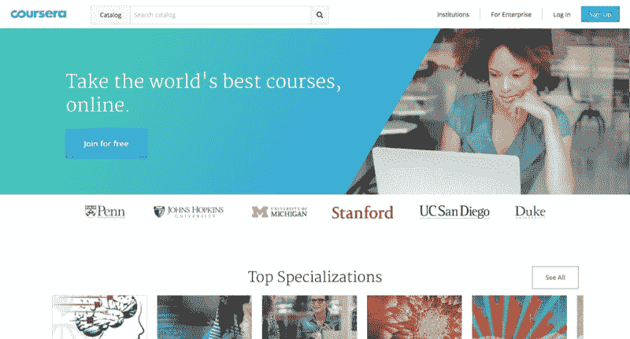

Coursera 于 2012 年 1 月正式推出，由两位斯坦福大学教授吴恩达和达芙妮·柯勒创办。

Coursera 拥有超过 2500 万名学生和 1.461 亿美元的融资，是世界上最大的 MOOC/在线教育提供商。它拥有来自 29 个国家的 150 多所大学的合作伙伴和 2000 多门在线课程。

除了单一的课程，Coursera 还提供自己的证书，也就是众所周知的专业，它还提供完全在线的硕士学位。Coursera 还通过其 Coursera for Business 产品向 B2B 领域扩张。

*   [Coursera 主页](http://bit.ly/2pY7jtN)
*   [中央课堂上的 Coursera 课程](https://www.class-central.com/provider/coursera)
*   [Coursera 2016 年回顾](https://www.class-central.com/report/coursera-2016-review/)
*   Coursera 推出两个新的硕士学位，计划提供多达 20 个学位项目
*   MOOCs 一开始是完全免费的。他们现在在哪里？

### 2.edX(美国)

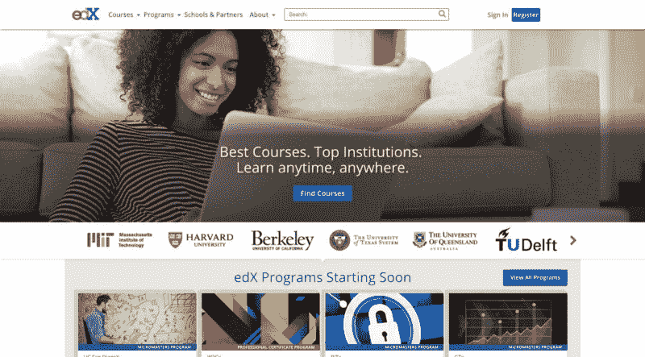

edX 由哈佛大学和麻省理工学院于 2012 年共同创立，是一个非营利组织。它是世界上第二大 MOOC 提供商，拥有超过 1000 万学生。它提供 1500 多门课程，并拥有 100 多所大学合作伙伴。

EdX 提供了许多不同类型的证书课程:MicroMasters(提供获得信贷的途径)，XSeries，Professional Certificate 和 Professional Education。今年早些时候，edX 加入了佐治亚理工学院一个新的在线分析硕士学位的竞赛。

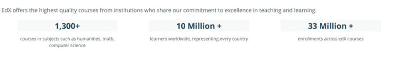

*   [edX 主页](https://www.edx.org/)
*   [中央课堂上的 edX 课程](https://www.class-central.com/provider/edx)
*   [edX 2016 年回顾](https://www.class-central.com/report/edx-2016-review/)
*   [解码 edX 最新证书:专业证书课程](https://www.class-central.com/report/edx-professional-certificate/)
*   [佐治亚理工学院和 edX 宣布推出在线分析硕士学位](https://www.class-central.com/report/oms-analytics/)

### 3.未来学习(英国)

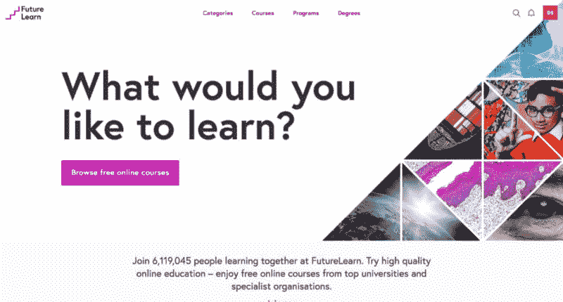

FutureLearn 是一家总部位于英国的 MOOC 提供商。它由开放大学全资拥有。它于 2012 年底推出，现在拥有超过 600 万注册用户。

FutureLearn 有 100 多个合作伙伴在其平台上创建课程。这些合作伙伴中有 71 所大学主要位于欧洲，但也有一些大学位于其他国家，包括美国、澳大利亚和韩国。

FutureLearn 提供自己的证书课程，即 FutureLearn 课程。去年，它还宣布与澳大利亚迪肯大学合作，开设六个完全在线的研究生学位。

*   [未来学习主页](https://www.futurelearn.com/)
*   [中央课堂的未来学习课程](https://www.class-central.com/provider/futurelearn)
*   [FutureLearn 的 2016:回顾之年](https://www.class-central.com/report/futurelearn-2016-review/)
*   [FutureLearn 和迪肯大学率先在 MOOC 平台上提供一系列学位](https://about.futurelearn.com/press-releases/futurelearn-deakin-university-first-offer-range-degrees-delivered-entirely-mooc-platform/)
*   [合作伙伴—未来学习](https://www.futurelearn.com/partners)
*   [FutureLearn 的新定价模式限制课程结束后对课程内容的访问](https://www.class-central.com/report/futurelearn-new-pricing-model/)

### 4.学堂(中国)

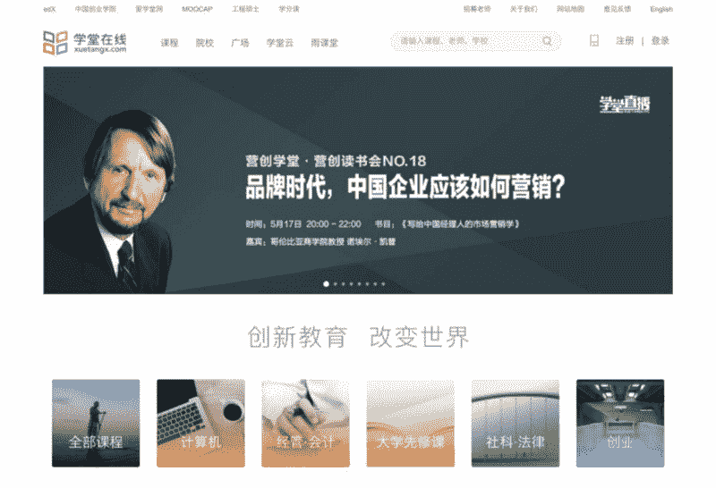

学堂是中国第一个也是最大的 MOOC 平台。它是由清华大学在中国教育部的监督下于 2013 年创立的。这可能是发展最快的 MOOC 平台。

当 Class Central 在 2016 年 10 月采访学堂的董事长时，该平台已有 500 万用户。现在这个数字已经超过了 700 万注册用户。

早在 2016 年 10 月，该平台就有超过 400 门课程。它建立在 Open edX 的高度定制版本之上。XuetangX 还有一个云 LMS 产品，被中国各地的大学使用，目前有 150 万中国学生在使用。

*   [学堂 x 主页](http://www.xuetangx.com/)
*   [学堂 x:看看中国第一个也是最大的 MOOC 平台](https://www.class-central.com/report/xuetangx/)
*   [150 万中国学生正在使用学堂云 LMS 平台](https://finance.yahoo.com/news/one-half-million-chinese-students-090200030.html)

### 5.乌达城(美国)

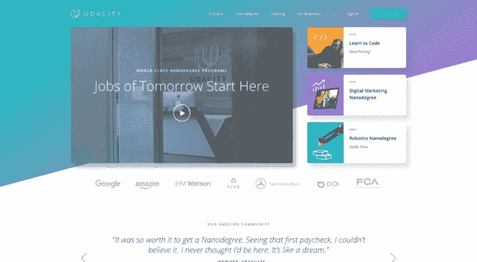

Udacity 是一家科技独角兽，它与科技公司合作创建纳米学位，为特定工作培训学生。最近，它与 IBM Watson 合作推出了一个人工智能纳米学位，并推出了一个自动驾驶汽车工程师纳米学位。后者的共同创造者包括像奔驰、宝马和迈凯轮这样的汽车公司。这些纳米学位很贵，需要几个月才能完成。纳米学位的课程是免费的，Udacity 目前有近 200 门免费的在线课程。

Udacity 还与佐治亚理工学院合作，创建并推出了一个低成本、完全在线的计算机科学硕士学位。目前有 4000 多名学生注册了硕士项目。Udacity 由斯坦福大学教授巴斯蒂安·特龙创建，他是谷歌无人驾驶汽车项目的幕后推手。他目前是 Udacity 的总裁，也是一家名为 Kitty Hawk 的飞行汽车公司的首席执行官。

*   [Udacity 主页](https://www.udacity.com/)
*   [Udacity 中央课堂课程](https://www.class-central.com/provider/udacity)
*   [uda city 2016:一年回顾](https://www.class-central.com/report/udacity-2016-review/)
*   [在线计算机科学硕士](https://www.omscs.gatech.edu/)
*   [Udacity Blitz:纳米学位校友的自由职业平台——有点变化](https://www.class-central.com/report/udacitys-blitz/)

### 6.卡登泽(美国)

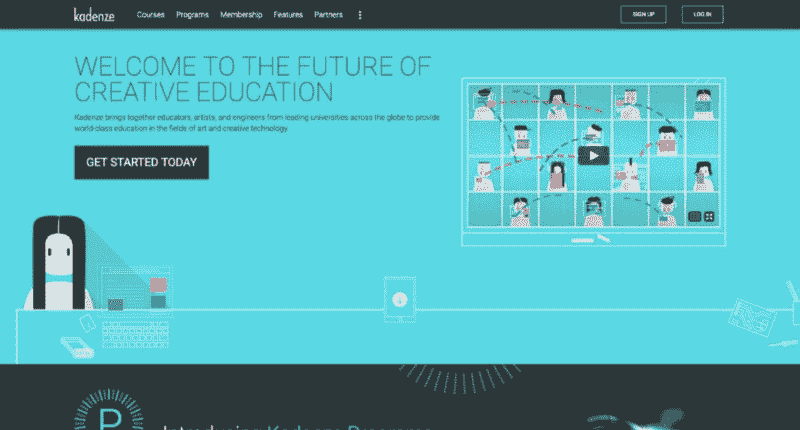

Kadenze 是一个 MOOC 平台，专门从事创意和艺术教育领域。它与世界上一些最好的艺术机构和大学合作推出在线课程。

它的创始人之一是 Ajay Kapur，一位受过古典音乐训练的印度音乐家和计算机科学家。他是加州艺术学院数字艺术研发的副院长。2013 年 10 月，他在 Coursera 上教授了一门名为“音乐家和数字艺术家编程入门”的课程。然而，他很快意识到，他想做的艺术教育的一些事情在 Coursera 上是不可能的，所以他创建了自己的平台。

Kadenze 还推出了自己的证书计划，名为 Kadenze Programs。该计划中的第一门课程是免费的，但其他课程不是免费的。学生还可以获得许多 Kadenze 课程/计划的学分。

*   [卡登泽主页](https://www.kadenze.com/)
*   [中央课堂上的 Kadenze 课程](https://www.class-central.com/provider/kadenze)
*   [Kadenze，一个为艺术教育优化的 MOOC 平台](https://www.class-central.com/report/kadenze/)
*   卡登泽项目:艺术家和创意者的现代证书
*   [机构和合作伙伴| Kadenze](https://www.kadenze.com/partners)

### 7.画布网络(美国)

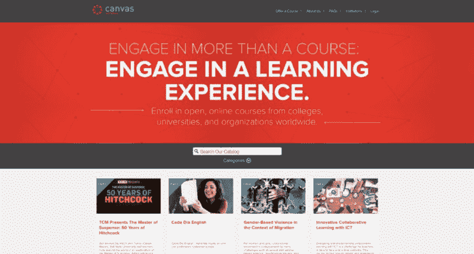

Canvas Network 可能没有什么名气，但他们确实有一些由社区大学和世界各地的其他机构教授的免费在线课程。我看到一些 Canvas 网络课程转移到了 Coursera 这样的大提供商那里。他们的许多课程仍然提供完全免费的证书。Canvas Network 基于 Instructure 开发的 Canvas LMS。

*   [画布网首页](https://www.canvas.net/)
*   [中央课堂画布网络课程](https://www.class-central.com/provider/canvas)

### 8.斯坦福·朗圭塔(美国)

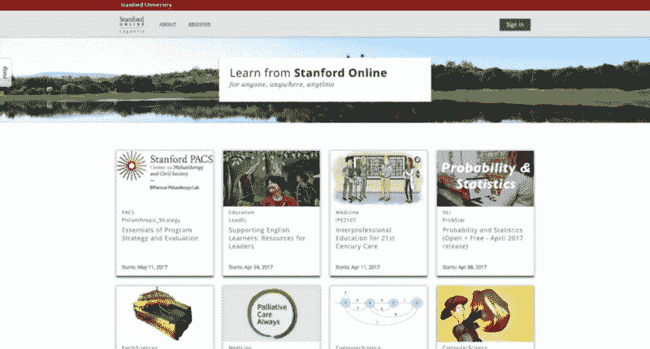

斯坦福大学长期以来一直自主开设课程。它使用 Open edX，edX 的开源版本。

*   [斯坦福语言主页](https://lagunita.stanford.edu/)
*   [斯坦福语言中心课程](https://www.class-central.com/provider/stanford)

### 9.米拉达·x(西班牙)

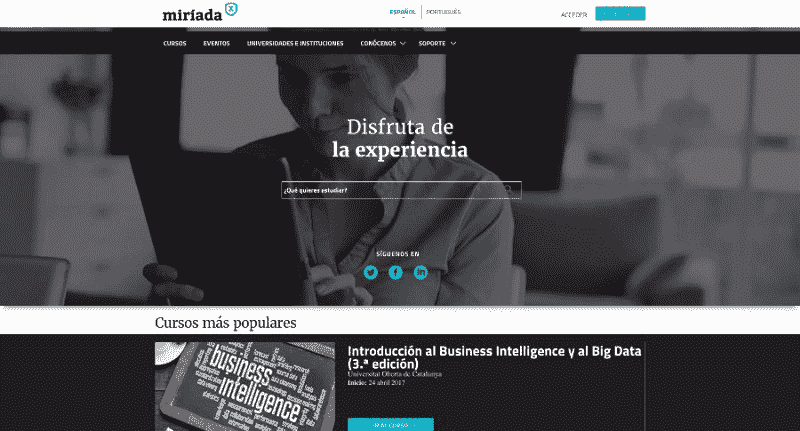

Miríada X 是一个区域性 MOOC 平台，推出了 600 多门西班牙语和葡萄牙语课程。这些课程由 100 所大学合作伙伴开设，分布在西班牙、阿根廷、秘鲁、哥伦比亚、墨西哥、巴西、智利和其他西班牙语和葡萄牙语国家。它拥有超过 300 万名学生，是最大的 MOOC 平台之一。

*   [mirada x 主页](https://miriadax.net/home)
*   [miriada X 中央班课程](https://www.class-central.com/provider/miriadax)

### 10.墨西哥考克斯

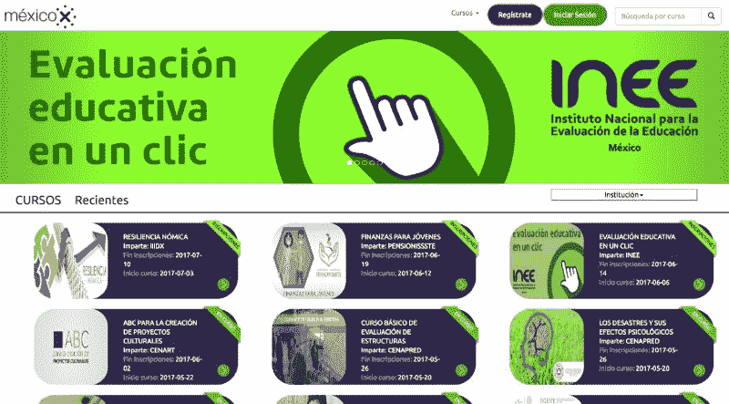

MéxicoX 是一个由墨西哥政府资助的 MOOC 平台，它有 40 多个合作伙伴(来自联邦公共行政部门的大学和机构)。它拥有超过 100 万注册学习者，其中 85%位于墨西哥。

*   [墨西哥主页](http://mexicox.gob.mx/)
*   [墨西哥:认识墨西哥政府资助的 MOOC 平台](https://www.class-central.com/report/mexicox/)
*   墨西哥:增长、货币化、稳定:如何面对这些挑战？

### 11.法国数字大学(FUN)

FUN 是法国官方 MOOC 平台。法国高等教育部于 2013 年 7 月启动了该项目。FUN 在创建 MOOCs 的高等教育机构中有 93 个合作伙伴，包括比利时的三所大学、瑞士的一所大学和突尼斯的两所大学。截至 2017 年 1 月，它已经推出了 279 门 MOOCs，注册学生超过 100 万。

*   [趣味主页](https://www.class-central.com/report/france-universite-numerique/)
*   [中央课堂的趣味课程](https://www.class-central.com/provider/fun)
*   [法国 Numérique 大学:认识法国政府资助的 MOOC 平台](https://www.class-central.com/report/france-universite-numerique/)

### 12.EduOpen(意大利)

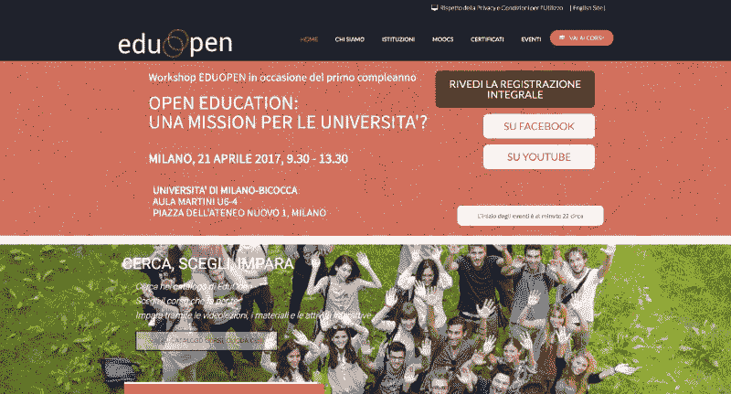

EduOpen 是一家由意大利政府资助的新 MOOC 提供商，它于去年 2016 年 4 月推出。EduOpen 是一个意大利大学的网络，但它也对欧盟大学开放。目前它涉及 17 所大学，包括来自意大利北部和南部的大大小小的机构。

*   [EduOpen 主页](http://eduopen.org/)
*   [在班级中心开设开放式课程](https://www.class-central.com/provider/eduopen)
*   EduOpen:一家由意大利政府资助的新型 MOOC 提供商

### 13.ThaiMOOC / Thailand

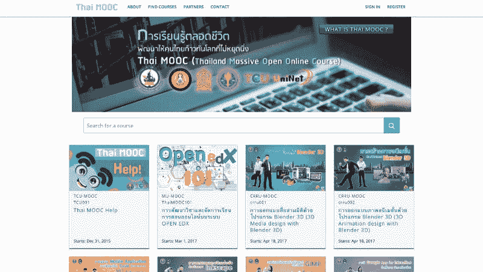

ThaiMOOC 是这份名单中最新的平台之一。它于 2017 年 3 月在今年年初推出。它是泰国的官方 MOOC 平台。ThaiMOOC 平台建立在 Open edX 上，目前列出了大约 50 个球场。

*   [ThaiMOOC 主页](https://thaimooc.org/)
*   [首届亚太 MOOCs 利益相关方峰会在泰国举行](https://www.class-central.com/report/1st-asia-pacific-moocs-stakeholders-summit/)

### 14.Federica.eu(意大利)

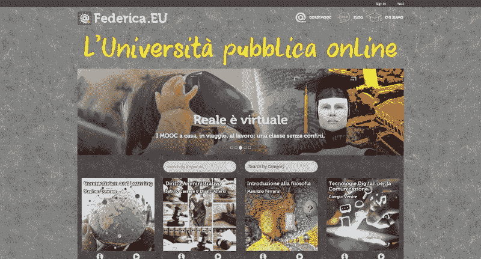

Federica.eu 是那不勒斯大学 Federico II 创建的 MOOC 平台。目前，它的平台上列出了 60 多门免费在线课程。其中一门课程“连接主义和学习”是由斯蒂芬·道恩斯教授的，他被认为教授了第一门 MOOC 课程。

*   [Federica.eu 主页](http://www.federica.eu/)
*   [Federica.eu 课程集中上课](https://www.class-central.com/provider/federica)

### 15.斯瓦亚姆(印度)

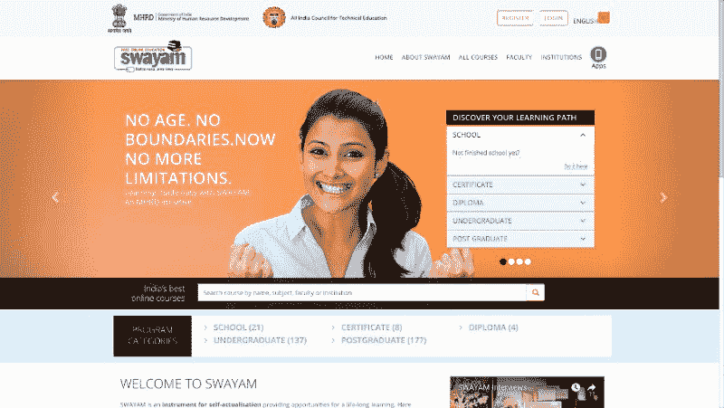

SWAYAM 是“面向有抱负的年轻人的主动学习学习网”的缩写，是印度的官方 MOOC 平台。在斯瓦亚姆的领导下，印度中央资助机构的教授— —如印度理工学院(IITs)、印度管理学院(IIMs)和中央大学——将为印度公民提供在线课程。目前，SWAYAM 平台上有 350 门免费在线课程。

*   [斯瓦亚姆主页](https://swayam.gov.in/)
*   [斯瓦亚姆:印度对 MOOCs 的大规模押注](https://www.class-central.com/report/swayam-initiative-india-moocs/)
*   [印度雄心勃勃的 MOOC 平台“SWAYAM”取得进展](https://www.class-central.com/report/india-swayam-resurfaces/)
*   [印度 MOOC 平台 SWAYAM 推出测试版——开局不利](https://www.class-central.com/report/swayam-beta/)

### 16.NPTEL(印度)

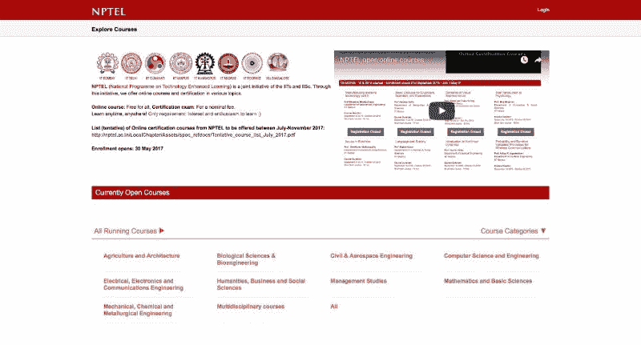

国家技术强化学习计划是由印度人力资源发展部(MHRD)资助的一个项目。很长一段时间以来，它一直将印度理工学院的视频课程放在网上。某种意义上，这类似于麻省理工学院的开放式课程。事实上，NPTEL YouTube 频道的浏览量是麻省理工开放式课程的两倍。

MOOC 流行起来后，NPTEL 还推出了一个独立的 MOOC 平台，提供数百门免费的在线课程，大多是工程领域的课程。

*   [NPTEL 主页](https://onlinecourses.nptel.ac.in/explorer)
*   [n 在中央课堂上讲授课程](https://www.class-central.com/provider/nptel)
*   [NPTEL YouTube 频道](https://www.youtube.com/user/nptelhrd)

### 17.CNMOOC(中国)

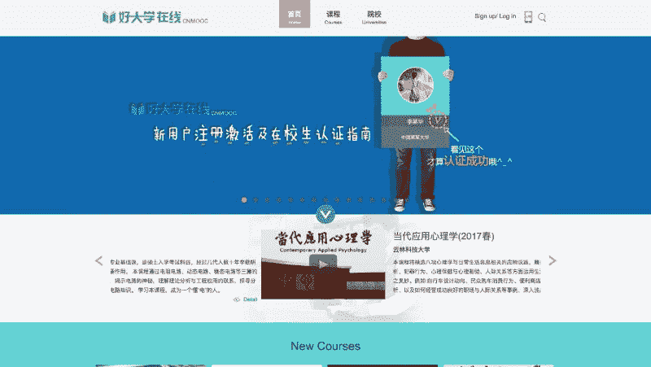

CNMOOC 是中国高水平大学无印良品联盟的官方网站，是面向国内部分高水平大学的开放式合作教育平台。该平台拥有来自 70 多所大学的 400 多门课程。

*   [CNMOOC 主页](http://www.cnmooc.org/home/index.mooc)

### 18.中国 MOOCS(中国)

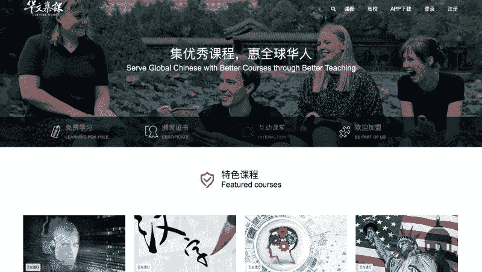

这是另一家来自中国的 MOOC 提供商。它拥有来自几所大学的大约 50 多门课程。

*   [中国慕课主页](http://www.chinesemooc.org/)

### 19.中国大学 MOOC-icourse163.org(中国)

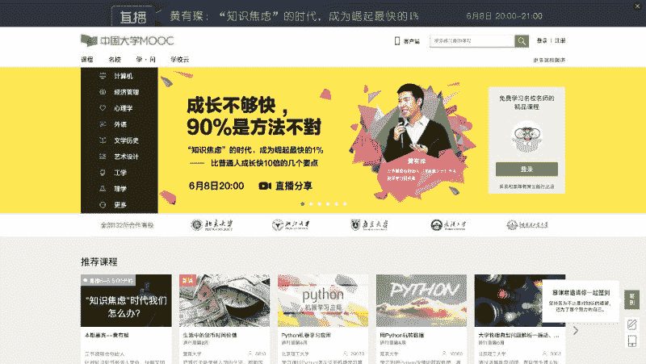

中国大学 MOOC 似乎是另一个 MOOC 平台。据其“关于”页面显示，是网易与高等教育学会合作推出的在线教育平台。它拥有来自 130 多所中国大学的 700 多门课程。

*   [中国大学 MOOC 主页](http://www.icourse163.org/)

### 20.ewant —您想要的教育(台湾)

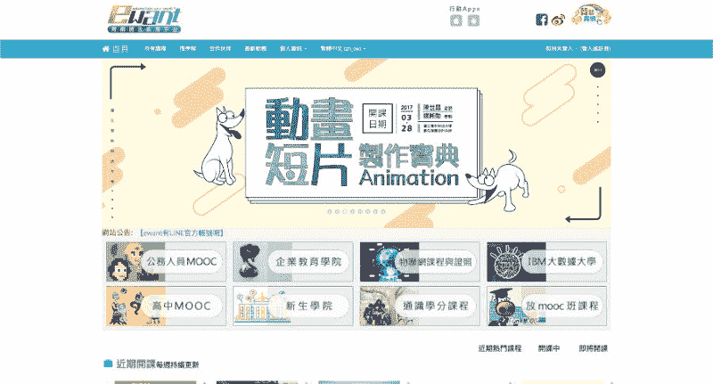

eWant 是一个 MOOC 平台，由国立交通大学于 2013 年推出。国立交通大学位于台湾新竹，是台湾领先的公立研究型大学之一。它拥有来自 80 所不同大学的 500 多门课程。它的目标是教育全球华人。

*   [水渠主页](http://www.ewant.org/)

### 21.埃德拉克语(阿拉伯语，来自约旦)

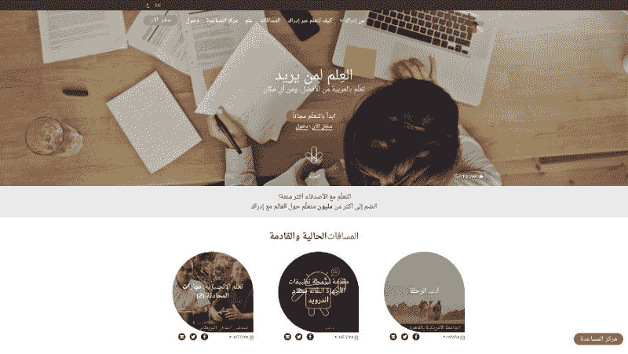

Edraak 在阿拉伯语中的意思是“实现”，这是一个非营利性的阿拉伯语平台，用于大规模开放在线课程(MOOCs)。它于 2014 年 5 月启动，隶属于拉尼亚王后教育和发展基金会(QRF)。Edraak 在其平台上注册了超过 100 万名学习者。

*   [Edraak 主页](https://www.edraak.org/)

### 22.欧洲多重 MOOC 聚合器(EMMA)

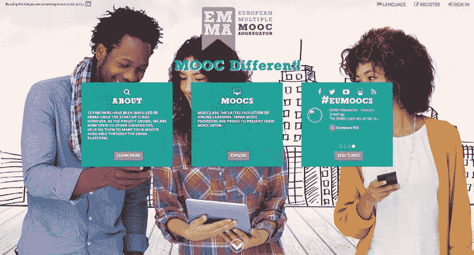

EMMA 是欧盟支持的一项为期 30 个月的试点行动。它汇集并托管欧洲大学提供的课程，这些大学希望以多种语言提供课程。

*   [艾玛主页](https://platform.europeanmoocs.eu/)

### 23.智慧树(中国)

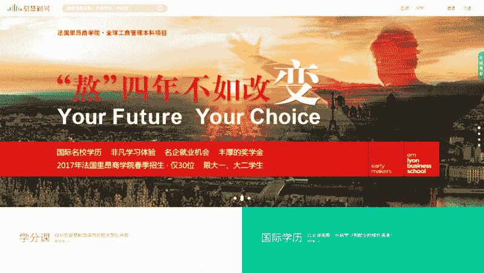

智慧书是另一个来自中国的 MOOC 平台。根据谷歌翻译，智慧书的意思是“智慧之书”。智慧树的一个定义性特点就是还可以赚学分。

*   [智慧书主页](http://www.zhihuishu.com/)

### 24.OpenHPI(德国)

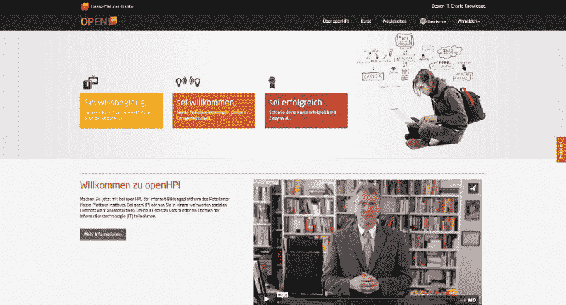

openHPI 是一个 MOOC 平台，由位于德国波茨坦的哈索·普拉特纳研究所(HPI)主办。它提供英语和德语课程。它是 MOOC 领域的早期参与者之一，于 2012 年 9 月推出。

*   [openHPI 主页](https://open.hpi.de/)
*   [在中央课堂上开设 HPI 课程](https://www.class-central.com/provider/openhpi)

### 25 . gacco(日本)

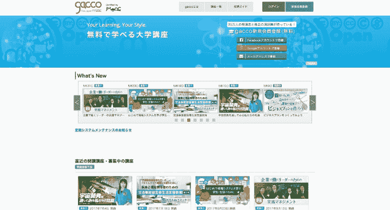

Gacco 是一家 MOOC 提供商，与日本的大学合作提供日语在线课程。Gacco 在其平台上注册了超过 35 万名学生。该平台还有其他功能，如同行评分和优质的面对面学习服务。

*   [gacco 主页](http://gacco.org/)
*   [gacco 中央课堂课程](https://www.class-central.com/provider/gacco)
*   来自 gacco 和 JMOOC 的第一批日本 MOOC

### 26.财政(日本)

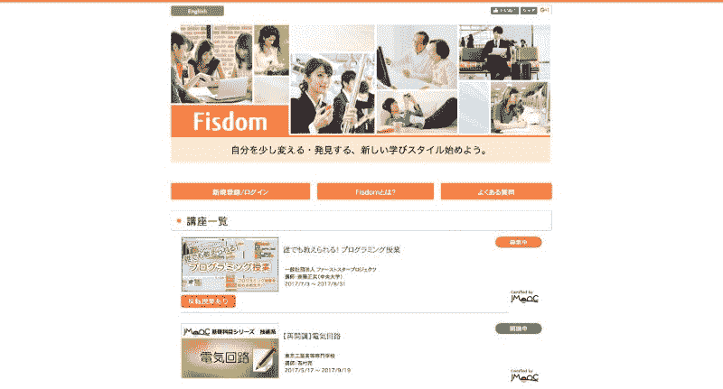

Fisdom 是另一家日本 MOOC 提供商。它于去年 2 月由日本跨国公司富士通推出。Fisdom 的口号是“自由就是智慧”。知识就是自由。”

*   [Fisdom 主页](https://www.fisdom.org/)

### 27.开放式学习(日本)

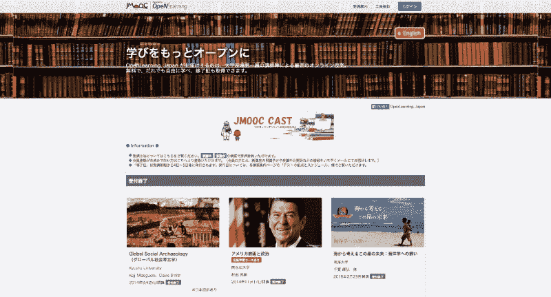

日本开放学习(OpenLearning Japan)，顾名思义，是一家 MOOC 提供商。它是由日本的教育服务公司 Net Learning Inc .推出的。

*   [OpenLearning 日本主页](https://open.netlearning.co.jp/english/)

### 28.JMOOC(日本)

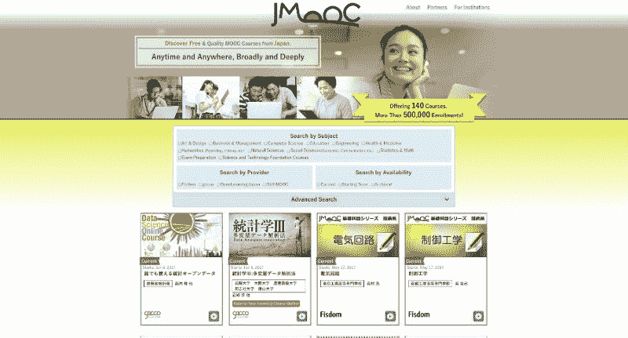

JMOOC 并不是真正的 MOOC 提供商，但它是一个旨在促进日本 MOOC 教育的非营利协会。它有自己的认证标准流程，评估日本 MOOCs 的质量。通过这一考试过程的课程有资格成为 JMOOC 认证课程。

上面列出的三家日本 MOOC 提供商都有经过 JMOOC 认证的课程。截至 2016 年 9 月，已提供 143 门 JMOOC 认证课程，已有 25 万注册学员注册了 61 万门课程。

*   [JMOOC 主页](https://www.jmooc.jp/)

### 29.开放教育(openedu.ru，来自俄罗斯)

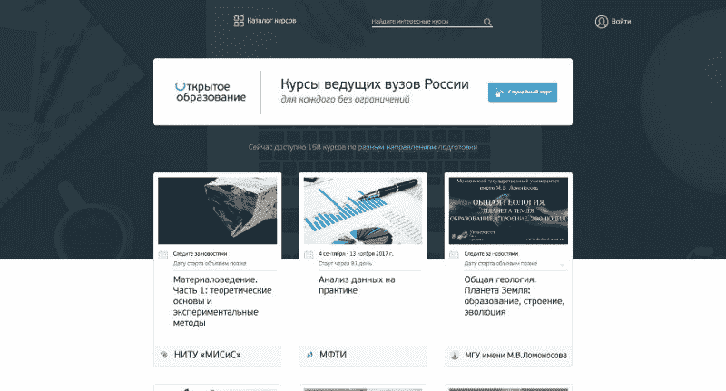

这一 MOOC 提供商是由“国家开放教育平台”协会创建的，该协会由领先的大学创办:MSU 大学、圣彼得堡国立大学、NUST 大学、MISA 大学、NRU“高等经济学院”、MIPT 大学、UFU 大学和 ITMO 大学。它目前提供 150 多门课程，拥有超过 15 万名学习者。

*   [开放教育(openedu.ru)主页](https://openedu.ru/)

### 30.开放教育(openedu.tw，来自台湾)

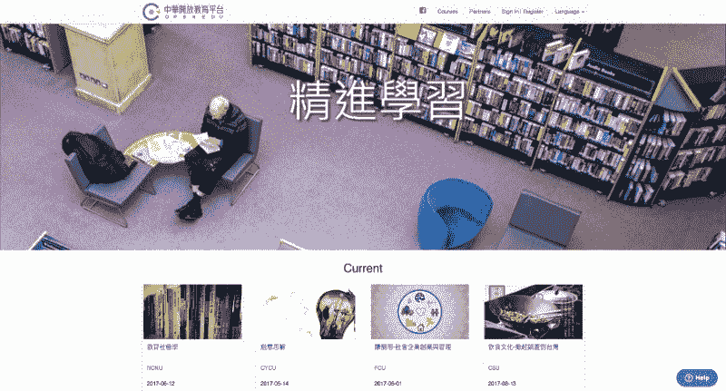

Openedu.tw 是一家来自台湾的 MOOC 提供商，提供超过 180 门免费在线课程。

*   [开放教育(openedu.tw)/主页](https://www.openedu.tw/)

### 31.韩国网络公开课

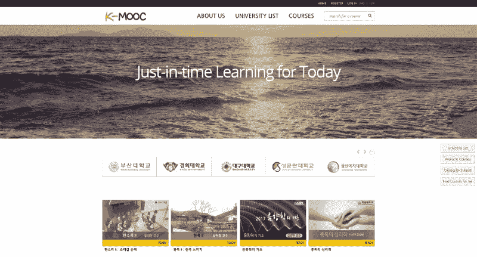

K-MOOC，或韩国 MOOC，是韩国官方 MOOC 平台。它由教育部发起，于 2015 年首次上线。目前它列出了大约 20 所韩国大学的 280 多门课程。

*   [K-MOOC 主页](http://www.kmooc.kr/)

### 32.印度尼西亚 aX

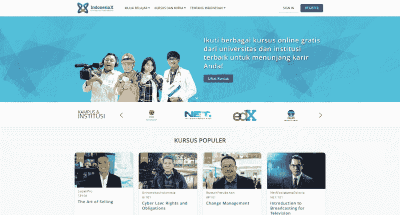

IndonesiaX 是一家非营利组织，提供由印度尼西亚大学和公司制作的 MOOCs。这是一家相对较新的 MOOC 提供商，于 2015 年 8 月推出，目前提供 20 门免费在线课程。

*   [IndonesiaX 主页](https://www.indonesiax.co.id/)
*   [IndonesiaX 介绍视频](https://www.youtube.com/watch?v=U0ZCuzLYgV4)

### 33.普罗米修斯(乌克兰)

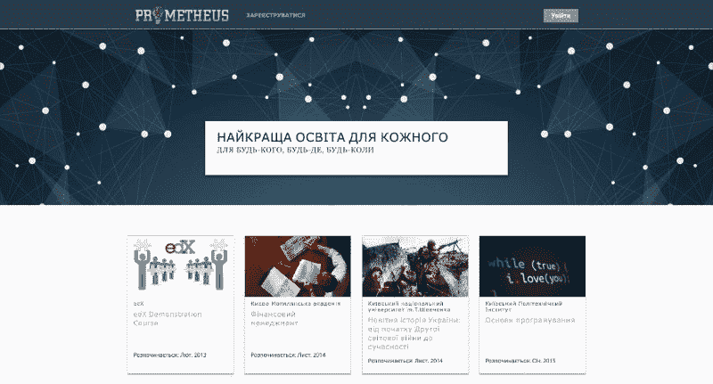

像许多其他 MOOC 提供商一样，普罗米修斯是一个非营利组织。它于 2014 年 10 月推出，它与乌克兰的大学和公司合作推出免费的在线课程。它有大约 50 门课程和超过 25 万注册用户。

*   [普罗米修斯乌克兰主页](https://edx.prometheus.org.ua/)