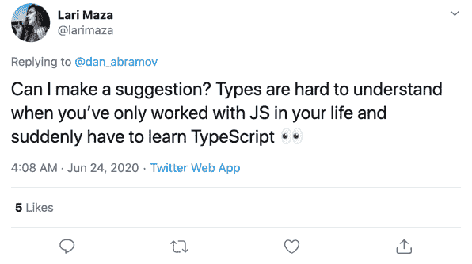

# TypeScript 类型解释——帮助你用类型思考的心智模型

> 原文：<https://www.freecodecamp.org/news/a-mental-model-to-think-in-typescript-2/>

有一天，我看到了拉里·马扎发来的这条推文:



作为一个首先学习 Python、Ruby、JavaScript 和 Clojure 的软件工程师，当我尝试 C++时，它是一部恐怖电影。我做不了什么，而且事与愿违，令人沮丧。也许是因为我什么都做错了，我没有正确理解类型。

但是即使我有这么多问题，我也能实现一堆算法和数据结构。

现在我在日常工作中使用越来越多的打字稿，我的副业项目也越来越多，我觉得我更有准备面对打字。实际上，不是对抗，而是让他们为我所用。

这篇文章是我试图帮助开发人员更多地考虑类型并理解这种心智模型。

## 用 JavaScript 类型思考

如果你在这里，你可能听说过 TypeScript 是 JavaScript 的超集。如果没有，很好，你今天刚刚学到了一些新东西。耶！

TypeScript 是一个超集，因为从语法上讲，任何 JavaScript 代码在 TypeScript 中都是有效的。它可能会编译，也可能不会编译，这取决于 TypeScript 编译器的配置。但是就语法而言，它工作得很好。

这就是为什么您可以通过用`.ts`替换`.js`扩展名来逐步将 JavaScript 迁移到 TypeScript。一切都将没有类型声明(T2 类型)，但那是另一个故事。

此外，如果您用 JavaScript 或任何其他编程语言编写代码，您可能会考虑类型:

*   嗯，这是一个整数列表，所以我只需要过滤偶数并返回一个新的列表
*   "这是一个对象，但我只需要从属性 X 中获取这个字符串值. "
*   该函数接收两个参数。A 和 B 都是整数，我想对它们求和"

是的，你明白了。我们用类型来思考。但它们只是在我们的脑海中。我们不断地考虑它们，因为我们需要知道如何处理、解析或修改数据。我们需要知道在这个对象类型中允许使用哪些方法。

举个更具体的例子，假设你想把所有产品的价格加起来。产品对象看起来像这样:

```
const product = {
  title: 'Some product',
  price: 100.00,
}; 
```

但是现在有了产品清单:

```
const products = [
  {
    title: 'Product 1',
    price: 100.00,
  },
  {
    title: 'Product 2',
    price: 25.00,
  },
  {
    title: 'Product 3',
    price: 300.00,
  }
]; 
```

好吧！现在我们需要一个函数来计算所有产品的价格。

```
function sumAllPrices(products) {
  return products.reduce((sum, product) => sum + product.price, 0);
};

sumAllPrices(products); // 425 
```

只接收产品作为参数，降低所有产品价格。JavaScript 工作得很好。但是在构建这个函数的时候，你开始考虑数据以及如何正确地处理它。

第一部分:产品作为论据。这里你只需要想:“嗯，我们正在接收一些对象的列表”。是的，在我们的头脑中，产品是一个列表。这就是为什么我们可以想到使用`reduce`方法。它是来自`Array`原型的一个方法。

然后我们可以详细地思考这个物体。我们知道产品对象有一个`price`属性。这个属性是一个数字。这就是为什么我们可以用累加器做`product.price`和求和。

概述:

*   `products`是对象列表。
*   作为一个列表，我们可以使用`reduce`方法，因为这个方法是`Array`原型的一个成员。
*   `produce`对象有一些属性。其中一个是`price`，是一个数字。
*   作为一个数字属性，我们可以用它和 reduce 累加器求和。
*   我们想返回一个数字，所有产品价格的总和。

我们总是在考虑数据类型，我们只需要添加类型注释使其更加明确，并向编译器寻求帮助。我们的记忆是有限的，编译器是来帮助我们人类的。

类型系统不仅会使我们的数据更加一致，而且它还可以为数据类型提供自动完成功能。它知道类型，所以它可以显示数据的成员。我们稍后将研究这个想法。在这里，我只是想展示我们在头脑中思考类型。

## 简单类型和简单用途

所以我们准备使用一些强类型编程语言，比如 TypeScript。我们只需要显式地将类型注释添加到数据结构中。很简单吧？

但有时并不那么容易(通常当你来自动态类型语言时并不容易。你觉得没有生产力。感觉就是一场对抗类型的战斗)。这里的想法是让这个学习曲线更平滑、更有趣。

这里我们会看到很多如何在 TypeScript 中使用类型的例子。我们将从简单和愚蠢的例子开始，并在设计思维模型以进行类型思考时逐步使其变得更加复杂。

和 JavaScript 一样，TypeScript 也有基本的数据类型，如`number`、`string`、`boolean`、`null`等。在[类型脚本文件](https://www.typescriptlang.org/docs/handbook/basic-types.html)中可以找到所有的基本数据类型。

有了这些数据单元，我们可以使我们的程序更有用。为了更实际，我们举一个简单的例子。一个`sum`功能。

它在 JavaScript 中是如何工作的？

```
function sum(a, b) {
  return a + b;
} 
```

一切都好吗？很好。

现在让我们使用它:

```
sum(1, 2); // 3
sum(2, 2); // 4
sum(0, 'string'); // '0string'   WTF! 
```

前两个调用是我们期望在我们的系统中发生的。但是 JavaScript 非常灵活，它允许我们为这个函数提供任何值。

最后一个电话很奇怪。我们可以用字符串调用，但是会返回意外的结果。它在开发中不会中断，但在运行时会导致奇怪的行为。

我们想要什么？我们想给函数添加一些约束。它只能接收数字。这样，我们就减少了出现意外行为的可能性。而且函数返回类型也是数字。

```
function sum(a: number, b: number): number {
  return a + b;
} 
```

太好了！这很简单。让我们再次打电话。

```
sum(1, 2); // 3
sum(2, 2); // 4
sum(0, 'string'); // Argument of type '"string"' is not assignable to parameter of type 'number'. 
```

当我们对函数进行类型注释时，我们向编译器提供信息以查看是否一切都正确。它将遵循我们添加到函数中的约束。

所以前两个调用和 JavaScript 中的一样。它将返回正确的计算结果。但是在最后一个例子中，我们有一个编译时的错误。这很重要。错误现在发生在编译时，防止我们将不正确的代码发布到产品中。它说`string`类型不是`number`类型领域中的值集的一部分。

对于基本类型，我们只需要添加一个冒号，后跟类型定义。

```
const isTypescript: boolean = true;
const age: number = 24;
const username: string = 'tk'; 
```

现在让我们增加挑战。还记得我们用 JavaScript 写的产品对象代码吗？让我们再次实现它，但是现在使用类型脚本思维。

请记住我们正在谈论的内容:

```
const product = {
  title: 'Some product',
  price: 100.00,
}; 
```

这就是产品价值。它有一个作为 T1 的 T0 和作为 T3 的 T2。目前，这是我们需要知道的。

对象类型应该是这样的:

```
{ title: string, price: number } 
```

我们用这种类型来注释我们的函数:

```
const product: { title: string, price: number } = {
  title: 'Some product',
  price: 100.00,
}; 
```

使用这种类型，编译器将知道如何处理不一致的数据:

```
const wrongProduct: { title: string, price: number } = {
  title: 100.00, // Type 'number' is not assignable to type 'string'.
  price: 'Some product', // Type 'string' is not assignable to type 'number'.
}; 
```

这里它分解成两种不同的属性:

*   `title`是一个`string`，不应该收到一个`number`。
*   `price`是一个`number`，不应该收到一个`string`。

编译器帮助我们捕捉这样的类型错误。

我们可以通过使用一个叫做`Type Aliases`的概念来改进这种类型注释。这是为特定类型创建新名称的一种方式。

在我们的例子中，产品类型可以是:

```
type Product = {
  title: string;
  price: number;
};

const product: Product = {
  title: 'Some product',
  price: 100.00,
}; 
```

最好将类型可视化，添加语义，也许可以在我们的系统中重用。

现在我们有了这个产品类型，我们可以用它来键入产品列表。语法是这样的:`MyType[]`。在我们这里，`Product[]`。

```
const products: Product[] = [
  {
    title: 'Product 1',
    price: 100.00,
  },
  {
    title: 'Product 2',
    price: 25.00,
  },
  {
    title: 'Product 3',
    price: 300.00,
  }
]; 
```

现在功能`sumAllPrices`。它将接收产品并返回一个数字，即所有产品价格的总和。

```
function sumAllPrices(products: Product[]): number {
  return products.reduce((sum, product) => sum + product.price, 0);
}; 
```

这很有意思。当我们输入产品时，当我们写`product.`，它将显示我们可以使用的可能属性。在产品类型的情况下，它将显示属性`price`和`title`。

```
sumAllPrices(products); // 425
sumAllPrices([]); // 0
sumAllPrices([{ title: 'Test', willFail: true }]); // Type '{ title: string; willFail: true; }' is not assignable to type 'Product'. 
```

传递`products`将产生值`425`。空列表将产生值`0`。如果我们传递一个具有不同结构的对象——TypeScript 有一个结构类型系统，我们稍后将深入探讨这个主题——编译器将抛出一个类型错误，告诉我们该结构不是`Product`类型的一部分。

## 结构分型

结构类型化是一种类型兼容性。这是一种基于结构(特性、成员、属性)来理解类型之间兼容性的方法。一些语言具有基于类型名称的类型兼容性，这被称为名义类型。

比如在 Java 中，即使不同的类型有相同的结构，也会抛出编译错误，因为我们是用不同的类型来实例化和定义一个新的实例。

```
class Person {
  String name;
}

class Client {
  String name;
}

Client c = new Person();  // compiler throws an error
Client c = new Client();  // OK! 
```

在名义类型系统中，类型的相关部分是名称，而不是结构。

另一方面，TypeScript 验证结构兼容性以允许或不允许特定数据。它的类型系统基于结构类型。

在 Java 中崩溃的同一代码实现在 TypeScript 中也能工作。

```
class Person {
  name: string;
}

class Client {
  name: string;
}

const c1: Client = new Person(); // OK!
const c2: Client = new Client(); // OK! 
```

我们想使用`Client`类型，它有属性`name`，指向`Person`类型。它还具有属性类型。因此 TypeScript 将理解这两种类型具有相同的形状。

但它不仅仅是关于类的，它对任何其他“对象”都有效。

```
const c3: Client = {
  name: 'TK'
}; 
```

这段代码也可以编译，因为我们有相同的结构。TypeScript 类型系统不关心它是一个类，还是一个对象文字，如果它有相同的成员，它将是灵活的和可编译的。

但是现在我们将添加第三种类型:`Customer`。

```
class Customer {
  name: string;
  age: number;
}; 
```

它不仅有`name`属性，还有`age`。如果我们在类型为`Customer`的常量中实例化一个`Client`实例会发生什么？

```
const c4: Customer = new Client(); 
```

编译器不会接受这一点。我们想使用有`name`和`age`的`Customer`。但是我们正在实例化只有`name`属性的`Client`。所以它没有相同的形状。这将导致一个错误:

```
Property 'age' is missing in type 'Client' but required in type 'Customer'. 
```

反过来也可以，因为我们需要`Client`，而`Customer`拥有`Client`的所有属性(`name`)。

```
const c5: Client = new Customer(); 
```

工作正常！

我们可以继续列举、对象文字和任何其他类型，但是这里的思想是理解类型的结构是相关的部分。

## 运行时和编译时

在编程语言理论中，这是一个更复杂的话题，但是我想举一些例子来区分运行时和编译时。

基本上，运行时就是一个程序的执行时间。想象一下，您的后端从前端表单页面接收数据，处理这些数据，并保存它。或者当您的前端从服务器请求数据以呈现一个~~口袋妖怪~~产品列表时。

编译时间基本上是指编译器在源代码中执行操作以满足编程语言的要求。例如，它可以将类型检查作为一项操作。

例如，TypeScript 中的编译时错误与我们之前编写的代码密切相关:

*   当类型缺少属性:`Property 'age' is missing in type 'Client' but required in type 'Customer'.`
*   类型不匹配时:`Type '{ title: string; willFail: true; }' is not assignable to type 'Product'.`

让我们看一些例子来更好地理解。

我想写一个函数来获取被传递的编程语言的一部分的索引。

```
function getIndexOf(language, part) {
  return language.indexOf(part);
} 
```

它接收我们将寻找以获得索引的`language`和`part`。

```
getIndexOf('Typescript', 'script'); // 4
getIndexOf(42, 'script'); // Uncaught TypeError: language.indexOf is not a function at getIndexOf 
```

当传递一个字符串时，它工作得很好。但是在传递一个数字时，我们得到了一个运行时错误`Uncaught TypeError`。因为一个数没有一个`indexOf`函数，所以我们并不能真正的使用它。

但是如果我们给编译器类型信息，在编译时，它会在运行代码前抛出一个错误。

```
function getIndexOf(language: string, part: string): number {
  return language.indexOf(part);
} 
```

现在我们的程序知道它需要接收两个字符串并返回一个数字。当我们遇到类型错误时，编译器可以使用这些信息来抛出错误...运行前。

```
getIndexOf('Typescript', 'script'); // 4
getIndexOf(42, 'script'); // Argument of type '42' is not assignable to parameter of type 'string'. 
```

也许，对于小项目(或像我们这样的小功能)，我们真的看不到太多的好处。

在这种情况下，我们知道我们需要传递一个字符串，所以我们不会向函数传递一个数字。但是当代码库增长或者你有很多人添加代码和更多的复杂性时，我很清楚类型系统可以帮助我们在将代码交付到产品之前在编译时发现错误。

起初，我们需要所有的学习曲线来理解类型和所有的心理模型，但是过一会儿，你将更习惯于类型注释，并最终与编译器成为朋友。它将是一个助手，而不是 T2 的吼叫者。

当我们学习编译时和运行时的基本区别时，我认为区分类型和值是很重要的。

我将在这里展示的所有示例都可以被复制并在 [TypeScript Playground](https://www.typescriptlang.org/play) 中运行，以理解编译器和编译过程的结果(也称为*“JavaScript”*)。

在 TypeScript 中，我们有两个不同的领域:值空间和类型空间。类型空间是定义和使用类型的地方，使编译器能够完成所有伟大的工作。值空间是程序中的值，比如变量，常量，函数，值，以及运行时的东西。

理解这个概念是有好处的，因为在 TypeScript 中，我们不能在运行时使用类型检查。它在类型检查和编译过程之间有一个非常清晰的分离。

TypeScript 有一个对源代码类型进行类型检查的过程，检查所有内容是否正确和一致。然后它可以编译成 JavaScript。

因为这两个部分是分开的，所以我们不能在运行时使用类型检查。仅在“编译时”。如果你试图使用一个类型作为值，它会抛出一个错误:`only refers to a type, but is being used as a value here`。

让我们看看这个想法的例子。

假设我们想写一个名为`purchase`的函数，在这里我们接收一个支付方法，并基于这个方法，我们想做一些动作。我们有信用卡和借记卡。让我们在这里定义它们:

```
type CreditCard = {
  number: number;
  cardholder: string;
  expirationDate: Date;
  secutiryCode: number;
};

type DebitCard = {
  number: number;
  cardholder: string;
  expirationDate: Date;
  secutiryCode: number;
};

type PaymentMethod = CreditCard | DebitCard; 
```

这些类型在*类型空间*中，所以它只在编译时有效。在对这个函数进行类型检查之后，编译器会移除所有的类型。

如果在 TypeScript Playground 中添加这些类型，输出将只是一个严格的定义`"use strict";`。

这里的想法是真正理解类型存在于*类型空间*中，并且在运行时不可用。所以在我们的函数中，不可能这样做:

```
const purchase = (paymentMethod: PaymentMethod) => {
  if (paymentMethod instanceof CreditCard) {
    // purchase with credit card
  } else {
    // purchase with debit card
  }
} 
```

在编译器中，它抛出一个错误:`'CreditCard' only refers to a type, but is being used as a value here.`。

编译器知道这两个空间的区别，并且知道类型`CreditCard`存在于*类型空间*中。

playground 是一个非常酷的工具，可以用来查看您的类型脚本代码的输出。如果您创建一个新的信用卡对象，如下所示:

```
const creditCard: CreditCard = {
  number: 2093,
  cardholder: 'TK',
  expirationDate: new Date(),
  secutiryCode: 101
}; 
```

编译器将对其进行类型检查，并完成所有的魔术，然后将类型脚本代码转换成 JavaScript。我们有这个:

```
const creditCard = {
    number: 2093,
    cardholder: 'TK',
    expirationDate: new Date(,
    secutiryCode: 101
}; 
```

相同的对象，但现在只有值，没有类型。

## 约束和类型收缩

当我们限制我们能做什么时，就更容易理解我们能做什么。

我们使用类型作为约束来限制程序中的错误。为了理解这个概念，我从 Lauren Tan 关于类型系统的演讲中偷了一个例子。

```
const half = x => x / 2; 
```

这个函数有多少种失效方式？想象一些可能的输入:

```
[
  null,
  undefined,
  0,
  '0',
  'TK',
  { username: 'tk' },
  [42, 3.14],
  (a, b) => a + b,
] 
```

输入的结果是什么:

```
half(null); // 0
half(undefined); // NaN
half(0); // 0
half('0'); // 0
half('TK'); // NaN
half({ username: 'tk' }); // NaN
half([42, 3.14]); // NaN
half((a, b) => a + b); // NaN 
```

我们在这里有不同的和意想不到的结果。这里很明显，我们想要一个数字作为`half`函数，进行计算，很好，完成了！但有时我们无法控制输入，或者代码库很大，或者是新的/不熟悉的，我们会犯这些小错误。

向我们的代码添加约束的想法是缩小一系列类型的可能性。在这种情况下，我们希望将输入类型限制为一个`number`类型。这是我们唯一关心的半计算类型。通过类型收缩，我们再次向编译器提供类型信息。

```
const half = (x: number) => x / 2; 
```

有了这些新信息，如果我们再次调用测试用例的函数，我们会得到不同的结果:

```
half(null); // Argument of type 'null' is not assignable to parameter of type 'number'.
half(undefined); // Argument of type 'undefined' is not assignable to parameter of type 'number'.(
half(0); // 0
half('0'); // Argument of type '"0"' is not assignable to parameter of type 'number'.
half('TK'); // Argument of type '"TK"' is not assignable to parameter of type 'number'.
half({ username: 'tk' }); // Argument of type '{ username: string; }' is not assignable to parameter of type 'number'.
half([42, 3.14]); // Argument of type 'number[]' is not assignable to parameter of type 'number'.
half((a, b) => a + b); // Argument of type '(a: any, b: any) => any' is not assignable to parameter of type 'number'. 
```

基本上编译器会告诉我们，只有数字类型，在这种情况下，`0`值，是一个有效的输入，它会编译，并允许运行代码。我们缩小了输入类型，只允许我们真正想要的值用于这个函数。

但是还有其他方法来缩小 TypeScript 中的类型。假设我们有一个函数，它接收的参数可以是字符串或数字。

```
type StringOrNumber = string | number;

function stringOrNumber(value: StringOrNumber) {} 
```

在函数体中，编译器不知道我们可以为这个类型使用哪些方法或属性。是字符串还是数字？我们只知道运行时的值。但是我们可以使用`typeof`来缩小类型:

```
function stringOrNumber(value: StringOrNumber) {
  if (typeof value === 'string') {
    // value.
		// your ide will show you the possible methods from the string type
		// (parameter) value: string
    value
  }

  if (typeof value === 'number') {
    // value.
		// your ide will show you the possible methods from the number type
		// (parameter) value: number
    value
  }
} 
```

有了`if`语句和`typeof`，我们可以给编译器更多的信息。现在它会知道每个`if`身体的具体类型。

IDE 知道为特定类型显示什么。运行时，当值为字符串时，会转到第一条`if`语句，编译器会推断出类型为字符串:`(parameter) value: string`。

当值是一个数字时，它将转到第二个`if`语句，编译器将推断一个类型是一个数字:`(parameter) value: number`。

`if`语句可以成为编译器的助手。

另一个例子是当我们在一个对象中有一个可选属性，但是在一个函数中，我们需要返回一个基于这个可选值的值。

想象我们有这种类型:

```
type User = {
  name: string;
  address: {
    street: string;
    complement?: string;
  }
}; 
```

很简单的`User`型。让我们来关注一下`complement`属性。它是可选的(仔细看看`?`符号)，这意味着它可以是`string`或`undefined`。

现在我们要构建一个函数来接收用户并获取地址补码的长度。这个呢？

```
function getComplementLength(user: User): number {
  return user.address.complement.length;
	// (property) complement?: string | undefined
  // Object is possibly 'undefined'.
} 
```

正如我们前面看到的，`complement`可以是`string`或`undefined`。`undefined`其实并没有一个叫`length`的属性:

```
Uncaught TypeError: Cannot read property 'length' of undefined 
```

我们可以做出这样的东西:

```
function getComplementLength(user: User) {
  return user.address.complement?.length;
} 
```

如果`complement`有一个字符串值，我们可以调用`length`，否则，它将返回`undefined`。

所以这个函数有两种可能的返回类型:`number | undefined`。但是我们希望确保只返回`number`。所以我们使用一个`if`或者一个三元条件来缩小类型。它只会在`.length`有实际价值的时候(或者不是`undefined`的时候)调用`.length`。

```
function getComplementLength(user: User): number {
  return user.address.complement
    ? user.address.complement.length
    : 0;
} 
```

如果是`undefined`，我们返回最小长度:`0`。现在，我们可以使用正确类型设计的函数，无论有没有补码。没有编译和运行时错误。

```
getComplementLength({
  name: 'TK',
  address: {
    street: 'Shinjuku Avenue'
  }
}); // 0

getComplementLength({
  name: 'TK',
  address: {
    street: 'Shinjuku Avenue',
    complement: 'A complement'
  }
}); // 12 
```

我们将从第一次函数调用中得到`0`，从第二次调用中得到`12`。

有了这个`if`概念，我们也可以使用其他的助手来做同样的事情。我们可以使用`in`操作符来验证对象的属性，使用`Array.isArray`来验证数组，或者使用`instanceof`来验证任何其他的类类型。

我们还可以使用更高级的概念，如断言函数或类型保护，但是我将把这些概念留到以后的文章中。

在这个*约束*主题中，我想深入挖掘的一点是不变性。

在 JavaScript 和 TypeScript 中，我们有可变对象的概念。如果你在一个变量中定义了一个值，我们可以在以后给它重新赋值。

```
let email = 'harry.potter@mail.com';
email // 'harry.potter@mail.com'
email = 'hermione.granger@mail.com';
email // 'hermione.granger@mail.com' 
```

现在想象你有一个数字列表。你想用一个函数对所有的数字求和。该函数如下所示:

```
function sumNumbers(numbers: number[]) {
  let sum = 0;
  let num = numbers.pop();

  while (num !== undefined) {
    sum += num;
    num = numbers.pop();
  }

  return sum;
} 
```

您调用传递您的列表的函数并获得结果。它工作得很好。

```
const list = [1, 2, 3, 4];
sumNumbers(list); // 10 
```

但是你的单子怎么了？是函数让它完全变异了吗？

```
list; // [] 
```

如果我们使用列表，它现在是空的。`sumNumbers`函数中的`pop`是一个“变异”函数。它获取引用并从引用中移除该项。不是抄袭，是真实参考。

在运行时，我们可以使用其他函数或方法来做同样的事情:使用 reduce，做一个 for 循环，而不需要从数组中`pop`项。

但是使用 TypeScript，我们可以在编译时提供不变性。如果你没有使用类型，可以使用类型断言`as const`。想象一下:

```
const author = {
  name: 'Walter Isaacson',
  email: 'walter.isaacson@mail.com',
  books: [
    {
      title: 'Leonardo Da Vinci',
      price: 50.00,
    }
  ]
};

author.books.push({
  title: 'Steve Jobs',
  price: 10.00
}); 
```

只是一个作者对象，然后我们给这个作者添加一本新书。`push`方法更新书籍的数组引用。这是一种“变异”方法。让我们看看你是否使用了 const 断言`as const`:

```
const author = {
  name: 'Walter Isaacson',
  email: 'walter.isaacson@mail.com',
  books: [
    {
      title: 'Leonardo Da Vinci',
      price: 50.00,
    }
  ]
} as const;

author.books.push({
  title: 'Steve Jobs',
  price: 10.00
});
// Property 'push' does not exist on type
// 'readonly [{ readonly title: "Leonardo Da Vinci"; readonly price: 50; }]' 
```

编译器不会编译。它在作者的对象上得到一个错误。它现在是 readonly，作为一个 readonly 对象，它没有名为`push`的方法(或任何“mutate”方法)。

我们给作者的对象添加了一个约束。之前它是一个特定的类型(带有所有的“mutate”方法)，现在我们将类型缩小到几乎相同，但是没有“mutate”方法。缩小类型。

为了继续，让我们给这个对象添加类型。`book`和`author`:

```
type Book = {
  title: string;
  price: number;
};

type Author = {
  name: string;
  email: string;
  books: Book[];
}; 
```

将类型添加到作者对象:

```
const author: Author = {
  name: 'Walter Isaacson',
  email: 'walter.isaacson@mail.com',
  books: [
    {
      title: 'Leonardo Da Vinci',
      price: 50.00,
    }
  ]
}; 
```

将类型添加到新的图书对象:

```
const book: Book = {
  title: 'Steve Jobs',
  price: 30
}; 
```

现在我们可以将新书添加到作者:

```
author.name = 'TK';
author.books.push(book); 
```

它工作得很好！

我想展示另一种在编译时增加不变性的方法。TypeScript 有一个名为`Readonly`的实用程序类型。

您可以为对象中的每个属性添加`readonly`。大概是这样的:

```
type Book = {
  readonly title: string;
  readonly price: number;
}; 
```

但是它可能非常重复。因此，我们可以使用`Readonly`实用程序将`readonly`添加到对象的所有属性中:

```
type Book = Readonly<{
  title: string;
  price: number;
}>; 
```

需要记住的一点是，它没有为嵌套属性添加 readonly。例如，如果我们将`Readonly`添加到`Author`类型，它不会将`readonly`也添加到`Book`类型。

```
type Author = Readonly<{
  name: string;
  email: string;
  books: Book[];
}>; 
```

作者的所有属性都不能被重新分配，但是你可以在这里改变`books`列表(`push`，`pop`，...)因为`Book[]`不是只读的。让我们看看。

```
const author: Author = {
  name: 'Walter Isaacson',
  email: 'walter.isaacson@mail.com',
  books: [
    {
      title: 'Leonardo Da Vinci',
      price: 50.00,
    }
  ]
};

const book: Book = {
  title: 'Steve Jobs',
  price: 30
};

author.books.push(book);
author.books;
/* =>
 *
 * [
 *   {
 *     title: 'Leonardo Da Vinci',
 *     price: 50.00,
 *   },
 *   {
 *    title: 'Steve Jobs',
 *    price: 30
 *   }
 * ]
 *
 */ 
```

`push`会工作得很好。

那么，我们如何对`books`执行只读操作呢？我们需要确保数组是只读类型。我们可以使用`Readonly`，或者使用 TypeScript 中的另一个工具`ReadonlyArray`。让我们来看两种方法。

用`Readonly`:

```
type Author = Readonly<{
  name: string;
  email: string;
  books: Readonly<Book[]>;
}>; 
```

用`ReadonlyArray`:

```
type Author = Readonly<{
  name: string;
  email: string;
  books: ReadonlyArray<Book>;
}>; 
```

对我来说，两者都很棒！但在我看来，`ReadonlyArray`更有语义，我也觉得它不那么罗嗦(不是说带数组的`Readonly`是)。

如果我们现在尝试改变 author 对象会发生什么？

```
author.name = 'TK'; // Cannot assign to 'name' because it is a read-only property.
author.books.push(book); // Property 'push' does not exist on type 'readonly [{ readonly title: "Leonardo Da Vinci"; readonly price: 50; }]'. 
```

太好了！现在我们可以在编译时捕捉可变操作。这是一种使用向我们的类型添加约束的概念来确保它们只做真正需要的事情的方法。

## 语义和可读性

起初，我觉得由于类型的原因，TypeScript 可能会非常冗长，并使代码比它应该的要复杂得多。它确实可以。力求简单是目标，同时也很难。

这个想法与干净的代码以及我们如何编写人类可读和可维护的代码非常相关。TypeScript 也不例外。大多数情况下，我们不需要超级复杂的类型。让简单的类型来完成这项工作。

我发现另一件非常有用的事情是类型的语义。

假设您需要向`sessionStorage`添加一个字符串，以将其保存在浏览器中。您的函数如下所示:

```
function saveMyString(value: string): any {
  sessionStorage.myString = value;
} 
```

您向字符串输入添加了一个类型注释，由于您不知道返回的类型，您可能会添加一个`any`类型。

但是这种回归类型背后的真正含义是什么呢？它会返回任何东西吗？

它只是将字符串保存到`sessionStorage`。它不返回任何东西。`void`型正是你要找的。正如打字稿文件所说:`the absence of having any type at all`。

```
function saveMyString(value: string): void {
  sessionStorage.myString = value;
} 
```

太好了，现在类型的含义是正确的。正确性在一个类型系统中是非常重要的。这是对我们的数据建模的一种方式，但也有助于为未来的开发人员维护系统。即使开发者是...你！

在我们讨论冗长代码之前。我们可以通过使用 TypeScript 类型推断来改进很多代码。

对于某些代码，我们不需要显式添加类型注释。TypeScript 编译器将理解并隐式推断它。例如:

```
const num: number = 1; 
```

这段代码是多余的。我们可以让编译器这样推断:

```
const num = 1; 
```

在前面的例子中，我们将注释`void`添加到了`saveMyString`函数中。但是由于函数不返回值，编译器会推断返回的类型是隐式的`void`。

当我得知这一点时，我自己也在想。但是使用 TypeScript(或任何其他类型系统/静态类型语言)的最大优势之一是将类型作为文档。如果我们让编译器推断大部分类型，我们就不会有我们想要的文档。

但是如果您将鼠标悬停在编辑器中的 TypeScript 代码上(至少 VS 代码是这样工作的)，您可以看到类型信息和相关文档。

让我们看看其他冗余代码的例子，让代码不那么冗长，让编译器为我们工作。

```
function sum(a: number, b: number): number {
  return a + b;
}; 
```

我们不需要返回类型`number`，因为编译器知道一个`number` +另一个`number`等于一个`number`类型，而且是返回类型。它可以是:

```
function sum(a: number, b: number) {
  return a + b;
}; 
```

隐式代码，但是有文档，由编译器完成工作。

类型推理也适用于方法:

```
function squareAll(numbers: number[]): number[] {
  return numbers.map(number => number * number);
}; 
```

这个函数获取一个数字列表，并使每个数字都是平方值。返回的类型是`number[]`，尽管地图的结果总是一个列表，并且我们有一个数字列表，它将总是一个数字列表。所以我们让编译器也推断出这一点:

```
function squareAll(numbers: number[]) {
  return numbers.map(number => number * number);
}; 
```

这同样适用于对象。

```
const person: { name: string, age: number } = {
  name: 'TK',
  age: 24
}; 
```

具有字符串名称和数字年龄的 person 对象。但是当我们给这些值赋值时，编译器可以推断出这些类型。

```
const person = {
  name: 'TK',
  age: 24
}; 
```

如果你悬停在`person`上，你会得到这个:

```
const person: {
  name: string;
  age: number;
} 
```

这里记录了这些类型。

类型推断的另一个好处是我们可以很容易地重构我们的代码。这是一个简单的例子，但是很好地说明了重构过程。再来拿一下`sum`函数。

```
function sum(a: number, b: number): number {
  return a + b;
}; 
```

我们想返回`"Sum: {a + b}"`，而不是返回总数。所以对于`a = 1`和`b = 2`，我们得到的字符串是`"Sum: 3"`。

```
function sum(a: number, b: number): string {
  return `Sum: ${a + b}`;
};

sum(1, 2); // Sum: 3 
```

太好了！但是现在让编译器推断这个。

```
// function sum(a: number, b: number): number
function sum(a: number, b: number) {
  return a + b;
};

// function sum(a: number, b: number): string
function sum(a: number, b: number) {
  return `Sum: ${a + b}`;
}; 
```

我们只需要修改返回值，类型推断就会起作用。不需要考虑返回类型。这是一个小例子，但是对于更复杂的函数，它也可以工作。

回到可读性部分，我们可以使用`Enum`。定义一组命名常量的实用程序。这是赋予应用程序中的数据更多意义的一种方式。

在您的节点应用程序或前端应用程序中，您可能会做一些获取来请求数据。您通常使用 fetch 对象来执行请求，有时您需要传递 accept 头。

```
fetch('/pokemons', {
  headers: {
    Accept: 'application/json'
  }
});

fetch('/harry-potter/spells', {
  headers: {
    Accept: 'application/json'
  }
}); 
```

这很好，但是我们也可以使用 enum 将这个 accept 字符串分隔在一个常量中并重用。

```
enum MediaTypes {
  JSON = 'application/json'
}

fetch('/pokemons', {
  headers: {
    Accept: MediaTypes.JSON
  }
});

fetch('/harry-potter/spells', {
  headers: {
    Accept: MediaTypes.JSON
  }
}); 
```

我们能够添加更多与`MediaTypes`相关的数据，如`PDF`:

```
enum MediaTypes {
  JSON = 'application/json',
  PDF = 'application/pdf'
} 
```

使用`Enum`，我们可以将数据封装到一个有意义的代码块中。

最近，我正在实现一个“state”React 组件。它基本上是一个基于请求响应呈现空状态或错误状态的组件。

空状态和错误状态的用户界面非常相似。只有标题、描述文本和图像图标不同。所以我想:“我有两种方法来实现这一点:在组件外部执行逻辑并传递所有需要的信息，或者传递一个‘状态类型’并让组件呈现正确的图标和消息。”

所以我建立了一个枚举:

```
export enum StateTypes {
  Empty = 'Empty',
  Error = 'Error'
}; 
```

我可以将这些数据作为`type`传递给组件:

```
import ComponentState, { StateTypes } from './ComponentState';

<ComponentState type={StateTypes.Empty} />
<ComponentState type={StateTypes.Error} /> 
```

在组件中，它有一个状态对象，其中包含与`title`、`description`和`icon`相关的所有信息。

```
const stateInfo = {
  Empty: {
    title: messages.emptyTitle,
    description: messages.emptyDescription,
    icon: EmptyIcon,
  },
  Error: {
    title: messages.errorTitle,
    description: messages.errorDescription,
    icon: ErrorIcon,
  },
}; 
```

因此，我可以只接收基于枚举的类型，并将这个`stateInfo`对象与来自我们设计系统的`State`组件一起使用:

```
export const ComponentState = ({ type }) => (
  <State
    title={stateInfo[type].title}
    subtitle={stateInfo[type].subtitle}
    icon={stateInfo[type].icon}
  />
); 
```

这是一种使用枚举将重要数据封装到应用程序中有意义的代码块中的方法。

TypeScript 的另一个很酷的特性是可选属性。当一个对象的属性可以是一个实值或者未定义的值时，我们使用一个可选的属性来明确地表示该属性可以存在或者不存在。其语法是 object 属性中的一个简单的`?`操作符。想象一下这个函数:

```
function sumAll(a: number, b: number, c: number) {
  return a + b + c;
} 
```

但是现在`c`值是可选的:

```
function sumAll(a: number, b: number, c?: number) {
  return a + b + c;
} 
```

我们在`c`后面加上`?`。但是现在我们有一个编译器错误:

```
(parameter) c: number | undefined
Object is possibly 'undefined'. 
```

我们不能对一个`undefined`值求和(实际上在 JavaScript 中我们可以，但是我们接收的是一个`NaN`值)。

我们需要确保`c`存在。缩小类型！

```
function sumAll(a: number, b: number, c?: number) {
  if (c) {
    return a + b + c;
  }

  return a + b;
} 
```

如果`c`存在，它将是一个`number`，我们可以求和。如果不是，只对`a`和`b`值求和。

这个可选属性的有趣之处在于它是一个`undefined`而不是`null`。这就是为什么我们这样做，我们得到一个编译错误:

```
let number = null;
sumAll(1, 2, number);
// Argument of type 'null' is not assignable to parameter of type 'number | undefined'. 
```

由于`?`操作符不处理`null`值，所以选择在应用程序中使用`undefined`类型，这样您仍然可以使用可选属性并使类型保持一致。我们可以这样使用它:

```
let value: number | undefined;
sumAll(1, 2, value); // 3 
```

如果给参数添加一个默认值，就不需要`?`操作符了。其实编译器会说`Parameter cannot have question mark and initializer`。

```
function sumAll(a: number, b: number, c: number = 3) {
  return a + b + c;
} 
```

可选属性不仅作用于变量和参数，也作用于对象。

API 响应是类型定义和可选属性结合的一个很好的例子。在 API 响应中，数据可以是可选的。有时候 API 发送，有时候没有值。

我们如何对我们的类型建模对于一个应用程序来说非常重要。如果一个可选的属性被定义为一个必需的类型，我们可以让我们的应用程序在运行时中断。但是如果我们正确地设计了类型，我们就有可能在编译时出错。

假设我们正在获取一个用户数据，这是我们对响应类型建模的方式:

```
type UserResponse = {
  name: string;
  email: string;
  username: string;
  age: number;
  isActive: boolean;
}; 
```

但实际上，电子邮件对用户来说是可选的。API 端点可以返回，也可以不返回。但是我们构建的`UserResponse`类型将它视为必需属性。

在获取用户数据之后，我们希望查看用户电子邮件是否与特定的域匹配。

```
function matchDomain(email: string) {
  return email.endsWith(domain);
} 
```

由于`UserResponse`类型需要`email`属性，因此`matchDomain`函数也需要`email`参数。

如果`email`是`undefined`，这是我们可以得到的运行时间:

```
// Uncaught TypeError: Cannot read property 'endsWith' of undefined 
```

但是如果我们正确地对`UserResponse`建模，会发生什么呢？

```
type UserResponse = {
  name: string;
  email?: string;
  username: string;
  age: number;
  isActive: boolean;
}; 
```

现在`email`可能是`undefined`并且是显式的。

但是如果我们仍然保持函数`matchDomain`不变，我们会得到一个编译错误:

```
// Argument of type 'undefined' is not assignable to parameter of type 'string'. 
```

这太棒了！现在我们可以使用`?`操作符来修改这个函数中的`email`参数:

```
function matchDomain(email?: string) {
  return email.endsWith('email.com');
} 
```

但是现在我们在运行`email.endsWith`时得到一个编译错误，因为它也可能是`undefined`:

```
// (parameter) email: string | undefined
// Object is possibly 'undefined'. 
```

缩小类型！当`email`为`undefined`时，我们使用 if 块返回一个`false`。并且只有当`email`确实是一个字符串时才运行`endsWith`方法:

```
function matchDomain(email?: string) {
  if (!email) return false;
  return email.endsWith('email.com');
} 
```

当我们可以在编译时得到运行时错误时，这是非常好的。在我们投入生产后，编码比调试更好，不是吗？

## 铅字排版

当试图为代码库的新位置重用现有类型时，类型组合非常有用。我们不需要重写新的类型，我们可以通过组合现有的类型来创建新的类型。

我必须使用 Redux 或 React 中的`useReducer`钩子来处理的一个例子就是“reducers”的概念。减压器总是可以接收许多不同的动作。

在这个上下文中，动作是至少具有一个`type`属性的对象。看起来是这样的:

```
enum ActionTypes {
  FETCH = 'FETCH'
}

type FetchAction = {
  type: typeof ActionTypes.FETCH;
};

const fetchAction: FetchAction = {
  type: ActionTypes.FETCH
}; 
```

一个`fetchAction`有一个类型`FetchAction`，其属性类型是`FETCH`的类型。

但是减速器也可以接收其他动作。例如，提交操作:

```
enum ActionTypes {
  FETCH = 'FETCH',
  SUBMIT = 'SUBMIT'
}

type SubmitAction = {
  type: typeof ActionTypes.SUBMIT;
};

const submitAction: SubmitAction = {
  type: ActionTypes.SUBMIT
}; 
```

对于一个特定的容器，我们可以将所有这些动作组合成一个类型，并将其用于 reducer 参数类型。

它看起来像这样:

```
type Actions = FetchAction | SubmitAction;

function reducer(state, action: Actions) {
  switch (action.type) {
    case ActionTypes.FETCH:
    // fetching action
    case ActionTypes.SUBMIT:
    // submiting action
  }
} 
```

所有可能的动作都是`Actions`类型。我们使用一个联合类型来“连接”所有的动作类型。减速器中的动作可以有`FetchAction`或`SubmitAction`。

作为一个波特迷，我不能错过一个哈利波特的例子。我想建立一个简单的函数来根据人物特征选择霍格沃茨的房子。让我们先从房子开始。

```
type House = {
  name: string;
  traits: string[];
}

const gryffindor: House = {
  name: 'Gryffindor',
  traits: ['courage', 'bravery']
};

const slytherin: House = {
  name: 'Slytherin',
  traits: ['ambition', 'leadership']
};

const ravenclaw: House = {
  name: 'Ravenclaw',
  traits: ['intelligence', 'learning']
};

const hufflepuff: House = {
  name: 'Hufflepuff',
  traits: ['hard work', 'patience']
};

const houses: House[] = [
  gryffindor,
  slytherin,
  ravenclaw,
  hufflepuff
]; 
```

我想保持简单，所以`House`类型只有`name`和`traits`，一个与房子相关的人的可能特征列表。

然后，我创建了每个房子，并将它们都添加到了`houses`列表中。

太好了！现在我将构建`Person`类型。一个人可以是女巫，也可以是麻瓜。

```
type Witch = {
  name: string;
  trait: string;
	magicFamily: string;
}

type Muggle = {
  name: string;
	trait: string;
  email: string;
} 
```

这是我们使用联合类型将这两种不同类型结合起来的部分:

```
type Person = Muggle | Witch; 
```

使用交集类型，`Person`类型拥有来自`Muggle`或来自`Witch`的所有属性。

所以现在，如果我创建一个`Muggle`，我只需要名字、特征和电子邮件:

```
const hermione: Muggle = {
  name: 'Hermione Granger',
	trait: 'bravery',
  email: 'hermione@mail.com'
}; 
```

如果我创建一个`Witch`，我需要名字、特征和神奇的姓氏:

```
const harry: Witch = {
  name: 'Harry Potter',
  trait: 'courage',
  magicFamily: 'Potter'
}; 
```

如果我创建一个`Person`，我至少需要来自`Muggle`和`Witch`的`name`和`trait`属性:

```
const tk: Person = {
  name: 'TK',
  email: 'tk@mail.com',
  trait: 'learning',
  magicFamily: 'Kinoshita'
}; 
```

`chooseHouse`很简单。我们只是路过房子和人。基于 person 特征，该函数将返回所选的房子:

```
function chooseHouse(houses: House[], person: Person) {
  return houses.find((house) => house.traits.includes(person.trait))
} 
```

应用我们创造的所有人:

```
chooseHouse(houses, harry); // { name: 'Gryffindor', traits: ['courage', 'bravery'] }
chooseHouse(houses, hermione); // { name: 'Gryffindor', traits: ['courage', 'bravery'] }
chooseHouse(houses, tk); // { name: 'Ravenclaw', traits: ['intelligence', 'learning'] } 
```

不错！

交集类型稍有不同，但也可以用于组合现有类型。

当我实现一个 web 应用程序来[应用我对 UX](https://github.com/leandrotk/ux-studies) 的研究时，我需要为图像组件创建一个 prop 类型。

我从产品类型中得到类型`ImageUrl`:

```
type ImageUrl = {
  imageUrl: string;
}; 
```

和代表图像所有属性的`ImageAttr`:

```
type ImageAttr = {
  imageAlt: string;
  width?: string
}; 
```

但是道具需要组件中的所有这些信息。十字路口式救援！

```
type ImageProps = ImageUrl & ImageAttr; 
```

就这么简单。所以现在，组件需要所有这些属性。该类型如下所示:

```
type ImageProps = {
  imageUrl: string;
  imageAlt: string;
  width?: string
}; 
```

我们可以这样使用这个类型:

```
const imageProps: ImageProps = {
  imageUrl: 'www.image.com',
  imageAlt: 'an image',
};

const imagePropsWithWidth: ImageProps = {
  imageUrl: 'www.image.com',
  imageAlt: 'an image',
  width: '100%'
}; 
```

不错！重用和组合类型的另一个概念。

我也发现`Pick`类型非常有趣和有用。我们还有其他有趣的类型，我们可以在这里写，但这里的想法是理解我们可以组合类型，并且没有重用类型的限制。如果你有兴趣研究其他类型，看看我写的这篇文章:[打字稿学习:有趣的类型](https://leandrotk.github.io/tk/2020/05/typescript-learnings-interesting-types/index.html)。

## 工具作业

当你`npm install typescript`时，你不仅仅得到编译器，你还得到语言服务 API，一个叫做 tsserver 的独立服务器，编辑可以运行它来提供自动补全、跳转和其他很酷的特性。

TypeScript 团队中的一些人将这些功能称为开发人员生产力工具，如类型检查时的智能错误和智能感知(代码完成、悬停信息、签名信息)。我们将在整篇文章中讨论这些特性，但我想专门讨论一下。

TypeScript 类型检查器功能强大，因为它可以推断类型并为一些可能的问题提供信息。例如:它推断城市是一个字符串。而且`uppercase`用错了。由于它知道这是一个字符串，它也试图找到一个工程师正在寻找的可能的方法。

```
const city = 'Tokyo';
city.toUppercase();
// Property 'toUppercase' does not exist on type
// 'string'. Did you mean 'toUpperCase'? 
```

在这种情况下，编译器非常聪明，因为它准确地找到了我们想要的东西。

它也适用于对象:

```
const people = [
  { name: 'TK', age: 24 },
  { name: 'Kaio', age: 12 },
  { name: 'Kazumi', age: 31 },
];

for (const person of people) {
  console.log(person.agi);
  // Property 'agi' does not exist on type '{ name: string; age: number; }'
} 
```

有了静态类型，该工具可以在代码完成、显示已定义类型的悬停信息以及方法和其他数据的签名信息方面为开发人员提供出色的体验。

如果键入:`'TK'.`，编辑器将显示 string 对象所有可能的方法。编译器知道它是一个字符串。它知道来自`String`原型的方法。但是它也提供了方法签名。这非常有趣，因为我们不一定需要去看医生。“文档”已经在我们的代码编辑器中了。

这是一个很棒的编码体验。

“悬停”类型定义是我们在本文前面看到的另一件事。让编译器隐式地推断类型，这样你就不会丢失类型文档。将鼠标悬停在对象上，IDE 或编辑器将始终能够显示类型定义。

另一件有趣的事情是，TypeScript 不仅会标记出运行时可能出错的地方，而且还有助于找到不符合您预期的代码。

假设我们有一个函数可以打开一个仍然关闭的零食条。它将验证 snackbar 的状态。如果它是关闭的，只需调用另一个函数来打开它。

```
const buildSnackbar = (status: SnackbarStatus) => {
  if (status.isClosed) {
    openSnackbar();
  }
}; 
```

这个 snackbar 的类型信息是:

```
type SnackbarStatus = {
  isClosed: boolean;
}; 
```

如果我像这样调用这个函数会发生什么:

```
buildSnackbar({ isclosed: true }); 
```

在运行时不会中断，因为`status`对象没有`isClosed`属性，`undefined`对象是一个`falsy`值，所以会跳过 if 条件，不调用`openSnackbar`函数。没有运行时错误。但是很可能它的行为会与预期的不同。

在 TypeScript 中，编译器会给出一些提示，使其正常工作。首先，它会显示以下错误:

```
// Argument of type '{ isclosed: boolean; }' is not assignable to
// parameter of type 'SnackbarStatus'. 
```

下移的`C`的`isclosed`不可赋给该类型。那里没有定义。这是让你改正代码的第一个提示。

第二个更好:

```
// Object literal may only specify known properties,
// but 'isclosed' does not exist in type 'SnackbarStatus'.
// Did you mean to write 'isClosed'? 
```

它确切地告诉了您可能需要做的事情:将`isclosed`重命名为`isClosed`。

我们可以谈论很多关于工具的事情，我认为这是主要部分。

我建议学习更多这方面的知识，只是用 TypeScript 编码，并与编译器“对话”。阅读错误。玩悬停。请参阅自动完成功能。理解方法签名。这确实是一种高效的编码方式。

## 提示和学习

随着文章接近尾声，我想补充一些最终的想法、学习和技巧，以帮助您学习 TypeScript 或在项目中应用它。

*   真正阅读类型错误:这将帮助您更好地理解问题和类型。
*   `strictNullChecks`和`noImplicitAny`对于发现 bug 非常有帮助。请尽快在您的项目中启用此功能。使用`strictNullChecks`来防止“未定义不是对象”式的运行时错误。使用`noImplicitAny`键入源代码，为编译器提供更多类型信息。
*   连同编译器的配置，我总是建议对你的类型非常精确。主要是像 API 响应那样只在运行时出现的值。正确性对于在编译时捕捉尽可能多的 bug 非常重要。
*   理解运行时和编译时的区别:类型只影响编译类型。它运行类型检查器，然后编译成 JavaScript。JavaScript 源代码不使用任何类型的引用或类型操作。
*   了解实用程序类型。我们更具体地讨论了编译时不变性中的`Readonly`，但是 TypeScript 有一个类似于`Required`、`Pick`以及更多的助手。
*   如果可能，最好让编译器为您推断类型。大多数类型和返回类型都是多余的。TypeScript 编译器在这方面非常聪明。如果不可能，您总是可以添加类型注释。并将类型断言作为最后一个选项。
*   当您编写代码时，请看一下工具。IDE 中提供的工具设计令人惊叹。智能感知和类型检查提供了非常好的体验。

这篇帖子最初发表在 [TK 的博客](https://leandrotk.github.io/tk/2020/07/a-mental-model-to-think-in-typescript/index.html)上。你可以在 https://leandrotk.github.io/tk 的[我的博客中找到更多类似的内容。](https://leandrotk.github.io/tk/)

你也可以在 [Twitter](https://twitter.com/leandrotk_) 和 [GitHub](https://github.com/leandrotk) 上关注我。

# 资源

我编的(双关非常有意！)帮助您学习更多关于编程语言、类型系统和类型心智模型的资源。

另外，如果你觉得这篇文章中的例子有用，我把它们都添加到了这个库中:[思考类型](https://github.com/leandrotk/thinking-in-types)。这样你就可以叉着玩了。

### 类型系统

*   [类型兼容性](https://www.typescriptlang.org/docs/handbook/type-compatibility.html)
*   [类型系统:结构与名义类型解释](https://medium.com/@thejameskyle/type-systems-structural-vs-nominal-typing-explained-56511dd969f4)
*   [学习打字稿:结构与名义打字系统](https://yakovfain.com/2018/07/11/learning-typescript-structural-vs-nominal-typing-system/)
*   [约束解放，自由约束——鲁纳·比雅纳松](https://www.youtube.com/watch?v=GqmsQeSzMdw&feature=youtu.be)
*   [在 TypeScript 中键入缩小](https://www.no.lol/2019-12-27-type-narrowing/)
*   [类型脚本:通过类型保护和断言函数缩小类型](https://2ality.com/2020/06/type-guards-assertion-functions-typescript.html)
*   [打字稿学习:有趣的类型](https://leandrotk.github.io/tk/2020/05/typescript-learnings-interesting-types/index.html)

### 工具和开发人员体验

*   [大规模高级打字工具](https://www.youtube.com/watch?v=fnTEZk-oECM)
*   [类型系统&道具设计](https://www.youtube.com/watch?v=4C4wCGcsiT0)
*   [安德斯·海尔斯伯格谈现代编译器的构造](https://www.youtube.com/watch?v=wSdV1M7n4gQ)
*   [作者安德斯·海尔斯伯格讲解的 TypeScript 编译器](https://www.youtube.com/watch?v=f6TCB61fDwY)

### 编译时间与运行时间

*   [编译时间与运行时间](https://stackoverflow.com/questions/846103/runtime-vs-compile-time)
*   [编译错误 vs 运行时错误](https://stackoverflow.com/questions/9471837/what-is-the-difference-between-run-time-error-and-compiler-error)
*   [值空间和类型空间](https://stackoverflow.com/a/51132333/3159162)
*   [一个游戏工具，用来玩 TypeScript 并查看 JavaScript 输出](https://www.typescriptlang.org/play)

### 最佳实践

*   [打字稿最佳实践](https://engineering.zalando.com/posts/2019/02/typescript-best-practices.html)
*   [一般类型的注意事项](https://www.typescriptlang.org/docs/handbook/declaration-files/do-s-and-don-ts.html)

### 书

*   [用类型书编程](https://www.goodreads.com/book/show/48920810-programming-with-types)
*   [有效的打字稿:62 种改善你的打字本的具体方法](https://www.goodreads.com/book/show/48570456-effective-typescript)
*   [用类型思考](https://thinkingwithtypes.com/)