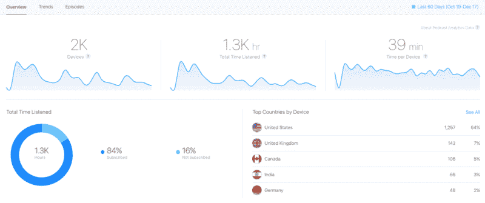
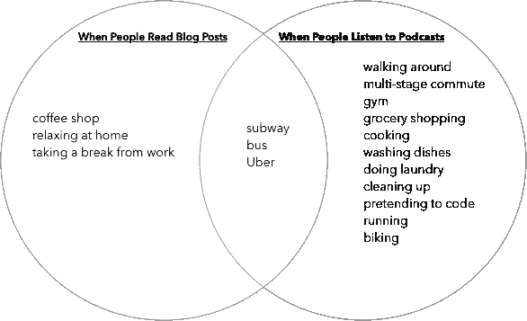
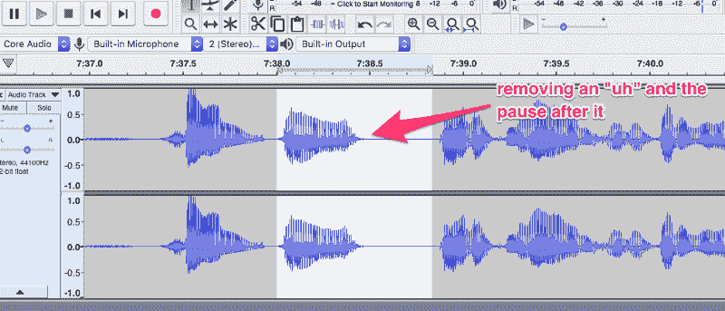
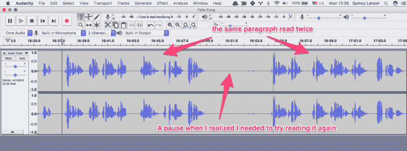
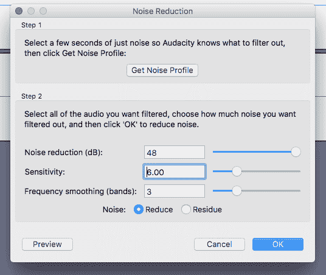
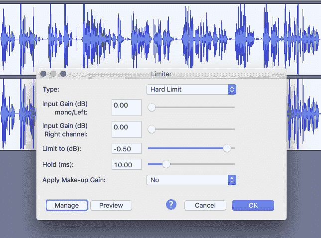
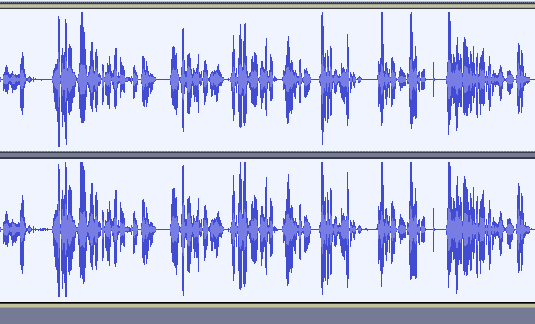

# 如何开始播客-录制和发布的逐步指南

> 原文：<https://www.freecodecamp.org/news/a-month-ago-i-knew-nothing-about-podcasting-50-000-downloads-later-heres-what-i-ve-learned-2d7082a28f27/>

播客有一个时刻。

截至 2019 年，大约有四分之一的美国人每月听播客。他们听得很多。每月 20 集左右。

因此，越来越多的人投入时间和精力制作播客。现在，甚至像雷德·霍夫曼这样的亿万富翁也在创建播客。

播客已经成为分享故事、进行采访和帮助人们在旅途中学习的强大媒体。

苹果甚至发布了播客分析的重大升级，这是十年来播客生态系统的最大变化。

A screenshot of freeCodeCamp’s data on Apple’s beta Podcast Analytics tool. These data only cover listeners who have iOS 11 installed on their phones, but they’ll become more useful as more people upgrade.

## 我如何决定播客是否适合 freeCodeCamp 社区

freeCodeCamp 是一个软件开发人员和培训开发人员的全球社区。

每个月都有数百万人来 freecodecamp.org 旅游——大部分是通过他们的笔记本电脑。我想找到一种方法来帮助他们在手机上学习更多的编程和技术。

嗯，在手机上编码很难。无论如何，人们经常忙于做通勤或锻炼之类的事情，以至于没时间看手机。但是有了播客，他们可以纯粹通过听来学习——不需要看屏幕。

A Venn Diagram from [Jeff Meyerson](https://www.freecodecamp.org/news/a-month-ago-i-knew-nothing-about-podcasting-50-000-downloads-later-heres-what-i-ve-learned-2d7082a28f27/undefined)’s article on why [if you like blogging, you should try podcasting](https://medium.freecodecamp.org/if-you-like-blogging-you-should-try-podcasting-heres-how-to-get-started-a5907ce7fe46).

另外，你可以下载播客。因此，当你在飞机上或地铁上，没有互联网接入时，它们是一种理想的学习方式。

所以在几个朋友的鼓励下——包括《软件工程日报》的主持人杰夫·梅尔森，我最终决定创建一个播客。

我喜欢听有声书——尤其是当原著作者阅读他们的作品时。所以我决定采用一种我称之为“迷你有声读物”的格式

我们已经有数百名投稿人的文章可供参考。所以我联系了这些个人故事的作者。我问他们是否有兴趣将他们在科技行业学到的经验与更广泛的受众分享。

其结果是短短 10 分钟的播客，充满了智慧和洞察力。

因为这些都是很容易让人暴饮暴食的，我决定[一次出版前 6 集](https://medium.freecodecamp.org/the-first-6-episodes-of-the-new-freecodecamp-podcast-ready-for-you-to-binge-on-e9391055edc0)。从那以后，我每周一都会发布一集。

## 我是如何学会做这一切的

所以现在我有了一点制作播客的经验。我很高兴分享我是如何记录和编辑这些的。

我希望开发者社区中更多的人会发布播客。有这么多要谈的，仍然相对较少的开发人员谁播客。

我从阅读 [Code 新手播客](https://www.codenewbie.org/podcast)主持人[萨隆·伊特巴雷克](https://www.freecodecamp.org/news/a-month-ago-i-knew-nothing-about-podcasting-50-000-downloads-later-heres-what-i-ve-learned-2d7082a28f27/undefined)的[综合播客指南](https://medium.com/@saronyitbarek/everything-i-learned-about-podcasting-at-the-podcast-movement-4366c1fc4aac)开始。

[Edaena Salinas](https://twitter.com/edaenas) 主持[科技女性秀](https://thewomenintechshow.com/)，她给了我很多指导。她建议我购买以下硬件:

*   一个[音频技术公司 ATR2100-USB 心形动圈 USB/XLR 麦克风](https://www.amazon.com/gp/product/B004QJOZS4/ref=as_li_tl?ie=UTF8&camp=1789&creative=9325&creativeASIN=B004QJOZS4&linkCode=as2&tag=out0b4b-20&linkId=112c3d876b904ed55268820208990fbd)
*   一个[舞台上的泡沫球型麦克风挡风玻璃](https://www.amazon.com/gp/product/B0002GXF8Q/ref=as_li_tl?ie=UTF8&camp=1789&creative=9325&creativeASIN=B0002GXF8Q&linkCode=as2&tag=out0b4b-20&linkId=4fbb97ec4908ee9d1cc6ad231f6bc580)，充当一个 pop 过滤器

我得到了亚马逊 Prime 的一周试用，并订购了这些。两天后他们到了，我开始录音。

我试着使用 MacOS 免费提供的软件工具:Quicktime 用于录音，Garage Band 用于编辑。但是我很快发现,[Audacity](http://www.audacityteam.org/download/)——一个免费的开源声音编辑器——更适合这两项任务。

请注意，与大多数播客相比，freeCodeCamp 播客非常简约。这是一个人阅读他们写的文章，并谈论它。没有广告，介绍，或结尾。

因为我们不采用采访或小组讨论的形式，所以只需要管理一个麦克风。我们不必担心麦克风之间的音量差异、背景噪音和糟糕的 Skype 通话音质等问题。因此，如果你用这个作为你自己播客的指南，并使用多麦克风格式，你的 milage 可能会有所不同。

## 第一步:记录

孩子们上床后，我找了一个安静的房间，然后开始录音。

关于录音，我学到的主要东西是:如果我屠宰一个句子或在句子之间说一个像“嗯”这样的停用词，我应该立即停止说话。这让我在重新开始之前有时间停下来重新集中注意力。

这使得编辑过程更加容易。我只需在波形中寻找长时间的停顿，就能知道某个部分需要特别注意。

Manually highlighting an “uh” stopword in Audacity and deleting it and the pause that follows it.

## 第二步:编辑你的录音

我一口气听完了整段录音，以确保一切听起来都是正确的，并且没有留下任何重复的录音。

我消除长时间的停顿。暂停不应该超过一秒钟，除非有重大的原因。停顿也可以用于过渡，但应该只有一两秒钟长，否则听众会走神。

我总是在完成编辑后创建第二个保存文件。这是因为我接下来要做的声波转换无法撤销。

## 第三步:消除噪音

如果背景中有噪声，您可以使用降噪效果将其移除。你应该首先找到一小段除了背景噪音什么都没有，选择它，并创建一个“噪音配置文件”

然后，您可以重新运行降噪效果来消除噪音。

您需要试验这些级别，直到找到听起来恰到好处的级别。

## 第四步:放大

大多数播客都是混合的，尽可能的大声。所以我用了 Audacity 的放大效应。这将使整个播客始终响亮。这样，听众就不需要在听完别人的播客后调整音量，然后开始听 freeCodeCamp 的播客。

放大音轨的分贝数并没有神奇的数字。只要盯着它，试着让波形填满大部分空间。您可能需要多次控制+z，然后重试。

但是注意不要有太多的峰值。声音在几个地方达到峰值是可以的，但是太多的峰值会导致您的播客听起来微弱和失真。

## 第四步:限制

应用设置为-0.5 的限制器。这将防止声音出现峰值和“削波”，从而产生令人不快的噪音。相反，声音永远不会达到最大音量。

Pre-limiting, you can see that the sound bar occasionally touches the top and bottom edges. So I limit the volume to -0.5 decibels to keep the audio from clipping.

限制会稍微柔化声音，并减少您可能在放大步骤中引入的任何噪声。

After applying the limiter, the sound never quite peaks (touches the top and bottom edges). This prevents a nasty “clipping” sound that would otherwise occur.

## 第五步:添加音乐

我听的几乎每一个播客都有音乐的介绍和结尾——通常长度为 5 到 10 秒。

我试图找到知识共享零音乐(不需要署名)或容易获得许可的音乐。在我有限的搜索中，我找不到任何听起来合适的东西。所以我决定从一个乐队那里获得许可[,使用他们的一首歌作为 freeCodeCamp 的官方主题。](https://itunes.apple.com/us/album/sounds-of-wonder/468333942?i=468333963&app=itunes&ign-itsct=468333963-468333963&ign-itscg=0176&ign-mpt=uo%3D4)

我编辑了开头和结尾的特定片段，并[将它们放入 Audacity 文件](https://drive.google.com/drive/folders/1SITdelvLgzoGI9GgiIRcNTrJMrSwHV2K)中，这样我可以快速添加它们并将其移动到开头和结尾。

## 第六步:导出他们的 MP3 并发布出去

一些播客说，低至每秒 48 千比特的口语听起来很好，但对我来说这听起来太压缩了。所以我选择了 128 kbps，相当于每分钟 1 兆字节的音频。

我使用一个叫做 libsyn 的服务来发布这些内容，并把它们整合到 iTunes、Google Play、Stitcher、Pocketcasts、Soundcloud 和其他一些播客平台上。

我添加了详细的节目笔记，其中包含播客中提到的任何资源的链接、作者和读者的致谢以及播客的完整副本(就我而言，我可以通过将原始媒体文章重新格式化为明文来获得)。

然后我可以直接把听众发送到 freeCodeCamp 的 libsyn 页面上，这里有一个很好的按时间顺序排列的提要。

## 播客并不像你想象的那样需要很多时间

我可能会花大约 3 个小时来录制、编辑和上传每一集。

如果你采用的是面试的形式，你应该安排一些额外的时间来研究这个话题，更多地了解你面试的人。今年早些时候，我在我的 YouTube 直播系列中尝试了这一点，并获得了巨大成功。不过要注意的是，面试本身就是一种技能。我还没开始掌握它。

由于 freeCodeCamp 的“迷你有声读物”格式，文章的原作者往往有兴趣自己阅读。这使得播客更加个性化。

这些文章中的许多已经被观看了数十万次，并在主要新闻网站上联合发布。通过几个月后重温他们的文章，作者有机会阅读他们最喜欢的评论，并反思自他们发表以来发生了什么变化。

例如， [Bill Sourour](https://www.freecodecamp.org/news/a-month-ago-i-knew-nothing-about-podcasting-50-000-downloads-later-heres-what-i-ve-learned-2d7082a28f27/undefined) 的文章“[我仍然为之感到羞耻的代码](https://medium.freecodecamp.org/the-code-im-still-ashamed-of-e4c021dff55e)”引发了关于开发者道德的更广泛的公共讨论，而当时许多科技公司[正在做一些可怕的或完全违法的事情](https://medium.freecodecamp.org/dark-genius-how-programmers-at-uber-volkswagen-and-zenefits-helped-their-employers-break-the-law-b7a7939c6591)。

当他阅读他为 freeCodeCamp 播客撰写的文章时，他能够添加更多的细节并谈论其后果。

### 你应该为 freeCodeCamp 播客做贡献，或者开一个你自己的播客。

总的来说，我发现播客是非常有益的。我很乐观，我们可以从 freeCodeCamp 社区获得更多的人来帮助制作这些，我们可以比一周一次更频繁地发布——同时尽可能保持高质量。

如果你有机会[听 freeCodeCamp 播客](http://freecodecamp.libsyn.com/)，我很想听听你的想法。如果你有自己的播客，我欢迎你对我们如何进一步改进提出任何建议。

播客已经存在了十多年，现在终于迎来了它的光辉时刻。

我很高兴能成为这场运动的一部分。

我希望你能加入我，在 2019 年开始播客。

我只写编程和技术。如果你在推特上关注我，我不会浪费你的时间。？