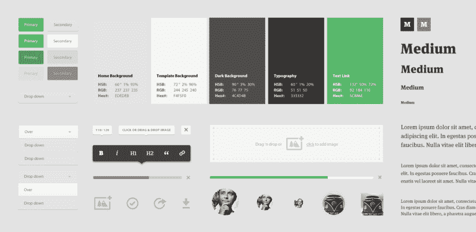

# 更无缝的工作流风格指南，有助于更好的设计和开发

> 原文：<https://www.freecodecamp.org/news/a-more-seamless-workflow-style-guides-for-better-design-and-development-639fc55be28c/>

阿什·康诺利

# 更无缝的工作流风格指南，有助于更好的设计和开发

风格指南可以给整个工作流程带来很多好处，从设计到构建。

#### 简而言之…

在设计阶段，风格指南鼓励视觉识别的一致性，并帮助保持界面系统尽可能的符合逻辑，这有助于更好的 UX。

在开发阶段，它们简化了从设计到开发的过渡，因为它们最小化了构建错误，并有助于鼓励模块化开发的最佳实践。

除此之外，风格指南可以转换成“生活前端风格指南”,这有助于使未来的更新和网站维护更易于管理，由于一个更干净，更模块化和结构化的代码库。

另外，风格指南和生活前端风格指南都可以作为一个项目的可交付成果，以及一种更好地向你的团队和客户传达 UI 身份的方式。

#### 设计界面

当设计一个界面时，它需要具有一致性和逻辑性。我们需要创建一个清晰的分类，并提供适当的启示，以提供最佳的用户体验(UX)。或者简单地说，**界面需要有意义。**

当我们设计一个界面时，我们不是在设计页面或面板，我们是在创建一个由元素和组件组成的设计系统，这些元素和组件将被用于各种组合中。如果我们牢记这一点，我们就能创建一个真正流畅灵活的界面系统。

我们可以使用风格指南将我们的设计抽象和分解成模块化的可扩展元素和组件，它们可以一起工作形成一个和谐的系统。

当界面不被认为是一个设计系统时，我们最终会得到混乱和不一致的界面，让用户感到困惑:

#### 什么是风格指南？

一个风格指南清楚地展示了所有的界面元素和组件是如何在视觉上表现出来的。它本质上是用户界面(UI)的主参考。

值得一提的是，风格指南可以有很多名字，比如[风格瓷砖](http://styletil.es/)、[界面清单](http://bradfrost.com/blog/post/interface-inventory/)和[模式库](https://boagworld.com/design/pattern-library/)。毫无疑问，在这篇博文发表的时候，将会有几个新的术语来描述一个风格指南！

以下是《Medium.com 风格指南》刚推出时的一个小例子([摘自 Teehanlax 案例研究](http://www.teehanlax.com/story/medium/)):

Medium’s style guide

正如你所看到的，它显示了各种界面元素，如按钮，下拉菜单，排版层次，工具提示，调色板等。你一眼就能感受到界面的视觉特性。您可能会注意到，这似乎没有他们网站上使用的所有界面元素，但这是一个很好的例子。

风格指南对于保持界面视觉识别的一致性是至关重要的，它对你的团队和任何使用你的品牌或界面的人都是有益的。

我们可以利用原子设计原理来增强这种方法。[原子设计](http://patternlab.io/about.html)打破了这个设计系统公理，给了我们核心原则，使创建设计系统尽可能清晰简单。

#### **什么是**原子设计**？**

原子设计是一种用来构建网页设计系统的方法论
—布拉德·弗罗斯特

原子设计从头开始。它从设计基本元素开始，比如表单标签、输入、段落、标题和按钮。然后，基本元素组形成组件，组件组形成模板，模板组形成页面。

一个 GIF 中的原子设计:

原子设计的伟大之处在于你不必严格遵循它。我们不必像原子和分子那样给元素和组件命名，但我们可以采用这些核心原则，并将其应用于设计一个清晰简洁的风格指南。

#### 为什么要使用风格指南？

风格指南给我们带来了以下好处:

*   鼓励设计师将界面视为一个有机的、可扩展的、灵活的系统。
*   鼓励视觉标识的一致性，并帮助保持界面分类/系统尽可能的符合逻辑，从而实现更好的 UX。
*   使界面设计更加系统化和基于组件。
*   有助于将接口标识快速传达给团队中的其他人或您的客户。
*   给我们一个整体的视角，让我们很容易发现任何不协调的界面元素。
*   让开发者很清楚地拿起并开始构建。
*   对客户有益，无论是作为项目可交付成果还是作为交流流。

> 总的来说，如果我们在界面设计中考虑到风格指南，它们将帮助我们创建一致的、更加用户友好的界面，因为它们使设计更加有条理和清晰，这将为用户带来更好的体验。

#### **设计师已经这样做了**

一个好的设计师毫无疑问会以这种方式考虑界面，然而，使用风格指南有助于更好地向他人传达界面身份和 UX。设计师可能知道为什么特定的按钮动作要用特定的颜色，但是如果没有人知道为什么，那就没什么好处了。拥有一个风格指南可以帮助其他人更好地理解设计者使用的 UI 和基本原理。

#### **风格指南不再耗费时间**

制作一份风格指南只需要很少的时间。一个好的设计师应该已经解决了所有的界面问题，建立了元素的层次结构以及如何使用它们，所以把这些元素放到一个风格指南中只需要很少的时间。即使对于最小的项目，风格指南也是有益的。

#### **那么，风格指南是如何在设计和前端开发之间架起桥梁的呢？**

当给开发者一个网页设计或应用程序来构建时，他们通常会得到包含网站或应用程序页面设计的设计文件。他们需要解释这个设计，彻底地分析和规划构建，识别界面元素和组件，试图理解 UI 分类。本质上是试图理解设计系统。

#### **但是，设计师不是已经这么做了吗？**

理想情况下，设计者在进行设计时会考虑到所有这些界面元素。他们已经确定了主要的行动号召是什么样子，特定类型的按钮动作使用什么颜色，不同屏幕尺寸下字体大小会发生什么变化，以及不同屏幕尺寸下组件的布局会如何变化。

如果开发者必须分析和解释界面，那么时间就被浪费了。除此之外，当开发人员试图理解设计时，可能会犯错误，可能会忽略细微差别。

> 不管是有意识的还是无意识的，设计师已经创建了开发者想要建立的设计系统，并且这个设计系统需要被清晰的交流。

我敢肯定，每个开发人员构建一个组件，只是为了让设计人员指出这不是他们想要的工作方式或行为方式。风格指南有助于改善界面的交流，并有助于避免构建过程中的错误。

#### **风格指南如何帮助前端开发？**

在设计阶段使用风格指南可以简化构建的过渡。理想情况下，设计师和开发人员应该定期沟通，但是，如果设计师可以为新网站或应用程序提供清晰的设计风格指南，那么开发人员就可以快速看到所有基本元素和组件。然后，他们可以快速地、有条不紊地进行构建，尽可能减少混乱和不确定性。

风格指南与现代前端指南和基于组件的 CSS 结构无缝协作，例如 [BEM](http://bem.it/) 、 [CSS 指南](http://cssguidelin.es/)和[倒三角形 CSS](http://www.creativebloq.com/web-design/manage-large-scale-web-projects-new-css-architecture-itcss-41514731) ，因为它们共享相同的原则——首先构建或设计基本元素，然后构建或设计更复杂、可重用的组件。

这意味着我们的风格指南可以很容易地转换成干净的，模块化的，基于组件的 CSS！

Like a glove!

在这个阶段，开发人员所要做的就是用 HTML 和 CSS 构建样式指南，创建一个**前端样式指南。**

这里有一些前端风格指南的例子:
[Codepen](http://codepen.io/guide)
[Code For America by clear left](http://codeforamerica.clearleft.com/)
[Mozilla Firefox](https://www.mozilla.org/en-US/styleguide/websites/sandstone/buttons/)

#### **一个小问题……**

保持前端风格指南与实时网站上使用的代码一致可能会很棘手。如果我们需要更新一个组件的标记，而这个组件存在于前端风格指南和网站上，**作为完全独立的代码，**我们正在为自己创造更多的工作。因此，前端风格指南可能会被忽视，没有得到更新，因为它应该和陷入失修。

我们可以使用带有标记模板的工具来解决这个问题，比如[手柄](http://handlebarsjs.com/)、[灰尘. js](http://www.dustjs.com/) 或[树枝](http://twig.sensiolabs.org/)。这些工具允许我们在我们喜欢的地方输出标记，但是它们总是从一个源链接。**这允许我们创建一个*活的*前端样式向导。**

#### **生活前端风格指南**

live 前端样式指南与前端样式指南相同，但它显示的元素和组件是 live 网站或应用程序页面上所使用或将要使用的内容的精确表示。

如果我通过改变按钮的标记或 CSS 来更新按钮元素，这种改变会立即反映在网站或应用程序上。

#### 为什么要在开发中使用一个活的前端风格指南？

我们可以在设计阶段看到样式指南的好处，但是为什么要创建一个**‘live’**代码版本的样式指南，为什么要创建一个活的前端样式指南呢？它们通过以下方式提供帮助:

*   使建立网站更有条理和基于组件。
*   鼓励模块化、基于组件的 CSS，以获得更简洁、更快速的代码库。
*   使响应测试和一般调试更加容易。
*   允许我们在开发中利用原子设计原则。
*   code 生成的代码使得在其他项目中重用标记和 CSS 变得更加容易。
*   让所有的界面元素“活”在一个页面上使得更新和重新设计更加容易。
*   允许轻松快速地识别界面不一致。
*   允许我们检查所有组件是否可以在一个页面上一起工作，而没有任何代码冲突。
*   为标记和用户界面引用提供母版页。
*   可用作客户和项目的可交付成果。

额外的好处是，前端风格指南有时可以帮助不了解代码的设计师开始了解他们可能如何开始编码

#### **总结—风格指南驱动的工作流**

风格指南和生活风格指南帮助我简化和集中工作流程。

在设计阶段，它们有助于识别界面的不一致性，并提醒我界面是灵活的设计系统。在从设计到开发的过渡过程中，它们有助于最大限度地减少错误并加快移交。在开发阶段，风格指南可以无缝地嵌入到 HTML 和 CSS 中，因为它们与前端指南和基于组件的 CSS 结构共享主要原则。使用生活方式指南，然后使更新和重新设计尽可能容易和易于管理。

希望一个风格指南工作流程也能让你受益，但是和所有的 web 和设计一样，有一千种方法来完成一个项目。如果你找到了适合你的工作流程，继续使用它！

**附加链接:**
[销售力量—闪电设计系统](https://www.lightningdesignsystem.com/)
[安娜·德本汉姆—风格指南](http://styleguides.io/)
[萨曼莎·沃伦—风格瓷砖](http://styletil.es/)
[布拉德·弗罗斯特— Patternlab](http://patternlab.io/)

如果你想了解更多关于风格指南和前端开发的信息，欢迎在 twitter 上关注我！？