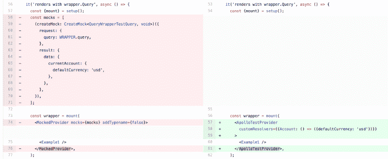

# 一种模拟 GraphQL 数据的新方法

> 原文：<https://www.freecodecamp.org/news/a-new-approach-to-mocking-graphql-data-1ef49de3d491/>

#### 我们如何对 Stripe 的组件测试和示例做出反应

GraphQL 对前端开发人员的主要好处一直是出色的工具和开发人员体验。其中最主要的是能够轻松模仿你的数据。API 模仿是至关重要的，因为它可以让你编写和测试你的组件，而不必运行你的整个应用后端。当后端实现尚未完成时，您甚至可以基于模拟的模式开发 UI 组件，从而加快开发速度。

在过去的几个月里， [Stripe](https://stripe.com/) 的仪表板平台团队一直在集成 [GraphQL](https://graphql.org/) 和 [Apollo](https://www.apollographql.com/) 用于 Stripe 仪表板中的数据获取。我们的目标是为整个公司的产品开发人员创造一个流畅且高效的体验。其中最重要的一个方面是让测试尽可能简单。为了实现这一结果，我们提出了一些新的模式，允许我们用极少量的代码模拟数据。

我会告诉你我们如何:

1.  整个模式的模拟 GraphQL 数据
2.  基于每个组件定制我们的模拟
3.  仅用一行代码模拟加载和错误状态
4.  将这些模拟集成到我们的 Jest 测试和组件浏览器中

总之，这些新工具允许我们在测试和示例中以我们需要的所有状态呈现依赖于 GraphQL 数据的 UI 组件，而无需编写代码来处理特定的请求和响应。

所以让我们开始吧！我们在这篇文章中包含了所有需要遵循的代码。我们欢迎来自社区的人发布基于我们方法的`npm`包。

特别感谢我的同事[艾萨克·海伦达](https://twitter.com/hellendag)、黄锐民和杰森·迪沃克，他们为这些工具和这篇文章做出了贡献。

How we reduced our component testing boilerplate by eliminating per-request mocks and using a mocked schema.

### 背景:用 graphql-tools 模拟数据

有各种各样的工具可以让基于 GraphQL 模式和查询的模拟请求变得非常容易。

有最初的 [graphql-tools](https://www.apollographql.com/docs/graphql-tools/mocking.html) 库、 [graphql-faker](https://github.com/APIs-guru/graphql-faker) CLI，现在甚至 [Apollo 服务器也内置了嘲讽](https://www.apollographql.com/docs/apollo-server/features/mocking.html)。我偏爱 graphql-tools，因为它最容易定制。

在进入我真正感兴趣的每组件定制的新内容之前，我将向您展示基本的模拟设置。

以下是如何使用 graphql-tools 快速创建并运行模拟模式的方法: