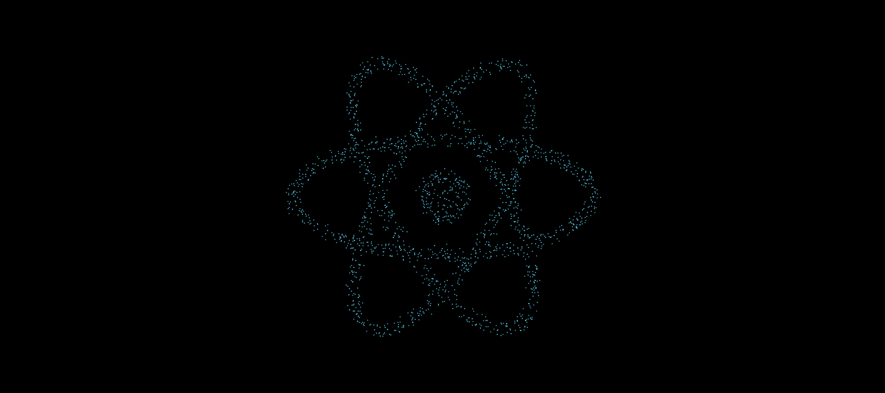
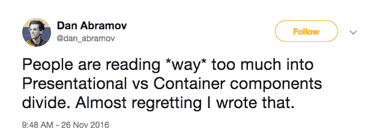

# 一种新的反应式组件设计方法

> 原文：<https://www.freecodecamp.org/news/a-new-approach-to-react-component-design-2bf76a87add1/>

by Austin Malerba

# 一种新的反应式组件设计方法

2015 年，Dan Abramov 写了一篇文章，[presentation and Container Components](https://medium.com/@dan_abramov/smart-and-dumb-components-7ca2f9a7c7d0)，一些新来者将其误解为戒律。事实上，我自己偶然发现了这篇文章，许多人也赞同它的教导，我想，*这一定是在组件之间分离关注点的最好方法*。

但是，丹·阿布拉莫夫本人后来向社区发表讲话，说他坚持自己概述的设计模式。

在使用 React 的一年多时间里，我无意中发现了自己的设计模式，在这里我将尝试将它们形式化。不要完全相信这些观点，它们只是我自己的观察，我发现它们很有建设性。

### 逃离二分法

很长一段时间以来，组件被广泛地分为智能的或无智能的、容器的或表示的、有状态的或无状态的、纯的或不纯的。这里有很多术语，但它们的意思都差不多。智能组件知道如何将应用程序结合在一起，而非智能组件只是接收数据并呈现给最终用户。这是一个有用的区别，但我发现自己在设计组件时并不是这么想的。

容器与表示思维模式的问题在于，它太过努力地根据状态、逻辑和组件内部工作的其他方面来定义组件职责。

通过推迟实现细节并根据**组件接口**进行思考，组件设计会更好。考虑一个组件应该允许什么样的**定制**以及一个组件应该包含什么样的**隐式和显式依赖**尤为重要。

### 介绍三分法

三分法？这算是一个词吗？我不知道，但你明白了。我开始认为 React 组件属于三个箱子中的一个。

#### 通用组件

这些组件可以在任何应用程序中多次使用。

这些组件:

*   **应该是可重复使用的**
*   应该是**高度可定制的**
*   应该**不知道应用程序特定代码**包括型号、商店、服务等。
*   **是否应该最小化对第三方库的依赖**
*   应该很少在应用程序中直接使用
*   应被用作全球组件的**构建模块**
*   可能以“Base”后缀结尾(如 ButtonBase、ImageBase)

这些是与应用程序无关的基本组件，不一定要直接在您的视图组件中使用，因为它们通常可定制性太强。在视图组件中直接使用它们意味着大量复制和粘贴同一个锅炉板。您还可能面临开发人员滥用组件的高度可定制性的风险，从而在您的应用程序中产生不一致的体验。

#### 全球组件

这些组件可以在一个应用程序中多次使用。

这些组件:

*   **应该是可重复使用的**
*   应**最低可定制**
*   可以使用**特定于应用的代码**
*   是否应该**实现通用组件**，限制它们的可定制性
*   应该用作视图组件的**构建块**
*   通常与模型实例(如 DogListItem、CatCard)一对一地联系在一起

这些组件在您的应用程序中是可重用的，但是不容易转移到其他应用程序，因为它们依赖于应用程序逻辑。这些是视图组件和其他全局组件的构建块。

它们应该是最低限度可定制的，以确保整个应用程序的一致性。应用程序不应该有三十种不同的按钮变体，而应该有少量不同的按钮变体。这应该通过采用一个高度可定制的通用 ButtonBase 组件，并以全局按钮组件的形式将样式和功能融入其中来实现。全局组件通常采用另一种形式来表示领域模型数据。

#### 查看组件

这些组件在您的应用程序中只使用**一次。**

这些组件:

*   难道**不应该**关心可重用性吗
*   有可能**管理状态**
*   领取**最小道具**
*   应该将全球组件(可能还有通用组件)联系在一起
*   通常**解析申请路线**
*   通常维护一个专用的视口不动产地块
*   通常有大量的依赖项
*   应该是您应用程序的**构建模块**

这些是应用程序的最高层组件，它们将可重用组件甚至其他视图粘合在一起。这些通常是解析路线的组件，并可能以页面级组件的形式显示。他们状态重，道具轻。这些是丹·阿布拉莫夫认为的容器组件。

#### 承诺按钮

让我们来看看承诺按钮的通用和全局实现，并看看它们是如何比较的。除非 onClick 处理程序返回承诺，否则承诺按钮的行为就像普通按钮一样。在返回承诺的情况下，按钮可以根据承诺状态有条件地呈现内容。